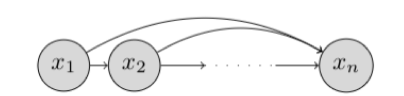

# Autoregressive models
We assume we are given access to a dataset:
$$
\mathcal{D} = \{ \mathbf{x}_1, \mathbf{x}_2, \dots, \mathbf{x}_m \}
$$
where each datapoint is n-dimensional. For simplicity, we assume the datapoints are binary.
$$
x_i \in \{0,1\}^n
$$
## Representation
If you have n random variables:
$$
X_1, X_2, \dots, X_n
$$
then their joint probability can be written as a product of conditional probabilities:
$$
P(X_1, X_2, \dots, X_n) = P(X_1) \cdot P(X_2 \mid X_1) \cdot P(X_3 \mid X_1, X_2) \cdot \dots \cdot P(X_n \mid X_1, X_2, \dots, X_{n-1})
$$
In words:
> The probability of all n variables taking particular values equals:
> → the probability of the **first variable**,  
> → times the probability of the **second variable given the first**,  
> → times the probability of the **third variable given the first two**,  
> → and so on, until the n-th variable.

By this chain rule of probability, we can factorize the joint distribution over the n-dimensions as:

$$
p(\mathbf{x}) = \prod_{i=1}^n p(x_i \mid x_1, x_2, \dots, x_{i-1}) = \prod_{i=1}^n p(x_i \mid x_{<i})
$$

where

$$
x_{<i} = [x_1, x_2, \dots, x_{i-1}]
$$

denotes the vector of random variables with index less than i.

The chain rule factorization can be expressed graphically as a Bayesian network.

Such a Bayesian network that makes no conditional independence assumptions is said to obey the _autoregressive_ property. The term _autoregressive_ originates from the literature on time-series models where observations from the previous time-steps are used to predict the value at the current time step. Here, we fix an ordering of the variables x1, x2, …, xn and the distribution for the i-th random variable depends on the values of all the preceding random variables in the chosen ordering x1, x2, …, xi−1.

If we allow for every conditional p(xi|x<i) to be specified in a tabular form, then such a representation is fully general and can represent any possible distribution over n random variables. However, the space complexity for such a representation grows exponentially with n.

To see why, let us consider the conditional for the last dimension, given by p(xn|x<n). In order to fully specify this conditional, we need to specify a probability for 2^(n−1) configurations of the variables x1, x2, …, xn−1. Since the probabilities should sum to 1, the total number of parameters for specifying this conditional is given by 2^(n−1)−1. Hence, a tabular representation for the conditionals is impractical for learning the joint distribution factorized via chain rule.

In an autoregressive generative model, the conditionals are specified as parameterized functions with a fixed number of parameters. Specifically, we assume that each conditional distribution corresponds to a Bernoulli random variable. We then learn a function that maps the preceding random variables to the parameter (mean) of this Bernoulli distribution. Hence, we have:

$$
p_{\theta_i}(x_i \mid x_{<i}) = \text{Bern} \left( f_i(x_1, x_2, \dots, x_{i-1}) \right)
$$

where the function is defined as:

$$
f_i : \{0,1\}^{i-1} \to [0,1]
$$

and theta_i denotes the set of parameters used to specify this function.
This function takes in a vector of size (i-1) where each element is a 0 or a 1, and outputs a scalar bit.

The total number of parameters in an autoregressive generative model is given by:

$$
\sum_{i=1}^n \left| \theta_i \right|
$$
