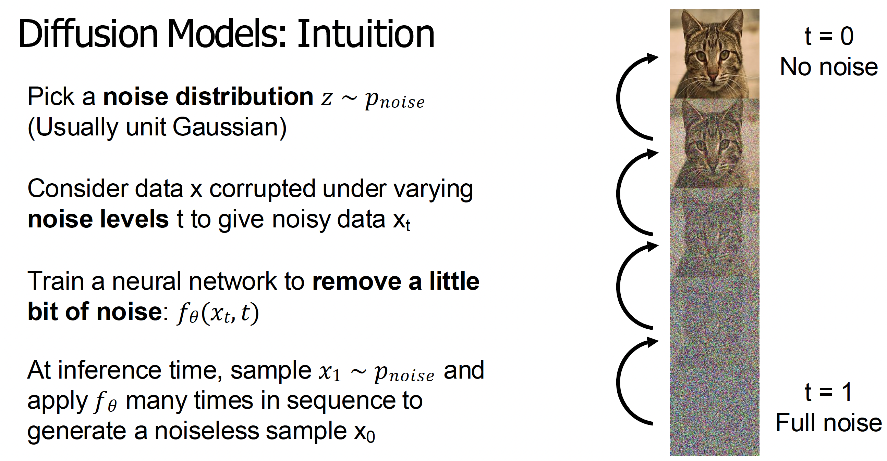
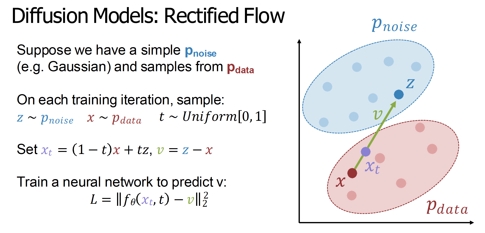
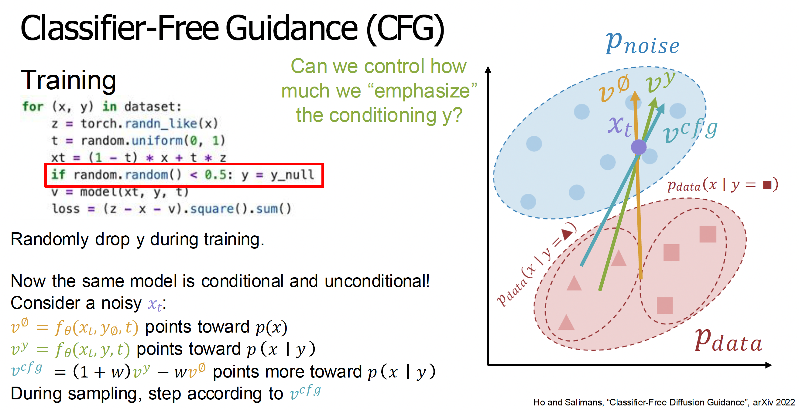
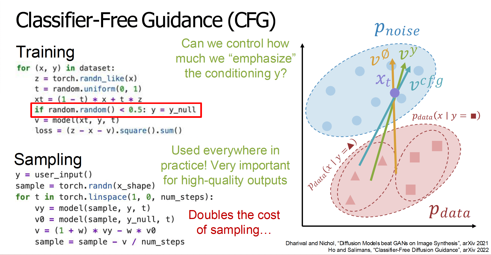
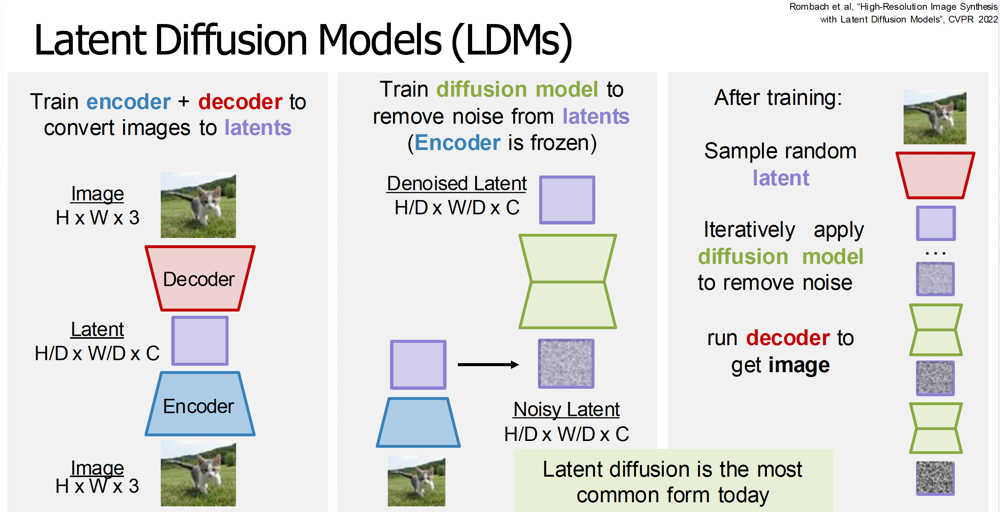

# Diffusion Models from an image generation perspective

Diffusion models have multiple mathematical formalisms with different notation and terminology. We provide an intuitive overview focusing on rectified flow models.

## Intuition

Like GANs, diffusion models convert noise samples $z$ into data samples $x \sim p(x)$, but use an iterative, implicit process rather than a direct mapping. The key constraint is that the noise $z$ must have the same shape as the data.

We create noisy versions of data using a noise level $t \in [0,1]$ where $t=0$ is clean data and $t=1$ is pure noise from $p(z)$ (typically Gaussian). The network learns to incrementally denoise: given a noisy sample at level $t$, it predicts how to remove a small amount of noise. 

Then at inference time what we're going to do is do an iterative procedure where we first draw a noise sample directly from our noise distribution $p(z)$, and then iteratively apply the neural network to remove noise from that sample one at a time.

## Rectified Flow Models

We're going to jump from general diffusion models to a particular category of diffusion models called Rectified Flow Models.
In rectified flow, we have distributions $p_{\text{noise}}$ (simple, typically Gaussian) and $p_{\text{data}}$ (complex, the true data distribution). At each training iteration, we sample $z \sim p_{\text{noise}}$, $x \sim p_{\text{data}}$, and $t \sim \text{Uniform}(0,1)$. We define the velocity vector $v = z - x$ pointing from $x$ to $z$, and create a noisy sample via linear interpolation: $x_t = (1-t)x + tz$. The network $f_\theta(x_t, t)$ learns to predict $v$.

### Training and Inference

Unlike GANs, diffusion models have a clear, interpretable loss function (typically MSE) that decreases during training, making it easy to monitor progress. 

At inference, we choose $N$ steps (typically $N=50$ for rectified flow), sample $x_1 \sim p(z)$ (pure noise), then iteratively denoise by marching backwards from $t=1$ to $t=0$: at each step, compute $v_t = f_\theta(x_t, t)$ and update $x_t$ by taking a step along the predicted velocity vector. While more complex than GANs' single forward pass, what you've gained is training sanity (no loss curves in GANs, instability in training, etc.) and scaling well to large datasets and models.

## The Core Problem in Generative Modeling

The core challenge in generative modeling is learning to associate samples from a known prior $p(z)$ with samples from the unknown data distribution $p_{\text{data}}(x)$, without having explicit pairings at training time. Different approaches solve this differently: VAEs try to force $z$ to be sampleable (with limited success), GANs learn the mapping through distribution matching (the discriminator provides a signal indicating whether generated samples match the data distribution, and the generator learns a direct feedforward mapping $z \to x$ through adversarial training), and diffusion models learn through integrating flow curves (they learn velocity fields that define paths from noise to data, and generation involves iteratively integrating along these learned curves). All aim to learn the association $z \to x$ implicitly. 

## Conditional Generative Modeling

We almost always care about conditional generative modeling, where we generate samples from $p_{\text{data}}(x|y)$ given a conditioning signal $y$ (e.g., text prompts, input images). In rectified flow, this is straightforward: the model takes $(x_t, t, y)$ as input and predicts $v_y = f_\theta(x_t, t, y)$.

### Classifier-Free Guidance

Naively trained conditional models often don't follow the conditioning signal strongly enough. **Classifier-free guidance (CFG)** addresses this by training the model to handle both conditional and unconditional generation. During training, we randomly drop the conditioning $y$ (set to $\emptyset$) with probability 50%, forcing the model to learn both $v_y = f_\theta(x_t, t, y)$ (pointing toward $p_{\text{data}}(x|y)$) and $v_\emptyset = f_\theta(x_t, t, \emptyset)$ (pointing toward $p_{\text{data}}(x)$). At inference, we use a weighted combination: $v_{\text{CFG}} = (1+w)v_y - w v_\emptyset$ where $w \geq 0$ controls the strength of conditioning (higher $w$ = stronger conditioning). This doubles inference cost (requires two forward passes) but significantly improves output quality and conditioning adherence. 

## Latent Diffusion Models

The most popular form of diffusion models are **latent diffusion models**, which operate in a learned latent space rather than raw pixel space. This is a multi-stage procedure:

1. **Encoder-decoder training**: First, train an encoder that maps images to a latent space (typically $8 \times 8$ spatial downsampling, converting $3$ to $C$ channels, e.g., $16$). The encoder-decoder is usually a VAE, but VAEs produce blurry reconstructions that would bottleneck diffusion quality.

2. **Adding a discriminator**: To fix blurry outputs, add a discriminator after the decoder, creating a VAE-GAN hybrid that produces sharper reconstructions.

3. **Diffusion in latent space**: With the encoder frozen, train a diffusion model on the latent space. At inference, sample a noisy latent, denoise it through the diffusion model, then decode to get the final image.

The modern state-of-the-art pipeline combines all three: a VAE (encoder-decoder), a GAN (discriminator for sharpness), and a diffusion model (generation in latent space).

## LDM Architecture

A typical LDM consists of three components: an **encoder** (compresses images to latent space), a **denoising backbone** (removes noise in latent space), and a **decoder** (reconstructs images from clean latents). Conventionally, the backbone is a U-Net (CNN with skip connections), but **Diffusion Transformers (DiTs)** replace it with a Vision Transformer architecture made of stacked transformer blocks. Like U-Net-based LDMs, DiTs operate on patched latent representations from the VAE encoder, not raw pixels. 

## Applications

Text-to-Image and Text-to-Video are the most popular applications of LDMs.

## Mathematical Formalisms

Diffusion models have multiple mathematical formalisms. In rectified flow, we sample $x \sim p_{\text{data}}(x)$, $z \sim p(z)$, $t \sim p(t)$, create $x_t = (1-t)x + tz$, and train the network to predict $v_{\text{gt}} = z - x$ with loss $\mathcal{L} = \|v_{\text{gt}} - f_\theta(x_t, t)\|^2$.

More general diffusion formulations vary in how they compute noisy samples $x_t = \alpha(t)x + \beta(t)z$, among other factors.

This [blog](https://sander.ai/2023/07/20/perspectives.html) is excellent in describing the various perspectives on diffusion.

### Latent Variable Model Interpretation

Diffusion models can be viewed as latent variable models where unobserved noisy sequences $x_1, \ldots, x_T$ correspond to clean data $x_0$, similar to VAEs. Training maximizes a variational lower bound on $\log p(x)$.

### Score Function Interpretation

Diffusion models learn the **score function** $\nabla_x \log p_t(x)$— a vector field pointing toward high probability density— for different noise levels $t$. This provides a family of score functions for increasingly noisy versions of the data distribution.

### Stochastic Differential Equations Interpretation

Diffusion can be framed as solving stochastic differential equations (SDEs) that transport samples from noise to data distributions. This perspective enables more sophisticated sampling methods.