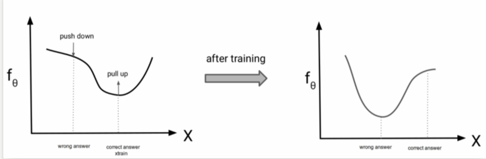

# Energy-Based Models

## Parameterizing Probability Distributions

Probability distributions $p(x)$ are a key building block in generative modeling. Building a neural network that ensures $p(x) \geq 0$ is not hard. However, the real challenge lies in ensuring that the distribution satisfies the normalization constraint: for discrete variables, the sum over all possible values of $x$ must equal 1, while for continuous variables, the integral over the entire domain must equal 1.

**Problem:** $g_\theta(x) \geq 0$ is easy. But $\sum_x g_\theta(x) = Z(\theta) \neq 1$ in general, so $g_\theta(x)$ is not a valid probability mass function. For continuous variables, $\int g_\theta(x) dx = Z(\theta) \neq 1$ in general, so $g_\theta(x)$ is not a valid probability density function.

**Solution:**

$$p_\theta(x) = \frac{1}{Z(\theta)} g_\theta(x) = \frac{1}{\int g_\theta(x) dx} g_\theta(x) = \frac{1}{\text{Volume}(g_\theta)} g_\theta(x)$$

Then by definition,

$$\int p_\theta(x) dx = \int \frac{1}{Z(\theta)} g_\theta(x) dx = \frac{Z(\theta)}{Z(\theta)} = 1$$

Here, $g_\theta(x)$ is the output of the neural network with parameters $\theta$ at input $x$. The **volume** of $g_\theta$, denoted as $\text{Volume}(g_\theta)$, is defined as the integral of $g_\theta(x)$ over the entire domain: $\text{Volume}(g_\theta) = \int g_\theta(x) dx = Z(\theta)$. It is a normalizing constant (w.r.t. $x$) but changes for different $\theta$. For example, we choose $g_\theta(x)$ so that we know the volume analytically as a function of $\theta$.

The **partition function** $Z(\theta)$ is the normalization constant that ensures a probability distribution integrates (or sums) to 1. It's called a "partition function" because it partitions the unnormalized function $g_\theta(x)$ into a proper probability distribution.

**Example:** $g_{(\mu, \sigma)}(x) = e^{-\frac{(x-\mu)^2}{2\sigma^2}}$

$$\text{Volume}(g_{(\mu, \sigma)}) = \int_{-\infty}^{\infty} e^{-\frac{(x-\mu)^2}{2\sigma^2}} dx = \sqrt{2\pi\sigma^2}$$

Therefore, the normalized probability density function is:

$$p_{(\mu, \sigma)}(x) = \frac{1}{\sqrt{2\pi\sigma^2}} e^{-\frac{(x-\mu)^2}{2\sigma^2}}$$

This is the standard normal (Gaussian) distribution with mean $\mu$ and variance $\sigma^2$.
Functional forms $g_\theta(x)$ need to allow analytical integration. Despite being restrictive, they are very useful as building blocks for more complex distributions.

**Note:** What we've been doing with autoregressive models, flow models, and VAEs are essentially tricks for composing simple functions that are normalized to build more complex probabilistic models that are by construction guaranteed to be normalized. These approaches avoid the intractability of computing the partition function for complex distributions by designing architectures where normalization is preserved through the composition of simple, analytically tractable components.

## Energy Based Models

We are going to formalize EBMs the following way:

$$p_\theta(x) = \frac{1}{\int e^{f_\theta(x)} dx} \cdot e^{f_\theta(x)}$$

$$p_\theta(x) = \frac{1}{Z(\theta)} \cdot e^{f_\theta(x)}$$

**Why $e^{f_\theta(x)}$ and not $f_\theta(x)^2$?**

Both $e^{f_\theta(x)}$ and $f_\theta(x)^2$ produce non-negative outputs, but we choose the exponential form for several important reasons:

1. **Additive Energy**: The exponential form allows us to work with additive energy functions. If we have $f_\theta(x) = f_1(x) + f_2(x)$, then $e^{f_\theta(x)} = e^{f_1(x)} \cdot e^{f_2(x)}$, which is a natural way to combine energy terms.

2. **Log-Probability Interpretation**: Taking the logarithm gives us $\log p_\theta(x) = f_\theta(x) - \log Z(\theta)$. This means $f_\theta(x)$ directly represents the unnormalized log-probability, making it easier to work with in practice.

3. **Gradient Properties**: The exponential function has the property that $\frac{d}{dx}e^{f(x)} = e^{f(x)} \cdot f'(x)$. This makes gradient-based learning more stable and interpretable.

4. **Numerical Stability**: The exponential function grows more smoothly than quadratic functions, which can lead to better numerical stability during training.

5. **Dynamic Range**: The exponential function can capture much larger variations in probability compared to quadratic functions. While $f_\theta(x)^2$ is bounded by the square of the function's range, $e^{f_\theta(x)}$ can represent probabilities that vary by many orders of magnitude.

6. **Statistical Mechanics Connection**: The exponential form follows from the Boltzmann distribution in statistical mechanics, where $p(x) \propto e^{-E(x)/kT}$, where $-E(x)$ is the energy of state $x$. Hence the name.

**Pros:**
Very flexible, can use any $f_\theta(x)$

**Cons:**
Sampling from $p_\theta(x)$ is hard. Evaluating and optimizing likelihood $p_\theta(x)$ is hard (learning is hard). Another con is there is no feature learning (but can add latent variables). EBMs also suffer from the curse of dimensionality - as the dimension of $x$ increases, the volume of the space grows exponentially, making it increasingly difficult to learn meaningful energy functions and sample efficiently.

Given two points $x_1$ and $x_2$, evaluating $p_\theta(x_1)$ or $p_\theta(x_2)$ requires calculating $Z(\theta)$. However, their ratio does not involve calculating $Z(\theta)$.

$$\frac{p_\theta(x_1)}{p_\theta(x_2)} = \frac{\frac{1}{Z(\theta)} \cdot e^{f_\theta(x_1)}}{\frac{1}{Z(\theta)} \cdot e^{f_\theta(x_2)}} = \frac{e^{f_\theta(x_1)}}{e^{f_\theta(x_2)}} = e^{f_\theta(x_1) - f_\theta(x_2)}$$

The partition function $Z(\theta)$ cancels out in the ratio, so we only need to evaluate the energy function at the two points and take their difference. This means we can determine which of $x_1$ or $x_2$ is more likely under our model without needing to compute the intractable partition function.

## Training EBMs with Contrastive Divergence

Let's assume we want to maximize $\frac{\exp(f_\theta(x_{train}))}{Z(\theta)}$. $x_{train}$ is the 'correct answer'- we want to increase the probability of this under the model. Let's also assume we have a 'wrong answer'. The objective is to not just maximize $\exp(f_\theta(x_{train}))$ but also minimize $Z(\theta)$ because that's going to result in the 'wrong' answer being pushed down.

Instead of evaluating $Z(\theta)$ exactly, we use a Monte Carlo estimate.

## Contrastive Divergence Algorithm

### **High-Level Idea**

The contrastive divergence algorithm works as follows:

**Algorithm:**

1. Assuming we can sample from the model, sample $x_{sample} \sim p_\theta$

2. Take a step on the gradient: $\nabla_\theta(f_\theta(x_{train}) - f_\theta(x_{sample}))$

3. Keep repeating this to make the training data more likely than typical samples from the model

### **Why Does This Work?**

We want to maximize the log-likelihood: $\max_\theta(f_\theta(x_{train}) - \log Z(\theta))$

**Mathematical Derivation:**

The gradient of the log-likelihood is:

$$\nabla_\theta \log p_\theta(x_{train}) = \nabla_\theta(f_\theta(x_{train}) - \log Z(\theta))$$

Let's split the terms and take the derivative:

$$\nabla_\theta \log p_\theta(x_{train}) = \nabla_\theta f_\theta(x_{train}) - \nabla_\theta \log Z(\theta)$$

Now we need to compute $\nabla_\theta \log Z(\theta)$. Let's expand this:

$$\nabla_\theta \log Z(\theta) = \nabla_\theta \log \int e^{f_\theta(x)} dx$$

Using the chain rule and the fact that $\nabla \log f(x) = \frac{\nabla f(x)}{f(x)}$:

$$\nabla_\theta \log Z(\theta) = \frac{1}{Z(\theta)} \nabla_\theta \int e^{f_\theta(x)} dx$$

Since the integral and derivative can be exchanged:

$$\nabla_\theta \log Z(\theta) = \frac{1}{Z(\theta)} \int \nabla_\theta e^{f_\theta(x)} dx$$

Using the chain rule again:

$$\nabla_\theta \log Z(\theta) = \frac{1}{Z(\theta)} \int e^{f_\theta(x)} \nabla_\theta f_\theta(x) dx$$

Notice that $\frac{e^{f_\theta(x)}}{Z(\theta)} = p_\theta(x)$, so:

$$\nabla_\theta \log Z(\theta) = \int p_\theta(x) \nabla_\theta f_\theta(x) dx = \mathbb{E}_{x \sim p_\theta}[\nabla_\theta f_\theta(x)]$$

**Final Result:**

Putting it all together:

$$\nabla_\theta \log p_\theta(x_{train}) = \nabla_\theta f_\theta(x_{train}) - \mathbb{E}_{x \sim p_\theta}[\nabla_\theta f_\theta(x)]$$

**The Key Insight:**

The second term $\mathbb{E}_{x \sim p_\theta}[\nabla_\theta f_\theta(x)]$ is an expectation over the model distribution. We approximate (Monte Carlo approximation) this expectation using samples from the model:

$$\mathbb{E}_{x \sim p_\theta}[\nabla_\theta f_\theta(x)] \approx \nabla_\theta f_\theta(x_{sample})$$

where $x_{sample} \sim p_\theta$ is a sample from our model.

**Important note on sampling:**

Unlike autoregressive models or normalizing flow models, Energy-Based Models do not provide a direct way to sample from $p_\theta(x)$. In autoregressive models, we can sample sequentially by conditioning on previous values. In flow models, we can sample from a simple base distribution and transform it through invertible functions. However, in EBMs, we need to use approximate sampling methods like:

- **Langevin Dynamics**: Gradient-based sampling with noise
- **Gibbs Sampling**: For discrete variables, updating one variable at a time
- **Metropolis-Hastings**: Markov chain Monte Carlo methods
- **Hamiltonian Monte Carlo**: More sophisticated MCMC methods

This sampling challenge is one of the main difficulties in training EBMs, as we need to run these sampling procedures every time we want to estimate the gradient.