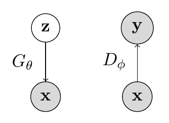

# Generative Adversarial Networks

## Introduction: GANs as a Paradigm Shift

GANs are unique from all the other model families that we have seen so far, such as autoregressive models, VAEs, and normalizing flow models, because we do not train them using maximum likelihood.

### The Traditional Likelihood-Based Paradigm

All the generative models we've explored so far follow a similar training paradigm:

1. **Autoregressive Models**: Maximize $\log p_\theta(x) = \sum_{i=1}^N \log p_\theta(x_i|x_{<i})$
2. **Variational Autoencoders**: Maximize the ELBO $\mathbb{E}_{q_\phi(z|x)}[\log p_\theta(x|z)] - D_{KL}(q_\phi(z|x) || p(z))$
3. **Normalizing Flow Models**: Maximize $\log p_\theta(x) = \log p_z(f^{-1}_\theta(x)) + \log |\det(\frac{\partial f^{-1}_\theta(x)}{\partial x})|$

**Common Theme**: All these models are trained by maximizing some form of likelihood or likelihood approximation.

### GANs: A Different Approach

**GANs break away from this paradigm entirely.** Instead of maximizing likelihood, GANs use **adversarial training** - a fundamentally different approach to generative modeling. We'll get to what a Generator and a Discriminator are in a bit but here is a quick table showing how GAN is different.

**Key Differences:**

| Aspect | Likelihood-Based Models | GANs |
|--------|------------------------|------|
| **Training Objective** | Maximize likelihood/ELBO | Minimax game between generator and discriminator |
| **Loss Function** | $\mathcal{L} = -\log p_\theta(x)$ | $\mathcal{L}_G = -\log D(G(z))$, $\mathcal{L}_D = -\log D(x) - \log(1-D(G(z)))$ |
| **Model Evaluation** | Direct likelihood computation | No explicit likelihood computation |
| **Training Stability** | Generally stable | Can be unstable, requires careful tuning |
| **Sample Quality** | May produce blurry samples | Often produces sharp, realistic samples |

## Likelihood-Free Learning

**Why not use maximum likelihood?** In fact, it is not so clear that better likelihood numbers necessarily correspond to higher sample quality. We know that the optimal generative model will give us the best sample quality and highest test log-likelihood. However, models with high test log-likelihoods can still yield poor samples, and vice versa.

### The Likelihood vs. Sample Quality Disconnect

To see why, consider pathological cases in which our model is comprised almost entirely of noise, or our model simply memorizes the training set:

1. **Noise Model**: A model that outputs pure noise might assign some probability to real data points, leading to a non-zero (though poor) likelihood, but produces completely useless samples.

2. **Memorization Model**: A model that perfectly memorizes the training set will have very high likelihood on training data but will only reproduce exact training examples, lacking generalization and diversity.

Therefore, we turn to **likelihood-free training** with the hope that optimizing a different objective will allow us to disentangle our desiderata of obtaining high likelihoods as well as high-quality samples.

### The Two-Sample Test Framework

Recall that maximum likelihood required us to evaluate the likelihood of the data under our model $p_\theta$. A natural way to set up a likelihood-free objective is to consider the **two-sample test**, a statistical test that determines whether or not a finite set of samples from two distributions are from the same distribution using only samples from $P$ and $Q$.

**Concretely**, given $S_1 = \{x \sim P\}$ and $S_2 = \{x \sim Q\}$, we compute a test statistic $T$ according to the difference in $S_1$ and $S_2$ that, when less than a threshold $\alpha$, accepts the null hypothesis that $P = Q$.

### Application to Generative Modeling

Analogously, we have in our generative modeling setup access to our training set $S_1 = \{x \sim p_{data}\}$ and $S_2 = \{x \sim p_\theta\}$. The key idea is to train the model to minimize a two-sample test objective between $S_1$ and $S_2$.

**However**, this objective becomes extremely difficult to work with in high dimensions, so we choose to optimize a **surrogate objective** that instead maximizes some distance between $S_1$ and $S_2$.

### Why This Approach Makes Sense

**1. Avoiding Pathological Cases:**
- The two-sample test framework naturally avoids the noise and memorization problems
- It forces the model to learn the true underlying distribution structure

**3. Flexibility:**
- We can choose different distance metrics or test statistics
- This allows us to focus on different aspects of sample quality

**Key Insight:** GANs implement likelihood-free learning by using a neural network (the discriminator) to learn an optimal test statistic for distinguishing between real and generated data, and then training the generator to minimize this learned distance.

## GAN Objective

We thus arrive at the generative adversarial network formulation. There are two components in a GAN: (1) a generator and (2) a discriminator. The generator $G_\theta$ is a directed latent variable model that deterministically generates samples $x$ from $z$, and the discriminator $D_\phi$ is a function whose job is to distinguish samples from the real dataset and the generator.

### Components

- **Generator $G_\theta$**: A neural network that transforms noise $z \sim p(z)$ to samples $G_\theta(z)$
- **Discriminator $D_\phi$**: A neural network that outputs a probability $D_\phi(x) \in [0,1]$ indicating whether $x$ is real or generated

### The Minimax Game

The generator and discriminator both play a two player minimax game, where:
- **Generator**: Minimizes a two-sample test objective ($p_{data} = p_\theta$)
- **Discriminator**: Maximizes the objective ($p_{data} \neq p_\theta$)

Intuitively, the generator tries to fool the discriminator to the best of its ability by generating samples that look indistinguishable from $p_{data}$.

### Formal Objective

The GAN objective can be written as:

$$\min_\theta \max_\phi V(G_\theta, D_\phi) = \mathbb{E}_{x \sim p_{data}}[\log D_\phi(x)] + \mathbb{E}_{z \sim p(z)}[\log(1-D_\phi(G_\theta(z)))]$$

### Understanding the Objective

Let's unpack this expression:

**For the Discriminator (maximizing with respect to $\phi$):**
- Given a fixed generator $G_\theta$, the discriminator performs binary classification
- It tries to assign probability 1 to data points from the training set $x \sim p_{data}$
- It tries to assign probability 0 to generated samples $x \sim p_G$

**For the Generator (minimizing with respect to $\theta$):**
- Given a fixed discriminator $D_\phi$, the generator tries to maximize $D_\phi(G_\theta(z))$
- This is equivalent to minimizing $\log(1-D_\phi(G_\theta(z)))$

### Optimal Discriminator

In this setup, the optimal discriminator is:

$$D^*_G(x) = \frac{p_{data}(x)}{p_{data}(x) + p_G(x)}$$

**Derivation:**
The discriminator's objective is to maximize:

$$\mathbb{E}_{x \sim p_{data}}[\log D(x)] + \mathbb{E}_{x \sim p_G}[\log(1-D(x))]$$

This is maximized when:

$$D(x) = \frac{p_{data}(x)}{p_{data}(x) + p_G(x)}$$

On the other hand, the generator minimizes this objective for a fixed discriminator $D_\phi$.

### Connection to Jensen-Shannon Divergence

After performing some algebra, plugging in the optimal discriminator $D^*_G(\cdot)$ into the overall objective $V(G_\theta, D^*_G(x))$ gives us:

$$2D_{JSD}[p_{data}, p_G] - \log 4$$

The $D_{JSD}$ term is the **Jensen-Shannon Divergence**, which is also known as the symmetric form of the KL divergence:

$$D_{JSD}[p,q] = \frac{1}{2}\left(D_{KL}\left[p, \frac{p+q}{2}\right] + D_{KL}\left[q, \frac{p+q}{2}\right]\right)$$

### Properties of JSD

The JSD satisfies all properties of the KL divergence, and has the additional perk that $D_{JSD}[p,q] = D_{JSD}[q,p]$ (symmetry).

**Key Properties:**

1. **Non-negative**: $D_{JSD}[p,q] \geq 0$

2. **Symmetric**: $D_{JSD}[p,q] = D_{JSD}[q,p]$

3. **Zero iff equal**: $D_{JSD}[p,q] = 0$ if and only if $p = q$

4. **Bounded**: $D_{JSD}[p,q] \leq \log 2$

### Optimal Solution

With this distance metric, the optimal generator for the GAN objective becomes $p_G = p_{data}$, and the optimal objective value that we can achieve with optimal generators and discriminators $G^*(\cdot)$ and $D^*_{G^*}(x)$ is $-\log 4$.

**Why $-\log 4$?**
- When $p_G = p_{data}$, we have $D_{JSD}[p_{data}, p_G] = 0$
- Therefore, $V(G^*, D^*) = 2 \cdot 0 - \log 4 = -\log 4$

## GAN Training Algorithm

Thus, the way in which we train a GAN is as follows:

**For epochs $1, \ldots, N$ do:**

1. **Sample minibatch of size $m$ from data**: $x^{(1)}, \ldots, x^{(m)} \sim p_{data}$
2. **Sample minibatch of size $m$ of noise**: $z^{(1)}, \ldots, z^{(m)} \sim p_z$
3. **Take a gradient descent step on the generator parameters $\theta$**:

$$\nabla_\theta V(G_\theta, D_\phi) = \frac{1}{m}\nabla_\theta \sum_{i=1}^m \log(1-D_\phi(G_\theta(z^{(i)})))$$

4. **Take a gradient ascent step on the discriminator parameters $\phi$**:

$$\nabla_\phi V(G_\theta, D_\phi) = \frac{1}{m}\nabla_\phi \sum_{i=1}^m [\log D_\phi(x^{(i)}) + \log(1-D_\phi(G_\theta(z^{(i)})))]$$

**Key Points:**

1. **Alternating Updates**: We update the generator and discriminator in alternating steps
2. **Minibatch Training**: We use minibatches of both real data and noise samples
3. **Generator Update**: Minimizes the probability that the discriminator correctly identifies generated samples
4. **Discriminator Update**: Maximizes the probability of correctly classifying real vs. generated samples

**Practical Considerations:**

- **Learning Rate Balance**: The learning rates for generator and discriminator must be carefully balanced
- **Update Frequency**: Often the discriminator is updated multiple times per generator update
- **Convergence Monitoring**: Training progress is monitored through discriminator accuracy and sample quality
- **Early Stopping**: Training may be stopped when the discriminator can no longer distinguish real from fake

This formulation shows that GANs are essentially implementing an adaptive two-sample test, where the discriminator learns the optimal way to distinguish between real and generated data, and the generator learns to minimize this learned distance.

## Challenges

Although GANs have been successfully applied to several domains and tasks, working with them in practice is challenging because of their: (1) unstable optimization procedure, (2) potential for mode collapse, (3) difficulty in evaluation.

**1. Unstable Optimization Procedure**

During optimization, the generator and discriminator loss often continue to oscillate without converging to a clear stopping point. Due to the lack of a robust stopping criteria, it is difficult to know when exactly the GAN has finished training.

**Causes of Instability:**
- **Minimax Nature**: The adversarial game creates competing objectives
- **Gradient Issues**: Vanishing/exploding gradients can occur
- **Learning Rate Sensitivity**: Small changes in learning rates can cause divergence
- **Network Capacity Imbalance**: If one network becomes too powerful, training collapses

**Symptoms:**
- Oscillating loss curves
- No clear convergence pattern
- Sudden collapse of training
- Generator or discriminator loss going to zero/infinity

**2. Mode Collapse**

The generator of a GAN can often get stuck producing one of a few types of samples over and over again (mode collapse). This occurs when the generator finds a few "safe" modes that consistently fool the discriminator and stops exploring the full data distribution.

**What is Mode Collapse:**
- **Definition**: Generator only produces samples from a subset of the true distribution modes
- **Example**: In image generation, only producing images of one type (e.g., only front-facing faces)
- **Problem**: Lack of diversity in generated samples

**Causes:**
- **Discriminator Overfitting**: Discriminator becomes too good at detecting certain types of fake samples
- **Generator Optimization**: Generator finds local optima that work well against current discriminator
- **Training Imbalance**: One network becomes too powerful relative to the other

**3. Difficulty in Evaluation**

Unlike likelihood-based models, GANs don't provide explicit likelihood values, making evaluation challenging.

**Evaluation Challenges:**
- **No Likelihood**: Can't use traditional metrics like log-likelihood
- **Subjective Quality**: Sample quality is often subjective and domain-specific
- **Diversity vs. Quality Trade-off**: Hard to balance sample quality with diversity
- **Mode Coverage**: Difficult to measure if all modes of the data distribution are captured

**Addressing the Challenges:**

Most fixes to these challenges are empirically driven, and there has been a significant amount of work put into developing new architectures, regularization schemes, and noise perturbations in an attempt to circumvent these issues.