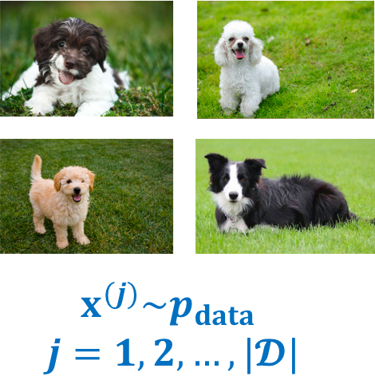
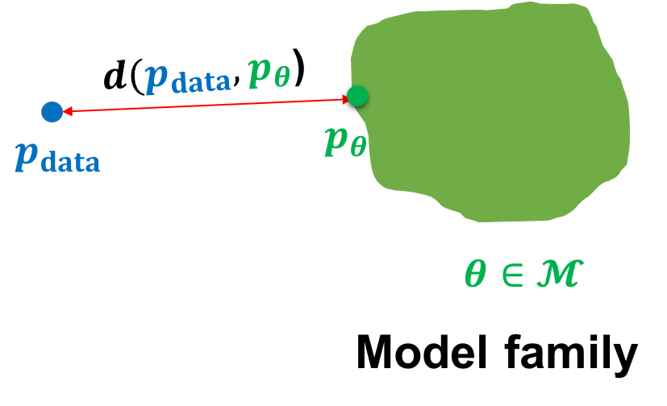
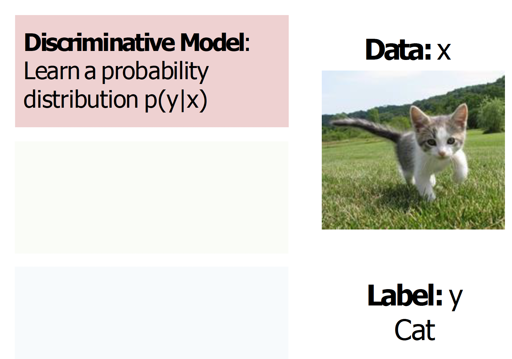
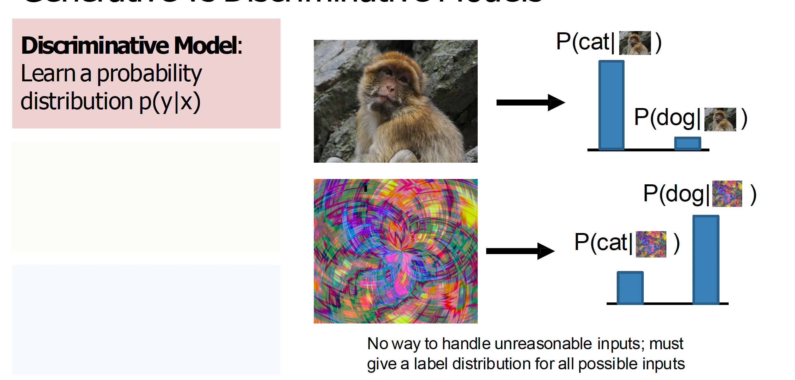
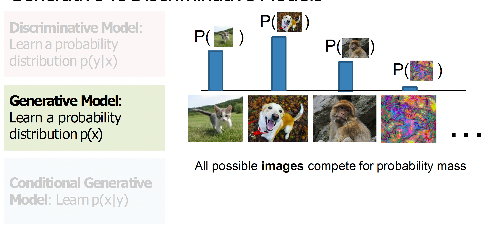
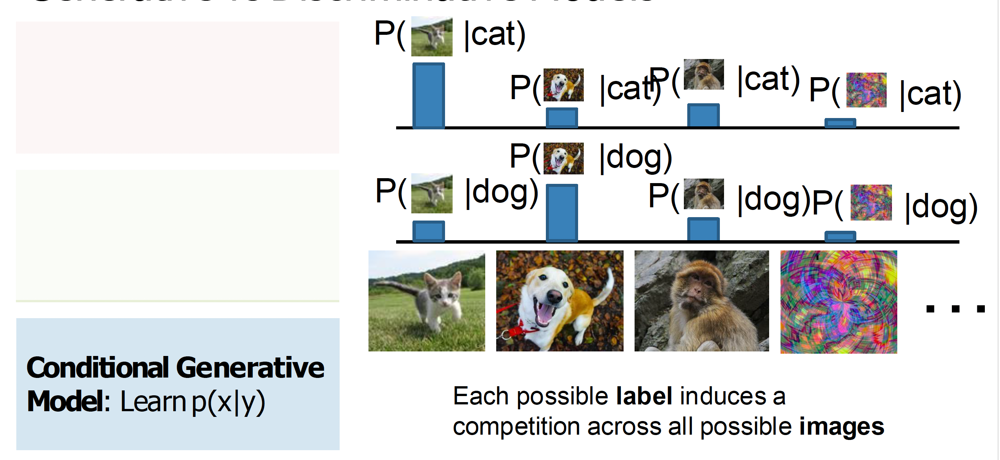
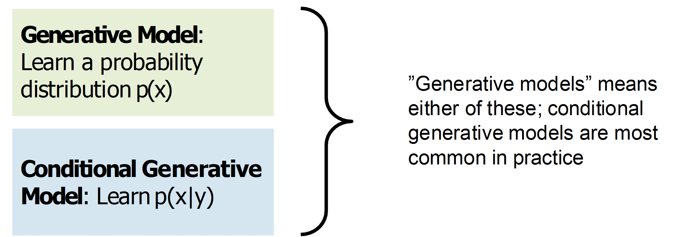
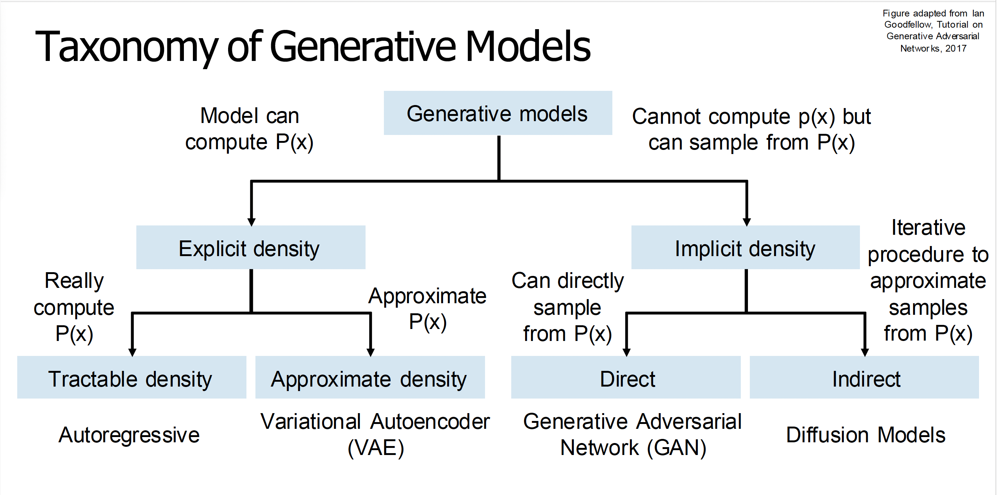

# Introduction

Natural agents excel at discovering patterns, extracting knowledge, and performing complex reasoning based on the data they observe. How can we build artificial learning systems to do the same?

Generative models view the world under the lens of probability. **In such a worldview, we can think of any kind of observed data, say :black_square_button:, as a finite set of samples from an underlying distribution, say  pdata. At its very core, the goal of any generative model is then to approximate this data distribution given access to the dataset :black_square_button:.** The hope is that if we are able to  _learn_  a good generative model, we can use the learned model for downstream  _inference_.

## Learning

We will be primarily interested in parametric approximations (parametric models assume a specific data distribution (like a normal distribution) and estimate parameters (like the mean and standard deviation) of that distribution, while non-parametric models make no assumptions about the underlying distribution) to the data distribution, which summarize all the information about the dataset :black_square_button: in a finite set of parameters. In contrast with non-parametric models, parametric models scale more efficiently with large datasets but are limited in the family of distributions they can represent.

**In the parametric setting, we can think of the task of learning a generative model as picking the parameters within a family of model distributions that minimizes some notion of distance between the model distribution and the data distribution.**

**For instance, we might be given access to a dataset of dog images :black_square_button: and our goal is to learn the parameters of a generative model θ within a model family M such that the model distribution pθ is close to the data distribution over dogs  pdata.** Mathematically, we can specify our goal as the following optimization problem:

min d(pdata,pθ) where θ∈M

where pdata is accessed via the dataset :black_square_button: and  d(⋅) is a notion of distance between probability distributions.

It is interesting to take note of the difficulty of the problem at hand. A typical image from a modern phone camera has a resolution of approximately  700×1400700×1400 pixels. Each pixel has three channels: R(ed), G(reen) and B(lue) and each channel can take a value between 0 to 255. Hence, the number of possible images is given by 256700×1400×3≈10800000256700×1400×3≈10800000. In contrast, Imagenet, one of the largest publicly available datasets, consists of only about 15 million images. Hence, learning a generative model with such a limited dataset is a highly underdetermined problem.

Fortunately, the real world is highly structured and automatically discovering the underlying structure is key to learning generative models. For example, we can hope to learn some basic artifacts about dogs even with just a few images: two eyes, two ears, fur etc. Instead of incorporating this prior knowledge explicitly, we will hope the model learns the underlying structure directly from data. 
We will be primarily interested in the following questions:

-   What is the representation for the model family M?
-   What is the objective function  d(⋅)?
-   What is the optimization procedure for minimizing  d(⋅)?

## Generative vs Discriminative models

## Inference

While the range of applications to which generative models have been used continue to grow, we can identify three fundamental inference queries for evaluating a generative model.:

1.  _Density estimation:_  Given a datapoint  x, what is the probability assigned by the model, i.e.,  pθ(x)?
    
2.  _Sampling:_  How can we  _generate_  novel data from the model distribution, i.e.,  xnew∼pθ(x)?
    
3.  _Unsupervised representation learning:_  How can we learn meaningful feature representations for a datapoint  x?

Going back to our example of learning a generative model over dog images, we can intuitively expect a good generative model to work as follows. For density estimation, we expect  pθ(x) to be high for dog images and low otherwise. Alluding to the name  _generative model_, sampling involves generating novel images of dogs beyond the ones we observe in our dataset. Finally, representation learning can help discover high-level structure in the data such as the breed of dogs.