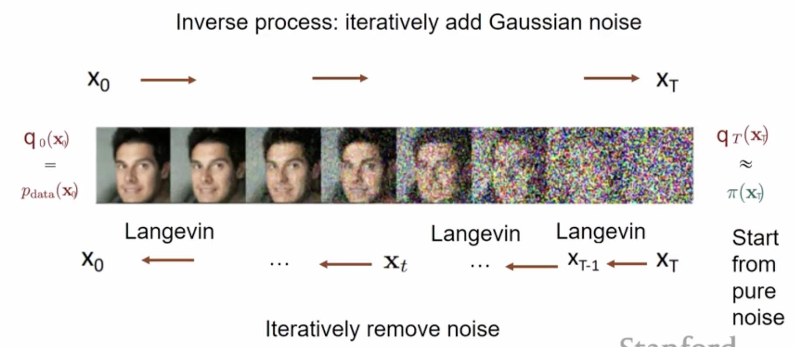
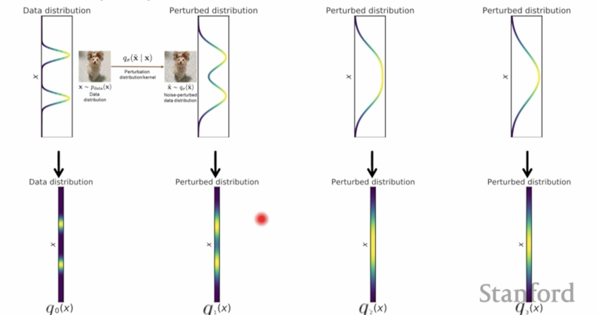

# Score Based Diffusion Models

## Quick Recap: Score Based Models

From our exploration of score-based generative modeling, we learned several key concepts:

**Score Function**: The gradient of the log probability density, $\nabla_x \log p(x)$, which points "uphill" in the probability landscape toward high-density regions.

**Score Matching**: A training objective that learns the score function by minimizing the Fisher divergence between the learned and true score functions.

**Score Matching Objective**: The original score matching objective is:

$$\mathcal{L}(\theta) = \mathbb{E}_{x \sim p_{data}(x)} \left[ \frac{1}{2} \| s_\theta(x) \|_2^2 + \text{tr}(\nabla_x s_\theta(x)) \right]$$

where $\text{tr}(\nabla_x s_\theta(x))$ is the trace of the Jacobian of the score function, which is computationally expensive to evaluate.

**Denoising Score Matching (DSM)**: A practical variant that trains the score function to predict the direction from noisy to clean data, avoiding the need to compute the true score function.

**DSM Objective**: The denoising score matching objective is:

$$\mathcal{L}(\theta) = \mathbb{E}_{y \sim p_{data}(y)} \mathbb{E}_{x \sim \mathcal{N}(x; y, \sigma^2 I)} \left[ \frac{1}{2} \left\| s_\theta(x) - \frac{y - x}{\sigma^2} \right\|_2^2 \right]$$

where $s_\theta(x)$ learns to predict the score function of the noise-perturbed distribution, and $\frac{y - x}{\sigma^2}$ is the target score function that points from noisy sample $x$ toward clean data $y$.

**Langevin Dynamics**: A continuous-time stochastic process that uses the score function to guide sampling:

$$dx_t = \nabla_x \log p(x_t) dt + \sqrt{2} dW_t$$

**Discretized Form**: For practical implementation:

$$x_{t+1} = x_t + \frac{\epsilon}{2} \cdot s_\theta(x_t) + \sqrt{2\epsilon} \cdot \eta_t$$

**Mode Collapse**: Standard Langevin dynamics struggles with multi-modal distributions and low-density regions.

**Annealed Langevin Dynamics**: Addresses this by using multiple noise scales $\sigma_1 < \sigma_2 < \ldots < \sigma_L$, creating a sequence of increasingly noisy distributions that are easier to sample from.

**Stochastic Differential Equations (SDEs)**: General framework for continuous-time stochastic processes:

$$dx = f(x, t)dt + g(t)dw$$

**Reverse SDE**: Any SDE has a corresponding reverse process for sampling:

$$dx = [f(x, t) - g^2(t)\nabla_x \log p_t(x)]dt + g(t)d\bar{w}$$

**Time-Dependent Score Models**: Neural networks that learn $s_\theta(x, t) \approx \nabla_x \log p_t(x)$ for continuous-time processes.

**Key insights:**

1. **Score functions act as denoisers**: They point from noisy to clean data
2. **Multiple noise scales help**: Annealing from high to low noise improves sampling
3. **Continuous-time generalizes discrete**: SDEs provide a unified framework
4. **Reverse processes enable generation**: The reverse SDE naturally incorporates the score function for sampling

## Diffusion Models as Score Based Models & Hierarchical VAEs

**Iterative Denoising perspective**: In annealed Langevin dynamics with multiple noise scales, the sampling process can be viewed as **iterative denoising**. Starting from high noise levels and gradually reducing noise, each step uses the score function to denoise the sample, progressively refining it from a noisy state toward the clean data distribution.

**Training perspective**: The inverse process involves **iteratively adding Gaussian noise** to clean data during training. By corrupting data with increasing levels of noise, the model learns to predict the score function at each noise level, enabling it to reverse the corruption process during sampling.

**VAE Perspective**: This entire framework can be viewed as a **VAE** where:

- **Encoder process**: The forward process that converts clean data to noise through iterative corruption

- **Decoder process**: The reverse process that generates samples by iteratively denoising from noise

**Noise Perturbation process**: Each $x_t$ represents a noise-perturbed density that is obtained by adding Gaussian noise to $x_{t-1}$. This creates a Markov chain where each step adds a small amount of noise to the previous state.

We can write the forward process as a conditional distribution:

$$q(x_t | x_{t-1}) = \mathcal{N}(x_t; \sqrt{1 - \beta_t} x_{t-1}, \beta_t I)$$

where $\beta_t$ is the noise schedule that determines how much noise is added at each step.

The joint distribution of the entire forward process is:

$$q(x_1, x_2, \ldots, x_T | x_0) = \prod_{t=1}^T q(x_t | x_{t-1})$$

This factorization follows from the **chain rule of probability** and the **Markov property** of the forward process:

**Chain Rule**: For any joint distribution, we can write:

$$q(x_1, x_2, \ldots, x_T | x_0) = q(x_1 | x_0) \cdot q(x_2 | x_0, x_1) \cdot q(x_3 | x_0, x_1, x_2) \cdots q(x_T | x_0, x_1, \ldots, x_{T-1})$$

**Markov Property**: In the forward process, each $x_t$ depends only on $x_{t-1}$, not on earlier states:

$$q(x_t | x_0, x_1, \ldots, x_{t-1}) = q(x_t | x_{t-1})$$

Substituting the Markov property into the chain rule:

$$q(x_1, x_2, \ldots, x_T | x_0) = q(x_1 | x_0) \cdot q(x_2 | x_1) \cdot q(x_3 | x_2) \cdots q(x_T | x_{T-1})$$

This can be written compactly as:

$$q(x_1, x_2, \ldots, x_T | x_0) = \prod_{t=1}^T q(x_t | x_{t-1})$$

This represents the probability of the entire noise corruption sequence, where each step depends only on the previous step (Markov property).

**Comparison with VAEs**: In a typical VAE, you would take $x_0$ and map it via a neural network to obtain some mean and standard deviation to parameterize the distribution of the latent variable. Here, we obtain the distribution of the latent variables through the **predefined noise corruption procedure** we defined above, rather than learning it with a neural network.

**Multistep transitions**: A key advantage of this process is that we can compute transitions between any two time steps efficiently. For example, we can directly compute $q(x_t | x_0)$ without going through all intermediate steps.

Starting from $x_0$, we can write:

$$x_t = \sqrt{\alpha_t} x_{t-1} + \sqrt{1 - \alpha_t} \epsilon_{t-1}$$

where $\alpha_t = 1 - \beta_t$ and $\epsilon_{t-1} \sim \mathcal{N}(0, I)$.

Recursively substituting:

$$x_t = \sqrt{\alpha_t} (\sqrt{\alpha_{t-1}} x_{t-2} + \sqrt{1 - \alpha_{t-1}} \epsilon_{t-2}) + \sqrt{1 - \alpha_t} \epsilon_{t-1}$$

Continuing this recursion, we get:

$$x_t = \sqrt{\bar{\alpha}_t} x_0 + \sqrt{1 - \bar{\alpha}_t} \epsilon$$

where $\bar{\alpha}_t = \prod_{s=1}^t \alpha_s$ and $\epsilon \sim \mathcal{N}(0, I)$.

**Result**: The multistep transition is:

$$q(x_t | x_0) = \mathcal{N}(x_t; \sqrt{\bar{\alpha}_t} x_0, (1 - \bar{\alpha}_t) I)$$

This allows us to sample $x_t$ directly from $x_0$ in a single step, making training much more efficient.

**Diffusion analogy**: We can think of this as a **diffusion process**. This is like a diffuser where given an initial state, we keep adding noise at every step. This is analogous to **heat diffusion** in a space- just as heat spreads out and becomes more uniform over time, our data distribution becomes increasingly noisy and uniform Gaussian as we add more noise at each step.

The process gradually "diffuses" the structured information in the data into random noise, creating a smooth transition from the complex data distribution to a simple Gaussian noise distribution.

The ideal sampling process would be:

1. Sample $x_T$ from $\pi(x_T)$. Start with pure noise from the prior distribution
2. Iteratively sample from the true denoising distribution $q(x_{t-1} | x_t)$.

This would generate samples by following the exact reverse of the forward diffusion process, gradually denoising from pure noise back to clean data.

The challenge however, is that we don't know the true denoising distributions $q(x_{t-1} | x_t)$. While the forward process $q(x_t | x_{t-1})$ is predefined and tractable, the reverse process is not.

However, we can learn an approximation $p_\theta(x_{t-1} | x_t)$ which is a Gaussian distribution with learned parameters:

$$p_\theta(x_{t-1} | x_t) = \mathcal{N}(x_{t-1}; \mu_\theta(x_t, t), \sigma_t^2 I)$$

where $\mu_\theta(x_t, t)$ is a neural network that learns the mean of the denoising distribution, and $\sigma_t^2 I$ is the fixed variance schedule.

This is similar to a VAE decoder:

**VAE Decoder**:

$$p_\theta(x | z) = \mathcal{N}(x; \mu_\theta(z), \sigma_\theta^2(z) I)$$

**Diffusion reverse process**:

$$p_\theta(x_{t-1} | x_t) = \mathcal{N}(x_{t-1}; \mu_\theta(x_t, t), \sigma_t^2 I)$$

The diffusion decoder $p_\theta(x_{t-1} | x_t)$ is trying to learn to approximate the true denoising distributions $q(x_{t-1} | x_t)$.

The joint distribution of the learned reverse process is:

$$p_\theta(x_0, x_1, \ldots, x_{T-1} | x_T) = \prod_{t=1}^T p_\theta(x_{t-1} | x_t)$$

This represents the probability of the entire denoising sequence, where each step uses the learned approximation $p_\theta(x_{t-1} | x_t)$ instead of the true $q(x_{t-1} | x_t)$.

This can be thought of as a **VAE with a fixed encoder and learned decoder**:

- **Fixed Encoder**: The forward process $q(x_1, \ldots, x_T | x_0)$ is predefined and deterministic

- **Learned Decoder**: The reverse process $p_\theta(x_0, \ldots, x_{T-1} | x_T)$ is learned with neural networks

- **Latent Space**: The noise distribution $\pi(x_T)$ serves as the prior

**Standard VAE Equations**:

$$p_\theta(x | z) = \mathcal{N}(x; \mu_\theta(z), \sigma_\theta^2(z) I)$$

$$q_\phi(z | x) = \mathcal{N}(z; \mu_\phi(x), \sigma_\phi^2(x) I)$$

**Hierarchical VAE Equations**:

$$p_\theta(x | z_1) = \mathcal{N}(x; \mu_\theta(z_1), \sigma_\theta^2(z_1) I)$$

$$p_\theta(z_1 | z_2) = \mathcal{N}(z_1; \mu_\theta(z_2), \sigma_\theta^2(z_2) I)$$

$$q_\phi(z_1 | x) = \mathcal{N}(z_1; \mu_\phi(x), \sigma_\phi^2(x) I)$$

$$q_\phi(z_2 | z_1) = \mathcal{N}(z_2; \mu_\phi(z_1), \sigma_\phi^2(z_1) I)$$

**Standard VAE ELBO**:

$$\mathcal{L}_{\text{VAE}} = \mathbb{E}_{q_\phi(z|x)} [\log p_\theta(x|z)] - D_{KL}(q_\phi(z|x) \| p(z))$$

**Hierarchical VAE ELBO**:

$$\mathcal{L}_{\text{HVAE}} = \mathbb{E}_{q_\phi(z_1,z_2|x)} [\log p_\theta(x|z_1)] - D_{KL}(q_\phi(z_1|x) \| p_\theta(z_1|z_2)) - D_{KL}(q_\phi(z_2|z_1) \| p(z_2))$$

The ELBO can be rewritten without explicit KL divergence terms by expanding the KL divergences:

$$\mathcal{L}_{\text{HVAE}} = \mathbb{E}_{q_\phi(z_1,z_2|x)} \left[ \log p_\theta(x|z_1) + \log p_\theta(z_1|z_2) + \log p(z_2) - \log q_\phi(z_1|x) - \log q_\phi(z_2|z_1) \right]$$

This can be simplified to:

$$\mathcal{L}_{\text{HVAE}} = \mathbb{E}_{q_\phi(z_1,z_2|x)} \left[ \log \frac{p_\theta(x|z_1) \cdot p_\theta(z_1|z_2) \cdot p(z_2)}{q_\phi(z_1|x) \cdot q_\phi(z_2|z_1)} \right]$$

Or equivalently:

$$\mathcal{L}_{\text{HVAE}} = \mathbb{E}_{q_\phi(z_1,z_2|x)} \left[ \log \frac{p_\theta(x, z_1, z_2)}{q_\phi(z_1, z_2|x)} \right]$$

where we've used the chain rule of probability:

- $p_\theta(x, z_1, z_2) = p_\theta(x|z_1) \cdot p_\theta(z_1|z_2) \cdot p(z_2)$

- $q_\phi(z_1, z_2|x) = q_\phi(z_1|x) \cdot q_\phi(z_2|z_1)$

**Diffusion Model ELBO**:

The ELBO for the diffusion model can be written as:

$$\mathcal{L}_{\text{Diff}} = \mathbb{E}_{q(x_1,\ldots,x_T|x_0)} \left[ \log \frac{p_\theta(x_0, x_1, \ldots, x_T)}{q(x_1, \ldots, x_T|x_0)} \right]$$