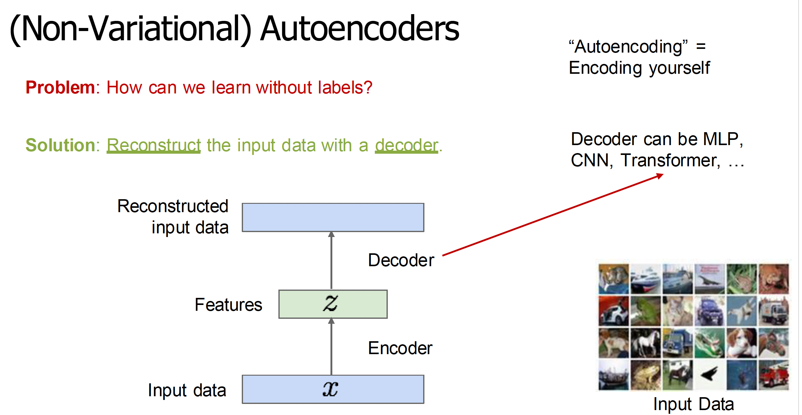
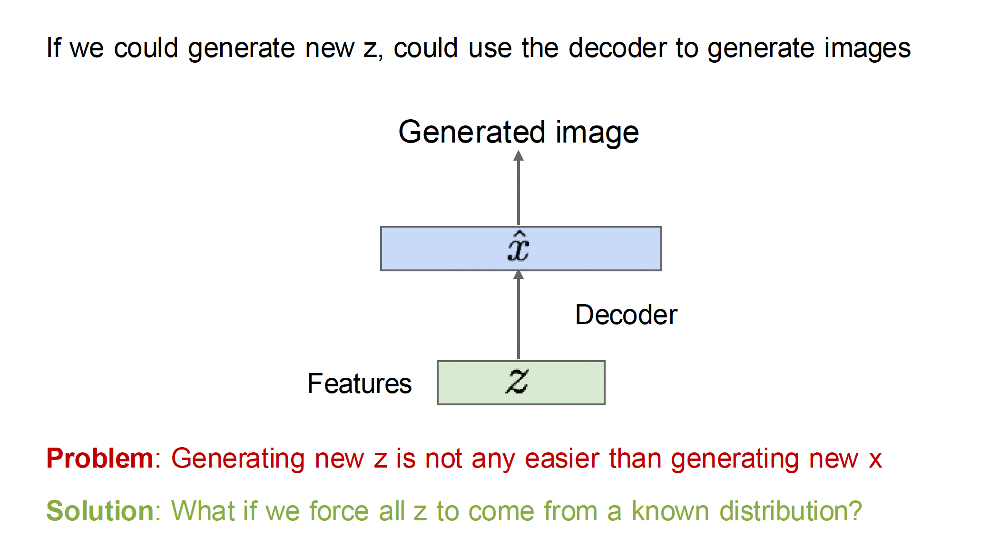
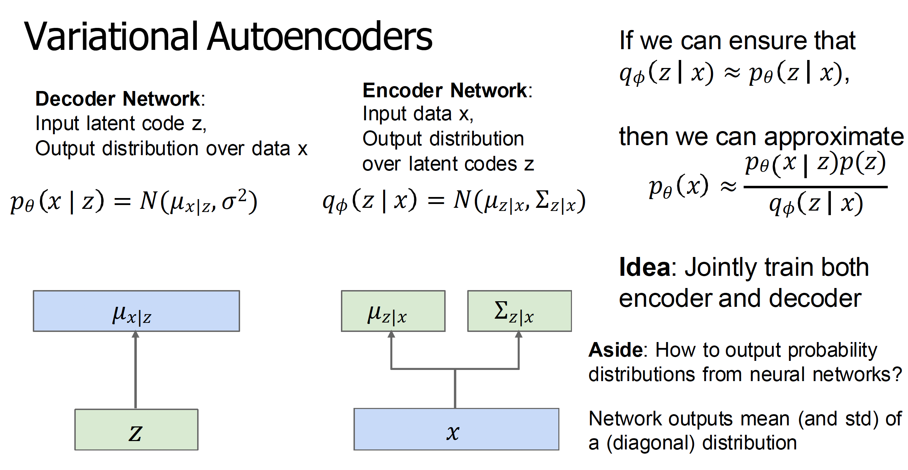
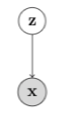

# Variational autoencoders

## Introduction






**And that's what a VAE is! We force all z to come from a known distribution, like a Gaussian.**



## Representation
Consider a directed, latent variable model as shown below.



In the model above, $z$ and $x$ denote the latent and observed variables respectively. The joint distribution expressed by this model is given as

$$p(x,z) = p(x|z)p(z).$$

From a generative modeling perspective, this model describes a generative process for the observed data $x$ using the following procedure:

$$z \sim p(z)$$

$$x \sim p(x|z)$$

If one adopts the belief that the latent variables $z$ somehow encode semantically meaningful information about $x$, it is natural to view this generative process as first generating the "high-level" semantic information about $x$ first before fully generating $x$.

We now consider a family of distributions $\mathcal{Z}$ where $p(z) \in \mathcal{Z}$ describes a probability distribution over $z$. Next, consider a family of conditional distributions $\mathcal{X|Z}$ where $p(x|z) \in \mathcal{X|Z}$ describes a conditional probability distribution over $x$ given $z$. Then our hypothesis class of generative models is the set of all possible combinations

$$\mathcal{X,Z} = \{p(x,z) \mid p(z) \in \mathcal{Z}, p(x|z) \in \mathcal{X|Z}\}.$$

Given a dataset $\mathcal{D} = \{x^{(1)}, \ldots, x^{(n)}\}$, we are interested in the following learning and inference tasks:

1. Selecting $p \in \mathcal{X,Z}$ that "best" fits $\mathcal{D}$.
2. Given a sample $x$ and a model $p \in \mathcal{X,Z}$, what is the posterior distribution over the latent variables $z$?

The posterior distribution $p(z|x)$ represents our updated beliefs about the latent variables $z$ after observing the data $x$. In other words, it tells us what values of $z$ are most likely to have generated the observed $x$. This is particularly useful for tasks like feature extraction, where we want to understand what latent factors might have generated our observed data.

## Why VAEs?

While VAEs only compute approximate densities through the ELBO rather than exact marginal likelihoods, they remain highly useful for several key reasons:

**1. Learned Latent Representations**: Learned latent representations (the approximate posterior $q_\phi(z|x)$ learned by the encoder; we'll get to what this means later) provides a meaningful compressed representation of the data. This latent space captures semantically relevant features and enables tasks like interpolation, manipulation, and feature extraction that would be difficult with exact but intractable inference methods.

**2. Practical Benefits Outweigh Approximation Error**: For most applications, the benefits of having a trainable, scalable generative model with a structured latent space far outweigh the approximation error introduced by using the ELBO. The approximation is often "good enough" for practical purposes, and the alternative—exact inference—is simply not feasible for complex, high-dimensional data.

## Learning Directed Latent Variable Models

One way to measure how closely $p(x,z)$ fits the observed dataset $\mathcal{D}$ is to measure the Kullback-Leibler (KL) divergence between the data distribution (which we denote as $p_{data}(x)$) and the model's marginal distribution $p(x) = \int p(x,z)dz$. The distribution that "best" fits the data is thus obtained by minimizing the KL divergence.

$$\min_{p \in \mathcal{X,Z}} D_{KL}(p_{data}(x) \| p(x)).$$

As we have seen previously, optimizing an empirical estimate of the KL divergence is equivalent to maximizing the marginal log-likelihood $\log p(x)$ over $\mathcal{D}$:

$$\max_{p \in \mathcal{X,Z}} \sum_{x \in \mathcal{D}} \log p(x) = \max_{p \in \mathcal{X,Z}} \sum_{x \in \mathcal{D}} \log \int p(x,z)dz.$$

However, it turns out this problem is generally intractable for high-dimensional $z$ as it involves an integration (or sums in the case $z$ is discrete) over all the possible latent sources of variation $z$. This intractability arises from several challenges:

1. **Computational Complexity**: The integral $\int p(x,z)dz$ requires evaluating the joint distribution $p(x,z)$ for all possible values of $z$. In high-dimensional spaces, this becomes computationally prohibitive as the number of points to evaluate grows exponentially with the dimension of $z$.

2. **Numerical Integration**: Even if we could evaluate the integrand at all points, computing the integral numerically becomes increasingly difficult as the dimension of $z$ grows. Traditional numerical integration methods like quadrature become impractical in high dimensions.

3. **Posterior Inference**: The intractability of the marginal likelihood also makes it difficult to compute the posterior distribution $p(z|x)$, which is crucial for tasks like feature extraction and data generation.

This intractability motivates the need for approximate inference methods, such as variational inference. One option is to estimate the objective via Monte Carlo. For any given datapoint $x$, we can obtain the following estimate for its marginal log-likelihood:

$$\log p(x) \approx \log \frac{1}{k} \sum_{i=1}^k p(x|z^{(i)}), \text{ where } z^{(i)} \sim p(z)$$

This Monte Carlo estimate is derived as follows:

First, recall that the marginal likelihood $p(x)$ can be written as an expectation:

$$p(x) = \int p(x|z)p(z)dz = \mathbb{E}_{z \sim p(z)}[p(x|z)]$$

The Monte Carlo method approximates this expectation by drawing $k$ samples from $p(z)$ and computing their average:

$$\mathbb{E}_{z \sim p(z)}[p(x|z)] \approx \frac{1}{k} \sum_{i=1}^k p(x|z^{(i)}), \text{ where } z^{(i)} \sim p(z)$$

Taking the logarithm of both sides gives us our final estimate:

$$\log p(x) \approx \log \frac{1}{k} \sum_{i=1}^k p(x|z^{(i)}), \text{ where } z^{(i)} \sim p(z)$$

This approximation becomes more accurate as $k$ increases, but at the cost of more computational resources. The key insight is that we're using random sampling to approximate the intractable integral, trading exact computation for statistical estimation.

Rather than maximizing the log-likelihood directly, an alternate is to instead construct a lower bound that is more amenable to optimization. To do so, we note that evaluating the marginal likelihood $p(x)$ is at least as difficult as as evaluating the posterior $p(z|x)$ for any latent vector $z$ since by definition $p(z|x) = p(x,z)/p(x)$.

Next, we introduce a variational family $\mathcal{Q}$ of distributions that approximate the true, but intractable posterior $p(z|x)$. Further henceforth, we will assume a parameteric setting where any distribution in the model family $\mathcal{X,Z}$ is specified via a set of parameters $\theta \in \Theta$ and distributions in the variational family $\mathcal{Q}$ are specified via a set of parameters $\lambda \in \Lambda$.

Given $\mathcal{X,Z}$ and $\mathcal{Q}$, we note that the following relationships hold true for any $x$ and all variational distributions $q_\lambda(z) \in \mathcal{Q}$:

$$\log p_\theta(x) = \log \int p_\theta(x,z)dz = \log \int \frac{q_\lambda(z)}{q_\lambda(z)}p_\theta(x,z)dz \geq \mathbb{E}_{q_\lambda(z)}\left[\log\frac{p_\theta(x,z)}{q_\lambda(z)}\right] := \text{ELBO}(x;\theta,\lambda)$$

where we have used Jensen's inequality in the final step. The key insight here is that since the logarithm function is concave, Jensen's inequality tells us that for any random variable $X$ and concave function $f$, we have $\mathbb{E}[f(X)] \leq f(\mathbb{E}[X])$. In our case:

We first multiply and divide by $q_\lambda(z)$ inside the integral to get:

$$\log \int \frac{q_\lambda(z)}{q_\lambda(z)}p_\theta(x,z)dz = \log \int q_\lambda(z)\frac{p_\theta(x,z)}{q_\lambda(z)}dz$$

The integral $\int q_\lambda(z)\frac{p_\theta(x,z)}{q_\lambda(z)}dz$ can be seen as an expectation $\mathbb{E}_{q_\lambda(z)}\left[\frac{p_\theta(x,z)}{q_\lambda(z)}\right]$

Since $\log$ is a concave function, Jensen's inequality gives us:

$$\log \mathbb{E}_{q_\lambda(z)}\left[\frac{p_\theta(x,z)}{q_\lambda(z)}\right] \geq \mathbb{E}_{q_\lambda(z)}\left[\log\frac{p_\theta(x,z)}{q_\lambda(z)}\right]$$

This inequality is what allows us to obtain a lower bound on the log-likelihood, which we call the Evidence Lower BOund (ELBO). The ELBO admits a tractable unbiased Monte Carlo estimator

$$\frac{1}{k}\sum_{i=1}^k \log\frac{p_\theta(x,z^{(i)})}{q_\lambda(z^{(i)})}, \text{ where } z^{(i)} \sim q_\lambda(z),$$

so long as it is easy to sample from and evaluate densities for $q_\lambda(z)$.

In summary, we can learn a latent variable model by maximizing the ELBO with respect to both the model parameters $\theta$ and the variational parameters $\lambda$ for any given datapoint $x$:

$$\max_\theta \sum_{x \in \mathcal{D}} \max_\lambda \mathbb{E}_{q_\lambda(z)}\left[\log\frac{p_\theta(x,z)}{q_\lambda(z)}\right].$$

This optimization objective can be broken down into two parts:

1. **Inner Optimization**: For each datapoint $x$, we find the best variational parameters $\lambda$ that make $q_\lambda(z)$ as close as possible to the true posterior $p(z|x)$. This is done by maximizing the ELBO with respect to $\lambda$. 

   Why do we need $q_\lambda(z)$ to approximate $p(z|x)$? Since $p(x) = p(x,z)/p(z|x)$, as $q_\lambda(z)$ tends to $p(z|x)$, the ratio $p(x,z)/q_\lambda(z)$ tends to $p(x)$. This means that by making our variational approximation closer to the true posterior, we get a better estimate of the marginal likelihood $p(x)$.

2. **Outer Optimization**: Across all datapoints in the dataset $\mathcal{D}$, we find the best model parameters $\theta$ that maximize the average ELBO. This improves the generative model's ability to explain the data.

The outer sum $\sum_{x \in \mathcal{D}}$ is necessary because we want to learn a model that works well for all datapoints in our dataset, not just a single example. This is equivalent to maximizing the average ELBO across all datapoints.

## Black-Box Variational Inference
We shall focus on first-order stochastic gradient methods for optimizing the ELBO.
This inspires Black-Box Variational Inference (BBVI), a general-purpose Expectation-Maximization-like algorithm for variational learning of latent variable models, where, for each mini-batch $\mathcal{B} = \{x^{(1)}, \ldots, x^{(m)}\}$, the following two steps are performed.

**Step 1**

We first do per-sample optimization of $q$ by iteratively applying the update

$$\lambda^{(i)} \leftarrow \lambda^{(i)} + \tilde{\nabla}_\lambda \text{ELBO}(x^{(i)}; \theta, \lambda^{(i)}),$$

where $\text{ELBO}(x; \theta, \lambda) = \mathbb{E}_{q_\lambda(z)}\left[\log\frac{p_\theta(x,z)}{q_\lambda(z)}\right]$, and $\tilde{\nabla}_\lambda$ denotes an unbiased estimate of the ELBO gradient. This step seeks to approximate the log-likelihood $\log p_\theta(x^{(i)})$.

**Step 2**

We then perform a single update step based on the mini-batch

$$\theta \leftarrow \theta + \tilde{\nabla}_\theta \sum_i \text{ELBO}(x^{(i)}; \theta, \lambda^{(i)}),$$

which corresponds to the step that hopefully moves $p_\theta$ closer to $p_{data}$.

## Gradient Estimation

The gradients $\nabla_\lambda \text{ELBO}$ and $\nabla_\theta \text{ELBO}$ can be estimated via Monte Carlo sampling. While it is straightforward to construct an unbiased estimate of $\nabla_\theta \text{ELBO}$ by simply pushing $\nabla_\theta$ through the expectation operator, the same cannot be said for $\nabla_\lambda$. Instead, we see that

$$\nabla_\lambda \mathbb{E}_{q_\lambda(z)}\left[\log\frac{p_\theta(x,z)}{q_\lambda(z)}\right] = \mathbb{E}_{q_\lambda(z)}\left[\left(\log\frac{p_\theta(x,z)}{q_\lambda(z)}\right) \cdot \nabla_\lambda \log q_\lambda(z)\right].$$

This equality follows from the log-derivative trick (also commonly referred to as the REINFORCE trick). To derive this, we start with the gradient of the expectation:

$$\nabla_\lambda \mathbb{E}_{q_\lambda(z)}\left[\log\frac{p_\theta(x,z)}{q_\lambda(z)}\right] = \nabla_\lambda \int q_\lambda(z) \log\frac{p_\theta(x,z)}{q_\lambda(z)} dz$$

Using the product rule and chain rule:

$$= \int \nabla_\lambda q_\lambda(z) \cdot \log\frac{p_\theta(x,z)}{q_\lambda(z)} + q_\lambda(z) \cdot \nabla_\lambda \log\frac{p_\theta(x,z)}{q_\lambda(z)} dz$$

The second term vanishes because:
$\nabla_\lambda \log\frac{p_\theta(x,z)}{q_\lambda(z)} = \nabla_\lambda [\log p_\theta(x,z) - \log q_\lambda(z)]$.
Since $p_\theta(x,z)$ doesn't depend on $\lambda$, $\nabla_\lambda \log p_\theta(x,z) = 0$. Therefore, $\nabla_\lambda \log\frac{p_\theta(x,z)}{q_\lambda(z)} = -\nabla_\lambda \log q_\lambda(z)$. 
When we multiply by $q_\lambda(z)$ and integrate, we get:

$$\int q_\lambda(z) \cdot (-\nabla_\lambda \log q_\lambda(z)) dz = -\int \nabla_\lambda q_\lambda(z) dz = -\nabla_\lambda \int q_\lambda(z) dz = -\nabla_\lambda 1 = 0$$

where we used the fact that $\int q_\lambda(z) dz = 1$ for any valid probability distribution.

For the first term, we use the identity $\nabla_\lambda q_\lambda(z) = q_\lambda(z) \nabla_\lambda \log q_\lambda(z)$:

$$= \int q_\lambda(z) \nabla_\lambda \log q_\lambda(z) \cdot \log\frac{p_\theta(x,z)}{q_\lambda(z)} dz$$

This can be rewritten as an expectation:

$$= \mathbb{E}_{q_\lambda(z)}\left[\left(\log\frac{p_\theta(x,z)}{q_\lambda(z)}\right) \cdot \nabla_\lambda \log q_\lambda(z)\right]$$

The gradient estimator $\tilde{\nabla}_\lambda \text{ELBO}$ is thus

$$\frac{1}{k}\sum_{i=1}^k \left[\left(\log\frac{p_\theta(x,z^{(i)})}{q_\lambda(z^{(i)})}\right) \cdot \nabla_\lambda \log q_\lambda(z^{(i)})\right], \text{ where } z^{(i)} \sim q_\lambda(z).$$

However, it is often noted that this estimator suffers from high variance. One of the key contributions of the variational autoencoder paper is the reparameterization trick, which introduces a fixed, auxiliary distribution $p(\epsilon)$ and a differentiable function $T(\epsilon; \lambda)$ such that the procedure

$$\epsilon \sim p(\epsilon)$$

$$z \leftarrow T(\epsilon; \lambda),$$

is equivalent to sampling from $q_\lambda(z)$. This two-step procedure works as follows:

1. First, we sample $\epsilon$ from a fixed distribution $p(\epsilon)$ that doesn't depend on $\lambda$ (e.g., standard normal)
2. Then, we transform this sample using a deterministic function $T(\epsilon; \lambda)$ that depends on $\lambda$

The key insight is that if we choose $T$ appropriately, the distribution of $z = T(\epsilon; \lambda)$ will be exactly $q_\lambda(z)$. For example, if $q_\lambda(z)$ is a normal distribution with mean $\mu_\lambda$ and standard deviation $\sigma_\lambda$, we can use:

$p(\epsilon) = \mathcal{N}(0, 1)$

$T(\epsilon; \lambda) = \mu_\lambda + \sigma_\lambda \cdot \epsilon$

By the Law of the Unconscious Statistician, we can see that

$$\nabla_\lambda \mathbb{E}_{q_\lambda(z)}\left[\log\frac{p_\theta(x,z)}{q_\lambda(z)}\right] = \mathbb{E}_{p(\epsilon)}\left[\nabla_\lambda \log\frac{p_\theta(x,T(\epsilon; \lambda))}{q_\lambda(T(\epsilon; \lambda))}\right].$$

In contrast to the REINFORCE trick, the reparameterization trick is often noted empirically to have lower variance and thus results in more stable training.

## Parameterizing Distributions via Deep Neural Networks

So far, we have described $p_\theta(x,z)$ and $q_\lambda(z)$ in the abstract. To instantiate these objects, we consider choices of parametric distributions for $p_\theta(z)$, $p_\theta(x|z)$, and $q_\lambda(z)$. A popular choice for $p_\theta(z)$ is the unit Gaussian

$$p_\theta(z) = \mathcal{N}(z|0,I),$$

in which case $\theta$ is simply the empty set since the prior is a fixed distribution.

In the case where $p_\theta(x|z)$ is a Gaussian distribution, we can thus represent it as

$$p_\theta(x|z) = \mathcal{N}(x|\mu_\theta(z), \Sigma_\theta(z)),$$

where $\mu_\theta(z)$ and $\Sigma_\theta(z)$ are neural networks that specify the mean and covariance matrix for the Gaussian distribution over $x$ when conditioned on $z$.

Finally, the variational family for the proposal distribution $q_\lambda(z)$ needs to be chosen judiciously so that the reparameterization trick is possible. Many continuous distributions in the location-scale family can be reparameterized. In practice, a popular choice is again the Gaussian distribution, where

$$\begin{align*}
\lambda &= (\mu, \Sigma) \\
q_\lambda(z) &= \mathcal{N}(z|\mu, \Sigma) \\
p(\varepsilon) &= \mathcal{N}(z|0,I) \\
T(\varepsilon; \lambda) &= \mu + \Sigma^{1/2}\varepsilon,
\end{align*}$$

where $\Sigma^{1/2}$ is the Cholesky decomposition of $\Sigma$. For simplicity, practitioners often restrict $\Sigma$ to be a diagonal matrix (which restricts the distribution family to that of factorized Gaussians).

The reparameterization trick consists of four key steps:

1. **Parameter Definition**: We define the variational parameters $\lambda$ as a tuple containing the mean vector $\mu$ and covariance matrix $\Sigma$ of our Gaussian distribution. These parameters will be learned during training.

2. **Variational Distribution**: We specify that our variational distribution $q_\lambda(z)$ is a Gaussian distribution parameterized by $\mu$ and $\Sigma$. This is the distribution we ideally want to sample from.

3. **Auxiliary Distribution**: Instead of sampling directly from $q_\lambda(z)$, we introduce a fixed auxiliary distribution $p(\varepsilon)$ which is a standard normal distribution (mean 0, identity covariance). This distribution doesn't depend on our parameters $\lambda$.

4. **Transformation Function**: We define a deterministic function $T(\varepsilon; \lambda)$ that transforms samples from the auxiliary distribution into samples from our variational distribution. The transformation is given by $\mu + \Sigma^{1/2}\varepsilon$, where $\Sigma^{1/2}$ is the Cholesky decomposition of $\Sigma$.

The key insight is that instead of sampling directly from $q_\lambda(z)$, we can:
1. Sample $\varepsilon$ from the standard normal distribution $p(\varepsilon)$
2. Transform it using $T(\varepsilon; \lambda)$ to make it seem like we're getting a sample from $q_\lambda(z)$

This trick is crucial because it allows us to compute gradients with respect to $\lambda$ through the sampling process. Since the transformation $T$ is differentiable, we can backpropagate through it to update the parameters $\lambda$ during training. This is why the reparameterization trick often leads to lower variance in gradient estimates compared to the REINFORCE trick.

## Amortized Variational Inference

A noticeable limitation of black-box variational inference is that Step 1 executes an optimization subroutine that is computationally expensive. Recall that the goal of Step 1 is to find

$$\lambda^* = \arg\max_{\lambda \in \Lambda} \text{ELBO}(x; \theta, \lambda).$$

For a given choice of $\theta$, there is a well-defined mapping from $x \mapsto \lambda^*$. A key realization is that this mapping can be learned. In particular, one can train an encoding function (parameterized by $\phi$) $f_\phi: \mathcal{X} \to \Lambda$ (where $\Lambda$ is the space of $\lambda$ parameters) on the following objective

$$\max_\phi \sum_{x \in \mathcal{D}} \text{ELBO}(x; \theta, f_\phi(x)).$$

It is worth noting at this point that $f_\phi(x)$ can be interpreted as defining the conditional distribution $q_\phi(z|x)$. With a slight abuse of notation, we define

$$\text{ELBO}(x; \theta, \phi) = \mathbb{E}_{q_\phi(z|x)}\left[\log\frac{p_\theta(x,z)}{q_\phi(z|x)}\right],$$

and rewrite the optimization problem as

$$\max_\phi \sum_{x \in \mathcal{D}} \text{ELBO}(x; \theta, \phi).$$

It is also worth noting that optimizing $\phi$ over the entire dataset as a subroutine every time we sample a new mini-batch is clearly not reasonable. However, if we believe that $f_\phi$ is capable of quickly adapting to a close-enough approximation of $\lambda^*$ given the current choice of $\theta$, then we can interleave the optimization of $\phi$ and $\theta$. This yields the following procedure, where for each mini-batch $\mathcal{B} = \{x^{(1)}, \ldots, x^{(m)}\}$, we perform the following two updates jointly:

$$\begin{align*}
\phi &\leftarrow \phi + \tilde{\nabla}_\phi \sum_{x \in \mathcal{B}} \text{ELBO}(x; \theta, \phi) \\
\theta &\leftarrow \theta + \tilde{\nabla}_\theta \sum_{x \in \mathcal{B}} \text{ELBO}(x; \theta, \phi),
\end{align*}$$

rather than running BBVI's Step 1 as a subroutine. By leveraging the learnability of $x \mapsto \lambda^*$, this optimization procedure amortizes the cost of variational inference. If one further chooses to define $f_\phi$ as a neural network, the result is the variational autoencoder.

### Steps of Amortized Variational Inference

Let's break down the amortized variational inference procedure in detail:

1. **Initial Setup**:
   - We have a dataset $\mathcal{D} = \{x^{(1)}, \ldots, x^{(n)}\}$
   - We have a generative model $p_\theta(x,z)$ with parameters $\theta$
   - We want to learn both the model parameters $\theta$ and the variational parameters $\lambda$ for each datapoint

2. **Traditional BBVI Approach**:
   - For each datapoint $x$, we would need to run an optimization to find:

$$\lambda^* = \arg\max_{\lambda \in \Lambda} \text{ELBO}(x; \theta, \lambda)$$
   
   - This is computationally expensive as it requires running an optimization subroutine for each datapoint

3. **Key Insight - Learnable Mapping**:
   - Instead of optimizing $\lambda$ separately for each $x$, we realize that there's a mapping from $x$ to $\lambda^*$
   - This mapping can be learned using a function $f_\phi: \mathcal{X} \to \Lambda$ parameterized by $\phi$
   - The function $f_\phi$ takes a datapoint $x$ and outputs the variational parameters $\lambda$

4. **Training the Encoder**:
   - We train $f_\phi$ to maximize the ELBO across all datapoints:

$$\max_\phi \sum_{x \in \mathcal{D}} \text{ELBO}(x; \theta, f_\phi(x))$$

   - This is equivalent to learning a conditional distribution $q_\phi(z|x)$

5. **Joint Optimization**:
   - Instead of running BBVI's Step 1 as a subroutine, we interleave the optimization of $\phi$ and $\theta$
   - For each mini-batch $\mathcal{B} = \{x^{(1)}, \ldots, x^{(m)}\}$, we perform two updates:

$$\begin{align*}
\phi &\leftarrow \phi + \tilde{\nabla}_\phi \sum_{x \in \mathcal{B}} \text{ELBO}(x; \theta, \phi) \\
\theta &\leftarrow \theta + \tilde{\nabla}_\theta \sum_{x \in \mathcal{B}} \text{ELBO}(x; \theta, \phi)
\end{align*}$$

6. **Practical Implementation**:
   - When $f_\phi$ is implemented as a neural network, we get a variational autoencoder
   - The encoder network $f_\phi$ maps inputs $x$ to variational parameters
   - The decoder network maps latent variables $z$ to reconstructed inputs
   - Both networks are trained end-to-end using the ELBO objective

   In practice, the encoder neural network $f_\phi$ outputs the parameters of a diagonal Gaussian distribution:

$$q_\phi(z|x) = \mathcal{N}(z|\mu_\phi(x), \text{diag}(\sigma^2_\phi(x)))$$
   
   where $\mu_\phi(x)$ and $\sigma^2_\phi(x)$ are the mean and variance vectors output by the encoder network. To sample from this distribution during training, we use the reparameterization trick:

$$z = \mu_\phi(x) + \sigma_\phi(x) \odot \varepsilon, \quad \varepsilon \sim \mathcal{N}(0,I)$$
   
   where $\odot$ denotes element-wise multiplication. This allows us to backpropagate through the sampling process and train the encoder network end-to-end.

The key advantage of this approach is that it amortizes the cost of variational inference by learning a single function $f_\phi$ that can quickly approximate the optimal variational parameters for any input $x$, rather than running a separate optimization for each datapoint.

## Decomposition of the Negative ELBO
Starting with the definition of the ELBO:

$$\text{ELBO}(x; \theta, \phi) = \mathbb{E}_{q_\phi(z|x)}\left[\log\frac{p_\theta(x,z)}{q_\phi(z|x)}\right]$$

We can expand the joint distribution $p_\theta(x,z)$ using the chain rule of probability:

$$p_\theta(x,z) = p_\theta(x|z)p_\theta(z)$$

Substituting this into the ELBO:

$$\text{ELBO}(x; \theta, \phi) = \mathbb{E}_{q_\phi(z|x)}\left[\log\frac{p_\theta(x|z)p_\theta(z)}{q_\phi(z|x)}\right]$$

Using the properties of logarithms, we can split this into three terms:

$$\text{ELBO}(x; \theta, \phi) = \mathbb{E}_{q_\phi(z|x)}[\log p_\theta(x|z)] + \mathbb{E}_{q_\phi(z|x)}[\log p_\theta(z)] - \mathbb{E}_{q_\phi(z|x)}[\log q_\phi(z|x)]$$

The second and third terms can be combined to form the KL divergence between $q_\phi(z|x)$ and $p_\theta(z)$:

$$\mathbb{E}_{q_\phi(z|x)}[\log p_\theta(z)] - \mathbb{E}_{q_\phi(z|x)}[\log q_\phi(z|x)] = -\mathbb{E}_{q_\phi(z|x)}\left[\log\frac{q_\phi(z|x)}{p_\theta(z)}\right] = -D_{KL}(q_\phi(z|x) \| p_\theta(z))$$

Therefore, the ELBO can be written as:

$$\text{ELBO}(x; \theta, \phi) = \mathbb{E}_{q_\phi(z|x)}[\log p_\theta(x|z)] - D_{KL}(q_\phi(z|x) \| p_\theta(z))$$

It is insightful to note that the negative ELBO can be decomposed into two terms:

$$-\text{ELBO}(x; \theta, \phi) = \underbrace{-\mathbb{E}_{q_\phi(z|x)}[\log p_\theta(x|z)]}_{\text{Reconstruction Loss}} + \underbrace{D_{KL}(q_\phi(z|x) \| p_\theta(z))}_{\text{KL Divergence}}$$

This decomposition reveals two key components of the training objective:

1. **Reconstruction Loss**: $-\mathbb{E}_{q_\phi(z|x)}[\log p_\theta(x|z)]$
   - This term measures how well the model can reconstruct the input $x$ from its latent representation $z$
   - It encourages the encoder to produce latent codes that preserve the essential information about the input
   - In practice, this is often implemented as the mean squared error or binary cross-entropy between the input and its reconstruction

2. **KL Divergence**: $D_{KL}(q_\phi(z|x) \| p_\theta(z))$
   - This term measures how far the approximate posterior $q_\phi(z|x)$ is from the prior $p_\theta(z)$
   - It encourages the latent space to follow the prior distribution (typically a standard normal distribution)

## Practical Implementation of ELBO Computation

Let's look at how the ELBO is actually computed in practice. Here's a detailed implementation with explanations:

We implement the (rec+kl) decomposed form for practicality and clarity because:

* KL has a closed form (for two Gaussians $q_\phi(z|x) \sim \mathcal{N}(\mu,\sigma^2)$, and $p(z) \sim \mathcal{N}(0,I)$, the KL term can be computed analytically). A closed form means we can compute the exact value using a finite number of standard operations (addition, multiplication, logarithms, etc.) without needing numerical integration or approximation. This closed form is derived as follows:

For two multivariate Gaussians $q_\phi(z|x) = \mathcal{N}(\mu,\Sigma)$ and $p(z) = \mathcal{N}(0,I)$, the KL divergence is:

$$D_{KL}(q_\phi(z|x) \| p(z)) = \frac{1}{2}\left[\text{tr}(\Sigma) + \mu^T\mu - d - \log|\Sigma|\right]$$

where $\text{tr}(\Sigma)$ is the trace of the covariance matrix $\Sigma$ (the sum of its diagonal elements), $\mu^T\mu$ is the squared L2 norm of the mean vector, $d$ is the dimension of the latent space, and $|\Sigma|$ is the determinant of $\Sigma$. For diagonal covariance matrices $\Sigma = \text{diag}(\sigma^2)$, this simplifies to:

$$D_{KL}(q_\phi(z|x) \| p(z)) = \frac{1}{2}\sum_{i=1}^d (\mu_i^2 + \sigma_i^2 - \log(\sigma_i^2) - 1)$$

This analytical solution is not only computationally efficient but also provides exact gradients, unlike Monte Carlo estimates which would require sampling.

* The analytical KL avoids noisy gradients that arise from computing KL via sampling so the decomposition makes training more stable. When using Monte Carlo estimation, the gradients can have high variance due to the randomness in sampling. The analytical form provides deterministic gradients, which leads to more stable optimization. This is particularly important because the KL term acts as a regularizer, and having stable gradients for this term helps prevent the model from either collapsing to a degenerate solution (where the KL term becomes too small) or failing to learn meaningful representations (where the KL term dominates).

* The decomposed form allows you to monitor reconstruction loss and KL separately which is very helpful in debugging and understanding model behavior

```python
def negative_elbo_bound(self, x):
    """
    Computes the Evidence Lower Bound, KL and, Reconstruction costs

    Args:
        x: tensor: (batch, dim): Observations

    Returns:
        nelbo: tensor: (): Negative evidence lower bound
        kl: tensor: (): ELBO KL divergence to prior
        rec: tensor: (): ELBO Reconstruction term
    """
    # Step 1: Get the parameters of the approximate posterior q_phi(z|x)
    q_phi_z_given_x_m, q_phi_z_given_x_v = self.enc(x)
    
    # Step 2: Compute the KL divergence term
    # This computes D_KL(q_phi(z|x) || p_theta(z))
    kl = ut.kl_normal(q_phi_z_given_x_m, q_phi_z_given_x_v,
                      self.z_prior_m, self.z_prior_v)
    
    # Step 3: Take m samples from the approximate posterior using reparameterization
    # This implements z = mu + sigma * epsilon, where epsilon ~ N(0,I)
    z_samples = ut.sample_gaussian(
        q_phi_z_given_x_m.expand(x.shape[0], self.z_dim),
        q_phi_z_given_x_v.expand(x.shape[0], self.z_dim))
    
    # Step 4: Get the decoder outputs (logits)
    # These parameterize the Bernoulli distributions for reconstruction
    f_theta_of_z = self.dec(z_samples)
    
    # Step 5: Compute the reconstruction term
    # This computes -E_q[log p_theta(x|z)] using binary cross-entropy
    rec = -ut.log_bernoulli_with_logits(x, f_theta_of_z)
    
    # Step 6: Combine terms to get the negative ELBO
    nelbo = kl + rec
    
    # Step 7: Average over the batch
    nelbo_avg = torch.mean(nelbo)
    kl_avg = torch.mean(kl)
    rec_avg = torch.mean(rec)
    
    return nelbo_avg, kl_avg, rec_avg
```

Let's break down each step:

1. **Encoder Output**: 
   - The encoder network takes input $x$ and outputs the parameters of the approximate posterior $q_\phi(z|x)$
   - These parameters are the mean ($\mu_\phi(x)$) and variance ($\sigma^2_\phi(x)$) of a diagonal Gaussian

2. **KL Divergence**:
   - Computes $D_{KL}(q_\phi(z|x) \| p_\theta(z))$
   - For diagonal Gaussians, this has a closed-form solution
   - The prior $p_\theta(z)$ is typically a standard normal distribution

3. **Sampling**:
   - Uses the reparameterization trick to sample from $q_\phi(z|x)$
   - Implements $z = \mu_\phi(x) + \sigma_\phi(x) \odot \varepsilon$ where $\varepsilon \sim \mathcal{N}(0,I)$
   - The samples are used to estimate the reconstruction term

4. **Decoder Output**:
   - The decoder network takes the sampled $z$ and outputs logits
   - These logits parameterize Bernoulli distributions for each element of $x$

5. **Reconstruction Term**:
   - Computes $-\mathbb{E}_{q_\phi(z|x)}[\log p_\theta(x|z)]$
   - Uses binary cross-entropy loss which takes logits directly
   - The sigmoid function is incorporated into the loss computation

6. **Final ELBO**:
   - Combines the KL divergence and reconstruction terms
   - The negative ELBO is what we minimize during training

7. **Batch Averaging**:
   - Averages the losses over the batch
   - This gives us the final training objective

This implementation shows how the theoretical ELBO decomposition we discussed earlier is actually computed in practice, with all the necessary components for training a VAE on binary data.

**Note on Sampling from $q_\phi(z|x)$**: The sampling step in the implementation is crucial for two reasons:

**Monte Carlo Estimation**: The reconstruction term $-\mathbb{E}_{q_\phi(z|x)}[\log p_\theta(x|z)]$ involves an expectation over $q_\phi(z|x)$. We estimate this expectation using Monte Carlo sampling:

$$-\mathbb{E}_{q_\phi(z|x)}[\log p_\theta(x|z)] \approx -\frac{1}{K}\sum_{k=1}^K \log p_\theta(x|z^{(k)})$$

where $z^{(k)} \sim q_\phi(z|x)$. In practice, we often use $K=1$ (a single sample) as it works well and is computationally efficient.

**Gradient Estimation**: We need to compute gradients of this expectation with respect to both $\phi$ (encoder parameters) and $\theta$ (decoder parameters). The reparameterization trick allows us to:
- Sample from a fixed distribution $p(\varepsilon)$ that doesn't depend on $\phi$
- Transform these samples using a deterministic function that depends on $\phi$
- Backpropagate through this transformation to compute gradients
- This results in lower variance gradient estimates compared to the REINFORCE trick

The sampling step is therefore essential for both estimating the ELBO and computing its gradients during training.

## β-VAE

A popular variation of the normal VAE is called the β-VAE. The β-VAE optimizes the following objective:

$$
\mathbb{E}_{q_\phi(z|x)}[\log p_\theta(x|z)] - \beta D_{KL}(q_\phi(z|x) || p(z))
$$

Here, β is a positive real number. From a training objective, we want to decrease the negative of ELBO, also called NELBO:

$$
\text{NELBO} = \text{Reconstruction Loss} + \beta D_{KL}(q_\phi(z|x) \| p(z))
$$

We see that the second term acts as a regularization term. β can be thought of as a hyperparameter that adjusts how much we want to regularize. Greater the β, more is the training optimized to reduce KL divergence, and a higher possibility of overfitting (and also more the $q_\phi(z|x)$ closely approximates $p(z)$). Lesser the β, optimization is geared towards increasing the KL divergence, leading to a more general model. When β is set to 1 however, we get the standard VAE.

## Importance Weighted Autoencoder (IWAE)

While the ELBO serves as a lower bound to the true marginal log-likelihood, it may be loose if the variational posterior $q_\phi(z|x)$ is a poor approximation to the true posterior $p_\theta(z|x)$. The key idea behind IWAE is to use $m > 1$ samples from the approximate posterior $q_\phi(z|x)$ to obtain the following IWAE bound:

$$
\mathcal{L}_m(x; \theta,\phi) = \mathbb{E}_{z^{(1)},...,z^{(m)} \text{ i.i.d.} \sim q_\phi(z|x)} \log \frac{1}{m}\sum_{i=1}^m \frac{p_\theta(x,z^{(i)})}{q_\phi(z^{(i)}|x)}
$$

Notice that for the special case of $m=1$, the IWAE objective $\mathcal{L}_m$ reduces to the standard ELBO $\mathcal{L}_1 = \mathbb{E}_{z\sim q_\phi(z|x)} \log \frac{p_\theta(x,z)}{q_\phi(z|x)}$.

As a pseudocode, the main modification to the standard VAE would be:

```python
# Step 3: Take m samples from the approximate posterior using reparameterization
# This implements z = mu + sigma * epsilon, where epsilon ~ N(0,I)
z_samples = ut.sample_gaussian(
    q_phi_z_given_x_m.expand(x.shape[0], self.z_dim),
    q_phi_z_given_x_v.expand(x.shape[0], self.z_dim))
```

## Gaussian Mixture VAE (GMVAE)

The VAE's prior distribution was a parameter-free isotropic Gaussian $p_\theta(z) = \mathcal{N}(z|0,I)$. While this original setup works well, there are settings in which we desire more expressivity to better model our data. Let's look at GMVAE, which has a mixture of Gaussians as the prior distribution.

$$p_\theta(z) = \sum_{i=1}^k \frac{1}{k}\mathcal{N}(z|\mu_i, \text{diag}(\sigma^2_i))$$

where $i \in \{1, ..., k\}$ denotes the $i$th cluster index. For notational simplicity, we shall subsume our mixture of Gaussian parameters $\{\mu_i, \sigma_i\}_{i=1}^k$ into our generative model parameters $\theta$. For simplicity, we have also assumed fixed uniform weights $1/k$ over the possible different clusters.

Apart from the prior, the GMVAE shares an identical setup as the VAE:

$$q_\phi(z|x) = \mathcal{N}(z|\mu_\phi(x), \text{diag}(\sigma^2_\phi(x)))$$

$$p_\theta(x|z) = \text{Bern}(x|f_\theta(z))$$

Although the ELBO for the GMVAE: $\mathbb{E}_{q_\phi(z)}[\log p_\theta(x|z)] - D_{KL}(q_\phi(z|x) \| p_\theta(z))$ is identical to that of the VAE, we note that the KL term $D_{KL}(q_\phi(z|x) \| p_\theta(z))$ cannot be computed analytically between a Gaussian distribution $q_\phi(z|x)$ and a mixture of Gaussians $p_\theta(z)$. However, we can obtain its unbiased estimator via Monte Carlo sampling:

$$D_{KL}(q_\phi(z|x) \| p_\theta(z)) \approx \log q_\phi(z^{(1)}|x) - \log p_\theta(z^{(1)})$$

$$= \underbrace{\log\mathcal{N}(z^{(1)}|\mu_\phi(x), \text{diag}(\sigma^2_\phi(x)))}_{\text{log normal}} - \underbrace{\log\sum_{i=1}^k \frac{1}{k}\mathcal{N}(z^{(1)}|\mu_i, \text{diag}(\sigma^2_i))}_{\text{log normal mixture}}$$

where $z^{(1)} \sim q_\phi(z|x)$ denotes a single sample.

## The Semi-Supervised VAE (SSVAE)

The Semi-Supervised VAE (SSVAE) extends the standard VAE to handle both labeled and unlabeled data. In a semi-supervised setting, we have a dataset $\mathcal{D}$ that consists of:
- Labeled data: $\mathcal{D}_l = \{(x^{(i)}, y^{(i)})\}_{i=1}^{N_l}$
- Unlabeled data: $\mathcal{D}_u = \{x^{(i)}\}_{i=1}^{N_u}$

where $y^{(i)}$ represents the class label for the $i$-th labeled example. The SSVAE introduces an additional latent variable $y$ to model the class labels, and the joint distribution is factorized as:

$$
p_\theta(x, y, z) = p_\theta(x|y,z)p_\theta(y|z)p_\theta(z)
$$

This factorization is derived from the chain rule of probability. We first factorize $p_\theta(x, y, z)$ as $p_\theta(x|y,z)p_\theta(y,z)$, and then further factorize $p_\theta(y,z)$ as $p_\theta(y|z)p_\theta(z)$. This reflects the generative process where:
1. First, we sample $z$ from the prior $p_\theta(z)$
2. Then, we sample $y$ conditioned on $z$ from $p_\theta(y|z)$
3. Finally, we generate $x$ conditioned on both $y$ and $z$ from $p_\theta(x|y,z)$

The approximate posterior for labeled data is:

$$
q_\phi(y,z|x) = q_\phi(z|x,y)q_\phi(y|x)
$$

This factorization is derived from the chain rule of probability for the approximate posterior. The chain rule states that for any random variables $A$, $B$, and $C$, we can write:

$$p(A,B|C) = p(A|B,C)p(B|C)$$

This equation is derived from the definition of conditional probability. Let's break it down step by step:

1. First, recall that conditional probability is defined as:

$$p(A|B) = \frac{p(A,B)}{p(B)}$$

2. For our case with three variables, we can write:

$$p(A,B|C) = \frac{p(A,B,C)}{p(C)}$$

3. We can also write:
   
$$p(A|B,C) = \frac{p(A,B,C)}{p(B,C)}$$

and

$$p(B|C) = \frac{p(B,C)}{p(C)}$$

4. Multiplying these last two equations:
   
$$p(A|B,C)p(B|C) = \frac{p(A,B,C)}{p(B,C)} \cdot \frac{p(B,C)}{p(C)} = \frac{p(A,B,C)}{p(C)} = p(A,B|C)$$

Therefore, we have proven that:

$$p(A,B|C) = p(A|B,C)p(B|C)$$

In our case, we can identify:
- $A$ as $z$ (the latent code)
- $B$ as $y$ (the label)
- $C$ as $x$ (the observed data)

Therefore, applying the chain rule:

$$q_\phi(y,z|x) = q_\phi(z|x,y)q_\phi(y|x)$$

This means:
1. First, we predict the label $y$ from $x$ using $q_\phi(y|x)$
2. Then, we infer the latent code $z$ using both $x$ and the predicted $y$ through $q_\phi(z|x,y)$

and for unlabeled data:

$$
q_\phi(y,z|x) = q_\phi(z|x,y)q_\phi(y)
$$

For unlabeled data, since we don't know the true label $y$, we use a prior distribution $q_\phi(y)$ (typically a uniform distribution over classes) instead of $q_\phi(y|x)$. The factorization reflects that:
1. We sample a label $y$ from the prior $q_\phi(y)$
2. Then, we infer the latent code $z$ using both $x$ and the sampled $y$ through $q_\phi(z|x,y)$

The training objective for SSVAE combines:
1. The ELBO for labeled data
2. The ELBO for unlabeled data
3. A classification loss for labeled data

This allows the model to learn both the data distribution and the class labels in a semi-supervised manner.