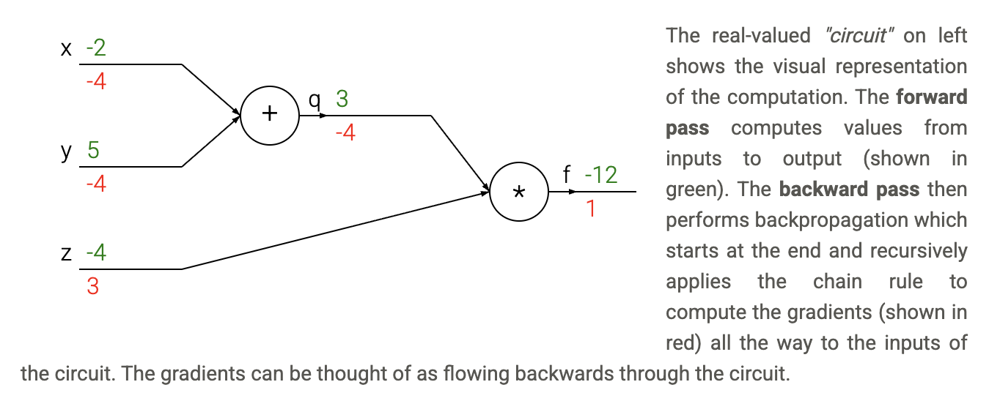
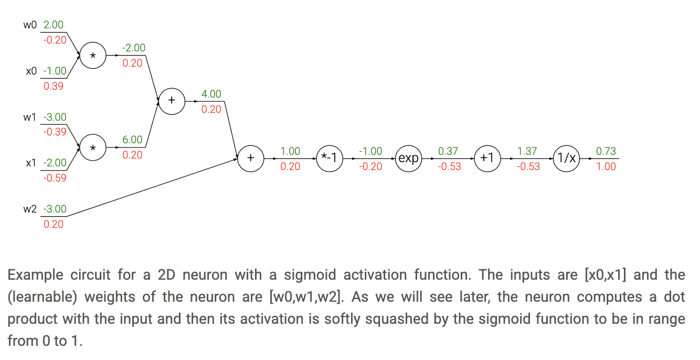
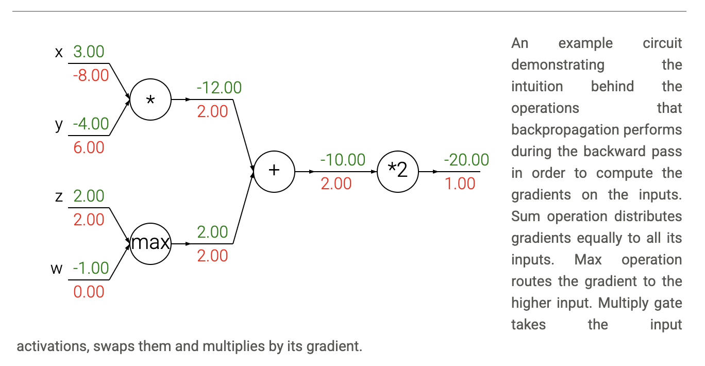

# Backpropagation

## Introduction

We are given some function $f(x)$ where $x$ is a vector of inputs and we are interested in computing the gradient of $f$ at $x$ (i.e. $\nabla f(x)$).

The primary reason we are interested in this problem is that in the specific case of neural networks, $f$ will correspond to the loss function ($L$) and the inputs $x$ will consist of the training data and the neural network weights. For example, the loss could be the SVM loss function and the inputs are both the training data $(x_i, y_i), i=1\ldots N$ and the weights and biases $W, b$. Note that (as is usually the case in Machine Learning) we think of the training data as given and fixed, and of the weights as variables we have control over.

## Simple expressions and interpretation of the gradient

Consider a simple multiplication function of two numbers $f(x,y) = xy$. It is a matter of simple calculus to derive the partial derivative for either input:

$$f(x,y) = xy \rightarrow \frac{\partial f}{\partial x} = y \quad \frac{\partial f}{\partial y} = x$$

A derivative at a point represents the instantaneous rate of change of a function at the given point, equivalent to the slope of the tangent line to the function's graph at that point. :

$$\frac{df(x)}{dx} = \lim_{h \rightarrow 0} \frac{f(x+h) - f(x)}{h}$$

A technical note is that the division sign on the left-hand side is, unlike the division sign on the right-hand side, not a division. Instead, this notation indicates that the operator $\frac{d}{dx}$ is being applied to the function $f$, and returns a different function (the derivative). A nice way to think about the expression above is that when $h$ is very small, then the function is well-approximated by a straight line, and the derivative is its slope. In other words, the derivative on each variable tells you the sensitivity of the whole expression on its value. 

For example, if $x = 4, y = -3$ then $f(x,y) = -12$ and the derivative on $x$ $\frac{\partial f}{\partial x} = -3$. This tells us that if we were to increase the value of this variable by a tiny amount ($h$), the effect on the whole expression would be to decrease it (due to the negative sign), and by three times that amount ($3h$). This can be seen by rearranging the above equation ($f(x+h) = f(x) + h\frac{df(x)}{dx}$). Analogously, since $\frac{\partial f}{\partial y} = 4$, we expect that increasing the value of $y$ by some very small amount $h$ would also increase the output of the function (due to the positive sign), and by $4h$.

As mentioned, the gradient $\nabla f$ is the vector of partial derivatives, so we have that $\nabla f = [\frac{\partial f}{\partial x}, \frac{\partial f}{\partial y}] = [y, x]$. Even though the gradient is technically a vector, we will often use terms such as "the gradient on $x$" instead of the technically correct phrase "the partial derivative on $x$" for simplicity.

## Compound expressions with chain rule

Let's now start to consider more complicated expressions that involve multiple composed functions, such as $f(x,y,z) = (x+y)z$. This expression is still simple enough to differentiate directly, but we'll take a particular approach to it that will be helpful with understanding the intuition behind backpropagation. In particular, note that this expression can be broken down into two expressions: $q = x + y$ and $f = qz$. Moreover, we know how to compute the derivatives of both expressions separately. $f$ is just multiplication of $q$ and $z$, so $\frac{\partial f}{\partial q} = z, \frac{\partial f}{\partial z} = q$, and $q$ is addition of $x$ and $y$ so $\frac{\partial q}{\partial x} = 1, \frac{\partial q}{\partial y} = 1$. However, we don't necessarily care about the gradient on the intermediate value $q$ - the value of $\frac{\partial f}{\partial q}$ is not useful. Instead, we are ultimately interested in the gradient of $f$ with respect to its inputs $x, y, z$. The chain rule tells us that the correct way to "chain" these gradient expressions together is through multiplication. For example, $\frac{\partial f}{\partial x} = \frac{\partial f}{\partial q}\frac{\partial q}{\partial x}$. In practice this is simply a multiplication of the two numbers that hold the two gradients.

Let's see this in action with a concrete example:

```python
# set some inputs
x = -2; y = 5; z = -4

# perform the forward pass
q = x + y # q becomes 3
f = q * z # f becomes -12

# perform the backward pass (backpropagation) in reverse order:
# first backprop through f = q * z
dfdz = q # df/dz = q, so gradient on z becomes 3
dfdq = z # df/dq = z, so gradient on q becomes -4
dqdx = 1.0
dqdy = 1.0
# now backprop through q = x + y
dfdx = dfdq * dqdx  # The multiplication here is the chain rule!
dfdy = dfdq * dqdy  
```

**Forward pass**: We compute the function values step by step, storing intermediate results.

**Backward pass**: We compute gradients in reverse order, using the chain rule to propagate gradients backward through the computation graph.

We are left with the gradient in the variables `[dfdx, dfdy, dfdz]`, which tell us the sensitivity of the variables $x, y, z$ on $f$! This is the simplest example of backpropagation. Going forward, we will use a more concise notation that omits the `df` prefix. For example, we will simply write `dq` instead of `dfdq`, and always assume that the gradient is computed on the final output.

This computation can also be nicely visualized with a circuit diagram.



## Intuitive understanding of backpropagation

Notice that backpropagation is a beautifully local process. Every gate in a circuit diagram gets some inputs and can right away compute two things: 1. its output value and 2. the local gradient of its output with respect to its inputs. Notice that the gates can do this completely independently without being aware of any of the details of the full circuit that they are embedded in.

Let's get an intuition for how this works by referring again to the example. The add gate received inputs $[-2, 5]$ and computed output $3$. Since the gate is computing the addition operation, its local gradient for both of its inputs is $+1$. The rest of the circuit computed the final value, which is $-12$. During the backward pass in which the chain rule is applied recursively backwards through the circuit, the add gate (which is an input to the multiply gate) learns that the gradient for its output was $-4$. If we anthropomorphize the circuit as wanting to output a higher value (which can help with intuition), then we can think of the circuit as "wanting" the output of the add gate to be lower (due to negative sign), and with a force of $4$. To continue the recurrence and to chain the gradient, the add gate takes that gradient and multiplies it to all of the local gradients for its inputs (making the gradient on both $x$ and $y$ $1 \times -4 = -4$). Notice that this has the desired effect: If $x, y$ were to decrease (responding to their negative gradient) then the add gate's output would decrease, which in turn makes the multiply gate's output increase.

Backpropagation can thus be thought of as gates communicating to each other (through the gradient signal) whether they want their outputs to increase or decrease (and how strongly), so as to make the final output value higher.

## Modularity: Sigmoid example

The gates we introduced above are relatively arbitrary. Any kind of differentiable function can act as a gate, and we can group multiple gates into a single gate, or decompose a function into multiple gates whenever it is convenient. Let's look at another expression that illustrates this point:

$$f(w,x) = \frac{1}{1 + e^{-(w_0x_0 + w_1x_1 + w_2)}}$$

This expression describes a 2-dimensional neuron (with inputs $x$ and weights $w$) that uses the sigmoid activation function. But for now let's think of this very simply as just a function from inputs $w, x$ to a single number. The function is made up of multiple gates. In addition to the ones described already above (add, mul, max), there are four more:

$$f(x) = \frac{1}{x} \rightarrow \frac{df}{dx} = -\frac{1}{x^2}$$

$$f_c(x) = c + x \rightarrow \frac{df}{dx} = 1$$

$$f(x) = e^x \rightarrow \frac{df}{dx} = e^x$$

$$f_a(x) = ax \rightarrow \frac{df}{dx} = a$$

where the functions $f_c, f_a$ translate the input by a constant of $c$ and scale the input by a constant of $a$, respectively. These are technically special cases of addition and multiplication, but we introduce them as (new) unary gates here since we do not need the gradients for the constants $c, a$. The full circuit then looks as follows.



In the example above, we see a long chain of function applications that operates on the result of the dot product between $w, x$. The function that these operations implement is called the sigmoid function $\sigma(x)$. It turns out that the derivative of the sigmoid function with respect to its input simplifies if you perform the derivation (after a fun tricky part where we add and subtract a 1 in the numerator):

$$\sigma(x) = \frac{1}{1 + e^{-x}} \rightarrow \frac{d\sigma(x)}{dx} = \frac{e^{-x}}{(1 + e^{-x})^2} = \left(\frac{1 + e^{-x} - 1}{1 + e^{-x}}\right)\left(\frac{1}{1 + e^{-x}}\right) = (1 - \sigma(x))\sigma(x)$$

As we see, the gradient turns out to simplify and becomes surprisingly simple. For example, the sigmoid expression receives the input 1.0 and computes the output 0.73 during the forward pass. The derivation above shows that the local gradient would simply be $(1 - 0.73) \times 0.73 \approx 0.2$, as the circuit computed before (see the image above), except this way it would be done with a single, simple and efficient expression (and with less numerical issues). Therefore, in any real practical application it would be very useful to group these operations into a single gate. Let's see the backprop for this neuron in code.

```python
w = [2,-3,-3] # assume some random weights and data
x = [-1, -2]

# forward pass
dot = w[0]*x[0] + w[1]*x[1] + w[2]
f = 1.0 / (1 + math.exp(-dot)) # sigmoid function

# backward pass through the neuron (backpropagation)
ddot = (1 - f) * f # gradient on dot variable, using the sigmoid gradient derivation
dx = [w[0] * ddot, w[1] * ddot] # backprop into x
dw = [x[0] * ddot, x[1] * ddot, 1.0 * ddot] # backprop into w
# we're done! we have the gradients on the inputs to the circuit
```

**Forward pass**: We compute the dot product and apply the sigmoid function.

**Backward pass**: We use the simplified sigmoid gradient formula and propagate gradients back to the inputs using the chain rule.

As shown in the code above, in practice it is always helpful to break down the forward pass into stages that are easily backpropped through. For example here we created an intermediate variable `dot` which holds the output of the dot product between `w` and `x`. During backward pass we then successively compute (in reverse order) the corresponding variables (e.g. `ddot`, and ultimately `dw`, `dx`) that hold the gradients of those variables.

The point of this section is that the details of how the backpropagation is performed, and which parts of the forward function we think of as gates, is a matter of convenience. It helps to be aware of which parts of the expression have easy local gradients, so that they can be chained together with the least amount of code and effort.

## Backprop in practice: Staged computation

Let's see this with another example. Suppose that we have a function of the form:

$$f(x,y) = \frac{x + \sigma(y)}{\sigma(x) + (x+y)^2}$$

Here is how we would structure the forward pass of such expression.

```python
x = 3 # example values
y = -4

# forward pass
sigy = 1.0 / (1 + math.exp(-y)) # sigmoid in numerator   #(1)
num = x + sigy # numerator                               #(2)
sigx = 1.0 / (1 + math.exp(-x)) # sigmoid in denominator #(3)
xpy = x + y                                              #(4)
xpysqr = xpy**2                                          #(5)
den = sigx + xpysqr # denominator                        #(6)
invden = 1.0 / den                                       #(7)
f = num * invden # done!                                 #(8)
```

Notice that we have structured the code in such way that it contains multiple intermediate variables, each of which are only simple expressions for which we already know the local gradients. Therefore, computing the backprop pass is easy: We'll go backwards and for every variable along the way in the forward pass (`sigy`, `num`, `sigx`, `xpy`, `xpysqr`, `den`, `invden`) we will have the same variable, but one that begins with a `d`, which will hold the gradient of the output of the circuit with respect to that variable. Additionally, note that every single piece in our backprop will involve computing the local gradient of that expression, and chaining it with the gradient on that expression with a multiplication. For each row, we also highlight which part of the forward pass it refers to the following.

```python
# backprop f = num * invden
dnum = invden # gradient on numerator                             #(8)
dinvden = num                                                     #(8)
# backprop invden = 1.0 / den 
dden = (-1.0 / (den**2)) * dinvden                                #(7)
# backprop den = sigx + xpysqr
dsigx = (1) * dden                                                #(6)
dxpysqr = (1) * dden                                              #(6)
# backprop xpysqr = xpy**2
dxpy = (2 * xpy) * dxpysqr                                        #(5)
# backprop xpy = x + y
dx = (1) * dxpy                                                   #(4)
dy = (1) * dxpy                                                   #(4)
# backprop sigx = 1.0 / (1 + math.exp(-x))
dx += ((1 - sigx) * sigx) * dsigx # Notice += !! See notes below  #(3)
# backprop num = x + sigy
dx += (1) * dnum                                                  #(2)
dsigy = (1) * dnum                                                #(2)
# backprop sigy = 1.0 / (1 + math.exp(-y))
dy += ((1 - sigy) * sigy) * dsigy                                 #(1)
# done! phew
```

**Note: Gradients add up at forks.** The forward expression involves the variables $x,y$ multiple times, so when we perform backpropagation we must be careful to use `+=` instead of `=` to accumulate the gradient on these variables (otherwise we would overwrite it). This follows the multivariable chain rule in Calculus, which states that if a variable branches out to different parts of the circuit, then the gradients that flow back to it will add.

**Simple example:** Consider $f(x) = x^2 + x^3$. Here, $x$ branches out to two different operations. The gradient is:

$$\frac{df}{dx} = \frac{d}{dx}(x^2) + \frac{d}{dx}(x^3) = 2x + 3x^2$$

In backpropagation terms: if we have intermediate variables $a = x^2$ and $b = x^3$, then:

- $da = 2x$ (gradient from $x^2$ path)

- $db = 3x^2$ (gradient from $x^3$ path)  

- $dx = da + db = 2x + 3x^2$ (gradients add up!)

This is why we use `+=` instead of `=` when a variable appears in multiple places.

**Another example:** Consider $f(x) = x^2/x$ (which simplifies to $f(x) = x$). Here, $x$ appears in both the numerator and denominator. The gradient is:

$$\frac{df}{dx} = \frac{d}{dx}\left(\frac{x^2}{x}\right) = \frac{d}{dx}(x) = 1$$

But if we think of it as $f(x) = x^2 \cdot x^{-1}$, then using the product rule:

$$\frac{df}{dx} = \frac{d}{dx}(x^2) \cdot x^{-1} + x^2 \cdot \frac{d}{dx}(x^{-1}) = 2x \cdot \frac{1}{x} + x^2 \cdot \left(-\frac{1}{x^2}\right) = 2 - 1 = 1$$

In backpropagation terms: if we have intermediate variables $a = x^2$ and $b = x^{-1}$, then:

- $da = 2x$ (gradient from numerator path)

- $db = -x^{-2}$ (gradient from denominator path)

- $dx = da \cdot b + a \cdot db = 2x \cdot \frac{1}{x} + x^2 \cdot \left(-\frac{1}{x^2}\right) = 1$

This shows how gradients from different paths combine through the chain rule.

## Patterns in backward flow

It is interesting to note that in many cases the backward-flowing gradient can be interpreted on an intuitive level. For example, the three most commonly used gates in neural networks (add, mul, max), all have very simple interpretations in terms of how they act during backpropagation. Consider this example circuit.



Looking at the diagram above as an example, we can see that:

**The add gate** always takes the gradient on its output and distributes it equally to all of its inputs, regardless of what their values were during the forward pass. This follows from the fact that the local gradient for the add operation is simply +1.0. In the example circuit above, note that the + gate routed the gradient of 2.00 to both of its inputs, equally and unchanged.

**The max gate** routes the gradient. Unlike the add gate which distributed the gradient unchanged to all its inputs, the max gate distributes the gradient (unchanged) to exactly one of its inputs (the input that had the highest value during the forward pass). This is because the local gradient for a max gate is 1.0 for the highest value, and 0.0 for all other values. In the example circuit above, the max operation routed the gradient of 2.00 to the z variable, which had a higher value than w, and the gradient on w remains zero.

**The multiply gate** is a little less easy to interpret. Its local gradients are the input values (except switched), and this is multiplied by the gradient on its output during the chain rule. In the example above, the gradient on x is -8.00, which is -4.00 x 2.00.

### Unintuitive effects and their consequences

Notice that if one of the inputs to the multiply gate is very small and the other is very big, then the multiply gate will do something slightly unintuitive: it will assign a relatively huge gradient to the small input and a tiny gradient to the large input. Note that in linear classifiers where the weights are dot producted $w^T x_i$ (multiplied) with the inputs, this implies that the scale of the data has an effect on the magnitude of the gradient for the weights. For example, if you multiplied all input data examples $x_i$ by 1000 during preprocessing, then the gradient on the weights will be 1000 times larger, and you'd have to lower the learning rate by that factor to compensate. This is why preprocessing matters a lot, sometimes in subtle ways! And having intuitive understanding for how the gradients flow can help you debug some of these cases.

## Gradients for vectorized operations

One must pay closer attention to dimensions and transpose operations. Possibly the most tricky operation is the matrix-matrix multiplication (which generalizes all matrix-vector and vector-vector) multiply operations.

```python
# forward pass
W = np.random.randn(5, 10)
X = np.random.randn(10, 3)
D = W.dot(X)

# now suppose we had the gradient on D already calculated
dD = np.random.randn(*D.shape) # same shape as D
dW = dD.dot(X.T) #.T gives the transpose of the matrix
dX = W.T.dot(dD)
```

**Tip: use dimension analysis!** Note that you do not need to remember the expressions for `dW` and `dX` because they are easy to re-derive based on dimensions. For instance, we know that the gradient on the weights `dW` must be of the same size as `W` after it is computed, and that it must depend on matrix multiplication of `X` and `dD` (as is the case when both `X,W` are single numbers and not matrices). There is always exactly one way of achieving this so that the dimensions work out. For example, `X` is of size [10 x 3] and `dD` of size [5 x 3], so if we want `dW` and `W` has shape [5 x 10], then the only way of achieving this is with `dD.dot(X.T)`, as shown above.