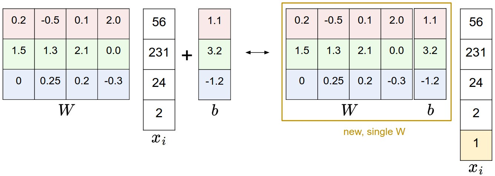

# Image Classification with Linear Classifiers

## The Image Classification Task

Image classification is a fundamental computer vision task where, given an image and a set of labels, the goal is to assign the image to one of the labels. This is essentially a supervised learning problem where we want to learn a mapping from input images to discrete class labels.

Formally given a dataset $\mathcal{D} = \{(x_i, y_i)\}_{i=1}^n$ where:

- $x_i$ is an input image (typically represented as a high-dimensional vector of pixel values)

- $y_i$ is the corresponding class label from a predefined set of categories $\{1, 2, \ldots, C\}$

- The task is to learn a function $f: \mathbb{R}^d \rightarrow \{1, 2, \ldots, C\}$ that can accurately predict the class label for new, unseen images

**Key challenges**:

- **High dimensionality**: Images are typically represented as very high-dimensional vectors (e.g., a 224×224 RGB image has 150,528 dimensions)

- **Variability**: The same object can appear in different poses, lighting conditions, scales, backgrounds, camera movements, with background clutter, at different scales (zoom) within the image, with partial occlusion, deformation, and varying contextual information

- **Intra-class variation**: Objects within the same class can look very different

- **Inter-class similarity**: Objects from different classes can sometimes look very similar

## Machine Learning: Data-Driven Approach

The machine learning approach to image classification follows a systematic, data-driven methodology that can be broken down into three main steps:

**1. Collect a Dataset of Images and Labels:** The first step involves gathering a comprehensive dataset where each image is paired with its corresponding class label.

**2. Use ML Algorithms to Train a Classifier:** Once we have the dataset, we employ machine learning algorithms like Linear Regression, Support Vector Machines (SVM), or Logistic Regression to learn a mapping from images to class labels. The choice of algorithm depends on the complexity of the problem, dataset size, and computational constraints. 

**3. Evaluate the Classifier on New Images:** The final step is to assess how well the trained classifier performs on previously unseen images. This evaluation process includes measuring accuracy, precision, recall, and F1-score on the held-out test set. Also includes validation techniques like k-fold cross-validation to get robust performance estimates.

## k-Nearest Neighbors (k-NN) Algorithm

The k-Nearest Neighbors algorithm is one of the simplest and most intuitive machine learning algorithms for classification. It's a non-parametric, instance-based learning method that makes predictions based on the similarity of new examples to previously seen training examples.

**Training Phase**: k-NN is a "lazy learner" - it doesn't actually learn a model during training. Instead, it simply stores all the training examples and their labels.

**Prediction Phase**: For a new test image, k-NN:

1. Computes the distance between the test image and all training images

2. Identifies the k nearest training examples (neighbors)

3. Assigns the class label that appears most frequently among these k neighbors

The choice of distance metric is crucial for k-NN performance:

- **Euclidean Distance**: $d(x, y) = \sqrt{\sum_{i=1}^{n}(x_i - y_i)^2}$

- **Manhattan Distance**: $d(x, y) = \sum_{i=1}^{n}|x_i - y_i|$

- **Cosine Similarity**: $d(x, y) = 1 - \frac{x \cdot y}{||x|| \cdot ||y||}$

Understanding the computational efficiency of k-NN requires analyzing its time complexity using Big O notation.

**Big O Notation**: $O(f(n))$ describes how the runtime of an algorithm grows as the input size $n$ increases. It provides an upper bound on the worst-case performance, focusing on the dominant term and ignoring constants and lower-order terms.

**k-NN Time Complexity**:

- **Training Time**: $O(1)$ - k-NN doesn't perform any computation during training; it simply stores the training data

- **Prediction Time**: $O(N)$ - For each prediction, k-NN must compute distances to all $N$ training examples

In real-world applications, we typically want classifiers that are **fast at prediction** and can tolerate **slow training** because:

1. **Training happens once**: We train the model offline, often overnight or over days, so training time is less critical
2. **Prediction happens repeatedly**: Once deployed, the model makes thousands or millions of predictions per day
3. **Real-time requirements**: Many applications (autonomous vehicles, medical diagnosis, security systems) need immediate predictions
4. **Scalability**: As the dataset grows, k-NN prediction time grows linearly, making it impractical for large-scale systems

This is why we often prefer **parametric models** (like linear classifiers) that invest computational effort upfront during training to enable fast predictions later.

## Linear Classifiers

kNN has a number of disadvantages:

- The classifier must remember all of the training data and store it for future comparisons with the test data. This is space inefficient because datasets may easily be gigabytes in size.
- Classifying a test image is expensive since it requires a comparison to all training images.

We are now going to develop a more powerful approach to image classification that we will eventually naturally extend to Neural Networks. The approach will have two major components: a score function that maps the raw data to class scores, and a loss function that quantifies the agreement between the predicted scores and the ground truth labels. We will then cast this as an optimization problem in which we will minimize the loss function with respect to the parameters of the score function.

### Parameterized mapping from images to label scores

The first component of this approach is to define the score function that maps the pixel values of an image to confidence scores for each class. We will develop the approach with a concrete example. Let's assume a training dataset of images $x_i \in \mathbb{R}^D$, each associated with a label $y_i$. Here $i = 1 \ldots N$ and $y_i \in 1 \ldots K$. That is, we have $N$ examples (each with a dimensionality $D$) and $K$ distinct categories. For example, in CIFAR-10 we have a training set of $N = 50,000$ images, each with $D = 32 \times 32 \times 3 = 3072$ pixels, and $K = 10$, since there are 10 distinct classes (dog, cat, car, etc). We will now define the score function $f: \mathbb{R}^D \mapsto \mathbb{R}^K$ that maps the raw image pixels to class scores.

We will start out with arguably the simplest possible function, a linear mapping:

$$f(x_i, W, b) = Wx_i + b$$

In the above equation, we are assuming that the image $x_i$ has all of its pixels flattened out to a single column vector of shape $[D \times 1]$. The matrix $W$ (of size $[K \times D]$), and the vector $b$ (of size $[K \times 1]$) are the parameters of the function. In CIFAR-10, $x_i$ contains all pixels in the $i$-th image flattened into a single $[3072 \times 1]$ column, $W$ is $[10 \times 3072]$ and $b$ is $[10 \times 1]$, so 3072 numbers come into the function (the raw pixel values) and 10 numbers come out (the class scores). The parameters in $W$ are often called the **weights**, and $b$ is called the **bias vector** because it influences the output scores, but without interacting with the actual data $x_i$.

There are a few things to note:

1. **First**, note that the single matrix multiplication $Wx_i$ is effectively evaluating 10 separate classifiers in parallel (one for each class), where each classifier is a row of $W$.

2. **Notice also** that we think of the input data $(x_i, y_i)$ as given and fixed, but we have control over the setting of the parameters $W, b$. Our goal will be to set these in such way that the computed scores match the ground truth labels across the whole training set. We will go into much more detail about how this is done, but intuitively we wish that the correct class has a score that is higher than the scores of incorrect classes.

3. **An advantage** of this approach is that the training data is used to learn the parameters $W, b$, but once the learning is complete we can discard the entire training set and only keep the learned parameters. That is because a new test image can be simply forwarded through the function and classified based on the computed scores.

4. **Lastly**, note that classifying the test image involves a single matrix multiplication and addition, which is significantly faster than comparing a test image to all training images.

**Geometric Interpretation**

To understand linear classifiers geometrically, let's first consider the general form of a plane in ℝ³:

$$ax + by + cz = d$$

where $(a, b, c)$ is the **normal vector** to the plane and $d$ determines the plane's position in space.

- The normal vector $(a, b, c)$ is perpendicular to the plane

- The plane divides 3D space into two half-spaces

- Points on one side of the plane satisfy $ax + by + cz > d$

- Points on the other side satisfy $ax + by + cz < d$

- Points on the plane satisfy $ax + by + cz = d$

**Example**: The plane $2x - 3y + 4z = 12$ has normal vector $(2, -3, 4)$.

Now, let's see how this relates to linear classifiers. In a binary classification problem, our linear classifier computes:

$$f(x) = w^T x + b$$

where $w$ is the weight vector and $b$ is the bias.

**The Decision Boundary**: The equation $w^T x + b = 0$ defines a **hyperplane** in the input space that separates the two classes. This is exactly analogous to the plane equation $ax + by + cz = d$. This is how:

- $w$ is the **normal vector** to the hyperplane (just like $(a, b, c)$ in the plane equation)

- $b$ determines the **position** of the hyperplane (just like $d$ in the plane equation)

- The hyperplane divides the input space into two half-spaces

- Points in one half-space are classified as class 1 ($w^T x + b > 0$)

- Points in the other half-space are classified as class 2 ($w^T x + b < 0$)

**Multi-class extension**: For $K$ classes, we have $K$ hyperplanes, each defined by a row of the weight matrix $W$. 

In the multi-class case, we have $K$ score functions:

$$f_1(x) = w_1^T x + b_1$$

$$f_2(x) = w_2^T x + b_2$$

$$\vdots$$

$$f_K(x) = w_K^T x + b_K$$

The classifier predicts class $i$ if $f_i(x) > f_j(x)$ for all $j \neq i$.

The decision boundary between classes $i$ and $j$ is the set of points where the classifier is indifferent between the two classes, i.e., where $f_i(x) = f_j(x)$.

Starting with:

$$f_i(x) = f_j(x)$$

Substituting the score functions:

$$w_i^T x + b_i = w_j^T x + b_j$$

Rearranging terms:

$$w_i^T x - w_j^T x = b_j - b_i$$

Factoring out $x$:

$$(w_i - w_j)^T x = b_j - b_i$$

Moving all terms to one side:

$$(w_i - w_j)^T x + (b_i - b_j) = 0$$

The decision boundary between classes $i$ and $j$ is the hyperplane:

$$(w_i - w_j)^T x + (b_i - b_j) = 0$$

Note:

- The normal vector to this decision boundary is $(w_i - w_j)$

- The bias term is $(b_i - b_j)$

- Points on one side of this hyperplane are classified as class $i$

- Points on the other side are classified as class $j$

- Points on the hyperplane are exactly at the decision boundary

**Why this matters**: This geometric interpretation helps us understand that:

1. Linear classifiers create **linear decision boundaries**

2. The weight vector $w$ determines the **orientation** of the decision boundary

3. The bias $b$ determines the **position** of the decision boundary

4. The classifier's performance depends on how well the data can be separated by these linear boundaries

This connection between planes in ℝ³ and hyperplanes in linear classifiers provides an intuitive way to visualize and understand how linear classifiers work geometrically.

Coming back to CIFAR-10, we cannot visualize 3072-dimensional spaces, but if we imagine squashing all those dimensions into only two dimensions, then we can try to visualize what the classifier might be doing.


Above figure shows a cartoon representation of the image space, where each image is a single point, and three classifiers are visualized. For example, take the car classifier (in red), where the red line shows all points in the space that get a score of zero for the car class. The red arrow shows the direction of increase, so all points to the right of the red line have positive (and linearly increasing) scores, and all points to the left have a negative (and linearly decreasing) scores.

As we saw above, every row of $W$ is a classifier for one of the classes. The geometric interpretation of these numbers is that as we change one of the rows of $W$, the corresponding line in the pixel space will rotate in different directions. The biases $b$, on the other hand, allow our classifiers to translate the lines.

### Template Matching interpretation

Another interpretation for the weights $W$ is that each row of $W$ corresponds to a template (or sometimes also called a prototype) for one of the classes. The score of each class for an image is then obtained by comparing each template with the image using an inner product (or dot product) one by one to find the one that "fits" best. With this terminology, the linear classifier is doing template matching, where the templates are learned. Another way to think of it is that we are still effectively doing Nearest Neighbor, but instead of having thousands of training images we are only using a single image per class.

### Bias Trick

Recall that we defined the score function as:

$$f(x_i, W, b) = Wx_i + b$$

It is a little cumbersome to keep track of two sets of parameters (the biases $b$ and weights $W$) separately. A commonly used trick is to combine the two sets of parameters into a single matrix that holds both of them by extending the vector $x_i$ with one additional dimension that always holds the constant 1- a default bias dimension. With the extra dimension, the new score function will simplify to a single matrix multiply:

$$f(x_i, W) = Wx_i$$

With our CIFAR-10 example, $x_i$ is now $[3073 \times 1]$ instead of $[3072 \times 1]$ - (with the extra dimension holding the constant 1), and $W$ is now $[10 \times 3073]$ instead of $[10 \times 3072]$. The extra column that $W$ now corresponds to the bias $b$. An illustration might help clarify this transformation.



### Loss Function

We are going to measure our unhappiness with outcomes such as this one with a loss function (or sometimes also referred to as the cost function or the objective). Intuitively, the loss will be high if we’re doing a poor job of classifying the training data, and it will be low if we’re doing well.

#### Multiclass Support Vector Machine loss

The SVM loss is set up so that the SVM "wants" the correct class for each image to have a score higher than the incorrect classes by some fixed margin $\Delta$.

Recall that for the $i$-th example we are given the pixels of image $x_i$ and the label $y_i$ that specifies the index of the correct class. The score function takes the pixels and computes the vector $f(x_i,W)$ of class scores, which we will abbreviate to $s$ (short for scores). For example, the score for the $j$-th class is the $j$-th element: $s_j = f(x_i,W)_j$. The Multiclass SVM loss for the $i$-th example is then formalized as follows:

$$L_i = \sum_{j \neq y_i} \max(0, s_j - s_{y_i} + \Delta)$$

**Example.** Let's unpack this with an example to see how it works. Suppose that we have three classes that receive the scores $s = [13, -7, 11]$, and that the first class is the true class (i.e. $y_i = 0$). Also assume that $\Delta$ (a hyperparameter we will go into more detail about soon) is 10. The expression above sums over all incorrect classes ($j \neq y_i$), so we get two terms:

$$L_i = \max(0, -7 - 13 + 10) + \max(0, 11 - 13 + 10)$$

You can see that the first term gives zero since $[-7 - 13 + 10]$ gives a negative number, which is then thresholded to zero with the $\max(0, -)$ function. We get zero loss for this pair because the correct class score (13) was greater than the incorrect class score (-7) by at least the margin 10. In fact the difference was 20, which is much greater than 10 but the SVM only cares that the difference is at least 10; any additional difference above the margin is clamped at zero with the max operation. The second term computes $[11 - 13 + 10]$ which gives 8. That is, even though the correct class had a higher score than the incorrect class (13 > 11), it was not greater by the desired margin of 10. The difference was only 2, which is why the loss comes out to 8 (i.e. how much higher the difference would have to be to meet the margin). In summary, the SVM loss function wants the score of the correct class $y_i$ to be larger than the incorrect class scores by at least by $\Delta$ (delta). If this is not the case, we will accumulate loss.


### Softmax Classifier

Unlike the SVM which treats the outputs $f(x_i,W)$ as (uncalibrated and possibly difficult to interpret) scores for each class, the Softmax classifier gives a slightly more intuitive output (normalized class probabilities) and also has a probabilistic interpretation that we will describe shortly. In the Softmax classifier, the function mapping $f(x_i;W) = Wx_i$ stays unchanged, but we now interpret these scores as the unnormalized log probabilities for each class and replace the hinge loss with a cross-entropy loss. The function $f_j(z) = \frac{e^{z_j}}{\sum_k e^{z_k}}$ is called the softmax function: it takes a vector of arbitrary real-valued scores (in $z$) and squashes it to a vector of values between zero and one that sum to one.

The cross-entropy between a "true" distribution $p$ and an estimated distribution $q$ is defined as:

$$H(p, q) = -\sum_x p(x) \log q(x)$$

*Note: This derivation is for the $i$-th sample, where $y_i$ is the correct class label for that sample.*

For the Softmax classifier, we have:

- True distribution: $p_i = [0, \ldots, 1, \ldots, 0]$ (one-hot vector with 1 at position $y_i$)

- Estimated distribution: $q_{i,j} = \frac{e^{f_j}}{\sum_k e^{f_k}}$ (softmax probabilities)

Substituting into the cross-entropy formula:

$$H(p_i,q_i) = -\sum_{j=1}^{K} p_{i,j} \log q_{i,j}$$

Since $p_i$ is a one-hot vector, only $p_{i,y_i} = 1$ and all other $p_{i,j} = 0$:

$$H(p_i,q_i) = -p_{i,y_i} \log q_{i,y_i} - \sum_{j \neq y_i} p_{i,j} \log q_{i,j} = -1 \cdot \log q_{i,y_i} - \sum_{j \neq y_i} 0 \cdot \log q_{i,j}$$

$$H(p_i,q_i) = -\log q_{i,y_i} = -\log\left(\frac{e^{f_{y_i}}}{\sum_k e^{f_k}}\right) = L_i$$

$$L_i = -\log\left(\frac{e^{f_{y_i}}}{\sum_j e^{f_j}}\right) \quad \text{or equivalently} \quad L_i = -f_{y_i} + \log\sum_j e^{f_j}$$

where we are using the notation $f_j$ to mean the $j$-th element of the vector of class scores $f$. As before, the full loss for the dataset is the mean of $L_i$ over all training examples together with a regularization term $R(W)$. The function $f_j(z) = \frac{e^{z_j}}{\sum_k e^{z_k}}$ is called the softmax function: it takes a vector of arbitrary real-valued scores (in $z$) and squashes it to a vector of values between zero and one that sum to one.

Therefore, the cross-entropy between the true one-hot distribution and the estimated softmax distribution is exactly the Softmax loss $L_i$.

The Softmax classifier is hence minimizing the cross-entropy between the estimated class probabilities ($q_{i,j} = e^{f_{y_i}}/\sum_j e^{f_j}$ as seen above) and the "true" distribution, which in this interpretation is the distribution where all probability mass is on the correct class (i.e. $p_i = [0, \ldots, 1, \ldots, 0]$ contains a single 1 at the $y_i$-th position.).

#### The KL Divergence connection

Before diving into KL divergence, let's understand entropy. The entropy $H(p)$ of a distribution $p$ measures the average amount of information (or uncertainty) in the distribution:

$$H(p) = -\sum_x p_{x} \log p_{x}$$

- **High entropy**: Distribution is spread out, high uncertainty (e.g., uniform distribution)

- **Low entropy**: Distribution is concentrated, low uncertainty (e.g., one-hot distribution)

*Note: This derivation is for the $i$-th sample, where $y_i$ is the correct class label for that sample.*

For our one-hot true distribution $p_i$ where $p_{i,y_i} = 1$ and $p_{i,j} = 0$ for $j \neq y_i$:

$$H(p_i) = -p_{i,y_i} \log p_{i,y_i} - \sum_{j \neq y_i} p_{i,j} \log p_{i,j} = -1 \cdot \log 1 - \sum_{j \neq y_i} 0 \cdot \log 0 = 0$$

The entropy is zero because there's no uncertainty - we know exactly which class is correct.

The KL divergence $D_{KL}(p||q)$ measures how much information is lost when we use distribution $q$ to approximate distribution $p$. It's defined as:

$$D_{KL}(p||q) = \sum_x p_{x} \log\left(\frac{p_{x}}{q_{x}}\right)$$

*Note: This derivation is for the $i$-th sample, where $y_i$ is the correct class label for that sample.*

For our one-hot true distribution $p_i$ where $p_{i,y_i} = 1$ and $p_{i,j} = 0$ for $j \neq y_i$:

$$D_{KL}(p_i||q_i) = p_{i,y_i} \log\left(\frac{p_{i,y_i}}{q_{i,y_i}}\right) + \sum_{j \neq y_i} p_{i,j} \log\left(\frac{p_{i,j}}{q_{i,j}}\right)$$

$$D_{KL}(p_i||q_i) = 1 \cdot \log\left(\frac{1}{q_{i,y_i}}\right) + \sum_{j \neq y_i} 0 \cdot \log\left(\frac{0}{q_{i,j}}\right) = -\log q_{i,y_i}$$

Since $H(p_i) = 0$ (the entropy of a deterministic distribution is zero), we have:

$$H(p_i,q_i) = H(p_i) + D_{KL}(p_i||q_i) = 0 + (-\log q_{i,y_i}) = -\log q_{i,y_i} = L_i$$

This shows that minimizing the cross-entropy loss is exactly equivalent to minimizing the KL divergence between the true one-hot distribution and the predicted softmax distribution. The KL divergence is zero only when $q_{i,y_i} = 1$ (perfect confidence in the correct class), and it increases as the predicted probability of the correct class decreases.

#### Practical issues: numeric stability

When you're writing code for computing the Softmax function in practice, the intermediate terms $e^{f_{y_i}}$ and $\sum_j e^{f_j}$ may be very large due to the exponentials. Dividing large numbers can be numerically unstable, so it is important to use a normalization trick. Notice that if we multiply the top and bottom of the fraction by a constant $C$ and push it into the sum, we get the following (mathematically equivalent) expression:

$$\frac{e^{f_{y_i}}}{\sum_j e^{f_j}} = \frac{C e^{f_{y_i}}}{C \sum_j e^{f_j}} = \frac{e^{f_{y_i} + \log C}}{\sum_j e^{f_j + \log C}}$$

We are free to choose the value of $C$. This will not change any of the results, but we can use this value to improve the numerical stability of the computation. A common choice for $C$ is to set $\log C = -\max_j f_j$. This simply states that we should shift the values inside the vector $f$ so that the highest value is zero.

**Example code:**

```python
f = np.array([123, 456, 789]) # example with 3 classes and each having large scores
p = np.exp(f) / np.sum(np.exp(f)) # Bad: Numeric problem, potential blowup

# instead: first shift the values of f so that the highest number is 0:
f -= np.max(f) # f becomes [-666, -333, 0]
p = np.exp(f) / np.sum(np.exp(f)) # safe to do, gives the correct answer
``` 

### SVM vs. Softmax

A picture might help clarify the distinction between the Softmax and SVM classifiers using an example.


### Final notes on terminology

**1. Softmax**

The softmax function is not a classifier itself, but it is an essential component of a classifier. The term "softmax classifier" is often used informally to describe a multi-class classification model that uses the softmax function in its final layer. However, the actual classification work—the process of learning to predict the correct classes—is done by the entire model, not just the softmax layer.

**2. SVM**

A "linear classifier + SVM loss function" is a Linear SVM. This is not a new or different kind of model; it is simply a Support Vector Machine that uses a linear function to find the optimal decision boundary.

The key components of a Linear SVM are:

- **Linear decision function**: $f(x) = Wx + b$

- **Hinge loss**: $L_i = \sum_{j \neq y_i} \max(0, s_j - s_{y_i} + \Delta)$

- **Margin maximization**: The SVM tries to maximize the margin between classes

The term "Linear SVM" emphasizes that the decision boundary is linear (a hyperplane), as opposed to kernel SVMs that can have non-linear decision boundaries through the kernel trick.

## Additional References

Here are some (optional) links you may find interesting for further reading:

[A Few Useful Things to Know about Machine Learning](https://homes.cs.washington.edu/~pedrod/papers/cacm12.pdf), where especially section 6 is related but the whole paper is a warmly recommended reading.

[Recognizing and Learning Object Categories](https://people.csail.mit.edu/torralba/shortCourseRLOC/index.html), a short course of object categorization at ICCV 2005.

[Deep Learning using Linear Support Vector Machines](https://arxiv.org/abs/1306.0239) from Charlie Tang 2013 presents some results claiming that the L2SVM outperforms Softmax.