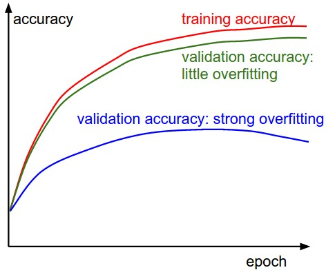
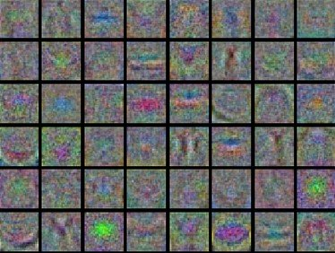

# Neural Networks: Learning and Evaluation

## Learning

### Gradient Checks

In theory, performing a gradient check is as simple as comparing the analytic gradient to the numerical gradient. In practice, the process is much more involved and error prone. Here are some tips, tricks, and issues to watch out for:

**Use the centered formula:** The formula you may have seen for the finite difference approximation when evaluating the numerical gradient looks as follows:

$$\frac{df(x)}{dx} = \frac{f(x+h) - f(x)}{h}$$

where $h$ is a small number, which in practice is approximately 1e-5 or so. In practice, it is often much better to use the centered formula:

$$\frac{df(x)}{dx} = \frac{f(x+h) - f(x-h)}{2h}$$

The forward difference formula can reuse the baseline evaluation $f(x)$ across all dimensions, requiring only $1 + n$ total evaluations (where $n$ is the number of parameters). However, the centered formula needs $2n$ evaluations because each dimension requires two separate function calls: $f(x+h)$ and $f(x-h)$ for that specific parameter. This is nearly twice as expensive, but the gradient approximation turns out to be much more precise.

**Example with $x = [x_1, x_2, x_3, x_4]$:**

*Forward difference formula:*

- $f(x)$ (baseline, reused for all dimensions)

- $f([x_1+h, x_2, x_3, x_4])$ (for $\partial f/\partial x_1$)

- $f([x_1, x_2+h, x_3, x_4])$ (for $\partial f/\partial x_2$)  

- $f([x_1, x_2, x_3+h, x_4])$ (for $\partial f/\partial x_3$)

- $f([x_1, x_2, x_3, x_4+h])$ (for $\partial f/\partial x_4$)

- **Total: 5 evaluations**

*Centered difference formula:*

- $f([x_1+h, x_2, x_3, x_4])$ and $f([x_1-h, x_2, x_3, x_4])$ (for $\partial f/\partial x_1$)

- $f([x_1, x_2+h, x_3, x_4])$ and $f([x_1, x_2-h, x_3, x_4])$ (for $\partial f/\partial x_2$)

- $f([x_1, x_2, x_3+h, x_4])$ and $f([x_1, x_2, x_3-h, x_4])$ (for $\partial f/\partial x_3$)

- $f([x_1, x_2, x_3, x_4+h])$ and $f([x_1, x_2, x_3, x_4-h])$ (for $\partial f/\partial x_4$)

- **Total: 8 evaluations**

**Use relative error for the comparison:** What are the details of comparing the numerical gradient $f'_n$ to the analytic gradient $f'_a$? You might be tempted to keep track of whether their difference is greater than some threshold (e.g. 1e-4). However, this is problematic. For example, consider the case where their difference is 1e-4, and if the analytic gradient is 1e-2 then we'd consider the quantities to be very close, and hence the gradient would be okay. But if we consider the case where the analytic gradient is 1e-5, then we'd consider 1e-4 to be a huge difference, and hence the gradient would be bad. It is more appropriate to consider the relative error:

$$\frac{|f'_a - f'_n|}{\max(|f'_a|, |f'_n|)}$$

which considers their ratio of the differences to the ratio of the absolute values of both gradients. In practice:

- relative error > 1e-2 usually means the gradient is probably wrong
- 1e-2 > relative error > 1e-4 should make you feel uncomfortable
- 1e-4 > relative error is usually okay for objectives with kinks. But if there are no kinks (e.g. use of tanh nonlinearities), then 1e-4 is too high.
- 1e-7 and less you should be happy.

Also keep in mind that the deeper the network, the higher the relative errors will be. So if you are gradient checking the input data for a 10-layer network, a relative error of 1e-2 might be okay because the errors build up on the way. Conversely, an error of 1e-2 for a single differentiable function likely indicates incorrect gradient.

**Use double precision:** A common pitfall is using single precision floating point to compute gradient check. It is often that case that you might get high relative errors (as high as 1e-2) even with a correct gradient implementation. Sometimes relative errors plummet from 1e-2 to 1e-8 by switching to double precision.

**Stick around active range of floating point:** It's a good idea to read through ["What Every Computer Scientist Should Know About Floating-Point Arithmetic"](http://docs.oracle.com/cd/E19957-01/806-3568/ncg_goldberg.html), as it may demystify your errors and enable you to write more careful code. For example, in neural nets it can be common to normalize the loss function over the batch. However, if your gradients per datapoint are very small, then *additionally* dividing them by the number of data points is starting to give very small numbers, which in turn will lead to more numerical issues. You may want to temporarily scale your loss function up by a constant to bring them to a "nicer" range where floats are more dense- ideally on the order of 1e-3 to 1e-1.

**Be careful with the step size h:** It is not necessarily the case that smaller $h$ is better, because when $h$ is much smaller, you might start running into numerical precision issues. Sometimes when the gradient doesn't check, it is possible that you change $h$ to be $1e-4$ or $1e-6$ and suddenly the gradient will pass. This has to do with numerical precision issues with the finite difference approximation.

**Gradcheck during a "characteristic" mode of operation:** It is important to realize that a gradient check is performed at a particular (and usually random), single point in the space of parameters. Even if the gradient check succeeds at that point, it is not immediately certain that the gradient is correctly implemented globally. Additionally, a random initialization might not be the most "characteristic" point in the space of parameters and may in fact introduce pathological situations where the gradient seems to be correctly implemented but isn't. To be safe it is best to use a short burn-in time during which the network is allowed to learn and perform the gradient check after the loss starts to go down. The danger of performing it at the first iteration is that this could introduce pathological edge cases and mask an incorrect implementation of the gradient.

**Don't let the regularization overwhelm the data:** It is often the case that a loss function is a sum of the data loss and the regularization loss (e.g. L2 penalty on weights). One danger to be aware of is that the regularization loss may overwhelm the data loss, in which case the gradients will be primarily coming from the regularization term (which usually has a much simpler gradient expression). This can mask an incorrect implementation of the data loss gradient. Therefore, it is recommended to turn off regularization and check the data loss alone first, and then the regularization term second and independently.

**Remember to turn off dropout:** Turn off any non-deterministic effects in your network, such as dropout. Otherwise the gradient check will fail. Dropout introduces randomness by randomly setting some neurons to zero during training. This creates several problems for gradient checking. Each time you evaluate the loss function $f(x)$, dropout randomly masks different neurons, so $f(x)$ and $f(x+h)$ are computed with different random patterns. This means the numerical gradient $\frac{f(x+h) - f(x)}{h}$ includes noise from the random dropout patterns, not just the true gradient. The noise introduced by dropout can be much larger than the actual gradient differences you're trying to measure. The analytic gradient is computed assuming all neurons are active (no dropout), but the numerical gradient is computed with random dropout applied. This creates a fundamental mismatch between what you're comparing. Always set your network to evaluation mode (which disables dropout) before performing gradient checks. In PyTorch, this means calling `model.eval()`, and in TensorFlow, ensure dropout layers are disabled during the gradient check.

**Check only a few dimensions**. Gradient checks can be expensive to run. If you have many parameters, it can be good practice to check only some of the dimensions of the gradient and assume that the others are correct.

### Before learning: sanity checks Tips/Tricks

Here are a few sanity checks you might consider running before you plunge into expensive optimization.

- Make sure you're getting the loss you expect when you initialize with small parameters. It's best to first check the data loss alone (so set regularization strength to zero). For example, for CIFAR-10 with a Softmax classifier we would expect the initial loss to be 2.302, because we expect a diffuse probability of 0.1 for each class (since there are 10 classes), and Softmax loss is the negative log probability of the correct class so: -ln(0.1) = 2.302. If you're not seeing these losses there might be issue with initialization.
- As a second sanity check, increasing the regularization strength should increase the loss.
- Lastly and most importantly, before training on the full dataset try to train on a tiny portion (e.g. 20 examples) of your data and make sure you can achieve zero cost. For this experiment it's also best to set regularization to zero, otherwise this can prevent you from getting zero cost. Unless you pass this sanity check with a small dataset it is not worth proceeding to the full dataset.

### Babysitting the learning process

There are multiple useful quantities you should monitor during training of a neural network. These plots are the window into the training process and should be utilized to get intuitions about different hyperparameter settings and how they should be changed for more efficient learning.

The x-axis of the plots below are always in units of epochs, which measure how many times every example has been seen during training in expectation (e.g. one epoch means that every example has been seen once). It is preferable to track epochs rather than iterations since the number of iterations depends on the arbitrary setting of batch size.

#### Loss function

The first quantity that is useful to track during training is the loss, as it is evaluated on the individual batches during the forward pass. Below is a cartoon diagram showing the loss over time, and especially what the shape might tell you about the learning rate.


*Top: A cartoon depicting the effects of different learning rates. With low learning rates the improvements will be linear. With high learning rates they will start to look more exponential. Higher learning rates will decay the loss faster, but they get stuck at worse values of loss (green line). This is because there is too much "energy" in the optimization and the parameters are bouncing around chaotically, unable to settle in a nice spot in the optimization landscape. Down: An example of a typical loss function over time, while training a small network on CIFAR-10 dataset. This loss function looks reasonable (it might indicate a slightly too small learning rate based on its speed of decay, but it's hard to say), and also indicates that the batch size might be a little too low (since the cost is a little too noisy).*

The amount of "wiggle" in the loss is related to the batch size. When the batch size is 1, the wiggle will be relatively high. When the batch size is the full dataset, the wiggle will be minimal because every gradient update should be improving the loss function monotonically (unless the learning rate is set too high).

Sometimes loss functions can look funny [lossfunctions.tumblr.com](http://lossfunctions.tumblr.com/).

#### Train/Val accuracy

The second important quantity to track while training a classifier is the validation/training accuracy. This plot can give you valuable insights into the amount of overfitting in your model:



*The gap between the training and validation accuracy indicates the amount of overfitting. Two possible cases are shown in the diagram on the left. The blue validation error curve shows very small validation accuracy compared to the training accuracy, indicating strong overfitting (note, it's possible for the validation accuracy to even start to go down after some point). When you see this in practice you probably want to increase regularization (stronger L2 weight penalty, more dropout, etc.) or collect more data. The other possible case is when the validation accuracy tracks the training accuracy fairly well.*

#### Ratio of weights:updates

The last quantity you might want to track is the ratio of the update magnitudes to the value magnitudes. Note: updates, not the raw gradients (e.g. in vanilla sgd this would be the gradient multiplied by the learning rate). You might want to evaluate and log the norm of the weights (or some subset of the weights), and the norm of the updates (or again, some subset). Looking at the ratio of these two quantities can be helpful. For a single weight this ratio should be somewhere around $1e-3$. If it is much smaller than this then the learning rate might be too low. If it is much higher then the learning rate might be too high.

```python
# assume parameter vector W and its gradient vector dW
param_scale = np.linalg.norm(W.ravel())
update = -learning_rate*dW # simple SGD update
update_scale = np.linalg.norm(update.ravel())
W += update # the actual update
print update_scale / param_scale # want ~1e-3
```

#### First-layer Visualizations

Lastly, when one is working with image pixels it can be helpful and satisfying to plot the first-layer features visually.




*Examples of visualized weights for the first layer of a neural network. Top: Noisy features indicate could be a symptom: Unconverged network, improperly set learning rate, very low weight regularization penalty. Bottom: Nice, smooth, clean and diverse features are a good indication that the training is proceeding well.*

### Parameter updates

Once the analytic gradient is computed with backpropagation, the gradients are used to perform a parameter update. There are several approaches for performing the update, which we discuss next.

#### SGD and bells and whistles

**Vanilla update:** The simplest form of update is to change the parameters along the negative gradient direction (since the gradient indicates the direction of increase, but we usually wish to minimize a loss function). Assuming a vector of parameters $x$ and the gradient $dx$, the simplest update has the form:

```python
# Vanilla update
x += - learning_rate * dx
```

where $learning\_rate$ is a hyperparameter- a fixed constant. When evaluated on the full dataset, and when the learning rate is low enough, this is guaranteed to make non-negative progress on the loss function.

**Momentum update:** Another approach that almost always enjoys better converge rates on deep networks. Here is the momentum update:

```python
# Momentum update
v = mu * v - learning_rate * dx
x += v
```

Here we see an introduction of a $v$ variable that is initialized at zero, and an additional hyperparameter ($mu$). As an unfortunate misnomer, this variable is in optimization referred to as *momentum* (its typical value is about 0.9), but its physical meaning is more consistent with the coefficient of friction. Effectively, this variable damps the effect of the learning rate. When cross-validated, this parameter is usually set to values such as [0.5, 0.9, 0.95, 0.99]. Similar to annealing schedules for learning rates (discussed later, below), optimization can sometimes benefit a little from momentum schedules, where the momentum is increased in later stages of learning.

**Nesterov Momentum** is a slightly different version of the momentum update. It enjoys stronger theoretical converge guarantees for convex functions and in practice it also consistenly works slightly better than standard momentum.

The core idea behind Nesterov momentum is that when the current parameter vector is at some position $x$, then looking at the momentum update above, we know that the momentum term alone (i.e. ignoring the second term with the gradient) is about to nudge the parameter vector by $mu \cdot v$. Therefore, if we are about to compute the gradient, we can treat the future approximate position $x + mu \cdot v$ as a "lookahead" - this is a point in the vicinity of where we are soon going to end up. Hence, it makes sense to compute the gradient at $x + mu \cdot v$ instead of at the "old/stale" position $x$.


*Nesterov momentum. Instead of evaluating gradient at the current position (red circle), we know that our momentum is about to carry us to the tip of the green arrow. With Nesterov momentum we therefore instead evaluate the gradient at this "looked-ahead" position.*

That is, in a slightly awkward notation, we would like to do the following:

```python
x_ahead = x + mu * v
# evaluate dx_ahead (the gradient at x_ahead instead of at x)
v = mu * v - learning_rate * dx_ahead
x += v
```

#### Annealing the learning rate

In training deep networks, it is usually helpful to anneal the learning rate over time. Good intuition to have in mind is that with a high learning rate, the system contains too much kinetic energy and the parameter vector bounces around chaotically, unable to settle down into deep, narrow valleys of the loss function (where the optimum might be). Knowing when to decay the learning rate can be tricky: Decay it slowly and you'll be wasting computation bouncing around chaotically with little improvement for a long time. But decay it too aggressively and the system will cool too quickly, unable to reach the best position it can.

There are three common types of implementing the learning rate decay:

**Step decay**: Reduce the learning rate by some factor every few epochs. Typical values might be reducing the learning rate by a half every 5 epochs, or by a factor of 0.1 every 20 epochs. These numbers depend heavily on the type of problem and the model.

**Exponential decay**: Has the mathematical form $\alpha = \alpha_0 e^{-kt}$, where $\alpha_0, k$ are hyperparameters and $t$ is the iteration number (but you can also use units of epochs).

**1/t decay**: Has the mathematical form $\alpha = \alpha_0/(1+kt)$ where $\alpha_0, k$ are hyperparameters and $t$ is the iteration number.

In practice, we find that the step decay is slightly preferable because the hyperparameters it involves are more interpretable than the hyperparameters involved in the other two methods.

#### Second order methods

A second, popular group of methods for optimization in context of deep learning is based on Newton's method, which iterates the following update:

$$x \leftarrow x - [H f(x)]^{-1} \nabla f(x)$$

Here, $H f(x)$ is the Hessian matrix, which is a square matrix of second-order partial derivatives of the function. The term $\nabla f(x)$ is the gradient vector, as seen in Gradient Descent. Intuitively, the Hessian describes the local curvature of the loss function, which allows us to perform a more efficient update. In particular, multiplying by the inverse Hessian leads the optimization to take more aggressive steps in directions of shallow curvature and shorter steps in directions of steep curvature. Note, crucially, the absence of any learning rate hyperparameters in the update formula, which the proponents of these methods cite this as a large advantage over first-order methods.

However, the update above is impractical for most deep learning applications because computing (and inverting) the Hessian in its explicit form is a very costly process in both space and time. For instance, a Neural Network with one million parameters would have a Hessian matrix of size $[1,000,000 \times 1,000,000]$, occupying approximately 3725 gigabytes of RAM. In practice, it is currently not common to second-order methods applied to large-scale Deep Learning and Convolutional Neural Networks. Instead, SGD variants based on (Nesterov's) momentum are more standard because they are simpler and scale more easily.

Additional references:

- [Large Scale Distributed Deep Networks](https://papers.nips.cc/paper/2012/hash/6aca97005c68f1206823815f77529675-Abstract.html) is a paper from the Google Brain team, comparing L-BFGS and SGD variants in large-scale distributed optimization.
- SFO algorithm strives to combine the advantages of SGD with advantages of L-BFGS.

#### Per-parameter adaptive learning rates

All previous approaches we've discussed so far manipulated the learning rate in a dimension-independent way. The following methods adapt the learning rate on a per-parameter basis, and can give more fine-grained control.

**Adagrad:** Adaptive learning rate method originally proposed by [Duchi et al.](http://jmlr.org/papers/v12/duchi11a.html)

```python
# Assume the gradient dx and parameter vector x
cache += dx**2
x += - learning_rate * dx / (np.sqrt(cache) + eps)
```

Notice that the variable $cache$ has size equal to the gradient matrix, and keeps track of per-parameter sum of squared gradients. This is then used to normalize the parameter update step, element-wise. The net effect is that parameters that receive big gradients will have their effective learning rate reduced, while parameters that receive small or infrequent updates will have their effective learning rate increased. Amusingly, the square root operation turns out to be very important and without it the algorithm performs much worse. The smoothing term $eps$ (usually set somewhere in range from 1e-4 to 1e-8) avoids division by zero. A downside of Adagrad is that in case of Deep Learning, a monotonically decreasing learning rate usually proves too aggressive and stops learning too early.

**RMSprop:** A very effective, but currently unpublished adaptive learning rate method. Amusingly, everyone who uses this method in their work currently cites slide 29 of [Lecture 6](http://www.cs.toronto.edu/~tijmen/csc321/slides/lecture_slides_lec6.pdf) of Geoff Hinton's Coursera class. The RMSProp update adjusts the Adagrad method in a very simple way in an attempt to reduce its aggressive, monotonically decreasing learning rate. In particular, it uses a moving average of squared gradients instead.

```python
cache = decay_rate * cache + (1 - decay_rate) * dx**2
x += - learning_rate * dx / (np.sqrt(cache) + eps)
```

Here, $decay\_rate$ is a hyperparameter and typical values are [0.9, 0.99, 0.999]. Notice that the $x+=$ update is identical to Adagrad. Hence, RMSProp still modulates the learning rate of each weight based on the magnitudes of its gradients, which has a beneficial equalizing effect, but unlike Adagrad the updates do not get monotonically smaller.

**Adam:** Works well in practice and compares favorably to RMSProp. For more details see the [paper](http://arxiv.org/abs/1412.6980).

```python
# Adam update
m = beta1*m + (1-beta1)*dx
v = beta2*v + (1-beta2)*(dx**2)
x += - learning_rate * m / (np.sqrt(v) + eps)
```

Notice that the update looks exactly as RMSProp update. Recommended values in the paper are $eps = 1e-8$, $beta1 = 0.9$, $beta2 = 0.999$. In practice Adam is currently recommended as the default algorithm to use, and often works slightly better than RMSProp. However, it is often also worth trying SGD+Nesterov Momentum as an alternative. The full Adam update also includes a bias correction mechanism, which compensates for the fact that in the first few time steps the vectors $m,v$ are both initialized and therefore biased at zero, before they fully "warm up". With the bias correction mechanism, the update looks as follows:

```python
# t is your iteration counter going from 1 to infinity
m = beta1*m + (1-beta1)*dx
mt = m / (1-beta1**t)
v = beta2*v + (1-beta2)*(dx**2)
vt = v / (1-beta2**t)
x += - learning_rate * mt / (np.sqrt(vt) + eps)
```

Note that the update is now a function of the iteration as well as the other parameters.

[Unit Tests for Stochastic Optimization](https://arxiv.org/abs/1312.6055) proposes a series of tests as a standardized benchmark for stochastic optimization.


*Animations that may help your intuitions about the learning process dynamics. Top: Contours of a loss surface and time evolution of different optimization algorithms. Notice the "overshooting" behavior of momentum-based methods, which make the optimization look like a ball rolling down the hill. Bottom: A visualization of a saddle point in the optimization landscape, where the curvature along different dimension has different signs (one dimension curves up and another down). Notice that SGD has a very hard time breaking symmetry and gets stuck on the top. Conversely, algorithms such as RMSprop will see very low gradients in the saddle direction. Due to the denominator term in the RMSprop update, this will increase the effective learning rate along this direction, helping RMSProp proceed.*

### Hyperparameter optimization

As we've seen, training Neural Networks can involve many hyperparameter settings. The most common hyperparameters in context of Neural Networks include the initial learning rate, the learning rate decay schedule (such as the decay constant), and the regularization strength (L2 penalty, dropout strength). But as we saw, there are many more relatively less sensitive hyperparameters, for example in per-parameter adaptive learning methods, the setting of momentum and its schedule, etc.

Search for hyperparameters on log scale. For example, a typical sampling of the learning rate would look as follows: $learning\_rate = 10^{uniform(-6, 1)}$. That is, we are generating a random number from a uniform distribution, but then raising it to the power of 10. Some parameters (e.g. dropout) are instead usually searched in the original scale (e.g. $dropout = uniform(0,1)$).

As argued by Bergstra and Bengio in [Random Search for Hyper-Parameter Optimization](http://www.jmlr.org/papers/v13/bergstra12a.html), "randomly chosen trials are more efficient for hyper-parameter optimization than trials on a grid". As it turns out, this is also usually easier to implement.


*Core illustration from Random Search for Hyper-Parameter Optimization by Bergstra and Bengio. It is very often the case that some of the hyperparameters matter much more than others. Performing random search rather than grid search allows you to much more precisely discover good values for the important ones.*

Sometimes it can happen that you're searching for a hyperparameter (e.g. learning rate) in a bad range. For example, suppose we use $learning\_rate = 10^{uniform(-6, 1)}$. Once we receive the results, it is important to double check that the final learning rate is not at the edge of this interval, or otherwise you may be missing more optimal hyperparameter setting beyond the interval.

In practice, it can be helpful to first search in coarse ranges (e.g. $10^{[-6, 1]}$), and then depending on where the best results are turning up, narrow the range. Also, it can be helpful to perform the initial coarse search while only training for 1 epoch or even less, because many hyperparameter settings can lead the model to not learn at all, or immediately explode with infinite cost. The second stage could then perform a narrower search with 5 epochs, and the last stage could perform a detailed search in the final range for many more epochs (for example).

**Bayesian Hyperparameter Optimization** is a whole area of research devoted to coming up with algorithms that try to more efficiently navigate the space of hyperparameters. The core idea is to appropriately balance the exploration - exploitation trade-off when querying the performance at different hyperparameters. Multiple libraries have been developed based on these models as well, among some of the better known ones are Spearmint, SMAC, and Hyperopt. However, in practical settings with ConvNets it is still relatively difficult to beat random search in a carefully-chosen intervals.

## Evaluation

### Model Ensembles

In practice, one reliable approach to improving the performance of Neural Networks by a few percent is to train multiple independent models, and at test time average their predictions. As the number of models in the ensemble increases, the performance typically monotonically improves (though with diminishing returns). Moreover, the improvements are more dramatic with higher model variety in the ensemble. There are a few approaches to forming an ensemble.

- **Same model, different initializations:** Use cross-validation to determine the best hyperparameters, then train multiple models with the best set of hyperparameters but with different random initialization. The danger with this approach is that the variety is only due to initialization.

- **Top models discovered during cross-validation:** Use cross-validation to determine the best hyperparameters, then pick the top few (e.g. 10) models to form the ensemble. This improves the variety of the ensemble but has the danger of including suboptimal models. In practice, this can be easier to perform since it doesn't require additional retraining of models after cross-validation.

- **Different checkpoints of a single model:** If training is very expensive, some people have had limited success in taking different checkpoints of a single network over time (for example after every epoch) and using those to form an ensemble. Clearly, this suffers from some lack of variety, but can still work reasonably well in practice. The advantage of this approach is that is very cheap.

One disadvantage of model ensembles is that they take longer to evaluate on test example. An interested reader may find the recent work from Geoff Hinton on ["Dark Knowledge"](https://www.youtube.com/watch?v=EK61htlw8hY) inspiring, where the idea is to "distill" a good ensemble back to a single model by incorporating the ensemble log likelihoods into a modified objective.

## Additional References

- [SGD](http://research.microsoft.com/pubs/192769/tricks-2012.pdf) tips and tricks from Leon Bottou
- [Efficient BackProp](http://yann.lecun.com/exdb/publis/pdf/lecun-98b.pdf) (pdf) from Yann LeCun
- [Practical Recommendations for Gradient-Based Training of Deep Architectures](http://arxiv.org/pdf/1206.5533v2.pdf) from Yoshua Bengio