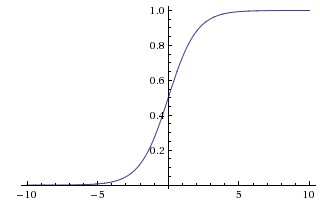

# Neural Networks: Setting up the Architecture

## Modeling one neuron

The area of Neural Networks has originally been primarily inspired by the goal of modeling biological neural systems, but has since diverged and become a matter of engineering and achieving good results in Machine Learning tasks. Nonetheless, we begin our discussion with a very brief and high-level description of the biological system that a large portion of this area has been inspired by.

### Biological motivation and connections

The basic computational unit of the brain is a **neuron**. Approximately 86 billion neurons can be found in the human nervous system and they are connected with approximately 10^14 - 10^15 **synapses**. Each neuron receives input signals from its **dendrites** and produces output signals along its (single) **axon**. The axon eventually branches out and connects via synapses to dendrites of other neurons. In the computational model of a neuron, the signals that travel along the axons (e.g. $x_0$) interact multiplicatively (e.g. $w_0 x_0$) with the dendrites of the other neuron based on the synaptic strength at that synapse (e.g. $w_0$). The idea is that the synaptic strengths (the weights $w$) are learnable and control the strength of influence (and its direction: excitory (positive weight) or inhibitory (negative weight)) of one neuron on another. In the basic model, the dendrites carry the signal to the cell body where they all get summed. If the final sum is above a certain threshold, the neuron can *fire*, sending a spike along its axon. In the computational model, we assume that the precise timings of the spikes do not matter, and that only the frequency of the firing communicates information. Based on this *rate code* interpretation, we model the *firing rate* of the neuron with an **activation function** $f$, which represents the frequency of the spikes along the axon. Historically, a common choice of activation function is the **sigmoid function** $\sigma$, since it takes a real-valued input (the signal strength after the sum) and squashes it to range between 0 and 1.


An example code for forward-propagating a single neuron might look as follows:

```python
class Neuron(object):
  # ... 
  def forward(self, inputs):
    """ assume inputs and weights are 1-D numpy arrays and bias is a number """
    cell_body_sum = np.sum(inputs * self.weights) + self.bias
    firing_rate = 1.0 / (1 + math.exp(-cell_body_sum)) # sigmoid activation function
    return firing_rate
```

In other words, each neuron performs a dot product with the input and its weights, adds the bias and applies the non-linearity (or activation function), in this case the sigmoid $\sigma(x) = 1/(1+e^{-x})$.

### Single neuron as a linear classifier

The mathematical form of the model Neuron's forward computation might look familiar to you. As we saw with linear classifiers, a neuron has the capacity to "like" (activation near one) or "dislike" (activation near zero) certain linear regions of its input space. Hence, with an appropriate loss function on the neuron's output, we can turn a single neuron into a linear classifier:

#### Binary Softmax classifier 

For example, we can interpret $\sigma(\sum_iw_ix_i + b)$ to be the probability of one of the classes $P(y_i = 1 \mid x_i; w)$. The probability of the other class would be $P(y_i = 0 \mid x_i; w) = 1 - P(y_i = 1 \mid x_i; w)$, since they must sum to one. With this interpretation, we can formulate the cross-entropy loss, and optimizing it would lead to a binary Softmax classifier (also known as *logistic regression*). Since the sigmoid function is restricted to be between 0-1, the predictions of this classifier are based on whether the output of the neuron is greater than 0.5.

> A single neuron can be used to implement a binary classifier (e.g. binary Softmax or binary SVM classifiers)

### Commonly used activation functions

Every activation function (or *non-linearity*) takes a single number and performs a certain fixed mathematical operation on it.




*Top: Sigmoid non-linearity squashes real numbers to range between [0,1] Bottom: The tanh non-linearity squashes real numbers to range between [-1,1].*

#### Sigmoid 

The sigmoid non-linearity has the mathematical form $\sigma(x) = 1 / (1 + e^{-x})$ and takes a real-valued number and "squashes" it into range between 0 and 1. In particular, large negative numbers become 0 and large positive numbers become 1. The sigmoid function has seen frequent use historically since it has a nice interpretation as the firing rate of a neuron: from not firing at all (0) to fully-saturated firing at an assumed maximum frequency (1). In practice, the sigmoid non-linearity has fallen out of favor and it is rarely ever used.

**The Saturation Problem**: The most critical issue with sigmoid neurons is that they suffer from **gradient saturation**. When the neuron's activation saturates at either tail of 0 or 1, the gradient at these regions becomes almost zero. The derivative of the sigmoid function is:

$$\frac{d\sigma(x)}{dx} = \sigma(x)(1 - \sigma(x))$$

Notice that when $\sigma(x) \approx 0$ (saturated at low values) or $\sigma(x) \approx 1$ (saturated at high values), the derivative approaches zero. The consequence of this can be shown with an example below.

**Example**: Consider a simple neural network with one sigmoid neuron:

**Forward pass**: Input $x = 5$, weight $w = 2$, bias $b = 0$

   - Pre-activation: $z = wx + b = 2 \times 5 + 0 = 10$

   - Sigmoid output: $\sigma(10) = \frac{1}{1 + e^{-10}} \approx 0.99995$ (saturated!)

**Backward pass**: Suppose the gradient from the output layer is $d_{out} = 0.1$

   - Local gradient: $\frac{d\sigma(z)}{dz} = \sigma(z)(1 - \sigma(z)) = 0.99995 \times (1 - 0.99995) \approx 0.00005$

   - Gradient through linear layer: $\frac{dz}{dw} = \frac{d(wx + b)}{dw} = x = 5$

   - Gradient to weight: $\frac{dL}{dw} = d_{out} \times \frac{d\sigma(z)}{dz} \times \frac{dz}{dw} = 0.1 \times 0.00005 \times 5 = 0.000025$

The gradient is now 4000 times smaller than the original error signal! This means the weight will barely update, making learning extremely slow or impossible.

In deep networks, this gradient vanishing effect compounds across layers. If multiple sigmoid neurons are saturated, the gradients can become so small that they're lost to numerical precision, effectively stopping learning entirely. This is why sigmoid activations are rarely used in modern deep learning architectures.

#### Tanh

The tanh non-linearity squashes a real-valued number to the range [-1, 1]. Like the sigmoid neuron, its activations saturate. Also note that the tanh neuron is simply a scaled sigmoid neuron, in particular the following holds: $\tanh(x) = 2 \sigma(2x) -1$.

#### ReLU 

The Rectified Linear Unit is very popular. It computes the function $f(x) = \max(0, x)$. In other words, the activation is simply thresholded at zero.


*Top: Rectified Linear Unit (ReLU) activation function, which is zero when x < 0 and then linear with slope 1 when x > 0. Down: A plot from [Krizhevsky et al.](http://www.cs.toronto.edu/~fritz/absps/imagenet.pdf) (pdf) paper indicating the 6x improvement in convergence with the ReLU unit compared to the tanh unit.*

There are several pros and cons to using the ReLUs:

- (+) It was found to greatly accelerate (e.g. a factor of 6 in [Krizhevsky et al.](http://www.cs.toronto.edu/~fritz/absps/imagenet.pdf)) the convergence of stochastic gradient descent compared to the sigmoid/tanh functions.
- (+) Compared to tanh/sigmoid neurons that involve expensive operations (exponentials, etc.), the ReLU can be implemented by simply thresholding a matrix of activations at zero.
- (-) Unfortunately, ReLU units can be fragile during training and can "die". For example, a large gradient flowing through a ReLU neuron could cause the weights to update in such a way that the neuron will never activate on any datapoint again. A high learning rate can do this. Once the ReLU neuron cannot activate, it is considered "dead". For example, you may find that as much as 40% of your network can be "dead" (i.e. neurons that never activate across the entire training dataset) if the learning rate is set too high. With a proper setting of the learning rate this is less frequently an issue.

#### Leaky ReLU

Leaky ReLUs are one attempt to fix the "dying ReLU" problem. Instead of the function being zero when x < 0, a leaky ReLU will instead have a small positive slope (of 0.01, or so). That is, the function computes $f(x) = \mathbb{1}(x < 0) (\alpha x) + \mathbb{1}(x>=0) (x)$ where $\alpha$ is a small constant. Some people report success with this form of activation function, but the results are not always consistent. The slope in the negative region can also be made into a parameter of each neuron, as seen in PReLU neurons, introduced in [Delving Deep into Rectifiers](http://arxiv.org/abs/1502.01852), by Kaiming He et al., 2015. However, the consistency of the benefit across tasks is presently unclear.

As a last comment, it is very rare to mix and match different types of neurons in the same network, even though there is no fundamental problem with doing so.

**TLDR**: "*What neuron type should I use?*" Use the ReLU non-linearity, be careful with your learning rates and possibly monitor the fraction of "dead" units in a network. If this concerns you, give Leaky ReLU or Maxout a try. Never use sigmoid. Try tanh, but expect it to work worse than ReLU/Maxout.

## Neural Network architectures

### Layer-wise organization

**Neural Networks as neurons in graphs**: Neural Networks are modeled as collections of neurons that are connected in an acyclic graph. In other words, the outputs of some neurons can become inputs to other neurons. Cycles are not allowed since that would imply an infinite loop in the forward pass of a network. For regular neural networks, the most common layer type is the **fully-connected layer** in which neurons between two adjacent layers are fully pairwise connected, but neurons within a single layer share no connections.


*Top: A 2-layer Neural Network (one hidden layer of 4 neurons (or units) and one output layer with 2 neurons), and three inputs. Bottom: A 3-layer neural network with three inputs, two hidden layers of 4 neurons each and one output layer. Notice that in both cases there are connections (synapses) between neurons across layers, but not within a layer.*

The two metrics that people commonly use to measure the size of neural networks are the number of neurons, or more commonly the number of parameters. Working with example networks:

- A 2-layer network might have 4 + 2 = 6 neurons (not counting the inputs), [3 x 4] + [4 x 2] = 20 weights and 4 + 2 = 6 biases, for a total of 26 learnable parameters.
- A 3-layer network might have 4 + 4 + 1 = 9 neurons, [3 x 4] + [4 x 4] + [4 x 1] = 12 + 16 + 4 = 32 weights and 4 + 4 + 1 = 9 biases, for a total of 41 learnable parameters.

To give you some context, modern Convolutional Networks contain on orders of 100 million parameters and are usually made up of approximately 10-20 layers (hence *deep learning*). However, as we will see the number of *effective* connections is significantly greater due to parameter sharing.

### Representational power

One way to look at Neural Networks with fully-connected layers is that they define a family of functions that are parameterized by the weights of the network. A natural question that arises is: What is the representational power of this family of functions? In particular, are there functions that cannot be modeled with a Neural Network?

It turns out that Neural Networks with at least one hidden layer are *universal approximators*. That is, it can be shown (e.g. see [*Approximation by Superpositions of Sigmoidal Function*](http://www.dartmouth.edu/~gvc/Cybenko_MCSS.pdf) from 1989 (pdf), or this [intuitive explanation](http://neuralnetworksanddeeplearning.com/chap4.html) from Michael Nielsen) that given any continuous function $f(x)$ and some $\epsilon > 0$, there exists a Neural Network $g(x)$ with one hidden layer (with a reasonable choice of non-linearity, e.g. sigmoid) such that $\forall x, \mid f(x) - g(x) \mid < \epsilon$. In other words, the neural network can approximate any continuous function.

If one hidden layer suffices to approximate any function, why use more layers and go deeper? The answer is that the fact that a two-layer Neural Network is a universal approximator is, while mathematically cute, a relatively weak and useless statement in practice. In one dimension, the "sum of indicator bumps" function $g(x) = \sum_i c_i \mathbb{1}(a_i < x < b_i)$ where $a,b,c$ are parameter vectors is also a universal approximator, but noone would suggest that we use this functional form in Machine Learning.

Consider Convolutional Networks, where depth has been found to be an extremely important component for a good recognition system (e.g. on order of 10 learnable layers). One argument for this observation is that images contain hierarchical structure (e.g. faces are made up of eyes, which are made up of edges, etc.), so several layers of processing make intuitive sense for this data domain.

If you are interested in these topics we recommend for further reading:

- [Deep Learning](http://www.deeplearningbook.org/) book in press by Bengio, Goodfellow, Courville, in particular [Chapter 6.4](http://www.deeplearningbook.org/contents/mlp.html).
- [Do Deep Nets Really Need to be Deep?](http://arxiv.org/abs/1312.6184)
- [FitNets: Hints for Thin Deep Nets](http://arxiv.org/abs/1412.6550)

### Setting number of layers and their sizes

How do we decide on what architecture to use when faced with a practical problem? Should we use no hidden layers? One hidden layer? Two hidden layers? How large should each layer be? First, note that as we increase the size and number of layers in a Neural Network, the **capacity** of the network increases. That is, the space of representable functions grows since the neurons can collaborate to express many different functions. For example, suppose we had a binary classification problem in two dimensions. We could train three separate neural networks, each with one hidden layer of some size and obtain the following classifiers as shown below.


*Larger Neural Networks can represent more complicated functions. The data are shown as circles colored by their class, and the decision regions by a trained neural network are shown underneath.*

Neural Networks with more neurons can express more complicated functions. However, this is both a blessing (since we can learn to classify more complicated data) and a curse (since it is easier to overfit the training data). **Overfitting** occurs when a model with high capacity fits the noise in the data instead of the (assumed) underlying relationship. For example, a model with 20 hidden neurons might fit all the training data but at the cost of segmenting the space into many disjoint decision regions. A model with 3 hidden neurons only has the representational power to classify the data in broad strokes. It models the data as two blobs and interprets the few outliers as noise. In practice, this could lead to better **generalization** on the test set.

Based on our discussion above, it seems that smaller neural networks can be preferred if the data is not complex enough to prevent overfitting. However, this is incorrect- there are many other preferred ways to prevent overfitting in Neural Networks such as L2 regularization, dropout, etc. In practice, it is always better to use these methods to control overfitting instead of the number of neurons.

The subtle reason behind this is that smaller networks are harder to train with local methods such as Gradient Descent: It's clear that their loss functions have relatively few local minima, but it turns out that many of these minima are easier to converge to, and that they are bad (i.e. with high loss). Conversely, bigger neural networks contain significantly more local minima, but these minima turn out to be much better in terms of their actual loss. In practice, what you find is that if you train a small network the final loss can display a good amount of variance - in some cases you get lucky and converge to a good place but in some cases you get trapped in one of the bad minima. On the other hand, if you train a large network you'll start to find many different solutions, but the variance in the final achieved loss will be much smaller. In other words, all solutions are about equally as good, and rely less on the luck of random initialization.

To reiterate, the regularization strength is the preferred way to control the overfitting of a neural network.


*The effects of regularization strength: Each neural network above has 20 hidden neurons, but changing the regularization strength makes its final decision regions smoother with a higher regularization.*

The takeaway is that you should not be using smaller networks because you are afraid of overfitting. Instead, you should use as big of a neural network as your computational budget allows, and use other regularization techniques to control overfitting.

## Additional References

- [ConvNetJS](http://cs.stanford.edu/people/karpathy/convnetjs/) demos for intuitions
- [Michael Nielsen's](http://neuralnetworksanddeeplearning.com/chap1.html) tutorials