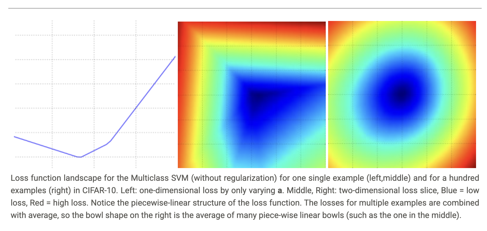

# Optimization

## Visualizing the loss function

We can generate a random weight matrix $W$, then march along a ray and record the loss function value along the way. That is, we can generate a random direction $W_1$ and compute the loss along this direction by evaluating $L(W + aW_1)$ for different values of $a$. This process generates a simple plot with the value of $a$ as the x-axis and the value of the loss function as the y-axis. We can also carry out the same procedure with two dimensions by evaluating the loss $L(W + aW_1 + bW_2)$ as we vary $a, b$. In a plot, $a, b$ could then correspond to the x-axis and the y-axis, and the value of the loss function can be visualized with a color.



To reiterate, the loss function lets us quantify the quality of any particular set of weights W. The goal of optimization is to find W that minimizes the loss function.

## Strategies

### Strategy #1: A first very bad idea solution: Random search

Since it is so simple to check how good a given set of parameters $W$ is, the first (very bad) idea that may come to mind is to simply try out many different random weights and keep track of what works best. This procedure might look as follows.

```python
# assume X_train is the data where each column is an example (e.g. 3073 x 50,000)
# assume Y_train are the labels (e.g. 1D array of 50,000)
# assume the function L evaluates the loss function

bestloss = float("inf") # Python assigns the highest possible float value
for num in range(1000):
  W = np.random.randn(10, 3073) * 0.0001 # generate random parameters
  loss = L(X_train, Y_train, W) # get the loss over the entire training set
  if loss < bestloss: # keep track of the best solution
    bestloss = loss
    bestW = W
  print 'in attempt %d the loss was %f, best %f' % (num, loss, bestloss)

# prints:
# in attempt 0 the loss was 9.401632, best 9.401632
# in attempt 1 the loss was 8.959668, best 8.959668
# in attempt 2 the loss was 9.044034, best 8.959668
# in attempt 3 the loss was 9.278948, best 8.959668
# in attempt 4 the loss was 8.857370, best 8.857370
# in attempt 5 the loss was 8.943151, best 8.857370
# in attempt 6 the loss was 8.605604, best 8.605604
# ... (trunctated: continues for 1000 lines)

# Assume X_test is [3073 x 10000], Y_test [10000 x 1]
scores = bestW.dot(Xte_cols) # 10 x 10000, the class scores for all test examples
# find the index with max score in each column (the predicted class)
Yte_predict = np.argmax(scores, axis = 0)
# and calculate accuracy (fraction of predictions that are correct)
np.mean(Yte_predict == Yte)
# returns 0.1555
```

### Strategy #2: Random Local Search

The first strategy you may think of is to try to extend one foot in a random direction and then take a step only if it leads downhill. Concretely, we will start out with a random $W$, generate random perturbations $\delta W$ to it and if the loss at the perturbed $W + \delta W$ is lower, we will perform an update. The code for this procedure is as follows.

```python
W = np.random.randn(10, 3073) * 0.001 # generate random starting W
bestloss = float("inf")
for i in range(1000):
  step_size = 0.0001
  Wtry = W + np.random.randn(10, 3073) * step_size
  loss = L(Xtr_cols, Ytr, Wtry)
  if loss < bestloss:
    W = Wtry
    bestloss = loss
  print 'iter %d loss is %f' % (i, bestloss)
```

### Strategy #3: Following the Gradient

In the previous strategy we tried to find a direction in the weight-space that would improve our weight vector (and give us a lower loss). It turns out that there is no need to randomly search for a good direction: we can compute the best direction along which we should change our weight vector that is mathematically guaranteed to be the direction of the steepest descent of the loss function. This direction will be related to the gradient of the loss function. In a hiking analogy, this approach roughly corresponds to feeling the slope of the hill below our feet and stepping down the direction that feels steepest.

In one-dimensional functions, the slope is the instantaneous rate of change of the function at any point you might be interested in. The gradient is just a vector of slopes (more commonly referred to as derivatives) for each dimension in the input space. The mathematical expression for the derivative of a 1-D function with respect its input is:

$$\frac{df(x)}{dx} = \lim_{h \to 0} \frac{f(x+h) - f(x)}{h}$$

When the functions of interest take a vector of numbers instead of a single number, we call the derivatives partial derivatives, and the gradient is simply the vector of partial derivatives in each dimension.

## Computing the gradient

There are two ways to compute the gradient: A slow, approximate but easy way (numerical gradient), and a fast, exact but more error-prone way that requires calculus (analytic gradient).

### Computing the gradient numerically with finite differences

```python
def eval_numerical_gradient(f, x):
  """
  a naive implementation of numerical gradient of f at x
  - f should be a function that takes a single argument
  - x is the point (numpy array) to evaluate the gradient at
  """

  fx = f(x) # evaluate function value at original point
  grad = np.zeros(x.shape)
  h = 0.00001

  # iterate over all indexes in x
  it = np.nditer(x, flags=['multi_index'], op_flags=['readwrite'])
  while not it.finished:

    # evaluate function at x+h
    ix = it.multi_index
    old_value = x[ix]
    x[ix] = old_value + h # increment by h
    fxh = f(x) # evalute f(x + h)
    x[ix] = old_value # restore to previous value (very important!)

    # compute the partial derivative
    grad[ix] = (fxh - fx) / h # the slope
    it.iternext() # step to next dimension

  return grad
``` 

You may have noticed that evaluating the numerical gradient has complexity linear in the number of parameters. If our example had 30730 parameters in total, we therefore would have had to perform 30,731 evaluations of the loss function to evaluate the gradient and to perform only a single parameter update. This problem only gets worse, since modern Neural Networks can easily have tens of millions of parameters. Clearly, this strategy is not scalable and we need something better.

### Computing the gradient analytically with Calculus

The numerical gradient is very simple to compute using the finite difference approximation, but the downside is that it is approximate (since we have to pick a small value of h, while the true gradient is defined as the limit as h goes to zero), and that it is very computationally expensive to compute. The second way to compute the gradient is analytically using Calculus, which allows us to derive a direct formula for the gradient (no approximations) that is also very fast to compute. However, unlike the numerical gradient it can be more error prone to implement, which is why in practice it is very common to compute the analytic gradient and compare it to the numerical gradient to check the correctness of your implementation. This is called a gradient check.

Let's use the example of the SVM loss function for a single datapoint:

$$L_i = \sum_{j \neq y_i} \left[\max(0, w_j^T x_i - w_{y_i}^T x_i + \Delta)\right]$$

We can differentiate the function with respect to the weights. For example, taking the gradient with respect to $w_{y_i}$ we obtain:

$$\nabla_{w_{y_i}} L_i = -\left(\sum_{j \neq y_i} \mathbb{1}(w_j^T x_i - w_{y_i}^T x_i + \Delta > 0)\right) x_i$$

where $\mathbb{1}$ is the indicator function that is one if the condition inside is true or zero otherwise. While the expression may look scary when it is written out, when you're implementing this in code you'd simply count the number of classes that didn't meet the desired margin (and hence contributed to the loss function) and then the data vector $x_i$ scaled by this number is the gradient. Notice that this is the gradient only with respect to the row of $W$ that corresponds to the correct class. For the other rows where $j \neq y_i$ the gradient is:

$$\nabla_{w_j} L_i = \mathbb{1}(w_j^T x_i - w_{y_i}^T x_i + \Delta > 0) x_i$$

Once you derive the expression for the gradient it is straight-forward to implement the expressions and use them to perform the gradient update.

## Gradient Descent

Now that we can compute the gradient of the loss function, the procedure of repeatedly evaluating the gradient and then performing a parameter update is called Gradient Descent. Its vanilla version looks as follows.

```python
# Vanilla Gradient Descent

while True:
  weights_grad = evaluate_gradient(loss_fun, data, weights)
  weights += - step_size * weights_grad # perform parameter update
```

In large-scale applications, the training data can have on order of millions of examples. Hence, it seems wasteful to compute the full loss function over the entire training set in order to perform only a single parameter update. A very common approach to addressing this challenge is to compute the gradient over batches of the training data. For example, in current state of the art ConvNets, a typical batch contains 256 examples from the entire training set of 1.2 million. This batch is then used to perform a parameter update.

```python
# Vanilla Minibatch Gradient Descent

while True:
  data_batch = sample_training_data(data, 256) # sample 256 examples
  weights_grad = evaluate_gradient(loss_fun, data_batch, weights)
  weights += - step_size * weights_grad # perform parameter update
```

The extreme case of this is a setting where the mini-batch contains only a single example. This process is called Stochastic Gradient Descent (SGD) (or also sometimes on-line gradient descent). Even though SGD technically refers to using a single example at a time to evaluate the gradient, you will hear people use the term SGD even when referring to mini-batch gradient descent. The size of the mini-batch is a hyperparameter but it is not very common to cross-validate it. It is usually based on memory constraints (if any), or set to some value, e.g. 32, 64 or 128. We use powers of 2 in practice because many vectorized operation implementations work faster when their inputs are sized in powers of 2.
