# Recurrent Neural Networks

## A friendly introduction

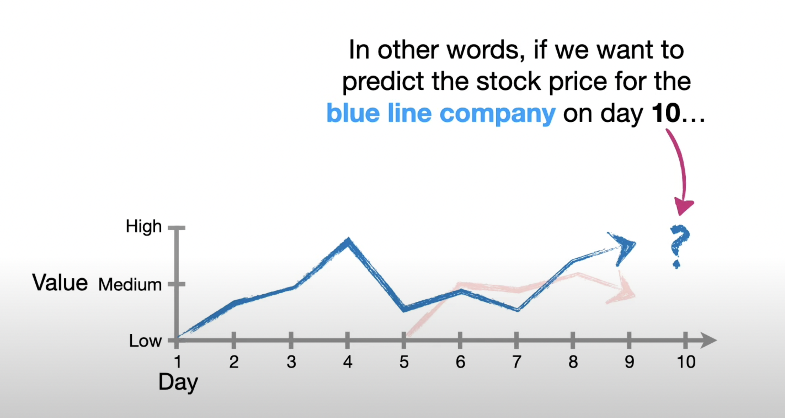

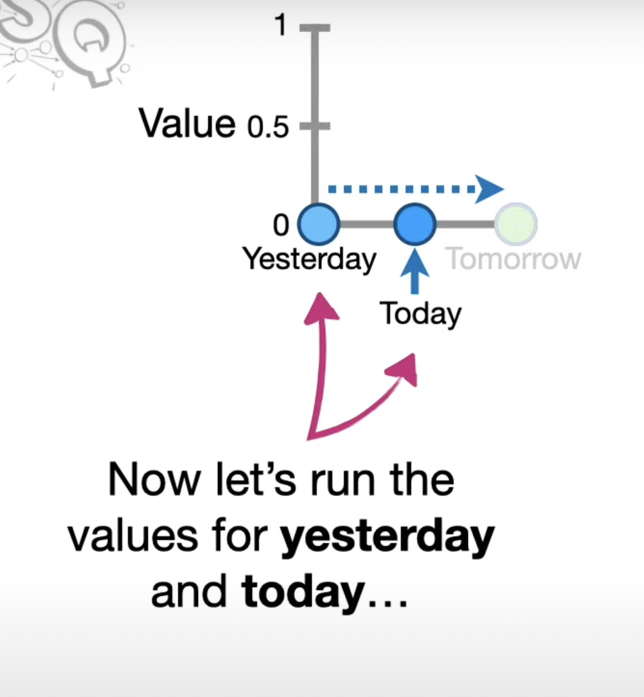

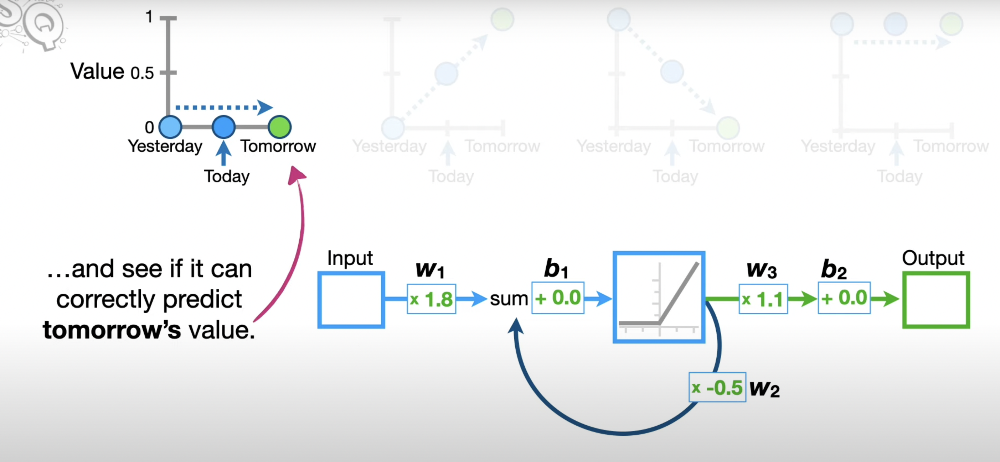
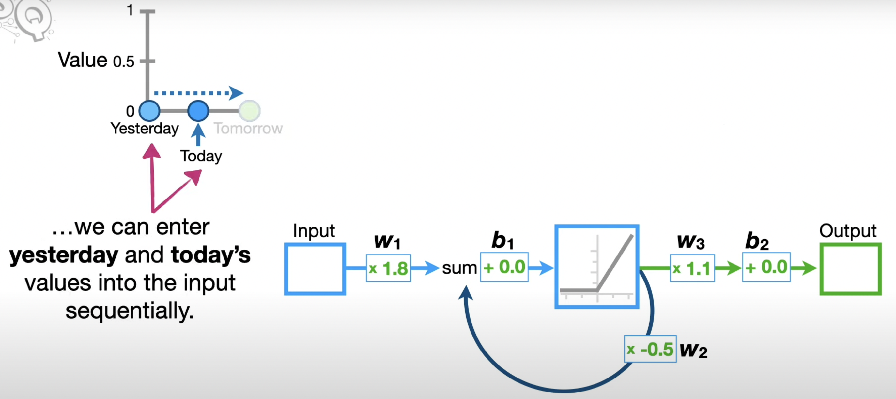

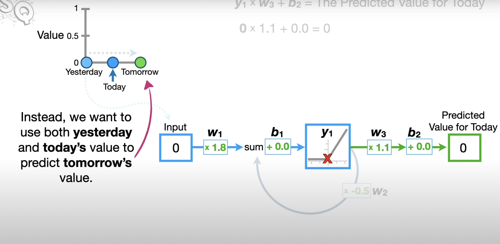
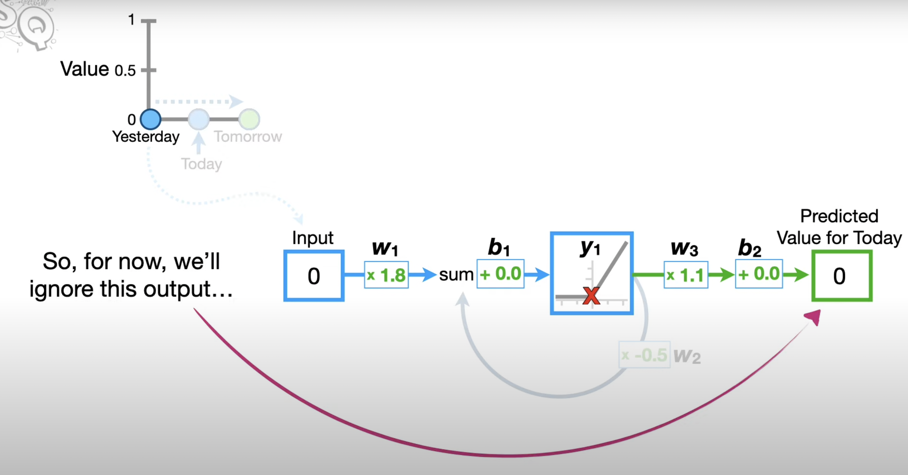

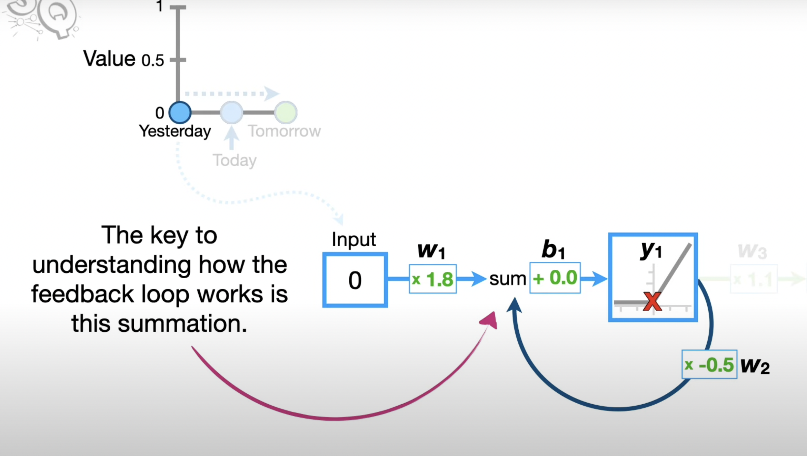
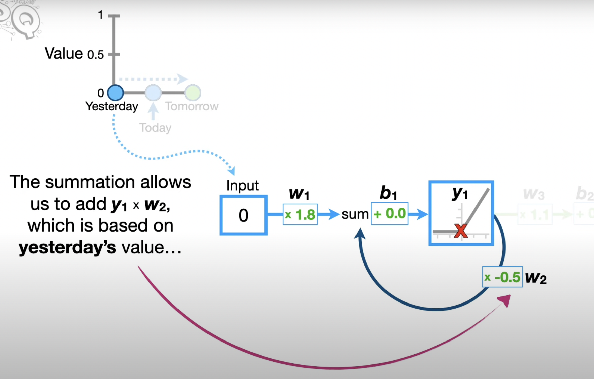

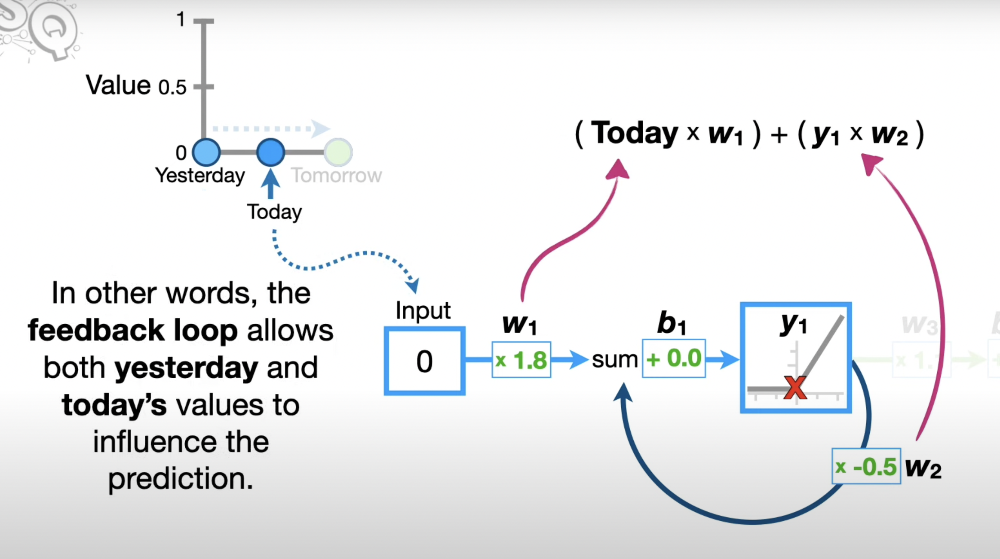

**..we can unroll the feedback loop by making a copy of the neural network for each input value.**

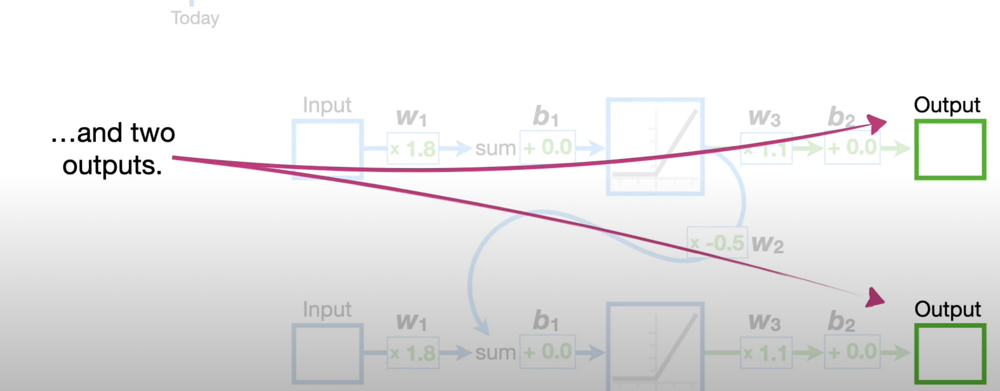

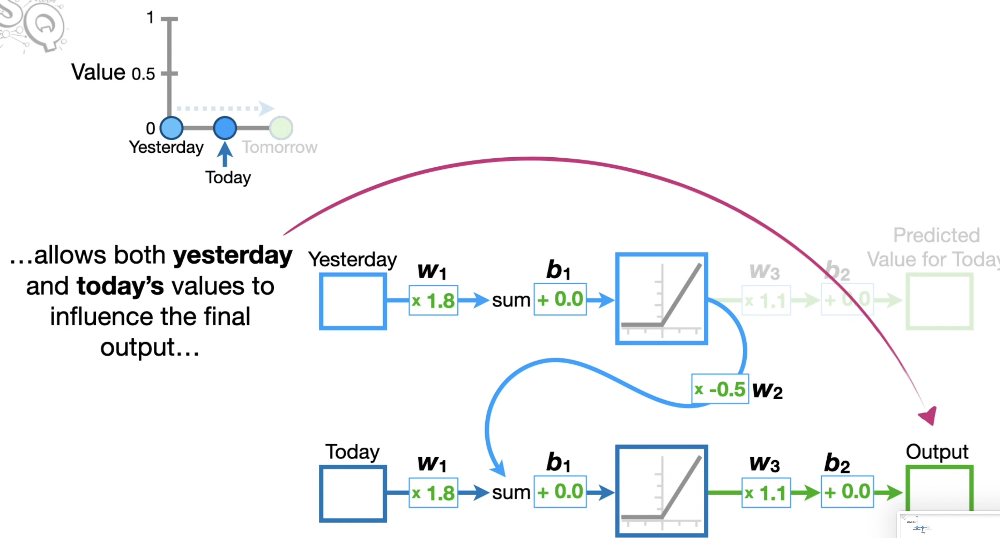
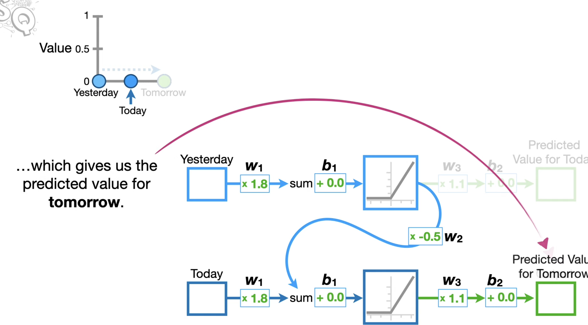

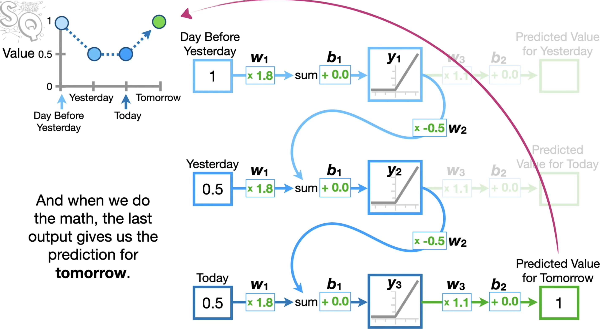

**Note: Regardless of how many times we unroll an RNN, the weights and biases are shared across every input. So no matter how many times we unroll an RNN, we don't increase the number of weights and biases that we need to train.**

## Introduction

While "vanilla" neural networks receive a single input and produce one label for that image, there are tasks where the model produces a sequence of outputs. Recurrent Neural Networks allow us to operate over sequences of input, output, or both at the same time.

An example of a one-to-many model is image captioning, where a fixed-sized image is given and a sequence of words that describe the content of that image is produced through an RNN.

An example of a many-to-one task is sentiment classification in NLP, where a sequence of words of a sentence is given and then the sentiment (e.g., positive or negative) of that sentence is classified.

An example of a many-to-many task is video captioning, where the input is a sequence of video frames and the output is a caption that describes what was in the video. Another example of a many-to-many task is machine translation in NLP, where an RNN takes a sequence of words of a sentence in English, and then this RNN is asked to produce a sequence of words of a sentence in French.

There is also a variation of the many-to-many task, where the model generates an output at every timestep.

In general, RNNs allow us to wire up an architecture where the prediction at every single timestep is a function of all the timesteps that have come before.

### Why are existing convnets insufficient?

Existing convnets are insufficient to deal with tasks that have inputs and outputs with variable sequence lengths. In the example of video captioning, inputs have a variable number of frames (e.g., 10-minute and 10-hour long videos) and outputs are captions of variable length. Convnets can only take in inputs with a fixed size of width and height and cannot generalize over inputs with different sizes. In order to tackle this problem, Recurrent Neural Networks (RNNs) are introduced.

## Architecture

If an RNN model is unrolled, then there are inputs (e.g., video frames) at different timesteps shown as $x_1, x_2, x_3, \ldots, x_t$. The RNN at each timestep takes in two inputs— an input frame ($x_i$) and the previous representation of what it has seen so far (i.e., history)— to generate an output $y_i$ and update its history, which will be forward propagated over time. All the RNN blocks are the same block that share the same parameters, but have different inputs and history at each timestep.

More precisely, an RNN can be represented as a recurrence formula of some function $f_W$ with parameters $W$:

$$h_t = f_W(h_{t-1}, x_t)$$

where at every timestep it receives some previous state as a vector $h_{t-1}$ from the previous iteration at timestep $t-1$ and the current input vector $x_t$ to produce the current state as a vector $h_t$. A fixed function $f_W$ with weights $W$ is applied at every single timestep, and that allows the Recurrent Neural Network to be used on sequences without having to commit to the size of the sequence because the exact same function is applied at every single timestep, no matter how long the input or output sequences are.

In the simplest form of RNN, which is called a Vanilla RNN, there are weight matrices $W_{hh}$ and $W_{xh}$, where they project both the hidden state $h_{t-1}$ from the previous timestep and the current input $x_t$, and then those are summed and squished with a $\tanh$ function to update the hidden state $h_t$ at timestep $t$.

$$h_t = \tanh(W_{hh}h_{t-1} + W_{xh}x_t)$$

Predictions can be based on $h_t$ by using another matrix projection on top of the hidden state. This is the simplest complete case in which a neural network can be wired up:

$$y_t = W_{hy}h_t$$

## Multilayer RNNs

RNNs can be stacked together in multiple layers, which gives more depth, and empirically deeper architectures tend to work better.

In the illustration above, there are three separate RNNs each with their own set of weights. Three RNNs are stacked on top of each other, so the input of the second RNN (second RNN layer) is the vector of the hidden state vector of the first RNN (first RNN layer). All stacked RNNs are trained jointly, and the diagram represents one computational graph.