# Self-Supervised Learning

## Introduction

What is the problem with large-scale training?
We need a lot of labelled data.
Is there a way we can train neural networks without the need for huge manually labelled datasets?

**Self-supervised learning** is a paradigm where models learn representations from unlabeled data by creating supervisory signals from the data itself. Instead of relying on manual annotations, the model generates its own learning objectives by exploiting the inherent structure, relationships, or transformations present in the data.

The key idea is to design a **pretext task**— a task that doesn't require labels but forces the model to learn useful representations that can later be transferred to downstream tasks (e.g., classification, detection).

Some examples of pretext tasks are:

1. **Masked Language Modeling (BERT)**: Predict masked words in a sentence from surrounding context. The model learns linguistic representations by understanding word relationships and context.

2. **Image Rotation Prediction**: Rotate images by 0°, 90°, 180°, or 270° and train the model to predict the rotation angle. This forces the model to understand object orientation and spatial structure.

3. **Jigsaw Puzzles**: Shuffle image patches and train the model to predict the correct spatial arrangement. This encourages learning of spatial relationships and object parts.

4. **Contrastive Learning (SimCLR, MoCo)**: Create two augmented views of the same image and train the model to make their representations similar, while making representations of different images dissimilar. This learns robust, view-invariant features.

5. **Temporal Consistency (Video)**: In video sequences, predict future frames or track objects across time. The model learns motion without explicit labels.

6. **Colorization**: Convert grayscale images to color by predicting color channels from luminance. This requires understanding of object semantics and typical color associations.

## Differences between Attention Maps of Supervised and Self-Supervised models

Attention maps reveal what parts of an image a model focuses on when making predictions. There are fundamental differences between supervised and self-supervised models in what they attend to.

Supervised models learn to attend primarily to **discriminative features**— parts of objects that help distinguish between classes. For example, when classifying birds, they might focus on beaks, wings, or distinctive markings that differentiate species. Attention is often concentrated on small, highly discriminative regions. The model learns to ignore background and irrelevant details, focusing only on what's needed for the classification task. The attention patterns are optimized for the specific labeled task (e.g., "is this a dog or cat?"), which can lead to overfitting to dataset-specific cues rather than learning general object structure. Attention maps tend to be sparse, highlighting only the most discriminative patches rather than the entire object.

Self-supervised models learn to attend to **entire object structures** rather than just discriminative parts. They develop a more complete understanding of object shape, boundaries, and spatial relationships. Attention maps often cover larger regions, including object boundaries, edges, and structural elements. This is because pretext tasks like rotation prediction or jigsaw puzzles require understanding the full spatial structure of objects. Without task-specific labels, self-supervised models learn more general, transferable features that capture object semantics rather than class-specific discriminative cues. Attention maps typically show more uniform coverage of objects, attending to the whole object rather than just key parts. This makes them more suitable for tasks like object detection or segmentation where understanding the full object is important.

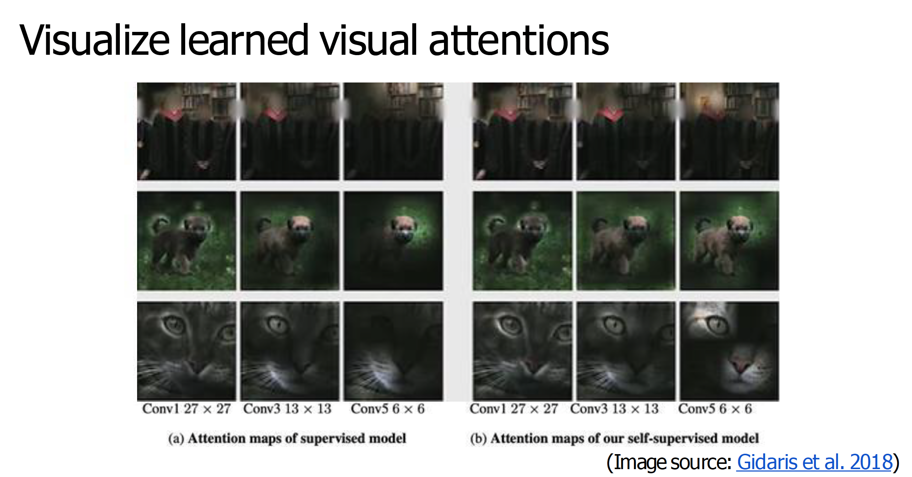

## Pretext task: predict rotations

## Pretext Tasks: Rearrangement and Inpainting

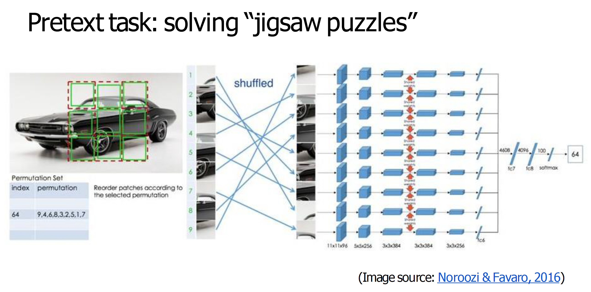
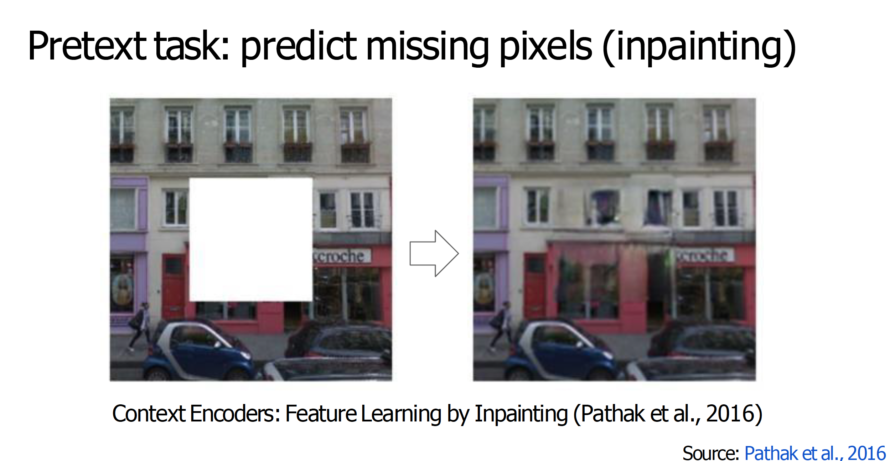

## Reconstruction-Based Learning (MAE)

**Masked Autoencoders (MAE)** are a self-supervised learning approach inspired by BERT's masked language modeling, but applied to images. The core idea is simple: mask out a large portion of image patches (typically 75%) and train the model to reconstruct the missing patches from the visible ones.

### How MAE Works

**Patch-based masking**: The input image is divided into non-overlapping patches. A high percentage (e.g., 75%) of patches are randomly masked out.

**Encoder-decoder architecture**: 

   - The **encoder** processes only the visible (unmasked) patches, learning to extract meaningful representations from partial observations.

   - The **decoder** takes the encoded representations along with mask tokens and reconstructs the full image, including the masked patches.

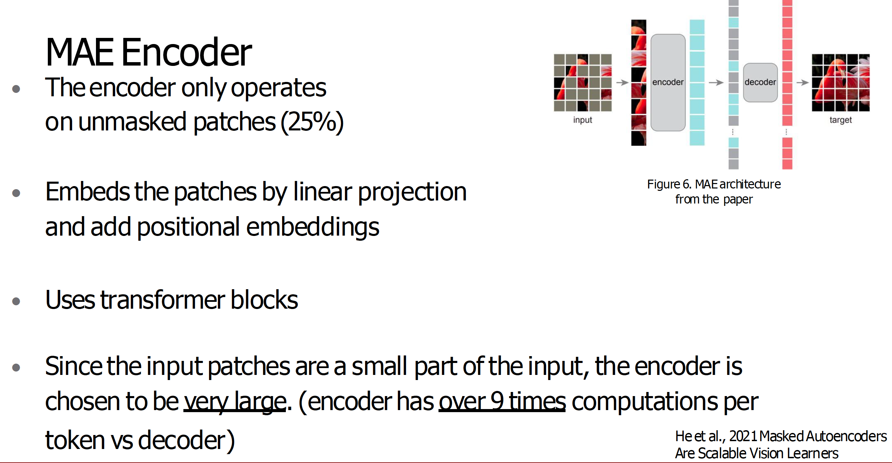

**Reconstruction objective**: The model is trained to predict the pixel values of masked patches, typically using mean squared error (MSE) loss between predicted and original patches.

The high masking ratio (75%) is crucial—it prevents the model from relying on trivial interpolation between nearby patches. Instead, it must develop a deep understanding of object structure, semantics, and spatial relationships to successfully reconstruct masked regions. This makes MAE particularly effective for learning general visual representations that capture the essence of objects and scenes.

## Summary of pretext tasks

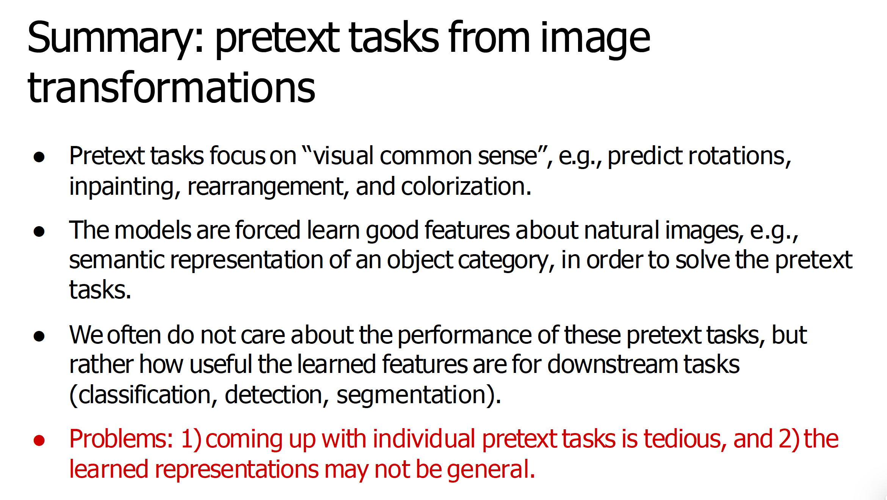
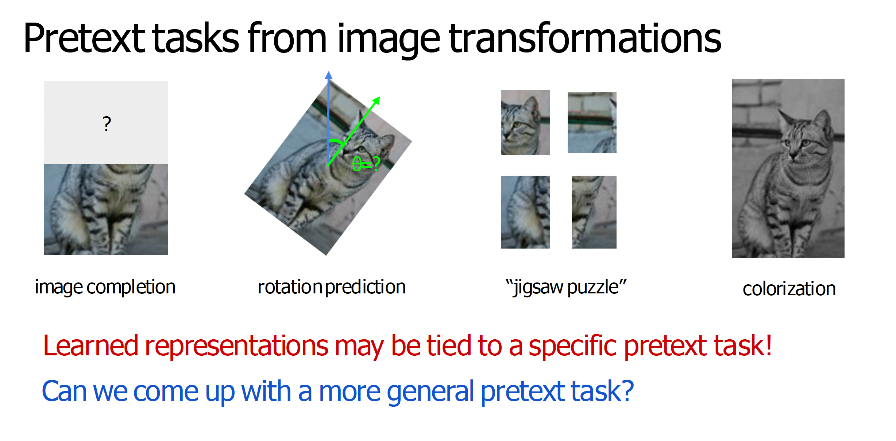

## Contrastive Learning

### Intuition

**Contrastive learning** is based on a simple but powerful principle: **learn representations by contrasting similar and dissimilar examples**. The core idea is that an image and its augmented versions (e.g., rotated, cropped, color-jittered) should have similar representations, while different images should have dissimilar representations.

The intuition is that good visual representations should be **invariant** to data augmentations (the same object under different views should map to similar embeddings) but **discriminative** across different objects (different objects should map to different embeddings). By learning to distinguish between "positive pairs" (augmented views of the same image) and "negative pairs" (different images), the model develops rich, semantically meaningful representations without any labels.

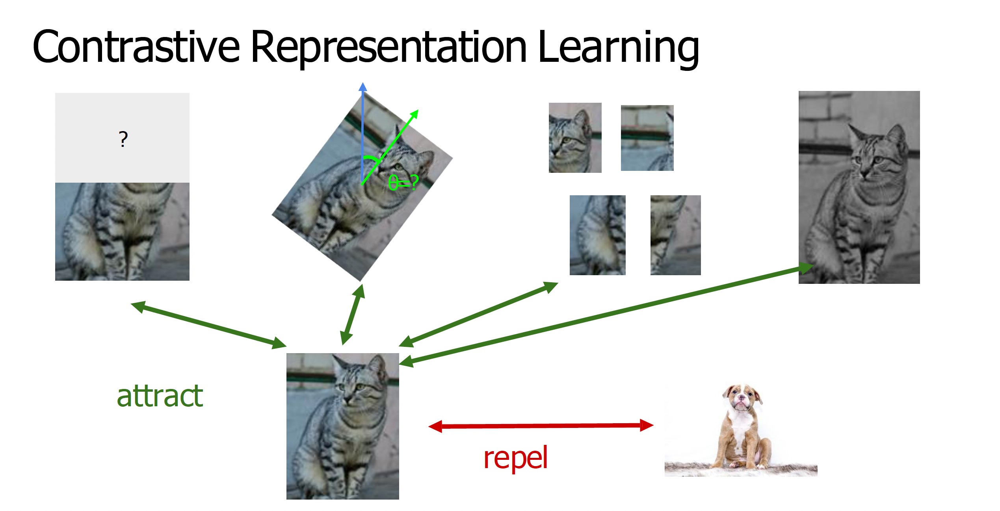

In contrastive learning, we start with a **reference sample** $x$ (an anchor image). **Positive samples** are augmented views of the same image $x$ (e.g., rotated, cropped, or color-jittered versions), which should have similar representations to $x$. **Negative samples** are different images from the dataset, which should have dissimilar representations to $x$. The model learns by pulling positive samples closer to the reference while pushing negative samples further away in the embedding space.

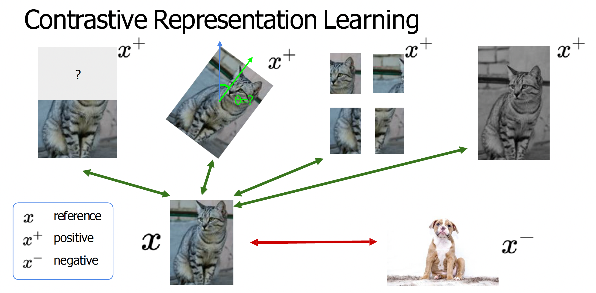

### Formulation

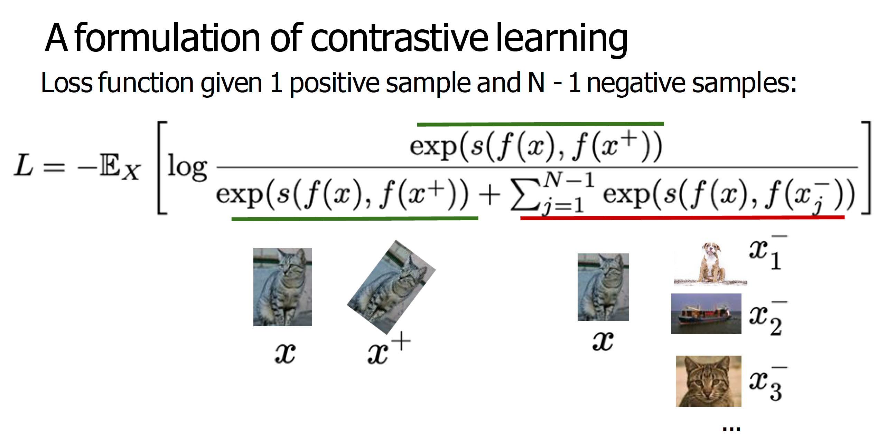
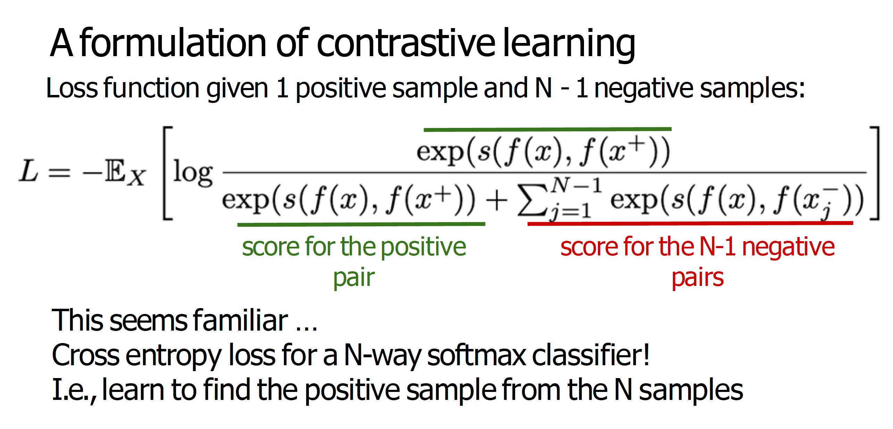

### SimCLR

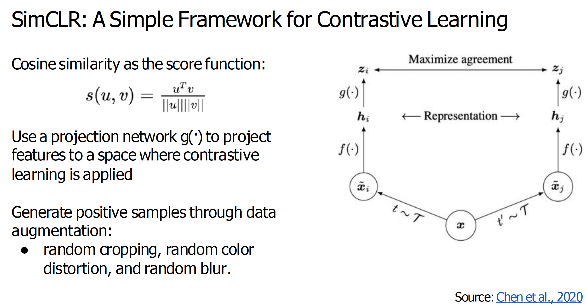

In the above figure, $\tilde{x}_i$ and $\tilde{x}_j$ are **positive samples** created through data augmentation from the same original image. They represent two different augmented views (e.g., different random crops, color jittering, or rotations) of the same underlying image, and the model learns to make their representations similar.

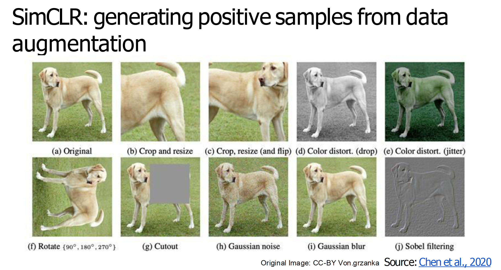

#### Results

As discussed in the contrastive learning formulation, the InfoNCE loss provides a lower bound on mutual information (MI). The larger the negative sample size $N$, the tighter this bound becomes, meaning the loss $-\mathcal{L}$ more closely approximates the true mutual information between the representations of positive pairs. Thus, we need to use a large batch size in SimCLR.

### CLIP

Like SimCLR, [CLIP](https://github.com/openai/CLIP) uses a contrastive learning objective, but instead of contrasting two augmented views of the same image, it contrasts two different modalities: text and image. To train CLIP, OpenAI collected a large dataset of ~400M image-text pairs from the internet, including sources like Wikipedia and image alt text. The resulting model learns rich, high-level image features and has achieved impressive zero-shot performance on many vision benchmarks.

As explained above, CLIP's training objective incorporates both text and images, building upon the principles of contrastive learning. 
>The goal of the contrastive loss is to maximize agreement between the final vectors **$z_i = g(h_i)$** and **$z_j = g(h_j)$**.

Similarly, CLIP is trained to maximize agreement between two vectors. However, because these vectors come from different modalities, CLIP uses two separate encoders: a transformer-based Text Encoder and a Vision Transformer (ViT)-based Image Encoder. Note that some smaller, more efficient versions of CLIP use a ResNet as the Image Encoder instead of a ViT.

During the pretraining phase, each batch consists of multiple images along with their corresponding captions. Each image is independently processed by an Image Encoder— typically a visual model like a Vision Transformer (ViT) or a Convolutional Neural Network (ConvNet)— which produces an image embedding $I_n$. Likewise, each caption is independently processed by a Text Encoder to generate a corresponding text embedding $T_n$. Next, we compute the pairwise similarities between all image-text combinations, meaning each image is compared with every caption, and vice versa. The training objective is to maximize the similarity scores along the diagonal of the resulting similarity matrix- that is, the scores for the matching image-caption pairs $(I_n, T_n)$.  Through backpropagation, the model learns to assign higher similarity scores to true matches than to mismatched pairs.

Through this setup, CLIP effectively learns to represent images and texts in a shared latent space. In this space, semantic concepts are encoded in a modality-independent way, enabling meaningful cross-modal comparisons between visual and textual inputs.

As an example, for a batch of image-caption pairs, during training, the following could be a typical similarity-mapping.

### DINO

Models trained with vanilla contrastive learning methods such as SimCLR and CLIP require very large batch sizes. This makes them computationally expensive and limits their accessibility. 

Similar to SimCLR, DINO is trained to maximize the agreement between two vectors derived from different views of the same image. However, unlike SimCLR, DINO uses two separate encoders which are trained differently. The student network is updated via backpropagation to match the outputs of the teacher network. The teacher network is not updated via backpropagation; instead, its weights are updated using an exponential moving average (EMA) of the student's weights. This means that the teacher model evolves more slowly and provides a stable target for the student to learn from.

Both networks output representations that pass through softmax to produce probability scores over a set of classes.

**How did we get classes in an unsupervised method?** While DINO doesn't use labeled data, it requires an estimate of the number of output classes. In the official implementation, the DINO head output dimensionality (default: 65,000) is much larger than ImageNet's 1,000 classes. This is due to **over-segmentation**. By using many classes, the model can learn to distinguish fine-grained parts (e.g., cat whiskers, ears, nose) rather than just whole objects.

The training uses knowledge distillation: the teacher's output serves as the ground truth, and the student is trained to match it using cross-entropy loss. 

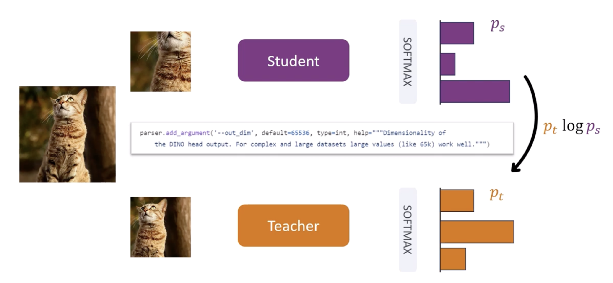

Importantly, the teacher is not pre-trained. It trains simultaneously with the student. Both networks have identical architectures and parameters, yet the teacher should produce better representations. This raises two questions: (1) How do we train the teacher? (2) Why is the teacher better?

#### Multi-crop Training

**Why the teacher is better**

Multi-crop training uses two types of crops: **global views** (more than 50% of the image) and **local views** (less than 50% of the image). 

During training, the student receives both global and local views, while the teacher receives only global views. The teacher produces better representations because global views contain more information than local views. When the student receives global views, it can match the teacher's performance, but on average, the teacher outperforms because it consistently receives global information.

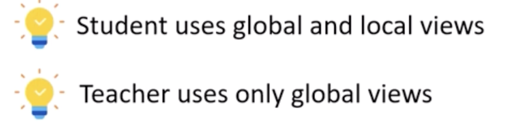

**How we train the teacher**

Researchers tried different update strategies: copying student weights every iteration (0.1% accuracy), after each iteration (no improvement), and after each epoch (66.6% accuracy on ImageNet). Copying after each epoch works because it provides stable ground truth for the entire epoch, allowing the student to converge. If weights are copied every iteration, the teacher's outputs (ground truth) change constantly, preventing convergence.

The optimal solution uses **exponential moving average (EMA)**: $\theta_t \leftarrow \lambda \theta_t + (1-\lambda) \theta_s$, where $\lambda$ follows a cosine schedule from 0.996 to 1. This slowly updates teacher weights, incorporating student information gradually. Throughout training, both networks improve, with the teacher initially performing better due to global views. At convergence, both achieve similar performance.

**Why attention focuses on objects**

The student with local views (e.g., cat whiskers and fur) must match the teacher's representation from global views (most of the cat plus background). This local-global view difference is why DINO's attention maps naturally segment objects.

However, implementing DINO without proper safeguards causes **mode collapse**, where the model outputs the same representation regardless of input.

#### Avoiding Collapse

Two collapse scenarios can occur.

**Uniform distribution collapse**: Both teacher and student output uniform distributions across all classes for any input (cat, dog, building, etc.). This minimizes cross-entropy loss (since identical distributions have zero loss) but provides no discriminative information.

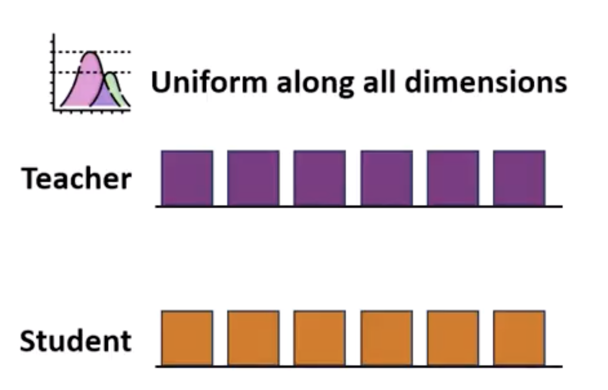

**Single-dimension collapse**: The output is dominated by a single dimension regardless of input (e.g., always predicting "cat").

**Solution 1: Sharpening with temperature**: To prevent uniform distributions, we add a temperature parameter $\tau$ to the softmax: $P = \text{softmax}(\text{logits} / \tau)$. When logits are nearly equal, standard softmax ($\tau=1$) produces a nearly uniform distribution. Lower temperatures (e.g., $\tau=0.1$ or $0.05$) sharpen the distribution, making small differences in logits produce highly peaked probabilities. However, sharpening alone can cause single-dimension collapse.

**Solution 2: Centering**: To prevent single-dimension collapse, we apply centering to the teacher's logits: $\text{logits}_t \leftarrow \text{logits}_t - c$, where $c$ is an exponential moving average of the mean teacher logits across all batch samples. This bias term $c$ is initially the mean of all teacher logits in the batch. Centering smooths the distribution and prevents collapse to a single mode. By combining sharpening (on both student and teacher) with centering (on teacher), we mitigate both collapse scenarios.  

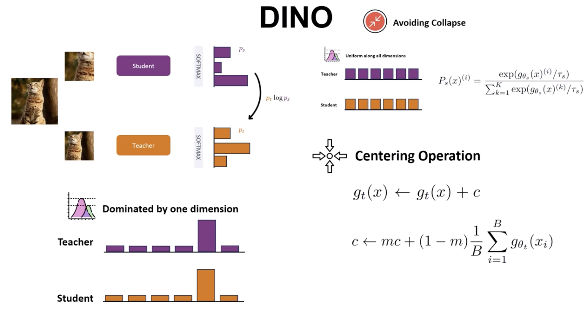

### Downstream application of DINO: A simple Segmentation Model over DINO Features

As we saw earlier, DINO's attention maps naturally focus on entire object structures, making them excellent for segmentation tasks. The local-global view training paradigm forces the model to understand object boundaries and spatial relationships, which translates directly to segmentation capabilities. As a downstream task, let's consider an example of a simple segmentation model on the [DAVIS dataset](https://davischallenge.org).

#### The DAVIS dataset

The DAVIS dataset (Densely Annotated VIdeo Segmentation) was created for video object segmentation tasks. It provides frame-by-frame, pixel-level annotations of objects within videos. Each video sequence contains multiple frames, and for each frame, there are precise masks indicating which pixels belong to foreground objects versus the background. This makes DAVIS ideal for evaluating segmentation models, as it allows us to measure performance across entire video sequences and assess temporal consistency.

The dataset is particularly well-suited because it contains diverse object categories, various motion patterns, and challenging scenarios like occlusions, fast motion, and appearance changes. This diversity helps us understand how well DINO features generalize across different visual contexts.

#### One-Shot Learning Experiment

As a simple but revealing experiment, we can think of training a model using the annotations from just a single frame of a video and see how well it performs on the remaining frames of the same video. This is a form of **one-shot learning**—learning to perform a task from a single example. The key question is: can DINO's rich, self-supervised features enable effective segmentation with minimal supervision?

This experimental setup is intentionally different from standard practice. Typically, you would train on the full dataset (using annotations from many frames across multiple videos) and evaluate on a separate validation set containing different videos. This standard approach tests generalization across different video sequences and object instances. With this experiment, we can understand the one-shot capabilities of DINO features by seeing if they can transfer knowledge learned from a single annotated frame to other frames in the same video sequence.

#### Model Architecture

Our model will be intentionally minimal: we'll extract DINO features per patch and train a lightweight per-patch classifier using only the patches from that one annotated frame. Here's how it works:

1. **Feature extraction**: Given an input frame, we divide it into non-overlapping patches (typically 16×16 or 8×8 pixels). Each patch is passed through a pre-trained DINO model to extract a feature vector. These DINO features capture rich semantic information about object structure, boundaries, and spatial relationships.

2. **Training data**: From the single annotated frame, we extract all patches along with their corresponding labels (foreground or background, based on the pixel-level annotations). This gives us a small training set—just the patches from one frame.

3. **Lightweight Classifier**: We train a simple classifier (e.g., a small neural network or even a linear classifier) that takes DINO features as input and predicts whether each patch belongs to the foreground object or the background. This classifier is trained only on patches from the single annotated frame.

4. **Inference**: For all other frames in the video sequence, we extract DINO features for each patch and use our trained classifier to predict segmentation masks. The hope is that DINO's features are so semantically rich and object-aware that the classifier can generalize from the single training frame to other frames, even as objects move, change appearance, or get partially occluded.

#### Why this tests DINO's capabilities

This minimal setup is a rigorous test of DINO's feature quality. If DINO features truly capture object semantics and structure in a generalizable way, then a classifier trained on just one frame should be able to segment the same object in other frames, despite changes in pose, lighting, partial occlusions, or background context. The success of this experiment would demonstrate that:

- DINO features encode object-level information that is robust to appearance variations

- The features are discriminative enough to separate foreground objects from background using minimal supervision

- The self-supervised pre-training has learned transferable visual representations that require very few labeled examples for downstream tasks

This one-shot learning capability is particularly valuable in scenarios where labeled data is scarce or expensive to obtain, making DINO features highly practical for real-world applications.