# Attention in transformers, visually explained

Consider the phrases American true mole, one mole of carbon dioxide, and take a biopsy of the mole. We know that the word mole has different meanings in each one of these, based on the context.

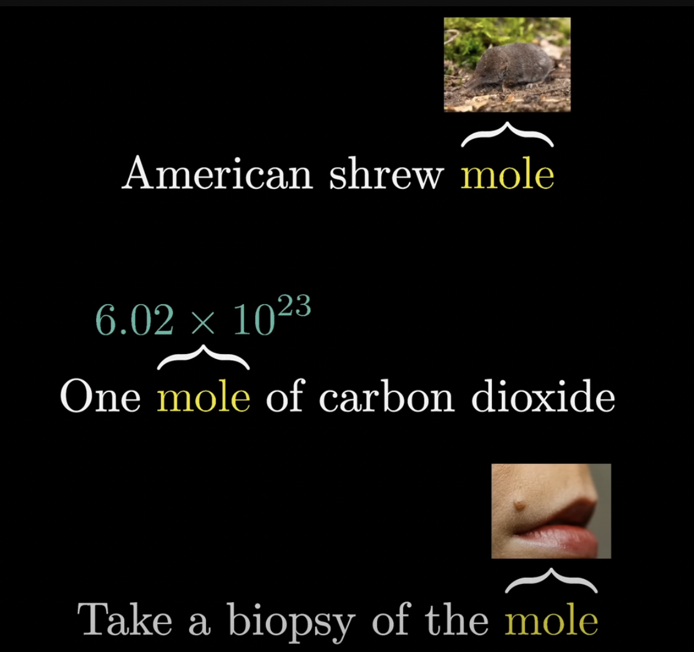

But after the first step of a transformer, the one that breaks up the text and associates each token with a vector, the vector that's associated with mole would be the same in all of these cases, because this initial token embedding is effectively a lookup table with no reference to the context.

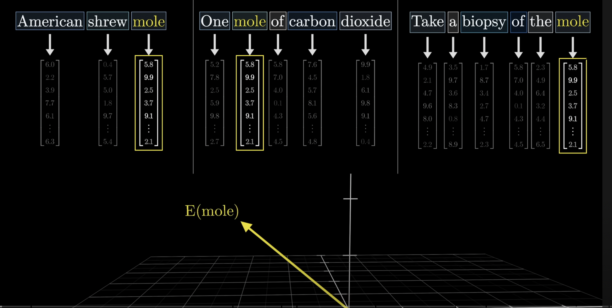

It's only in the next step of the transformer that the surrounding embeddings have the chance to pass information into this one.

The picture you might have in mind is that there are multiple distinct directions in this embedding space encoding the multiple distinct meanings of the word mole, and that a well-trained attention block calculates what you need to add to the generic embedding to move it to one of these specific directions, as a function of the context.

To take another example, consider the embedding of the word tower. This is presumably some very generic, non-specific direction in the space, associated with lots of other large, tall nouns. If this word was immediately preceded by Eiffel, you could imagine wanting the mechanism to update this vector so that it points in a direction that more specifically encodes the Eiffel tower, maybe correlated with vectors associated with Paris and France and things made of steel.

If it was also preceded by the word miniature, then the vector should be updated even further, so that it no longer correlates with large, tall things.

More generally than just refining the meaning of a word, the attention block allows the model to move information encoded in one embedding to that of another, potentially ones that are quite far away, and potentially with information that's much richer than just a single word.

**After all of the vectors flow through the network, including many different attention blocks, the computation you perform to produce a prediction of the next token is entirely a function of the last vector in the sequence.** Imagine, for example, that the text you input is most of an entire mystery novel, all the way up to a point near the end, which reads, “therefore the murderer was...”. If the model is going to accurately predict the next word, that final vector in the sequence, which began its life simply embedding the word “was”, will have to have been updated by all of the attention blocks to represent much, much more than any individual word, somehow encoding all of the information from the full context window that's relevant to predicting the next word.

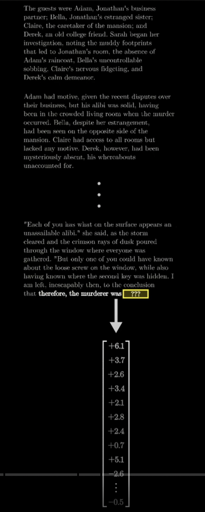

To step through the computations, though, let's take a much simpler example. Imagine that the input includes the phrase, “a fluffy blue creature roamed the verdant forest”. **And for the moment, suppose that the only type of update that we care about is having the adjectives adjust the meanings of their corresponding nouns.** This is what we would call a single head of attention.

Again, the initial embedding for each word is some high dimensional vector that only encodes the meaning of that particular word with no context.

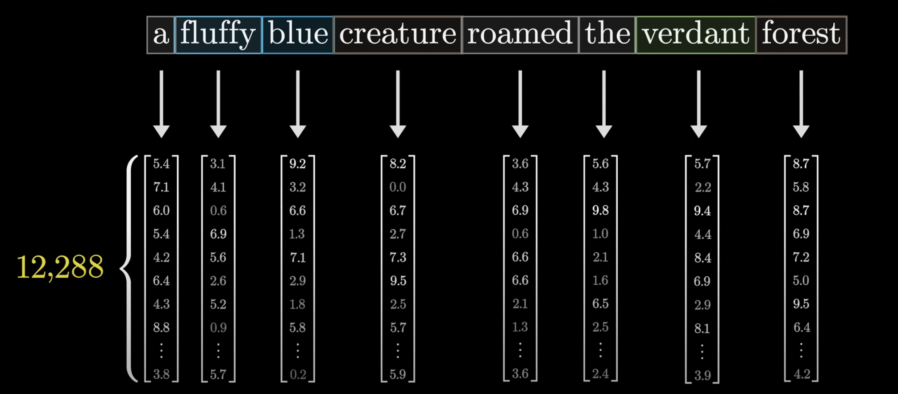

Let's go ahead and denote these embeddings with the letter e.

**The goal is to have a series of computations produce a new refined set of embeddings where, for example, those corresponding to the nouns have ingested the meaning from their corresponding adjectives.**

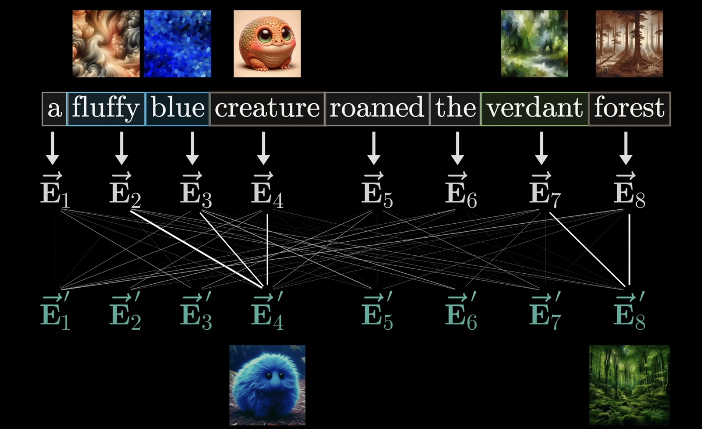

**To be clear, we’re making up this example of adjectives updating nouns just to illustrate the type of behavior that you could imagine an attention head doing. As with so much deep learning, the true behavior is much harder to parse because it's based on tweaking and tuning a huge number of parameters to minimize some cost function.**

For the first step of this process, you might imagine each noun, like creature, asking the question, “hey, are there any adjectives sitting in front of me?”

And for the words fluffy and blue, to each be able to answer, “yeah, I'm an adjective and I'm in that position”.

**That question is somehow encoded as yet another vector, another list of numbers, which we call the query for this word.** This query vector though has a much smaller dimension than the embedding vector, say 128.

**Computing this query looks like taking a certain matrix, which we'll label Wq, and multiplying it by the embedding. In this case, you multiply this matrix by all of the embeddings in the context, producing one query vector for each token.**

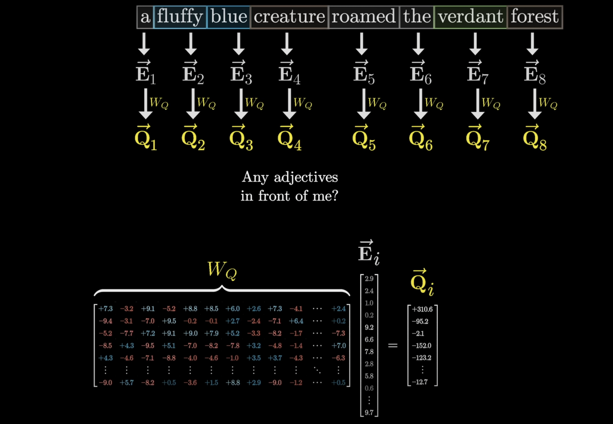

The entries of this matrix are parameters of the model, which means the true behavior is learned from data. **But for our sake, we'll suppose that this query matrix maps the embeddings of nouns to certain directions in this smaller query space that somehow encodes the notion of looking for adjectives in preceding positions.** As to what it does to other embeddings, who knows? Right now, we're laser focused on the nouns.

**At the same time, associated with this is a second matrix called the key matrix, which you also multiply by every one of the embeddings. This produces a second sequence of vectors that we call the keys. Conceptually, you want to think of the keys as potentially answering the queries. This key matrix is also full of tunable parameters, and just like the query matrix, it maps the embedding vectors to that same smaller dimensional space.**

**You think of the keys as matching the queries whenever they closely align with each other.** In our example, you would imagine that the key matrix maps the adjectives like fluffy and blue to vectors that are closely aligned with the query produced by the word creature.

**To measure how well each key matches each query, you compute a dot product between each possible key-query pair.**

**We can visualize a grid full of a bunch of dots, where the bigger dots correspond to the larger dot products, the places where the keys and queries align.**

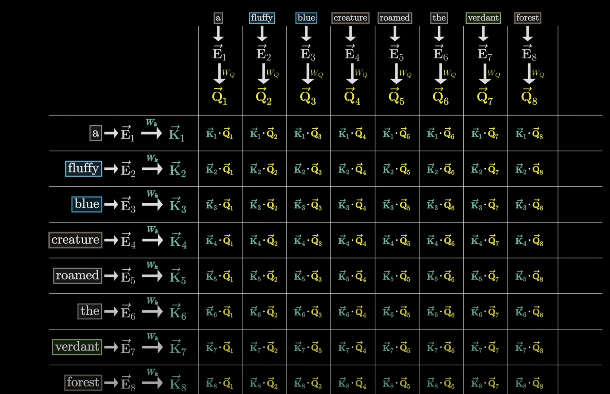

For our adjective noun example, that would look a little more like this, where if the keys produced by fluffy and blue really do align closely with the query produced by creature, then the dot products in these two spots would be some large positive numbers. **In the lingo, machine learning people would say that this means the embeddings of fluffy and blue attend to the embedding of creature.** By contrast to the dot product between the key for some other word like the and the query for creature would be some small or negative value that reflects that are unrelated to each other. So we have this grid of values that can be any real number from negative infinity to infinity, giving us a score for how relevant each word is to updating the meaning of every other word.

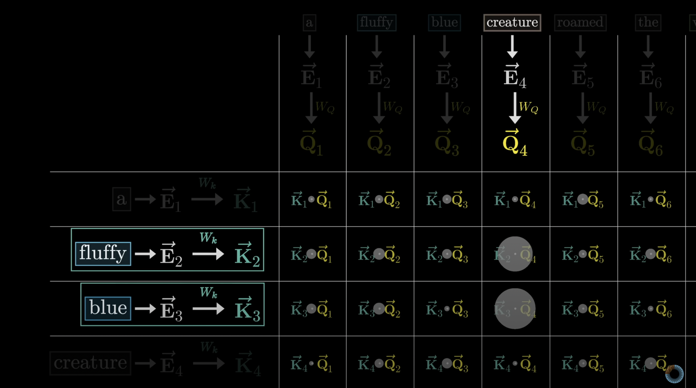

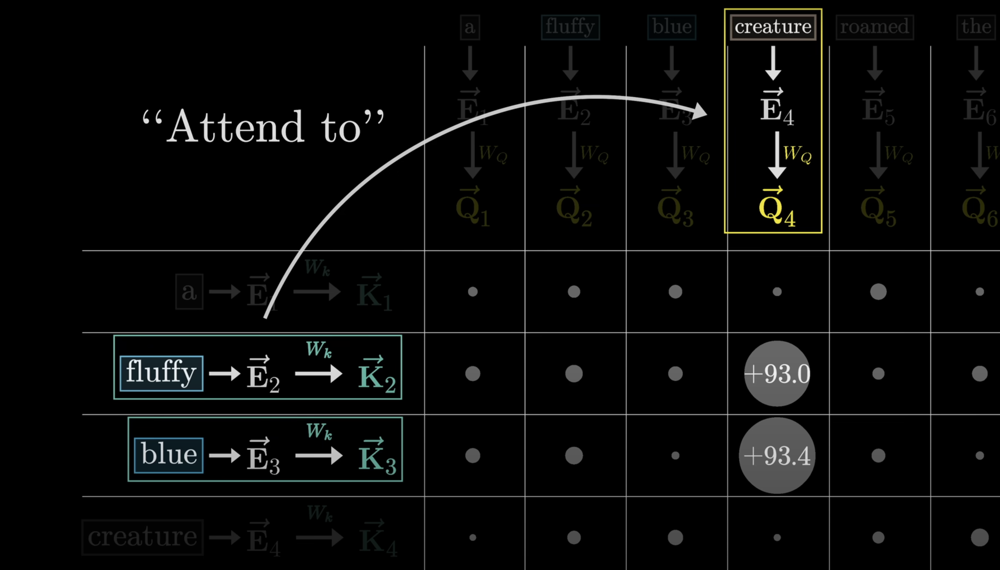

The way we're about to use these scores is to take a certain weighted sum along each column, weighted by the relevance. **So instead of having values range from negative infinity to infinity, what we want is for the numbers in these columns to be between 0 and 1, and for each column to add up to 1, as if they were a probability distribution.** We compute a softmax along each one of these columns to normalize the values.

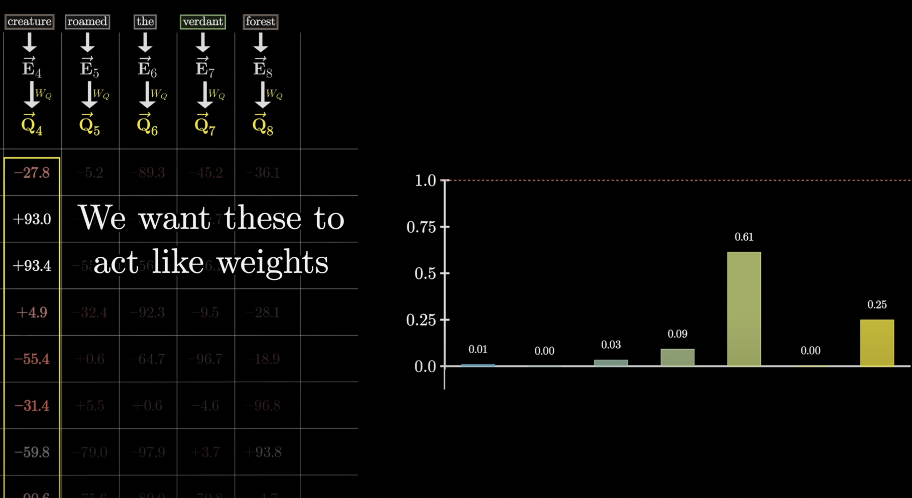

In our picture, after you apply softmax to all of the columns, we'll fill in the grid with these normalized values. At this point you're safe to think about each column as giving weights according to how relevant the word on the left is to the corresponding value at the top.

**We call this grid an attention pattern.**

Now if you look at the original transformer paper, there's a really compact way that they write this all down. Here the variables Q and K represent the full arrays of query and key vectors respectively, those little vectors you get by multiplying the embeddings by the query and the key matrices. This expression up in the numerator is a really compact way to represent the grid of all possible dot products between pairs of keys and queries. A small technical detail that we didn't mention is that for numerical stability, it happens to be helpful to divide all of these values by the square root of the dimension in that key query space. Then this softmax that's wrapped around the full expression is meant to be understood to apply column by column. As to that V term, we'll talk about it in just a second.

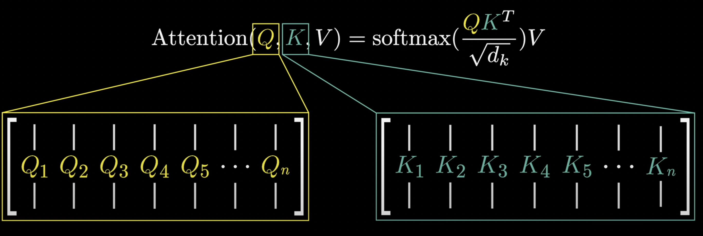

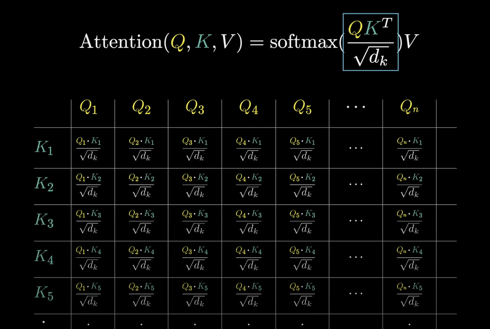

**It turns out to make the whole training process a lot more efficient if you simultaneously have it predict every possible next token following each initial subsequence of tokens in this passage.**

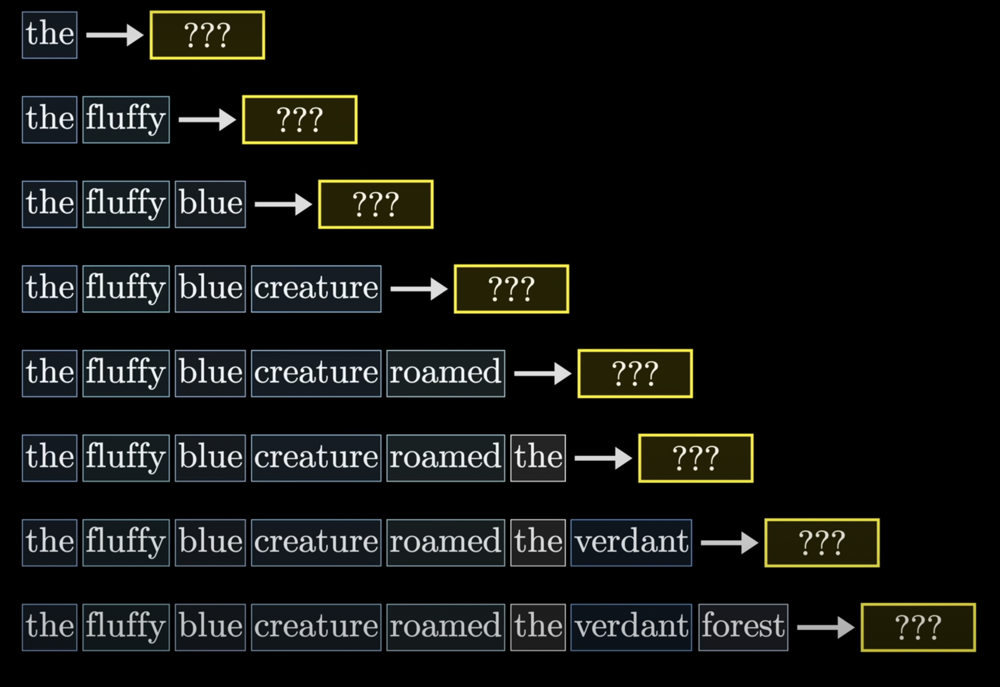

**This is really nice, because it means what would otherwise be a single training example effectively acts as many. For the purposes of our attention pattern, it means that you never want to allow later words to influence earlier words, since otherwise they could kind of give away the answer for what comes next.**

**What this means is that we want all of these spots here, the ones representing later tokens influencing earlier ones, to somehow be forced to be zero.**

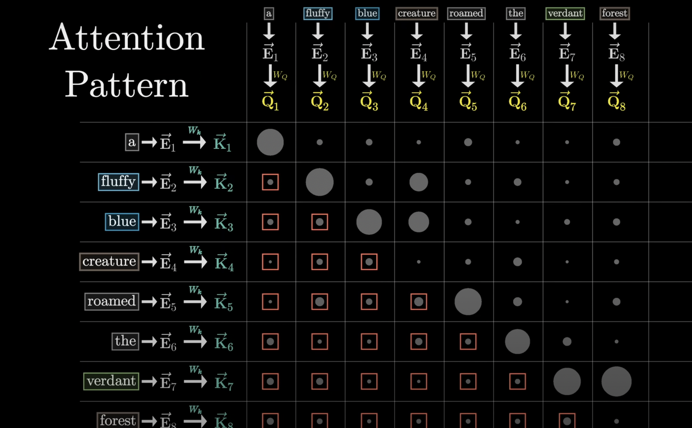

**The simplest thing you might think to do is to set them equal to zero, but if you did that the columns wouldn't add up to one anymore, they wouldn't be normalized. So instead, a common way to do this is that before applying softmax, you set all of those entries to be negative infinity. If you do that, then after applying softmax, all of those get turned into zero, but the columns stay normalized. This process is called masking.**

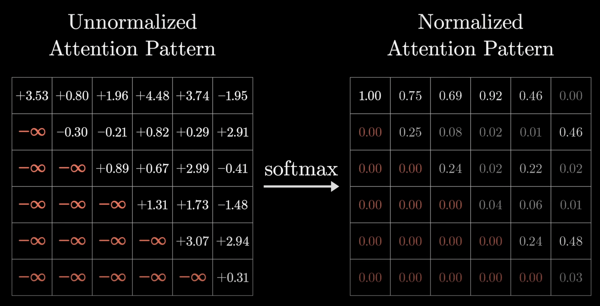

**Another fact that's worth reflecting on about this attention pattern is how its size is equal to the square of the context size.** So this is why context size can be a really huge bottleneck for large language models, and scaling it up is non-trivial.

**Now you need to actually update the embeddings, allowing words to pass information to whichever other words they're relevant to.** For example, you want the embedding of Fluffy to somehow cause a change to Creature that moves it to a different part of this 12,000-dimensional embedding space that more specifically encodes a Fluffy creature.

**The most straightforward way would be to use a third matrix, what we call the value matrix, which you multiply by the embedding of that first word, for example Fluffy. The result of this is what you would call a value vector, and this is something that you add to the embedding of the second word, in this case something you add to the embedding of Creature.**

**So this value vector lives in the same very high-dimensional space as the embeddings.**

**For each column in this diagram, you multiply each of the value vectors by the corresponding weight in that column.**

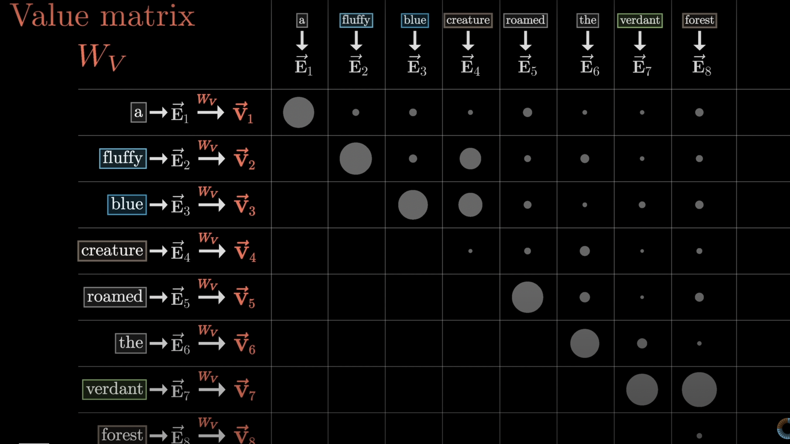

For example here, under the embedding of Creature, you would be adding large proportions of the value vectors for Fluffy and Blue, while all of the other value vectors get zeroed out, or at least nearly zeroed out.

**And then finally, the way to actually update the embedding associated with this column, previously encoding some context-free meaning of Creature, you add together all of these rescaled values in the column, producing a change that you want to add, that I'll label delta-e, and then you add that to the original embedding.**

Hopefully what results is a more refined vector encoding the more contextually rich meaning, like that of a fluffy blue creature.

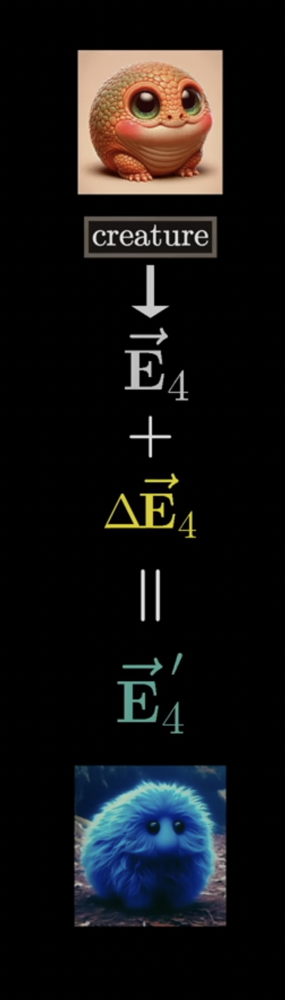

**And of course you don't just do this to one embedding, you apply the same weighted sum across all of the columns in this picture, producing a sequence of changes, adding all of those changes to the corresponding embeddings, produces a full sequence of more refined embeddings popping out of the attention block.**

**This process is parameterized by three distinct matrices, all filled with tunable parameters, the key, the query, and the value.**

These key and query matrices each have 12,288 columns, matching the embedding dimension, and 128 rows, matching the dimension of that smaller key query space.

If you look at that value matrix by contrast, the way we've described things so far would suggest that it's a square matrix that has 12,288 columns and 12,288 rows, since both its inputs and outputs live in this very large embedding space. If true, that would mean about 150 million added parameters.

And to be clear, you could do that. You could devote orders of magnitude more parameters to the value map than to the key and query. **But in practice, it is much more efficient if instead you make it so that the number of parameters devoted to this value map is the same as the number devoted to the key and the query.**

The way this looks is that the value map is factored as a product of two smaller matrices. Conceptually, we should still think about the overall linear map, one with inputs and outputs, both in this larger embedding space.

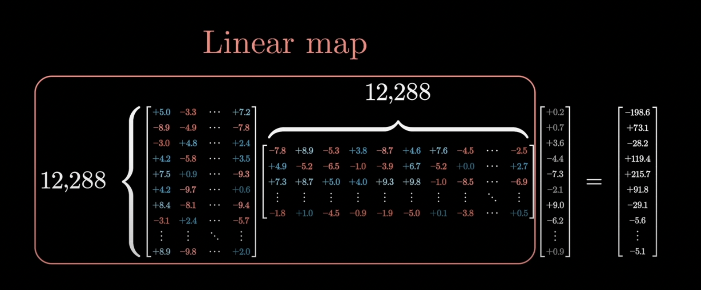

**What this means is you can think of it as mapping the large embedding vectors down to a much smaller space. This is not the conventional naming, but we to call this the “value down” matrix. The second matrix maps from this smaller space back up to the embedding space, producing the vectors that you use to make the actual updates. We call this one the “value up” matrix, which again is not conventional.** Turning back to the parameter count, all four of these matrices have the same size, and adding them all up we get about 6.3 million parameters for one attention head.

**As a quick side note, to be a little more accurate, everything described so far is what people would call a self-attention head, to distinguish it from a variation that comes up in other models that's called cross-attention. Cross-attention involves models that process two distinct types of data, like text in one language and text in another language that's part of an ongoing generation of a translation, or maybe audio input of speech and an ongoing transcription.**

**A cross-attention head looks almost identical. The only difference is that the key and query maps act on different data sets. In a model doing translation, for example, the keys might come from one language, while the queries come from another, and the attention pattern could describe which words from one language correspond to which words in another. And in this setting there would typically be no masking, since there's not really any notion of later tokens affecting earlier ones.**

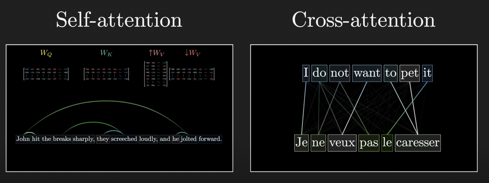

All that's really left to us is to lay out the sense in which you do this many many different times. **In our central example we focused on adjectives updating nouns, but of course there are lots of different ways that context can influence the meaning of a word.** And a lot of associations might be less grammatical. If the word wizard is anywhere in the same passage as Harry, it suggests that this might be referring to Harry Potter, whereas if instead the words Queen, Sussex, and William were in that passage, then perhaps the embedding of Harry should instead be updated to refer to the prince.

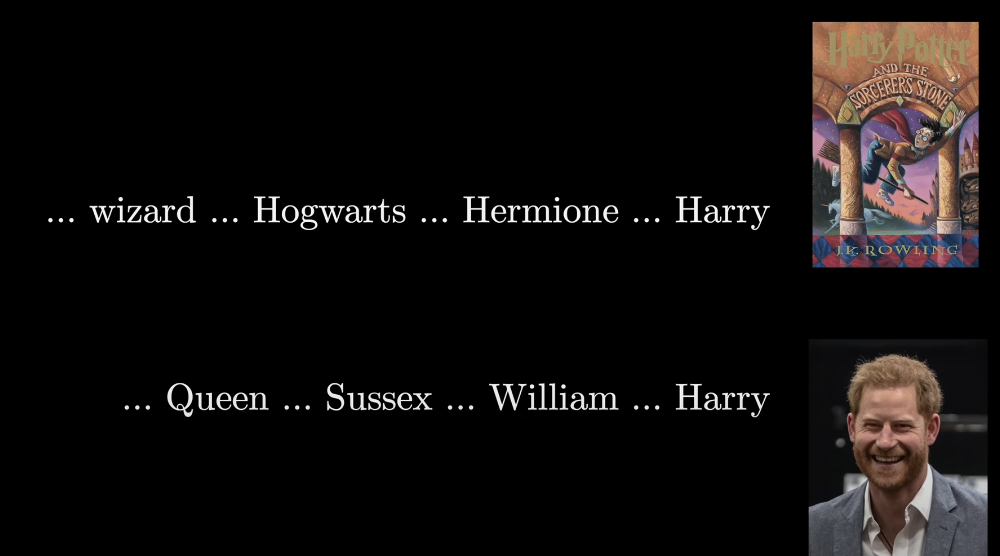

**For every different type of contextual updating that you might imagine, the parameters of these key and query matrices would be different to capture the different attention patterns, and the parameters of our value map would be different based on what should be added to the embeddings. And again, in practice the true behavior of these maps is much more difficult to interpret, where the weights are set to do whatever the model needs them to do to best accomplish its goal of predicting the next token.**

**Everything we described is a single head of attention, and a full attention block inside a transformer consists of what's called multi-headed attention, where you run a lot of these operations in parallel, each with its own distinct key query and value maps.**

GPT-3 for example uses 96 attention heads inside each block. **Just to spell it all out very explicitly, this means you have 96 distinct key and query matrices producing 96 distinct attention patterns. Then each head has its own distinct value matrices used to produce 96 sequences of value vectors.**

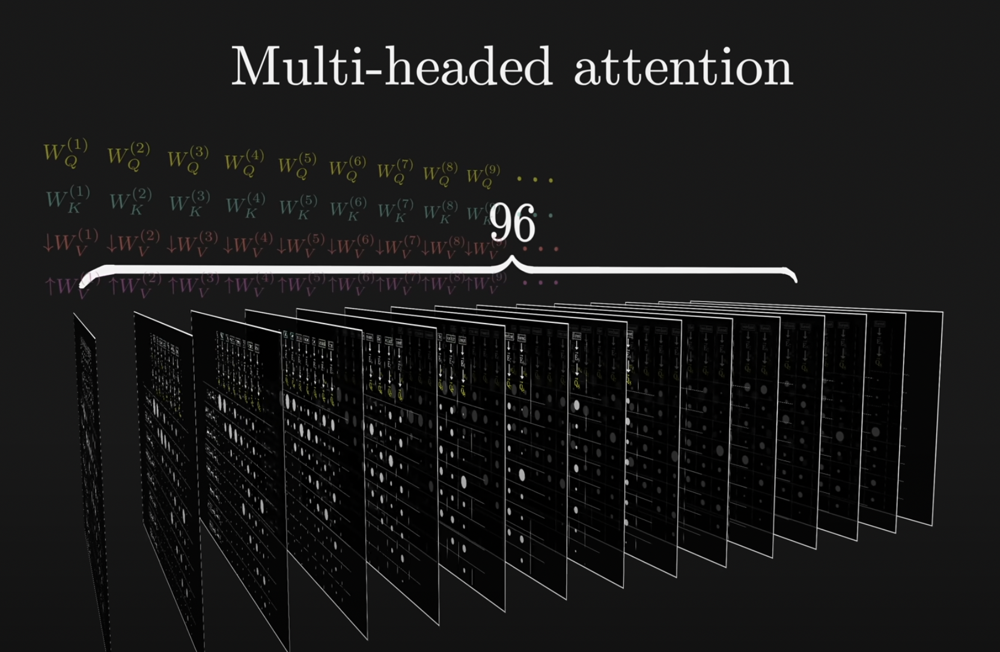

**What this means is that for each position in the context, each token, every one of these heads produces a proposed change to be added to the embedding in that position.**

**So what you do is you sum together all of those proposed changes, one for each head, and you add the result to the original embedding of that position.**

**This entire sum here would be one slice of what's outputted from this multi-headed attention block, a single one of those refined embeddings that pops out the other end of it.**

**The overall idea is that by running many distinct heads in parallel, you're giving the model the capacity to learn many distinct ways that context changes meaning.** Pulling up our running tally for parameter count with 96 heads, each including its own variation of these four matrices, each block of multi-headed attention ends up with around 600 million parameters.

**We said that the value map is factored out into these two distinct matrices, which we labeled as the value down and the value up matrices.** The way that we framed things would suggest that you see this pair of matrices inside each attention head, and you could absolutely implement it this way. That would be a valid design.

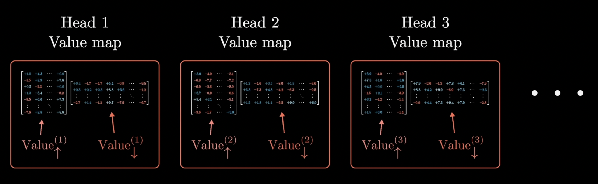

But the way that you see this written in papers and the way that it's implemented in practice looks a little different. **All of these value up matrices for each head appear stapled together in one giant matrix that we call the output matrix, associated with the entire multi-headed attention block.**

**And when you see people refer to the value matrix for a given attention head, they're typically only referring to this first step, the one that we were labeling as the value down projection into the smaller space.**

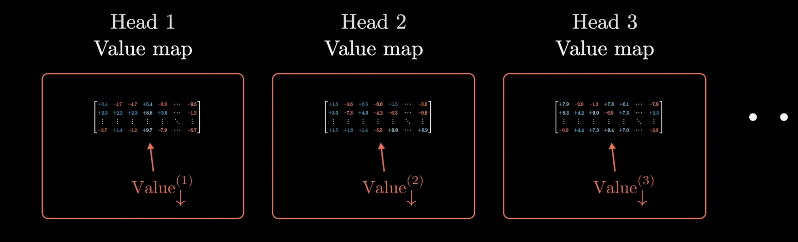

We saw how data flowing through a transformer doesn't just flow through a single attention block. For one thing, it also goes through these other operations called multi-layer perceptrons.

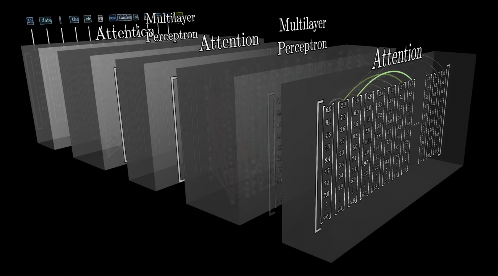

**And then it repeatedly goes through many many copies of both of these operations. What this means is that after a given word imbibes some of its context, there are many more chances for this more nuanced embedding to be influenced by its more nuanced surroundings. The further down the network you go, with each embedding taking in more and more meaning from all the other embeddings, which themselves are getting more and more nuanced, the hope is that there's the capacity to encode higher level and more abstract ideas about a given input beyond just descriptors and grammatical structure.** Things like sentiment and tone and whether it's a poem and what underlying scientific truths are relevant to the piece and things like that.

Turning back one more time to our scorekeeping, GPT-3 includes 96 distinct layers, so the total number of key query and value parameters is multiplied by another 96, which brings the total sum to just under 58 billion distinct parameters devoted to all of the attention heads.

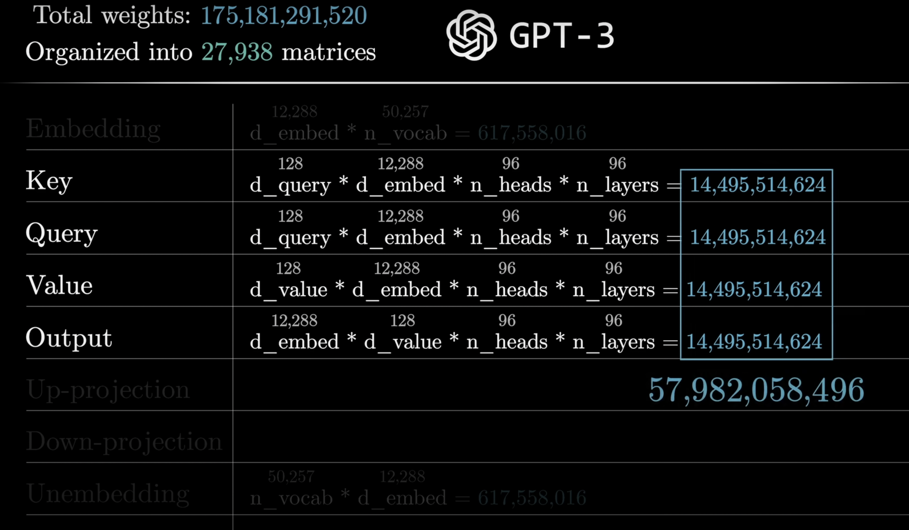

That is a lot to be sure, but it's only about a third of the 175 billion that are in the network in total. So even though attention gets all of the attention, the majority of parameters come from the blocks sitting in between these steps.

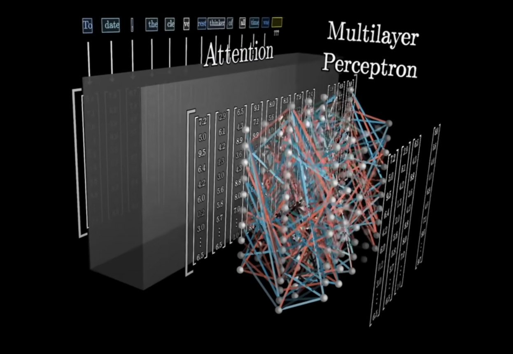

**A big part of the story for the success of the attention mechanism is not so much any specific kind of behavior that it enables, but the fact that it's extremely parallelizable, meaning that you can run a huge number of computations in a short time using GPUs.**

