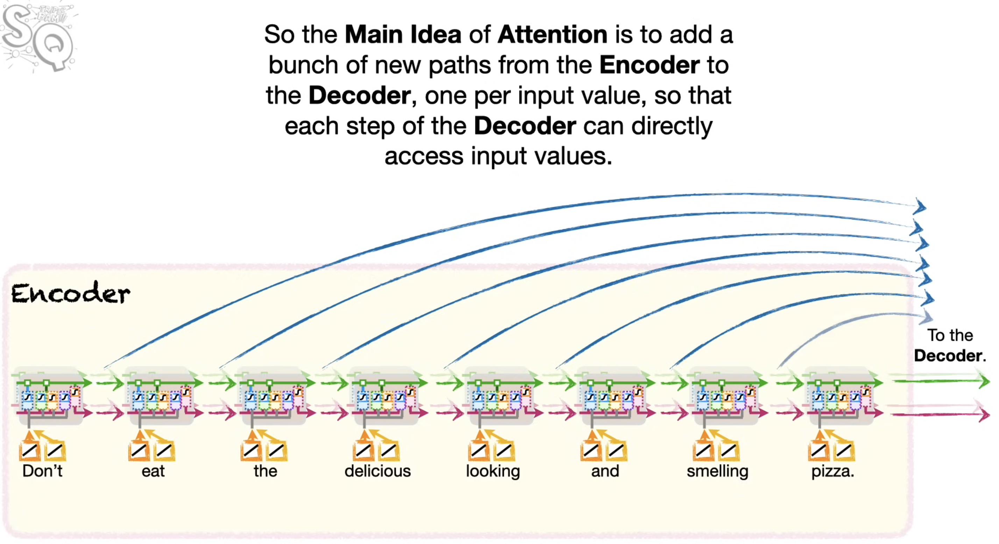
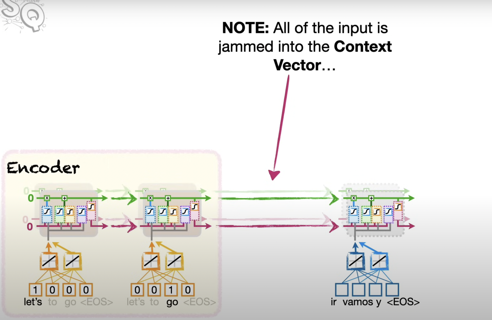
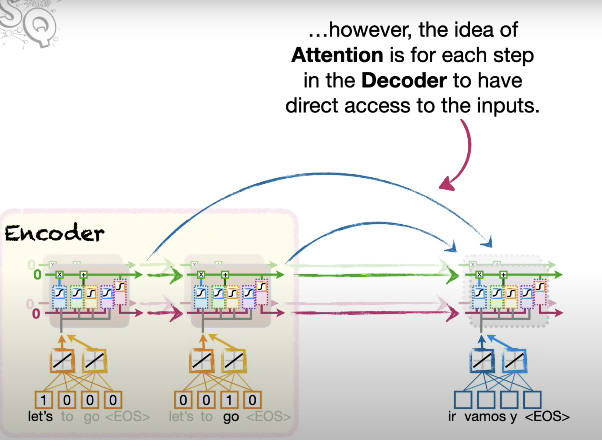
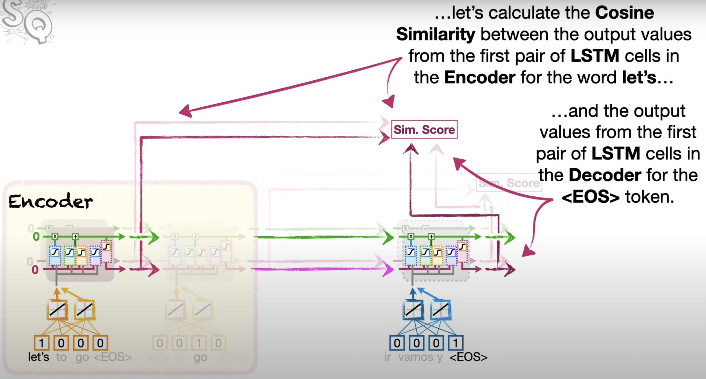
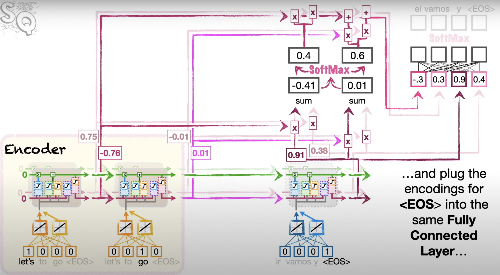

# Attention Mechanism

When you hear the sentence "the ball is on the field," you don’t assign the same importance to all 6 words. You primarily take note of the words "ball," "on," and "field," since those are the words that are most "important" to you. Similarly, there is a flaw in using the final RNN hidden state as the single "context vector" for sequence-to-sequence models: often, different parts of an input have different levels of significance.

Attention mechanisms make use of this observation by providing the decoder network with a look at the entire input sequence at every decoding step; the decoder can then decide what input words are important at any point in time.

Consider a long input we would like to translate.

But for longer phrases, even with LSTMs, words that are input early on can be forgotten easily. And in this case, if we forget the first word, **Don't**, then, **Don't eat the delicious looking and smelling pizza** turns into **eat the delicious looking and smelling pizza**. The main idea of LSTMs is that they provide separate paths for long and short memories. Even with separate paths, if we have a lot of data, both paths have to carry a lot of information. This means that a word at the start of the phrase can still get lost.

**Note:** Although there are conventions, there are no rules for how **Attention** should be added to an **Encoder-Decoder** model. So what follows is just one example.

**We can instead do Dot Product as well for calculating Similarity.**

And since the score for **go** is higher, we want the encoding for **go** to have more influence on the first word that comes out of the **Decoder**.

So we can think of the output of the **Softmax** function as a way to determine what percentage of each encoded input word we should use when decoding.

**...and, lastly we add the scaled values together.**

**...and the second output from the Decoder is EOS so we are done decoding.**

Another variation of this is where we concatenate the attention value (which is a weighted sum of encoder hidden states) with the decoder hidden state and proceed as in the non-attention encoder-decoder model.