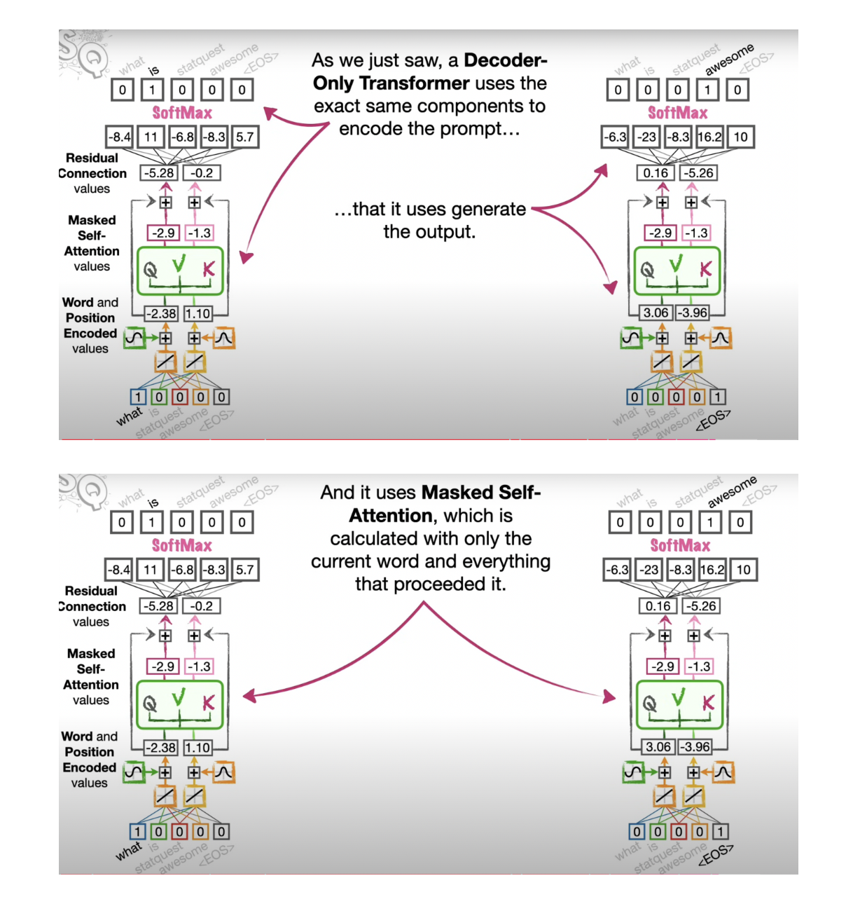
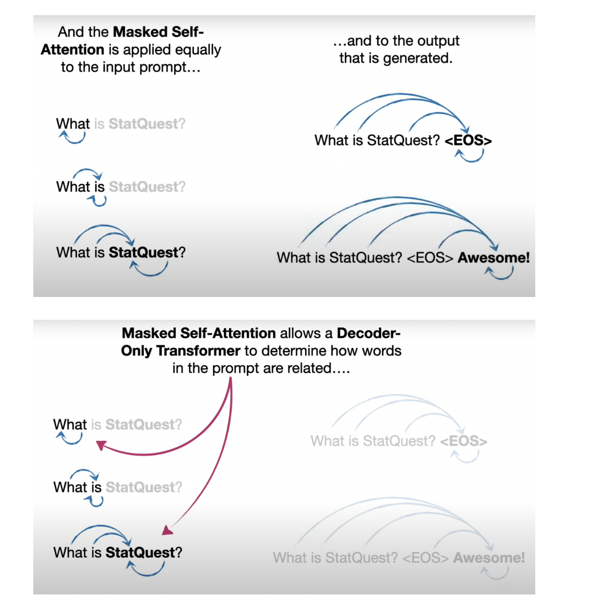

# Differences between the basic Transformer and the Decoder-Only Transformer

**Lastly, during training, a normal Transformer uses Masked Self-Attention, but only on the output. In contrast, a Decoder-only Transformer has a single unit for both encoding the input as well as generating the output. And a Decoder-only Transformer uses a single type of attention, Masked Self-Attention. And a Decoder-only Transformer uses Masked Self-Attention all the time on everything, the input and the output.**