# How large language models work, a visual intro to transformers

The initials GPT stand for Generative Pretrained Transformer. So that first word is straightforward enough, these are bots that generate new text (or some other format of output). Pretrained refers to how the model went through a process of learning from a massive amount of data, and the prefix insinuates that there's more room to fine-tune it on specific tasks with additional training. But the last word, that's the real key piece. A transformer is a specific kind of neural network, a machine learning model, and it's the core invention underlying the boom in AI. 

There are many different kinds of models that you can build using transformers. 

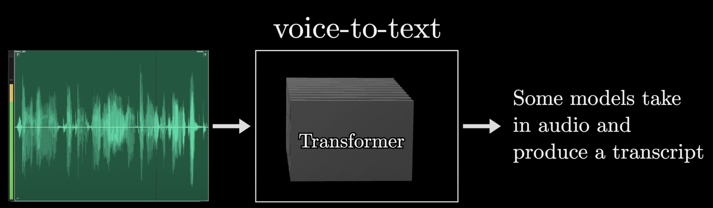

And the original transformer introduced in 2017 by Google was invented for the specific use case of translating text from one language into another. 

But the variant we will focus on, which is the type that underlies tools like ChatGPT, will be a model that's trained to take in a piece of text, maybe even with some surrounding images or sound accompanying it, and produce a prediction for what comes next in the passage. That prediction takes the form of a probability distribution over many different chunks of text that might follow.

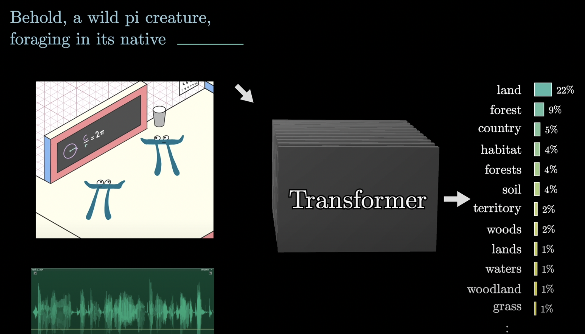

At first glance, you might think that predicting the next word feels like a very different goal from generating new text. But once you have a prediction model like this, a simple thing you generate a longer piece of text is to give it an initial snippet to work with, have it take a random sample from the distribution it just generated, append that sample to the text, and then run the whole process again to make a new prediction based on all the new text, including what it just added. This process here of repeated prediction and sampling is essentially what's happening when you interact with ChatGPT or any of these other large language models and you see them producing one word at a time.

Let's kick things off with a very high level preview In broad strokes, when one of these chatbots generates a given word, here's what's going on under the hood.

First, the input is broken up into a bunch of little pieces. These pieces are called tokens, and in the case of text these tend to be words or little pieces of words or other common character combinations. If images or sound are involved, then tokens could be little patches of that image or little chunks of that sound.

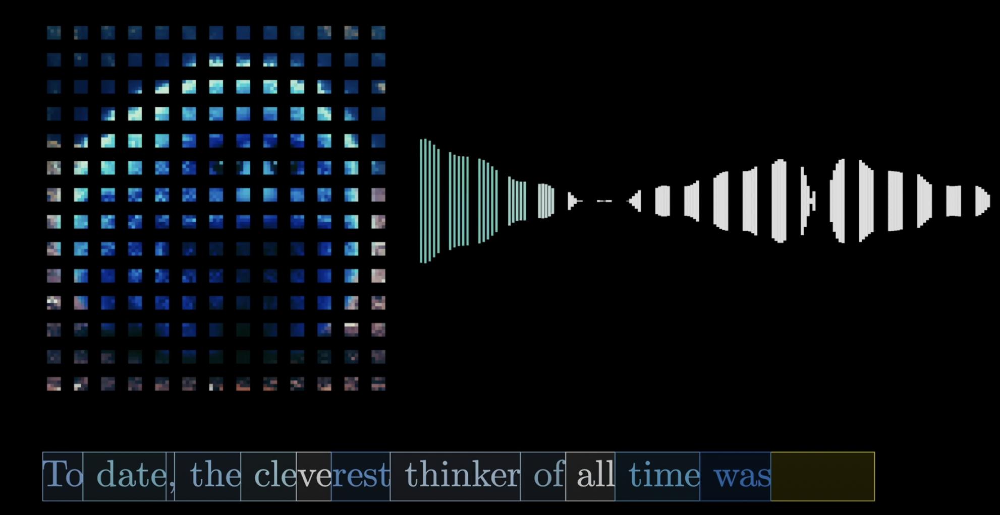

Each one of these tokens is then associated with a vector, meaning some list of numbers, which is meant to somehow encode the meaning of that piece.

If you think of these vectors as giving coordinates in some very high dimensional space, words with similar meanings tend to land on vectors that are close to each other in that space. This sequence of vectors then passes through an operation that's known as an attention block, and this allows the vectors to talk to each other and pass information back and forth to update their values.

For example, the meaning of the word model in the phrase a machine learning model is different from its meaning in the phrase a fashion model.

The attention block is what's responsible for figuring out which words in context are relevant to updating the meanings of which other words, and how exactly those meanings should be updated. And again, whenever we use the word meaning, this is somehow entirely encoded in the entries of those vectors.

After that, these vectors pass through a different kind of operation, a multi-layer perceptron or maybe a feed-forward layer.

And here the vectors don't talk to each other, they all go through the same operation in parallel.

The step is a little bit like asking a long list of questions about each vector, and then updating them based on the answers to those questions.

All of the operations in both of these blocks look like a giant pile of matrix multiplications, and our primary job is going to be to understand how to read the underlying matrices.

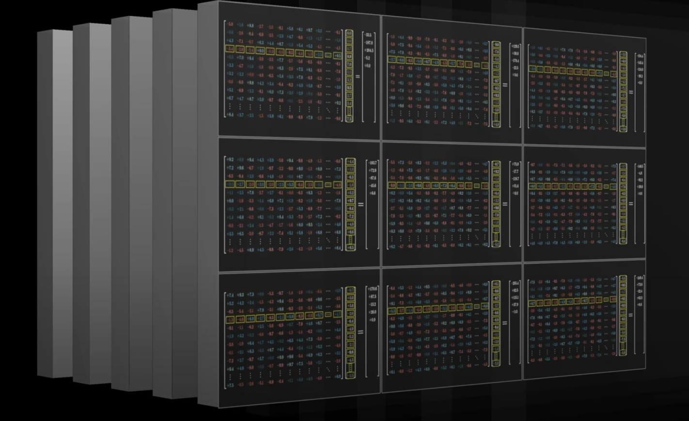

After that, the process essentially repeats, you go back and forth between attention blocks and multi-layer perceptron blocks, until at the very end the hope is that all of the essential meaning of the passage has somehow been baked into the very last vector in the sequence.

We then perform a certain operation on that last vector that produces a probability distribution over all possible tokens, all possible little chunks of text that might come next.

Once you have a tool that predicts what comes next given a snippet of text, you can feed it a little bit of seed text and have it repeatedly play this game of predicting what comes next, sampling from the distribution, appending it, and then repeating over and over.

Deep learning describes a class of models that have proven to scale remarkably well, and what unifies them is the same training algorithm, called backpropagation. These models follow a certain specific format.

First, whatever model you're making, the input has to be formatted as an array of real numbers. This could mean a list of numbers, it could be a two-dimensional array, or very often you deal with higher dimensional arrays, where the general term used is tensor. You often think of that input data as being progressively transformed into many distinct layers, where again, each layer is always structured as some kind of array of real numbers, until you get to a final layer which you consider the output.

For example, the final layer in our text processing model is a list of numbers representing the probability distribution for all possible next tokens. In deep learning, these model parameters are almost always referred to as weights, and this is because a key feature of these models is that the only way these parameters interact with the data being processed is through weighted sums. Typically though, instead of seeing the weighted sums all naked and written out explicitly like this, you'll instead find them packaged together as various components in a matrix vector product. 

For example, those 175 billion weights in GPT-3 are organized into just under 28,000 distinct matrices. 

Those matrices in turn fall into eight different categories, and we could step through each one of those categories to understand what that type does. As we go through, it's kind of fun to reference the specific numbers from GPT-3 to count up exactly where those 175 billion come from.

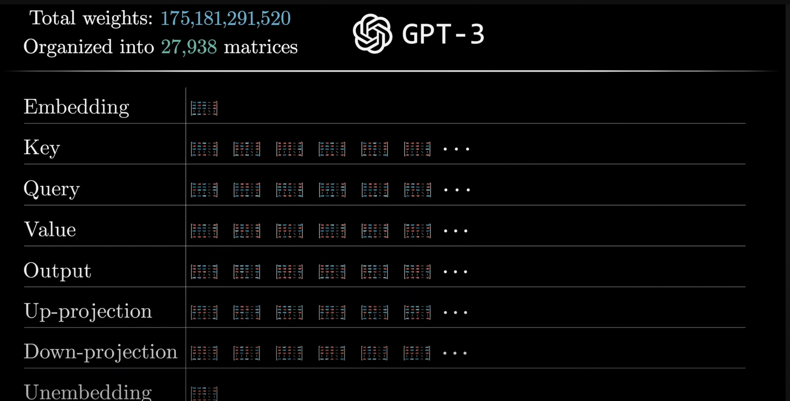

The model has a predefined vocabulary, some list of all possible words, say 50,000 of them, and the first matrix that we'll encounter, known as the embedding matrix, has a single column for each one of these words. These columns are what determines what vector each word turns into in that first step.

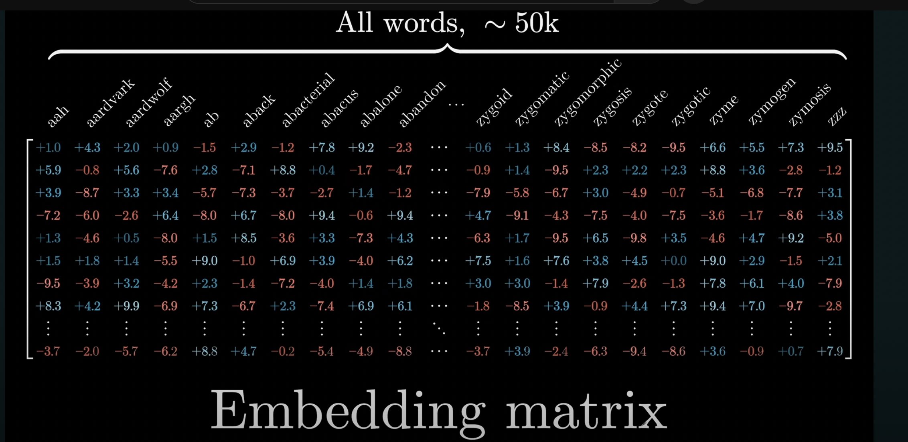

Its values begin random, but they're going to be learned based on data. Turning words into vectors was common practice in machine learning long before transformers. The big idea here is that as a model tweaks and tunes its weights to determine how exactly words get embedded as vectors during training, it tends to settle on a set of embeddings where directions in the space have a kind of semantic meaning.

The embedding matrix, whose columns tell us what happens to each word, is the first pile of weights in our model. Using the GPT-3 numbers, the vocabulary size specifically is 50257, and again, technically this consists not of words per se, but of tokens. The embedding dimension is 12,288, and multiplying those tells us this consists of about 617 million weights. Let's go ahead and add this to a running tally, remembering that by the end we should count up to 175 billion.

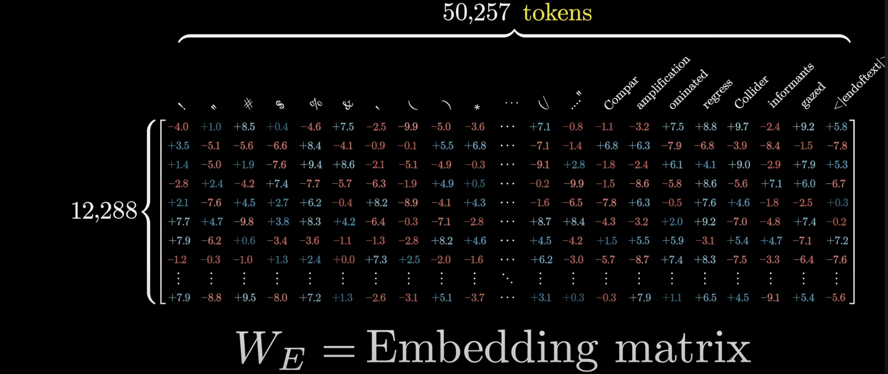

In the case of transformers, you really want to think of the vectors in this embedding space as not merely representing individual words. More importantly, you should think of them as having the capacity to soak in context.

A vector that started its life as the embedding of the word king, for example, might progressively get tugged and pulled by various blocks in this network, so that by the end it points in a much more specific and nuanced direction that somehow encodes that it was a king who lived in Scotland, and who had achieved his post after murdering the previous king, and who's being described in Shakespearean language.

Think about your own understanding of a given word. The meaning of that word is clearly informed by the surroundings, and sometimes this includes context from a long distance away, so in putting together a model that has the ability to predict what word comes next, the goal is to somehow empower it to incorporate context efficiently. 

To be clear, in the very first step, when you create the array of vectors based on the input text, each one of those is simply plucked out of the embedding matrix, so initially each one can only encode the meaning of a single word without any input from its surroundings.

But you should think of the primary goal of this network that it flows through as being to enable each one of those vectors to soak up a meaning that's much more rich and specific than what mere individual words could represent. 

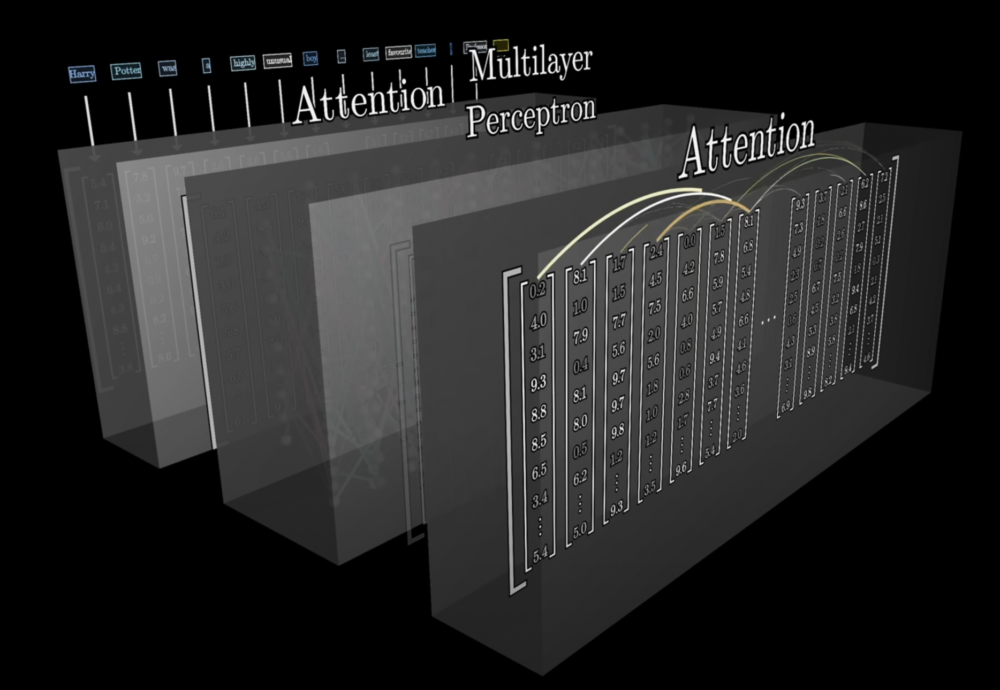

The network can only process a fixed number of vectors at a time, known as its context size.

For GPT-3 it was trained with a context size of 2048, so the data flowing through the network always looks like this array of 2048 columns, each of which has 12,000 dimensions. This context size limits how much text the transformer can incorporate when it's making a prediction of the next word. This is why long conversations with certain chatbots, like the early versions of ChatGPT, often gave the feeling of the bot kind of losing the thread of conversation as you continued too long.

Let’s talk about what happens at the very end. Remember, the desired output is a probability distribution over all tokens that might come next. For example, if the very last word is Professor, and the context includes words like Harry Potter, and immediately preceding we see least favorite teacher, then a well-trained network that had built up knowledge of Harry Potter would presumably assign a high number to the word Snape.

This involves two different steps. The first one is to use another matrix that maps the very last vector in that context to a list of 50000 values, one for each token in the vocabulary.

Then there's a function that normalizes this into a probability distribution, it's called Softmax. 

It might seem a little bit weird to only use this last embedding to make a prediction, when after all in that last step there are thousands of other vectors in the layer just sitting there with their own context-rich meanings.

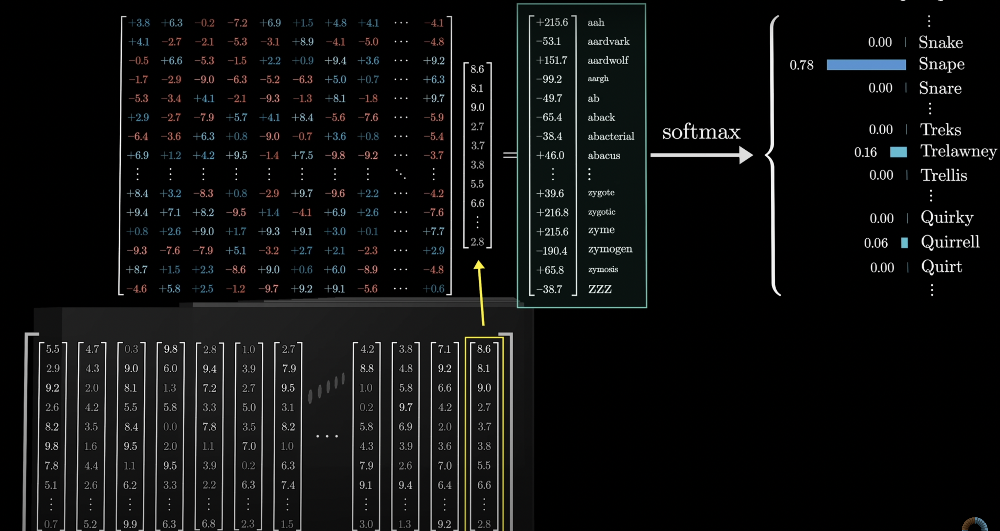

This has to do with the fact that in the training process it turns out to be much more efficient if you use each one of those vectors in the final layer to simultaneously make a prediction for what would come immediately after it.

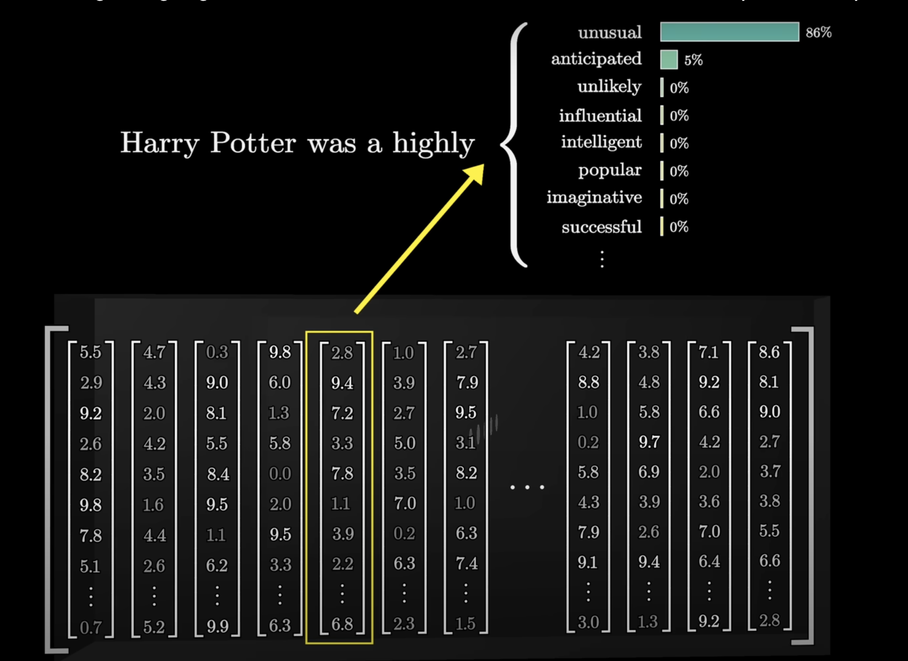

The final matrix is called the Unembedding matrix and we give it the label WU. Again, like all the weight matrices we see, its entries begin at random, but they are learned during the training process.

Keeping score on our total parameter count, this Unembedding matrix has one row for each word in the vocabulary, and each row has the same number of elements as the embedding dimension.

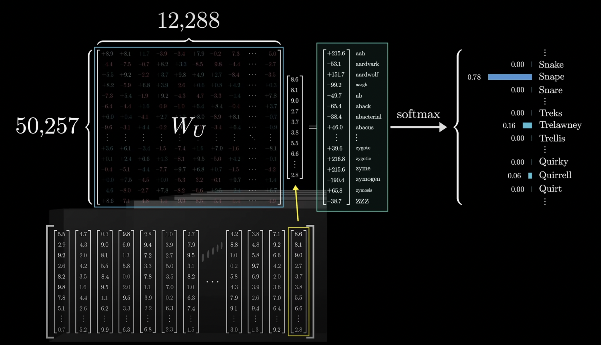

It's very similar to the embedding matrix, just with the order swapped, so it adds another 617 million parameters to the network, meaning our count so far is a little over a billion, a small but not wholly insignificant fraction of the 175 billion we'll end up with in total.

