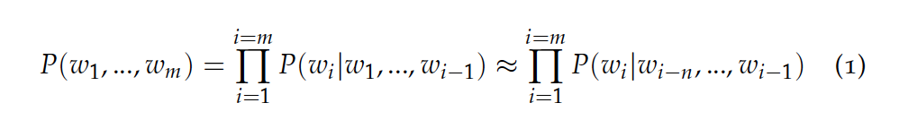
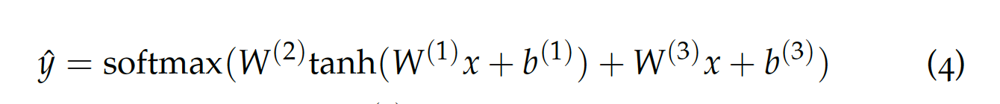
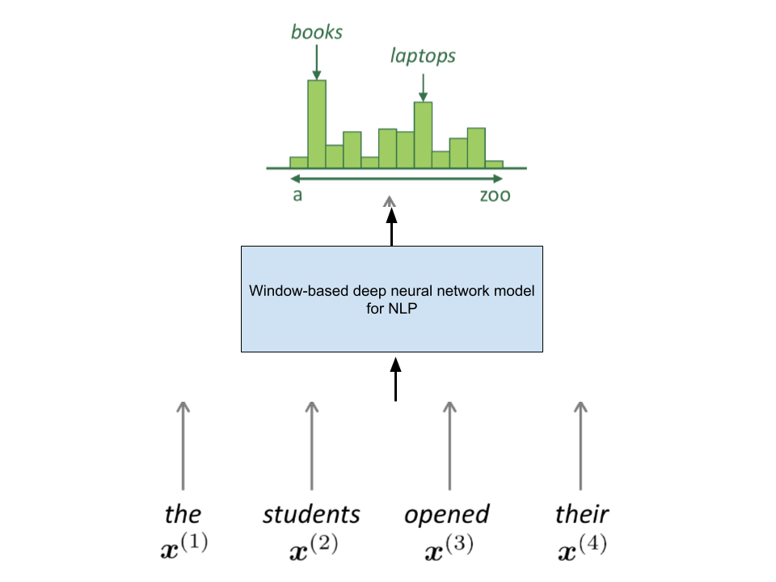

# Language Models

Language models compute the probability of occurrence of a number of words in a particular sequence. The probability of a sequence of $m$ words $\{w_1, \ldots, w_m\}$ is denoted as $P(w_1, \ldots, w_m)$. Since the number of words coming before a word, $w_i$, varies depending on its location in the input document, $P(w_1, \ldots, w_m)$ is usually conditioned on a window of $n$ previous words rather than all previous words.

In machine translation, the model chooses the best word ordering for an input phrase by assigning a goodness score to each output word sequence alternative. To do so, the model may choose between different word ordering or word choice alternatives. It would achieve this objective by running all word sequence candidates through a probability function that assigns each a score. The sequence with the highest score is the output of the translation. For example, the machine would give a higher score to "the cat is small" compared to "small the is cat", and a higher score to "walking home after school" compared to "walking house after school".

To compute the probabilities mentioned above, the count of each $n$-gram (i.e., sequence of $n$ words) could be compared against the frequency of each word. This is called an $n$-gram Language Model. For instance, if the model takes bi-grams, the frequency of each bi-gram, calculated via combining a word with its previous word, would be divided by the frequency of the corresponding uni-gram. Equations 2 and 3 show this relationship for bigram and trigram models.

For instance, what (3) means is that $P(w_3 \mid (w_1, w_2))$ is equal to the ratio of count of all instances where the sequence $(w_1, w_2, w_3)$ appears to the count of all instances where the sequence $(w_1, w_2)$ appears. Clearly this is $< 1$ because the numerator is a subset of the denominator. This gives a sense of the answer to the question—"What's the probability of $w_3$ occurring given that the sequence $(w_1, w_2)$ has already occurred?"

The relationship in Equation 3 focuses on making predictions based on a fixed window of context (i.e., the $n$ previous words) used to predict the next word. But how long should the context be? In some cases, the window of past consecutive $n$ words may not be sufficient to capture the context. For instance, consider the sentence "As the proctor started the clock, the students opened their ___". If the window only conditions on the previous three words "the students opened their", the probabilities calculated based on the corpus may suggest that the next word be "books"—however, if $n$ had been large enough to include the "proctor" context, the probability might have suggested "exam". This leads us to two main issues with $n$-gram Language Models: **Sparsity** and **Storage**.

Sparsity problems with these models arise due to two issues. Firstly, note the numerator of Equation 3. If $w_1$, $w_2$ and $w_3$ never appear together in the corpus, the probability of $w_3$ is $0$. To solve this, a small $d$ could be added to the count for each word in the vocabulary. This is called **smoothing**. Secondly, consider the denominator of Equation 3. If $w_1$ and $w_2$ never occurred together in the corpus, then no probability can be calculated for $w_3$. To solve this, we could condition on $w_2$ alone. This is called **backoff**. Increasing $n$ makes sparsity problems worse.

We know that we need to store the count for all $n$-grams we saw in the corpus. As $n$ increases (or the corpus size increases), the model size increases as well.

Let’s look at another language model, which is a Window-based Neural Language Model. 

Equation 4 represents the above figure and shows the parameters of the $\text{softmax}()$ function, consisting of the standard $\tanh()$ function (i.e., the hidden layer) as well as the linear function, $W^{(3)}x + b^{(3)}$, that captures all the previous $n$ input word vectors.

$W^{(1)}$, $W^{(2)}$, $W^{(3)}$, $b^{(1)}$ and $b^{(2)}$ are the parameters of the model. Note that the weight matrix $W^{(1)}$ is applied to the word vectors, $W^{(2)}$ is applied to the hidden layer and $W^{(3)}$ is applied to the word vectors. The output distribution is a $\text{softmax}$ over the vocabulary.

