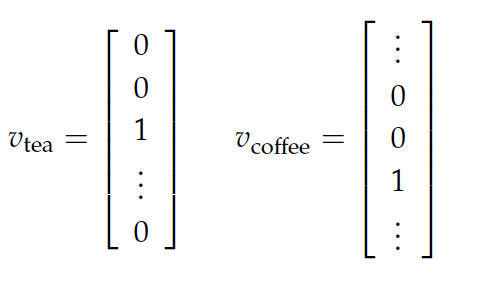
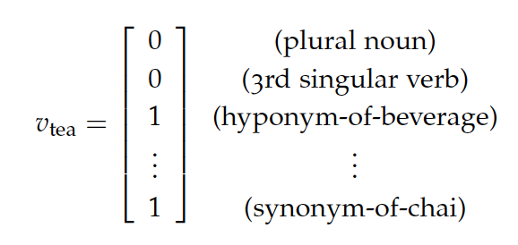

# Representing words

Expressing and processing the nuance and wildness of language- while achieving the strong transfer of information that language is intended to achieve- makes representing words an endlessly fascinating problem.

Perhaps the simplest way to represent words is as independent, unrelated entities. You might think of this as a set {. . . , tea, . . . , coffee, . . . , intimidate}.

We will refer to a word type as an element of a finite vocabulary, independent of actually observing the word in context. So, we’ve just written a set of types. A word token is an instance of the type observed in some context.

We will often be working with vectors; the conventional vector representation of independent components is the set of 1-hot, or standard basis, vectors. A couple of examples.

Why do we represent words as vectors? To better compute with them. And when computing with 1-hot vectors, we do achieve the crucial fact that different words are different, but alas, we encode no meaningful notion of similarity or other relationship. This is because, for example, if we take the dot product as a notion of similarity we compute a result of zero.

All words are equally dissimilar from each other.

Should we represent word semantics not as one-hot vectors, but instead as a collection of features and relationships to linguistic categories and other words? WordNet annotates for synonyms, hyponyms, and other semantic relations; UniMorph annotates for morphology (subword structure) information across many languages. With such resources, one could build word vectors that look something like the following.

One main failure is that human-annotated resources are always lacking in vocabulary compared to methods that can draw a vocabulary from a naturally occurring text source- updating these resources is costly and they’re always incomplete. Another failure is a tradeoff between dimensionality and utility of the embedding- it takes a very high-dimensional vector to represent all of these categories, and modern neural methods that tend to operate on dense vectors do not behave well with such sparse vectors.