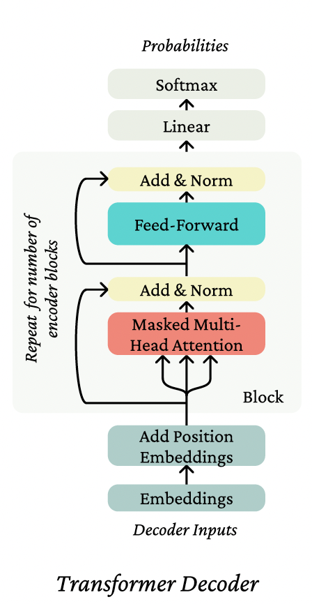
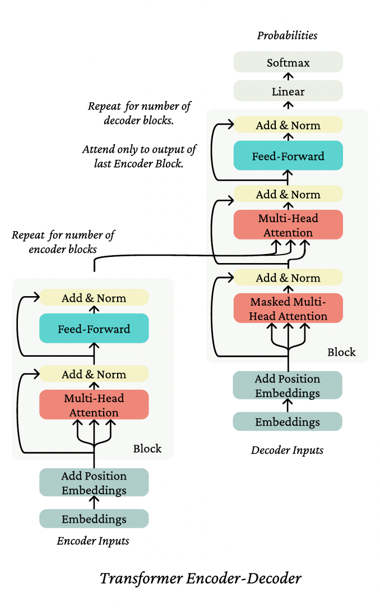

# Self-Attention and Transformers, a mathematical approach

## Notation and basics

Let $w_{1:n}$ be a sequence, where each $w_i \in V$, a finite vocabulary. We'll also overload $w_{1:n}$ to be a matrix of one-hot vectors, $w_{1:n} \in \mathbb{R}^{n \times |V|}$. We'll use $w \in V$ to represent an arbitrary vocabulary element, and $w_i \in V$ to pick out a specific indexed element of a sequence $w_{1:n}$.

We'll use the notation,

$$w_t \sim \text{softmax}(f(w_{1:t-1})),$$

to mean that under a model, $x_t$ "is drawn from" the probability distribution defined by the right-hand-side of the tilde, $\sim$. 

When we use the softmax function (as above), we'll use it without direct reference to the dimension being normalized over, and it should be interpreted as follows. If $A$ is a tensor of shape $\mathbb{R}^{\ell,d}$, the softmax is computed as follows:

$$\text{softmax}(A)_{i,j} = \frac{\exp A_{i,j}}{\sum_{j'=1}^{d} \exp A_{i,j'}},$$

for all $i \in 1, \ldots, \ell$, $j \in 1, \ldots, d$, and similarly for tensors of more than two axes. That is, if we had a tensor $B \in \mathbb{R}^{m,\ell,d}$, we would define the softmax over the last dimension, similarly. At the risk of being verbose, we'll write it out:

$$\text{softmax}(B)_{q,i,j} = \frac{\exp B_{q,i,j}}{\sum_{j'=1}^{d} \exp B_{q,i,j'}}.$$

In all of our methods, we'll assume an embedding matrix, $E \in \mathbb{R}^{d \times |V|}$, mapping from the vocabulary space to the hidden dimensionality $d$, written as $Ew \in \mathbb{R}^d$.

The embedding $Ew_i$ of a token in sequence $w_{1:n}$ is what's known as a non-contextual representation; despite $w_i$ appearing in a sequence, the representation $Ew_i$ is independent of context. Since we'll almost always be working on the embedded version of $w_{1:n}$, we'll let $x = Ew$, and $x_{1:n} = w_{1:n}E^\top \in \mathbb{R}^{n \times d}$. An overarching goal of the methods discussed in this note is to develop strong contextual representations of tokens; that is, a representation $h_i$ that represents $w_i$ but is a function of the entire sequence $x_{1:n}$ (or a prefix $x_{1:i}$, as in the case of language modeling).

## Problems with RNN

There were twofold issues with the recurrent neural network form, and they both had to do with the the dependence on the sequence index (often called the dependence on "time").

### Parallelization issues with dependence on the sequence index

Modern graphics processing units (GPUs) are excellent at crunching through a lot of simple operations (like addition) in parallel. For example, when we have a matrix $A \in \mathbb{R}^{n \times k}$ and a matrix $B \in \mathbb{R}^{k \times d}$, a GPU is just blazing fast at computing $AB \in \mathbb{R}^{n \times d}$. The constraint of the operations occurring in parallel, however, is crucial – when computing $AB$ the simplest way, we're performing a bunch of multiplies and then a bunch of sums, most of which don't depend on the output of each other. However, in a recurrent neural network, when we compute

$$h_2 = \sigma(Wh_1 + Ux_2),$$

we can't compute $h_2$ until we know the value of $h_1$, so we can write it out as

$$h_2 = \sigma(W\sigma(Wh_0 + Ux_1) + Ux_2).$$

Likewise if we wanted to compute $h_3$, we can't compute it until we know $h_2$, which we can't compute until we know $h_1$, etc. As the sequence gets longer, there is only so much we can parallelize the computation of the network on a GPU because of the number of serial dependencies.

### Linear interaction distance

A related issue with RNNs is the difficulty with which distant tokens in a sequence can interact with each other. By interact, we mean that the presence of one token (already observed in the past) gainfully affects the processing of another token.

## A minimal self-attention architecture

Attention, broadly construed, is a method for taking a query, and softly looking up information in a key-value store by picking the value(s) of the key(s) most like the query. By "picking" and "most like," we mean averaging overall values, putting more weight on those which correspond to the keys more like the query. In self-attention, we mean that we use the same elements to help us define the querys as we do the keys and values.

### The key-query-value self-attention mechanism

Consider a token $x_i$ in the sequence $x_{1:n}$. From it, we define a query $q_i = Qx_i$, for matrix $Q \in \mathbb{R}^{d \times d}$. Then, for each token in the sequence $x_j \in \{x_1, \ldots, x_n\}$, we define both a key and a value similarly, with two other weight matrices: $k_j = Kx_j$, and $v_j = Vx_j$ for $K \in \mathbb{R}^{d \times d}$ and $V \in \mathbb{R}^{d \times d}$.

Our contextual representation $h_i$ of $x_i$ is a linear combination (that is, a weighted sum) of the values of the sequence,

$$h_i = \sum_{j=1}^{n} \alpha_{ij}v_j,$$

where the weights, these $\alpha_{ij}$ control the strength of contribution of each $v_j$. Going back to our key-value store analogy, the $\alpha_{ij}$ softly selects what data to look up. We define these weights by computing the affinities between the keys and the query, $q_i^\top k_j$, and then computing the softmax over the sequence:

$$\alpha_{ij} = \frac{\exp(q_i^\top k_j)}{\sum_{j'=1}^{n} \exp(q_i^\top k_{j'})}.$$

Intuitively, what we've done by this operation is take our element $x_i$ and look in its own sequence $x_{1:n}$ to figure out what information (in an informal sense,) from what other tokens, should be used in representing $x_i$ in context. The use of matrices $K$, $Q$, $V$ intuitively allow us to use different views of the $x_i$ for the different roles of key, query, and value. We perform this operation to build $h_i$ for all $i \in \{1, \ldots, n\}$.

### Position representations

Consider the sequence *the oven cooked the bread so*. This is a different sequence than *the bread cooked the oven so*, as you might guess. The former sentence has us making delicious bread, and the latter we might interpret as the bread somehow breaking the oven. In a recurrent neural network, the order of the sequence defines the order of the rollout, so the two sequences have different representations. In the self-attention operation, there's no built-in notion of order. The self-attention operation has no built-in notion of the sequence order.

To see this, let's take a look at self-attention on this sequence. We have a set of vectors $x_{1:n}$ for *the oven cooked the bread so*, which we can write as

$$x_{1:n} = [x_{\text{the}}; x_{\text{oven}}; x_{\text{cooked}}; x_{\text{the}}; x_{\text{bread}}; x_{\text{so}}] \in \mathbb{R}^{6 \times d}.$$

As an example, consider performing self-attention to represent the word *so* in context. The weights over the context are as follows, recalling that $q_i = Qx_i$ for all words, and $k_i = Kx_i$ likewise:

$$\alpha_{\text{so}} = \text{softmax}\left([q_{\text{so}}^\top k_{\text{the}}; q_{\text{so}}^\top k_{\text{oven}}; q_{\text{so}}^\top k_{\text{cooked}}; q_{\text{so}}^\top k_{\text{the}}; q_{\text{so}}^\top k_{\text{bread}}; q_{\text{so}}^\top k_{\text{so}}]\right).$$

So, the weight $\alpha_{\text{so},0}$, the amount that we look up the first word, (by writing out the softmax) is,

$$\alpha_{\text{so},0} = \frac{\exp(q_{\text{so}}^\top k_{\text{the}})}{\exp(q_{\text{so}}^\top k_{\text{the}}) + \cdots + \exp(q_{\text{so}}^\top k_{\text{bread}})}.$$

So, $\alpha \in \mathbb{R}^6$ are our weights, and we compute the weighted average with these weights to compute $h_{\text{so}}$.

For the reordered sentence *the bread cooked the oven so*, note that $\alpha_{\text{so},0}$ is identical. The numerator hasn't changed, and the denominator hasn't changed; we've just rearranged terms in the sum. Likewise for $\alpha_{\text{so},\text{bread}}$ and $\alpha_{\text{so},\text{oven}}$, you can compute that they too are identical independent of the ordering of the sequence. This all comes back down to the two facts that (1) the representation of $x$ is not position-dependent; it's just $Ew$ for whatever word $w$, and (2) there's no dependence on position in the self-attention operations.

#### Position representation through learned embeddings

To represent position in self-attention, you either need to (1) use vectors that are already position-dependent as inputs, or (2) change the self-attention operation itself. One common solution is a simple implementation of (1). We posit a new parameter matrix, $P \in \mathbb{R}^{N \times d}$, where $N$ is the maximum length of any sequence that your model will be able to process.

We then simply add embedded representation of the position of a word to its word embedding:

$$\tilde{x}_i = P_i + x_i,$$

and perform self-attention as we otherwise would. Now, the self-attention operation can use the embedding $P_i$ to look at the word at position $i$ differently than if that word were at position $j$.

### Elementwise nonlinearity

Imagine if we were to stack self-attention layers. Would this be sufficient for a replacement for stacked LSTM layers? Intuitively, there's one thing that's missing: the elementwise nonlinearities that we've come to expect in standard deep learning architectures. In fact, if we stack two self-attention layers, we get something that looks a lot like a single self-attention layer:

$$o_i = \sum_{j=1}^{n} \alpha_{ij}V^{(2)}\left(\sum_{k=1}^{n} \alpha_{jk}V^{(1)}x_k\right)$$

$$= \sum_{k=1}^{n}\left(\alpha_{jk}\sum_{j=1}^{n}\alpha_{ij}\right)V^{(2)}V^{(1)}x_k$$

$$= \sum_{k=1}^{n} \alpha^*_{ik}V^*x_k,$$

where $\alpha^*_{ik} = \alpha_{jk}\sum_{j=1}^{n}\alpha_{ij}$, and $V^* = V^{(2)}V^{(1)}$. So, this is just a linear combination of a linear transformation of the input, much like a single layer of self-attention! Is this good enough?

In practice, after a layer of self-attention, it's common to apply feed-forward network independently to each word representation:

$$h_{\text{FF}} = W_2 \text{ReLU}(W_1h_{\text{self-attention}} + b_1) + b_2,$$

where often, $W_1 \in \mathbb{R}^{5d \times d}$, and $W_2 \in \mathbb{R}^{d \times 5d}$. That is, the hidden dimension of the feed-forward network is substantially larger than the hidden dimension of the network, $d$—this is done because this matrix multiply is an efficiently parallelizable operation, so it's an efficient place to put a lot of computation and parameters.

### Future masking

When performing language modeling like we've seen in this course (often called autoregressive modeling), we predict a word given all words so far:

$$w_t \sim \text{softmax}(f(w_{1:t-1})),$$

where $f$ is function to map a sequence to a vector in $\mathbb{R}^{|V|}$.

One crucial aspect of this process is that we can't look at the future when predicting it—otherwise the problem becomes trivial. This idea is built-in to unidirectional RNNs. If we want to use an RNN for the function $f$, we can use the hidden state for word $w_{t-1}$:

$$w_t \sim \text{softmax}(h_{t-1}E)$$

$$h_{t-1} = \sigma(Wh_{t-2} + Ux_{t-1}),$$

and by the rollout of the RNN, we haven't looked at the future. (In this case, the future is all the words $w_t, \ldots, w_n$.)

In a Transformer, there's nothing explicit in the self-attention weight $\alpha$ that says not to look at indices $j > i$ when representing token $i$. In practice, we enforce this constraint simply adding a large negative constant to the input to the softmax (or equivalently, setting $\alpha_{ij} = 0$ where $j > i$.)

$$\alpha_{ij,\text{masked}} = \begin{cases} \alpha_{ij} & j \leq i \\ 0 & \text{otherwise} \end{cases}$$

## The Transformer

The Transformer is an architecture based on self-attention that consists of stacked Blocks, each of which contains self-attention and feedforward layers, and a few other components.

### Multi-head Self-Attention

Intuitively, a single call of self-attention is best at picking out a single value (on average) from the input value set. It does so softly, by averaging over all of the values, but it requires a balancing game in the key-query dot products in order to carefully average two or more things.

What we'll present now, multi-head self-attention, intuitively applies self-attention multiple times at once, each with different key, query, and value transformations of the same input, and then combines the outputs.

For an integer number of heads $k$, we define matrices $K^{(\ell)}$, $Q^{(\ell)}$, $V^{(\ell)} \in \mathbb{R}^{d \times d/k}$ for $\ell$ in $\{1, \ldots, k\}$. We'll see why we have the dimensionality reduction to $d/k$ soon. These are the key, query, and value matrices for each head. Correspondingly, we get keys, queries, and values $k^{(\ell)}_{1:n}$, $q^{(\ell)}_{1:n}$, $v^{(\ell)}_{1:n}$, as in single-head self-attention.

We then perform self-attention with each head:

$$h^{(\ell)}_i = \sum_{j=1}^{n} \alpha^{(\ell)}_{ij} v^{(\ell)}_j$$

$$\alpha^{(\ell)}_{ij} = \frac{\exp(q^{(\ell)\top}_i k^{(\ell)}_j)}{\sum_{j'=1}^{n} \exp(q^{(\ell)\top}_i k^{(\ell)}_{j'})}$$

Note that the output $h^{(\ell)}_i$ of each head is in reduced dimension $d/k$.

Finally, we define the output of multi-head self-attention as a linear transformation of the concatenation of the head outputs, letting $O \in \mathbb{R}^{d \times d}$:

$$h_i = O[h^{(1)}_i; \cdots; h^{(k)}_i],$$

where we concatenate the head outputs each of dimensionality $d \times d/k$ at their second axis, such that their concatenation has dimension $d \times d$.

To understand why we have the reduced dimension of each head output, it's instructive to get a bit closer to how multi-head self-attention is implemented in code. In practice, multi-head self-attention is no more expensive than single-head due to the low-rankness of the transformations we apply.

For a single head, recall that $x_{1:n}$ is a matrix in $\mathbb{R}^{n \times d}$. Then we can compute our value vectors as a matrix as $x_{1:n}V$, and likewise our keys and queries $x_{1:n}K$ and $x_{1:n}Q$, all matrices in $\mathbb{R}^{n \times d}$. To compute self-attention, we can compute our weights in matrix operations:

$$\alpha = \text{softmax}(x_{1:n}QK^\top x_{1:n}^\top) \in \mathbb{R}^{n \times n}$$

and then compute the self-attention operation for all $x_{1:n}$ via:

$$h_{1:n} = \text{softmax}(x_{1:n}QK^\top x_{1:n}^\top)x_{1:n}V \in \mathbb{R}^{n \times d}.$$

Here's a diagram showing the matrix ops:

When we perform multi-head self-attention in this matrix form, we first reshape $x_{1:n}Q$, $x_{1:n}K$, and $x_{1:n}V$ each into a matrix of shape $\mathbb{R}^{n,k,d/k}$, splitting the model dimensionality into two axes, for the number of heads and the number of dimensions per head. We can then transpose the matrices to $\mathbb{R}^{k,n,d/k}$, which intuitively should look like $k$ sequences of length $n$ and dimensionality $d/k$. This allows us to perform the batched softmax operation in parallel across the heads, using the number of heads kind of like a batch axis (and indeed in practice we'll also have a separate batch axis.) So, the total computation (except the last linear transformation to combine the heads) is the same, just distributed across the (each lower-rank) heads. Here's a diagram like the single-head diagram, demonstrating how the multi-head operation ends up much like the single-head operation.

### Layer Norm

One important learning aid in Transformers is layer normalization. The intuition of layer norm is to reduce uninformative variation in the activations at a layer, providing a more stable input to the next layer.

### Residual Connections

Residual connections simply add the input of a layer to the output of that layer:

$$f_{\text{residual}}(h_{1:n}) = f(h_{1:n}) + h_{1:n},$$

the intuition being that (1) the gradient flow of the identity function is great (the local gradient is 1 everywhere!) so the connection allows for learning much deeper networks, and (2) it is easier to learn the difference of a function from the identity function than it is to learn the function from scratch. As simple as these seem, they're massively useful in deep learning, not just in Transformers!

#### Add & Norm

In the Transformer diagrams you'll see the application of layer normalization and residual connection are often combined in a single visual block labeled Add & Norm. Such a layer might look like:

$$h_{\text{pre-norm}} = f(\text{LN}(h)) + h,$$

where $f$ is either a feed-forward operation or a self-attention operation, (this is known as pre-normalization), or like:

$$h_{\text{post-norm}} = \text{LN}(f(h) + h),$$

which is known as post-normalization. It turns out that the gradients of pre-normalization are much better at initialization, leading to much faster training [Xiong et al., 2020].

### Attention logit scaling

Another trick introduced in [Vaswani et al., 2017] they dub scaled dot product attention. The dot product part comes from the fact that we're computing dot products $q_i^\top k_j$. The intuition of scaling is that, when the dimensionality $d$ of the vectors we're dotting grows large, the dot product of even random vectors (e.g., at initialization) grows roughly as $\sqrt{d}$. So, we normalize the dot products by $\sqrt{d}$ to stop this scaling:

$$\alpha = \text{softmax}\left(\frac{x_{1:n}QK^\top x_{1:n}^\top}{\sqrt{d}}\right) \in \mathbb{R}^{n \times n}$$

### Transformer Encoder

A Transformer Encoder takes a single sequence $w_{1:n}$, and performs no future masking. It embeds the sequence with $E$ to make $x_{1:n}$, adds the position representation, and then applies a stack of independently parameterized Encoder Blocks, each of which consisting of (1) multi-head attention and Add & Norm, and (2) feed-forward and Add & Norm. So, the output of each Block is the input to the next.

A Transformer Encoder is great in contexts where you aren't trying to generate text autoregressively (there's no masking in the encoder so each position index can see the whole sequence,) and want strong representations for the whole sequence (again, possible because even the first token can see the whole future of the sequence when building its representation).

### Transformer Decoder

To build a Transformer autoregressive language model, one uses a Transformer Decoder. These differ from Transformer Encoders simply by using future masking at each application of self-attention. This ensures that the informational constraint (no cheating by looking at the future!) holds throughout the architecture. Famous examples of this are GPT-2 [Radford et al., 2019], GPT-3 [Brown et al., 2020] and BLOOM [Workshop et al., 2022].

### Transformer Encoder-Decoder

A Transformer encoder-decoder takes as input two sequences. The first sequence $x_{1:n}$ is passed through a Transformer Encoder to build contextual representations. The second sequence $y_{1:m}$ is encoded through a modified Transformer Decoder architecture in which cross-attention (which we haven't yet defined!) is applied from the encoded representation of $y_{1:m}$ to the output of the Encoder. So, let's take a quick detour to discuss cross-attention; it's not too different from what we've already seen.

#### Cross-Attention

Cross-attention uses one sequence to define the keys and values of self-attention, and another sequence to define the queries. You might think, hey wait, isn't that just what attention always was before we got into this self-attention business? Yeah, pretty much. So if

$$h^{(x)}_{1:n} = \text{TransformerEncoder}(w_{1:n}),$$

and we have some intermediate representation $h^{(y)}$ of sequence $y_{1:m}$, then we let

$$q_i = Qh^{(y)}_i \quad i \in \{1, \ldots, m\}$$

$$k_j = Kh^{(x)}_j \quad j \in \{1, \ldots, n\}$$

$$v_j = Vh^{(x)}_j \quad j \in \{1, \ldots, n\},$$

and compute the attention on $q$, $k$, $v$ as we defined for self-attention. Note that in the Transformer Encoder-Decoder, cross-attention always applies to the output of the Transformer encoder.

An encoder-decoder is used when we'd like bidirectional context on something (like an article to summarize) to build strong representations (i.e., each token can attend to all other tokens), but then generate an output according to an autoregressive decomposition as we can with a decoder. While such an architecture has been found to provide better performance than decoder-only models at modest scale [Raffel et al., 2020], it involves splitting parameters between encoder and decoder, and most of the largest Transformers are decoder-only.