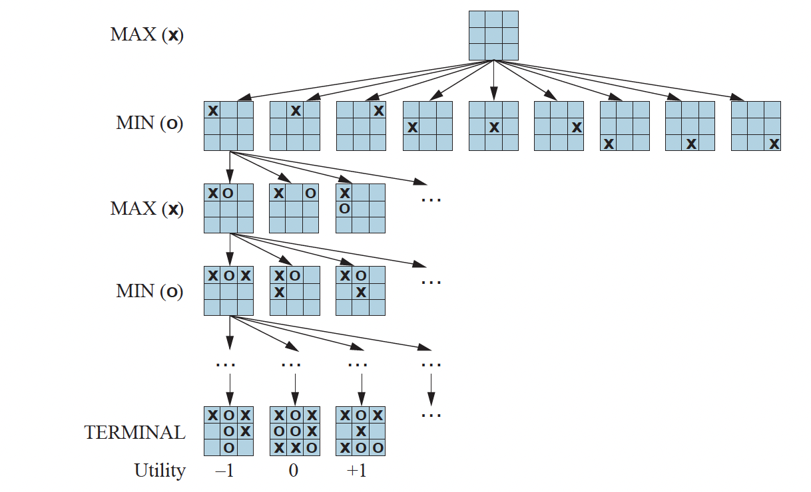
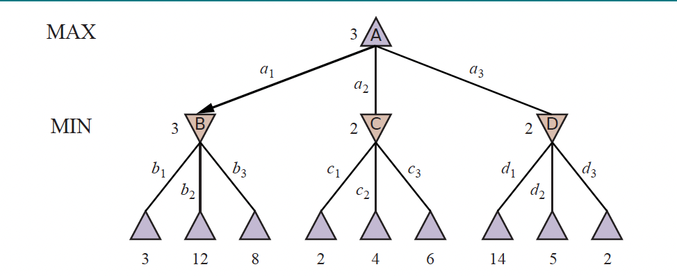
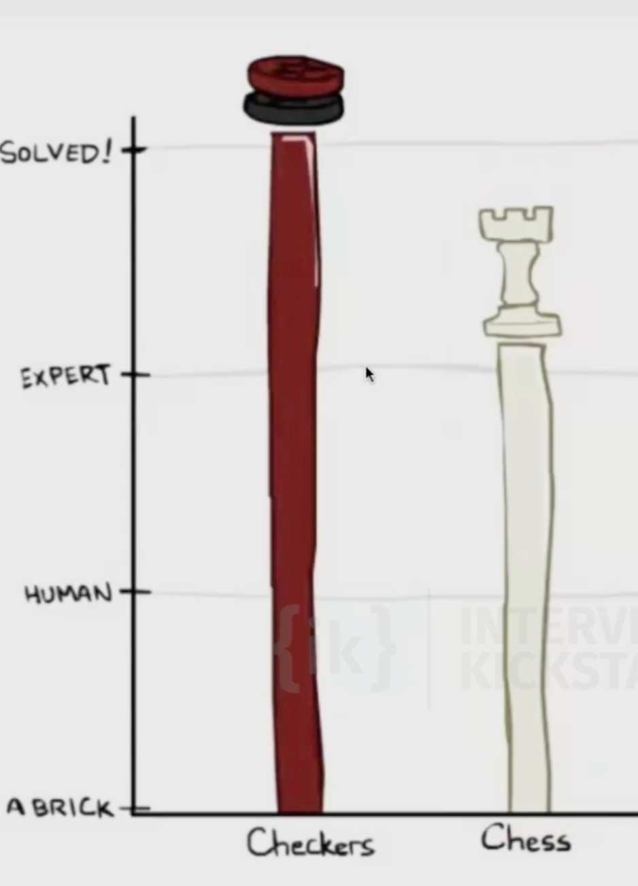
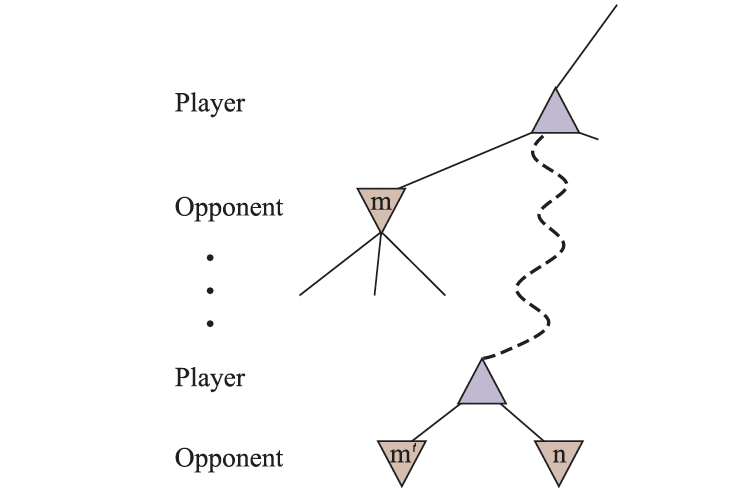
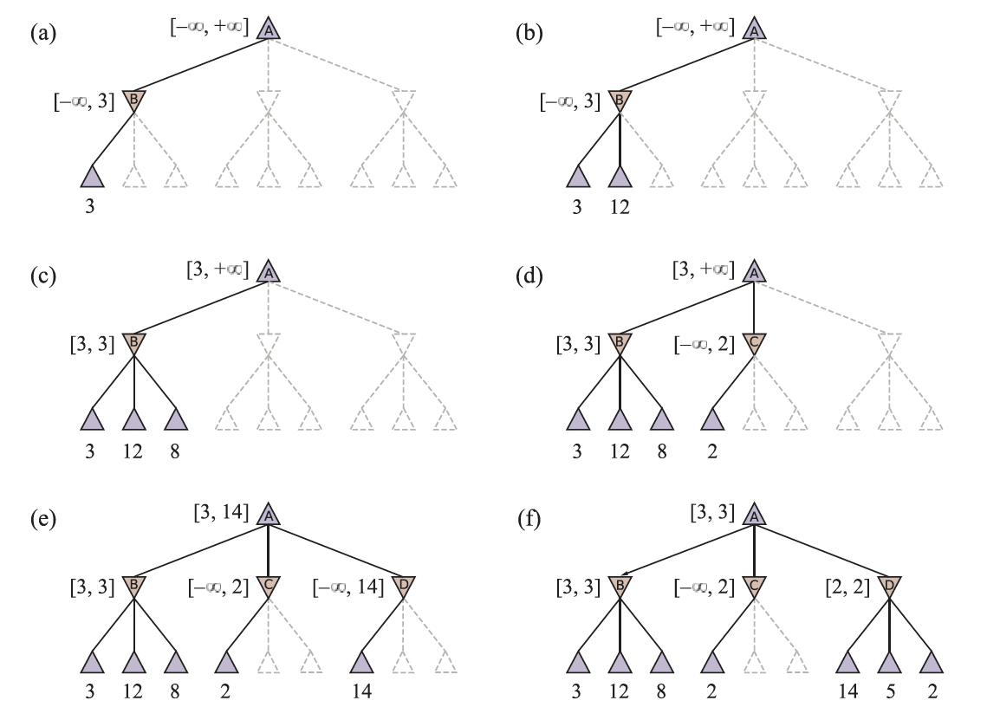
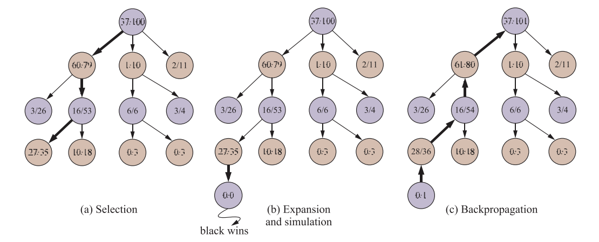

# Adversarial search and games

So far, our problem formulations and search algorithms have assumed a **single** agent: one rational agent with a goal, percepts, and actions, cast as state-space search (see [Rational agents and problem formulation](solving_problems_by_searching.md#rational-agents-and-problem-formulation)).

Let's talk about competitive environments, in which two or more agents have conflicting goals, giving rise to adversarial search problems.

## Game Theory

There are at least three stances we can take towards multi-agent environments. 

The first stance, appropriate when there are a very large number of agents, is to consider them in the aggregate as an **economy**, allowing us to do things like predict that increasing demand will cause prices to rise, without having to predict the action of any individual agent.

Second, we could consider adversarial agents as just a part of the environment— a part that makes the environment nondeterministic. But if we model the adversaries in the same way that, say, rain sometimes falls and sometimes doesn’t, we miss the idea that our adversaries are actively trying to defeat us, whereas the rain supposedly has no such intention.

The third stance is to explicitly model the adversarial agents with the techniques of adversarial game-tree search.

### Two-player zero-sum games

The games most commonly studied within AI (such as chess and Go) are what game theorists call **deterministic, two-player, turn-taking, perfect information, zero-sum games**. “Perfect information” is a synonym for “fully observable,” and “zero-sum” means that what is good for one player is just as bad for the other: there is no “win-win” outcome. For games we often use the term move as a synonym for “action” and position as a synonym for “state.”

We will call our two players MAX and MIN.

We define the complete **game tree** as a search tree that follows every sequence of moves all the way to a terminal state. The game tree may be infinite if the state space itself is unbounded or if the rules of the game allow for infinitely repeating positions.

For tic-tac-toe the game tree is relatively small— fewer than $9!=362,880$ terminal nodes (with only 5,478 distinct states). But for chess there are over $1040$ nodes, so the game tree is best thought of as a theoretical construct that we cannot realize in the physical world.

A **utility function** (also called an objective function or payoff function), defines the final numeric value to player $p$ when the game ends in terminal state $s$.

Below is a figure of a (partial) game tree for the game of tic-tac-toe. The top node is the initial state, and MAX moves first, placing an X in an empty square. We show part of the tree, giving alternating moves by MIN (O) and MAX (X), until we eventually reach terminal states, which can be assigned utilities according to the rules of the game.



## Optimal Decisions in Games

### The minimax search algorithm

Consider the trivial game in the figure below. The possible moves for MAX at the root node are labeled $a1$, $a2$, and $a3$. The possible replies to $a1$ for MIN are $b1$, $b2$, $b3$, and so on. This particular game ends after one move each by MAX and MIN. 

**Note:** In some games, the word “move” means that both players have taken an action; therefore the word ply is used to unambiguously mean one move by one player, bringing us one level deeper in the game tree.

The utilities of the terminal states in this game range from $2$ to $14$.



Given a game tree, the optimal strategy can be determined by working out the **minimax value** of each state $s$, written $\text{MINIMAX}(s)$.

For a terminal state, the minimax value is just its utility. In a nonterminal state, MAX prefers to move to a successor of maximum value, while MIN prefers a successor of minimum value:

$$\text{MINIMAX}(s) = \begin{cases} \text{UTILITY}(s) & \text{if IS-TERMINAL}(s) \\ \displaystyle\max_{a \in \text{Actions}(s)} \text{MINIMAX}(\text{RESULT}(s, a)) & \text{if TO-MOVE}(s) = \text{MAX} \\ \displaystyle\min_{a \in \text{Actions}(s)} \text{MINIMAX}(\text{RESULT}(s, a)) & \text{if TO-MOVE}(s) = \text{MIN} \end{cases}$$

For the game tree above, label the nonterminal states $A$ (root), $B$, $C$, $D$ (the three MIN nodes), with actions

$$\text{Actions}(A) = \{a_1, a_2, a_3\}, \quad \text{Actions}(B) = \{b_1, b_2, b_3\}, \quad \text{Actions}(C) = \{c_1, c_2, c_3\}, \quad \text{Actions}(D) = \{d_1, d_2, d_3\}.$$

So $\text{RESULT}(A, a_1) = B$, $\text{RESULT}(A, a_2) = C$, $\text{RESULT}(A, a_3) = D$, and $B, C, D$ each have three terminal successors via $b_i$, $c_i$, $d_i$.

Apply $\text{MINIMAX}$ bottom-up. The terminals get their values from $\text{UTILITY}$. For MIN node $B$, the children have values $3, 12, 8$, so

$$\text{MINIMAX}(B) = \min(3, 12, 8) = 3.$$

Similarly, $\text{MINIMAX}(C) = \text{MINIMAX}(D) = 2$. At the MAX root,

$$\text{MINIMAX}(A) = \max\bigl(\text{MINIMAX}(B),\, \text{MINIMAX}(C),\, \text{MINIMAX}(D)\bigr) = \max(3, 2, 2) = 3.$$

This is a therefore a **recursive definition**. $\text{MINIMAX}(s)$ for a nonterminal state is defined in terms of $\text{MINIMAX}$ on its children $\text{RESULT}(s, a)$. The recursion bottoms out at terminal states, where $\text{IS-TERMINAL}(s)$ is true and the value is given directly by $\text{UTILITY}(s)$. Computing $\text{MINIMAX}$ at the root therefore unfolds into a bottom-up pass over the game tree.

This also identifies the **minimax decision** at the root: action $a_1$ is the optimal choice for MAX, because it leads to the successor with the highest minimax value.

The minimax algorithm performs a **complete depth-first exploration** of the game tree. Let $b$ be the branching factor (legal moves at each node) and $m$ be the maximum depth of the tree. Then:

- **Time complexity:** $O(b^m)$.
- **Space complexity:** $O(b\,m)$ if all actions are generated at once, or $O(m)$ if actions are generated one at a time.

The exponential time makes $\text{MINIMAX}$ impractical for complex games. Chess, for example, has $b \approx 35$ and average game depth around $80$ ply, giving roughly $35^{80} \approx 10^{123}$ states— far beyond what we can search. $\text{MINIMAX}$ is still useful as the mathematical basis for game analysis; practical algorithms come from **approximating** it in various ways.

!!! note "Dynamic programming on the state DAG"
    Different move sequences often reach the **same** state—i n chess this is called a *transposition*: two move orders leading to the identical board. So the underlying state graph is generally a **DAG**, and a tree-style search of size $O(b^m)$ revisits the same state many times.

    Let $|S|$ be the number of **distinct reachable states** in the DAG. Treating $\text{MINIMAX}$ as a recursion over states, there are exactly $|S|$ unique sub-problems, and each requires $O(b)$ work to take a $\max$ or $\min$ over its $b$ children's already-computed values. If we **memoize** $\text{MINIMAX}(s)$ the first time we compute it and look it up thereafter, computing the value for any state is constant-time once its children are known, and the total work is

    $$O(b \cdot |S|)$$

    instead of $O(b^m)$. This is **dynamic programming** applied to the game-tree DAG: each unique sub-problem is solved exactly once, and subsequent calls are $O(1)$ lookups.

    Many games have $|S| \ll b^m$. For tic-tac-toe, $|S| = 5{,}478$ distinct states versus a search tree with up to $9! = 362{,}880$ leaves, where DP turns an exponential into something tractable.

### Solved games and chess engines

Once $\text{MINIMAX}(s_0)$ is computed at the root $s_0$, the game's outcome under optimal play is no longer uncertain. We then say the game is **solved**: every state has a known minimax value, and the optimal action from any reachable position is determined.

**Tic-tac-toe** is solved. With both players playing optimally, every game ends in a **draw**. **Checkers** has also been [solved](https://www.science.org/doi/10.1126/science.1144079) (Schaeffer et al., 2007): perfect play by both sides ends in a draw.

**Chess** is **not** solved. The state space is far too large to compute $\text{MINIMAX}$ at the root. Chess has $b \approx 35$ and games run $\sim 80$ ply, so a full search would touch roughly $10^{123}$ states.



State-of-the-art engines such as **Stockfish** therefore approximate $\text{MINIMAX}$ rather than compute it exactly. Stockfish is a hybrid of two ideas:

- **Search:** A heavily optimized minimax search over the game tree, assuming both players play their best moves. Pruning techniques like **alpha-beta** (covered later) reduce the effective branching factor without changing the result.
- **Evaluation:** When the search stops at a non-terminal position, the engine still needs a value for it. Historically this was a hand-coded function (material count, pawn structure, king safety, mobility, etc.). Modern Stockfish uses **NNUE** (Efficiently Updatable Neural Network)— a small neural network that can be re-evaluated incrementally as positions change (to score the leaves of the truncated search tree).

So Stockfish replaces the missing $\text{UTILITY}$ at non-terminal leaves with a learned evaluation, and replaces the full minimax recursion with a pruned, depth-limited search. The shape of the algorithm ($\max$ for the side to move, $\min$ for the opponent) is exactly $\text{MINIMAX}$ from the previous section.

!!! note "Chess as the *Drosophila* of AI"
    The biologist's fruit fly, *Drosophila melanogaster*, became a standard **model organism**: simple enough to experiment on cheaply, yet rich enough that what we learn transfers to harder problems. The Russian mathematician Alexander Kronrod famously called **chess the *Drosophila* of artificial intelligence**: a single, well-defined testbed on which to develop and measure search, evaluation, and learning, with results that generalize to other domains.

    John McCarthy cautioned that over-optimizing for chess can yield engine-specific tricks rather than general intelligence (much as over-studying the fruit fly need not explain all of biology). Even so, chess and its successors (Go for AlphaGo, Atari and StarCraft for deep RL) remain the classic illustration of using a constrained game as a laboratory for general AI techniques.

### Alpha–Beta Pruning

Alpha–beta pruning applies to trees of any depth, and it can often prune **entire subtrees** rather than just individual leaves. The general principle: consider a node $n$ somewhere in the tree that the current player can choose to move to. If that player has a **better choice**— either at the same level (some sibling $m'$, as shown in the figure below) or anywhere higher up in the tree ($m$ shown in the figure below), then the player will never actually move to $n$. So once we have examined enough of $n$'s descendants to establish that such a better alternative exists, we can stop exploring $n$ and **prune** it entirely.



Let us trace the calculation on the same game tree from [Optimal Decisions in Games](#optimal-decisions-in-games), with root $A$ (MAX) and children $B, C, D$ (MIN). At each stage we track a **range** of possible values for each node, narrowing it as we see more leaves.

**(a)** The first leaf below $B$ has value $3$. Since $B$ is a MIN node, its value is **at most** $3$: $\text{MINIMAX}(B) \le 3$.

**(b)** The second leaf below $B$ has value $12$. MIN would avoid this move, so $B$ is still at most $3$.

**(c)** The third leaf below $B$ has value $8$. We have now seen all of $B$'s successors, so its value is **exactly** $\text{MINIMAX}(B) = \min(3, 12, 8) = 3$. Because MAX has a choice worth $3$ at the root, we can already infer $\text{MINIMAX}(A) \ge 3$.

**(d)** The first leaf below $C$ has value $2$. Since $C$ is a MIN node, $\text{MINIMAX}(C) \le 2$. But we already know $B$ is worth $3$, so MAX would never choose $C$. There is no point examining $C$'s remaining successors. We **prune** them. This is alpha–beta pruning in action.

**(e)** The first leaf below $D$ has value $14$, so $\text{MINIMAX}(D) \le 14$. This is still above MAX's current best alternative ($3$), so we must keep exploring $D$. Note we now have bounds on every successor of the root, so $\text{MINIMAX}(A) \le 14$ as well.

**(f)** The second successor of $D$ is worth $5$ (still above $3$, keep going); the third is worth $2$, so $\text{MINIMAX}(D) = \min(14, 5, 2) = 2$. MAX's decision at the root is therefore to move to $B$, for a value of $\text{MINIMAX}(A) = \max(3, 2, 2) = 3$.



The two bounds we carried around in the trace (MAX's best choice so far and MIN's best choice so far) are exactly the parameters $\alpha$ and $\beta$ that give the algorithm its name:

- $\alpha$ = the value of the best (highest) choice found so far for **MAX** along the path to the root. It only ever increases.
- $\beta$ = the value of the best (lowest) choice found so far for **MIN** along the path to the root. It only ever decreases.

Here is a recursive, top-down implementation that threads $\alpha$ and $\beta$ down the tree.

```python
import math

def alpha_beta(node, is_max, alpha=-math.inf, beta=math.inf):
    """Return the minimax value of `node`, pruning with alpha-beta bounds.

    - node: either a terminal value (int/float) or a list of child nodes.
    - is_max: True if it is MAX's turn to move at this node, else MIN's.
    - alpha: best value MAX can guarantee so far (along the path to the root).
    - beta:  best value MIN can guarantee so far (along the path to the root).
    """
    # Terminal node: its value is given directly by UTILITY.
    if not isinstance(node, list):
        return node

    if is_max:
        # MAX builds a rising lowerbound on this node's value.
        lowerbound = -math.inf
        for child in node:
            child_value = alpha_beta(child, False, alpha, beta)
            if child_value > lowerbound:
                lowerbound = child_value
            # alpha tracks MAX's best guaranteed value along the path.
            if lowerbound > alpha:
                alpha = lowerbound
            # Prune: compare the lowerbound against beta. 
            # A MIN ancestor would avoid this node, so we prune.
            if lowerbound >= beta:
                break
        return lowerbound
    else:
        # MIN builds a falling upperbound on this node's value.
        upperbound = math.inf
        for child in node:
            child_value = alpha_beta(child, True, alpha, beta)
            if child_value < upperbound:
                upperbound = child_value
            # beta tracks MIN's best guaranteed value along the path.
            if upperbound < beta:
                beta = upperbound
            # Prune: compare the upperbound against alpha.
            # A MAX ancestor would avoid this node, so we prune.
            if upperbound <= alpha:
                break
        return upperbound
```

!!! note "Pruned nodes do not get exact minimax values"
    Once the algorithm completes, the value returned for the **root** is exactly its true $\text{MINIMAX}$ value, but the values computed for the **other** nodes are no longer guaranteed to be accurate. When a node is pruned, we stop after seeing just enough children to know it cannot affect the decision, so we return a **bound** (the partial `lowerbound` or `upperbound`) rather than its finalized minimax value. Pruning thus leaves many nodes in the game tree with provisional scores, not exact ones.

## Stochastic Games

Stochastic games bring us a little closer to the unpredictability of real life by including a random element, such as the throwing of dice.

### Chance nodes in minimax game trees

In a deterministic two-player game, every node in the game tree belongs to either MAX or MIN. In a stochastic game, there is a third type: a **chance node**, representing a random event (e.g. a dice roll, a card draw, or a coin flip) whose outcome is not controlled by either player.

**How chance nodes fit into the tree:** At a chance node, the branches correspond to the possible outcomes of the random event. Each branch is labeled with the probability $p_i$ of that outcome (with $\sum_i p_i = 1$). The child reached by branch $i$ is an ordinary MAX or MIN node, and play continues from there as usual.

A typical turn in backgammon, a game which has two dice, for example, proceeds as:

$$\text{MAX node} \;\to\; \text{chance node (dice roll)} \;\to\; \text{MIN node} \;\to\; \text{chance node} \;\to\; \cdots$$

### Expectiminimax

To handle chance nodes, the minimax recursion is extended to **expectiminimax**. The idea is simple: MAX and MIN nodes are evaluated exactly as before, but a chance node is assigned the **expected value** of its children— a probability-weighted average over all possible outcomes. The algorithm backs these values up the tree in the usual bottom-up fashion, so MAX ultimately picks the action that leads to the chance node with the highest expected value.

**Example:** Consider a small game tree. The root is a MAX node. Its two children are chance nodes. The left chance node has two outcomes— "high" (probability $0.5$, leading to a leaf worth $10$) and "low" (probability $0.5$, leading to a leaf worth $2$). The right chance node has outcomes "high" ($0.9$, leaf $4$) and "low" ($0.1$, leaf $-5$).

Computing bottom-up:

$$\text{EXPECTIMINIMAX}(\text{chance left}) = 0.5 \times 10 + 0.5 \times 2 = 6$$

$$\text{EXPECTIMINIMAX}(\text{chance right}) = 0.9 \times 4 + 0.1 \times (-5) = 3.6 - 0.5 = 3.1$$

$$\text{EXPECTIMINIMAX}(\text{root}) = \max(6,\ 3.1) = 6$$

MAX should therefore take the left action. The key insight is that MAX cannot control what the dice show— it can only choose which chance node to enter, and it prefers the one with the higher expected value.

## Monte Carlo Tree Search

### Limits of alpha–beta search: the game of Go

The game of Go illustrates two fundamental weaknesses of heuristic alpha–beta tree search.

**Branching factor:** Go is played on a 19×19 board, so at the very first move there are 361 legal placements. Even with alpha–beta pruning (which in the best case reduces the effective branching factor from $b$ to roughly $\sqrt{b}$) the search can realistically reach only about 4 or 5 ply before the exponential cost becomes intractable. To put that in perspective, a 4-ply search means each player has looked only 2 moves ahead; chess engines, operating on a board with a branching factor of ~35 rather than ~361, routinely search 10–20 ply deeper. The problem is not the pruning strategy itself but the sheer size of the branching factor. No amount of clever ordering or pruning can overcome an explosion that starts at 361 and compounds with every additional ply.

**Evaluation function:** Even if depth were not an issue, alpha–beta search still requires a heuristic to score non-terminal positions. In chess, material count (summing piece values) is a reliable proxy for advantage— it is wrong in edge cases but right often enough to guide search. In Go, material value is almost meaningless. A stone's worth depends entirely on how it connects to neighboring groups, and most positions remain genuinely ambiguous until late in the endgame when the board finally settles. Writing a hand-crafted evaluation function that meaningfully distinguishes a strong Go position from a weak one has proven extremely difficult.

In response to both challenges, modern Go programs abandoned alpha–beta search and instead use **Monte Carlo Tree Search (MCTS)**, a strategy that sidesteps the need for an explicit evaluation function by running many random (or learned) playouts from each position and estimating value from the outcomes.

### Basic MCTS

The basic MCTS strategy does not use a heuristic evaluation function. Instead, the value of a state is estimated as the average utility over a number of simulations of complete games starting from that state. A simulation (also called a **playout** or **rollout**) chooses moves first for one player, then for the other, repeating until a terminal position is reached. For games in which the only outcomes are a win or a loss, "average utility" is the same as "win percentage."

### The four phases of MCTS

Each iteration of MCTS consists of four steps.

**Selection:** Starting at the root of the search tree, we choose a move guided by something called the **selection policy** (descibed later in this page), move to the successor node, and repeat down the tree until we reach a leaf (leaf of the search tree). As an example, consider a search tree whose root represents a state where white has just moved, and white has won 37 out of 100 playouts so far. The selection policy might choose a black move leading to a node where black has won 60/79 playouts— the best win percentage among all available moves, making it the exploitative choice. It would also be reasonable to instead select a node with only 2/11 playouts: with so few samples its value estimate carries high uncertainty, and more information might reveal it to be the stronger move. Selection continues down to a leaf, say one marked 27/35.

**Expansion:** We grow the search tree by generating a new child of the selected leaf node, initially marked 0/0. Some implementations generate more than one child in this step.

**Simulation:** We run a playout from the newly generated child, choosing moves for both players according to something called the **playout policy** (descibed later in this page). These moves are not recorded in the search tree— only the final outcome matters. Suppose the playout results in a win for black.

**Back-propagation:** The result is propagated back up through all nodes on the path to the root. Because black won, black nodes are incremented in both wins and total playouts (e.g. 27/35 becomes 28/36 and 60/79 becomes 61/80). Because white lost, white nodes are incremented in total playouts only (e.g. 16/53 becomes 16/54, and the root 37/100 becomes 37/101).

These four steps repeat— select, expand, simulate, back-propagate— until the computational budget is exhausted, at which point the move with the highest visit count (or win percentage) from the root is chosen.



```
function MONTE-CARLO-TREE-SEARCH(state) returns an action
    tree ← NODE(state)
    while IS-TIME-REMAINING() do
        leaf   ← SELECT(tree)
        child  ← EXPAND(leaf)
        result ← SIMULATE(child)
        BACK-PROPAGATE(result, child)
    return the move in ACTIONS(state) whose node has the highest number of playouts
```

We repeat these four steps either for a set number of iterations or until the allotted time has expired, then return the move with the highest number of playouts.

### Selection policy vs. playout policy

MCTS uses two distinct policies, each operating in a different part of the algorithm.

The **selection policy** operates *inside the search tree*— the part of the game tree that has already been visited and built up over previous iterations. At each internal node, it decides which child to descend to, trading off between nodes that have been explored rarely (uncertain value) and nodes that have performed well so far (high estimated value). UCT/UCB1, described below, is the standard selection policy. Because these nodes are revisited many times and their visit counts feed back into future selections, the selection policy needs to be statistically principled.

The **playout policy** operates *outside the search tree*— once the expansion step creates a new leaf, the playout policy takes over and plays moves all the way to a terminal state. These moves are never added to the tree; only the final outcome is recorded and back-propagated. Because a playout must run quickly (we want to do thousands of them), the playout policy prioritizes speed. There are three main approaches:

- **Random (uniform):** choose any legal move with equal probability. Extremely fast but weak. It generates many unrealistic game continuations.
- **Heuristic/hand-crafted:** weight moves by domain knowledge (e.g. in Go, prefer moves that capture stones or respond to immediate threats). Stronger than random but requires game-specific expertise to design.
- **Learned (neural network):** a policy network trained on expert games or self-play predicts high-quality moves. Much stronger than heuristics, but heavier to evaluate. There is a direct trade-off between playout quality and the number of playouts that fit within a time budget.

In short: the selection policy decides *where in the tree to look next*; the playout policy decides *how to finish the game* after we've expanded to the new leaf.

### UCT selection policy

One very effective selection policy is **UCT** ("upper confidence bounds applied to trees"). UCT ranks each possible move based on an upper confidence bound formula called **UCB1**:

$$\text{UCB1}(n) = \frac{U(n)}{N(n)} + C \times \sqrt{\frac{\log N(\text{PARENT}(n))}{N(n)}}$$

where $U(n)$ is the total utility of all playouts that went through node $n$, $N(n)$ is the number of playouts through node $n$, and $\text{PARENT}(n)$ is the parent of $n$ in the tree.

The left term, $U(n)/N(n)$, is the **exploitation term**: the average utility of $n$. The right term with the square root is the **exploration term**. Its denominator is $N(n)$, so it is large for nodes that have been visited only a few times. Its numerator is $\log N(\text{PARENT}(n))$, the log of how many times the parent has been explored. The key consequence is that if node $n$ is being selected some nonzero fraction of the time, the exploration term shrinks toward zero as counts grow— and eventually all playouts flow to the node with the highest average utility.

$C$ is a constant that balances exploitation and exploration. There is a theoretical argument that $C = \sqrt{2}$, but in practice game programmers try multiple values and choose the one that performs best.

When the iterations terminate, the move with the highest number of playouts is returned. You might think it would be better to return the node with the highest average utility, but a node with 65/100 wins is more trustworthy than one with 2/3 wins— the latter has too few samples to be reliable. In any event, the UCB1 formula ensures that the node with the most playouts is almost always the node with the highest win percentage, because the selection process favors win percentage more and more as the number of playouts grows.

The time to compute a single playout is linear, not exponential, in the depth of the game tree, because only one move is taken at each choice point. That gives MCTS plenty of time to run many playouts within a fixed budget.

**Example:** Consider a game with a branching factor of 32 where the average game lasts 100 ply. Given enough computing power to examine one billion game states before making a move: minimax can search 6 ply deep; alpha–beta with perfect move ordering can reach 12 ply; and Monte Carlo search can run 10 million playouts. Which approach performs best depends on the accuracy of the heuristic evaluation function versus the quality of the selection and playout policies.

### MCTS vs. alpha–beta

The conventional wisdom is that Monte Carlo search has an advantage over alpha–beta when the branching factor is very high (making deep alpha–beta search intractable) or when a good evaluation function is hard to define. Alpha–beta commits to the path leading to the node with the highest achievable evaluation score, assuming the opponent minimizes. If the evaluation function is inaccurate, that commitment is dangerous: a single miscalculated node can cause alpha–beta to erroneously choose (or avoid) an entire path. Monte Carlo search, by contrast, aggregates evidence across many independent playouts and is therefore far less sensitive to any single error.

The two approaches can also be combined: run a playout for a fixed number of moves, then truncate it and apply an evaluation function rather than playing all the way to a terminal state. This hybrid lets a learned or hand-crafted evaluator fill in where random playouts would be too noisy, while still gaining the breadth and robustness benefits of Monte Carlo sampling.

Monte Carlo search can also be applied to brand-new games where there is no body of experience to draw on for an evaluation function. As long as the rules are known, no additional domain knowledge is required. The selection and playout policies can incorporate hand-crafted expert knowledge when it is available, but effective policies can equally be learned from scratch— using neural networks trained by self-play alone.

The general idea of simulating moves into the future, observing the outcome, and using that outcome to determine which moves are good ones is one form of **reinforcement learning**.