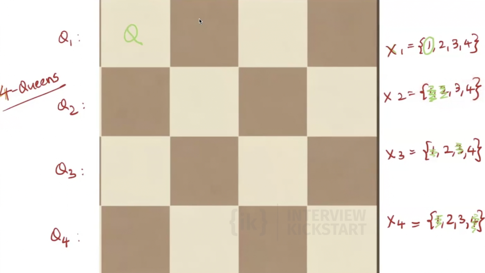
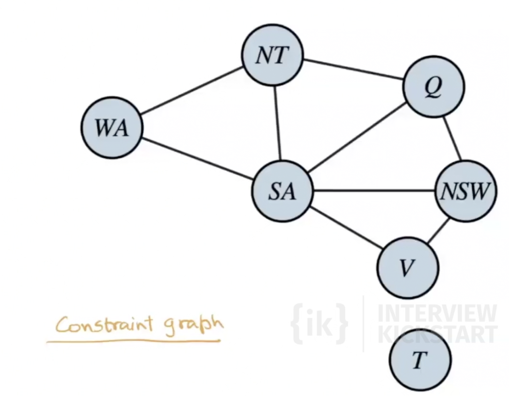
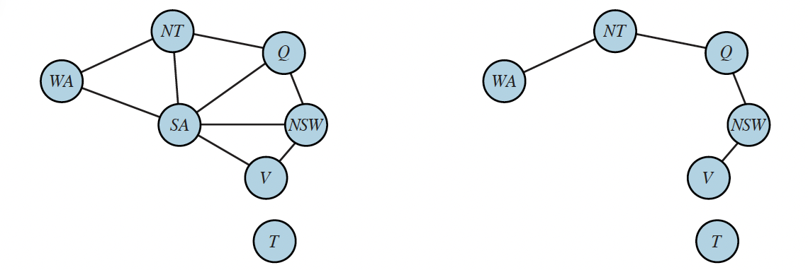
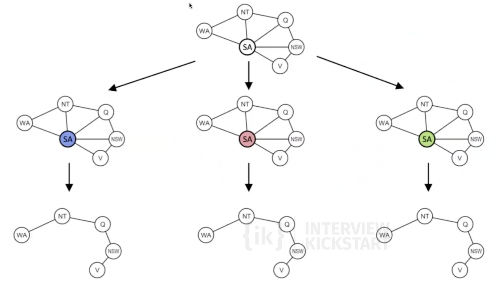
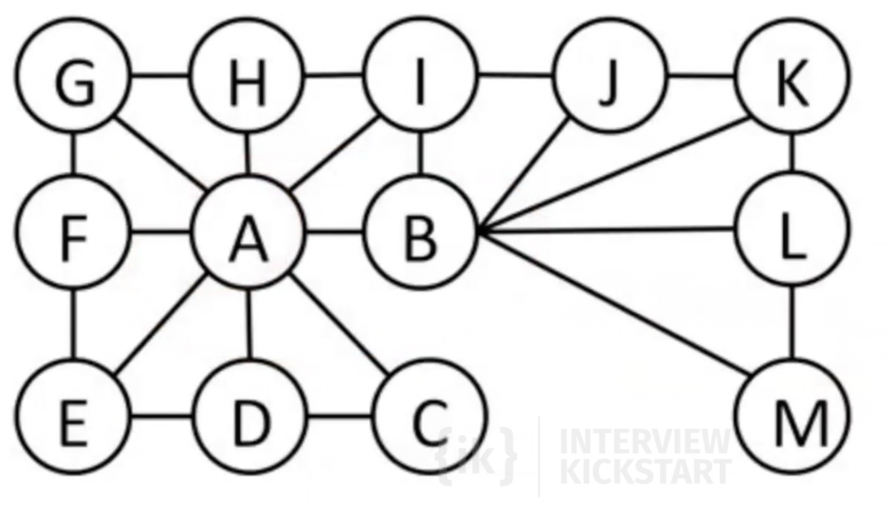

# Constraint Satisfaction Problems

Consider a factored representation for each state: a set of variables, each of which has a value. A problem is solved when each variable has a value that satisfies all the constraints on the variable. A problem described this way is called a **constraint satisfaction problem**, or **CSP**. A **solution** is an assignment of a value to every variable such that all constraints are satisfied. Sudoku is a standard example. Each empty cell is a variable, the domain is $\{1,\ldots,9\}$, and the constraints are “all digits in each row, column, and $3\times 3$ box are distinct.”

## Defining Constraint Satisfaction Problems

A CSP is a triple $\langle X, D, C \rangle$:

$X = \{X_1, \ldots, X_n\}$ is the set of variables.

$D = \{D_1, \ldots, D_n\}$ is the set of domains, where each $D_i$ is the domain of $X_i$.

$C = \{C_1, \ldots, C_m\}$ is the set of constraints.

For example, a Boolean variable has domain $D_i = \{\text{true}, \text{false}\}$. In general, $|D_i|$ may vary across variables.

Each constraint has the form

$$
C_j = \langle \mathrm{scope}_j, \mathrm{rel}_j \rangle,
$$

where $\mathrm{scope}_j = (X_{j_1}, \ldots, X_{j_t})$ is a tuple of variables and $\mathrm{rel}_j$ can be represented as an explicit set of all tuples of values that satisfy the constraint. In Set Theory, a relation is a set of ordered pairs that defines a specific association between elements from one or more sets. Here, $\mathrm{rel}_j \subseteq D_{j_1} \times \cdots \times D_{j_t}$ is a relation. 

Equivalently, $\mathrm{rel}_j$ can be represented by a predicate $\mathrm{rel}_j(\cdot)$ that returns whether a tuple is allowed (a function that can compute whether a tuple is a member of the relation).

Example: if $D_1 = D_2 = \{1,2,3\}$ and the constraint is $X_1 > X_2$, then

$$
\left\langle (X_1, X_2), \{(3,1), (3,2), (2,1)\} \right\rangle
$$

or equivalently

$$
\left\langle (X_1, X_2),\, X_1 > X_2 \right\rangle.
$$

In a CSP, we reason over assignments such as $\{X_i = v_i, X_j = v_j, \ldots\}$.

An assignment is **consistent** (or **legal**) if it violates no constraint.

A **complete assignment** assigns a value to every variable in $X$.

A **solution** to a CSP is a consistent, complete assignment.

A **partial assignment** leaves at least one variable unassigned.

A **partial solution** is a partial assignment that is consistent.

## Sudoku and hill climbing

One might try **hill climbing** (or iterative improvement) on Sudoku as follows. Work only with **complete** grids. Every cell contains a digit in $\{1,\ldots,9\}$. Define an **objective** to maximize the **number of non-conflicting numbers** (filled cells), where a placement is **conflicting** if **another copy of the same digit** appears elsewhere in its **row**, **column**, or **$3\times 3$ box**; otherwise it counts as non-conflicting. A **valid completed Sudoku** is a grid where **all** $81$ placements are non-conflicting.

This is **not** a good idea in practice, for a reason beyond local maxima and plateaus. **Solutions are astronomically rare** in the natural search space for such a formulation.

Impose only that **each row** is a **permutation** of $\{1,\ldots,9\}$ (nine distinct digits per row, but no column or box constraint yet). There are **9!** ways to order one row, and rows are chosen independently, so there are

$$
(9!)^9
$$

such grids. Felgenhauer and Jarvis (2005) showed that the number of **full** $9\times 9$ Sudoku solution grids (satisfying row, column, and box constraints) is

$$
N_{\text{sudoku}} = 6{,}671{,}903{,}752{,}021{,}072{,}936{,}960 \approx 6.67 \times 10^{21}.
$$

The **density** of true solutions inside this row-permutation ensemble is therefore

$$
\frac{N_{\text{sudoku}}}{(9!)^9} \approx \frac{6.67 \times 10^{21}}{1.091 \times 10^{50}} \approx 6.1 \times 10^{-29},
$$

If hill climbing is initialized at a random complete assignment (or a random grid in a similar huge family), the starting point is overwhelmingly likely to lie in a region of the search space **nowhere near** any valid solution. Hill climbing is a poor match to a landscape where admissible solutions occupy such a vanishingly small fraction of the states one is willing to visit.

## Solving Sudoku with DFS and backtracking

For a standard Sudoku puzzle, the **start state** is the given board configuration, where some cells are already filled. These given values are fixed and cannot be changed.

A **state** is any partially filled board that agrees with all fixed givens. A **goal state** is a completely filled board that satisfies all Sudoku constraints (no repeated digit in any row, column, or $3 \times 3$ box).

If we model this as search, BFS and DFS are both possible in principle. But BFS stores an entire frontier of partial boards, which can explode in size. If $b$ is the branching factor and $d$ is the search depth, BFS space is on the order of $O(b^d)$, while DFS needs only the current path (plus small bookkeeping), about $O(d)$. So for Sudoku, DFS is typically preferred over BFS on memory grounds.

However, plain DFS is still extremely slow in the worst case. If there are $m$ empty cells and each cell may try up to $9$ values, the naive search tree can have up to $9^m$ leaves (worst case $m=81$, so up to $9^{81} \approx 1.97 \times 10^{77}$ possibilities). That is astronomically large.

To speed up DFS, we prune aggressively: as soon as a partial assignment violates a Sudoku constraint, we stop exploring that state and do **not** explore its subtree.

This is exactly **backtracking**. Backtracking means:

1. Choose an unassigned variable (cell).
2. Try one candidate value.
3. If the partial assignment is inconsistent, undo that choice and try the next candidate.
4. If all candidates fail, return ("backtrack") to the previous decision point.
5. If a candidate is consistent, recurse on the next unassigned variable.

So backtracking is DFS plus early rejection of inconsistent partial assignments. The key gain is that entire invalid subtrees are cut off before full assignments are constructed.

This is a direct example of a **CSP** formulation. Variables are the Sudoku cells ($X=\{X_1,\ldots,X_{81}\}$). Domains are possible digits for each cell ($D_i \subseteq \{1,\ldots,9\}$). Constraints enforce Sudoku rules: all variables in each row, each column, and each $3 \times 3$ box must take distinct values. A solution is therefore a consistent, complete assignment to all 81 variables. DFS with backtracking is the search procedure over partial assignments for this CSP.

Note: the N-Queens problem can also be formulated as a CSP. But as we saw earlier, it also has other effective solution methods, especially iterative-improvement approaches such as hill climbing (including random restarts and related variants).

## Constraint Propagation

Constraint propagation uses the constraints to shrink the set of legal values in variable domains, thereby reducing the number of choices that search must consider later.

In Sudoku terms, once some cells are assigned, constraints from rows, columns, and $3 \times 3$ boxes can eliminate candidate digits in neighboring unassigned cells.

This can be applied in two places:

1. **Before search (preprocessing):** simplify domains before backtracking begins.
2. **During search (inference):** after each assignment, propagate implications to prune domains further. We call this **forward checking**. Basically we shrink the set of legal values in domains of variables that have been impacted by the new assignment.

Both uses reduce branching and can dramatically speed up backtracking.

As an example, in the 4-Queens problem, let's assume the first queen is placed at (1,1) (1-indexed). As soon as this assignment is done, **forward checking** eliminates some of the possible values the variables $x_2$, $x_3$ and $x_4$ can take right away. Thus, by the time we begin searching over other variables, their domains have already been pruned to smaller sets of legal values.

When we **backtrack**, we discard an assignment and resume search from the previous choice point. Any constraint propagation that ran **after** that assignment depended on it. Now those domain updates are no longer valid. We must **restore each affected variable’s domain** to what it was **before** we tried that value. If we skip this step, later branches would search against stale, wrongly shrunk domains.

**Chained forward checking** goes further than plain forward checking.

Whenever a variable's domain shrinks, we check its unassigned neighbors, and propogate constraints to those neighbors. We repeat until propagating cannot shrink anymore domains of variables; or until some variable's domain becomes empty, in which case the current partial assignment cannot be completed. Chained forward checking catches more dead ends early than a single pass of neighbor-only pruning right after one assignment.

## MRV and LCV

Backtracking search with constraint propagation still leaves us with two choices at every step: **which unassigned variable do we pick next**, and **which value from its domain do we try first**. These choices do not change correctness, but they can change the size of the search tree by orders of magnitude. Two heuristics address them:

- **MRV (Minimum Remaining Values)** orders **variables**.
- **LCV (Least Constraining Value)** orders **values**.

### Does the order of variable assignment matter?

Consider two variables $v_1$ and $v_2$ with domains $\{1, 2\}$ and $\{1, 2, 3, 4\}$ respectively, and no constraints. The search tree depends on which variable we assign first.

If we assign $v_1$ first and $v_2$ second:

- The root has $2$ children (one per value of $v_1$).
- Each of those children has $4$ children (one per value of $v_2$).
- Total edges: $2 + 2 \cdot 4 = 10$.

If we assign $v_2$ first and $v_1$ second:

- The root has $4$ children, each with $2$ children of its own.
- Total edges: $4 + 4 \cdot 2 = 12$.

In general, with two variables of domain sizes $d_1$ and $d_2$, putting variable $i$ first gives a tree with $d_i (1 + d_j)$ edges, which is smaller when $d_i$ is smaller. Both trees have the same number of leaves ($d_1 \cdot d_2$), but the smaller-domain-first tree has fewer **internal** branches to explore, so it is cheaper for backtracking search.

### A probabilistic argument

Let $p$ be the probability that a partial assignment to a variable will eventually lead to a backtrack (e.g. because constraints cannot be satisfied further down). When we put $v_1$ at the top, each of the $d_1$ subtrees rooted at $v_1 = c$ may fail with probability $p$, and the cost of the failure is the size of that subtree, roughly $1 + d_2$. The expected work is on the order of

$$
d_1 \cdot p \cdot (1 + d_2) = p \cdot d_1 (1 + d_2).
$$

Putting $v_2$ on top gives expected work proportional to $p \cdot d_2 (1 + d_1)$. The smaller domain at the top wins for the same reason as in the deterministic count. We want to **fail fast**: discover dead ends as close to the root as possible.

### Minimum Remaining Values (MRV) heuristic

The **MRV heuristic** says: at every level of the search tree, pick the unassigned variable whose **current domain is smallest**.

It is also called the **fail-fast heuristic** or the **most constrained variable heuristic**, because it preferentially expands the variable that is closest to having no options left. Intuitively, when solving Sudoku by hand, you naturally start with rows, columns, or $3 \times 3$ boxes that already have many filled cells, since the few empty cells there have very few candidate digits.

MRV pairs especially well with constraint propagation. If forward checking (or chained forward checking) shrinks some unassigned variable's domain to the empty set, that partial assignment cannot be extended to a solution, and we should backtrack immediately. With MRV, the next variable picked is exactly that empty-domain variable (size $0$ is the smallest possible), so the algorithm detects the dead end on its very next step. We do not need a separate "is anyone wiped out?" check — MRV gets it for free.

### Degree heuristic (tie-breaker)

MRV often produces ties — at the start of search, every variable typically has the full domain. The **degree heuristic** breaks ties by picking the variable involved in the most constraints with **other unassigned variables**, i.e. the variable with the highest **degree in the constraint graph restricted to unassigned variables**.

The intuition is that assigning a high-degree variable triggers the largest amount of forward checking on its neighbors, pruning their domains the most. This in turn shrinks the search tree everywhere below, and may even create new MRV opportunities (variables with small domains) for subsequent steps.

For example, in the Australia map-coloring case study below, all variables start with domain size $3$, so MRV is fully tied. SA borders five other regions, more than any other variable. Coloring SA first eliminates SA's color from the domains of all five neighbors at once, whereas coloring an edge region like WA only constrains two neighbors. Starting at SA therefore gives the rest of the search the strongest head start.

### Case Study: Australia map coloring

The CSP is:

- **Variables** $X = \{\text{WA}, \text{NT}, \text{SA}, \text{Q}, \text{NSW}, \text{V}, \text{T}\}$.
- **Domains** $D_i = \{R, G, B\}$ for every variable.
- **Constraints**: adjacent regions get different colors. From the constraint graph below, the adjacencies are

$$\text{WA} - \text{NT},\ \text{WA} - \text{SA},\ \text{NT} - \text{SA},\ \text{NT} - \text{Q},\ \text{SA} - \text{Q},\ \text{SA} - \text{NSW},\ \text{SA} - \text{V},\ \text{Q} - \text{NSW},\ \text{NSW} - \text{V}.$$

Tasmania (T) is disconnected.

The degrees in the constraint graph are: WA=2, NT=3, SA=5, Q=3, NSW=3, V=2, T=0.

We solve this with **chained forward checking** (propagate domain shrinks to neighbors until no more change) plus **MRV with degree as tie-breaker**.

**Step 1.** All domains have size $3$, so MRV ties everyone. Degree picks SA (degree $5$). Try $\text{SA} = R$. Forward checking removes $R$ from every neighbor of SA:

- WA: $\{G, B\}$, NT: $\{G, B\}$, Q: $\{G, B\}$, NSW: $\{G, B\}$, V: $\{G, B\}$, T: $\{R, G, B\}$.

Each of these neighbors shrank, but propagating further does not reduce anything: every adjacent unassigned pair (e.g. NT–Q, Q–NSW) has both domains $\{G, B\}$, and any value on one side is compatible with at least one value on the other, so chained forward checking stops here.

**Step 2.** MRV picks any variable with domain size $2$ (WA, NT, Q, NSW, V are tied). Among these, NT, Q, NSW each have degree $2$ in the **unassigned** subgraph (their neighbor SA is now assigned), and WA, V have degree $1$. Break the three-way tie arbitrarily and pick NT. Try $\text{NT} = G$. Forward checking removes $G$ from NT's unassigned neighbors:

- WA: $\{B\}$, Q: $\{B\}$, NSW: $\{G, B\}$, V: $\{G, B\}$, T: $\{R, G, B\}$.

Chained propagation now revisits WA and Q (both shrank). WA's only unassigned neighbors are NT and SA (both assigned), so nothing propagates from WA. Q has the unassigned neighbor NSW. Q's domain is $\{B\}$, so any NSW value equal to $B$ would have no support in Q. Remove $B$ from NSW: NSW $= \{G\}$.

NSW shrank, so we propagate to its unassigned neighbor V. NSW's only value is $G$, so V $= G$ has no support and is removed. V $= \{B\}$. V's only remaining unassigned neighbor is NSW, already updated. Propagation stops:

- WA: $\{B\}$, Q: $\{B\}$, NSW: $\{G\}$, V: $\{B\}$, T: $\{R, G, B\}$.

**Step 3.** MRV picks a domain of size $1$. WA, Q, NSW, V are all tied at size $1$. In the unassigned subgraph, WA has degree $0$, Q has degree $1$ (NSW), NSW has degree $2$ (Q and V), and V has degree $1$ (NSW). Degree picks NSW. Force $\text{NSW} = G$. Forward checking has nothing to remove ($G$ is not in any other variable's current domain).

**Step 4.** MRV ties WA, Q, V at size $1$. All three now have degree $0$ in the unassigned subgraph. Pick any, say Q $= B$. No domain changes.

**Step 5.** Pick WA $= B$. No changes.

**Step 6.** Force V $= B$. No changes.

**Step 7.** Only T remains. Pick T $= R$ (or any color).

The final assignment is $\text{WA} = B$, $\text{NT} = G$, $\text{SA} = R$, $\text{Q} = B$, $\text{NSW} = G$, $\text{V} = B$, $\text{T} = R$. All constraints are satisfied, and the search produced **zero backtracks**. Chained forward checking + MRV + degree pruned the tree so aggressively that each step was forced.

### Least Constraining Value (LCV) heuristic

Once MRV has chosen a variable, we still have to pick **which value** from its domain to try first. The **LCV heuristic** says: try the value that **rules out the fewest choices for the neighboring variables**.

Concretely, for each candidate value $v$ in the chosen variable's domain, count how many values $v$ would eliminate from the domains of unassigned neighbors via forward checking. Try values in increasing order of this count (least constraining first).

The intuition is opposite to MRV's "fail fast." Once we have committed to a variable, we hope this branch **succeeds**. A value that wipes out many neighbor options is more likely to push us toward a dead end somewhere deeper in the tree.

For example, suppose we have just chosen variable $X$ with current domain $\{a, b\}$.

- Picking $X = a$ removes one value from one neighbor's domain.
- Picking $X = b$ removes values from three neighbors' domains, taking one of them down to size $1$.

LCV would try $X = a$ first. The reason is that $X = a$ leaves the neighbors with larger domains than $X = b$ does. There are simply more candidate combinations of neighbor values that are still consistent. That makes the subtree under $a$ more likely to contain a solution than the subtree under $b$. 

Put differently: when **no** candidate value at this variable leads to a completed solution, we must eventually explore every failed subtree. Whichever order we use, the total work ends up the same. Order matters only when **some** value still admits a solution; then we want that branch tried **first**, so we stop before paying for the other subtrees. LCV is that principle operationalized: rank values so that the least constraining (most permissive of neighbors) comes first, improving the odds we hit a viable branch early.

### Summary

- **MRV** picks the next *variable* with the smallest current domain. It fails fast and pairs naturally with constraint propagation.
- **Degree heuristic** breaks MRV ties by preferring variables connected to many unassigned neighbors, maximizing the impact of forward checking.
- **LCV** picks the next *value* that constrains neighbors the least.

Together, **chained forward checking + MRV (with degree tie-breaking) + LCV** is the standard recipe for an efficient backtracking CSP solver.

## Exploiting the Constraint Graph structure

Some structural properties of the constraint graph let us beat the exponential worst case of generic backtracking. 

If the constraint graph is a tree, it is **bipartite**.

For the **graph coloring CSP** specifically, this means a tree-structured instance always has a valid 2-coloring, and we can find one in **linear time** $O(n)$. Run a single DFS or BFS from any root, color the root arbitrarily (say red), and color every other vertex with the opposite of its parent's color. Each of the $n$ vertices and $n - 1$ edges is touched once.

Even for a **general** tree-structured CSP (not just coloring), the tree shape lets us avoid backtracking entirely, in two passes:

1. **Bottom-up preprocessing:** Pick any vertex as root and order the variables topologically: $X_1, \ldots, X_n$ with parents before children. For $j$ from $n$ down to $2$, make the edge $\mathrm{Parent}(X_j) \to X_j$ **arc-consistent**: remove from $\mathrm{Parent}(X_j)$'s domain every value that has no consistent partner in $X_j$'s current domain. If any domain becomes empty, the CSP has no solution.

2. **Top-down assignment:** For $j$ from $1$ to $n$, assign $X_j$ any value in its (now-pruned) domain that is consistent with the value already assigned to $\mathrm{Parent}(X_j)$. Step 1 guarantees such a value exists, so this pass **never backtracks**.

The total time is $O(n d^2)$, where $d$ is the largest domain size. The bottom-up pass touches each of the $n-1$ tree edges once, and per edge it tests every value in the parent's domain against every value in the child's domain ($d \times d = d^2$ pair checks in the worst case) to decide which parent values to drop. The top-down pass is $O(n d)$. So tree-structured CSPs are solvable in time linear in $n$ (polynomial in $d$), no backtracking required.

Now that we have an efficient algorithm for trees, we can consider whether more general constraint graphs can be reduced to trees somehow.

### Cutset conditioning

The first way to reduce a constraint graph to a tree involves assigning values to some variables so that the remaining variables form a tree. Consider the constraint graph for Australia, shown again in the figure below. Without South Australia, the graph would become a tree, also shown in the figure below.

Fortunately, we can delete South Australia (in the graph, not the country) by fixing a value for SA and deleting from the domains of the other variables any values that are inconsistent with the value chosen for SA.

Therefore, we can solve the remaining tree with the algorithm given above and thus solve the whole problem. Of course, in the general case (as opposed to map coloring), the value chosen for SA could be the wrong one, so we would need to try each possible value. The general algorithm is as follows:

1. Choose a subset S of the CSP’s variables such that the constraint graph becomes a tree **after** removal of S. S is called a cycle cutset.
2. For each possible assignment to the variables in S that satisfies all constraints on S,

(a) remove from the domains of the remaining variables any values that are inconsistent
with the assignment for S, and

(b) if the remaining CSP has a solution, return it together with the assignment for S.

If the cycle cutset has size $c$, then the total run time is $O\!\left(d^{c} \cdot (n - c)\, d^{2}\right)$: we have to try each of the $d^{c}$ combinations of values for the variables in $S$, and for each combination we must solve a tree problem of size $n - c$.

For the Australia example, $n = 7$ (the seven regions WA, NT, SA, Q, NSW, V, T), $d = 3$ (the three colors $R, G, B$), and $c = 1$ (the cutset $S = \{\text{SA}\}$). So the cutset method runs in $O(d^{c} \cdot (n - c)\, d^{2}) = O(3 \cdot 6 \cdot 9) = O(162)$ work, versus the naive $d^{n} = 3^{7} = 2187$ assignments a plain backtracking search could explore.

As another examplem, for the constraint graph below, $c = 2$.

If we could find a cutset of size $c = 20$, this would get us down from the lifetime of the Universe to a few minutes. In the worst case, however, $c$ can be as large as $(n−2)$.