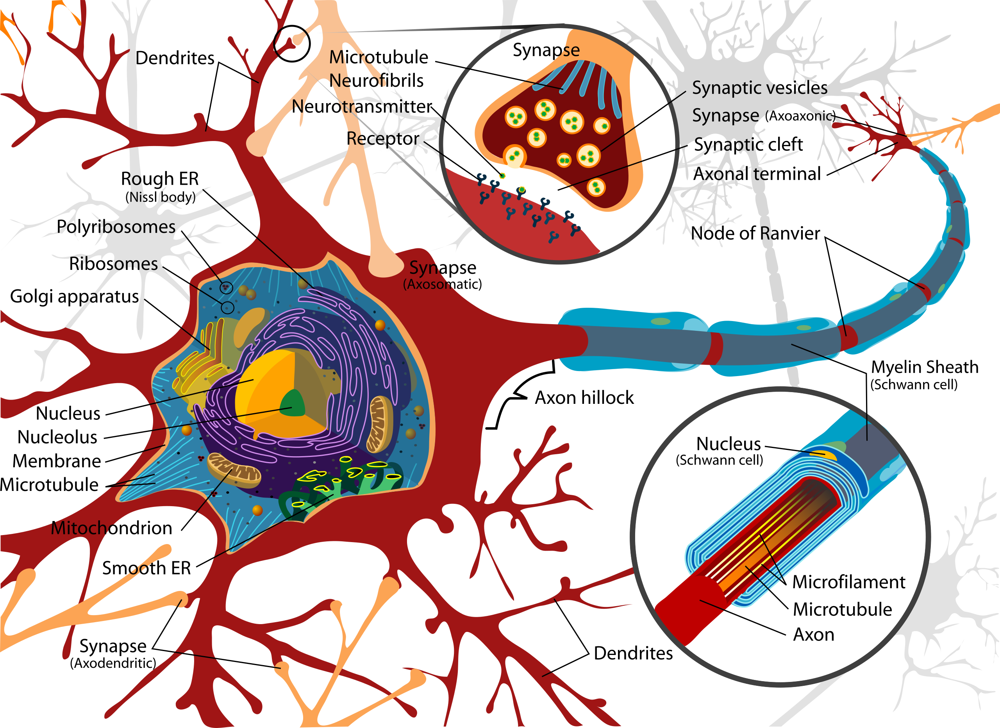
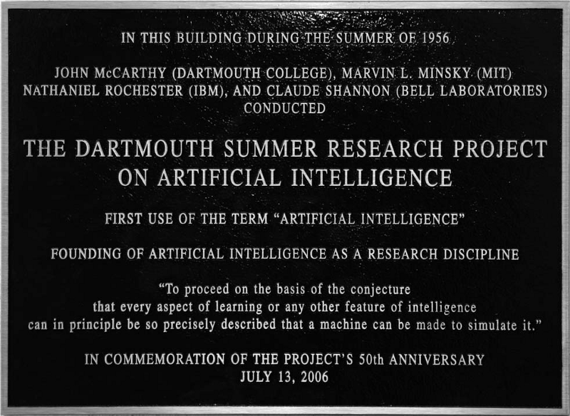

# History

## Neurons and Hebbian learning

John McCarthy named and helped found the field of AI. His thinking was influenced by the Hixon Symposium on Cerebral Mechanisms in Behavior, which he attended. To appreciate the analogy between brains and machines, it helps to have a minimal picture of how neurons work.

A neuron has dendrites (inputs), a cell body, an axon hillock (where signals are summed), an axon (output cable), and axon terminals that meet other neurons at synapses. The neuron is in a resting state until the combined input at the axon hillock exceeds a threshold. Then it fires—an electrical signal (ion flow) propagates down the axon. The signal is all-or-nothing (same magnitude each time), so in a coarse model the axon output is binary (off or on). At a synapse, the presynaptic terminal releases neurotransmitters from synaptic vesicles. They bind to receptors on the postsynaptic neuron (often compared to a key fitting a lock). Depending on the receptor type, the effect is excitatory (pushes the postsynaptic neuron toward firing) or inhibitory (pushes it away from firing). Motor neurons drive muscle contraction by releasing neurotransmitters that open ion channels in muscle cells. Sensory neurons carry information from sense organs. Interneurons connect other neurons.

**Hebbian learning** is the idea that when a presynaptic neuron repeatedly helps activate a postsynaptic neuron, the connection between them is strengthened (e.g. more receptors, more neurotransmitter release, or both). The next time, the same presynaptic activity is more likely to trigger the postsynaptic neuron. In this way the brain learns associations— e.g. a “lightning” pattern and a “thunder” pattern that often occur together come to strengthen each other’s pathways. Knowledge is stored in the strength and direction of synaptic connections. The flip side is **“use it or lose it”.** Connections weaken when presynaptic and postsynaptic activity no longer co-occur, which is one basis for forgetting.

## Brains, automata, and the birth of AI

Von Neumann argued that brains and computers were both implementing the same kind of **automaton**—a system that moves through discrete states according to fixed rules and inputs. An automaton is an abstract machine whose next state is determined by its current state and the current input. As a toy illustration, networks of simple threshold units (a neuron fires if weighted input ≥ *T*) can implement logic gates (AND, OR, NOT, etc.), so in principle neuron-like elements can perform logical computation.

John McCarthy famously asked whether computers could be intelligent. Marvin Minsky built the **SNARC** (Stochastic Neural Analog Reinforcement Calculator), which implemented a small network of 40 “neurons” using vacuum tubes and included a form of reinforcement (strengthening successful pathways). That was an early step toward both neural and symbolic approaches to intelligence.

In 1955, McCarthy and others drafted **“A Proposal for the Dartmouth Summer Research Project on Artificial Intelligence.”** The proposal framed seven research themes. (1) Automatic computers—any machine can be simulated by a program. The bottleneck is programming, not hardware. (2) Using language—model thought as manipulating words by rules. Generalize by new words and rules. (3) Neuron nets— how to wire hypothetical neurons to form concepts (partial work by Pitts, McCulloch, Minsky, others). (4) Size of a calculation— need a theory of complexity and efficiency (early work by Shannon, McCarthy). (5) Self-improvement— machines that improve themselves. (6) Abstractions— classify types and how machines could form them from data. Very much like feature extraction. (7) Randomness and creativity— creativity as guided randomness (e.g. hunches) in orderly thought.

The 1956 Dartmouth workshop is often taken as the birth of AI as a named field.

Arthur Samuel worked on checkers-playing programs and wrote “Some Studies in Machine Learning Using the Game of Checkers.” He is credited with coining the term machine learning.