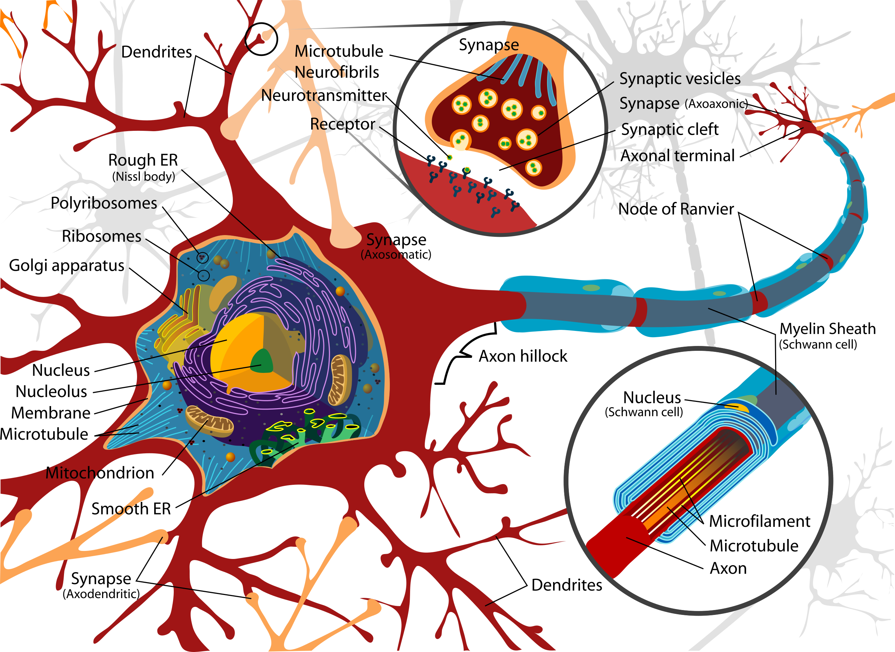

# Introduction to Artificial Intelligence

## Neurons and Hebbian learning

**John McCarthy** named and helped found the field of AI. His thinking was influenced by the **Hixon Symposium on Cerebral Mechanisms in Behavior**, which he attended. To appreciate the analogy between brains and machines, it helps to have a minimal picture of how neurons work.

A **neuron** has **dendrites** (inputs), a **cell body**, an **axon hillock** (where signals are summed), an **axon** (output cable), and **axon terminals** that meet other neurons at **synapses**. The neuron is in a **resting state** until the combined input at the axon hillock exceeds a threshold. Then it fires an electrical signal (ion flow) propagates down the axon. The signal is all-or-nothing (same magnitude each time), so in a coarse model the axon output is binary (off or on). At a synapse, the presynaptic terminal releases **neurotransmitters** from **synaptic vesicles**. They bind to **receptors** on the postsynaptic neuron (often compared to a key fitting a lock). Depending on the receptor type, the effect is **excitatory** (pushes the postsynaptic neuron toward firing) or **inhibitory** (pushes it away from firing). **Motor neurons** drive muscle contraction by releasing neurotransmitters that open ion channels in muscle cells. **Sensory neurons** carry information from sense organs. **Interneurons** connect other neurons.



**Hebbian learning** is the idea that when a presynaptic neuron repeatedly helps activate a postsynaptic neuron, the connection between them is strengthened (e.g. more receptors, more neurotransmitter release, or both). The next time, the same presynaptic activity is more likely to trigger the postsynaptic neuron. In this way the brain learns **associations**— e.g. a “lightning” pattern and a “thunder” pattern that often occur together come to strengthen each other’s pathways. Knowledge is stored in the **strength and direction** of synaptic connections. The flip side is **“use it or lose it”**: connections weaken when presynaptic and postsynaptic activity no longer co-occur, which is one basis for forgetting.

## Brains, automata, and the birth of AI

**Von Neumann** argued that brains and computers were both implementing the same kind of **automaton**: a system that moves through discrete states according to fixed rules and inputs. An automaton is an abstract machine whose next state is determined by its current state and the current input. As a toy illustration, networks of simple **threshold units** (a neuron fires if weighted input ≥ *T*) can implement **logic gates** (AND, OR, NOT, etc.), so in principle neuron-like elements can perform logical computation.

**John McCarthy** famously asked whether **computers could be intelligent**. **Marvin Minsky** built the **SNARC** (Stochastic Neural Analog Reinforcement Calculator), which implemented a small network of 40 “neurons” using vacuum tubes and included a form of **reinforcement** (strengthening successful pathways). That was an early step toward both neural and symbolic approaches to intelligence.

In 1955, McCarthy and others drafted **“A Proposal for the Dartmouth Summer Research Project on Artificial Intelligence.”** The proposal framed seven research themes: (1) **Automatic computers**— any machine can be simulated by a program; the bottleneck is programming, not hardware. (2) **Using language**— model thought as manipulating words by rules; generalize by new words and rules. (3) **Neuron nets**— how to wire hypothetical neurons to form concepts (partial work by Pitts, McCulloch, Minsky, others). (4) **Size of a calculation**— need a theory of complexity and efficiency (early work by Shannon, McCarthy). (5) **Self-improvement**— machines that improve themselves. (6) **Abstractions**— classify types and how machines could form them from data. Very much like feature extraction. (7) **Randomness and creativity**— creativity as guided randomness (e.g. hunches) in orderly thought.

The 1956 Dartmouth workshop is often taken as the **birth of AI as a named field**.


**Arthur Samuel** worked on checkers-playing programs and wrote “Some Studies in Machine Learning Using the Game of Checkers.” He is credited with coining the term **machine learning**.

## State space search

Tasks that involve finding a sequence of actions from an initial situation to a goal can be framed as **state space search** consisting of a set of **states**, a **transition function** (actions → new states), and one or more **goal states**. The structure is often drawn as a **state space graph**. Nodes are states, edges are actions, and solving the problem means finding a path from an initial state to a goal.

- There can be **multiple goal states**.
- The state space graph can be **infinite** (e.g. unbounded configurations).
- Paths to the goal may have **obstacles** or dead ends.

The dynamics are captured by a function $f(\text{current state}, \text{action}) = \text{next state}$. 

A classic example is the **Water and Jug Problem**, (featured in Die Hard 3) which can be solved by viewing jug configurations as states and pours as actions.

**Problem:** You have two jugs with capacities $x$ and $y$ liters (positive integers) and an unlimited water supply. You may fill a jug to capacity, empty a jug, or pour from one jug into the other until the source is empty or the target is full. Determine whether you can measure exactly $z$ liters (i.e. reach a state where one jug contains $z$, or the two jugs together hold $z$).

**State space:** A state is a pair $(a, b)$ where $a$ is the amount in the first jug and $b$ in the second ($0 \leq a \leq x$, $0 \leq b \leq y$). Start at $(0, 0)$. A state is a **goal** if $a = z$, $b = z$, or $a + b = z$.

**Actions from state $(a, b)$:**

1. Fill jug 1 → $(x, b)$
2. Fill jug 2 → $(a, y)$
3. Empty jug 1 → $(0, b)$
4. Empty jug 2 → $(a, 0)$
5. Pour 1 → 2: pour $\min(a, y - b)$ liters → $(a - \min(a, y - b), b + \min(a, y - b))$
6. Pour 2 → 1: pour $\min(b, x - a)$ liters → $(a + \min(b, x - a), b - \min(b, x - a))$

**Algorithm:** BFS from $(0, 0)$, applying all legal actions from each state and skipping states already visited. If any reached state is a goal, return true. If the frontier is exhausted, return false.

```
function CAN_MEASURE(x, y, z):
    if z > x + y or z < 0: return false
    if z == 0: return true
    visited = empty set
    queue = queue containing (0, 0)
    add (0, 0) to visited
    while queue is not empty:
        (a, b) = dequeue(queue)
        if a == z or b == z or a + b == z: return true
        for each next state (a', b') in SUCCESSORS(a, b, x, y):
            if (a', b') not in visited:
                add (a', b') to visited
                enqueue(queue, (a', b'))
    return false

function SUCCESSORS(a, b, x, y):
    next_states = []
    next_states.append((x, b))           // fill jug 1
    next_states.append((a, y))           // fill jug 2
    next_states.append((0, b))           // empty jug 1
    next_states.append((a, 0))           // empty jug 2
    pour = min(a, y - b)
    if pour > 0: next_states.append((a - pour, b + pour))   // pour 1 → 2
    pour = min(b, x - a)
    if pour > 0: next_states.append((a + pour, b - pour))   // pour 2 → 1
    return next_states
```

### Aside on Bidirectional Search

**Bidirectional search** runs two breadth-first searches (BFS) simultaneously: one from the start state forward and one from the goal state backward, stopping when the two fronts meet.

There are several ways to alternate between the two BFS fronts:

1. **Alternate by layer:** Add one full layer to the left BFS tree, then one full layer to the right BFS tree (so both fronts stay the same distance from their starting points).
2. **Strict alternation:** Process one node from the left queue, then one from the right queue, and repeat.
3. **Shorter queue first:** Always take the next node from the tree whose **queue is shorter**.

The shorter-queue strategy is a heuristic that tends to minimize the total number of nodes processed. You expand the smaller frontier first, which often keeps the combined search more balanced and reduces redundant work compared to fixed alternation.

## Early AI: thinking as search and Moravec’s paradox

Early AI practitioners often equated **thinking with search**. The idea was that intelligence meant exploring a state space efficiently. **Faster search** implied **superior intelligence**. Tasks that machines could solve well in this way— e.g. playing chess, solving puzzles— were the ones that were then regarded as “intelligent.”

At the same time, tasks that humans find effortless—recognizing faces, speaking grammatical sentences, navigating a room—were very hard for computers. **Moravec’s paradox** is the observation that what is easy for humans (perception, movement, language) was difficult for machines, while what is hard for humans (abstract logic, formal math) was relatively easier to automate.

One explanation is **evolution and development**. Skills that humans have had for tens of thousands of years (vision, motor control, social communication) are deeply ingrained and mostly unconscious. Abstract logical reasoning and formal mathematics are evolutionarily recent and require deliberate effort. Our brains are **plastic**. With practice, even hard tasks become more automatic, but the “easy” human skills are already highly optimized by evolution.

## Two modes of thinking: System 1 and System 2

The book **Thinking, Fast and Slow** (Kahneman) distinguishes two modes of thinking:

- **System 1:** Fast, intuitive—snap judgments, emotional reactions, pattern recognition. Mostly automatic and low effort.
- **System 2:** Slow, deliberate—logical deduction, calculation, step-by-step analysis. Requires attention and effort.

System 2 is slow in humans in part because **working memory is limited** and because reasoning is **largely serial**: we think step by step and do not truly multitask across demanding reasoning tasks.

- **State space search** is a computational analogue of **System 2** thinking: explicit states, actions, and paths. Algorithms (e.g. BFS, A*) explore the space in a structured way.
- **Neural networks** are well suited to **System 1**-style tasks: pattern recognition, intuitive prediction, perception. They typically need a lot of data and compute and could not be scaled on early computers.

Neural networks often err (e.g. hallucination, inconsistent logic) doing System 2, so search and classical algorithms remain important. Modern systems often combine both: neural networks handle System 1 (language, vision, heuristics), while System 2 is delegated to tools such as calculators, code execution, and search (e.g. retrieval, planning).
