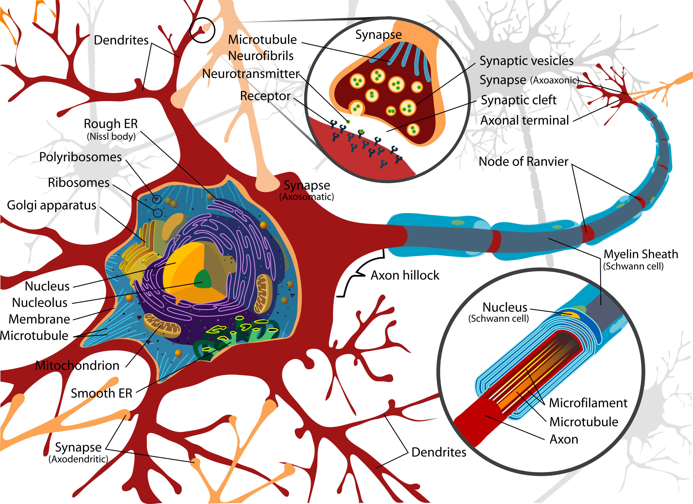
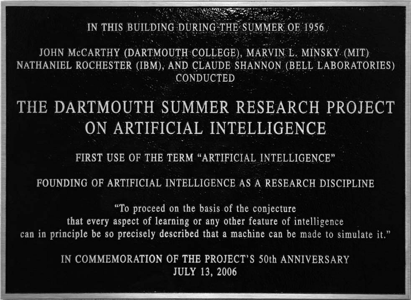
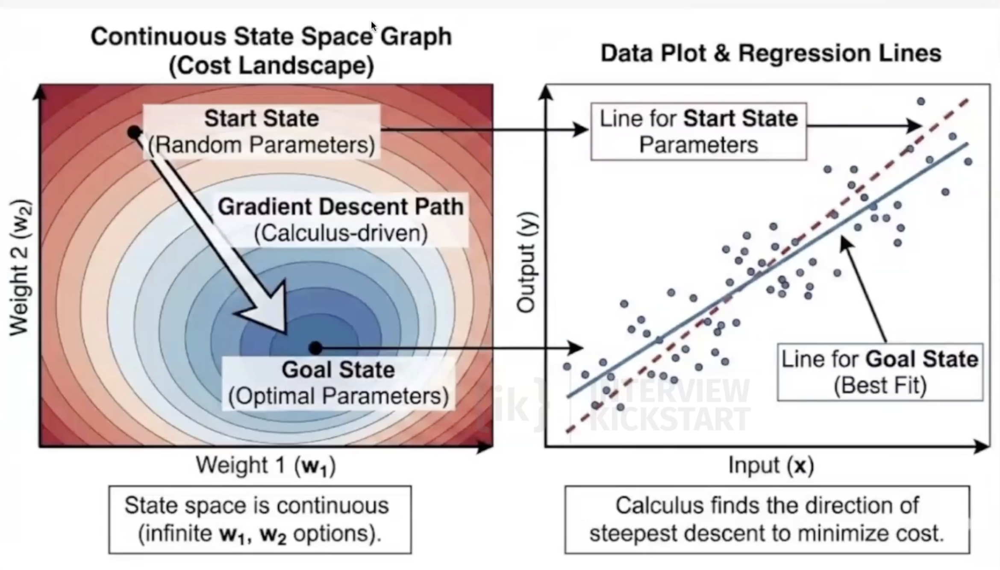
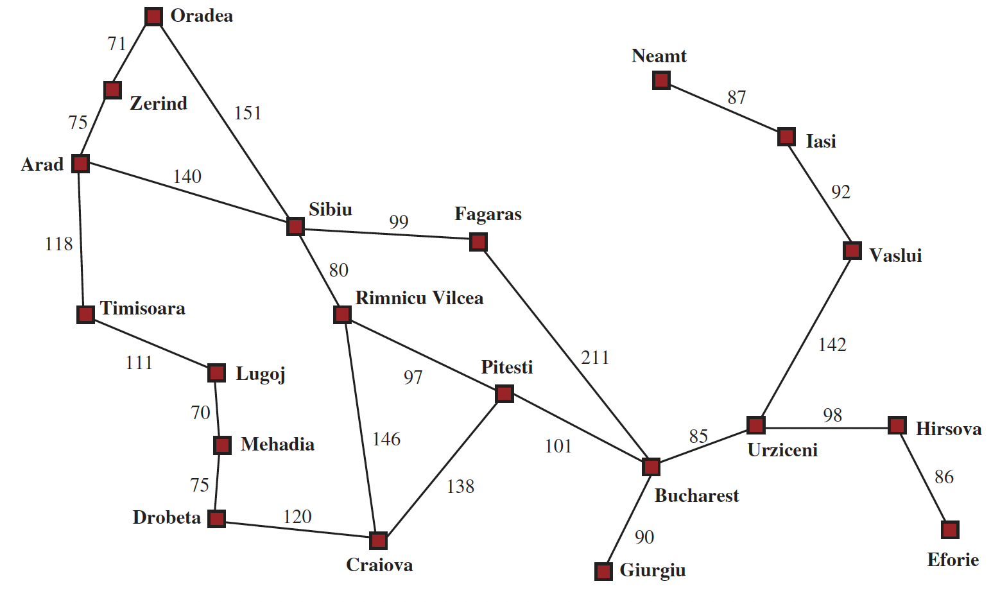
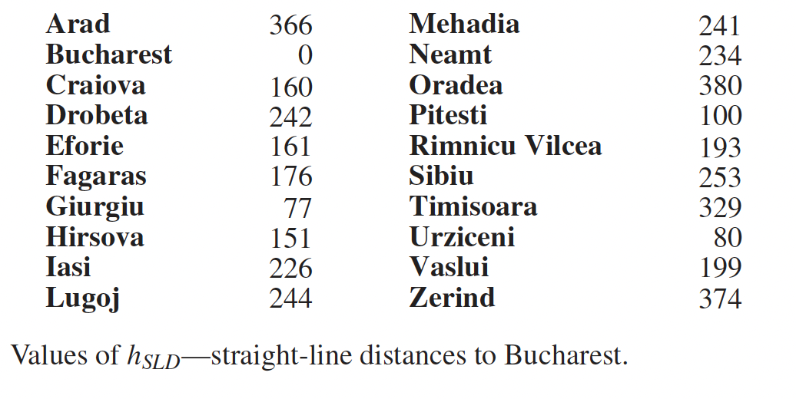
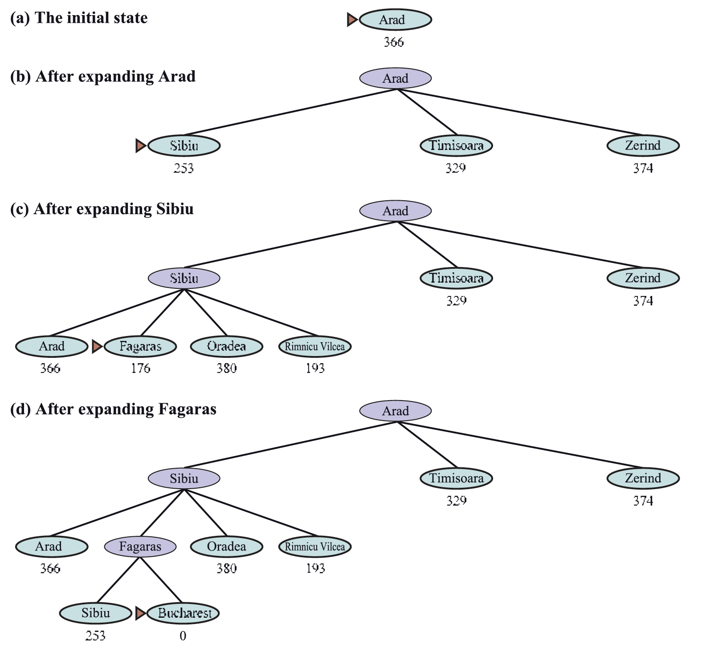
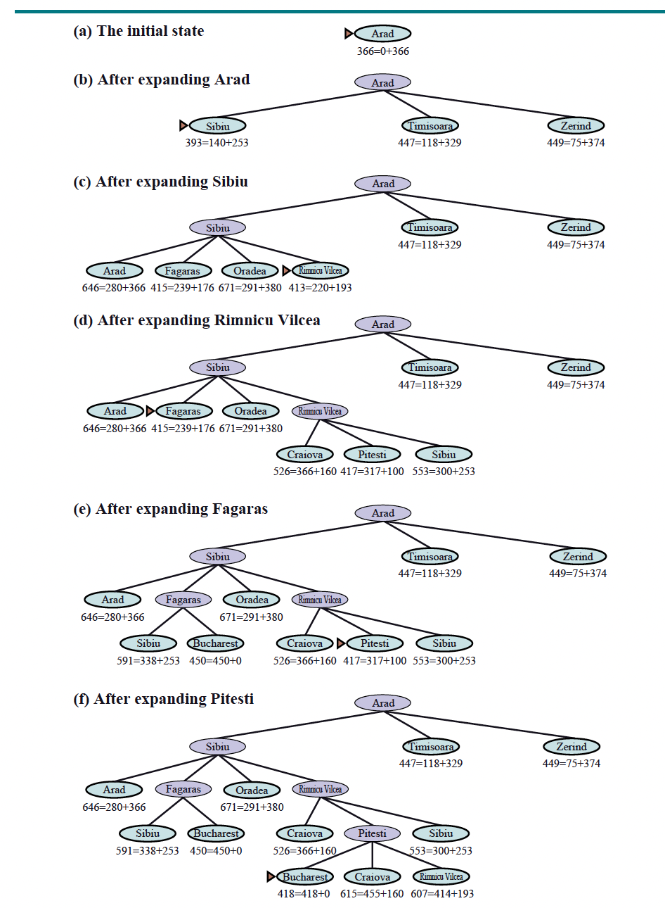
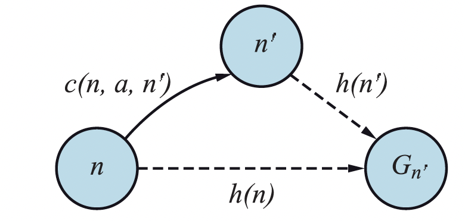

# Introduction to Artificial Intelligence

## Neurons and Hebbian learning

John McCarthy named and helped found the field of AI. His thinking was influenced by the Hixon Symposium on Cerebral Mechanisms in Behavior, which he attended. To appreciate the analogy between brains and machines, it helps to have a minimal picture of how neurons work.

A neuron has dendrites (inputs), a cell body, an axon hillock (where signals are summed), an axon (output cable), and axon terminals that meet other neurons at synapses. The neuron is in a resting state until the combined input at the axon hillock exceeds a threshold. Then it fires—an electrical signal (ion flow) propagates down the axon. The signal is all-or-nothing (same magnitude each time), so in a coarse model the axon output is binary (off or on). At a synapse, the presynaptic terminal releases neurotransmitters from synaptic vesicles. They bind to receptors on the postsynaptic neuron (often compared to a key fitting a lock). Depending on the receptor type, the effect is excitatory (pushes the postsynaptic neuron toward firing) or inhibitory (pushes it away from firing). Motor neurons drive muscle contraction by releasing neurotransmitters that open ion channels in muscle cells. Sensory neurons carry information from sense organs. Interneurons connect other neurons.



**Hebbian learning** is the idea that when a presynaptic neuron repeatedly helps activate a postsynaptic neuron, the connection between them is strengthened (e.g. more receptors, more neurotransmitter release, or both). The next time, the same presynaptic activity is more likely to trigger the postsynaptic neuron. In this way the brain learns associations— e.g. a “lightning” pattern and a “thunder” pattern that often occur together come to strengthen each other’s pathways. Knowledge is stored in the strength and direction of synaptic connections. The flip side is **“use it or lose it”.** Connections weaken when presynaptic and postsynaptic activity no longer co-occur, which is one basis for forgetting.

## Brains, automata, and the birth of AI

Von Neumann argued that brains and computers were both implementing the same kind of **automaton**—a system that moves through discrete states according to fixed rules and inputs. An automaton is an abstract machine whose next state is determined by its current state and the current input. As a toy illustration, networks of simple threshold units (a neuron fires if weighted input ≥ *T*) can implement logic gates (AND, OR, NOT, etc.), so in principle neuron-like elements can perform logical computation.

John McCarthy famously asked whether computers could be intelligent. Marvin Minsky built the **SNARC** (Stochastic Neural Analog Reinforcement Calculator), which implemented a small network of 40 “neurons” using vacuum tubes and included a form of reinforcement (strengthening successful pathways). That was an early step toward both neural and symbolic approaches to intelligence.

In 1955, McCarthy and others drafted **“A Proposal for the Dartmouth Summer Research Project on Artificial Intelligence.”** The proposal framed seven research themes. (1) Automatic computers—any machine can be simulated by a program. The bottleneck is programming, not hardware. (2) Using language—model thought as manipulating words by rules. Generalize by new words and rules. (3) Neuron nets— how to wire hypothetical neurons to form concepts (partial work by Pitts, McCulloch, Minsky, others). (4) Size of a calculation— need a theory of complexity and efficiency (early work by Shannon, McCarthy). (5) Self-improvement— machines that improve themselves. (6) Abstractions— classify types and how machines could form them from data. Very much like feature extraction. (7) Randomness and creativity— creativity as guided randomness (e.g. hunches) in orderly thought.

The 1956 Dartmouth workshop is often taken as the birth of AI as a named field.



Arthur Samuel worked on checkers-playing programs and wrote “Some Studies in Machine Learning Using the Game of Checkers.” He is credited with coining the term machine learning.

## Rational agents and problem formulation

A **rational agent** is an idealized intelligent system situated in an environment. It receives percepts via sensors and chooses actions via actuators according to an agent function. The agent is given a goal. In this framing, intelligence is figuring out how to reach it. This is a computational definition, not the same as how psychologists define intelligence.

A general problem specification has an initial state, a goal state (or set of goal states), and a state transition function $f(\text{current state}, \text{action}) = \text{next state}$. The agent faces choices along the way. Sometimes each transition has an associated cost. The set of all reachable states and transitions forms a state space graph. A search tree is any tree you get by expanding from the initial state. If a problem can be cast as state space search, solving it reduces to having an algorithm that explores this graph.

Newell and Simon held that the human brain actually does something like this. We perform state space search so quickly on familiar problems that we are not aware of it. Cognitive science, the scientific study of how the mind and brain work, was partly motivated by such ideas.

## Symbols, logic, and continuous state spaces

Newell and Simon also saw computers as symbol manipulators. Binary sequences can stand for anything, not only numbers, and you can define operations on them. Taking a set of axioms (e.g. from Principia Mathematica) and logical manipulation as the basic operations, they treated problem solving as state transitions that could simulate human thinking. They used machines to prove theorems from Principia Mathematica.

The state space need not be discrete. In linear regression you seek a line $y = w_1 x + w_2$ that best fits a cluster of points. With mean squared error $E = \text{MSE}(w_1, w_2)$, each pair $(w_1, w_2)$ is a state and the goal is to minimize $E$. There is no explicit list of actions, but the state space is continuous and from any $(w_1, w_2)$ there are infinitely many possible next states. Calculus supplies a way to move toward the minimum, so the problem can still be viewed as state space search.



## State space search

Tasks that involve finding a sequence of actions from an initial situation to a goal can be framed as **state space search**— a set of states, a transition function (actions → new states), and one or more goal states. The structure is often drawn as a state space graph. Nodes are states, edges are actions, and solving the problem means finding a path from an initial state to a goal.

- There can be multiple goal states.
- The state space graph can be infinite (e.g. unbounded configurations).
- Paths to the goal may have obstacles or dead ends.

The dynamics are captured by a function $f(\text{current state}, \text{action}) = \text{next state}$. 

A classic example is the Water and Jug Problem (featured in Die Hard 3), which can be solved by viewing jug configurations as states and pours as actions.

**Problem:** You have two jugs with capacities $x$ and $y$ liters (positive integers) and an unlimited water supply. You may fill a jug to capacity, empty a jug, or pour from one jug into the other until the source is empty or the target is full. Determine whether you can measure exactly $z$ liters (i.e. reach a state where one jug contains $z$, or the two jugs together hold $z$).

**State space:** A state is a pair $(a, b)$ where $a$ is the amount in the first jug and $b$ in the second ($0 \leq a \leq x$, $0 \leq b \leq y$). Start at $(0, 0)$. A state is a goal if $a = z$, $b = z$, or $a + b = z$.

**Actions from state $(a, b)$:**

1. Fill jug 1 → $(x, b)$
2. Fill jug 2 → $(a, y)$
3. Empty jug 1 → $(0, b)$
4. Empty jug 2 → $(a, 0)$
5. Pour 1 → 2: pour $\min(a, y - b)$ liters → $(a - \min(a, y - b), b + \min(a, y - b))$
6. Pour 2 → 1: pour $\min(b, x - a)$ liters → $(a + \min(b, x - a), b - \min(b, x - a))$

**Algorithm:** BFS from $(0, 0)$, applying all legal actions from each state and skipping states already visited. If any reached state is a goal, return true. If the queue is exhausted, return false.

```
function CAN_MEASURE(x, y, z):
    if z > x + y or z < 0: return false
    if z == 0: return true
    visited = empty set
    queue = queue containing (0, 0)
    add (0, 0) to visited
    while queue is not empty:
        (a, b) = dequeue(queue)
        if a == z or b == z or a + b == z: return true
        for each next state (a', b') in SUCCESSORS(a, b, x, y):
            if (a', b') not in visited:
                add (a', b') to visited
                enqueue(queue, (a', b'))
    return false

function SUCCESSORS(a, b, x, y):
    next_states = []
    next_states.append((x, b))           // fill jug 1
    next_states.append((a, y))           // fill jug 2
    next_states.append((0, b))           // empty jug 1
    next_states.append((a, 0))           // empty jug 2
    pour = min(a, y - b)
    if pour > 0: next_states.append((a - pour, b + pour))   // pour 1 → 2
    pour = min(b, x - a)
    if pour > 0: next_states.append((a + pour, b - pour))   // pour 2 → 1
    return next_states
```

### Aside on Bidirectional Search

**Bidirectional search** runs two breadth-first searches (BFS) simultaneously— one from the start state forward and one from the goal state backward—stopping when the two fronts meet.

There are several ways to alternate between the two BFS fronts:

1. **Alternate by layer:** Add one full layer to the left BFS tree, then one full layer to the right BFS tree (so both fronts stay the same distance from their starting points).
2. **Strict alternation:** Process one node from the left queue, then one from the right queue, and repeat.
3. **Shorter queue first:** Always take the next node from the tree whose queue is shorter.

The shorter-queue strategy is a heuristic that tends to minimize the total number of nodes processed. You expand the smaller frontier first, which often keeps the combined search more balanced and reduces redundant work compared to fixed alternation.

## Early AI: thinking as search and Moravec’s paradox

Early AI practitioners often equated **thinking with search**. The idea was that intelligence meant exploring a state space efficiently. **Faster search** implied **superior intelligence**. Tasks that machines could solve well in this way— e.g. playing chess, solving puzzles— were the ones that were then regarded as “intelligent.”

At the same time, tasks that humans find effortless—recognizing faces, speaking grammatical sentences, navigating a room—were very hard for computers. **Moravec’s paradox** is the observation that what is easy for humans (perception, movement, language) was difficult for machines, while what is hard for humans (abstract logic, formal math) was relatively easier to automate.

One explanation is evolution and development. Skills that humans have had for tens of thousands of years (vision, motor control, social communication) are deeply ingrained and mostly unconscious. Abstract logical reasoning and formal mathematics are evolutionarily recent and require deliberate effort. Our brains are plastic. With practice, even hard tasks become more automatic, but the “easy” human skills are already highly optimized by evolution.

## Two modes of thinking: System 1 and System 2

The book *Thinking, Fast and Slow* (Kahneman) distinguishes two modes of thinking.

- **System 1:** Fast, intuitive—snap judgments, emotional reactions, pattern recognition. Mostly automatic and low effort.
- **System 2:** Slow, deliberate—logical deduction, calculation, step-by-step analysis. Requires attention and effort.

System 2 is slow in humans in part because working memory is limited and because reasoning is largely serial. We think step by step and do not truly multitask across demanding reasoning tasks.

- State space search is a computational analogue of System 2 thinking—explicit states, actions, and paths. Algorithms (e.g. BFS, A*) explore the space in a structured way.
- Neural networks are well suited to System 1-style tasks—pattern recognition, intuitive prediction, perception. They typically need a lot of data and compute and could not be scaled on early computers.

Neural networks often err (e.g. hallucination, inconsistent logic) doing System 2, so search and classical algorithms remain important. Modern systems often combine both. Neural networks handle System 1 (language, vision, heuristics), while System 2 is delegated to tools such as calculators, code execution, and search (e.g. retrieval, planning).

## Dijkstra's perspective

In many state space search problems, actions are not equal. Each action can have a cost, so the goal is not only to reach a target state but to reach it with minimum total cost. This is the setting for shortest-path methods such as Dijkstra's algorithm. A simple example is route planning on a weighted graph where edges represent travel times and Dijkstra returns the least-cost path from a start node to every reachable node.

In Dijkstra's words, "Computer science is no more about computers than astronomy is about telescopes." The computer is a tool that executes algorithms. The core intellectual object is the algorithm, which predates modern computers by centuries.

## Review of Uninformed Search Strategies

An uninformed search algorithm is given no clue about how close a state is to the goal(s). 

When all actions have the same cost, an appropriate strategy is breadth-first search, in which the root node is expanded first, then all the successors of the root node are expanded next, then their successors, and so on. This is a systematic search strategy that is therefore complete provided the state space either has a solution or is finite. 

When actions have different costs, an obvious choice is Dijkstra’s algorithm by the theoretical computer science community, and uniform-cost search by the AI community. The idea is that while breadth-first search spreads out in waves of uniform depth— first depth 1, then depth 2, and so on— uniform-cost search spreads out in waves of uniform path-cost. Uniform-cost search is cost-optimal, because the first solution it finds will have a cost that is at least as low as the cost of any other node added to the queue of nodes to explore. Uniform cost search considers all paths systematically in order of increasing cost, never getting caught going down a single infinite path (assuming that all action costs are > ǫ > 0). It is therefore complete provided the state space either has a solution or is finite.

Depth-first search always expands the deepest node first. Depth-first search is not cost-optimal; it returns the first solution it finds, even if it is not cheapest. For finite state spaces that are trees it is efficient and complete; for acyclic state spaces it may end up expanding the same state many times via different paths, but will (eventually) systematically explore the entire space. In cyclic state spaces it can get stuck in an infinite loop; therefore some implementations of depth-first search check each new node for cycles. Finally, in infinite state spaces, depthfirst search is not systematic: it can get stuck going down an infinite path, even if there are no cycles. Thus, depth-first search is incomplete. 

## Informed (Heuristic) Search Strategies

An informed search strategy uses domain-specific hints about the location of goals and can find solutions more efficiently than an uninformed strategy. The hints come in the form of a heuristic function, denoted $h(n)$.

$h(n)$ = estimated cost of the cheapest path from the state at node $n$ to a goal state

But how do we decide which node to expand next? A very general approach is called **best-first search**, in which we choose a node, $n$, with minimum value of some evaluation function, $f(n)$. On each iteration we choose a node with minimum $f(n)$ value. We will maintain a min priority queue which will always contain the node with the least $f(n)$.

Concretely, when we expand a node $N$, we look at every node connected to $N$ (e.g. $n_1, n_2, n_3$), compute $f(n_1)$, $f(n_2)$, $f(n_3)$, and insert those nodes into the min priority queue (each with its $f$-value). The queue then holds *all* nodes we have reached but not yet expanded. We always expand next the node at the front of the queue— the one with the smallest $f(n)$. That node need not be a direct neighbor of the node we just expanded; it might be a node that was added in an earlier step. 

**Example:** Consider a small tree: root $A$ with children $B$ and $C$; $C$ has children $D$ and $E$. We expand $A$, compute $f(B)$ and $f(C)$, and add $B$ and $C$ to the queue. Suppose $f(B) = 3$ and $f(C) = 1$. The queue is $[C, B]$. We pop $C$ and expand it. When we expand $C$, we add its children $D$ and $E$ to the queue with, say, $f(D) = 5$ and $f(E) = 4$. The queue is now $[B, E, D]$ (since $f(B)=3$ is less than $f(E)=4$ and $f(D)=5$). So $B$ is still at the front even though we just expanded $C$ and pushed $D$ and $E$. We expand $B$ next— a sibling of $C$, not a child of the node we just expanded. The next node we expand is always the one with minimum $f$ in the queue, which may be an "older" node like $B$ rather than a newly added neighbor.

Below is a figure of a simplified road map of part of Romania, with road distances in miles, which we'll use for our analysis of Informed Search Strategies.



Let's also assume that our destination is Bucharest. Below is the list of straight line distances to Bucharest.



### Greedy best-first search

Greedy best-first search expands first the node with the lowest $h(n)$ value— the node that appears to be closest to the goal— on the grounds that this is likely to lead to a solution quickly.

So the evaluation function $f(n) = h(n)$.

Let us see how this works for route-finding problems in Romania; we use the straightline distance heuristic, which we will call $h_{SLD}$.

Below is a figure of stages in our greedy best-first tree-like search for Arad to Bucharest with the straight-line
distance heuristic $h_{SLD}$. Nodes are labeled with their h-values.



The solution it found does not have optimal cost. The path via Sibiu and Fagaras to Bucharest is 32 miles longer than the path through Rimnicu Vilcea and Pitesti. This is why the algorithm is called “greedy”— on each iteration it tries to get as close to a goal as it can, but greediness can lead to worse results than being careful. Greedy best-first graph search is complete in finite state spaces, but not in infinite ones.

### $A^*$ search

The flaw with Greedy best-first search is that it does not consider the cost to get to the next node.

The most common informed search algorithm is $A^*$ search (pronounced “A-star search”), a best-first search that uses the evaluation function

$$f(n) = g(n) + h(n)$$

where $g(n)$ is the path cost from the initial state to node $n$, and $h(n)$ is the estimated cost of the shortest path from $n$ to a goal state.

Below is a figure showing stages in an $A^*$ search for Bucharest. Nodes are labeled with $f=g+h$. The $h$ values are the straight-line distances to Bucharest.



$A^*$ search is complete, assuming all action costs are > ǫ > 0, and the state space either has a solution or is 
finite (just like BFS and Dijkstra's). Whether $A^*$ is cost-optimal depends on certain properties of the 
heuristic.

**Consistency (a “triangle inequality” for the heuristic)**

A heuristic $h(n)$ is **consistent** if, for every node $n$ and every successor $n'$ of $n$ (reached by taking some action $a$ with cost $c(n, a, n')$), we have:

$$h(n) \leq c(n, a, n') + h(n')$$

In words, the estimate from $n$ to the goal is never more than the cost of going from $n$ to $n'$ plus the estimate from $n'$ to the goal. This is a form of the **triangle inequality**: one “side” (the estimate from $n$) cannot be longer than the sum of the other two “sides” (the step cost $c(n,a,n')$ and the estimate from $n'$). The straight-line distance $h_{SLD}$ to Bucharest is an example of a consistent heuristic.



With a consistent heuristic, the first time we reach a state we do so on an optimal path. So we never need to re-add that state to the frontier (min priority queue) or update its entry in *reached*.

Note: *Reached* is the data structure— e.g. a set or table that records which states we have already seen and, in graph search, often the best path cost we have found so far for each. We check *reached* to avoid expanding the same state twice. With an inconsotintent heuristic we might have to sometimes re-add a state to the frontier (min priority queue) or update its entry in *reached*.
