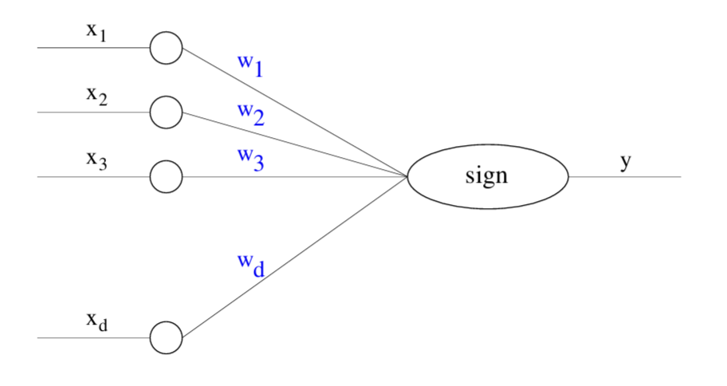
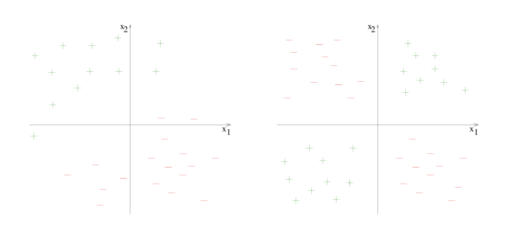

# Notes from AI podcasts on YouTube

## [Yoshua Bengio: Deep Learning | Lex Fridman Podcast #4](https://www.youtube.com/watch?v=azOmzumh0vQ)
20 Oct 2018.

### Credit assignment

Biological Neural Networks can do ‘credit assignment’ over a long period of time. **The credit assignment problem in neural networks, especially in the context of reinforcement learning, refers to the challenge of determining which actions or decisions are responsible for a given outcome, particularly when there's a delay between actions and feedback.** This makes it difficult for the network to learn effective policies.

Why is it a problem? **If the network can't accurately determine which actions are responsible for good or bad outcomes, it will struggle to learn effective strategies.** 

Understanding how the brain solves the credit assignment problem is a key area of research in neuroscience and artificial intelligence.

We store all kinds of memories in our brain which we can access later in order to help us- 

- infer causes of things that we are observing now
- assign credit (determining which actions or decisions are responsible for a given outcome) to decisions or interpretations we came up with a while ago when those memories were stored.
- Furthermore, we can change (update) the way we would have reacted or interpreted things in the past to new scenarios to attempt to achieve good outcomes (in simple words, learning from mistakes). That’s credit assignment used for learning.

Humans seem to be able to do credit assignment through essentially arbitrary times (we could remember something we did last year and then now because we see some new evidence we can change our minds about the way we were thinking last year and hopefully not do the same mistake again). Part of the reason for that is probably forgetting. You're only remembering the really important things it's very efficient. 

### Current state of deep learning

**Instead of learning separately from images and videos on one hand and from text on the other hand we need to do a better job of jointly learning about language and about the world to which it refers.** This way both sides can help each other. We need to have good world models in our neural nets for them to really understand sentences which talk about what's going on in the world. **We need language input to help provide clues about what high-level concepts like semantic concepts should be represented at the most processed levels of these neural nets.**

### Training objectives and frameworks

The training objectives-

- **which could be important to allow the highest level explanations to rise from from the learning**
- **which could be used to reward exploration (the right kind of exploration)**

**and the training frameworks (for example, going from passive observation of data to more active agents which learn by intervening in the world the relationships between causes and effects)** are neither in the dataset nor in the architecture. These are more crucial to take us closer to AGI.

### Learning through interaction

Children learn by interacting with objects in the world- an idea largely absent from artificial neural networks except in some reinforcement-learning settings. One can imagine an objective rewarding an agent for interactions (such as poking an object in a certain way) that help it learn further. Evidence from infants supports this. They are not passive learners but direct their attention toward the aspects of the world that are most interesting and surprising in a non-trivial way. Due to this process, they revise their theories of the world.

Even state-of-the-art deep learning fails to learn good models of very simple environments (such as small grid worlds). Where a human needs dozens of examples, these methods need millions, even for trivial tasks. This is an opportunity for academics without massive compute to do important work on training frameworks and agent learning in simple, synthetic environments.

There's an opportunity for academics who don't have the kind of computing power to do really important and exciting research to advance the state-of-the-art in training frameworks and agent learning in even simple environments that seem trivial but yet current machine learning fails on.

### Knowledge

In the 1980s, AI focused on knowledge representation, knowledge acquisition, and expert system. This is called the symbolic AI way of representing knowledge (using discrete, human-readable symbols and explicit rules that manipulate them, rather than the continuous numerical vectors a neural net uses). That approach was largely put on hold because it did not work, but its goals remain important. One reason expert systems failed is that much of our knowledge, common sense and intuition can't be introsepcted or put into words. We make many decisions we cannot really explain. Such knowledge is necessary for good decisions yet hard to codify in rule-based formalisms.

There is something powerful about **distributed representations**, which is what makes neural nets work so well, and it is hard to replicate in a symbolic world. But there is a trade-off: knowledge in expert systems is neatly decomposed into rules, whereas a neural net is a big blob of parameters that work intensely together to represent everything the network knows. But the weakness of this form of representation is that it can't be sufficiently factorized. This is one of the weaknesses of current neural nets that we have to take lessons from classical AI in order to bring in another kind of compositionality which is common in language.

Beyond separating the high-level variables (the meaningful factors of variation, e.g. an object's identity, position, color, or pose), we must also disentangle the *mechanisms* (the "rules") that relate them, so each piece of knowledge lives on its own. Otherwise networks suffer **catastrophic forgetting**: learning new things destroys what was learned before. Better-factorized knowledge avoids much of this.

There's the sensory space like pixels where everything is tangled. The information like the variables are completely interdependent in very complicated ways. So is the computation. We can hypothesize a right high-level representation space where both the variables and how they relate to each other can be disentangled and that will provide a lot of generalization power.

### Generalizing to new distributions

Current machine learning typically assumes the test distribution matches the training distribution. In our training methods, distribution of the test set is similar to the distribution of the training set. This is where current machine learning is too weak. It doesn't tell us anything about how to generalize a new distribution. This is a key weakness: it tells us nothing about how to generalize to a new distribution. Yet humans generalize to new distributions all the time, because different distributions still have things in common. For example, a science-fiction novel may take place on another planet that looks very different on the surface but obeys the same laws of physics. We understand the story because we transport our knowledge from Earth (about underlying cause-and-effect relationships, physical mechanisms, and even social interactions). So we make sense of a world that is visually completely different.

### Bias in machine learning

What can be done about bias and ethics in machine learning?

In the short term, techniques already exist (and will keep improving) to measure bias in datasets and build less-biased classifiers mature enough that regulators could require their use despite a small accuracy cost. 

In the long term, the harder goal is instilling **moral values** into computers. There is work already on detecting emotions in images, sounds, and text, and patterns such as injustice that trigger anger. 

### Machine Teaching

Supervised learning has had a lot of success. The broader problem is Machine Teaching. What are good strategies for teaching a learning agent, and can we train a system to be a good teacher? In one project (the "BabyAI" game), a learning agent and a teaching agent interact; the teacher uses its knowledge of the environment to help the learner learn as quickly as possible.

### The Turing Test

The Turing Test, originally called the **"Imitation Game"** by mathematician Alan Turing in 1950, is a benchmark for artificial intelligence. It measures a machine's ability to exhibit conversational behavior indistinguishable from that of a human.

The standard evaluation involves three participants in separate locations.

1. The Interrogator (Judge): A human who asks questions through a text-based interface.
2. Player A: A human respondent.
3. Player B: An AI system attempting to deceive the interrogator.

The interrogator evaluates the transcripts of the conversations without knowing which participant is human and which is the machine. If the interrogator cannot reliably tell the difference, the machine is said to have passed the test.

The hardest part of the conversation for machines is everything involving **non-linguistic knowledge**. For example, cases such as **Winograd schemas** (sentences that are semantically ambiguous unless you understand enough about the world). 

These point toward building systems that understand how the world works and its causal relationships. Passing the Turing Test should be largely independent of language; differences between languages are minute in the grand scheme.

## [Mindscape 336 | Anil Ananthaswamy on the Mathematics of Neural Nets and aI](https://www.youtube.com/watch?v=S31zEgHVkoA)
24 Nov 2025.

### The Perceptron Learning Algorithm and its Convergence

#### Perceptron

The **Perceptron**, introduced by Rosenblatt, can be viewed as a parameterized function that takes a real-valued vector as input and produces a Boolean output. In this section, we are discussing the classical **single-layer perceptron**: one linear scoring layer followed by a threshold. The output is obtained by thresholding a linear score; the model parameters are exactly the coefficients of that linear function.

For dimension $d \geq 1$, a $d$-dimensional perceptron has parameter vector $\mathbf{w} \in \mathbb{R}^d$. Given input $\mathbf{x} \in \mathbb{R}^d$, it computes

$$y = \operatorname{sign}(\mathbf{w}^\top \mathbf{x}),$$

where for $\alpha \in \mathbb{R}$,

$$\operatorname{sign}(\alpha) = \begin{cases}
+1, & \alpha \ge 0, \\
-1, & \alpha < 0.
\end{cases}$$

!!! note "Coordinate notation in the figure"
    In the Perceptron figure, labels such as $w_1, w_2, w_3, \ldots$ refer to the coordinates of the single weight vector $\mathbf{w}$ in $d$-dimensional space. For example, $\mathbf{w} = (w_1, w_2, \ldots, w_d)$. This is different from the later notation $\mathbf{w}_1, \mathbf{w}_2, \ldots$, where the subscript indexes successive weight vectors produced by the algorithm.

It is common to include an additive bias term $b \in \mathbb{R}$ in the linear score, so the perceptron output becomes

$$y = \operatorname{sign}(\mathbf{w}^{\top}\mathbf{x} + b).$$

We proceed without an explicit bias term, since we can absorb it into an augmented input. Define

$$\tilde{\mathbf{x}} = \begin{pmatrix}\mathbf{x} \\ 1\end{pmatrix} \in \mathbb{R}^{d+1}, \qquad
\tilde{\mathbf{w}} = \begin{pmatrix}\mathbf{w} \\ b\end{pmatrix} \in \mathbb{R}^{d+1}.$$

Then

$$\tilde{\mathbf{w}}^\top \tilde{\mathbf{x}} = \mathbf{w}^\top \mathbf{x} + b.$$

The significance of the Perceptron lies in its use as a device for learning.

Consider the figure below.

It is apparent that in the figure on the left, we may draw a line such that all the points labeled $+$ lie to one side of the line, and all the points labeled $-$ lie to the other side. It is also apparent that no line with the same property may be drawn for the set of labeled points shown on the right. The property in question is linear separability. More generally, in $d$-dimensional space, a set of points with labels in $\{+, -\}$ is linearly separable if there exists a hyperplane in the same space such that all the points labeled $+$ lie to one side of the hyperplane, and all the points labeled $-$ lie to the other side of the hyperplane.

Given a set of points labeled in $\{+, -\}$, the Perceptron Learning Algorithm is an iterative procedure to update the weights of a Perceptron such that eventually the corresponding hyperplane contains all the points labeled $+$ on one side, and all the points labeled $-$ on the other. We adopt the convention that the points labeled $+$ must lie on the side of the hyperplane to which its normal points.

#### Perceptron Learning Algorithm

The input to the Perceptron Learning Algorithm is a data set of $n \geq 1$ points, each $d$-dimensional, and their associated labels in $\{+, -\}$. For mathematical convenience, we associate the $+$ label with the number $1$, and the $-$ label with the number $-1$. Hence, we may take our input to be

$$(\mathbf{x}^{(1)}, y^{(1)}), (\mathbf{x}^{(2)}, y^{(2)}), \ldots, (\mathbf{x}^{(n)}, y^{(n)}),$$

where for $i \in \{1, 2, \ldots, n\}$, $\mathbf{x}^{(i)} \in \mathbb{R}^d$ and $y^{(i)} \in \{-1, 1\}$.

To entertain any hope of our algorithm succeeding, we must assume that our input data points are linearly separable. Consistent with our choice of ignoring the bias term in the Perceptron, we shall assume that not only are the input data points linearly separable, they can indeed be separated by a hyperplane that passes through the origin.

**Assumption 1 (Linear Separability):** There exists some $\mathbf{w}^* \in \mathbb{R}^d$ such that $\|\mathbf{w}^*\| = 1$ and, for some $\gamma > 0$, for all $i \in \{1, 2, \ldots, n\}$,

$$y^{(i)}\bigl(\mathbf{w}^* \cdot \mathbf{x}^{(i)}\bigr) > \gamma.$$

Taking $\mathbf{w}^*$ to be unit-length is not strictly necessary; it merely simplifies our subsequent analysis. Geometrically, $\mathbf{w}^*$ is the normal vector to a separating hyperplane through the origin. The direction of $\mathbf{w}^*$ determines which side of the hyperplane is considered positive. Points for which $\mathbf{w}^* \cdot \mathbf{x} > 0$ lie on the side toward which $\mathbf{w}^*$ points, so they are predicted to have label $+1$, while points for which $\mathbf{w}^* \cdot \mathbf{x} < 0$ lie on the opposite side and are predicted to have label $-1$.

Requiring $y^{(i)}(\mathbf{w}^* \cdot \mathbf{x}^{(i)})$ to be strictly positive, and in fact greater than $\gamma$, means there is a positive margin between the data set and the separating hyperplane; none of the data points lie on the hyperplane itself.

**Assumption 2 (Bounded Coordinates):** There exists $R \in \mathbb{R}$ such that for all $i \in \{1, 2, \ldots, n\}$,

$$\|\mathbf{x}^{(i)}\| \leq R.$$

Naturally, the Perceptron Learning Algorithm itself does not explicitly know $\mathbf{w}^*$, $\gamma$, or $R$, although $R$ can be inferred from the data. These quantities are merely useful artifacts we have defined in order to aid our subsequent analysis of the algorithm.

**Perceptron Learning Algorithm pseudocode:**

!!! note "Iteration notation"
    The vectors $\mathbf{w}_1, \mathbf{w}_2, \mathbf{w}_3, \ldots, \mathbf{w}_k$ are the successive weight vectors produced by the algorithm. The subscript $k$ indexes the iteration number; it does **not** refer to the $k$th coordinate of a single vector $\mathbf{w}$.

1. Set $k \leftarrow 1$ and $\mathbf{w}_k \leftarrow \mathbf{0}$.
2. While there exists some $i \in \{1, 2, \ldots, n\}$ such that

    $$y^{(i)}\bigl(\mathbf{w}_k \cdot \mathbf{x}^{(i)}\bigr) \leq 0,$$

    pick an arbitrary $j \in \{1, 2, \ldots, n\}$ such that

    $$y^{(j)}\bigl(\mathbf{w}_k \cdot \mathbf{x}^{(j)}\bigr) \leq 0,$$

    and update

    $$\mathbf{w}_{k+1} \leftarrow \mathbf{w}_k + y^{(j)}\mathbf{x}^{(j)}.$$

3. Set $k \leftarrow k + 1$ and repeat the while loop.
4. Return $\mathbf{w}_k$.

Here is the step-by-step explanation. We start with the zero vector, so initially the Perceptron has no preferred separating direction. At each iteration, we look for a data point that is currently misclassified, or exactly on the decision boundary. Once we find such a point $\mathbf{x}^{(j)}$, we adjust the weight vector in the direction that would classify it more correctly. If $y^{(j)} = 1$, we add $\mathbf{x}^{(j)}$, nudging $\mathbf{w}_k$ toward the positive example. If $y^{(j)} = -1$, we subtract $\mathbf{x}^{(j)}$, nudging $\mathbf{w}_k$ away from the negative example.

The while loop continues as long as there exists some point such that,

$$y^{(i)}(\mathbf{w}_k \cdot \mathbf{x}^{(i)}) \leq 0.$$

If $y^{(i)} = 1$, then we want (in order to break the while loop) $\mathbf{w}_k \cdot \mathbf{x}^{(i)} > 0$; if $y^{(i)} = -1$, then we want (in order to break the while loop) $\mathbf{w}_k \cdot \mathbf{x}^{(i)} < 0$. The while loop breaks when for every $i \in \{1, 2, \ldots, n\}$,

$$y^{(i)}(\mathbf{w}_k \cdot \mathbf{x}^{(i)}) > 0.$$

That is the final condition we want: the hyperplane normal to $\mathbf{w}_k$ separates the data according to their labels, with every positive example on the side toward which $\mathbf{w}_k$ points and every negative example on the opposite side.

#### Analysis

**Theorem (Perceptron Convergence):** The Perceptron Learning Algorithm makes at most $\dfrac{R^2}{\gamma^2}$ updates, after which it returns a separating hyperplane.

**Proof.** It is immediate from the code that if the algorithm terminates and returns a weight vector, then that weight vector separates the positive points from the negative points. Thus, it suffices to show that the algorithm terminates after at most $\dfrac{R^2}{\gamma^2}$ updates. In other words, we need to show that the number of updates is upper-bounded by $\dfrac{R^2}{\gamma^2}$. Our strategy is to derive both a lower bound and an upper bound on the magnitude of $\mathbf{w}_{k+1}$ in terms of $k$, where $k$ is the number of updates made so far, and then compare the two bounds.

First note that $\mathbf{w}_1 = \mathbf{0}$. For $k \geq 1$, suppose $\mathbf{x}^{(j)}$ is the misclassified point chosen during iteration $k$. Then

$$
\begin{aligned}
\mathbf{w}_{k+1} \cdot \mathbf{w}^*
&= \bigl(\mathbf{w}_k + y^{(j)}\mathbf{x}^{(j)}\bigr) \cdot \mathbf{w}^* \\
&= \mathbf{w}_k \cdot \mathbf{w}^* + y^{(j)}\bigl(\mathbf{x}^{(j)} \cdot \mathbf{w}^*\bigr) \\
&> \mathbf{w}_k \cdot \mathbf{w}^* + \gamma.
\end{aligned}
$$

The final inequality uses Assumption 1, since $y^{(j)}(\mathbf{w}^* \cdot \mathbf{x}^{(j)}) > \gamma$. 

Starting from $\mathbf{w}_1 \cdot \mathbf{w}^* = 0$, each update increases this dot product by more than $\gamma$. After $k$ updates, the accumulated increase is therefore more than $k\gamma$, so by induction,

$$\mathbf{w}_{k+1} \cdot \mathbf{w}^* > k\gamma.$$

Since $\|\mathbf{w}^*\| = 1$, the [Cauchy-Schwarz inequality](../../math/linear_algebra/vector_geometry_in_mathbb_r_n_and_correlation_coefficients.md#pythagorean-theorem-in-mathbbrn-and-the-cauchyschwarz-inequality) gives

$$\mathbf{w}_{k+1} \cdot \mathbf{w}^* \leq \|\mathbf{w}_{k+1}\|\,\|\mathbf{w}^*\| = \|\mathbf{w}_{k+1}\|.$$

Therefore,

$$\|\mathbf{w}_{k+1}\| > k\gamma. \tag{1}$$

Now we derive an upper bound. Again, let $\mathbf{x}^{(j)}$ be the point chosen during iteration $k$. Then

$$
\begin{aligned}
\|\mathbf{w}_{k+1}\|^2
&= \|\mathbf{w}_k + y^{(j)}\mathbf{x}^{(j)}\|^2 \\
&= \|\mathbf{w}_k\|^2 + \|y^{(j)}\mathbf{x}^{(j)}\|^2 + 2y^{(j)}(\mathbf{w}_k \cdot \mathbf{x}^{(j)}) \\
&= \|\mathbf{w}_k\|^2 + \|\mathbf{x}^{(j)}\|^2 + 2y^{(j)}(\mathbf{w}_k \cdot \mathbf{x}^{(j)}) \\
&\leq \|\mathbf{w}_k\|^2 + \|\mathbf{x}^{(j)}\|^2 \\
&\leq \|\mathbf{w}_k\|^2 + R^2.
\end{aligned}
$$

The first inequality uses the fact that $\mathbf{x}^{(j)}$ was chosen because it continued the while loop, so $y^{(j)}(\mathbf{w}_k \cdot \mathbf{x}^{(j)}) \leq 0$. The second inequality uses Assumption 2. 

Starting from $\|\mathbf{w}_1\|^2 = 0$, each update increases the squared norm by at most $R^2$. After $k$ updates, the squared norm is therefore at most $kR^2$, so by induction,

$$\|\mathbf{w}_{k+1}\|^2 \leq kR^2. \tag{2}$$

Combining (1) and (2), we get

$$k^2\gamma^2 < \|\mathbf{w}_{k+1}\|^2 \leq kR^2.$$

For $k > 0$, this implies

$$k < \frac{R^2}{\gamma^2}.$$

So the algorithm can make at most $\dfrac{R^2}{\gamma^2}$ updates before terminating. Once it terminates, the returned weight vector defines a separating hyperplane. This completes the proof.

### The legendary weekend: how Ted Hoff and Bernie Widrow built the first hardware neuron

In the late 1950s, Bernie Widrow was an assistant professor at Stanford. A graduate student named Ted Hoff knocked on his door looking for a PhD project. Over a single afternoon at the blackboard, the two of them sketched out what is now known as the **Least Mean Squares (LMS)** algorithm, an algebraic update rule for training a single linear neuron.

For a linear unit with weights $\mathbf{w}$, input $\mathbf{x}$, output $y = \mathbf{w}^\top \mathbf{x}$, target $d$, and error $e = d - y$, the LMS rule is

$$\mathbf{w} \leftarrow \mathbf{w} + \eta\, e\, \mathbf{x}.$$

In modern terms, this is **Stochastic Gradient Descent** on the per-sample squared-error loss

$$L(\mathbf{w}) = \tfrac{1}{2}(d - y)^2 = \tfrac{1}{2}\bigl(d - \mathbf{w}^\top \mathbf{x}\bigr)^2.$$

To see why, compute the gradient of $L$ with respect to $\mathbf{w}$. Treating $L$ as a composition $L(y(\mathbf{w}))$ with $y = \mathbf{w}^\top \mathbf{x}$, the chain rule gives

$$\nabla_{\mathbf{w}}\, L = \frac{\partial L}{\partial y}\, \nabla_{\mathbf{w}}\, y.$$

The two factors are

$$\frac{\partial L}{\partial y} = -(d - y) = -e, \qquad \nabla_{\mathbf{w}}\, y = \nabla_{\mathbf{w}}\, (\mathbf{w}^\top \mathbf{x}) = \mathbf{x}.$$

So

$$\nabla_{\mathbf{w}}\, L = -e\, \mathbf{x}.$$

A gradient-descent step with learning rate $\eta > 0$ is $\mathbf{w} \leftarrow \mathbf{w} - \eta\, \nabla_{\mathbf{w}}\, L$, which substitutes back to

$$\mathbf{w} \leftarrow \mathbf{w} - \eta\, (-e\, \mathbf{x}) = \mathbf{w} + \eta\, e\, \mathbf{x},$$

recovering the LMS rule above. Applying this update one sample at a time, rather than over a full-batch gradient, is exactly **stochastic** gradient descent. Widrow and Hoff arrived at the same rule via algebra rather than calculus, but the update is identical to SGD on the squared error.

The same evening, Hoff programmed the rule on an analog computer that Lockheed had donated to Stanford, and it worked. With the supply rooms closed for the weekend, the two walked over to a local electronics store, bought components, and built the first hardware artificial neuron in Hoff's apartment. By Monday morning they had a working device, an early ancestor of every artificial neuron in use today.

Hoff later left academia for a startup he was unsure about; Widrow encouraged him to take the offer. The startup turned out to be **Intel**, where Hoff went on to architect the [Intel 4004](https://en.wikipedia.org/wiki/Intel_4004), the first commercial microprocessor.

### Why sigmoids mattered

Early artificial neurons used a hard **threshold** activation,

$$\sigma_{\text{step}}(z) = \begin{cases} 1, & z \geq 0, \\ 0, & z < 0, \end{cases}$$

so a unit fired only once its weighted input crossed a threshold. This is non-differentiable: the slope is $0$ almost everywhere and undefined at the jump. As long as a network only had one trainable layer, that did not matter (the perceptron rule did not need a usable derivative). But once we try to stack layers and train them jointly, every node in the computational graph must be differentiable so that the **chain rule** can propagate error from the output back to every weight.

In 1986, Rumelhart, Hinton, and Williams published a three-and-a-half-page paper in *Nature* showing exactly how to do this: the **backpropagation** algorithm. A key enabling change was replacing the step function with a smooth surrogate— the **sigmoid**

$$\sigma(z) = \frac{1}{1 + e^{-z}}, \qquad \sigma'(z) = \sigma(z)\bigl(1 - \sigma(z)\bigr).$$

The sigmoid has the same qualitative shape as the step (saturates near $0$ for large negative $z$ and near $1$ for large positive $z$) but is smooth everywhere, so gradients flow through it. Once every layer is differentiable, the chain rule can compute $\partial L / \partial w$ for every weight $w$ in the network, and gradient descent can train arbitrarily deep architectures.

!!! note "Sigmoids today"
    Modern networks rarely use sigmoids in hidden layers because we get vanishing gradients in deep stacks. Activations like **ReLU** ($\max(0, z)$) and its variants have largely replaced them in hidden layers, while sigmoid and softmax remain standard for output layers that produce probabilities. The conceptual shift, though, was sigmoid's. Differentiability everywhere is what made deep learning trainable.

### The curse of dimensionality

The **curse of dimensionality** predates neural networks. The cleanest illustration is the **$k$-nearest neighbors ($k$-NN)** classifier.

Suppose we represent each $10 \times 10$ pixel image as a point $\mathbf{x} \in \mathbb{R}^{100}$ ([Spatializing Data](spatializing_data.md)). Cats cluster in one region, dogs in another. Given a new image $\mathbf{x}^*$, $k$-NN classifies it by majority vote among the $k$ closest training points under some distance; usually Euclidean,

$$d(\mathbf{x}, \mathbf{y}) = \sqrt{\sum_{i=1}^{n} (x_i - y_i)^2}.$$

Choosing $k > 1$ smooths over noisy or mislabeled points (a single neighbor causes overfitting). The whole approach assumes that **similar points are closer together** than dissimilar ones.

In high dimensions, that assumption breaks down. For i.i.d. data in $\mathbb{R}^n$ with most reasonable distributions, the ratio of the maximum to the minimum pairwise distance concentrates around $1$ as $n \to \infty$:

$$\frac{d_{\max}(\mathbf{x}^*) - d_{\min}(\mathbf{x}^*)}{d_{\min}(\mathbf{x}^*)} \xrightarrow{n \to \infty} 0.$$

In other words, every point becomes roughly equidistant from every other point, so "nearest" carries almost no information. Distance-based methods like $k$-NN, naïve clustering, and similar stop working.

This matters because **dimensionality = number of features**. Each pixel of the image was a feature. As we add features we accumulate signal, but we also walk further into the curse, and naïve [vector similarity search](vector_similarity_search.md) degrades.

### Principal Component Analysis

One way to fight the curse is to **reduce dimensions** while keeping the structure that matters for the task. **Principal Component Analysis (PCA)** projects high-dimensional data onto a lower-dimensional subspace chosen to capture as much **variance** as possible.

PCA helps when the data has **low intrinsic dimensionality**: most of its variation lies in a few directions of the ambient $\mathbb{R}^n$, so a small $k$ retains nearly all the variance. We can then train a classifier on the $k$-dim representation, sidestepping the curse. PCA does **not** help when the data spreads roughly equally in all $n$ directions.

### Kernel methods

Some classification problems are not linearly separable in the input space. A standard cartoon example:

- Red dots cluster near the origin in $\mathbb{R}^2$.
- Green dots form an annular ring around them.

No straight line in the plane separates the two. But lift the data into $\mathbb{R}^3$ by appending a third coordinate $z = x^2 + y^2$:

$$\phi : (x, y) \mapsto (x,\, y,\, x^2 + y^2).$$

Now the green ring sits at large $z$ and the red core at small $z$, and a horizontal **hyperplane** $z = c$ separates them. Projecting the hyperplane back to the plane recovers a **nonlinear** decision boundary— a circle!

This generalizes. If the original data lives in $\mathbb{R}^n$ and we lift it via some feature map $\phi : \mathbb{R}^n \to \mathbb{R}^N$ with $N \gg n$, a linear classifier in $\mathbb{R}^N$ becomes a nonlinear classifier in $\mathbb{R}^n$. The catch is computational: linear classifiers (especially SVMs) depend on data through dot products

$$\langle \phi(\mathbf{x}), \phi(\mathbf{y}) \rangle.$$

Computing $\phi(\mathbf{x})$ explicitly when $N$ is a million is expensive; when $N$ is *infinite*, it is impossible.

The **kernel trick** bypasses $\phi$ entirely. We choose a function $K : \mathbb{R}^n \times \mathbb{R}^n \to \mathbb{R}$ such that

$$K(\mathbf{x}, \mathbf{y}) = \langle \phi(\mathbf{x}), \phi(\mathbf{y}) \rangle$$

for some implicit feature map $\phi$. Whenever the algorithm needs an inner product in the high-dimensional space, we evaluate $K(\mathbf{x}, \mathbf{y})$ on the original low-dimensional inputs $\mathbf{x}, \mathbf{y}$. No transformation to $\phi$ or high-dimensional dot product required!