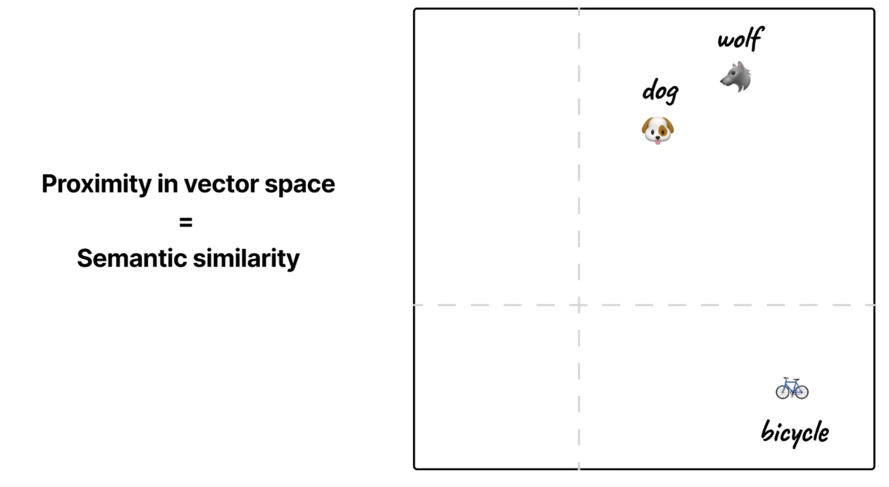

# Vector Similarity Search

## Core concept

Proximity in vector space corresponds to semantic similarity. Documents with similar meanings sit closer together in a high-dimensional space. That lets you search by meaning instead of exact text, so you can find relevant content even when wording differs.

## The process

Vector search is usually done in two phases.

**Embedding phase:** Pass all documents through an embedding model so that each becomes a vector in a shared space. Those vectors are stored (often in a vector database).

**Query phase:** Embed the search query with the same model and calculate distances to find semantically similar documents.

## Distance metrics

The way you measure "closeness" depends on the metric. Common choices:

- **Manhattan (L1):** Sum of absolute differences along each axis. Step-wise distance.

- **Euclidean (L2):** Straight-line distance between two points. Familiar from geometry.

- **Cosine similarity:** Angle between vectors (often from the origin). Ignores length and focuses on direction. Very common for text embeddings.

- **Dot product:** Reflects both angle and magnitude. Often used when vectors are already normalized so it behaves like cosine.

Which metric to use is usually specified by the embedding model. Many language-model embeddings are tuned for cosine similarity.

## Embedding model types

**Shallow algorithms:** Methods like TF-IDF (term frequency–inverse document frequency) build vectors from word counts and simple heuristics. They are fast, cheap, and interpretable. They work well for keyword-style search and smaller corpora but do not capture deep semantics.

**Deep neural networks:** Models such as BERT and other transformers produce embeddings that capture context and meaning. They handle nuance and paraphrasing better but cost more compute and are harder to interpret. Choice depends on data size, latency, and how much semantic matching you need.

## Vector database optimization

Computing distances to every vector does not scale. Vector databases therefore use **Approximate Nearest Neighbor (ANN)** methods to trade some accuracy for speed. The **index** (or index structure) is the auxiliary data structure the database builds over the vectors— for example the graph, tree, or hash tables used by the ANN algorithm, so that nearest-neighbor queries can be answered without comparing the query to every stored vector.

- **Graph-based (e.g. HNSW):** Build a graph over the vectors and traverse it to reach nearby points quickly. Hierarchical variants reduce the number of steps.
- **Partition-based (e.g. ANNOY):** Split the space into regions (e.g. with trees or clusters) and only search in promising regions.
- **Hash-based:** Use hashes so that similar items tend to land in the same buckets, then search within buckets.

No single ANN method is best for every workload. You typically need to experiment on your own data and latency requirements.

## Vector vs traditional search

**Advantages of vector search:** It matches by meaning, so a query like "dogs" can surface content about "puppies." It supports loose, semantic matching rather than exact keywords. With the right embeddings, you can mix text, images, and other modalities in one space and search across them.

**Disadvantages:** Query time and memory grow with dimensionality and index size. You must store embeddings and index structures as well as the original data. It is harder to explain why a particular document was returned. Changing the embedding model or data usually means re-embedding and rebuilding the index.

## Hybrid search strategies

Combining vector search with traditional search often works best.

- **Filter then discover:** Use filters or keyword search to narrow the set, then run vector search on that subset for relevance ranking.
- **Results fusion:** Run both systems and merge the result lists.
- **Progressive rendering:** Return fast keyword or filter results first, then stream in vector results as they become available.
- **Query routing:** Use a small classifier or rules to decide, per query, whether to use keyword, vector, or both.

## Implementation considerations

**Vector databases and extensions:** Options include dedicated stores (Pinecone, Qdrant, Milvus, ChromaDB) and extensions to general-purpose DBs (e.g. pgvector for Postgres, vector support in MongoDB).

**Experimentation:** Unlike many traditional search setups, there is no single best configuration. Embedding model, metric, ANN algorithm, and hybrid strategy all depend on your data and requirements. Plan to iterate.

**Resource planning:** Vector search uses more compute and memory than simple keyword search. Budget for embedding storage, index build time, and query latency when sizing infrastructure.
