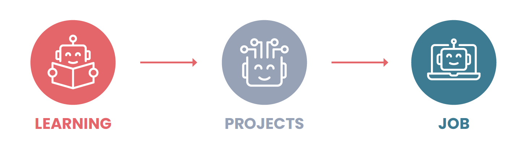

# Three Steps to Career Growth

Three key steps of career growth are learning foundational skills, working on projects (to deepen your skills, build a portfolio, and create impact), and finding a job. These steps stack on top of each other.

Initially, you focus on learning foundational skills. After having gained foundational technical skills, you will begin working on projects. During this period, you’ll also keep learning. Later, you will work on finding a job. Throughout this process, you’ll continue to learn and work on meaningful projects.
