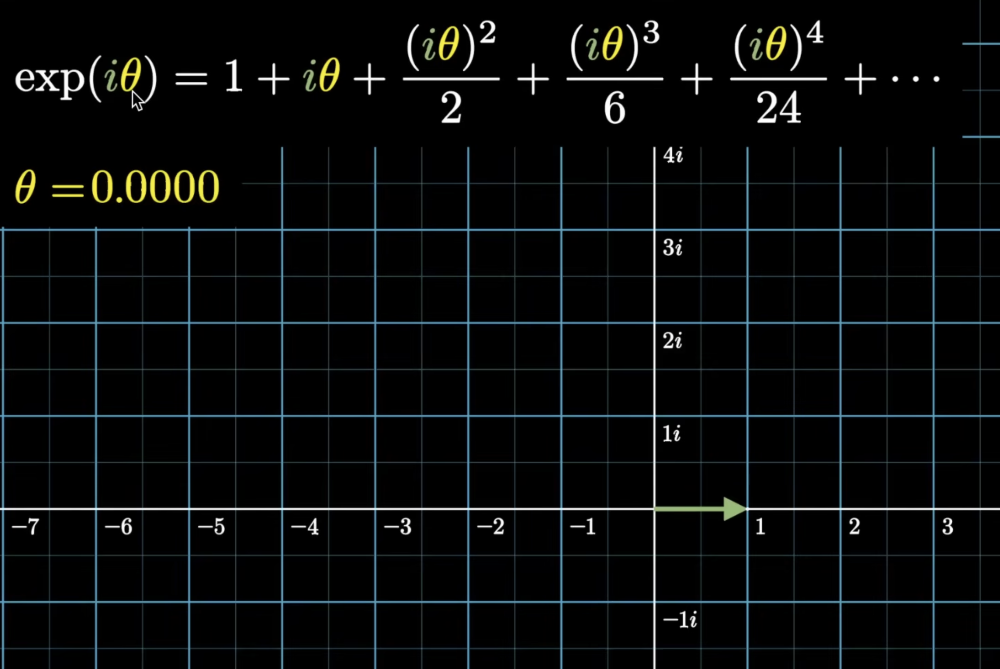
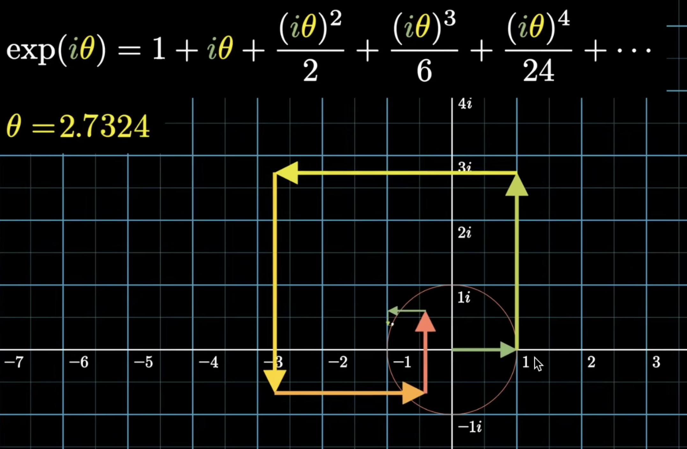
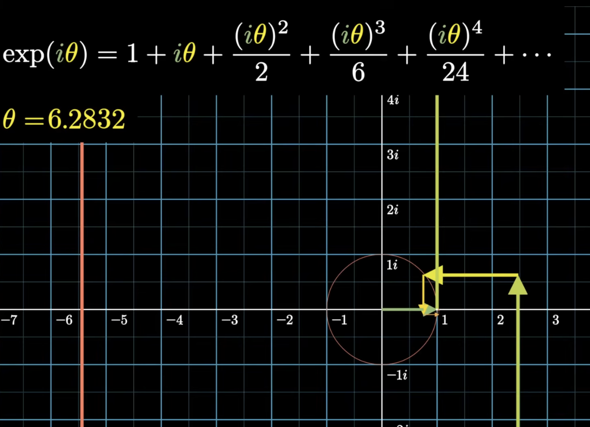

# Euler's Formula

## Introduction: Understanding $e^x$

When we first encounter the exponential function $e^x$, there's a common misconception that it means "$e$ multiplied by itself $x$ times."

The truth is that $e^x$ is really just a notation for the **exponential function** $\exp(x)$. The notation $e^x$ is convenient and familiar, but it can be misleading because it suggests repeated multiplication. In reality, $\exp(x)$ is a function defined for **all complex numbers** (including real numbers, which is a subset).

The exponential function $\exp(x)$ is defined using the **power series**:

$$\exp(x) = 1 + x + \frac{x^2}{2!} + \frac{x^3}{3!} + \frac{x^4}{4!} + \cdots = \sum_{n=0}^{\infty} \frac{x^n}{n!}$$

This is the **definition** of $\exp(x)$— it's not derived from anything else; it's how we define what the exponential function means.

From this definition, we can verify that:

$$\exp(0) = 1 + 0 + 0 + 0 + \cdots = 1$$

Also,

$$\exp(x + y) = \exp(x) \cdot \exp(y)$$

Let's prove this using the power series definition. Starting with $\exp(x + y)$:

$$\exp(x + y) = \sum_{n=0}^{\infty} \frac{(x + y)^n}{n!}$$

Using the **binomial theorem**, we can expand $(x + y)^n$:

$$(x + y)^n = \sum_{k=0}^{n} \binom{n}{k} x^k y^{n-k}$$

where $\binom{n}{k} = \frac{n!}{k!(n-k)!}$ is the binomial coefficient. Substituting this into our expression:

$$\exp(x + y) = \sum_{n=0}^{\infty} \sum_{k=0}^{n} \frac{1}{n!} \cdot \frac{n!}{k!(n-k)!} x^k y^{n-k}$$

$$= \sum_{n=0}^{\infty} \sum_{k=0}^{n} \frac{x^k}{k!} \cdot \frac{y^{n-k}}{(n-k)!}$$

Now, let's change the order of summation.

Currently, we have:

$$\sum_{n=0}^{\infty} \sum_{k=0}^{n} \frac{x^k}{k!} \cdot \frac{y^{n-k}}{(n-k)!}$$

This means: for each $n = 0, 1, 2, 3, \ldots$, we sum over all $k$ from $0$ to $n$. Let's write out a few terms explicitly:

- When $n = 0$: $k = 0$ only → term: $\frac{x^0}{0!} \cdot \frac{y^0}{0!}$

- When $n = 1$: $k = 0, 1$ → terms: $\frac{x^0}{0!} \cdot \frac{y^1}{1!}$, $\frac{x^1}{1!} \cdot \frac{y^0}{0!}$

- When $n = 2$: $k = 0, 1, 2$ → terms: $\frac{x^0}{0!} \cdot \frac{y^2}{2!}$, $\frac{x^1}{1!} \cdot \frac{y^1}{1!}$, $\frac{x^2}{2!} \cdot \frac{y^0}{0!}$

- When $n = 3$: $k = 0, 1, 2, 3$ → terms: $\frac{x^0}{0!} \cdot \frac{y^3}{3!}$, $\frac{x^1}{1!} \cdot \frac{y^2}{2!}$, $\frac{x^2}{2!} \cdot \frac{y^1}{1!}$, $\frac{x^3}{3!} \cdot \frac{y^0}{0!}$

Notice that in each term, we have $\frac{x^k}{k!} \cdot \frac{y^{n-k}}{(n-k)!}$. The key insight is that we can think of $m = n - k$ as an independent variable. Instead of fixing $n$ and letting $k$ vary from $0$ to $n$, we can think of all pairs $(k, m)$ where both $k \geq 0$ and $m \geq 0$ are independent.

When we do this, we're summing over all possible pairs $(k, m)$:

- For each $k = 0, 1, 2, 3, \ldots$

- For each $m = 0, 1, 2, 3, \ldots$

- We add the term $\frac{x^k}{k!} \cdot \frac{y^m}{m!}$

This gives us exactly the same terms as before, just organized differently! For example:

- The term $\frac{x^2}{2!} \cdot \frac{y^1}{1!}$ appears when $(k, m) = (2, 1)$, which corresponds to $n = 2 + 1 = 3$ and $k = 2$ in the original sum.

So we can rewrite:

$$\exp(x + y) = \sum_{k=0}^{\infty} \sum_{m=0}^{\infty} \frac{x^k}{k!} \cdot \frac{y^m}{m!}$$

Since the sums are independent, we can separate them:

$$\exp(x + y) = \left( \sum_{k=0}^{\infty} \frac{x^k}{k!} \right) \cdot \left( \sum_{m=0}^{\infty} \frac{y^m}{m!} \right)$$

$$= \exp(x) \cdot \exp(y)$$

This completes the proof!

## What is $\exp(1)$?

Now that we understand the exponential function, let's compute $\exp(1)$ using the power series definition:

$$\exp(1) = 1 + 1 + \frac{1^2}{2!} + \frac{1^3}{3!} + \frac{1^4}{4!} + \cdots$$

$$= 1 + 1 + 0.5 + 0.1667 + 0.0417 + 0.0083 + \cdots$$

As we add more terms, this infinite sum converges to a specific number. This number is called **$e$**, and it's approximately:

$$e = \exp(1) \approx 2.71828\ldots$$

**So $e$ is simply defined as $\exp(1)$— the value of the exponential function at $x = 1$.**

Similarly, let's compute $\exp(2)$:

$$\exp(2) = 1 + 2 + \frac{2^2}{2!} + \frac{2^3}{3!} + \frac{2^4}{4!} + \frac{2^5}{5!} + \cdots$$

$$= 1 + 2 + 2 + 1.3333 + 0.6667 + 0.2667 + \cdots$$

As we add more terms, this converges to approximately:

$$\exp(2) \approx 7.38906\ldots$$

Notice that $\exp(2) = \exp(1 + 1) = \exp(1) \cdot \exp(1) = e \cdot e = e^2 \approx (2.71828)^2 \approx 7.38906$, which matches our computation!

Now let's compute $\exp(3)$:

$$\exp(3) = 1 + 3 + \frac{3^2}{2!} + \frac{3^3}{3!} + \frac{3^4}{4!} + \frac{3^5}{5!} + \cdots$$

$$= 1 + 3 + 4.5 + 4.5 + 3.375 + 2.025 + \cdots$$

This converges to approximately:

$$\exp(3) \approx 20.0855\ldots$$

Again, we can verify using the functional equation: $\exp(3) = \exp(1 + 1 + 1) = \exp(1) \cdot \exp(1) \cdot \exp(1) = e \cdot e \cdot e = e^3 \approx (2.71828)^3 \approx 20.0855$, which matches!

## Where does the notation $e^x$ come from?

We've seen that for natural numbers like $2$ and $3$, we have $\exp(2) = e^2$ and $\exp(3) = e^3$. But where does this notation $e^x$ come from, and does it work for **all** real numbers?

The answer is: **for real numbers $x$, we can indeed write $\exp(x) = e^x$**, where $e = \exp(1)$. This is where the notation $e^x$ comes from!

Let's see why this works. For any real number $x$, we can use the functional equation $\exp(x + y) = \exp(x) \cdot \exp(y)$ repeatedly. For example:

- For a natural number $n$: $\exp(n) = \exp(1 + 1 + \cdots + 1) = \exp(1) \cdot \exp(1) \cdots \exp(1) = e \cdot e \cdots e = e^n$

- For a rational number like $\frac{p}{q}$ (where $p$ and $q$ are integers, $q \neq 0$): 
  
First, let's consider $\left(\exp\left(\frac{p}{q}\right)\right)^q$. Using the functional equation repeatedly:
  
$$\left(\exp\left(\frac{p}{q}\right)\right)^q = \exp\left(\frac{p}{q}\right) \cdot \exp\left(\frac{p}{q}\right) \cdots \exp\left(\frac{p}{q}\right) \text{ (q times)}$$
  
$$= \exp\left(\frac{p}{q} + \frac{p}{q} + \cdots + \frac{p}{q}\right) \text{ (q terms)}$$
  
$$= \exp\left(q \cdot \frac{p}{q}\right) = \exp(p)$$
  
Since $p$ is an integer, we already know from the natural number case that $\exp(p) = e^p$. Therefore:
  
$$\left(\exp\left(\frac{p}{q}\right)\right)^q = e^p$$
  
Taking the $q$-th root of both sides, we get:
  
$$\exp\left(\frac{p}{q}\right) = (e^p)^{1/q} = e^{p/q}$$

- For any real number $x$: Through a limiting process (using the fact that any real number can be approximated by rational numbers), we can show that $\exp(x) = e^x$

**The key point is: the notation $e^x$ makes sense only for real $x$.** For real $x$, we define $e^x$ to mean $\exp(x)$, and this works because $\exp(x)$ behaves exactly like "$e$ raised to the power $x$" would behave if we could make sense of that operation.

**However, when we extend to complex numbers, the notation $e^z$ (where $z$ is complex) is still used as shorthand for $\exp(z)$, but it's important to remember that this is just notation— we're not actually raising $e$ to a complex power in the traditional sense.** The fundamental function is $\exp(z)$, defined by the power series, and $e^z$ is just convenient notation (**and bad notation**).

So to summarize:

- **For real $x$**: $\exp(x) = e^x$ where $e = \exp(1)$, and this is where the notation comes from

- **For complex $z$**: $e^z$ is just **bad** notation for $\exp(z)$; it's not "e raised to a complex power" in the traditional sense

- **The fundamental function**: $\exp(z)$ defined by the power series is what everything is based on

## Extending $\exp()$ to Complex Numbers

Now let's explore what happens when we plug complex numbers into the exponential function. But first, let's consider a warm up question.

**Example:** For what values of $n$ does $i^n = -i$?

We know that $i^3 = -i$, so $n = 3$ is one solution. But are there others? Let's look at the pattern of powers of $i$:

- $i^0 = 1$
- $i^1 = i$
- $i^2 = -1$
- $i^3 = -i$
- $i^4 = 1$
- $i^5 = i$
- $i^6 = -1$
- $i^7 = -i$
- $i^8 = 1$
- $\ldots$

We can see that the powers of $i$ cycle every 4: $1, i, -1, -i, 1, i, -1, -i, \ldots$

So $i^n = -i$ when $n = \ldots, -9, -5, -1, 3, 7, 11, 15, \ldots$ In general, $i^n = -i$ when:

$$n = 4k - 1 \quad \text{for any integer } k$$

This means there are **infinitely many** values of $n$ (all integers of the form $4k - 1$) for which $i^n = -i$.

Now, let's consider what happens when we plug a purely imaginary number into the exponential function. Specifically, let's compute $\exp(i\theta)$ where $\theta$ is any real number.

Using the power series definition:

$$\exp(i\theta) = 1 + i\theta + \frac{(i\theta)^2}{2!} + \frac{(i\theta)^3}{3!} + \frac{(i\theta)^4}{4!} + \frac{(i\theta)^5}{5!} + \cdots$$

Since $i^2 = -1$, $i^3 = -i$, $i^4 = 1$, and the pattern repeats, we can simplify the powers of $i$:

$$\exp(i\theta) = 1 + i\theta - \frac{\theta^2}{2!} - i\frac{\theta^3}{3!} + \frac{\theta^4}{4!} + i\frac{\theta^5}{5!} - \cdots$$

This is a complex number with a real part and an imaginary part. But here's a remarkable fact: **for any real number $\theta$, the complex number $\exp(i\theta)$ always lies on the unit circle in the complex plane.**

What does this mean? In the complex plane, the unit circle is the set of all complex numbers whose distance from the origin is exactly 1. In other words, if we write $\exp(i\theta) = a + bi$ (where $a$ and $b$ are real numbers), then:

$$a^2 + b^2 = 1$$

This means that no matter what real value $\theta$ takes, when we compute $\exp(i\theta)$, the result is always a point on the unit circle— a complex number with magnitude exactly equal to 1.

As $\theta$ varies over all real numbers, $\exp(i\theta)$ traces out the entire unit circle. Different values of $\theta$ correspond to different points on the circle, with $\theta$ essentially telling us "how far around" the circle we've traveled from the starting point $\exp(0) = 1$.

## Deriving Euler's Formula

We've established that $\exp(i\theta)$ always lies on the unit circle for any real $\theta$. But what are the exact coordinates of this point on the circle?

It turns out that when we separate the power series for $\exp(i\theta)$ into its real and imaginary parts, we get something remarkable. The real part of $\exp(i\theta)$ is:

$$1 - \frac{\theta^2}{2!} + \frac{\theta^4}{4!} - \frac{\theta^6}{6!} + \cdots$$

And the imaginary part is:

$$\theta - \frac{\theta^3}{3!} + \frac{\theta^5}{5!} - \frac{\theta^7}{7!} + \cdots$$

These infinite series are exactly the power series definitions of $\cos(\theta)$ and $\sin(\theta)$ respectively! This gives us **Euler's formula**:

$$\exp(i\theta) = \cos(\theta) + i\sin(\theta)$$

Or, using the (admittedly bad) notation $e^{i\theta}$:

$$e^{i\theta} = \cos(\theta) + i\sin(\theta)$$

This is one of the most beautiful and important formulas in all of mathematics. It connects the exponential function, complex numbers, and trigonometry in a single elegant equation.

What Euler's formula tells us is that when we compute $\exp(i\theta)$, we get a complex number whose:

- **Real part** is $\cos(\theta)$—the $x$-coordinate of the point on the unit circle

- **Imaginary part** is $\sin(\theta)$—the $y$-coordinate of the point on the unit circle

This perfectly explains why $\exp(i\theta)$ always lies on the unit circle. Also, $\cos^2(\theta) + \sin^2(\theta) = 1$ for all $\theta$, which means the point $(\cos(\theta), \sin(\theta))$ is always exactly one unit away from the origin.

As $\theta$ increases, $\exp(i\theta)$ moves counterclockwise around the unit circle, with $\theta$ representing the angle (in radians) measured from the positive real axis. When $\theta = 0$, we're at the point $(1, 0)$ on the real axis. When $\theta = \frac{\pi}{2}$, we're at $(0, 1)$ on the imaginary axis. When $\theta = \pi$, we're at $(-1, 0)$, and so on.

## Solutions to $e^z = b$

Let's start this discussion with an example.

**Example:** Euler's formula allows us to evaluate seemingly impossible expressions like $i^i$. Let's see how!

First, we need to express $i$ in exponential form. Using Euler's formula:

$$i = 0 + 1i = \cos\left(\frac{\pi}{2}\right) + i\sin\left(\frac{\pi}{2}\right) = e^{i\pi/2}$$

Now, we can compute $i^i$:

$$i^i = (e^{i\pi/2})^i = e^{i^2 \pi/2} = e^{-\pi/2}$$

Since $i^2 = -1$, we get:

$$i^i = e^{-\pi/2} \approx 0.2079\ldots$$

**Remarkable result:** $i^i$ is a **real number**! This is one of the most surprising and beautiful consequences of Euler's formula.

**Note on multiple values:** Since $e^{i\theta}$ is periodic with period $2\pi$, we have $i = e^{i(\pi/2 + 2\pi k)}$ for any integer $k$. Therefore:

$$i^i = e^{-\pi/2 - 2\pi k} \quad \text{for any integer } k$$

The **principal value** (when $k = 0$) is $e^{-\pi/2} \approx 0.2079$. All other values are also real numbers, but they're different real numbers!

- When $k = 0$: $i^i = e^{-\pi/2} \approx 0.2079$ (principal value)
- When $k = 1$: $i^i = e^{-\pi/2 - 2\pi} = e^{-5\pi/2} \approx 0.000388$ (much smaller)
- When $k = -1$: $i^i = e^{-\pi/2 + 2\pi} = e^{3\pi/2} \approx 111.32$ (much larger)
- When $k = 2$: $i^i = e^{-\pi/2 - 4\pi} = e^{-9\pi/2} \approx 0.00000151$ (even smaller)

As $k$ increases (becomes more positive), the values get exponentially smaller. As $k$ decreases (becomes more negative), the values get exponentially larger. All of these are valid real values of $i^i$.

The $i^i$ example illustrates a fundamental property of the complex exponential function: **the equation $e^z = b$ has infinitely many solutions for any nonzero complex number $b$**.

This is because $e^z$ is periodic with period $2\pi i$. If $e^z = b$, then for any integer $k$:

$$e^{z + 2\pi i k} = e^z \cdot e^{2\pi i k} = e^z \cdot 1 = b$$

So if $r$ is a solution to $e^z = b$, then $r + 2\pi i k$ is also a solution for any integer $k$.

**Example: $e^z = 2$**

Suppose we want to solve $e^z = 2$ for complex $z$.

One solution is $z = \ln(2)$ (the real logarithm). But since $e^z$ is periodic with period $2\pi i$, we have infinitely many solutions:

$$z = \ln(2) + 2\pi i k \quad \text{for any integer } k$$

- When $k = 0$: $z = \ln(2) \approx 0.693$ (real solution)

- When $k = 1$: $z = \ln(2) + 2\pi i \approx 0.693 + 6.283i$

- When $k = -1$: $z = \ln(2) - 2\pi i \approx 0.693 - 6.283i$

- And so on...

**Example: $e^z = i$**

To solve $e^z = i$, we can use Euler's formula. We know that $i = e^{i\pi/2}$.

So one solution is $z = i\pi/2$. But again, we have infinitely many solutions:

$$z = i\pi/2 + 2\pi i k = i(\pi/2 + 2\pi k) \quad \text{for any integer } k$$

- When $k = 0$: $z = i\pi/2$

- When $k = 1$: $z = i(5\pi/2)$

- When $k = -1$: $z = i(-3\pi/2)$

- And so on...

**Example: $e^z = -1$**

To solve $e^z = -1$, we know from Euler's formula that $-1 = e^{i\pi}$.

So the solutions are:

$$z = i\pi + 2\pi i k = i\pi(1 + 2k) \quad \text{for any integer } k$$

- When $k = 0$: $z = i\pi$

- When $k = 1$: $z = 3i\pi$

- When $k = -1$: $z = -i\pi$

- And so on...

**General Case: $e^z = b$ for any complex number $b$**

For any nonzero complex number $b$, we can write $b$ in **polar form**: $b = |b|e^{i\theta}$ where $|b|$ is the magnitude and $\theta$ is the argument.

**What is polar form?**

The polar form of a complex number expresses it in terms of its distance from the origin (magnitude) and its angle from the positive real axis (argument).

If we have a complex number $b = a + bi$ (where $a$ and $b$ are real numbers), then:

- **Magnitude**: $|b| = \sqrt{a^2 + b^2}$ (the distance from the origin)

- **Argument**: $\theta = \arg(b)$ (the angle in radians, measured counterclockwise from the positive real axis)

Using Euler's formula, we can write:

$$b = |b|(\cos(\theta) + i\sin(\theta)) = |b|e^{i\theta}$$

This is the **polar form** of the complex number.

**Examples:**

- For $b = 1 + i$: $|b| = \sqrt{2}$, $\theta = \pi/4$, so $b = \sqrt{2}e^{i\pi/4}$
- For $b = i$: $|b| = 1$, $\theta = \pi/2$, so $b = e^{i\pi/2}$
- For $b = -1$: $|b| = 1$, $\theta = \pi$, so $b = e^{i\pi}$
- For $b = 2$: $|b| = 2$, $\theta = 0$, so $b = 2e^{i0}$

Now, for any nonzero complex number $b$ in polar form $b = |b|e^{i\theta}$:

Then $e^z = b$ has solutions:

$$z = \ln(|b|) + i(\theta + 2\pi k) \quad \text{for any integer } k$$

where $\ln(|b|)$ is the real natural logarithm of the magnitude.

**Key insight:** For any nonzero complex number $b$, the equation $e^z = b$ has infinitely many solutions, differing by integer multiples of $2\pi i$. This is why we need to be careful when working with complex logarithms and complex powers—they are multi-valued functions.

## $\exp(x)$ as a Limit

There's another beautiful way to define the exponential function. It turns out that:

$$\exp(x) = \lim_{n \to \infty} \left(1 + \frac{x}{n}\right)^n$$

Let's derive this! We'll use the binomial theorem to expand $\left(1 + \frac{x}{n}\right)^n$ and then take the limit as $n$ approaches infinity.

Using the binomial theorem:

$$\left(1 + \frac{x}{n}\right)^n = \sum_{k=0}^{n} \binom{n}{k} \left(\frac{x}{n}\right)^k$$

$$= \sum_{k=0}^{n} \binom{n}{k} \frac{x^k}{n^k}$$

Recall that $\binom{n}{k} = \frac{n!}{k!(n-k)!}$. Let's write this out more explicitly:

$$\binom{n}{k} = \frac{n!}{k!(n-k)!} = \frac{n(n-1)(n-2)\cdots(n-k+1)}{k!}$$

So:

$$\left(1 + \frac{x}{n}\right)^n = \sum_{k=0}^{n} \frac{n(n-1)(n-2)\cdots(n-k+1)}{k!} \cdot \frac{x^k}{n^k}$$

$$= \sum_{k=0}^{n} \frac{n(n-1)(n-2)\cdots(n-k+1)}{n^k} \cdot \frac{x^k}{k!}$$

$$= \sum_{k=0}^{n} \frac{n}{n} \cdot \frac{n-1}{n} \cdot \frac{n-2}{n} \cdots \frac{n-k+1}{n} \cdot \frac{x^k}{k!}$$

Now, let's take the limit as $n \to \infty$. For each fixed $k$, we have:

$$\lim_{n \to \infty} \frac{n}{n} \cdot \frac{n-1}{n} \cdot \frac{n-2}{n} \cdots \frac{n-k+1}{n} = 1 \cdot 1 \cdot 1 \cdots 1 = 1$$

This is because each fraction like $\frac{n-j}{n} = 1 - \frac{j}{n}$ approaches $1$ as $n \to \infty$ (for any fixed $j$).

Therefore:

$$\lim_{n \to \infty} \left(1 + \frac{x}{n}\right)^n = \lim_{n \to \infty} \sum_{k=0}^{n} \frac{n(n-1)(n-2)\cdots(n-k+1)}{n^k} \cdot \frac{x^k}{k!}$$

$$= \sum_{k=0}^{\infty} \lim_{n \to \infty} \frac{n(n-1)(n-2)\cdots(n-k+1)}{n^k} \cdot \frac{x^k}{k!}$$

$$= \sum_{k=0}^{\infty} 1 \cdot \frac{x^k}{k!}$$

$$= \sum_{k=0}^{\infty} \frac{x^k}{k!} = \exp(x)$$

This completes the derivation! We've shown that:

$$\exp(x) = \lim_{n \to \infty} \left(1 + \frac{x}{n}\right)^n$$

### The connection to compound growth

This limit definition has a beautiful interpretation in terms of **compound growth** (or compound interest). Let's see how.

Imagine you have \$1 and you want to grow it at an annual rate of $x$ (where $x$ is written as a decimal, so $x = 0.1$ means 10% growth). 

If you compound $n$ times per year, applying a rate of $\frac{x}{n}$ each time:

- **Start:** You have \$1

- **After the first period:** You apply a growth rate of $\frac{x}{n}$. This means you multiply your amount by $\left(1 + \frac{x}{n}\right)$:

$$1 \cdot \left(1 + \frac{x}{n}\right) = 1 + \frac{x}{n}$$

- **After the second period:** You take the amount from the first period and multiply it by $\left(1 + \frac{x}{n}\right)$ again:

$$\left(1 + \frac{x}{n}\right) \cdot \left(1 + \frac{x}{n}\right) = \left(1 + \frac{x}{n}\right)^2$$

- **After $n$ periods:** You've multiplied by $\left(1 + \frac{x}{n}\right)$ a total of $n$ times:

$$\left(1 + \frac{x}{n}\right)^n$$

**Continuous compounding (the limit):** What happens if we compound more and more frequently? As $n \to \infty$, we're compounding continuously— every instant, the growth is being applied. This is called **continuous compounding**, and the result is:

$$\lim_{n \to \infty} \left(1 + \frac{x}{n}\right)^n = \exp(x)$$

So **$\exp(x)$ represents the final amount you get when you start with \$1 and let it grow continuously at rate $x$ for one unit of time.**

What does "one unit of time" mean? In our setup, we divided the year into $n$ equal periods. After $n$ periods, we've completed one full year. So "one unit of time" refers to the total duration over which we're compounding— in this case, one year. The rate $x$ is the annual growth rate, and $\exp(x)$ tells you how much you'll have after one year of continuous compounding at that rate.

**Example:** If you invest \$1 at a 100% annual interest rate ($x = 1$), then:

**After 1 year:**

- Compounded once per year: $(1 + 1)^1 = 2$ → You get \$2

- Compounded twice per year: $\left(1 + \frac{1}{2}\right)^2 = 2.25$ → You get \$2.25

- Compounded monthly ($n = 12$): $\left(1 + \frac{1}{12}\right)^{12} \approx 2.613$ → You get about \$2.61

- Compounded daily ($n = 365$): $\left(1 + \frac{1}{365}\right)^{365} \approx 2.715$ → You get about \$2.72

- Compounded continuously: $\exp(1) = e \approx 2.718$ → You get about \$2.72

**After 2 years:**

- Compounded once per year: $(1 + 1)^2 = 4$ → You get \$4

- Compounded twice per year: $\left(1 + \frac{1}{2}\right)^4 = 5.0625$ → You get \$5.06

- Compounded monthly ($n = 12$): $\left(1 + \frac{1}{12}\right)^{24} \approx 6.727$ → You get about \$6.73

- Compounded daily ($n = 365$): $\left(1 + \frac{1}{365}\right)^{730} \approx 7.387$ → You get about \$7.39

- Compounded continuously: $\exp(2) = e^2 \approx 7.389$ → You get about \$7.39

Notice how as we compound more frequently, the result after one year approaches $e$ but never quite reaches it. The limit $\exp(1) = e$ represents the theoretical maximum you can achieve with continuous compounding.

This is why $e$ is sometimes called the "natural" base— it naturally arises when we consider continuous growth processes, which are ubiquitous in nature (population growth, radioactive decay, etc.).

When $x = 1$, this gives us a way to compute $e$. Note that $x = 1$ represents a 100% growth rate, which means **doubling** your money. So this limit is asking: if you start with \$1 and continuously compound at a 100% rate (doubling rate), what's the maximum amount you can get?

$$e = \exp(1) = \lim_{n \to \infty} \left(1 + \frac{1}{n}\right)^n$$

This is the classic limit definition of $e$ that you might have seen before!