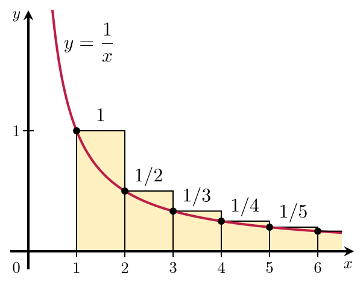

# Logarithms

## Introduction

Have you ever noticed a beautiful pattern when working with powers of 10?

- $10^1 = 10$ (one zero)

- $10^2 = 100$ (two zeros)

- $10^3 = 1,000$ (three zeros)

- $10^4 = 10,000$ (four zeros)

- $10^5 = 100,000$ (five zeros)

The exponent tells us exactly how many zeros appear in the result.

This is where logarithms come in. The **logarithm base 10** (written as $\log_{10}$ or simply $\log$) of a number answers the question: "What power do I need to raise 10 to in order to get this number?"

So when we say $\log_{10}(1000) = 3$, we're saying: "10 raised to the power of 3 equals 1000."

But here's the delightful connection: **The log base 10 of $10^n$ equals $n$, which is exactly the number of zeros in $10^n$.**

For example:

- $\log_{10}(10) = 1$ → 10 has 1 zero

- $\log_{10}(100) = 2$ → 100 has 2 zeros  

- $\log_{10}(1,000) = 3$ → 1,000 has 3 zeros

- $\log_{10}(10,000) = 4$ → 10,000 has 4 zeros

This elegant relationship makes logarithms incredibly useful for understanding the scale of numbers, especially when dealing with very large or very small values.

## Definition

The logarithm is the inverse operation of exponentiation. For any positive real base $b$ (where $b \neq 1$) and any positive real number $x$, the logarithm base $b$ of $x$ is defined as:

$$\log_b(x) = y \quad \text{if and only if} \quad b^y = x$$

where $y$ is a real number.

In words: $\log_b(x)$ answers the question "To what power must I raise $b$ to get $x$?"

**Examples**

- $\log_{10}(100) = 2$ because $10^2 = 100$
- $\log_2(8) = 3$ because $2^3 = 8$
- $\ln(e^5) = 5$ because $e^5 = e^5$
- $\log_2(16) = 4$ because $2^4 = 16$
- $\ln(e) = 1$ because $e^1 = e$
- $\log_{10}(0.01) = -2$ because $10^{-2} = 0.01$

## Product Rule

The product rule for logarithms states that the logarithm of a product equals the sum of the logarithms:

$$\log_b(xy) = \log_b(x) + \log_b(y)$$

Let's derive this rule using the definition of logarithms and the properties of exponents.

Let $m = \log_b(x)$ and $n = \log_b(y)$.

By the definition of logarithms:

- $b^m = x$

- $b^n = y$

Multiply these two equations:

$$b^m \cdot b^n = x \cdot y$$

Apply the exponent rule for multiplication (add the exponents):

$$b^{m+n} = xy$$

By the definition of logarithms, if $b^{m+n} = xy$, then:

$$\log_b(xy) = m + n$$

Substitute back $m = \log_b(x)$ and $n = \log_b(y)$:

$$\log_b(xy) = \log_b(x) + \log_b(y)$$

**Example:** Using base 10

- $\log_{10}(100 \cdot 1000) = \log_{10}(100) + \log_{10}(1000) = 2 + 3 = 5$
- We can verify: $\log_{10}(100,000) = 5$ because $10^5 = 100,000$ ✓

**Example:** Using base 2

- $\log_2(4 \cdot 8) = \log_2(4) + \log_2(8) = 2 + 3 = 5$
- We can verify: $\log_2(32) = 5$ because $2^5 = 32$ ✓

**Example:** Using natural logarithm

- $\ln(e^2 \cdot e^3) = \ln(e^2) + \ln(e^3) = 2 + 3 = 5$
- We can verify: $\ln(e^5) = 5$ because $e^5 = e^5$ ✓

**Example:** With three factors

- $\log_{10}(10 \cdot 100 \cdot 1000) = \log_{10}(10) + \log_{10}(100) + \log_{10}(1000) = 1 + 2 + 3 = 6$
- We can verify: $\log_{10}(1,000,000) = 6$ because $10^6 = 1,000,000$ ✓

**Example:** With fractions

- $\log_2(8 \cdot \frac{1}{4}) = \log_2(8) + \log_2\left(\frac{1}{4}\right) = 3 + (-2) = 1$
- We can verify: $\log_2(2) = 1$ because $2^1 = 2$ ✓

## Power Rule

The power rule for logarithms allows you to move an exponent from inside the logarithm to the front as a multiplier:

$$\log_b(x^n) = n \cdot \log_b(x)$$

Let's derive this rule using the definition of logarithms and the properties of exponents.

Let $m = \log_b(x)$.

By the definition of logarithms:

$$b^m = x$$

Raise both sides to the power $n$:

$$(b^m)^n = x^n$$

Apply the exponent rule for powers (multiply the exponents):

$$b^{mn} = x^n$$

By the definition of logarithms, if $b^{mn} = x^n$, then:

$$\log_b(x^n) = mn$$

Substitute back $m = \log_b(x)$:

$$\log_b(x^n) = n \cdot \log_b(x)$$

**Example:** Using base 10

- $\log_{10}(100^3) = 3 \cdot \log_{10}(100) = 3 \cdot 2 = 6$
- We can verify: $\log_{10}(1,000,000) = 6$ because $10^6 = 1,000,000$ ✓

**Example:** Using base 2

- $\log_2(8^2) = 2 \cdot \log_2(8) = 2 \cdot 3 = 6$
- We can verify: $\log_2(64) = 6$ because $2^6 = 64$ ✓

## Change of Base Formula

Using the power rule, we can derive an important relationship between logarithms of different bases. This relationship shows that:

$$\frac{1}{\log_b(a)} = \log_a(b)$$

Let's derive this using the power rule.

Let $m = \log_b(a)$.

By the definition of logarithms:

$$b^m = a$$

Now, let's find $\log_a(b)$. We want to express $b$ in terms of base $a$.

From $b^m = a$, we can write:

$$b = a^{1/m}$$

By the definition of logarithms, if $b = a^{1/m}$, then:

$$\log_a(b) = \frac{1}{m}$$

Substitute back $m = \log_b(a)$:

$$\log_a(b) = \frac{1}{\log_b(a)}$$

Taking the reciprocal of both sides:

$$\frac{1}{\log_b(a)} = \log_a(b)$$

This shows that the reciprocal of a logarithm equals the logarithm with the base and argument swapped.

**Example:** Converting between bases

- $\frac{1}{\log_2(8)} = \log_8(2)$
- We can verify: $\log_2(8) = 3$, so $\frac{1}{3} = \log_8(2)$
- Check: $8^{1/3} = 2$ ✓

**Example:** Using base 10 and base 2

- $\frac{1}{\log_{10}(100)} = \log_{100}(10)$
- We can verify: $\log_{10}(100) = 2$, so $\frac{1}{2} = \log_{100}(10)$
- Check: $100^{1/2} = 10$ ✓

Using the relationship we just established, we can prove the general change of base formula:

$$\log_b(x) = \frac{\log_a(x)}{\log_a(b)}$$

Let's prove this by changing base from $a$ to $b$.

Let $y = \log_a(x)$.

By the definition of logarithms:

$$a^y = x$$

Now, let's express this in terms of base $b$. We know from the previous result that:

$$\log_a(b) = \frac{1}{\log_b(a)}$$

But more directly, let's take the logarithm base $b$ of both sides of $a^y = x$:

$$\log_b(a^y) = \log_b(x)$$

Apply the power rule to the left side:

$$y \cdot \log_b(a) = \log_b(x)$$

Substitute back $y = \log_a(x)$:

$$\log_b(a) \cdot \log_a(x) = \log_b(x)$$

Now, divide both sides by $\log_b(a)$:

$$\log_a(x) = \frac{\log_b(x)}{\log_b(a)}$$

Or equivalently, using the reciprocal relationship:

$$\log_b(x) = \frac{\log_a(x)}{\log_a(b)}$$

This shows that to convert a logarithm from base $a$ to base $b$, we divide the logarithm of the argument by the logarithm of the original base, both in the new base.

**Example:** Converting to base 8

- $\log_2(64) = \frac{\log_8(64)}{\log_8(2)} = \frac{2}{\log_8(2)}$
- We can verify: $\log_2(64) = 6$ because $2^6 = 64$ ✓
- Also: $\log_8(2) = \frac{1}{3}$, so $\frac{2}{1/3} = 6$ ✓

**Example:** Evaluate the sum

$$\frac{1}{\log_2(100!)} + \frac{1}{\log_3(100!)} + \frac{1}{\log_4(100!)} + \cdots + \frac{1}{\log_{100}(100!)}$$

**Solution:**

Using the reciprocal relationship $\frac{1}{\log_b(a)} = \log_a(b)$, we can rewrite each term:

$$\frac{1}{\log_2(100!)} = \log_{100!}(2)$$

$$\frac{1}{\log_3(100!)} = \log_{100!}(3)$$

$$\frac{1}{\log_4(100!)} = \log_{100!}(4)$$

$$\vdots$$

$$\frac{1}{\log_{100}(100!)} = \log_{100!}(100)$$

So the sum becomes:

$$\log_{100!}(2) + \log_{100!}(3) + \log_{100!}(4) + \cdots + \log_{100!}(100)$$

Using the product rule for logarithms:

$$\log_{100!}(2) + \log_{100!}(3) + \cdots + \log_{100!}(100) = \log_{100!}(2 \cdot 3 \cdot 4 \cdots 100)$$

Since $2 \cdot 3 \cdot 4 \cdots 100 = 100!$, we have:

$$\log_{100!}(100!) = 1$$

Therefore, the sum equals **1**.

## What is special about the natural log?

The natural logarithm $\ln(x)$ has many special properties, but one of the most beautiful is its connection to infinite series. Let's explore a remarkable result.

Consider the **harmonic series**:

$$1 + \frac{1}{2} + \frac{1}{3} + \frac{1}{4} + \frac{1}{5} + \cdots + \frac{1}{N}$$

This series diverges (grows without bound) as $N$ increases. 

Precisely, as $N$ approaches infinity, the difference between the harmonic sum and $\ln(N)$ approaches a constant called **Euler's constant** (denoted $\gamma$):

$$\lim_{N \to \infty} \left(1 + \frac{1}{2} + \frac{1}{3} + \cdots + \frac{1}{N} - \ln(N)\right) = \gamma \approx 0.57721\ldots$$

So for large $N$:

$$1 + \frac{1}{2} + \frac{1}{3} + \cdots + \frac{1}{N} \approx \ln(N) + \gamma$$

**Example:** Expressed as a power of 10, what is the smallest $N$ such that the harmonic series is larger than 1,000,000?

**Solution:**

We want to find the smallest $N$ such that:

$$1 + \frac{1}{2} + \frac{1}{3} + \cdots + \frac{1}{N} > 1,000,000$$

Using the approximation for large $N$:

$$\ln(N) + \gamma \approx 1,000,000$$

Since $\gamma \approx 0.577$ is much smaller than 1,000,000, we can approximate:

$$\ln(N) \approx 1,000,000$$

To express $N$ as a power of 10, we use the change of base formula. Recall that $\ln(N) = \frac{\log_{10}(N)}{\log_{10}(e)}$, or equivalently:

$$\ln(N) = \log_{10}(N) \cdot \ln(10)$$

So:

$$\log_{10}(N) \cdot \ln(10) \approx 1,000,000$$

Since $\ln(10) \approx 2.302585$, we have:

$$\log_{10}(N) \approx \frac{1,000,000}{2.302585} \approx 434,294.48$$

Therefore:

$$N \approx 10^{434,294.48} \approx 10^{434,294}$$

So the smallest $N$ (expressed as a power of 10) such that the harmonic series exceeds 1,000,000 is approximately **$10^{434,294}$**.

This demonstrates the extremely slow growth of the harmonic series—it takes an astronomically large number of terms to reach even 1,000,000!

### The Family of Functions $e^{rx}$ and its equivalence to $a^x$

Consider the family of functions:

$$f(x) = e^{rx}$$

where $r$ is a real parameter. This family includes many important functions:

- When $r = 0$: $e^{0x} = e^0 = 1$ (constant function)
- When $r = 1$: $e^{1x} = e^x$ (the natural exponential)
- When $r = 2$: $e^{2x}$ (exponential growth with rate 2)
- When $r = -1$: $e^{-x}$ (exponential decay)
- When $r = \ln(2)$: $e^{\ln(2)x} = (e^{\ln(2)})^x = 2^x$

The parameter $r$ controls the growth (or decay) rate of the function. When $r > 0$, the function grows exponentially; when $r < 0$, it decays exponentially.

Remarkably, **every exponential function $a^x$ (where $a > 0$ and $a \neq 1$) can be expressed in the form $e^{rx}$ for some value of $r$.**

To see this, let's find the value of $r$ such that $e^{rx} = a^x$ for all $x$.

If $e^{rx} = a^x$, then for $x = 1$:

$$e^r = a$$

Taking the natural logarithm of both sides:

$$r = \ln(a)$$

Therefore:

$$a^x = e^{\ln(a) \cdot x} = e^{rx} \quad \text{where } r = \ln(a)$$

This shows that **any exponential function $a^x$ is equivalent to $e^{rx}$ where $r = \ln(a)$.**

**Examples:**

- $2^x = e^{\ln(2)x} = e^{0.693x}$ (approximately)
- $10^x = e^{\ln(10)x} = e^{2.303x}$ (approximately)
- $e^x = e^{\ln(e)x} = e^{1 \cdot x} = e^x$ (as expected)
- $\left(\frac{1}{2}\right)^x = 2^{-x} = e^{\ln(2)(-x)} = e^{-0.693x}$ (exponential decay)

### The Family of Functions $\pi^{rx}$ and its equivalence to $a^x$

Similarly, we can express any exponential function $a^x$ using the family of functions $\pi^{rx}$ where $\pi$ is the mathematical constant (approximately 3.14159...).

To find the value of $r$ such that $\pi^{rx} = a^x$ for all $x$, we set $x = 1$:

$$\pi^r = a$$

Taking the logarithm base $\pi$ of both sides:

$$r = \log_{\pi}(a)$$

Therefore:

$$a^x = \pi^{\log_{\pi}(a) \cdot x} = \pi^{rx} \quad \text{where } r = \log_{\pi}(a)$$

This shows that **any exponential function $a^x$ is also equivalent to $\pi^{rx}$ where $r = \log_{\pi}(a)$.**

**Examples:**

- $2^x = \pi^{\log_{\pi}(2)x} = \pi^{0.605x}$ (approximately, since $\log_{\pi}(2) = \frac{\ln(2)}{\ln(\pi)} \approx \frac{0.693}{1.145} \approx 0.605$)
- $10^x = \pi^{\log_{\pi}(10)x} = \pi^{2.011x}$ (approximately, since $\log_{\pi}(10) = \frac{\ln(10)}{\ln(\pi)} \approx \frac{2.303}{1.145} \approx 2.011$)
- $e^x = \pi^{\log_{\pi}(e)x} = \pi^{0.874x}$ (approximately, since $\log_{\pi}(e) = \frac{\ln(e)}{\ln(\pi)} = \frac{1}{1.145} \approx 0.874$)
- $\pi^x = \pi^{\log_{\pi}(\pi)x} = \pi^{1 \cdot x} = \pi^x$ (as expected)

**Key Insight:** In fact, we can use **any positive base $b$ (where $b \neq 1$)** to express $a^x$ in the form $b^{rx}$:

$$a^x = b^{\log_b(a) \cdot x} = b^{rx} \quad \text{where } r = \log_b(a)$$

### Why is $e^x$ so special?

Even though we can express any exponential function using any base, **$e^x$ has a unique and beautiful property that makes it the natural choice**: its derivative is itself.

Let's compare the derivatives of exponential functions with different bases.

**For $e^x$:**

$$\frac{d}{dx}e^x = e^x$$

The derivative of $e^x$ is simply $e^x$ itself—no constant factors, no complications. This is elegantly simple!

**For $\pi^x$:**

To find the derivative of $\pi^x$, we can use the chain rule. First, express $\pi^x$ in terms of $e$:

$$\pi^x = e^{\ln(\pi) \cdot x}$$

Now take the derivative:

$$\frac{d}{dx}\pi^x = \frac{d}{dx}e^{\ln(\pi) \cdot x} = \ln(\pi) \cdot e^{\ln(\pi) \cdot x} = \ln(\pi) \cdot \pi^x$$

**For a general base $a^x$:**

Similarly, we can show that:

$$\frac{d}{dx}a^x = \ln(a) \cdot a^x$$

**Why this matters:**

The fact that $\frac{d}{dx}e^x = e^x$ (with no extra constant factor) means that **the constants in expressions like $e^{rx}$ have direct, readable meanings**:

**$e^{rx}$ for growth and decay:** In the expression $e^{rx}$, the parameter $r$ directly represents the growth rate (when $r > 0$) or decay rate (when $r < 0$). This is because the derivative of $e^{rx}$ is $\frac{d}{dx}e^{rx} = r \cdot e^{rx}$, so the relative rate of change (the derivative divided by the function value) is exactly $r$: $\frac{d}{dx}(e^{rx}) / e^{rx} = r$. For example:
   
- $e^{0.05t}$ represents continuous growth at 5% per unit time
   
- $e^{-0.02t}$ represents exponential decay with rate constant $0.02$

Suppose we want to express the same growth function using base $\pi$ instead of base $e$. We need to find $r'$ such that:
   
$$\pi^{r'x} = e^{rx}$$
   
Taking the natural logarithm of both sides:
   
$$\ln(\pi^{r'x}) = \ln(e^{rx})$$
   
$$r'x \cdot \ln(\pi) = rx \cdot \ln(e) = rx$$
   
Solving for $r'$:
   
$$r' = \frac{r}{\ln(\pi)}$$
   
So if we want to represent a 5% growth rate ($r = 0.05$) using base $\pi$, we'd need to write:
   
$$\pi^{0.05/\ln(\pi) \cdot x} = \pi^{0.0434x}$$
   
The rate constant $0.0434$ no longer directly represents the 5% growth rate—it's been divided by $\ln(\pi) \approx 1.145$. This obscures the physical meaning: you can't immediately see that this represents 5% growth without doing the conversion back. With $e^{0.05x}$, the meaning is immediately clear.

**$\exp(it)$ for oscillations:** By Euler's formula, $e^{i\omega t} = \cos(\omega t) + i\sin(\omega t)$. This expression describes a point moving counter-clockwise on the unit circle in the complex plane, representing circular motion. As $t$ increases, the vector rotates with angular frequency $\omega$, completing one full rotation when $\omega t = 2\pi$ (i.e., when $t = \frac{2\pi}{\omega}$, which is the period of oscillation).

The parameter $\omega$ directly represents the angular frequency—the rate at which the vector rotates. If we used a different base like $\pi^{i\omega t}$, we'd need to write $\pi^{i\omega' t}$ where $\omega' = \frac{\omega}{\ln(\pi)}$, obscuring the direct physical interpretation of the frequency. With $e^{i\omega t}$, the meaning of $\omega$ is immediately clear: it's the angular frequency in radians per unit time.

**$e^{-x^2}$ and $e^{-x^2/2\sigma^2}$ for Gaussians:** In probability and statistics, the Gaussian (normal) distribution uses $e^{-x^2/2\sigma^2}$, where $\sigma$ directly represents the standard deviation. The factor of $1/2$ in the exponent comes naturally from the properties of $e^x$, making the relationship between the variance $\sigma^2$ and the distribution shape clear.

If we used a different base, these constants would be multiplied by logarithms, making their physical or mathematical meanings less intuitive. **The simplicity of $e^x$'s derivative ensures that parameters in exponential expressions retain their direct, interpretable meanings.**

### But why is the derivative of $e^x$ itself?

Let's derive the derivative of $a^x$ (where $a > 0$ and $a \neq 1$) using the limit definition of the derivative:

$$f'(x) = \lim_{h \to 0} \frac{f(x+h) - f(x)}{h}$$

For $f(x) = a^x$, we have:

$$f'(x) = \lim_{h \to 0} \frac{a^{x+h} - a^x}{h}$$

Using the property $a^{x+h} = a^x \cdot a^h$, we can factor out $a^x$:

$$f'(x) = \lim_{h \to 0} \frac{a^x \cdot a^h - a^x}{h} = \lim_{h \to 0} \frac{a^x(a^h - 1)}{h}$$

Since $a^x$ doesn't depend on $h$, we can factor it out of the limit:

$$f'(x) = a^x \lim_{h \to 0} \frac{a^h - 1}{h}$$

Now we need to evaluate the limit $\lim_{h \to 0} \frac{a^h - 1}{h}$.

**Approach 1: Defining $e$ to make the derivative simple**

We can define the number $e$ to be the unique positive number such that:

$$\lim_{h \to 0} \frac{e^h - 1}{h} = 1$$

This definition ensures that when we compute the derivative of $e^x$:

$$\frac{d}{dx}e^x = e^x \lim_{h \to 0} \frac{e^h - 1}{h} = e^x \cdot 1 = e^x$$

So by defining $e$ this way, we obtain the beautiful result that **$e^x$ is its own derivative**.

For a general base $a$, we have:

$$\frac{d}{dx}a^x = a^x \lim_{h \to 0} \frac{a^h - 1}{h}$$

The limit $\lim_{h \to 0} \frac{a^h - 1}{h}$ depends on $a$. For $a = e$, it equals 1 (by definition). For other values of $a$, this limit equals $\ln(a)$, which we can show using the relationship between $a$ and $e$.

To show this, we express $a$ in terms of $e$:

$$a = e^{\ln(a)}$$

Therefore:

$$a^h = (e^{\ln(a)})^h = e^{h \ln(a)}$$

Now we can evaluate the limit:

$$\lim_{h \to 0} \frac{a^h - 1}{h} = \lim_{h \to 0} \frac{e^{h \ln(a)} - 1}{h}$$

Let's make a substitution. Let $u = h \ln(a)$, so $h = \frac{u}{\ln(a)}$. As $h \to 0$, we also have $u \to 0$. Substituting:

$$\lim_{h \to 0} \frac{e^{h \ln(a)} - 1}{h} = \lim_{u \to 0} \frac{e^u - 1}{u/\ln(a)} = \lim_{u \to 0} \ln(a) \cdot \frac{e^u - 1}{u}$$

Since $\ln(a)$ is a constant, we can factor it out:

$$= \ln(a) \cdot \lim_{u \to 0} \frac{e^u - 1}{u}$$

But we know that $\lim_{u \to 0} \frac{e^u - 1}{u} = 1$ (this is how we defined $e$). Therefore:

$$\lim_{h \to 0} \frac{a^h - 1}{h} = \ln(a) \cdot 1 = \ln(a)$$

This completes the proof! For any base $a$, we have:

$$\frac{d}{dx}a^x = a^x \cdot \ln(a)$$

**Approach 2: Defining $\exp(x)$ as a power series (a better approach)**

A more fundamental approach is to first define the exponential function using a power series:

$$\exp(x) = 1 + x + \frac{x^2}{2!} + \frac{x^3}{3!} + \frac{x^4}{4!} + \cdots = \sum_{n=0}^{\infty} \frac{x^n}{n!}$$

This definition has several advantages:

- It works for **all complex numbers** $x$, not just real numbers

- It's a well-defined function from the start

- It doesn't depend on any prior definition of $e$

From this power series definition, we can verify two key properties:

1. **$\exp(0) = 1$**: When $x = 0$, all terms except the first vanish, so $\exp(0) = 1$.

2. **$\exp(a + b) = \exp(a) \cdot \exp(b)$**: This can be proven using the power series and the binomial theorem (as shown in the [Euler's Formula section](eulers_formula.md#introduction-understanding-ex)).

Now, we can **define $e$ to be $\exp(1)$**:

$$e = \exp(1) = 1 + 1 + \frac{1}{2!} + \frac{1}{3!} + \frac{1}{4!} + \cdots \approx 2.71828\ldots$$

Since we have the two properties, we can show that for any real number $x$, we have $\exp(x) = e^x$ (where $e = \exp(1)$).

Now let's show that $\frac{d}{dx}e^x = e^x$ using this definition.

We differentiate the power series term by term:

$$\frac{d}{dx}e^x = \frac{d}{dx}\exp(x) = \frac{d}{dx}\left(1 + x + \frac{x^2}{2!} + \frac{x^3}{3!} + \frac{x^4}{4!} + \cdots\right)$$

Differentiating term by term (which is valid for power series within their radius of convergence):

$$= 0 + 1 + \frac{2x}{2!} + \frac{3x^2}{3!} + \frac{4x^3}{4!} + \cdots$$

Simplifying:

$$= 1 + \frac{x}{1!} + \frac{x^2}{2!} + \frac{x^3}{3!} + \cdots$$

But this is exactly the power series for $\exp(x) = e^x$. Therefore:

$$\frac{d}{dx}e^x = e^x$$

**Why this approach is better:**

1. **Works for complex numbers**: The power series definition naturally extends to complex arguments, which is essential for Euler's formula $e^{i\theta} = \cos(\theta) + i\sin(\theta)$.

2. **More fundamental**: We don't need to assume anything about limits or the existence of $e$ beforehand. The function is defined directly.

### The Natural Logarithm $\ln(x)$

Now that we understand the exponential function $\exp(x) = e^x$, we can define its inverse: the **natural logarithm** $\ln(x)$.

The natural logarithm $\ln(x)$ is defined as the inverse function of $e^x$. That is, for any positive real number $x$:

$$y = \ln(x) \quad \text{if and only if} \quad e^y = x$$

In words: $\ln(x)$ answers the question "To what power must I raise $e$ to get $x$?"

**Examples:**

- $\ln(e) = 1$ because $e^1 = e$
- $\ln(1) = 0$ because $e^0 = 1$
- $\ln(e^2) = 2$ because $e^2 = e^2$
- $\ln\left(\frac{1}{e}\right) = -1$ because $e^{-1} = \frac{1}{e}$

Let's find the derivative of $\ln(x)$ using the limit definition of the derivative:

$$f'(x) = \lim_{h \to 0} \frac{f(x+h) - f(x)}{h}$$

For $f(x) = \ln(x)$, we have:

$$\frac{d}{dx}\ln(x) = \lim_{h \to 0} \frac{\ln(x+h) - \ln(x)}{h}$$

Using the quotient rule for logarithms, $\ln(x+h) - \ln(x) = \ln\left(\frac{x+h}{x}\right) = \ln\left(1 + \frac{h}{x}\right)$:

$$\frac{d}{dx}\ln(x) = \lim_{h \to 0} \frac{\ln\left(1 + \frac{h}{x}\right)}{h}$$

Let's make a substitution. Let $u = \frac{h}{x}$, so $h = ux$. As $h \to 0$, we also have $u \to 0$. Substituting:

$$\frac{d}{dx}\ln(x) = \lim_{u \to 0} \frac{\ln(1 + u)}{ux} = \frac{1}{x} \lim_{u \to 0} \frac{\ln(1 + u)}{u}$$

Now, let $v = \ln(1 + u)$, so $e^v = 1 + u$, which means $u = e^v - 1$. As $u \to 0$, we have $v \to 0$ (since $\ln(1) = 0$).

Substituting:

$$\lim_{u \to 0} \frac{\ln(1 + u)}{u} = \lim_{v \to 0} \frac{v}{e^v - 1} = \lim_{v \to 0} \frac{1}{\frac{e^v - 1}{v}} = \frac{1}{1} = 1$$

Therefore:

$$\lim_{u \to 0} \frac{\ln(1 + u)}{u} = 1$$

Substituting back into our derivative:

$$\frac{d}{dx}\ln(x) = \frac{1}{x} \cdot 1 = \frac{1}{x}$$

**Result:**

$$\frac{d}{dx}\ln(x) = \frac{1}{x}$$

### The area under $\frac{1}{x}$ and its connection to the Harmonic Series

Now that we know $\frac{d}{dx}\ln(x) = \frac{1}{x}$, we can use the **Fundamental Theorem of Calculus** to find the area under the curve $y = \frac{1}{x}$ from $x = 1$ to $x = N$, where $N$ is a positive integer.

The Fundamental Theorem of Calculus states that if $F'(x) = f(x)$, then:

$$\int_a^b f(x) \, dx = F(b) - F(a)$$

Since $\frac{d}{dx}\ln(x) = \frac{1}{x}$, we have:

$$\int_1^N \frac{1}{x} \, dx = \ln(N) - \ln(1) = \ln(N) - 0 = \ln(N)$$

**Result:**

The area under the curve $y = \frac{1}{x}$ from $x = 1$ to $x = N$ is exactly $\ln(N)$:

$$\int_1^N \frac{1}{x} \, dx = \ln(N)$$

This result connects beautifully to the harmonic series we discussed earlier. The area under $\frac{1}{x}$ from $1$ to $N$ can be approximated by rectangles.

In fact, we showed earlier that:

$$1 + \frac{1}{2} + \frac{1}{3} + \cdots + \frac{1}{N} \approx \ln(N) + \gamma$$

where $\gamma \approx 0.57721\ldots$ is Euler's constant. This makes sense: the harmonic series is approximately the integral plus a constant correction term.