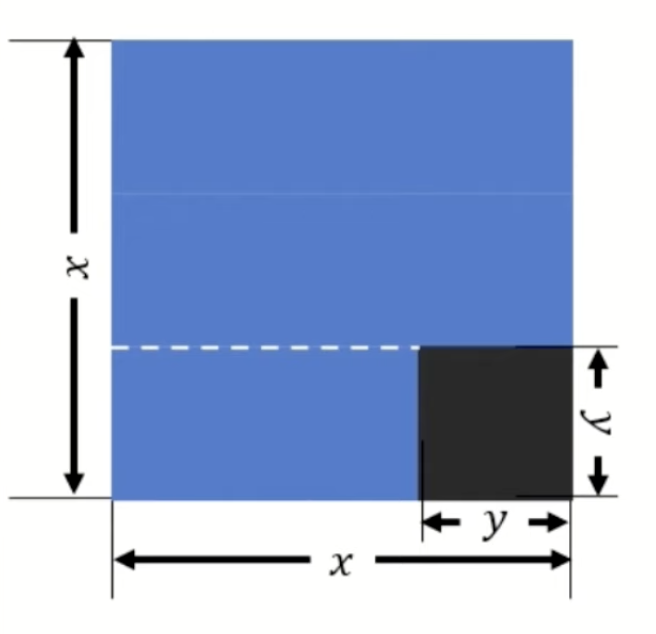
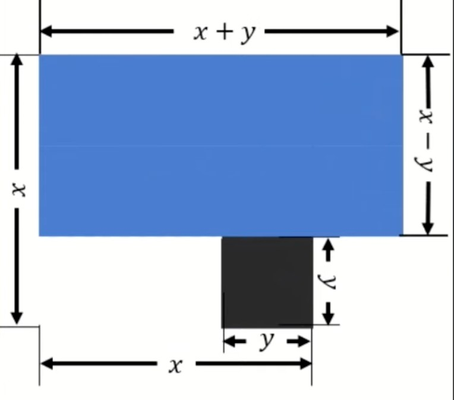

# The Quadratic Formula

## Representing a number as the difference of squares

The difference of squares factorization is a powerful technique: $x^2 - y^2 = (x - y)(x + y)$.

**Example**

$15 = 16 - 1 = 4^2 - 1^2 = (4-1)(4+1) = 3 \times 5$

**Example**

$5183 = 5184 - 1 = 72^2 - 1^2 = (72-1)(72+1) = 71 \times 73$

The difference of squares technique also works with real numbers as well.

**Example**

$20.25 = 5.625^2 - 3.375^2 = (5.625-3.375)(5.625+3.375) = 2.25 \times 9$

**Example**

$-7.5 = 1.75^2 - 3.25^2 = (1.75-3.25)(1.75+3.25) = -1.5 \times 5$

Here's a geometric proof of $x^2 - y^2 = (x - y)(x + y)$.

We can re-express the difference of squares formula in terms of the **midpoint** $m$ and the **distance from the midpoint** $d$.

If $m$ is the midpoint between $r$ and $s$, and $d$ is the distance from the midpoint, then:

- $r = m + d$

- $s = m - d$ (assuming $r \geq s$)

where:

- $m = \frac{r+s}{2}$ (the midpoint)

- $d = \frac{r-s}{2}$ (half the distance between $r$ and $s$)

**Example**

For $r = 5$ and $s = 3$: $m = \frac{5+3}{2} = 4$, $d = \frac{5-3}{2} = 1$

Then $rs = (m+d)(m-d) = (4+1)(4-1) = 5 \times 3 = 15$

## Connecting the difference of squares to a simpler Quadratic Formula

Consider a quadratic function $y = f(x) = ax^2 + bx + c$. To find the roots (where the curve intersects the $x$-axis), we solve $ax^2 + bx + c = 0$.

Dividing through by $a$ (assuming $a \neq 0$), we obtain:

$$x^2 + \frac{b}{a}x + \frac{c}{a} = 0$$

Let $b' = \frac{b}{a}$ and $c' = \frac{c}{a}$, so the equation becomes:

$$x^2 + b'x + c' = 0$$

Let the roots be $r$ and $s$ (i.e., the curve intersects the $x$-axis at $x = r$ and $x = s$). Then:

$$(x - r)(x - s) = 0$$

Expanding this product:

$$x^2 - (r + s)x + rs = 0$$

Comparing coefficients with $x^2 + b'x + c' = 0$, we find:

- $b' = -(r + s)$

- $c' = rs = p$, the product

Using the midpoint and distance interpretation from the difference of squares method:

- Since $m = \frac{r+s}{2}$, we have $r + s = 2m$, so $b' = -2m$, which gives us $m = -\frac{b'}{2}$

- Since $rs = (m+d)(m-d)$, we have $c' = (m+d)(m-d) = m^2 - d^2$, which gives us $d^2 = m^2 - c'$, so $d = \sqrt{m^2 - c'} = \sqrt{m^2 - p}$

Therefore, the quadratic equation can be expressed in terms of the midpoint $m$ and distance $d$:

$$x^2 - 2mx + (m^2 - d^2) = 0$$

where, in terms of the roots $r$ and $s$:

- $r, s = m \pm d$ (the roots expressed in terms of the midpoint and distance)

- $m = \frac{r+s}{2}$ (the midpoint of the roots)

- $d = \frac{r-s}{2}$ (half the distance between the roots)

**Example: Finding roots using the midpoint and distance method**

Find the roots of $x^2 + 10x + 3 = 0$.

From the equation, we have $b' = 10$ and $c' = 3$ (the product $p = 3$).

Using our formulas:

- $m = -\frac{b'}{2} = -\frac{10}{2} = -5$

- $d = \sqrt{m^2 - c'} = \sqrt{(-5)^2 - 3} = \sqrt{25 - 3} = \sqrt{22}$

Therefore, the roots are:

$$r, s = m \pm d = -5 \pm \sqrt{22}$$

So the two roots are:

- $r = -5 + \sqrt{22}$

- $s = -5 - \sqrt{22}$

## The traditional Quadratic Formula

We can now derive the traditional quadratic formula for $ax^2 + bx + c = 0$ from our simpler version.

Starting with the general quadratic $ax^2 + bx + c = 0$ and using our midpoint and distance method:

From the normalized form $x^2 + b'x + c' = 0$ where $b' = \frac{b}{a}$ and $c' = \frac{c}{a}$:

**Step 1: Find the midpoint $m$**

$$m = -\frac{b'}{2} = -\frac{b/a}{2} = -\frac{b}{2a}$$

**Step 2: Find the distance $d$**

$$d = \sqrt{m^2 - c'} = \sqrt{\left(-\frac{b}{2a}\right)^2 - \frac{c}{a}}$$

Simplifying:

$$d = \sqrt{\frac{b^2}{4a^2} - \frac{c}{a}} = \sqrt{\frac{b^2}{4a^2} - \frac{4ac}{4a^2}} = \sqrt{\frac{b^2 - 4ac}{4a^2}} = \frac{\sqrt{b^2 - 4ac}}{2a}$$

**Step 3: Find the roots**

$$r, s = m \pm d = -\frac{b}{2a} \pm \frac{\sqrt{b^2 - 4ac}}{2a} = \frac{-b \pm \sqrt{b^2 - 4ac}}{2a}$$

This is the **traditional quadratic formula**:

$$x = \frac{-b \pm \sqrt{b^2 - 4ac}}{2a}$$

The term $b^2 - 4ac$ is called the **discriminant**. It determines the nature of the roots:

- If $b^2 - 4ac > 0$: two distinct real roots

- If $b^2 - 4ac = 0$: one repeated real root (the midpoint, since $d = 0$)

- If $b^2 - 4ac < 0$: two complex conjugate roots

