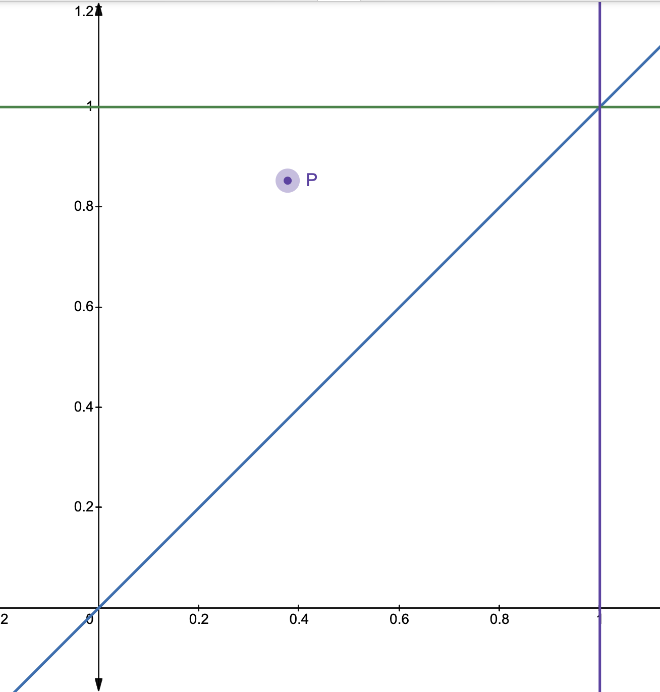
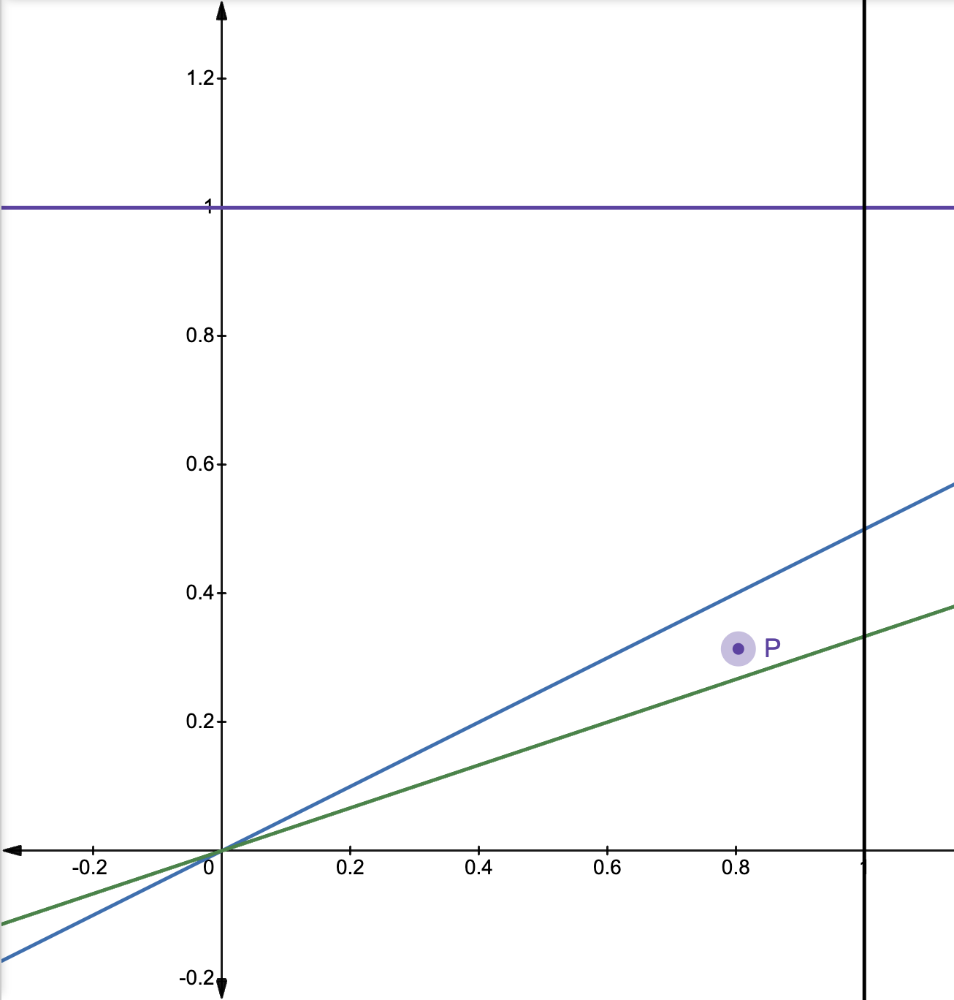
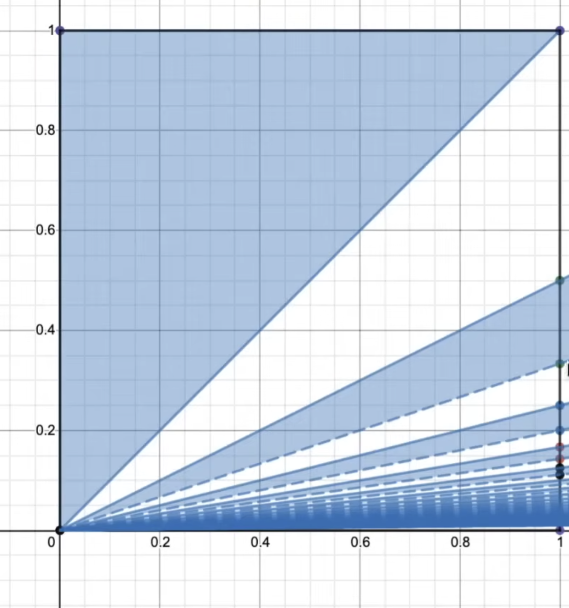

# Tips for better problem solving

## TL;DR 

Some useful strategies to help you solve math problems better.

1. Use the defining features of the setup
2. Give things (meaningful) names
3. Draw a picture (numbers, plots)
4. Leverage symmetry
5. Ask or solve a simpler version of the problem
6. Try describing one object in two different ways
7. Learn at least a little bit of programming
8. Always gut-check your answer!
9. Read a lot, and think about math problems a lot 

## Case study: Proving $\cos^2(\theta) = \frac{1}{2}[1 + \cos(2\theta)]$ using the Inscribed Angle Theorem

We'll prove the identity $\cos^2(\theta) = \frac{1}{2}[1 + \cos(2\theta)]$ using a geometric approach with the inscribed angle theorem.

Consider a circle with unit diameter. The circle has a center at $O$. Let there be a diameter $QR$ of length $1$. Let $P$ be a point on the circle not coinciding with $Q$ or $R$. Let $PM$ be a line perpendicular to the diameter $QR$. Thus, $M$ lies on the diameter. Below is a figure showing the circle.

Let $\alpha = \angle PQR$ (the inscribed angle) and $\beta = \angle POR$ (the central angle). By the inscribed angle theorem, $\beta = 2\alpha$.

Since $QR$ is a diameter and $P$ lies on the semicircle, $\angle QPR = 90°$. This is a consequence of **Thales' theorem** (or the inscribed angle theorem): any angle inscribed in a semicircle (i.e., subtended by a diameter) is a right angle.

Since $QR$ is of length $1$ (unit diameter), and triangle $QPR$ is right-angled at $P$, we can use trigonometry. In triangle $QPR$:

- The hypotenuse is $QR = 1$

- The angle at $Q$ is $\alpha$

- Therefore, $PQ = \cos(\alpha)$

Now, we need to find the length of $QM$ in two different ways.

**First way:**

Consider triangle $PMQ$, which is right-angled at $M$ (since $PM$ is perpendicular to $QR$). In this triangle:

- The angle at $Q$ is $\alpha$

- The hypotenuse is $PQ$

- The adjacent side to angle $\alpha$ is $QM$

Therefore, $\cos(\alpha) = \frac{QM}{PQ}$.

But we already know that $PQ = \cos(\alpha)$ Substituting:

$$\cos(\alpha) = \frac{QM}{\cos(\alpha)}$$

Solving for $QM$:

$$QM = \cos(\alpha) \cdot \cos(\alpha) = \cos^2(\alpha)$$

Thus, the first way of finding $QM$ gives us $QM = \cos^2(\alpha)$.

**Second way:**

Since $M$ lies on the diameter $QR$ between $Q$ and $R$, we can express $QM$ as:

$$QM = QO + OM$$

where $QO$ is the distance from $Q$ to the center $O$, and $OM$ is the distance from the center $O$ to point $M$.

By the inscribed angle theorem, $\beta = 2\alpha$, where $\beta = \angle POR$ is the central angle and $\alpha = \angle PQR$ is the inscribed angle.

Now consider triangle $POM$, which is right-angled at $M$ (since $PM$ is perpendicular to $QR$). In this triangle:

- The angle at $O$ is $\beta = 2\alpha$

- The hypotenuse is $OP$

- The adjacent side to angle $\beta$ is $OM$

Therefore, $\cos(\beta) = \cos(2\alpha) = \frac{OM}{OP}$.

But $OP = \frac{1}{2}$ (since it is the radius, and the diameter $QR = 1$).

Substituting:

$$\cos(2\alpha) = \frac{OM}{1/2}$$

Solving for $OM$:

$$OM = \frac{\cos(2\alpha)}{2}$$

Now, to find $QO$: Since $Q$ is one endpoint of the diameter $QR$ and $O$ is the center of the circle, $QO$ is the radius. Since the diameter $QR = 1$, the radius is $\frac{1}{2}$.

Therefore:

$$QO = \frac{1}{2}$$

Now we can compute $QM$ using the second way:

$$QM = QO + OM = \frac{1}{2} + \frac{\cos(2\alpha)}{2} = \frac{1 + \cos(2\alpha)}{2}$$

Thus, the second way of finding $QM$ gives us $QM = \frac{1 + \cos(2\alpha)}{2}$.

**Completing the proof:**

Since we found $QM$ in two different ways, we can equate them:

$$\cos^2(\alpha) = \frac{1 + \cos(2\alpha)}{2}$$

This completes the proof!

### How we used some of the tips

**Use the defining features of the setup**: We leveraged key properties.

- $QR$ is a diameter (length 1)
- The circle has unit diameter, so radius is $\frac{1}{2}$
- $PM$ is perpendicular to $QR$
- $P$ lies on a semicircle, so $\angle QPR = 90°$ (Thales' theorem)
- The inscribed angle theorem: $\beta = 2\alpha$

**Give things (meaningful) names**: We used descriptive notation.

- $\alpha$ for the inscribed angle $\angle PQR$
- $\beta$ for the central angle $\angle POR$
- Points $P$, $Q$, $R$, $O$, $M$ with clear geometric meanings
- These names made it easy to refer to specific angles and lengths

**Try describing one object in two different ways**: This was the key strategy!

- We found $QM$ using triangle $PMQ$. $QM = \cos^2(\alpha)$
- We found $QM$ using the diameter $QM = QO + OM = \frac{1 + \cos(2\alpha)}{2}$
- Equating these two expressions gave us the desired identity

## Case study: A hidden infinite series

**Problem:** 
Suppose two numbers are chosen at random from the range $[0, 1]$ according to a uniform distribution. Suppose $p$ is the probability that the ratio of the first number to second number rounds down to an even number (remember that $0$ is an even number). What is $p$ equal to?

**Solution:** 

**Simpler problem: Probability that $\lfloor x/y \rfloor = 0$**

The floor function $\lfloor x/y \rfloor = 0$ when $0 \leq x/y < 1$, which means $x < y$ (since $x, y > 0$ with probability 1; the case $y = 0$ has probability 0 and can be ignored).

So we want the probability that $x < y$ when both $x$ and $y$ are chosen uniformly from $[0, 1]$.

This is the area of the region in the unit square $[0,1] \times [0,1]$ where $x < y$. This region is the triangle (upper left triangle) above the line $y = x$. For any point $P$ in this region, $\lfloor x/y \rfloor = 0$.

To find the area of the region where $x < y$ in the unit square, we integrate over this region.

For a fixed value of $x \in [0, 1]$, the condition $x < y$ means $y$ ranges from $y = x$ to $y = 1$.

So we can write the area as a double integral:

$$\text{Area} = \int_0^1 \int_x^1 dy \, dx$$

**How the inner integral works:** The inner integral $\int_x^1 dy$ computes the length of the vertical slice at a given $x$. The integral of the constant function 1 over an interval gives us the **length** (or measure) of that interval. This is a fundamental property of integration:

$$\int_a^b 1 \cdot dy = \int_a^b dy = b - a$$

This is why integrating 1 gives us lengths, areas, volumes, etc.—we're essentially "measuring" the size of the region. So in our case:

$$\int_x^1 dy = \int_x^1 1 \cdot dy = \left[ y \right]_x^1 = 1 - x$$

This gives us the length of the interval $[x, 1]$, which is exactly the length of our vertical slice. So for each $x$, the vertical slice has length $1 - x$.

**How the outer integral works:** The outer integral $\int_0^1 (1 - x) \, dx$ sums up all the vertical slice lengths as $x$ varies from $0$ to $1$ We've computed that for each fixed $x$, the vertical slice has length $1 - x$. Now we want to find the total area of the region where $x < y$. To do this, we "add up" (integrate) all these vertical slice lengths as $x$ ranges from $0$ to $1$. This is like slicing the region into infinitely many thin vertical strips, each of height $(1 - x)$, and summing their areas. Now we evaluate this integral:

$$\int_0^1 (1 - x) \, dx = \left[ x - \frac{x^2}{2} \right]_0^1$$

$$= \left(1 - \frac{1^2}{2}\right) - \left(0 - \frac{0^2}{2}\right) = 1 - \frac{1}{2} - 0 = \frac{1}{2}$$

Therefore, the area of the region where $x < y$ is $\frac{1}{2}$, which means the probability that $\lfloor x/y \rfloor = 0$ is $\frac{1}{2}$.

**Next: Probability that $\lfloor x/y \rfloor = 2$**

Now let's find the probability that $\lfloor x/y \rfloor = 2$. For $\lfloor x/y \rfloor = 2$, we need $2 \leq x/y < 3$, which means $2y \leq x < 3y$. However, we also have the constraint that $x \leq 1$ (since $x \in [0, 1]$).
The condition $2 \leq x/y < 3$ can be rewritten as:

- $x/y \geq 2$ means $y \leq x/2$

- $x/y < 3$ means $y > x/3$

So the region where $\lfloor x/y \rfloor = 2$ is bounded by:

- $y = x/3$ (lower boundary)

- $y = x/2$ (upper boundary)

- $x = 1$ (right boundary, since we're in the unit square)

These three lines form a triangle with vertices:

- $(0, 0)$: intersection of $y = x/3$ and $y = x/2$

- $(1, 1/3)$: intersection of $y = x/3$ and $x = 1$

- $(1, 1/2)$: intersection of $y = x/2$ and $x = 1$

For any point $P$ in this region, $\lfloor x/y \rfloor = 2$.

To find the area of this triangle, we can use the formula for the area of a triangle:

$$\text{Area} = \frac{1}{2} \times \text{base} \times \text{height}$$

The base is the vertical line segment from $(1, 1/3)$ to $(1, 1/2)$, so:

$$\text{base} = \frac{1}{2} - \frac{1}{3} = \frac{3 - 2}{6} = \frac{1}{6}$$

The height is the horizontal distance from the base (at $x = 1$) to the opposite vertex (at the origin), which is $1$.

$$\text{Area} = \frac{1}{2} \times \frac{1}{6} \times 1 = \frac{1}{12}$$

So the probability that $\lfloor x/y \rfloor = 2$ is $\frac{1}{12}$.

Notice that we can rewrite this as:

$$\text{Area} = \frac{1}{2} \times \left(\frac{1}{2} - \frac{1}{3}\right) = \frac{1}{2}\left(\frac{1}{2} - \frac{1}{3}\right)$$

This is a cleaner form that reveals a pattern!

**Pattern for other even numbers:**

For $\lfloor x/y \rfloor = 4$, we need $4 \leq x/y < 5$, which means $x/5 < y \leq x/4$.

The triangle is bounded by:

- $y = x/5$ (lower boundary)

- $y = x/4$ (upper boundary)

- $x = 1$ (right boundary)

So the area is:

$$\text{Area} = \frac{1}{2}\left(\frac{1}{4} - \frac{1}{5}\right)$$

**General pattern:**

For $\lfloor x/y \rfloor = 2k$ where $k$ is a non-negative integer (so $2k$ is an even number including $0$):

We need $2k \leq x/y < 2k + 1$, which means $x/(2k+1) < y \leq x/(2k)$.

The triangle is bounded by:

- $y = x/(2k+1)$ (lower boundary)

- $y = x/(2k)$ (upper boundary)

- $x = 1$ (right boundary)

So the area is:

$$\text{Area} = \frac{1}{4k(2k+1)} = \frac{1}{2}\left(\frac{1}{2k} - \frac{1}{2k+1}\right)$$

**Summary:** For any even number $2k$ (where $k \geq 0$), the probability that $\lfloor x/y \rfloor = 2k$ is:

- For $k = 0$: $P(\lfloor x/y \rfloor = 0) = \frac{1}{2}$ (computed separately as the area of the triangle where $x < y$)

- For $k \geq 1$: $P(\lfloor x/y \rfloor = 2k) = \frac{1}{2}\left(\frac{1}{2k} - \frac{1}{2k+1}\right)$

**Finding the total probability that $\lfloor x/y \rfloor$ is even:**

The probability that $\lfloor x/y \rfloor$ is even is the sum of probabilities for all even values ($0, 2, 4, 6, \ldots$):

$$p = P(\lfloor x/y \rfloor = 0) + P(\lfloor x/y \rfloor = 2) + P(\lfloor x/y \rfloor = 4) + P(\lfloor x/y \rfloor = 6) + \cdots$$

Substituting our formulas:

$$p = \frac{1}{2} + \frac{1}{2}\left(\frac{1}{2} - \frac{1}{3}\right) + \frac{1}{2}\left(\frac{1}{4} - \frac{1}{5}\right) + \frac{1}{2}\left(\frac{1}{6} - \frac{1}{7}\right) + \cdots$$

Factoring out $\frac{1}{2}$:

$$p = \frac{1}{2} + \frac{1}{2}\left[\left(\frac{1}{2} - \frac{1}{3}\right) + \left(\frac{1}{4} - \frac{1}{5}\right) + \left(\frac{1}{6} - \frac{1}{7}\right) + \cdots\right]$$

$$p = \frac{1}{2} + \frac{1}{2}\left(\frac{1}{2} - \frac{1}{3} + \frac{1}{4} - \frac{1}{5} + \frac{1}{6} - \frac{1}{7} + \cdots\right)$$

**Solving the summation:**

The series $\frac{1}{2} - \frac{1}{3} + \frac{1}{4} - \frac{1}{5} + \frac{1}{6} - \frac{1}{7} + \cdots$ is related to the **alternating harmonic series**.

We know that the alternating harmonic series is:

$$1 - \frac{1}{2} + \frac{1}{3} - \frac{1}{4} + \frac{1}{5} - \frac{1}{6} + \cdots = \ln(2)$$

Notice that:

$$1 - \frac{1}{2} + \frac{1}{3} - \frac{1}{4} + \frac{1}{5} - \frac{1}{6} + \cdots = 1 - \left(\frac{1}{2} - \frac{1}{3} + \frac{1}{4} - \frac{1}{5} + \frac{1}{6} - \cdots\right)$$

Solving for our series:

$$\frac{1}{2} - \frac{1}{3} + \frac{1}{4} - \frac{1}{5} + \cdots = 1 - \ln(2)$$

Substituting back into our expression for $p$:

$$p = \frac{1}{2} + \frac{1}{2}(1 - \ln(2)) = \frac{1}{2} + \frac{1}{2} - \frac{1}{2}\ln(2) = 1 - \frac{1}{2}\ln(2)$$

**Final answer:**

The probability that $\lfloor x/y \rfloor$ is even is:

$$p = 1 - \frac{1}{2}\ln(2) \approx 1 - 0.3466 = 0.6534$$

For any point $P$ in the shaded region below, $\lfloor x/y \rfloor$ is even.

### How we used some of the tips

**Ask or solve a simpler version of the problem:** We started by solving the simpler problem of finding the probability that $\lfloor x/y \rfloor = 0$. This gave us insight into the geometric structure and helped us understand the pattern before tackling the full problem.

**Use the defining features of the setup:** We leveraged key properties.

- Both $x$ and $y$ are uniformly distributed on $[0, 1]$

- We're working in the unit square $[0,1] \times [0,1]$

- The constraint $x \leq 1$ is crucial for determining valid regions

- The floor function creates distinct regions bounded by lines of the form $y = x/n$

**Give things (meaningful) names:** We used clear notation.

- $x$ and $y$ for the two random numbers

- $k$ for the parameter in even numbers $2k$

- $p$ for the probability we're seeking

**Try describing one object in two different ways:** We found the same probability using different approaches.

- For $\lfloor x/y \rfloor = 2$, we could compute it via integration

- The geometric approach revealed the elegant pattern $\frac{1}{2}\left(\frac{1}{2k} - \frac{1}{2k+1}\right)$

**Draw a picture:** Visualizing the regions in the unit square was crucial. Diagrams helped us understand the geometric structure and compute areas.

**Always gut-check your answer!:** Our final answer $p = 1 - \frac{1}{2}\ln(2) \approx 0.6534$ makes sense.

- It's between 0 and 1 (a valid probability)

- It's greater than 0.5, which is reasonable since floor = 0 alone contributes 0.5

- The alternating series converges (we can verify this)

