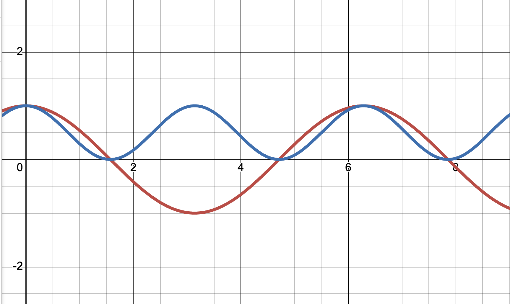
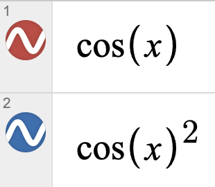
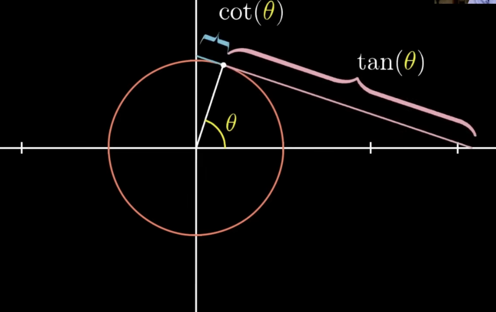

# Trigonometry

Isn't it curious that the graph of $\cos^2(x)$ looks like the graph of $\cos(x)$ with twice the frequency?

In fact, $\cos^2(x) = \frac{\cos(2x) + 1}{2}$.

Just like how $\cos^2(x) \sim \cos(2x)$, another function, $2^x$, has the property where $f(x)^2 = f(2x)$.

**Proof**

If $f(x) = 2^x$, then:

$$f(x)^2 = (2^x)^2 = 2^{2x}$$

and

$$f(2x) = 2^{2x}$$

Therefore, $f(x)^2 = f(2x)$.

> "You'd think it's about triangles, but really it's about circles" - unknown

## Sine and Cosine

Imagine a unit circle— a circle with radius 1 centered at the origin. Draw a point $P$ on the circle. Here's the simple idea: **cosine is just the x-coordinate** of that point, and **sine is just the y-coordinate**. 

Let's move the point along the circle. **$\theta$ (theta) represents the distance traveled along the circle by the point. $\theta$ is also the measure of the angle formed between the positive x-axis and the line from the origin to point $P$. On a unit circle, these two interpretations are equivalent— the arc length equals the angle measure in radians!** As a point travels around the circle, think of sine as telling you how high or low you are (your vertical position), and cosine as telling you how far left or right you are (your horizontal position).

### The Pythagorean Identity

Given these definitions, we can prove one of the most fundamental identities in trigonometry: $\cos^2(\theta) + \sin^2(\theta) = 1$.

**Proof**

Since we're working with a unit circle centered at the origin, the equation of the circle is:

$$x^2 + y^2 = 1$$

The point $P$ on the circle has coordinates $(x, y)$. By our definitions:

- $x = \cos(\theta)$

- $y = \sin(\theta)$

Substituting into the circle equation:

$$(\cos(\theta))^2 + (\sin(\theta))^2 = 1$$

or more simply:

$$\cos^2(\theta) + \sin^2(\theta) = 1$$

This identity holds for all $\theta$ because any point on the unit circle must satisfy the circle's equation!

**Alternative Proof**

We can also prove this using a beautiful geometric construction! Let $O$ be the center of the unit circle, and draw a line from $O$ to a point $P$ on the circle. Since it's a unit circle, $OP = 1$.

Now construct the following:

1. Draw a line from point $P$ perpendicular to the x-axis, intersecting the x-axis at point $Q$. Since $P$ has coordinates $(\cos(\theta), \sin(\theta))$, point $Q$ is at $(\cos(\theta), 0)$, so $OQ = \cos(\theta)$.

2. Draw a line from point $Q$ perpendicular to $OP$, and let it intersect $OP$ at point $H$.

By geometric projection, when we project the segment $OQ$ (which has length $\cos(\theta)$) onto the line $OP$ (which makes an angle $\theta$ with the x-axis), the length of the projection is:

$$OH = OQ \cdot \cos(\theta) = \cos(\theta) \cdot \cos(\theta) = \cos^2(\theta)$$

$OH$ is marked in orange in the figure above.

Now consider the right triangle $QPH$ where $QP$ is perpendicular to the x-axis (vertical) and $QH$ is perpendicular to $OP$. The vertical distance $QP = \sin(\theta)$. When we project this vertical distance onto $OP$ (by drawing perpendicular from $Q$ to $OP$), we get the segment $HP$. Using similar triangles or projection geometry, the length of this projection is:

$$HP = QP \cdot \sin(\theta) = \sin(\theta) \cdot \sin(\theta) = \sin^2(\theta)$$

$HP$ is marked in green in the figure above.

Therefore, since $OP = OH + HP$:

$$OP = OH + HP$$

$$1 = \cos^2(\theta) + \sin^2(\theta)$$

This completes the proof!

## Tangent

The tangent of $\theta$ is simply the ratio of sine to cosine:

$$\tan(\theta) = \frac{\sin(\theta)}{\cos(\theta)}$$

On the unit circle, this tells you the **slope** of the line from the origin to the point $P$ on the circle. Think of it as how "steep" the angle is— the ratio of how high you've gone (sine) to how far horizontally you've traveled (cosine).

There's also a beautiful geometric interpretation: draw a line that intersects the circle at point $P$. This line will also intersect both the x-axis and y-axis. The **distance from $P$ to the x-axis intersection** is exactly $\tan(\theta)$, and the **distance from $P$ to the y-axis intersection** is $\cot(\theta)$, the cotangent. This is why these functions are called "tangent" and "cotangent"— they measure distances along the line to the coordinate axes!

