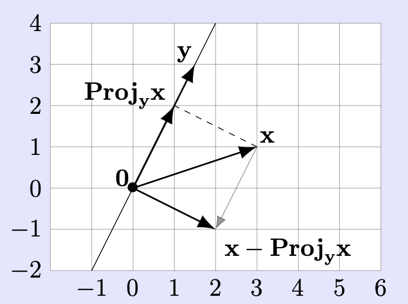
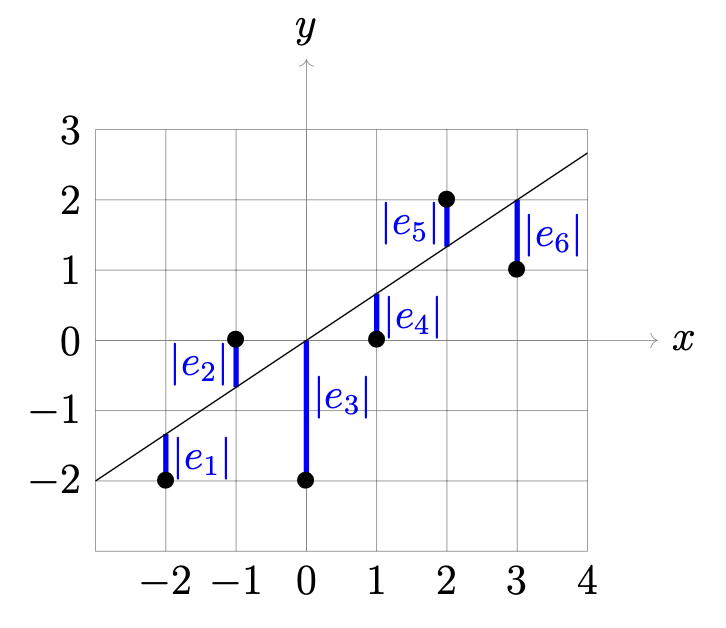

# Applications of Projections in ℝⁿ: Orthogonal Bases of Planes and Linear Regression

Linear regression refers to the problem of finding a function $f(x) = mx + b$ which best fits a collection of given data points $(x_i, y_i)$.

## Finding an orthogonal basis: special case

**Theorem**: Suppose $\mathbf{x}, \mathbf{y} \in \mathbb{R}^n$ are nonzero, and not scalar multiples of each other. The vectors $\mathbf{y}$ and $\mathbf{x}' = \mathbf{x} - \text{Proj}_{\mathbf{y}} \mathbf{x}$ constitute an orthogonal basis of $\text{span}(\mathbf{x}, \mathbf{y})$. In particular, $\text{span}(\mathbf{x}, \mathbf{y})$ is 2-dimensional.

The setup is symmetric in $\mathbf{x}$ and $\mathbf{y}$, so $\{\mathbf{x}, \mathbf{y}' = \mathbf{y} - \text{Proj}_{\mathbf{x}} \mathbf{y}\}$ is also an orthogonal basis of $\text{span}(\mathbf{x}, \mathbf{y})$.

**Note**: This is similar to the situation of projection of $\mathbf{x}$ onto a linear subspace $V$. The displacement vector between the projection and $\mathbf{x}$ is perpendicular to everything in $V$. In our case, when we project $\mathbf{x}$ onto the span of $\mathbf{y}$, the resulting vector $\mathbf{x}' = \mathbf{x} - \text{Proj}_{\mathbf{y}} \mathbf{x}$ is orthogonal to $\mathbf{y}$, which means it's perpendicular to everything in the span of $\mathbf{y}$. This is why $\mathbf{y}$ and $\mathbf{x}'$ form an orthogonal basis - they are perpendicular to each other and together span the same 2-dimensional space as the original vectors $\mathbf{x}$ and $\mathbf{y}$.

**Example**: Consider the plane $V$ in $\mathbb{R}^3$ through $0$ spanned by the vectors

$$\mathbf{v} = \begin{bmatrix} 2 \\ 1 \\ 0 \end{bmatrix}, \quad \mathbf{w} = \begin{bmatrix} 0 \\ 3 \\ 4 \end{bmatrix}$$

Imagine that this plane is a metal sheet on which an electric charge is uniformly distributed. An iron particle placed at the point $\mathbf{p} = \begin{bmatrix} 1 \\ 1 \\ 1 \end{bmatrix}$ would then be attracted to the metal sheet, and by the symmetry of the situation this particle would move straight towards the point on the plane closest to the initial position of the particle. What is that point?

In other words, we seek to compute the projection $\text{Proj}_V(\mathbf{p})$. To compute this, we first seek an orthogonal basis for the plane $V$. By the theorem above, such an orthogonal basis is given by $\mathbf{w}$ and $\mathbf{v}' = \mathbf{v} - \text{Proj}_{\mathbf{w}}(\mathbf{v})$. We first compute $\text{Proj}_{\mathbf{w}}(\mathbf{v})$. This is given by

$$\text{Proj}_{\mathbf{w}}(\mathbf{v}) = \frac{\mathbf{v} \cdot \mathbf{w}}{\mathbf{w} \cdot \mathbf{w}} \mathbf{w} = \frac{3}{25} \begin{bmatrix} 0 \\ 3 \\ 4 \end{bmatrix} = \begin{bmatrix} 0 \\ \frac{9}{25} \\ \frac{12}{25} \end{bmatrix}$$

Thus $\mathbf{v}' = \mathbf{v} - \begin{bmatrix} 0 \\ \frac{9}{25} \\ \frac{12}{25} \end{bmatrix} = \begin{bmatrix} 2 \\ \frac{16}{25} \\ -\frac{12}{25} \end{bmatrix}$. As a safety check, $\mathbf{w}$ and $\mathbf{v}'$ are indeed orthogonal.

The vector $\mathbf{v}'$ is a bit ugly due to the fractions, and for the purposes of having an orthogonal basis it is harmless to replace it with a nonzero scalar multiple, such as

$$\mathbf{v}'' = 25\mathbf{v}' = \begin{bmatrix} 50 \\ 16 \\ -12 \end{bmatrix}$$

Since $\{\mathbf{w}, \mathbf{v}''\}$ is an orthogonal basis of the plane $V$, we have

$$\text{Proj}_V(\mathbf{p}) = \text{Proj}_V \begin{bmatrix} 1 \\ 1 \\ 1 \end{bmatrix} = \text{Proj}_{\mathbf{w}} \begin{bmatrix} 1 \\ 1 \\ 1 \end{bmatrix} + \text{Proj}_{\mathbf{v}''} \begin{bmatrix} 1 \\ 1 \\ 1 \end{bmatrix} = \text{Proj}_{\mathbf{w}}(\mathbf{p}) + \text{Proj}_{\mathbf{v}''}(\mathbf{p})$$

To compute these projections, we first work out some relevant dot products:

$$\mathbf{w} \cdot \mathbf{w} = 25, \quad \mathbf{v}'' \cdot \mathbf{v}'' = 2900, \quad \mathbf{p} \cdot \mathbf{w} = 7, \quad \mathbf{p} \cdot \mathbf{v}'' = 54$$

Hence

$$\text{Proj}_{\mathbf{w}}(\mathbf{p}) = \frac{\mathbf{p} \cdot \mathbf{w}}{\mathbf{w} \cdot \mathbf{w}} \mathbf{w} = \frac{7}{25} \begin{bmatrix} 0 \\ 3 \\ 4 \end{bmatrix} = \begin{bmatrix} 0 \\ \frac{21}{25} \\ \frac{28}{25} \end{bmatrix}$$

$$\text{Proj}_{\mathbf{v}''}(\mathbf{p}) = \frac{\mathbf{p} \cdot \mathbf{v}''}{\mathbf{v}'' \cdot \mathbf{v}''} \mathbf{v}'' = \frac{54}{2900} \begin{bmatrix} 50 \\ 16 \\ -12 \end{bmatrix} = \begin{bmatrix} \frac{27}{29} \\ \frac{216}{725} \\ -\frac{162}{725} \end{bmatrix}$$

Thus, the place on the metal sheet that the particle ends up at is

$$\text{Proj}_V \begin{bmatrix} 1 \\ 1 \\ 1 \end{bmatrix} = \text{Proj}_{\mathbf{w}} \begin{bmatrix} 1 \\ 1 \\ 1 \end{bmatrix} + \text{Proj}_{\mathbf{v}''} \begin{bmatrix} 1 \\ 1 \\ 1 \end{bmatrix} = \begin{bmatrix} 0 \\ \frac{21}{25} \\ \frac{28}{25} \end{bmatrix} + \begin{bmatrix} \frac{27}{29} \\ \frac{216}{725} \\ -\frac{162}{725} \end{bmatrix} = \begin{bmatrix} \frac{27}{29} \\ \frac{33}{29} \\ \frac{26}{29} \end{bmatrix} \approx \begin{bmatrix} 0.931 \\ 1.138 \\ 0.897 \end{bmatrix}$$

## Fitting a function to data

What does "best fit" mean? Informally, we want $f(x_i)$ to be as close as possible to $y_i$ for all $i$. The error

$$\text{error}_i = y_i - (mx_i + b)$$

measures in absolute value how close the line $y = mx + b$ is vertically to $(x_i, y_i)$.

Suppose the line is given by the equation $y = mx + b$. Suppose the $i$th data point is denoted $(x_i, y_i)$. The $i$th error is given by $\text{error}_i = e_i = y_i - (mx_i + b)$. These errors are shown as blue line segments in the figure.

To be a "good fit" means to choose $(m, b)$ so that the errors are collectively small. There are many ways to specify what "collectively small" means. The meaning in the least squares method is this: choose $(m, b)$ to minimize the sum of the squares of the errors; i.e., choose $(m, b)$ to minimize

$$\sum_{i=1}^n (y_i - (mx_i + b))^2$$

Why use the sum of squares of the errors? The errors themselves might be positive and might be negative; we want to penalize a large negative error as well as a large positive error, so squaring errors removes the sign.

But sometimes other ways to define the "total error" are indeed more appropriate, such as summing the absolute values of the errors (used in computational statistics, geophysics, and the important signal processing algorithm called "compressed sensing"). The absolute value function is inconvenient for our purposes; e.g., from a calculus viewpoint, $|x|$ has the defect relative to $x^2$ that it is not differentiable at $x = 0$. Always remember that we choose how to define "total error" for any particular application, and experience determines the appropriateness of that choice; mathematics is a creation of the human mind.

Put the data of all $x$-values into a single $n$-vector, and the data of all $y$-values into a single $n$-vector:

$$X = \begin{bmatrix} x_1 \\ x_2 \\ \vdots \\ x_n \end{bmatrix}, \quad Y = \begin{bmatrix} y_1 \\ y_2 \\ \vdots \\ y_n \end{bmatrix}$$

Also, define $\mathbf{1} = \begin{bmatrix} 1 \\ 1 \\ 1 \\ \vdots \\ 1 \end{bmatrix} \in \mathbb{R}^n$ to be the vector with all entries equal to 1 (analogous to $\mathbf{0} = \begin{bmatrix} 0 \\ 0 \\ 0 \\ \vdots \\ 0 \end{bmatrix} \in \mathbb{R}^n$), so

$$mX + b\mathbf{1} = \begin{bmatrix} mx_1 \\ mx_2 \\ \vdots \\ mx_n \end{bmatrix} + \begin{bmatrix} b \\ b \\ \vdots \\ b \end{bmatrix} = \begin{bmatrix} mx_1 + b \\ mx_2 + b \\ \vdots \\ mx_n + b \end{bmatrix}$$

and hence

$$Y - (mX + b\mathbf{1}) = \begin{bmatrix} y_1 - (mx_1 + b) \\ y_2 - (mx_2 + b) \\ \vdots \\ y_n - (mx_n + b) \end{bmatrix} = \text{"vector of errors"}$$

Thus, since $\sum_{i=1}^n v_i^2 = \|\mathbf{v}\|^2$ for any $\mathbf{v} \in \mathbb{R}^n$ (by definition of $\|\mathbf{v}\|$!), the sum of the squares of the errors is

$$\sum_{i=1}^n (y_i - (mx_i + b))^2 = \|Y - (mX + b\mathbf{1})\|^2$$

So we seek $m$ and $b$ that minimizes the squared length of $Y - (mX + b\mathbf{1})$, which is the same as minimizing the length of that difference.

The length $\|Y - (mX + b\mathbf{1})\|$ is the distance from $Y$ to $mX + b\mathbf{1}$ since "distance" between any $n$-vectors $\mathbf{v}$ and $\mathbf{w}$ is $\|\mathbf{v} - \mathbf{w}\|$ by definition. As $m$ and $b$ vary, the vectors of the form $mX + b\mathbf{1}$ are exactly the vectors in $\text{span}(X, \mathbf{1})$, due to the definition of "span". Hence, the least-squares minimization problem for $n$ data points is equivalent to the following geometric problem:

**find the vector in $\text{span}(X, \mathbf{1})$ that is closest to the vector $Y \in \mathbb{R}^n$.**

Our task is now an instance of finding the point of a linear subspace of $\mathbb{R}^n$ closest to a given $n$-vector.

The vectors $X$ and $\mathbf{1}$ are not scalar multiples of each other because the hypothesis that the $n$ data points do not lie in a common vertical line (i.e., the $x_i$'s are not all equal to each other) says that $X$ is not a scalar multiple of the nonzero vector $\mathbf{1}$.

By using the Theorem above, an orthogonal basis of $\text{span}(X, \mathbf{1})$ is given by $\mathbf{1}$ and $\hat{X} = X - \text{Proj}_{\mathbf{1}}X$ with

$$\text{Proj}_{\mathbf{1}}(X) = \frac{X \cdot \mathbf{1}}{\mathbf{1} \cdot \mathbf{1}} \mathbf{1} = \frac{\sum_{i=1}^n x_i \cdot 1}{\sum_{i=1}^n 1 \cdot 1} \mathbf{1} = \frac{\sum_{i=1}^n x_i}{n} \mathbf{1} = \bar{x} \mathbf{1} = \begin{bmatrix} \bar{x} \\ \bar{x} \\ \vdots \\ \bar{x} \end{bmatrix}$$

equal to the $n$-vector each of whose entries is equal to the average $\bar{x}$ of the $x_i$'s. Hence,

$$\hat{X} = X - \text{Proj}_{\mathbf{1}}(X) = \begin{bmatrix} x_1 - \bar{x} \\ x_2 - \bar{x} \\ \vdots \\ x_n - \bar{x} \end{bmatrix}$$

is obtained from $X$ by subtracting the average $\bar{x}$ from all entries.

By applying to this span the formula for the nearest point on a linear subspace in terms of an orthogonal basis, we obtain that the closest vector to $Y$ in $\text{span}(X, \mathbf{1})$ is

$$\frac{Y \cdot \hat{X}}{\hat{X} \cdot \hat{X}} \hat{X} + \frac{Y \cdot \mathbf{1}}{\mathbf{1} \cdot \mathbf{1}} \mathbf{1} = \frac{Y \cdot \hat{X}}{\hat{X} \cdot \hat{X}} \hat{X} + \bar{y} \mathbf{1}$$

where $\bar{y} = (1/n) \sum_{i=1}^n y_i$ is the average of the $y_i$'s.