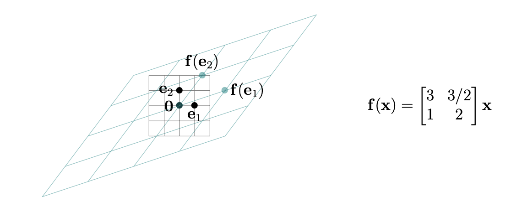
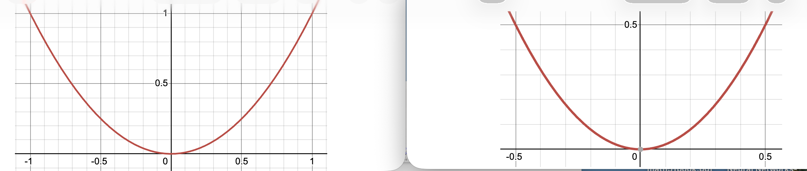

# Linear functions, matrices, and the derivative matrix

## The linear approximation to a vector-valued function

For a function of a single variable $f : \mathbb{R} \to \mathbb{R}$ that is differentiable at $a$, a small change $h$ in the input produces an approximate change of $f'(a)\,h$ in the output (see [Single-variable derivative review](../multivariate_calculus/partial_derivatives_and_contour_plots.md#single-variable-derivative-review)):

$$f(a + h) \approx f(a) + f'(a)\,h \qquad \text{for } h \text{ near } 0,$$

or equivalently, writing $x = a + h$ so that $h = x - a$,

$$f(x) \approx f(a) + f'(a)\,(x - a) \qquad \text{for } x \text{ near } a.$$

For $f : \mathbb{R}^n \to \mathbb{R}$ the single number $f'(a)$ is replaced by the **gradient** $(\nabla f)(\mathbf{a})$, the column vector of partial derivatives evaluated at $\mathbf{a}$ (see [The Gradient](../multivariate_calculus/gradients_local_approximations_and_gradient_descent.md#the-gradient)):

$$
(\nabla f)(\mathbf{a}) =
\begin{pmatrix}
\dfrac{\partial f}{\partial x_1}(\mathbf{a}) \\[0.35em]
\dfrac{\partial f}{\partial x_2}(\mathbf{a}) \\[0.35em]
\vdots \\[0.2em]
\dfrac{\partial f}{\partial x_n}(\mathbf{a})
\end{pmatrix} \in \mathbb{R}^n ,
$$

and the product $f'(a)\,h$ is replaced by a dot product. The **linear approximation** to $f$ at $\mathbf{a}$ (see [The linear approximation for a scalar-valued function](../multivariate_calculus/gradients_local_approximations_and_gradient_descent.md#the-linear-approximation-for-a-scalar-valued-function)) is

$$f(\mathbf{x}) \approx f(\mathbf{a}) + (\nabla f)(\mathbf{a}) \cdot (\mathbf{x} - \mathbf{a}) \qquad \text{for } \mathbf{x} \text{ near } \mathbf{a}.$$

Written out for $n = 2$, with $\mathbf{a} = (a,b)$ and $\mathbf{x} = (x,y)$, this is

$$
f(x, y) \approx f(a, b) + \underbrace{f_x(a, b)(x - a) + f_y(a, b)(y - b)}_{\displaystyle (\nabla f)(a,b)\,\cdot\, \begin{pmatrix} x - a \\ y - b \end{pmatrix}} .
$$

Suppose that $\mathbf{f} : \mathbb{R}^n \to \mathbb{R}^m$ is a vector-valued function, with component functions $f_1, f_2, \ldots, f_m$:

$$
\mathbf{f}(\mathbf{x}) =
\begin{pmatrix}
f_1(\mathbf{x}) \\[0.25em]
f_2(\mathbf{x}) \\[0.25em]
\vdots \\[0.2em]
f_m(\mathbf{x})
\end{pmatrix}
\qquad \text{for } \mathbf{x} \in \mathbb{R}^n .
$$

For an $n$-vector $\mathbf{a}$, how can we approximate the $m$-vector $\mathbf{f}(\mathbf{x})$ when $\mathbf{x}$ is near $\mathbf{a}$?

There is an obvious thing to try, and it needs no new machinery. Each component function $f_i : \mathbb{R}^n \to \mathbb{R}$ is **scalar-valued**, and we know how to linearly approximate one of those: $f_i(\mathbf{x}) \approx f_i(\mathbf{a}) + (\nabla f_i)(\mathbf{a}) \cdot (\mathbf{x} - \mathbf{a})$. So approximate each of the $m$ components separately, then stack the $m$ results back up into a column. To make things easier to imagine, suppose $m = n = 3$. Let's consider a specific example.

**Example:** Define $g : \mathbb{R}^3 \to \mathbb{R}^3$ by

$$g(x, y, z) = \bigl(e^{z}(x - y)^2,\ \ 2yz + x^3,\ \ x^2 - y^3 + z\bigr),$$

and let $\mathbf{a} = (2, 1, 0)$. The respective component functions are

$$g_1(x,y,z) = e^{z}(x-y)^2, \qquad g_2(x,y,z) = 2yz + x^3, \qquad g_3(x,y,z) = x^2 - y^3 + z,$$

each a scalar-valued function $\mathbb{R}^3 \to \mathbb{R}$. Their gradients are

$$
\nabla g_1 = \begin{pmatrix} 2e^{z}(x-y) \\ -2e^{z}(x-y) \\ e^{z}(x-y)^2 \end{pmatrix}, \qquad
\nabla g_2 = \begin{pmatrix} 3x^2 \\ 2z \\ 2y \end{pmatrix}, \qquad
\nabla g_3 = \begin{pmatrix} 2x \\ -3y^2 \\ 1 \end{pmatrix},
$$

so that at $\mathbf{a} = (2,1,0)$ we get $g_1(\mathbf{a}) = 1$, $g_2(\mathbf{a}) = 8$, $g_3(\mathbf{a}) = 3$ and

$$(\nabla g_1)(\mathbf{a}) = (2, -2, 1), \qquad (\nabla g_2)(\mathbf{a}) = (12, 0, 2), \qquad (\nabla g_3)(\mathbf{a}) = (4, -3, 1).$$

Hence if $(x, y, z)$ is near $\mathbf{a}$ then we have

$$
\begin{aligned}
g_1(x,y,z) &\approx g_1(\mathbf{a}) + \bigl((\nabla g_1)(\mathbf{a})\bigr) \cdot (x - 2,\, y - 1,\, z) = 1 + (2, -2, 1) \cdot (x - 2,\, y - 1,\, z), \\[0.35em]
g_2(x,y,z) &\approx g_2(\mathbf{a}) + \bigl((\nabla g_2)(\mathbf{a})\bigr) \cdot (x - 2,\, y - 1,\, z) = 8 + (12, 0, 2) \cdot (x - 2,\, y - 1,\, z), \\[0.35em]
g_3(x,y,z) &\approx g_3(\mathbf{a}) + \bigl((\nabla g_3)(\mathbf{a})\bigr) \cdot (x - 2,\, y - 1,\, z) = 3 + (4, -3, 1) \cdot (x - 2,\, y - 1,\, z).
\end{aligned}
$$

Putting these scalar approximations together yields a vector approximation

$$
g(x, y, z) \approx
\begin{pmatrix}
1 + (2, -2, 1) \cdot (x - 2,\, y - 1,\, z) \\[0.35em]
8 + (12, 0, 2) \cdot (x - 2,\, y - 1,\, z) \\[0.35em]
3 + (4, -3, 1) \cdot (x - 2,\, y - 1,\, z)
\end{pmatrix}
=
\begin{pmatrix}
-1 + 2x - 2y + z \\[0.35em]
-16 + 12x + 2z \\[0.35em]
-2 + 4x - 3y + z
\end{pmatrix} .
$$

More generally, still with $m = n = 3$, we want to approximate the vector

$$
\mathbf{f}(x, y, z) =
\begin{pmatrix}
f_1(x, y, z) \\[0.25em]
f_2(x, y, z) \\[0.25em]
f_3(x, y, z)
\end{pmatrix}
$$

for $(x, y, z)$ near a point $(a, b, c)$, for **any** scalar-valued functions $f_1, f_2, f_3$. We have

$$
\begin{aligned}
f_i(x, y, z)
&\approx f_i(a, b, c) + \bigl((\nabla f_i)(a, b, c)\bigr) \cdot (x - a,\, y - b,\, z - c) \\[0.4em]
&= f_i(a, b, c)
+ \left( \frac{\partial f_i}{\partial x}(a, b, c) \right)(x - a)
+ \left( \frac{\partial f_i}{\partial y}(a, b, c) \right)(y - b)
+ \left( \frac{\partial f_i}{\partial z}(a, b, c) \right)(z - c),
\end{aligned}
$$

so combining these for $f_1$, $f_2$, and $f_3$ yields

$$
\begin{pmatrix}
f_1(x, y, z) \\[0.25em]
f_2(x, y, z) \\[0.25em]
f_3(x, y, z)
\end{pmatrix}
\approx
\mathbf{f}(a, b, c)
+
\begin{pmatrix}
\dfrac{\partial f_1}{\partial x}(a, b, c)(x - a) + \dfrac{\partial f_1}{\partial y}(a, b, c)(y - b) + \dfrac{\partial f_1}{\partial z}(a, b, c)(z - c) \\[0.9em]
\dfrac{\partial f_2}{\partial x}(a, b, c)(x - a) + \dfrac{\partial f_2}{\partial y}(a, b, c)(y - b) + \dfrac{\partial f_2}{\partial z}(a, b, c)(z - c) \\[0.9em]
\dfrac{\partial f_3}{\partial x}(a, b, c)(x - a) + \dfrac{\partial f_3}{\partial y}(a, b, c)(y - b) + \dfrac{\partial f_3}{\partial z}(a, b, c)(z - c)
\end{pmatrix} .
$$

Alas, the right side of this last approximation is horrifying. We need a more compact and efficient way to work with it. The way to handle it is provided by the language of **matrices**, to which we now turn.

## Linear and affine functions

**Definition:** A scalar-valued function $f : \mathbb{R}^n \to \mathbb{R}$ is called

- **affine** if it has the form $f(x_1, \ldots, x_n) = a_1x_1 + a_2x_2 + \cdots + a_nx_n + b$ for some numbers $a_1, \ldots, a_n, b$ (so $b = f(\mathbf{0})$).
- **linear** if it has the form $f(x_1, \ldots, x_n) = a_1x_1 + a_2x_2 + \cdots + a_nx_n$ for some numbers $a_1, \ldots, a_n$; i.e., it is affine with $b = 0$, or equivalently with $f(\mathbf{0}) = 0$.

A vector-valued function $\mathbf{f} : \mathbb{R}^n \to \mathbb{R}^m$ (so $\mathbf{f}(\mathbf{x}) = (f_1(\mathbf{x}), \ldots, f_m(\mathbf{x}))$) is called

- **affine** if each of its component functions $f_i : \mathbb{R}^n \to \mathbb{R}$ is affine.
- **linear** if each of its component functions $f_i : \mathbb{R}^n \to \mathbb{R}$ is linear.

**Example:** The function

$$
f(x, y, z) =
\begin{pmatrix}
x - y + z + 3 \\[0.25em]
z - x \\[0.25em]
y + x + 1
\end{pmatrix}
=
\begin{pmatrix}
x - y + z + 3 \\[0.25em]
-x + 0y + z \\[0.25em]
x + y + 0z + 1
\end{pmatrix}
$$

from $\mathbb{R}^3$ to $\mathbb{R}^3$ is affine. The function

$$
g(x, y, z) =
\begin{pmatrix}
x - y + z \\[0.25em]
z - x \\[0.25em]
y + x
\end{pmatrix}
$$

from $\mathbb{R}^3$ to $\mathbb{R}^3$ is linear, and

$$
h(x, y, z) =
\begin{pmatrix}
x - y + z \\[0.25em]
z - x \\[0.25em]
y + x + z^2
\end{pmatrix}
$$

is neither affine nor linear (due to $z^2$ in the third component function $h_3 = y + x + z^2$).

## Matrices: a shorthand for linear functions

**Definition:** An $m \times n$ **matrix** is a rectangular array $A$ of numbers presented like this:

$$
\begin{pmatrix}
a_{1,1} & a_{1,2} & \cdots & a_{1,n} \\[0.25em]
a_{2,1} & a_{2,2} & \cdots & a_{2,n} \\[0.25em]
\vdots & \vdots & \ddots & \vdots \\[0.25em]
a_{m,1} & a_{m,2} & \cdots & a_{m,n}
\end{pmatrix} .
$$

The collection of entries $\begin{pmatrix} a_{i,1} & a_{i,2} & \cdots & a_{i,n} \end{pmatrix}$ along the $i$th horizontal layer (with $i = 1$ along the top side) is called the $i$th **row**, and the collection of entries

$$
\begin{pmatrix}
a_{1,j} \\[0.25em]
a_{2,j} \\[0.25em]
\vdots \\[0.25em]
a_{m,j}
\end{pmatrix}
$$

along the $j$th vertical layer (with $j = 1$ along the left side) is called the $j$th **column**.

The entry at the crossing of the $i$th row from the top and $j$th column from the left is denoted $a_{ij}$ (or sometimes $a_{i,j}$); it is called the **$ij$-entry** or **$(i,j)$-entry**.

**Definition:** If $A$ is an $m \times n$ matrix, and $\mathbf{x} \in \mathbb{R}^n$, the **matrix-vector product** $A\mathbf{x} \in \mathbb{R}^m$ is defined as

$$
\begin{pmatrix}
a_{11} & a_{12} & \cdots & a_{1n} \\[0.25em]
a_{21} & a_{22} & \cdots & a_{2n} \\[0.25em]
\vdots & \vdots & \ddots & \vdots \\[0.25em]
a_{m1} & a_{m2} & \cdots & a_{mn}
\end{pmatrix}
\begin{pmatrix}
x_1 \\[0.25em]
x_2 \\[0.25em]
\vdots \\[0.25em]
x_n
\end{pmatrix}
=
\begin{pmatrix}
a_{11}x_1 + a_{12}x_2 + \cdots + a_{1n}x_n \\[0.25em]
a_{21}x_1 + a_{22}x_2 + \cdots + a_{2n}x_n \\[0.25em]
\vdots \\[0.25em]
a_{m1}x_1 + a_{m2}x_2 + \cdots + a_{mn}x_n
\end{pmatrix} .
$$

In other words, if we write $\mathbf{r}_1, \ldots, \mathbf{r}_m$ for the rows of $A$ (so these are $n$-vectors), then

$$
A\mathbf{x} =
\begin{pmatrix}
\mathbf{r}_1 \cdot \mathbf{x} \\[0.25em]
\mathbf{r}_2 \cdot \mathbf{x} \\[0.25em]
\vdots \\[0.25em]
\mathbf{r}_m \cdot \mathbf{x}
\end{pmatrix} .
$$

!!! warning
    If $A$ is an $m \times n$ matrix and $\mathbf{x}$ is a $d$-vector with $d \neq n$ then the matrix-vector product $A\mathbf{x}$ is not defined.

**Example:** We saw earlier that the function

$$
g(x, y, z) =
\begin{pmatrix}
x - y + z \\[0.25em]
z - x \\[0.25em]
y + x
\end{pmatrix}
$$

from $\mathbb{R}^3$ to $\mathbb{R}^3$ is linear. Let us find the matrix that represents it. Write each component function as a combination of $x$, $y$, $z$ in that order:

$$
g(x, y, z) =
\begin{pmatrix}
1x - 1y + 1z \\[0.25em]
-1x + 0y + 1z \\[0.25em]
1x + 1y + 0z
\end{pmatrix} .
$$

The $i$th row of the matrix is the list of coefficients of the $i$th component function, so

$$
A =
\begin{pmatrix}
1 & -1 & 1 \\[0.25em]
-1 & 0 & 1 \\[0.25em]
1 & 1 & 0
\end{pmatrix},
\qquad
g(x, y, z) = A \begin{pmatrix} x \\[0.25em] y \\[0.25em] z \end{pmatrix} .
$$

Checking against the row description $A\mathbf{x} = (\mathbf{r}_1 \cdot \mathbf{x},\, \mathbf{r}_2 \cdot \mathbf{x},\, \mathbf{r}_3 \cdot \mathbf{x})$ with $\mathbf{x} = (x, y, z)$:

$$
\mathbf{r}_1 \cdot \mathbf{x} = x - y + z, \qquad
\mathbf{r}_2 \cdot \mathbf{x} = z - x, \qquad
\mathbf{r}_3 \cdot \mathbf{x} = x + y ,
$$

as desired. Note that $a_{22} = 0$ because $y$ is absent from the second component function, and $a_{33} = 0$ because $z$ is absent from the third.

**Definition:** A function $\mathbf{f} : \mathbb{R}^n \to \mathbb{R}^m$ is **linear** precisely when $\mathbf{f}(\mathbf{x}) = A\mathbf{x}$ for an $m \times n$ matrix $A$. This just rephrases the definition of "linear function". In this way, an $m \times n$ matrix $A$ is a shorthand way of encoding a linear function from $\mathbb{R}^n$ to $\mathbb{R}^m$.

We can also use matrices to give a shorthand for affine functions.

**Example:** The affine function

$$
f(x, y, z) =
\begin{pmatrix}
x - y + z + 3 \\[0.25em]
z - x \\[0.25em]
y + x + 1
\end{pmatrix}
$$

from the earlier example can be expressed as

$$
f\begin{pmatrix} x \\[0.25em] y \\[0.25em] z \end{pmatrix}
=
\begin{pmatrix}
1 & -1 & 1 \\[0.25em]
-1 & 0 & 1 \\[0.25em]
1 & 1 & 0
\end{pmatrix}
\begin{pmatrix} x \\[0.25em] y \\[0.25em] z \end{pmatrix}
+
\begin{pmatrix} 3 \\[0.25em] 0 \\[0.25em] 1 \end{pmatrix} .
$$

!!! note
    Much as inspection of definitions showed that linear functions $\mathbb{R}^n \to \mathbb{R}^m$ are exactly those of the form $\mathbf{f}(\mathbf{x}) = A\mathbf{x}$ for an $m \times n$ matrix $A$, affine functions $\mathbf{f} : \mathbb{R}^n \to \mathbb{R}^m$ are exactly those of the form $\mathbf{f}(\mathbf{x}) = A\mathbf{x} + \mathbf{b}$, where $A$ is an $m \times n$ matrix and $\mathbf{b} \in \mathbb{R}^m$ is a vector.

## Further viewpoints on matrix-vector products

!!! note "Theorem"
    If $\mathbf{c}_1, \mathbf{c}_2, \ldots, \mathbf{c}_n$ are the columns of $A$ (so viewed as vectors in $\mathbb{R}^m$), which is to say

    $$
    A =
    \begin{pmatrix}
    | & | & & | \\
    \mathbf{c}_1 & \mathbf{c}_2 & \cdots & \mathbf{c}_n \\
    | & | & & |
    \end{pmatrix},
    $$

    then

    $$
    A
    \begin{pmatrix}
    x_1 \\[0.25em]
    x_2 \\[0.25em]
    \vdots \\[0.25em]
    x_n
    \end{pmatrix}
    = x_1\mathbf{c}_1 + x_2\mathbf{c}_2 + \cdots + x_n\mathbf{c}_n \in \mathbb{R}^m .
    $$

    In particular, the matrix-vector product is a specific linear combination of the columns of the matrix.

**Example:** For $g : \mathbb{R}^3 \to \mathbb{R}^3$, if we separate the contributions of $x$, $y$, and $z$ in its definition we get

$$
g\begin{pmatrix} x \\[0.25em] y \\[0.25em] z \end{pmatrix}
=
\begin{pmatrix} x \\[0.25em] -x \\[0.25em] x \end{pmatrix}
+
\begin{pmatrix} -y \\[0.25em] 0 \\[0.25em] y \end{pmatrix}
+
\begin{pmatrix} z \\[0.25em] z \\[0.25em] 0 \end{pmatrix}
=
x\begin{pmatrix} 1 \\[0.25em] -1 \\[0.25em] 1 \end{pmatrix}
+
y\begin{pmatrix} -1 \\[0.25em] 0 \\[0.25em] 1 \end{pmatrix}
+
z\begin{pmatrix} 1 \\[0.25em] 1 \\[0.25em] 0 \end{pmatrix} .
$$

On the right side, we are forming linear combinations of vectors using $x$, $y$, $z$ as the coefficients, and the vectors in this linear combination are exactly the columns of the $3 \times 3$ matrix

$$
A =
\begin{pmatrix}
1 & -1 & 1 \\[0.25em]
-1 & 0 & 1 \\[0.25em]
1 & 1 & 0
\end{pmatrix} .
$$

We introduce the following useful shorthand:

$$
\mathbf{e}_1 =
\begin{pmatrix} 1 \\[0.25em] 0 \\[0.25em] \vdots \\[0.25em] 0 \end{pmatrix} \in \mathbb{R}^n,
\qquad
\mathbf{e}_2 =
\begin{pmatrix} 0 \\[0.25em] 1 \\[0.25em] \vdots \\[0.25em] 0 \end{pmatrix} \in \mathbb{R}^n,
\qquad \ldots, \qquad
\mathbf{e}_n =
\begin{pmatrix} 0 \\[0.25em] 0 \\[0.25em] \vdots \\[0.25em] 1 \end{pmatrix} \in \mathbb{R}^n .
$$

!!! note "Theorem"
    For a linear function $\mathbf{f}(\mathbf{x}) = A\mathbf{x}$, the matrix $A$ has as its respective columns $\mathbf{f}(\mathbf{e}_1), \mathbf{f}(\mathbf{e}_2), \ldots, \mathbf{f}(\mathbf{e}_n)$, where $\mathbf{e}_1, \mathbf{e}_2, \ldots, \mathbf{e}_n$ are the **coordinate vectors**.

**Example:** The figure below shows the effect of $f$ acting on the usual 2-dimensional unit square grid centered at the origin.

## The derivative matrix

Let us return to where the earlier discussion left off, at this approximation:

$$
\begin{pmatrix}
f_1(x, y, z) \\[0.25em]
f_2(x, y, z) \\[0.25em]
f_3(x, y, z)
\end{pmatrix}
\approx
\mathbf{f}(a, b, c)
+
\begin{pmatrix}
\dfrac{\partial f_1}{\partial x}(a, b, c)(x - a) + \dfrac{\partial f_1}{\partial y}(a, b, c)(y - b) + \dfrac{\partial f_1}{\partial z}(a, b, c)(z - c) \\[0.9em]
\dfrac{\partial f_2}{\partial x}(a, b, c)(x - a) + \dfrac{\partial f_2}{\partial y}(a, b, c)(y - b) + \dfrac{\partial f_2}{\partial z}(a, b, c)(z - c) \\[0.9em]
\dfrac{\partial f_3}{\partial x}(a, b, c)(x - a) + \dfrac{\partial f_3}{\partial y}(a, b, c)(y - b) + \dfrac{\partial f_3}{\partial z}(a, b, c)(z - c)
\end{pmatrix} .
$$

Now let us rewrite this approximation using matrix shorthand:

$$
\mathbf{f}(x, y, z) \approx \mathbf{f}(a, b, c)
+
\begin{pmatrix}
\dfrac{\partial f_1}{\partial x}(a, b, c) & \dfrac{\partial f_1}{\partial y}(a, b, c) & \dfrac{\partial f_1}{\partial z}(a, b, c) \\[0.9em]
\dfrac{\partial f_2}{\partial x}(a, b, c) & \dfrac{\partial f_2}{\partial y}(a, b, c) & \dfrac{\partial f_2}{\partial z}(a, b, c) \\[0.9em]
\dfrac{\partial f_3}{\partial x}(a, b, c) & \dfrac{\partial f_3}{\partial y}(a, b, c) & \dfrac{\partial f_3}{\partial z}(a, b, c)
\end{pmatrix}
\begin{pmatrix}
x - a \\[0.25em]
y - b \\[0.25em]
z - c
\end{pmatrix} .
$$

If we use the more efficient vector notation

$$
\mathbf{x} = \begin{pmatrix} x \\[0.25em] y \\[0.25em] z \end{pmatrix}
\qquad \text{and} \qquad
\mathbf{a} = \begin{pmatrix} a \\[0.25em] b \\[0.25em] c \end{pmatrix}
$$

then this can be written as

$$
\mathbf{f}(\mathbf{x}) \approx \mathbf{f}(\mathbf{a})
+
\begin{pmatrix}
\dfrac{\partial f_1}{\partial x}(\mathbf{a}) & \dfrac{\partial f_1}{\partial y}(\mathbf{a}) & \dfrac{\partial f_1}{\partial z}(\mathbf{a}) \\[0.9em]
\dfrac{\partial f_2}{\partial x}(\mathbf{a}) & \dfrac{\partial f_2}{\partial y}(\mathbf{a}) & \dfrac{\partial f_2}{\partial z}(\mathbf{a}) \\[0.9em]
\dfrac{\partial f_3}{\partial x}(\mathbf{a}) & \dfrac{\partial f_3}{\partial y}(\mathbf{a}) & \dfrac{\partial f_3}{\partial z}(\mathbf{a})
\end{pmatrix}
(\mathbf{x} - \mathbf{a}) .
$$

This is exactly the shape of the approximation we started this page with. For a function of one variable we had

$$f(x) \approx f(a) + f'(a)\,(x - a),$$

and for a scalar-valued function of $n$ variables we had

$$f(\mathbf{x}) \approx f(\mathbf{a}) + (\nabla f)(\mathbf{a}) \cdot (\mathbf{x} - \mathbf{a}).$$

The vector-valued case reads the same way. The number $f'(a)$ and the gradient $(\nabla f)(\mathbf{a})$ have both been replaced by a matrix of partial derivatives, and ordinary multiplication and the dot product have both been replaced by the matrix-vector product. What was a horrifying column of three separate sums has collapsed into a single matrix acting on the displacement $\mathbf{x} - \mathbf{a}$.

The pattern holds for any $\mathbf{f} : \mathbb{R}^n \to \mathbb{R}^m$: the matrix has one row for each component function $f_i$ and one column for each input variable $x_j$, so it is $m \times n$, and its $(i,j)$-entry is $\dfrac{\partial f_i}{\partial x_j}(\mathbf{a})$. Multiplying it against the $n$-vector $\mathbf{x} - \mathbf{a}$ produces an $m$-vector, exactly what must be added to $\mathbf{f}(\mathbf{a}) \in \mathbb{R}^m$. In the case $m = 1$ the matrix is a single row, which is the gradient $(\nabla f)(\mathbf{a})$ written sideways, and the matrix-vector product is the dot product.

**Definition:** Let $\mathbf{f} : \mathbb{R}^n \to \mathbb{R}^m$ be a vector-valued function

$$
\mathbf{f}(\mathbf{x}) =
\begin{pmatrix}
f_1(\mathbf{x}) \\[0.25em]
\vdots \\[0.25em]
f_m(\mathbf{x})
\end{pmatrix}
$$

with scalar-valued components $f_1, \ldots, f_m : \mathbb{R}^n \to \mathbb{R}$. The **derivative matrix** of $\mathbf{f}$ at a point $\mathbf{a} \in \mathbb{R}^n$ is the $m \times n$ matrix

$$
(D\mathbf{f})(\mathbf{a}) =
\begin{pmatrix}
\dfrac{\partial f_1}{\partial x_1}(\mathbf{a}) & \dfrac{\partial f_1}{\partial x_2}(\mathbf{a}) & \cdots & \dfrac{\partial f_1}{\partial x_n}(\mathbf{a}) \\[0.9em]
\dfrac{\partial f_2}{\partial x_1}(\mathbf{a}) & \dfrac{\partial f_2}{\partial x_2}(\mathbf{a}) & \cdots & \dfrac{\partial f_2}{\partial x_n}(\mathbf{a}) \\[0.9em]
\vdots & \vdots & \ddots & \vdots \\[0.9em]
\dfrac{\partial f_m}{\partial x_1}(\mathbf{a}) & \dfrac{\partial f_m}{\partial x_2}(\mathbf{a}) & \cdots & \dfrac{\partial f_m}{\partial x_n}(\mathbf{a})
\end{pmatrix}
$$

with all partial derivatives $\partial f_i / \partial x_j$ evaluated at the point $\mathbf{a}$.

!!! note "Theorem"
    The best linear approximation to $\mathbf{f} : \mathbb{R}^n \to \mathbb{R}^m$ at $\mathbf{a} \in \mathbb{R}^n$ is given by the $m \times n$ derivative matrix $(D\mathbf{f})(\mathbf{a})$: we have the optimal approximation of $m$-vectors

    $$
    \mathbf{f}(\mathbf{x}) \approx \mathbf{f}(\mathbf{a}) + \underbrace{\bigl((D\mathbf{f})(\mathbf{a})\bigr)(\mathbf{x} - \mathbf{a})}_{\text{matrix-vector multiplication}}
    $$

    for $n$-vectors $\mathbf{x}$ near $\mathbf{a}$, or equivalently

    $$
    \mathbf{f}(\mathbf{a} + \mathbf{h}) \approx \mathbf{f}(\mathbf{a}) + \underbrace{\bigl((D\mathbf{f})(\mathbf{a})\bigr)\mathbf{h}}_{\text{matrix-vector multiplication}}
    $$

    for $n$-vectors $\mathbf{h}$ near $\mathbf{0}$.

**Example:** For $\mathbf{f} : \mathbb{R}^3 \to \mathbb{R}^2$ defined by $\mathbf{f}(x, y, z) = (x^2 - y,\ z^3 + xy)$, let's work out its best linear approximations in the senses of the two forms above at the point $(1, 1, 1)$. Computing the $2 \times 3$ derivative matrix symbolically gives

$$
(D\mathbf{f})(x, y, z) =
\begin{pmatrix}
2x & -1 & 0 \\[0.25em]
y & x & 3z^2
\end{pmatrix},
$$

from which we obtain

$$
(D\mathbf{f})(1, 1, 1) =
\begin{pmatrix}
2 & -1 & 0 \\[0.25em]
1 & 1 & 3
\end{pmatrix} .
$$

Hence, for $(x, y, z)$ near $(1, 1, 1)$ we have

$$
\mathbf{f}(x, y, z) \approx \mathbf{f}(1, 1, 1)
+
\begin{pmatrix}
2 & -1 & 0 \\[0.25em]
1 & 1 & 3
\end{pmatrix}
\begin{pmatrix}
x - 1 \\[0.25em]
y - 1 \\[0.25em]
z - 1
\end{pmatrix}
=
\begin{pmatrix} 0 \\[0.25em] 2 \end{pmatrix}
+
\begin{pmatrix}
2(x - 1) - (y - 1) \\[0.25em]
(x - 1) + (y - 1) + 3(z - 1)
\end{pmatrix}
=
\begin{pmatrix}
-1 + 2x - y \\[0.25em]
-3 + x + y + 3z
\end{pmatrix}
$$

and for $(h_1, h_2, h_3)$ near $\mathbf{0}$ we have

$$
\mathbf{f}(1 + h_1,\, 1 + h_2,\, 1 + h_3) \approx \mathbf{f}(1, 1, 1)
+
\begin{pmatrix}
2 & -1 & 0 \\[0.25em]
1 & 1 & 3
\end{pmatrix}
\begin{pmatrix}
h_1 \\[0.25em]
h_2 \\[0.25em]
h_3
\end{pmatrix}
=
\begin{pmatrix} 0 \\[0.25em] 2 \end{pmatrix}
+
\begin{pmatrix}
2h_1 - h_2 \\[0.25em]
h_1 + h_2 + 3h_3
\end{pmatrix}
=
\begin{pmatrix}
2h_1 - h_2 \\[0.25em]
2 + h_1 + h_2 + 3h_3
\end{pmatrix} .
$$

In other words, for $(x, y, z)$ near $(1, 1, 1)$ we have

$$(x^2 - y,\ z^3 + xy) \approx (-1 + 2x - y,\ -3 + x + y + 3z)$$

and for $(h_1, h_2, h_3)$ near $\mathbf{0}$ we have

$$\mathbf{f}(1 + h_1,\, 1 + h_2,\, 1 + h_3) \approx (2h_1 - h_2,\ 2 + h_1 + h_2 + 3h_3).$$

!!! note
    The approximations on the right sides of the two forms in the theorem above are affine functions of $\mathbf{x} - \mathbf{a}$ and $\mathbf{h}$ respectively, due to the addition of the vector $\mathbf{f}(\mathbf{a})$ that is usually nonzero. Nonetheless, everyone refers to them as the "best linear approximation" (even though as functions of $\mathbf{x} - \mathbf{a}$ and $\mathbf{h}$ they are typically just affine rather than linear). This informal terminology matches what we say in single-variable calculus, calling the tangent-line expression $f(a) + f'(a)(x - a)$ for the graph of $f : \mathbb{R} \to \mathbb{R}$ at the point $(a, f(a))$ the "best linear approximation" to $f$ at $x = a$.

## Exercises

**1.** Let $f : \mathbb{R} \to \mathbb{R}$ be a function, so the graph of $f$ consists of points of the form $(x, f(x))$.

**(a).** Explain why the graph of $3f(x)$ is a $3$-fold vertical expansion away from the $x$-axis of the graph of $f(x)$, the graph of $h(x) = f(2x)$ is a $2$-fold horizontal shrinking towards the $y$-axis of the graph of $f(x)$, and the graph of $k(x) = f(-x/5)$ is a $5$-fold horizontal expansion away from the $y$-axis followed by reflection across the $y$-axis of the graph of $f(x)$.

**Solution:** A point of the graph of $f$ has the form $(x_0, f(x_0))$, so in each case we look for the point of the new graph having the *same height* $f(x_0)$, and see how its horizontal position compares.

For $3f(x)$: at the same input $x_0$ the new height is $3f(x_0)$. The horizontal position is unchanged and the height is multiplied by $3$, so every point of the graph is moved to $3$ times its (signed) distance from the $x$-axis, staying on the same side. That is a $3$-fold vertical expansion away from the $x$-axis. This is why $3\sin(x)$ oscillates between $-3$ and $3$ instead of between $-1$ and $1$, while crossing zero at exactly the same places as $\sin(x)$.

For $h(x) = f(2x)$: at the input $x_0/2$, the height is $f(x_0)$ (in other words, $h(x)$ becomes $f(x_0)$). Thus

$$(x_0, f(x_0)) \ \text{on the graph of } f \qquad \longleftrightarrow \qquad \left(\tfrac{x_0}{2},\, f(x_0)\right) \ \text{on the graph of } h .$$

Heights are untouched and every horizontal distance from the $y$-axis is halved, which is a $2$-fold horizontal shrinking towards the $y$-axis.

For $k(x) = f(-x/5)$:

$$(x_0, f(x_0)) \ \text{on the graph of } f \qquad \longleftrightarrow \qquad (-5x_0,\, f(x_0)) \ \text{on the graph of } k .$$

Again heights are untouched, and the horizontal position undergoes a $5$-fold horizontal expansion away from the $y$-axis, then a reflection across the $y$-axis. The two operations commute, so the order is a matter of taste.

In general, for a constant $c \neq 0$:

- The graph of $f(cx)$ is the graph of $f$ with every **horizontal** distance divided by $c$:
    - a shrinking towards the $y$-axis when $|c| > 1$;
    - an expansion away from the $y$-axis when $|c| < 1$;
    - together with a reflection across the $y$-axis when $c < 0$.
- The graph of $cf(x)$ is the graph of $f$ with every **vertical** distance multiplied by $c$.

**(b).** Imagine the graph $y = f(x)$ is made using some unit of distance along the $x$-axis and $y$-axis. If we "change units" by using a new unit of measurement that is $c > 0$ times as long as the initial one (e.g., for going from feet to meters we have $c = 3.28084$ whereas going from meters to centimeters has $c = 1/100$), explain in words why when the graph of $f(x)$ made in the old unit of measurement is viewed in the new unit of measurement it is the graph of $c^{-1}f(cx)$.

**Solution:** The curve drawn on the page never moves. All that changes is the numbers we attach to its points, because we are measuring the same physical distances with a longer ruler.

If the new unit is $c$ times as long as the old one, then a physical distance recorded as $L$ in old units is recorded as $L/c$ in new units (a longer ruler yields a smaller number).

Because we changed the unit of distance (it applies to heights and widths) alike, both coordinates get divided by $c$.

As an example, draw $y = \sin x$ on paper with centimeters as the unit. Physically, the ink sits at: origin, a peak $1\ \text{cm}$ high located $\pi/2 \approx 1.571\ \text{cm}$ to the right, a zero crossing at $\pi \approx 3.142\ \text{cm}$, a trough $1\ \text{cm}$ deep at $3\pi/2$, back to zero at $2\pi \approx 6.283\ \text{cm}$. Now switch to a unit twice as long. Call it a "double-centimeter", so $c = 2$. The paper is untouched; we just measure with a longer ruler, so every reading halves.

The peak is physically $1\ \text{cm}$ tall and $1.571\ \text{cm}$ out. In the new unit those same distances read $0.5$ and $0.785$.

So a point of the curve with old coordinates $(x, f(x))$ has new coordinates

$$(X, Y) = \left(\frac{x}{c},\, \frac{f(x)}{c}\right).$$

To recognise the curve as a graph in the new coordinates we must express $Y$ in terms of $X$. From $X = x/c$ we get $x = cX$, and substituting,

$$Y = \frac{f(x)}{c} = \frac{f(cX)}{c} = c^{-1}f(cX).$$

Returning to the concrete example, with $f = \sin$ and $c = 2$ this says the curve we drew is the graph of

$$Y = \tfrac{1}{2}\sin(2X)$$

in the new unit.

**(c).** Applying (b) to the parabola $y = x^2$, explain the following surprising fact: "all parabolas with vertex at the origin and opening upwards are the same up to change of unit of distance", or equivalently: they are the same under zooming in near the origin under a microscope. This is not true for ellipses and hyperbolas.

**Solution:** Apply (b) to $f(x) = x^2$:

$$c^{-1}f(cx) = c^{-1}(cx)^2 = c^{-1}c^2x^2 = c\,x^2 .$$

So the parabola $y = x^2$, viewed in a unit of distance $c$ times as long away, *is* the parabola $y = cx^2$. Running it in the other direction, the parabola $y = cx^2$ viewed $c$ times *closer* (measuring with a unit $c$ times shorter, i.e. under a microscope magnifying by $c$) is the parabola $y = x^2$.

Given two upward parabolas $y = ax^2$ and $y = bx^2$ with vertex at the origin, choose

$$c = \frac{b}{a} > 0 .$$

Since $a$ and $b$ were arbitrary positive numbers, every such parabola becomes every other one under a suitable change of unit: as curves in the plane they are indistinguishable, and only our choice of ruler makes one look "narrow" and another "wide".

Here are two parabolas $y = ax^2$ and $y = bx^2$ with $a = 1$ and $b = 2$. They look exactly the same but are at different zoom levels.

Why does the same trick fail for an ellipse? Picture one drawn on paper, say $6$ cm wide and $2$ cm tall. It is **three times as wide as it is tall**. Now zoom in by a factor of $5$. It becomes $30$ cm wide and $10$ cm tall. It is still three times as wide as it is tall. Zoom out, zoom in, change from centimeters to inches to miles. The two measurements always move together, so the number $3$ never budges.

That number is what your eye actually registers as the *shape* of the ellipse, and it is the one thing zooming cannot touch. A circle is "one times as wide as it is tall", and no microscope in the world will turn it into a squashed oval. So ellipses genuinely come in different shapes, and rescaling can never carry one to another.

Written out, for the ellipse

$$\frac{x^2}{A^2} + \frac{y^2}{B^2} = 1,$$

changing units replaces the two axis lengths $A$ and $B$ by $A/c$ and $B/c$. Both shrink by the same factor $c$, so the ratio

$$\frac{A/c}{B/c} = \frac{A}{B}$$

comes out unchanged. Hyperbolas are stuck for the same reason: the two branches open at a certain angle, and zooming into a picture never changes an angle.

The parabola has nothing like this. Its only parameter is the single number $a$ in $y = ax^2$, and $a$ is not a comparison of two lengths (it is not "how many times taller than wide"). So there is no fixed number for the zoom to preserve. Ask how wide a parabola is and the honest answer is "compared to what?". A parabola looks flat if you crop in close and steep if you back away. With no shape number of its own to defend, it surrenders to any rescaling we like.
