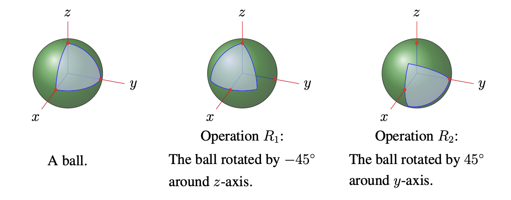
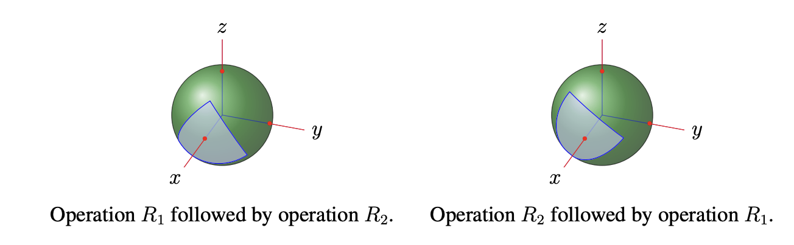
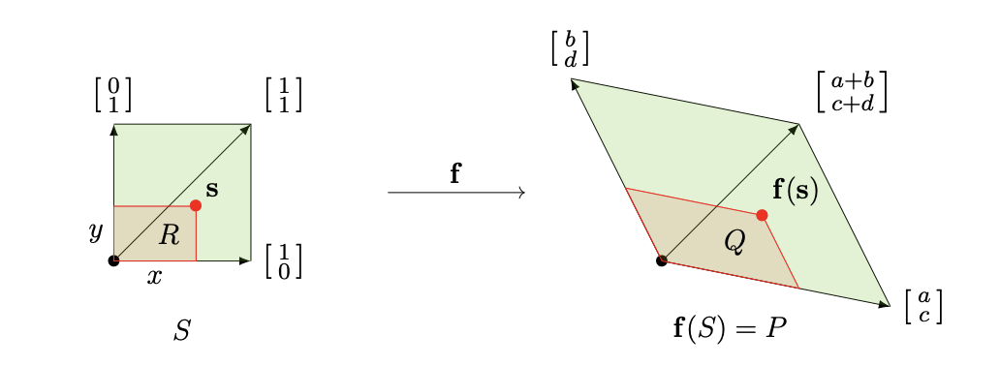
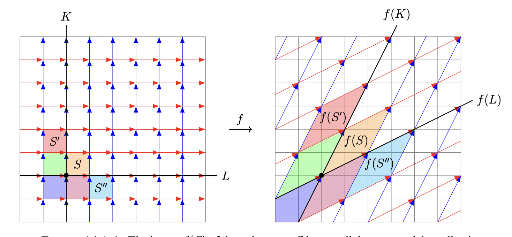

# Linear transformations and matrix multiplication

## Rotations and linear functions

The overall effect of applying a counterclockwise rotation by an angle $\theta_1$ and then a counterclockwise rotation by an angle $\theta_2$ is such a rotation: counterclockwise by the angle $\theta_1 + \theta_2$. Note in particular that the order in which we apply the $2$-dimensional rotations doesn't matter for the final outcome since the angle sums $\theta_1 + \theta_2$ and $\theta_2 + \theta_1$ are equal.

When we consider an analogue in $3$ dimensions, the situation is more subtle (and so more interesting). Think of the following operations you can do to the surface of a ball:

- **operation $R_1$**: rotate the ball by $-45$ degrees around the vertical axis through its center;
- **operation $R_2$**: rotate the ball by $45$ degrees around a specified horizontal axis through its center.

What if you do operation $R_1$ first and then operation $R_2$? What if you do operation $R_2$ first and then operation $R_1$? The overall effect of these is not the same!

**Definition:** A function $\mathbf{f} : \mathbb{R}^n \to \mathbb{R}^m$ is called

- a **linear function**, or a **linear transformation**, if there is an $m \times n$ matrix $A$ for which $\mathbf{f}(\mathbf{x}) = A\mathbf{x}$ for all vectors $\mathbf{x} \in \mathbb{R}^n$ (so the $j$th column of $A$ is $A\mathbf{e}_j = \mathbf{f}(\mathbf{e}_j)$),
- an **affine function**, or an **affine transformation**, if there is an $m \times n$ matrix $A$ and a vector $\mathbf{b} \in \mathbb{R}^m$ for which $\mathbf{f}(\mathbf{x}) = A\mathbf{x} + \mathbf{b}$ for all vectors $\mathbf{x} \in \mathbb{R}^n$.

This is not a new class of functions. In [Linear functions, matrices, and the derivative matrix](linear_functions_matrices_and_the_derivative_matrix.md#linear-and-affine-functions) we defined these notions one component at a time: $\mathbf{f}$ was called linear when each component function $f_i$ has the form $a_{i1}x_1 + \cdots + a_{in}x_n$, and affine when each $f_i$ has that form plus a constant. We then recorded, as a consequence of inspecting the definitions, that linear functions are exactly those of the form $\mathbf{f}(\mathbf{x}) = A\mathbf{x}$ and affine functions exactly those of the form $\mathbf{f}(\mathbf{x}) = A\mathbf{x} + \mathbf{b}$.

What was a *consequence* there is taken as the *definition* here. The two formulations describe the same functions, and it is worth seeing exactly how each turns into the other. Starting from the componentwise description, suppose $f_i(\mathbf{x}) = a_{i1}x_1 + \cdots + a_{in}x_n$ for each $i$. Collect the coefficients of $f_i$ as the $i$th row of a matrix $A$. Then $\mathbf{f}(\mathbf{x}) = A\mathbf{x}$, because the $i$th entry of $A\mathbf{x}$ is precisely the $i$th row of $A$ dotted with $\mathbf{x}$, which is $f_i(\mathbf{x})$. Starting instead from $\mathbf{f}(\mathbf{x}) = A\mathbf{x}$, reading off the $i$th row of $A$ hands back the coefficients of $f_i$. So the matrix is nothing but the table of coefficients of the component functions, one row per component. The advantage of starting from $\mathbf{f}(\mathbf{x}) = A\mathbf{x}$ is that it names the matrix up front.

We want to discuss how to visualize the effect of the linear transformation $\mathbf{f} : \mathbb{R}^2 \to \mathbb{R}^2$ associated with a matrix

$$
A = \begin{pmatrix} a & b \\[0.25em] c & d \end{pmatrix}
$$

whose columns span different lines through $\mathbf{0}$. Let $S$ be the "unit square"

$$S = \{(x, y) \in \mathbb{R}^2 : 0 \leq x, y \leq 1\}$$

(on the left in the figure below), so $\mathbb{R}^2$ is tiled by copies of $S$ laid out in all directions (like a bathroom floor). Let $\mathbf{f}(S)$ denote the output of $\mathbf{f}$ on $S$ (i.e., the collection of points $\mathbf{f}(\mathbf{s})$ for $\mathbf{s} \in S$), also called the **image** of $S$ under $\mathbf{f}$. The image $\mathbf{f}(S)$ is a parallelogram (on the right in the figure below). 

This helps to visualize the effect of $\mathbf{f}$ on $\mathbb{R}^2$ due to two facts:

- **Linearity Principle:** for $c_1, c_2 \in \mathbb{R}$ and $\mathbf{v}_1, \mathbf{v}_2 \in \mathbb{R}^2$ we have $\mathbf{f}(c_1\mathbf{v}_1 + c_2\mathbf{v}_2) = c_1\mathbf{f}(\mathbf{v}_1) + c_2\mathbf{f}(\mathbf{v}_2)$.
- **Tiling Principle:** $\mathbf{f}$ transforms the tiling of $\mathbb{R}^2$ by copies of $S$ into a tiling of $\mathbb{R}^2$ by copies of $\mathbf{f}(S)$.

**Example:** Consider $\mathbf{f} : \mathbb{R}^2 \to \mathbb{R}^2$ given by the matrix

$$
A = \begin{pmatrix} 2 & 1 \\[0.25em] 1 & 2 \end{pmatrix}.
$$

$\mathbf{f}(S)$ is the parallelogram with edges

$$
\mathbf{f}\begin{pmatrix} 1 \\[0.25em] 0 \end{pmatrix} = \begin{pmatrix} 2 \\[0.25em] 1 \end{pmatrix}
\quad (\text{first column of } A)
\qquad \text{and} \qquad
\mathbf{f}\begin{pmatrix} 0 \\[0.25em] 1 \end{pmatrix} = \begin{pmatrix} 1 \\[0.25em] 2 \end{pmatrix}
\quad (\text{second column of } A),
$$

as shown in the figure below. 

By the Tiling Principle, $\mathbf{f}$ transforms the usual tiling of $\mathbb{R}^2$ by unit squares into the tiling by copies of $\mathbf{f}(S)$ laid out in all directions parallel to the edges of $\mathbf{f}(S)$.

!!! note
    The tiling on the right in the figure above expresses the parametric form of $\mathbb{R}^2$ using the vectors

    $$
    \mathbf{e} = \mathbf{f}\begin{pmatrix} 1 \\[0.25em] 0 \end{pmatrix} = \begin{pmatrix} 2 \\[0.25em] 1 \end{pmatrix}
    \quad (\text{first column of } A),
    \qquad
    \mathbf{e}' = \mathbf{f}\begin{pmatrix} 0 \\[0.25em] 1 \end{pmatrix} = \begin{pmatrix} 1 \\[0.25em] 2 \end{pmatrix}
    \quad (\text{second column of } A).
    $$

    In particular, the Linearity Principle

    $$
    t\mathbf{e} + t'\mathbf{e}'
    = t\,\mathbf{f}\begin{pmatrix} 1 \\[0.25em] 0 \end{pmatrix} + t'\,\mathbf{f}\begin{pmatrix} 0 \\[0.25em] 1 \end{pmatrix}
    = \mathbf{f}\left( t\begin{pmatrix} 1 \\[0.25em] 0 \end{pmatrix} + t'\begin{pmatrix} 0 \\[0.25em] 1 \end{pmatrix} \right)
    = \mathbf{f}\begin{pmatrix} t \\[0.25em] t' \end{pmatrix}
    $$

    says that the point in parametric form $t\mathbf{e} + t'\mathbf{e}'$ is the output of $\mathbf{f}$ on $\begin{pmatrix} t \\ t' \end{pmatrix}$.

**Example:** When MRI is used to create a $3$-dimensional image of someone's brain and doctors use the image for medical diagnosis, the computers use many affine transformations $\mathbf{f}(\mathbf{x}) = A\mathbf{x} + \mathbf{b}$. The matrix $A$ accounts for rotation of the image in space, as well as dilation for "zooming in/out" on the image, and the vector $\mathbf{b}$ is a displacement vector that accounts for spatial translation of the image.

## Linear functions are those which respect addition and scalar multiplication

!!! note "Theorem"
    A function $\mathbf{g} : \mathbb{R}^n \to \mathbb{R}^m$ is linear precisely when it respects the vector operations:

    $$
    \mathbf{g}(c\mathbf{x}) = c\,\mathbf{g}(\mathbf{x}), \qquad
    \mathbf{g}(\mathbf{x} + \mathbf{y}) = \mathbf{g}(\mathbf{x}) + \mathbf{g}(\mathbf{y})
    $$

    for all scalars $c \in \mathbb{R}$ and vectors $\mathbf{x}, \mathbf{y} \in \mathbb{R}^n$.

    If $\mathbf{g} : \mathbb{R}^n \to \mathbb{R}^m$ and $\mathbf{h} : \mathbb{R}^p \to \mathbb{R}^n$ are linear, then so is the composition $\mathbf{g} \circ \mathbf{h} : \mathbb{R}^p \to \mathbb{R}^m$.

Affine functions $\mathbf{h}(\mathbf{x}) = A\mathbf{x} + \mathbf{b}$ with $\mathbf{b} \neq \mathbf{0}$ do not satisfy this property. For instance:

$$
\mathbf{h}(5\mathbf{x}) = A(5\mathbf{x}) + \mathbf{b} = 5(A\mathbf{x}) + \mathbf{b}
\qquad \text{and} \qquad
5\,\mathbf{h}(\mathbf{x}) = 5(A\mathbf{x} + \mathbf{b}) = 5(A\mathbf{x}) + 5\mathbf{b},
$$

so $\mathbf{h}(5\mathbf{x}) \neq 5\,\mathbf{h}(\mathbf{x})$ because $\mathbf{b} \neq 5\mathbf{b}$ when $\mathbf{b} \neq \mathbf{0}$ (compare lengths of $\mathbf{b}$ and $5\mathbf{b}$ for nonzero $\mathbf{b}$). Likewise,

$$
\mathbf{h}(\mathbf{x} + \mathbf{y}) = A(\mathbf{x} + \mathbf{y}) + \mathbf{b} = A\mathbf{x} + A\mathbf{y} + \mathbf{b},
$$

$$
\mathbf{h}(\mathbf{x}) + \mathbf{h}(\mathbf{y}) = (A\mathbf{x} + \mathbf{b}) + (A\mathbf{y} + \mathbf{b}) = A\mathbf{x} + A\mathbf{y} + 2\mathbf{b},
$$

so $\mathbf{h}(\mathbf{x} + \mathbf{y}) \neq \mathbf{h}(\mathbf{x}) + \mathbf{h}(\mathbf{y})$ when $\mathbf{b}$ is nonzero (since $\mathbf{b} \neq 2\mathbf{b}$ for such $\mathbf{b}$). The failure of these identities for general affine functions is one of the reasons why linear functions are more fundamental than affine functions.

**Example:** For any nonzero [linear subspace](span_subspaces_and_dimension.md#span-and-linear-subspaces) $V$ of $\mathbb{R}^n$ we claim that the [projection](projections.md) map $\text{Proj}_V : \mathbb{R}^n \to \mathbb{R}^n$ is linear (so it is given by some $n \times n$ matrix!). There is another way to describe $\text{Proj}_V$ that makes more contact with vector algebra: if $\{\mathbf{w}_1, \ldots, \mathbf{w}_k\}$ is an [orthogonal basis](basis_and_orthogonality.md) of $V$ then the formula from [Projections](projections.md#projection-onto-a-general-subspace) gives the explicit expression

$$
\text{Proj}_V(\mathbf{x}) = \sum_{i=1}^{k} \left( \frac{\mathbf{x} \cdot \mathbf{w}_i}{\mathbf{w}_i \cdot \mathbf{w}_i} \right) \mathbf{w}_i .
$$

So the linearity of $\text{Proj}_V$ can be rephrased as: does this summation expression behave well with respect to addition and scalar multiplication in $\mathbf{x}$?

Yes: for all $\mathbf{x}, \mathbf{y} \in \mathbb{R}^n$ we have $(\mathbf{x} + \mathbf{y}) \cdot \mathbf{w} = \mathbf{x} \cdot \mathbf{w} + \mathbf{y} \cdot \mathbf{w}$ for every $\mathbf{w} \in \mathbb{R}^n$, so

$$
\begin{aligned}
\text{Proj}_V(\mathbf{x} + \mathbf{y})
&= \sum_{i=1}^{k} \left( \frac{(\mathbf{x} + \mathbf{y}) \cdot \mathbf{w}_i}{\mathbf{w}_i \cdot \mathbf{w}_i} \right) \mathbf{w}_i
= \sum_{i=1}^{k} \left( \frac{\mathbf{x} \cdot \mathbf{w}_i + \mathbf{y} \cdot \mathbf{w}_i}{\mathbf{w}_i \cdot \mathbf{w}_i} \right) \mathbf{w}_i \\[0.5em]
&= \sum_{i=1}^{k} \left( \frac{\mathbf{x} \cdot \mathbf{w}_i}{\mathbf{w}_i \cdot \mathbf{w}_i} \right) \mathbf{w}_i
+ \sum_{i=1}^{k} \left( \frac{\mathbf{y} \cdot \mathbf{w}_i}{\mathbf{w}_i \cdot \mathbf{w}_i} \right) \mathbf{w}_i
= \text{Proj}_V(\mathbf{x}) + \text{Proj}_V(\mathbf{y}) .
\end{aligned}
$$

Likewise, for any $\mathbf{x} \in \mathbb{R}^n$ and $c \in \mathbb{R}$ we have $(c\mathbf{x}) \cdot \mathbf{w} = c(\mathbf{x} \cdot \mathbf{w})$ for every $\mathbf{w} \in \mathbb{R}^n$, so

$$
\text{Proj}_V(c\mathbf{x})
= \sum_{i=1}^{k} \left( \frac{(c\mathbf{x}) \cdot \mathbf{w}_i}{\mathbf{w}_i \cdot \mathbf{w}_i} \right) \mathbf{w}_i
= \sum_{i=1}^{k} \left( \frac{c(\mathbf{x} \cdot \mathbf{w}_i)}{\mathbf{w}_i \cdot \mathbf{w}_i} \right) \mathbf{w}_i
= c \sum_{i=1}^{k} \left( \frac{\mathbf{x} \cdot \mathbf{w}_i}{\mathbf{w}_i \cdot \mathbf{w}_i} \right) \mathbf{w}_i
= c\,\text{Proj}_V(\mathbf{x}) .
$$

This concludes the verification that $\text{Proj}_V$ is linear. Actually, not quite: we swept something under the rug. Can you see the gap in our argument?

The gap is that we took it for granted that $V$ has an orthogonal basis (so the formula above is actually applicable to $V$!). Up to now we don't know that linear subspaces $V$ always have orthogonal bases except when the [dimension](span_subspaces_and_dimension.md#dimension) $\dim V$ is $1$ or $2$, the case $\dim V = 2$ having been handled in [Applications of projections](applications_of_projections_in_rn_orthogonal_bases_of_planes_and_linear_regression.md#finding-an-orthogonal-basis-special-case). This hole in our knowledge will be filled in later.

What is the $n \times n$ matrix for $\text{Proj}_V$? Recall the [coordinate vectors](linear_functions_matrices_and_the_derivative_matrix.md#further-viewpoints-on-matrix-vector-products) $\mathbf{e}_1, \ldots, \mathbf{e}_n$: the vector $\mathbf{e}_j \in \mathbb{R}^n$ has a $1$ in the $j$th position and $0$ everywhere else,

$$
\mathbf{e}_1 =
\begin{pmatrix} 1 \\[0.25em] 0 \\[0.25em] \vdots \\[0.25em] 0 \end{pmatrix},
\qquad
\mathbf{e}_2 =
\begin{pmatrix} 0 \\[0.25em] 1 \\[0.25em] \vdots \\[0.25em] 0 \end{pmatrix},
\qquad \ldots, \qquad
\mathbf{e}_n =
\begin{pmatrix} 0 \\[0.25em] 0 \\[0.25em] \vdots \\[0.25em] 1 \end{pmatrix},
$$

and the matrix of a linear function has $\mathbf{f}(\mathbf{e}_j)$ as its $j$th column.

So, as for any linear function $\mathbb{R}^n \to \mathbb{R}^n$, the $j$th column of the matrix for $\text{Proj}_V$ is its effect on $\mathbf{e}_j$, which is to say its $j$th column is

$$
\text{Proj}_V(\mathbf{e}_j) = \sum_{i=1}^{k} \left( \frac{\mathbf{e}_j \cdot \mathbf{w}_i}{\mathbf{w}_i \cdot \mathbf{w}_i} \right) \mathbf{w}_i
$$

upon choosing an orthogonal basis $\{\mathbf{w}_1, \ldots, \mathbf{w}_k\}$ of $V$.

**Example:** A "linear" circuit is one whose output (e.g., currents in various parts, which we want to know) is a linear function of its input (e.g., voltage differences in various parts, which we control). Concretely, these are the circuits involving only resistors, capacitors, and inductors; they account for all of the circuits studied in introductory physics (whereas circuits involving components such as transistors or diodes are not linear). The analysis of every linear circuit, no matter how big or complicated, always can be done systematically via (possibly very high-dimensional!) linear algebra.

## Composing linear transformations and matrix multiplication