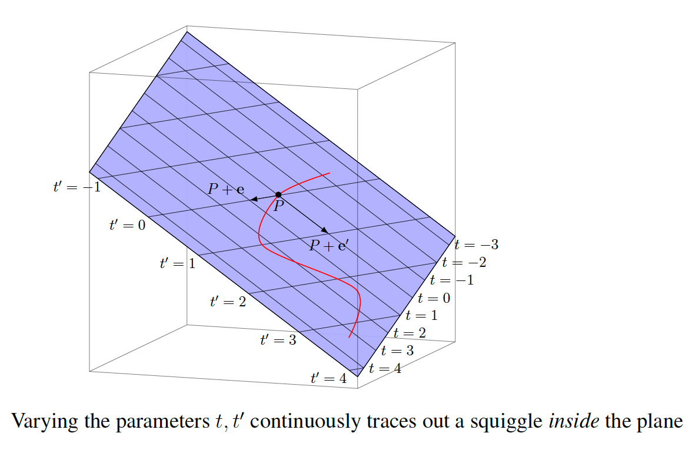

# Planes in $\mathbb{R}^3$

The collection of points $(x, y, z)$ in $\mathbb{R}^3$ satisfying an equation of the form

$$ax + by + cz = d$$

with at least one of the constants $a$, $b$, or $c$ nonzero, is a plane in $\mathbb{R}^3$. Note that although the equation $x = 0$ on $\mathbb{R}^2$ defines a line (the $y$-axis, consisting of points $(0, y)$), the "same" equation $x = 0$ on $\mathbb{R}^3$ defines a plane, namely the vertical $yz$-plane consisting of points $(0, y, z)$.

## Lines in $\mathbb{R}^3$

In $\mathbb{R}^3$, a line can be represented in several forms:

**Parametric form** (most common): $\mathbf{r}(t) = \mathbf{r}_0 + t\mathbf{v}$ where $\mathbf{r}_0$ is a point on the line and $\mathbf{v}$ is a direction vector.

As an example, consider a line that passes through the point $(1, 0, -2)$ and has direction vector $(3, 1, 4)$. The parametric equation is:

$$\mathbf{r}(t) = (1, 0, -2) + t(3, 1, 4) = (1 + 3t, 0 + t, -2 + 4t)$$

This means any point on the line has coordinates $(1 + 3t, t, -2 + 4t)$ for some real number $t$. For example:

- When $t = 0$: $(1, 0, -2)$ (the base point)

- When $t = 1$: $(4, 1, 2)$

- When $t = -1$: $(-2, -1, -6)$

**Parametric form through two points**: Given two points $\mathbf{p}$ and $\mathbf{q}$, the line passing through them has parametric equation:

$$\mathbf{r}(t) = \mathbf{p} + t(\mathbf{q} - \mathbf{p}) = (1-t)\mathbf{p} + t\mathbf{q}$$

This form uses the direction vector $\mathbf{q} - \mathbf{p}$ and parameter $t$ ranges from 0 to 1 to give all points between $\mathbf{p}$ and $\mathbf{q}$.

*Example*: For points $\mathbf{p} = (1, 2, 3)$ and $\mathbf{q} = (4, 1, 0)$, the line equation is:

$$\mathbf{r}(t) = (1, 2, 3) + t(3, -1, -3) = (1 + 3t, 2 - t, 3 - 3t)$$

**Symmetric form** (when all components of $\mathbf{v}$ are nonzero): $\frac{x - x_0}{v_1} = \frac{y - y_0}{v_2} = \frac{z - z_0}{v_3}$

In the symmetric form:

- $(x_0, y_0, z_0)$ is a point on the line (the base point)

- $(v_1, v_2, v_3)$ are the components of the direction vector $\mathbf{v}$

So if we have a line with parametric form $\mathbf{r}(t) = \mathbf{r}_0 + t\mathbf{v}$, then $(x_0, y_0, z_0) = \mathbf{r}_0$ and $(v_1, v_2, v_3) = \mathbf{v}$.

For example, if a line passes through the point $(2, -1, 3)$ and has direction vector $(1, 2, -1)$, then the symmetric form would be:

$$\frac{x - 2}{1} = \frac{y - (-1)}{2} = \frac{z - 3}{-1}$$

This form eliminates the parameter $t$ and gives a direct relationship between the coordinates, but it only works when all components of the direction vector are nonzero (to avoid division by zero).

**Intersection of two planes**: 
$\begin{cases}
a_1x + b_1y + c_1z = d_1 \\
a_2x + b_2y + c_2z = d_2
\end{cases}$

The key difference from $\mathbb{R}^2$ is that in $\mathbb{R}^3$, a single linear equation $ax + by + cz = d$ defines a plane, not a line. To define a line in $\mathbb{R}^3$, you need either a parametric equation with one parameter, the intersection of two planes (two linear equations), or, a point and a direction vector.

## Forms of Planes

Planes in $\mathbb{R}^3$ can be represented in several different forms, each useful for different purposes:

**1. Point-normal form**: $(x - x_0, y - y_0, z - z_0) \cdot \mathbf{n} = 0$

This form uses a point $(x_0, y_0, z_0)$ on the plane and a normal vector $\mathbf{n} = (a, b, c)$ perpendicular to the plane.

*Example*: A plane (shown above) passing through the point $(0, 1, 1)$ with normal vector $(3, -2, 1)$ has equation:

$$(x - 0, y - 1, z - 1) \cdot (3, -2, 1) = 0$$

$$3(x - 0) - 2(y - 1) + 1(z - 1) = 0$$

$$3x - 2y + z + 1 = 0$$

From the coefficients we again read off that (3, -2, 1) is a normal vector to the plane (not to the individual points in the plane, but rather to differences between such points). This is no surprise, in view of how the plane was originally defined.

**2. General form**: $ax + by + cz + d = 0$

This is the standard form where $(a, b, c)$ is a normal vector to the plane and $d$ determines the position of the plane in space.

*Example*: The plane $2x - 3y + 4z = 12$ has normal vector $(2, -3, 4)$ and can be rewritten as $2x - 3y + 4z - 12 = 0$.

The plane $ax + by + cz + d = 0$ is at a distance of $\frac{|d|}{\sqrt{a^2 + b^2 + c^2}}$ from the origin. All planes with the same normal vector $(a, b, c)$ but different $d$ values are parallel to each other.

If you think of the normal vector $(a,b,c)$ as pointing in a fixed direction, then $d$ tells you "how far along that direction" the plane is located. For example, the planes $2x - 3y + 4z = 0$, $2x - 3y + 4z = 5$, and $2x - 3y + 4z = -3$ all have the same normal vector $(2, -3, 4)$ but are at different distances from the origin.

**3. Parametric form**: $\mathbf{r}(s,t) = \mathbf{r}_0 + s\mathbf{v}_1 + t\mathbf{v}_2$

This form uses a point $\mathbf{r}_0$ on the plane and two non-parallel direction vectors $\mathbf{v}_1$ and $\mathbf{v}_2$ that lie in the plane.

*Example*: A plane through the point $(1, 0, 2)$ with direction vectors $(1, 1, 0)$ and $(0, 1, 1)$ has parametric equation:
$\mathbf{r}(s,t) = (1, 0, 2) + s(1, 1, 0) + t(0, 1, 1) = (1 + s, s + t, 2 + t)$

An advantage of the parametric form is that as we independently vary values of the parameters $t$ and $t′$, the vectors we get in the parametric form are guaranteed to lie exactly on the plane. For instance, if we want to trace out some path in the plane, then by varying the values of $t$ and $t′$ continuously we trace out a continuous curve exactly in the plan.

The parametric description for planes and its analogues for more complicated surfaces (such as a sphere, a cylinder, etc.) is quite useful in computer graphics to generate the image of a path of motion lying exactly on a specific surface. For such applications a parametric form is far more useful than the general form; as with the parametric form we do not have to solve for anything.

**4. Three-point form**: Using three non-collinear points

Given three points $(x_1, y_1, z_1)$, $(x_2, y_2, z_2)$, and $(x_3, y_3, z_3)$, the plane equation is:
$\begin{vmatrix} x - x_1 & y - y_1 & z - z_1 \\ x_2 - x_1 & y_2 - y_1 & z_2 - z_1 \\ x_3 - x_1 & y_3 - y_1 & z_3 - z_1 \end{vmatrix} = 0$

*Example*: For points $(1, 0, 0)$, $(0, 1, 0)$, and $(0, 0, 1)$, the plane equation becomes:

$$\begin{vmatrix} x - 1 & y & z \\ -1 & 1 & 0 \\ -1 & 0 & 1 \end{vmatrix} = 0$$

$$(x - 1)(1 \cdot 1 - 0 \cdot 0) - y(-1 \cdot 1 - 0 \cdot (-1)) + z(-1 \cdot 0 - 1 \cdot (-1)) = 0$$

$$(x - 1) + y + z = 0$$

$$x + y + z = 1$$

**Note:** We claim that the only way three different points can be on a common line in space is when the difference vectors from one of them to the other two lie along the same or opposite directions. This corresponds to those two difference vectors being scalar multiples of each other (a positive scalar when pointing in the same direction, and a negative scalar when pointing in opposite directions).

**5. Intercept form**: $\frac{x}{a} + \frac{y}{b} + \frac{z}{c} = 1$

This form shows the intercepts of the plane with the coordinate axes: $(a, 0, 0)$, $(0, b, 0)$, and $(0, 0, c)$.

*Example*: The plane $\frac{x}{3} + \frac{y}{2} + \frac{z}{6} = 1$ has intercepts at $(3, 0, 0)$, $(0, 2, 0)$, and $(0, 0, 6)$.

Each form has its advantages. The **Point-normal form** is useful for finding distance from a point to a plane. The **General form** is standard for solving systems of equations. The **Parametric form** is convenient for generating points on the plane. **Three-point form** is natural when given three points. The **Intercept form** provides immediate geometric insight.