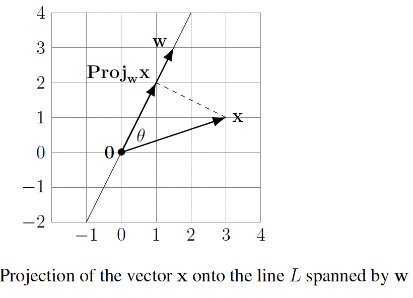
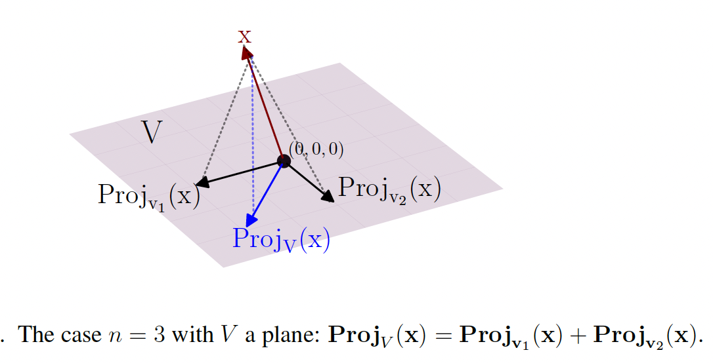

# Projections

For many applications in engineering, physics, and data-related problems in all scientific fields (genetics, economics, neuroscience, computer science, etc.) it is essential to go far beyond $\mathbb{R}^3$ and solve problems involving distance minimization to subspaces in $\mathbb{R}^n$ for any $n$:

If $V$ is a linear subspace in $\mathbb{R}^n$ and $\mathbf{x} \in \mathbb{R}^n$ is some point, then what point in $V$ is closest to $\mathbf{x}$? This closest point will be called the **projection** of $\mathbf{x}$ into $V$.

## The closest point to a line

The way we will solve the general problem of distance minimization from a point in $\mathbb{R}^n$ to a linear subspace $V$ involves "assembling" a collection of solutions to distance minimization to certain $1$-dimensional linear subspaces of $V$, or in other words, solving distance minimization problems to a collection of lines through $0$ in $\mathbb{R}^n$.

Since minimizing distance to lines will be the foundation for the general case, we begin by focusing on this special case. Consider a line $L$ in $\mathbb{R}^n$ through $0$, so $L = \text{span}(\mathbf{w}) = \{c\mathbf{w} : c \in \mathbb{R}\}$ where $\mathbf{w} \in \mathbb{R}^n$ is some nonzero vector. For any point $\mathbf{x} \in \mathbb{R}^n$, we want to show that there is a unique point in $L$ closest to $\mathbf{x}$, and to actually give a formula for how to compute this nearest point to $\mathbf{x}$ in $L$. 

Here is the fundamental idea: although our task (necessary for many applications!) takes place in $\mathbb{R}^n$ with completely general (and possibly huge) $n$, we look at a low-dimensional instance of the problem in the hope that the low-dimensional case will suggest some feature that has a chance to adapt to the general situation. This balancing of insight from pictures in low-dimensional cases alongside algebraic work and geometric language developed for $\mathbb{R}^n$ with general $n$ is an important part of linear algebra, giving visual insight into $\mathbb{R}^n$ for big $n$. This doesn't justify results in $\mathbb{R}^n$ for general $n$, but it inspires what we should expect and/or try to prove is true.

Let's look at the case $n = 2$ as shown in the figure below.

The key insight suggested by the figure above is that the point on the line $L$ that is closest to $\mathbf{x}$ has another characterization (that in turn will allow us to compute it): it is the one point on $L$ for which the displacement vector to $\mathbf{x}$ (the dotted line segment joining it to $\mathbf{x}$ as in the figure above) is perpendicular to $L$, or equivalently is perpendicular to $\mathbf{w}$. Visually, the perpendicular direction to $L$ from $\mathbf{x}$ is the "most direct" route. Or put another way, you may convince yourself by drawing some pictures that any deviation from perpendicularity entails a longer path from $\mathbf{x}$ to the line $L$.

To summarize, the figure above suggests a workable idea: the point $c\mathbf{w} \in L$ for which $\|\mathbf{x} - c\mathbf{w}\|$ is minimal should also have the property that $\mathbf{x} - c\mathbf{w}$ is orthogonal to everything in $L$. Although this idea is suggested by the picture in $\mathbb{R}^2$, as written it makes equally good sense in $\mathbb{R}^n$ for any $n$ whatsoever. But is it true? And even once we know it is true, how can we exploit this property of the nearest point to $\mathbf{x}$ on $L$ to actually compute this nearest point?

The informal reasoning above may have already convinced you that the distance is minimized precisely when the displacement vector is orthogonal to $L$.

**Method I (algebraic).** In accordance with the idea inspired by the figure above in the case $n = 2$, for general $n$ we look for a scalar $c$ for which $\mathbf{x} - c\mathbf{w}$ is orthogonal to every vector in $L$. The points of $L = \text{span}(\mathbf{w})$ are those of the form $a\mathbf{w}$ for scalars $a$, so we seek $c$ making $(\mathbf{x} - c\mathbf{w}) \cdot (a\mathbf{w}) = 0$ for every scalar $a$. The dot product has the property that $(\mathbf{x} - c\mathbf{w}) \cdot (a\mathbf{w}) = a((\mathbf{x} - c\mathbf{w}) \cdot \mathbf{w})$, so actually it suffices to make sure that $(\mathbf{x} - c\mathbf{w}) \cdot \mathbf{w} = 0$. We can use the further properties of the dot product to rewrite this as

$$0 = (\mathbf{x} - c\mathbf{w}) \cdot \mathbf{w} = \mathbf{x} \cdot \mathbf{w} - (c\mathbf{w}) \cdot \mathbf{w}.$$

We can rearrange this expression to write it as $c(\mathbf{w} \cdot \mathbf{w}) = \mathbf{x} \cdot \mathbf{w}$. But $\mathbf{w} \cdot \mathbf{w} = \|\mathbf{w}\|^2 > 0$ (since $\mathbf{w} \neq 0$), so it makes sense to divide both sides by $\mathbf{w} \cdot \mathbf{w}$ to obtain that $c = \frac{\mathbf{x} \cdot \mathbf{w}}{\mathbf{w} \cdot \mathbf{w}}$. This is the coefficient we had previously regarded as unknown! 

To summarize, we have shown through algebra and the properties of dot products that there is exactly one point in the line $L = \text{span}(\mathbf{w})$ through $0$ in $\mathbb{R}^n$ whose difference from $\mathbf{x}$ is orthogonal to everything in $L$: it is $\frac{\mathbf{x} \cdot \mathbf{w}}{\mathbf{w} \cdot \mathbf{w}} \mathbf{w}$. We have not yet actually shown that this scalar multiple of $\mathbf{w}$ on $L$ is closer to $\mathbf{x}$ than every other vector in $L$, but if we believe the orthogonality insight inspired by the $2$-dimensional picture in the figure above then this must be that closest point. As a bonus, we have obtained an explicit formula for it!

**Method II (geometric).** We next use some plane geometry via the figure above to obtain the same formula for the closest point. Strictly speaking, this argument only applies when $n = 2$, but you might find that it gives the formula some visual meaning that is somehow lacking in the purely algebraic work in Method I.

There is nothing to be done if $\mathbf{x} \cdot \mathbf{w} = 0$ (in that case $\mathbf{x}$ is perpendicular to $L$ and we are thereby convinced that $0$ is the closest point, as is also given by the desired formula). Hence, we can suppose $\mathbf{x} \neq 0$ and the angle $\theta$ between $\mathbf{x}$ and $\mathbf{w}$ satisfies either $0° < \theta < 90°$ or $90° < \theta < 180°$.

The case of acute $\theta$ is shown in the figure above, whereas if $\theta$ is obtuse then the point we seek would be in the direction of $-\mathbf{w}$ (rather than in the direction of $\mathbf{w}$). If $\theta$ is acute, as in the figure above, then by basic trigonometry, the leg along $L$ for the right triangle as shown has length $\|\mathbf{x}\| \cos(\theta)$ and it points in the direction of the unit vector $\mathbf{w}/\|\mathbf{w}\|$. This says that the endpoint on $L$ of the dotted segment is the vector

$$(\|\mathbf{x}\| \cos(\theta)) \frac{\mathbf{w}}{\|\mathbf{w}\|}.$$

But $\cos(\theta) = (\mathbf{x} \cdot \mathbf{w})/(\|\mathbf{x}\|\|\mathbf{w}\|)$, so plugging this into the equation above yields the desired formula since $\|\mathbf{w}\|^2 = \mathbf{w} \cdot \mathbf{w}$. The case when $90° < \theta < 180°$ goes very similarly, except now $\cos(\theta) < 0$ (so the endpoint on $L$ of the dotted segment is in the direction of the opposite unit vector $-\mathbf{w}/\|\mathbf{w}\|$) and we have to work with the length $\|\mathbf{x}\| |\cos(\theta)| = -\|\mathbf{x}\| \cos(\theta)$. Putting these together, the two signs cancel and we get the desired formula again.

**Proposition.** Let $L = \text{span}(\mathbf{w}) = \{c\mathbf{w} : c \in \mathbb{R}\}$ be a $1$-dimensional linear subspace of $\mathbb{R}^n$ (so $\mathbf{w} \neq 0$), a "line". Choose any point $\mathbf{x} \in \mathbb{R}^n$. There is exactly one point in $L$ closest to $\mathbf{x}$, and it is given by the scalar multiple

$$\frac{\mathbf{x} \cdot \mathbf{w}}{\mathbf{w} \cdot \mathbf{w}} \mathbf{w}$$

of $\mathbf{w}$. This is called "the projection of $\mathbf{x}$ into $\text{span}(\mathbf{w})$"; we denote it by the symbol $\text{Proj}_{\mathbf{w}} \mathbf{x}$.

**Note:** This can be seen as (dot product of $\mathbf{x}$ and $\mathbf{w}$), which is a scalar, times the unit vector in direction of $\mathbf{w}$.

**Example:** Consider $\mathbf{v} = \begin{bmatrix} 1 \\ 3 \\ 4 \end{bmatrix}$. The numbers $1, 3, 4$ represent the amount of $\mathbf{v}$ that points along the $x, y, z$-axes respectively. More precisely, $\begin{bmatrix} 1 \\ 0 \\ 0 \end{bmatrix} = \mathbf{e}_1$ is the component of $\mathbf{v}$ along the $x$-axis line, $\begin{bmatrix} 0 \\ 3 \\ 0 \end{bmatrix} = 3\mathbf{e}_2$ is the component of $\mathbf{v}$ along the $y$-axis line, and $\begin{bmatrix} 0 \\ 0 \\ 4 \end{bmatrix} = 4\mathbf{e}_3$ is the component of $\mathbf{v}$ along the $z$-axis line. These are the closest points to $\mathbf{v}$ on the $x$-, $y$- and $z$-axes, respectively.

In terms of this data, we want to compute the projection of $\mathbf{v}$ on some line pointing with some other direction: if $\mathbf{w}$ is a (nonzero) vector along this new direction, we want to compute $\text{Proj}_{\mathbf{w}}(\mathbf{v})$. The key point is that the formula for $\text{Proj}_{\mathbf{w}}(\mathbf{x})$ behaves well for any linear combination of any $n$-vectors $\mathbf{x}_1, \mathbf{x}_2, \ldots, \mathbf{x}_k$: the projection of a linear combination of the $\mathbf{x}_i$'s is equal to the corresponding linear combination of the projections.

For example, with $k = 2$ it says $\text{Proj}_{\mathbf{w}}(5\mathbf{x}_1 - 7\mathbf{x}_2) = 5 \text{Proj}_{\mathbf{w}}(\mathbf{x}_1) - 7 \text{Proj}_{\mathbf{w}}(\mathbf{x}_2)$ and likewise with $5$ and $-7$ replaced by any two scalars. The reason this works is an algebraic calculation:

$$\text{Proj}_{\mathbf{w}}(c_1\mathbf{x}_1 + \cdots + c_k\mathbf{x}_k) = \frac{(c_1\mathbf{x}_1 + \cdots + c_k\mathbf{x}_k) \cdot \mathbf{w}}{\mathbf{w} \cdot \mathbf{w}} \mathbf{w} = \frac{c_1(\mathbf{x}_1 \cdot \mathbf{w}) + \cdots + c_k(\mathbf{x}_k \cdot \mathbf{w})}{\mathbf{w} \cdot \mathbf{w}} \mathbf{w} = c_1 \frac{\mathbf{x}_1 \cdot \mathbf{w}}{\mathbf{w} \cdot \mathbf{w}} \mathbf{w} + \cdots + c_k \frac{\mathbf{x}_k \cdot \mathbf{w}}{\mathbf{w} \cdot \mathbf{w}} \mathbf{w} = c_1 \text{Proj}_{\mathbf{w}}(\mathbf{x}_1) + \cdots + c_k \text{Proj}_{\mathbf{w}}(\mathbf{x}_k).$$

Applying this to the expression $\mathbf{v} = \mathbf{e}_1 + 3\mathbf{e}_2 + 4\mathbf{e}_3$ yields $\text{Proj}_{\mathbf{w}}(\mathbf{v}) = \text{Proj}_{\mathbf{w}}(\mathbf{e}_1) + 3 \text{Proj}_{\mathbf{w}}(\mathbf{e}_2) + 4 \text{Proj}_{\mathbf{w}}(\mathbf{e}_3)$.

## Projection onto a general subspace

Let's look at the case of a plane $V$ through the origin in $\mathbb{R}^3$ equipped with a choice of orthogonal basis $\{\mathbf{v}_1, \mathbf{v}_2\}$ of this plane. In the figure below, we draw the typical situation, indicating with the notation $\text{Proj}_V(\mathbf{x})$ the point in $V$ closest to $\mathbf{x}$. The first geometric insight, similar to our experience with lines, is that since this nearest point should have displacement vector to $\mathbf{x}$ that is the "most direct" route to $V$ from $\mathbf{x}$, the displacement should involve "no tilting" relative to any direction within $V$.

If you think about it, hopefully it seems plausible that if $\mathbf{v} \in V$ makes the displacement $\mathbf{x} - \mathbf{v}$ perpendicular to everything in $V$ then $\mathbf{v}$ should be the point in $V$ for which the direction of the displacement $\mathbf{x} - \mathbf{v}$ is the "most direct" route from $\mathbf{x}$ to $V$, making $\mathbf{v}$ the point in $V$ nearest to $\mathbf{x}$.

**Theorem (Orthogonal Projection Theorem, version I).** For any $\mathbf{x} \in \mathbb{R}^n$ and linear subspace $V$ of $\mathbb{R}^n$, there is a unique $\mathbf{v}$ in $V$ closest to $\mathbf{x}$. In symbols, $\|\mathbf{x} - \mathbf{v}\| < \|\mathbf{x} - \mathbf{v}'\|$ for all $\mathbf{v}'$ in $V$ with $\mathbf{v}' \neq \mathbf{v}$. This $\mathbf{v}$ is called the **projection** of $\mathbf{x}$ onto $V$, and is denoted $\text{Proj}_V(\mathbf{x})$; see the figure above. The projection $\text{Proj}_V(\mathbf{x})$ is also the only vector $\mathbf{v} \in V$ with the property that the displacement $\mathbf{x} - \mathbf{v}$ is perpendicular to $V$ (i.e., $\mathbf{x} - \mathbf{v}$ is perpendicular to every vector in $V$).

If $V$ is nonzero then for any orthogonal basis $\mathbf{v}_1, \mathbf{v}_2, \ldots, \mathbf{v}_k$ of $V$ we have

$$\text{Proj}_V(\mathbf{x}) = \text{Proj}_{\mathbf{v}_1}(\mathbf{x}) + \text{Proj}_{\mathbf{v}_2}(\mathbf{x}) + \cdots + \text{Proj}_{\mathbf{v}_k}(\mathbf{x}),$$

where $\text{Proj}_{\mathbf{v}_i}(\mathbf{x}) = \frac{\mathbf{x} \cdot \mathbf{v}_i}{\mathbf{v}_i \cdot \mathbf{v}_i} \mathbf{v}_i$. For $\mathbf{x} \in V$ we have $\text{Proj}_V(\mathbf{x}) = \mathbf{x}$ – the point in $V$ closest to $\mathbf{x}$ is itself! – so the equation above for $\mathbf{x} \in V$ recovers the Fourier formula!

**Theorem (Orthogonal Projection Theorem, version II).** If $V$ is a linear subspace of $\mathbb{R}^n$ then every vector $\mathbf{x} \in \mathbb{R}^n$ can be uniquely expressed as a sum

$$\mathbf{x} = \mathbf{v} + \mathbf{v}'$$

with $\mathbf{v} \in V$ and $\mathbf{v}'$ orthogonal to everything in $V$. Explicitly, $\mathbf{v} = \text{Proj}_V(\mathbf{x})$ and $\mathbf{v}' = \mathbf{x} - \text{Proj}_V(\mathbf{x})$.
