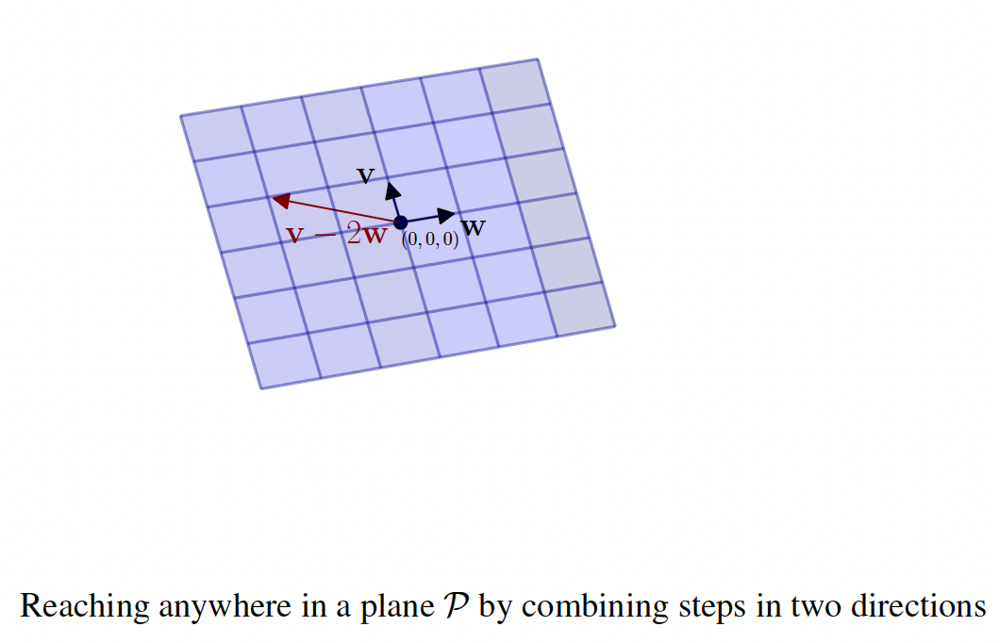
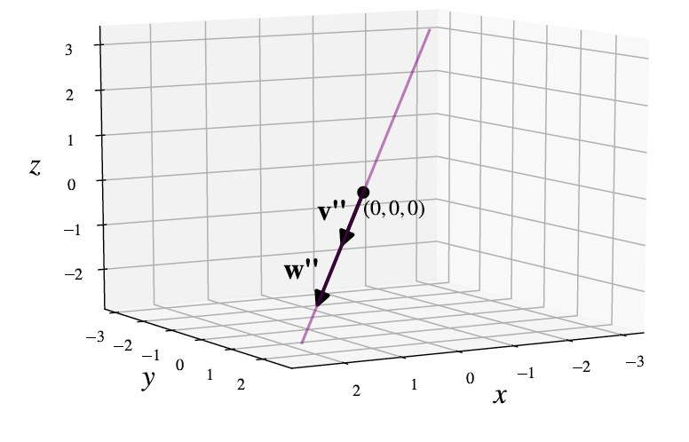
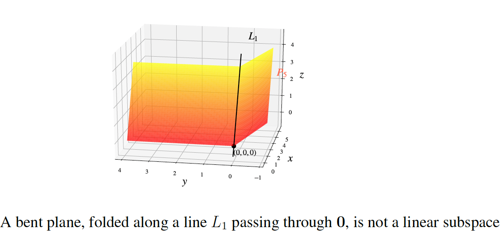
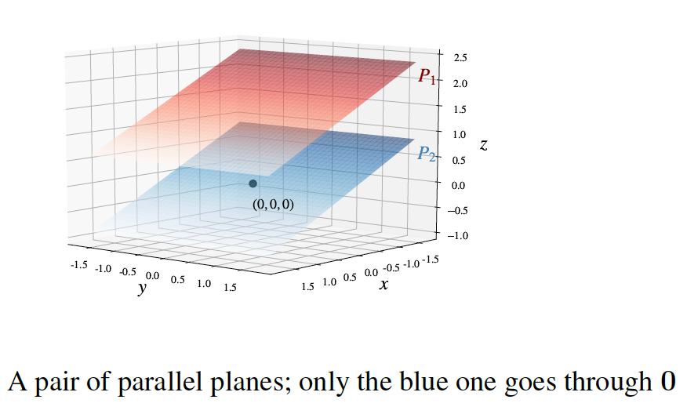

# Span, subspaces, and dimension

## Span and linear subspaces

Consider a plane $P$ in $\mathbb{R}^3$ passing through 0 = $(0, 0, 0)$. We want to express mathematically the idea that $P$ is "flat" with "two degrees of freedom". Choose two other points in $P$, denoted v and w, that do not lie on a common line through 0.

We can get to any point on $P$ by starting at 0 and walking first some specific distance in the v-direction, then some specific distance in the w-direction. Symbolically,

$$P = \{\text{all vectors of the form } a\mathbf{v} + b\mathbf{w}, \text{ for scalars } a, b\}$$

$a < 0$ and $b < 0$ correspond to walking "backwards" relative to the directions of v and w respectively. The description as vectors $a\mathbf{v} + b\mathbf{w}$ for varying scalars $a$ and $b$ is a way of encoding the flatness of $P$ with two degrees of freedom.

In other words, any vector that we can obtain from v and w repeatedly using the vector operations (addition and scalar multiplication) in any order is actually of the form $a\mathbf{v} + b\mathbf{w}$ for some scalars $a$, $b$.

Thus, the right side of the symbolic equation gives a parametric form of the plane through the 3 points 0, v, w and describes all vectors created from v, w using vector operations. If we instead allow the nonzero 3-vectors v, w to lie on a common line through 0, which is to say w is a scalar multiple of v, then the right side describes a line through 0 rather than a plane (as shown in the figure below).

The span of vectors v$_1$, . . . , v$_k$ in $\mathbb{R}^n$ is the collection of all vectors in $\mathbb{R}^n$ that one can obtain from v$_1$, . . . , v$_k$ by repeatedly using addition and scalar multiplication. In symbols,

$$\text{span}(v_1, \ldots, v_k) = \{\text{all } n\text{-vectors } \mathbf{x} \text{ of the form } c_1\mathbf{v}_1 + \cdots + c_k\mathbf{v}_k\}$$

where $c_1$, . . . , $c_k$ are arbitrary scalars.

In $\mathbb{R}^3$, for $k = 2$ and nonzero v$_1$, v$_2$ not multiples of each other, this recovers the parametric form of a plane through $P = 0$. In general, the span of a collection of finitely many $n$-vectors is the collection of all the $n$-vectors one can reach from those given $n$-vectors by forming linear combinations in every possible way.

This is a very new kind of concept- considering such a collection of $n$-vectors all at the same time. But it is ultimately no different than how we may visualize a plane in our head yet it consists of a lot of different points. The span of two nonzero $n$-vectors that are not scalar multiples of each other should be visualized as a "plane" through 0 in $\mathbb{R}^n$.

**Example:** Let's show that the set $U$ of 4-vectors $\begin{bmatrix} x \\ y \\ z \\ w \end{bmatrix}$ that are perpendicular to v = $\begin{bmatrix} 2 \\ 3 \\ 1 \\ 7 \end{bmatrix}$ is a span of three 4-vectors (the same type of calculation as what we are about to do shows that the set of vectors in $\mathbb{R}^n$ perpendicular to any fixed nonzero vector in $\mathbb{R}^n$ is a span of $n-1$ nonzero $n$-vectors). This is a "higher-dimensional" analogue of our visual experience in $\mathbb{R}^3$ that the collection of vectors in $\mathbb{R}^3$ perpendicular to a given nonzero vector is a plane through the origin (and hence is the span of two nonzero vectors in $\mathbb{R}^3$).

As a first step, we write out the condition of perpendicularity using the dot product:
$2x + 3y + z + 7w = 0$

Now we solve for $w$ (say) to get $w = -(2/7)x - (3/7)y - z/7$. Thus, points of $U$ are precisely

$$\begin{bmatrix} x \\ y \\ z \\ w \end{bmatrix} = \begin{bmatrix} x \\ y \\ z \\ -(2/7)x - (3/7)y - z/7 \end{bmatrix} = x\begin{bmatrix} 1 \\ 0 \\ 0 \\ -2/7 \end{bmatrix}_{\mathbf{a}} + y\begin{bmatrix} 0 \\ 1 \\ 0 \\ -3/7 \end{bmatrix}_{\mathbf{b}} + z\begin{bmatrix} 0 \\ 0 \\ 1 \\ -1/7 \end{bmatrix}_{\mathbf{c}}$$

with arbitrary scalars $x$, $y$, $z$. This shows that the vectors perpendicular to v are precisely those in the span of the vectors a, b, c that appear on the right side. This shows that $U$ is the span of a, b, c in $\mathbb{R}^4$.

We have noted that a line in $\mathbb{R}^2$ or $\mathbb{R}^3$ passing through 0 and a plane in $\mathbb{R}^3$ passing through 0 each arise as a span of one or two vectors. But lines and planes not passing through 0 are not a span of any collection of vectors! The reason is that the span of any collection of $n$-vectors always contains 0, by setting all coefficients $c_1$, . . . , $c_k$ in the span definition to be 0, since $0\mathbf{v}_1 + 0\mathbf{v}_2 + \cdots + 0\mathbf{v}_k = 0$.

If $V$ is the span of some finite collection of vectors in $\mathbb{R}^n$ then there are generally many different collections of vectors v$_1$, . . . , v$_k$ in $\mathbb{R}^n$ with span equal to $V$. For example, given one parametric form of a plane in $\mathbb{R}^3$ through 0 we get lots of others by rotating the resulting parallelogram grid around the origin in that plane by any nonzero angle we like. To refer to a span while suppressing the mention of any specific choice of vectors v$_1$, . . . , v$_k$ that create the span, some new terminology is convenient.

A **linear subspace** of $\mathbb{R}^n$ is a subset of $\mathbb{R}^n$ that is the span of a finite collection of vectors in $\mathbb{R}^n$ (this is also referred to as a subspace, dropping the word "linear"). If $V$ is a linear subspace of $\mathbb{R}^n$, a spanning set for $V$ is a collection of $n$-vectors v$_1$, . . . , v$_k$ whose span equals $V$ (a linear subspace has lots of spanning sets, akin to tiling a floor by parallelogram tiles in many ways).

Planes and lines in $\mathbb{R}^3$ passing through 0 are the visual examples to keep in mind when you hear the phrase "linear subspace". You may wonder: what is the difference between a linear subspace and a span? There is no difference, but saying "span" emphasizes the input – a specific finite list v$_1$, . . . , v$_k$ and the dynamic process of forming their linear combinations – whereas saying "linear subspace" emphasizes the output collection $V$ of $n$-vectors without choosing a specific v$_1$, . . . , v$_k$ whose span is $V$. It is far more important to know that $V$ can be obtained as a span of some list v$_1$, . . . , v$_k$ rather than to pick a specific such list.

**Proposition.** If $V$ is a linear subspace in $\mathbb{R}^n$ then for any vectors $\mathbf{x}_1$, . . . , $\mathbf{x}_m \in V$ and scalars $a_1$, . . . , $a_m$ the linear combination $a_1\mathbf{x}_1 + \cdots + a_m\mathbf{x}_m$ also lies in $V$. In words: all linear combinations of $n$-vectors chosen from a linear subspace of $\mathbb{R}^n$ belong to that same subspace.

Some illustrations below of which are linear subspaces and which are not. Only the blue and green planes are linear subspaces by definition as well as the proposition above.

## Dimension

We would like to define the "dimension" of a linear subspace in a way that generalizes our familiar concept of dimension: a thread or a line is 1-dimensional, a sheet of paper is 2-dimensional, the world around us is 3-dimensional.

In particular, we may informally say: the "dimension" of an object $X$ tells us how many different numbers are needed to locate a point in $X$.

To turn this into something unambiguous and useful, we now focus on the case of a linear subspace $V$ of $\mathbb{R}^n$, where vector algebra will provide a way to make that informal idea precise. The "dimension" of $V$ will be, intuitively, the number of independent directions in $V$. In other words, it will tell us how many numbers we need in order to specify a vector v in $V$.

More precisely, recall that by the definition of "linear subspace", $V$ is the span of some finite collection of vectors v$_1$, . . . , v$_k \in \mathbb{R}^n$. That is, for any v $\in V$ we can write

$$\mathbf{v} = c_1\mathbf{v}_1 + \cdots + c_k\mathbf{v}_k$$

for some scalars $c_1$, . . . , $c_k$, so to determine v it is enough to tell us $k$ numbers– the scalars $c_1$, . . . , $c_k$. But $V$ can have another spanning set consisting of a different number of vectors.

The span $V$ of two nonzero vectors in $\mathbb{R}^3$ could be a line (such as if the two vectors point in the same or opposite directions), in which case $V$ is also spanned by just one of those two vectors (e.g., the second vector is redundant).

Similarly, the span of three nonzero vectors in $\mathbb{R}^3$ could be a plane in special circumstances (or even a line in especially degenerate circumstances).

In both such cases, the initial spanning set has some redundancy. To define "dimension" for $V$, we want to use ways of spanning $V$ that (in a sense we need to make precise) don't have redundancy.

Let $V$ be a nonzero linear subspace of some $\mathbb{R}^n$. The dimension of $V$, denoted as $\dim(V)$, is defined to be the smallest number of vectors needed to span $V$. We define $\dim(\{0\}) = 0$.

For $k \geq 2$, consider a collection v$_1$, . . . , v$_k$ of vectors spanning a linear subspace $V$ in $\mathbb{R}^n$. We have $\dim(V) = k$ precisely when "there is no redundancy": each v$_i$ is not a linear combination of the others, or in other words removing it from the list destroys the spanning property.

Equivalently, $\dim(V) < k$ precisely when "there is redundancy": some v$_i$ is a linear combination of the others, or in other words removing some v$_i$ from the list does not affect the span. If some v$_i$ vanishes then it is a linear combination of the others and hence can be dropped from the span, so $\dim(V) < k$.

If $V$ and $W$ are linear subspaces of $\mathbb{R}^n$ with $W$ contained in $V$ (i.e., every vector in $W$ also belongs to $V$, much like a line inside a plane in $\mathbb{R}^3$) then $\dim(W) \leq \dim(V)$, and equality holds precisely when $W = V$.