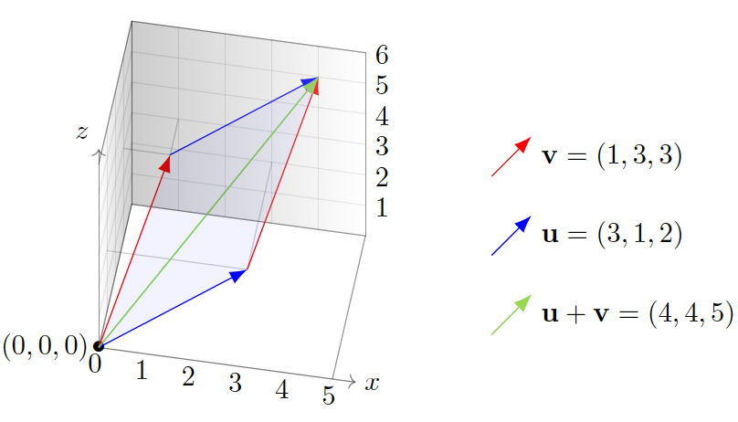
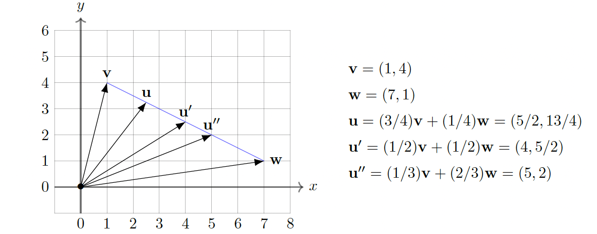

#  Vectors, vector addition, and scalar multiplication

Differential equations provided the mathematical framework for many of the advances of the 20th century, but linear algebra (the algebra and geometry of vectors and matrices in arbitrary dimensions) is the mathematical tool par excellence (alongside statistics) for the systematic analysis and management of the data-driven tasks of the 21st century. Even for modern applications of differential equations, linear algebra far beyond 3 dimensions is an important tool.

Also, a good understanding of multivariable differential calculus requires first learning some ideas and computational techniques in linear algebra.

## Vectors and their linear combinations

In the physical sciences, vectors are used to represent quantities that have both a magnitude and a direction. Examples of such quantities include displacement, velocity, force, and angular momentum.

In data science, economics, and many industrial applications of mathematics, vectors are used to keep track of collections of numerical data. This type of example is much more varied than the examples arising from natural sciences, and nearly always $n$ is very large.

The sum v + w of two vectors is defined precisely when v and w are $n$-vectors for the same $n$. In that case, we define their sum by the rule

$$\begin{bmatrix} v_1 \\ v_2 \\ \vdots \\ v_n \end{bmatrix} + \begin{bmatrix} w_1 \\ w_2 \\ \vdots \\ w_n \end{bmatrix} = \begin{bmatrix} v_1 + w_1 \\ v_2 + w_2 \\ \vdots \\ v_n + w_n \end{bmatrix}$$

We multiply a scalar $c$ against an $n$-vector v = $\begin{bmatrix} v_1 \\ v_2 \\ \vdots \\ v_n \end{bmatrix}$ by the rule 

$$c\begin{bmatrix} v_1 \\ v_2 \\ \vdots \\ v_n \end{bmatrix} = \begin{bmatrix} cv_1 \\ cv_2 \\ \vdots \\ cv_n \end{bmatrix}$$

As in the above for $n = 3$, the vector u + v is represented by the diagonal arrow in the parallelogram with one vertex at the origin and two edges given by u and v. This description of vector addition for $n = 2$ and $n = 3$ is called the parallelogram law.

We define subtraction as we did addition, or equivalently:

$$v - w = v + (-1)w$$

A linear combination of two $n$-vectors v,w is an $n$-vector $av + bw$ for scalars $a, b$. More generally, a linear combination of $k$ such $n$-vectors v$_1$, v$_2$, . . . , v$_k$ is $a_1$v$_1$ + $a_2$v$_2$ + · · · + $a_k$v$_k$ for scalars $a_1$, $a_2$, . . . , $a_k$. In physical sciences, this is often called a "superposition" of v$_1$, . . . , v$_k$.

**Example:** Suppose that T$_{2001}$, T$_{2002}$, . . . , T$_{2016}$ are 365-vectors that describe the daily average temperatures in Palo Alto (say in Celsius) in years 2001, 2002, . . . , 2016 (let's ignore February 29 in leap years). Then $\frac{1}{16}$(T$_{2001}$ + · · · + T$_{2016}$) is a 365-vector that tells us, for each given day, the average temperature in the years 2001–2016. For example, the first entry of this vector is the average January 1 temperature during this period.

A special type of linear combination that arises in applications such as linear programming, weighted averages, and probability theory is convex combination: in the case of two $n$-vectors v and w, this means a linear combination of the form $(1 - t)$v + $tw$ = v + $t$(w - v) with $0 \leq t \leq 1$. This adds to v a portion (given by $t$) of the displacement from v to w. It has the geometric interpretation (for $n = 2, 3$) of being a point on the line segment between the tips of v and w; e.g., it is v when $t = 0$, it is the midpoint when $t = \frac{1}{2}$, and it is w when $t = 1$.

For any $n$-vectors v$_1$, . . . , v$_k$, a convex combination of them means a linear combination $t_1$v$_1$ + · · · + $t_k$v$_k$ for which all $t_j \geq 0$ and the sum of the coefficients is equal to 1; that is, $t_1$ + · · · + $t_k$ = 1. When the coefficients are all equal, which is to say every $t_j$ is equal to $\frac{1}{k}$, this is the average (sometimes called the centroid) of the vectors.

In linear algebra, the phrase "point in $\mathbb{R}^n$" means exactly the same thing as "$n$-vector" (as well as "vector", when we don't need to specify $n$). The mental image for a given situation may suggest a preference between the words "point" and "vector", such as "displacement vector" or "closest point", but there is absolutely no difference in the meanings of these words in linear algebra. You might imagine that a "point" is the tip of an arrow emanating from 0, or that a "vector" is a directed line segment with specified endpoints.

In physics and engineering, a special "cross product" of 3-vectors (the output of which is also a 3-vector) shows up a lot. This has no analogue in $\mathbb{R}^n$ for $n \neq 3$, and it behaves very differently from products of numbers; e.g., it is neither commutative nor associative!

## Length for vectors and distance in $\mathbb{R}^n$

The length or magnitude of an $n$-vector v = $\begin{bmatrix} v_1 \\ v_2 \\ \vdots \\ v_n \end{bmatrix}$, denoted $\|v\|$, is the number

$$\|v\| = \sqrt{v_1^2 + v_2^2 + \cdots + v_n^2} \geq 0$$

Note that the length is a scalar, and $\|-v\| = \|v\|$ (in accordance with the visualization of $-v$ as "a copy of v pointing in the opposite direction") because signs disappear when squaring each $-v_j$.

If $c$ is any scalar then $\|cv\| = |c|\|v\|$ (i.e., if we multiply a vector by $c$ then the length scales by the factor $|c|$). For example, $(-5)$v has length $5\|v\|$.

In other references, you may see $\|v\|$ called the "norm" of v.

The distance between two $n$-vectors x, y is defined to be $\|x - y\|$.

In general it also equals $\|y - x\|$ since y - x = $-(x - y)$ and any vector has the same length as its negative, so the order of subtraction doesn't matter.

There is no "physical justification" to be given when $n > 3$. What is important is that (i) for $n = 2, 3$ we convince ourselves that it is the usual notion of distance, and (ii) for general $n$ it satisfies reasonable properties for a notion of "distance" to provide helpful geometric insight.

The zero vector in $\mathbb{R}^n$ is 0 = $\begin{bmatrix} 0 \\ 0 \\ \vdots \\ 0 \end{bmatrix}$, and a unit vector is a vector with length 1.

Always $\|v\| \geq 0$, and $\|v\| = 0$ precisely when v = 0. If v ≠ 0 then dividing v by its length (i.e., multiplying by the scalar $\frac{1}{\|v\|} > 0$) yields a unit vector "pointing in the same direction" as v.

In general the length of $cv$ for $c > 0$ is $c\|v\|$, so in order that $cv$ be a unit vector the condition is precisely that $c\|v\| = 1$, which is to say $c = \frac{1}{\|v\|}$. In other words, the scalar multiple $\frac{1}{\|v\|}$v of v is indeed the unique unit vector pointing in the same direction as v (in the opposite direction we have the unit vector $-\frac{1}{\|v\|}$v).

