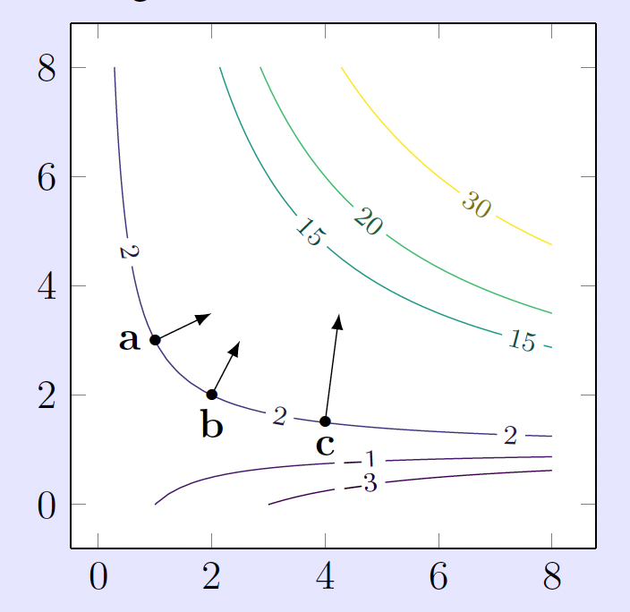
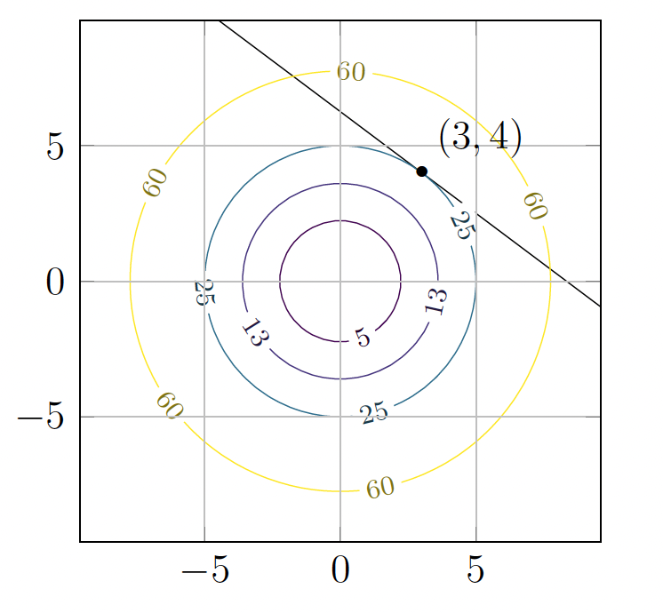
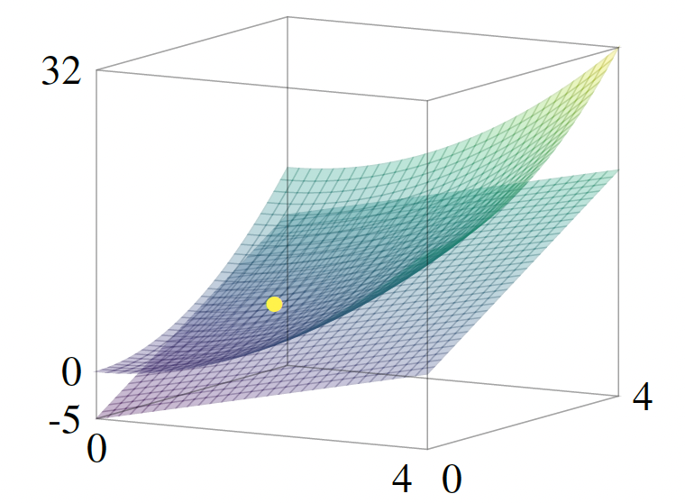
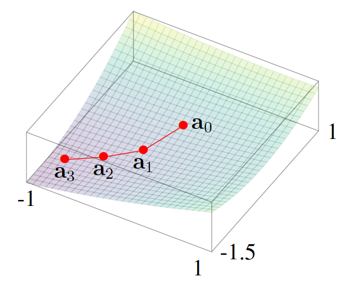
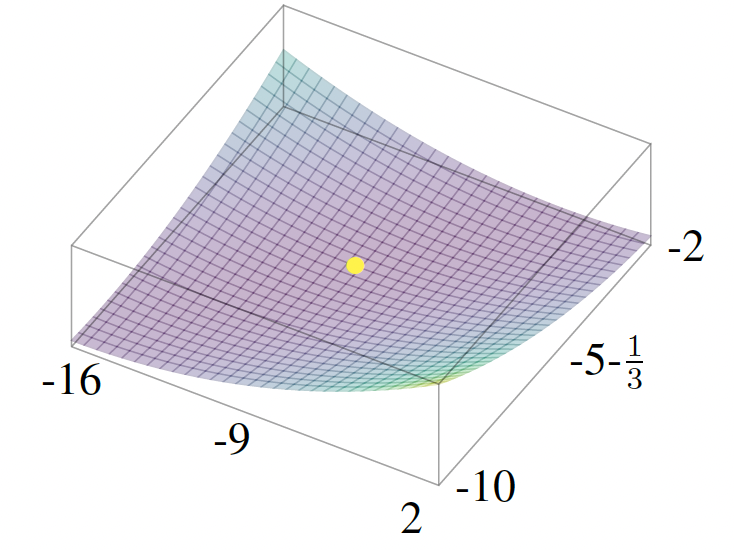

# Gradients, local approximations, and gradient descent

## The Gradient

For a scalar-valued function $f : \mathbb{R}^n \to \mathbb{R}$, we now package all of its partial derivatives into a single vector-valued function denoted $\nabla f : \mathbb{R}^n \to \mathbb{R}^n$ called the **gradient** of $f$.

Consider $f : \mathbb{R}^n \to \mathbb{R}$. We will sometimes write the inputs to $f$ as vectors. For example, when $n = 2$ we may think of $f$ as a function of a column vector $\begin{pmatrix} x \\ y \end{pmatrix}$ (often written $f(x,y)$ with the same meaning once we identify $(x,y)$ with that vector).

The **gradient** of $f$ is defined to be the column vector of partial derivatives:

$$
\nabla f =
\begin{pmatrix}
\dfrac{\partial f}{\partial x_1} \\[0.35em]
\dfrac{\partial f}{\partial x_2} \\[0.35em]
\vdots \\[0.2em]
\dfrac{\partial f}{\partial x_n}
\end{pmatrix}.
$$

**Example:** Let $f(x,y) = x^2 + y^2$. Then $\dfrac{\partial f}{\partial x} = 2x$ and $\dfrac{\partial f}{\partial y} = 2y$, so

$$
\nabla f(x,y) =
\begin{pmatrix}
2x \\[0.25em]
2y
\end{pmatrix}.
$$

For instance $\nabla f(1, -2) = \begin{pmatrix} 2 \\ -4 \end{pmatrix}$.

**Example:** Let $f(x,y,z) = x^2 + xy + yz^2$. Compute

$$
\frac{\partial f}{\partial x} = 2x + y, \qquad
\frac{\partial f}{\partial y} = x + z^2, \qquad
\frac{\partial f}{\partial z} = 2yz.
$$

Hence

$$
\nabla f(x,y,z) =
\begin{pmatrix}
2x + y \\[0.25em]
x + z^2 \\[0.25em]
2yz
\end{pmatrix}.
$$

## The linear approximation for a scalar-valued function

For a function $f$ of a single variable $x$, we know that a small change $h$ in the value of $x$ near $x = a$ causes an approximate change of $f'(a)\,h$ in the value of $f(x)$ near $x = a$:

$$f(a + h) \approx f(a) + f'(a)\,h$$

for all $h$ near $0$. We can write this in another way: for $x$ very close to $x = a$,

$$f(x) \approx f(a) + f'(a)\,(x - a),$$

which is the same statement of approximation except with $x$ in place of $a + h$ (so $x - a = h$ is small).

Note that the gradient of $f : \mathbb{R}^n \to \mathbb{R}$ is a vector-valued function $\nabla f : \mathbb{R}^n \to \mathbb{R}^n$: its value $(\nabla f)(\mathbf{a})$ at $\mathbf{a} \in \mathbb{R}^n$ is an $n$-vector. For $\mathbf{x}$ near $\mathbf{a} \in \mathbb{R}^n$, the **linear approximation** to $f$ is

$$f(\mathbf{x}) \approx f(\mathbf{a}) + (\nabla f)(\mathbf{a}) \cdot (\mathbf{x} - \mathbf{a}).$$

Observe that this looks just like the single-variable case except that now there are vectors and a dot product involved. When $n = 1$ this recovers exactly the familiar single-variable case, with $(\nabla f)(a)$ equal to the $1$-vector $[f'(a)] \in \mathbb{R}^1 = \mathbb{R}$.

Let us write it out explicitly in the case of a two-variable function (i.e., $n = 2$) without the vector notation:

$$
f(x, y) \approx f(a, b) + \underbrace{f_x(a, b)(x - a) + f_y(a, b)(y - b)}_{\displaystyle (\nabla f)(a,b) \cdot \begin{pmatrix} x - a \\ y - b \end{pmatrix}}
$$

for $(x, y)$ near $(a, b)$. Here, the underbraced term is exactly $(\nabla f)(\mathbf{a}) \cdot (\mathbf{x} - \mathbf{a})$ with $\mathbf{a} = (a,b)$ and $\mathbf{x} = (x,y)$.

We refer to these equations as the **local approximation** for $f$ at $\mathbf{a}$ or as the **linear approximation** for $f$ at $\mathbf{a}$.

**Example:** Consider $f(x, y) = x^2 + 2y^2 + xy$ near $\mathbf{a} = (1, 1)$. Working at $\mathbf{x} = (1.3, 0.9)$ near $\mathbf{a}$, let us estimate $f(1.3, 0.9)$ using the linear approximation with base point $\mathbf{a} = (1, 1)$.

First compute the partial derivatives:

$$\frac{\partial f}{\partial x} = 2x + y, \qquad \frac{\partial f}{\partial y} = 4y + x,$$

so

$$(\nabla f)(x, y) =
\begin{pmatrix}
2x + y \\[0.25em]
4y + x
\end{pmatrix},
\qquad
(\nabla f)(1, 1) =
\begin{pmatrix}
3 \\[0.25em]
5
\end{pmatrix}.$$

Also $f(1, 1) = 1 + 2 + 1 = 4$, and $\mathbf{x} - \mathbf{a} = \begin{pmatrix} 0.3 \\ -0.1 \end{pmatrix}$. Thus

$$
f(1.3, 0.9) \approx f(1, 1) + (\nabla f)(1, 1) \cdot \begin{pmatrix} 0.3 \\ -0.1 \end{pmatrix}
= 4 + \begin{pmatrix} 3 \\ 5 \end{pmatrix} \cdot \begin{pmatrix} 0.3 \\ -0.1 \end{pmatrix}
= 4 + (0.9 - 0.5) = 4.4.
$$

The exact value is $f(1.3, 0.9) = 4.48$.

## The gradient as normal to contours

**Theorem:**

Let $f : \mathbb{R}^2 \to \mathbb{R}$ be a scalar-valued function, and suppose $(\nabla f)(a, b) \neq 0$.

**(i)** The gradient $(\nabla f)(a, b)$ is **perpendicular** to the level set of $f$ that goes through $(a, b)$ (equivalently: it is perpendicular to the **tangent line** to that level set at $(a, b)$). It points in the **direction of maximal increase** of $f(x, y)$ as $(x, y)$ moves away from $(a, b)$. The figure below illustrates this for $f(x, y) = xy - x$.

*A contour plot of $f(x, y) = xy - x$. The gradient $\nabla f$ is drawn at three points: $\mathbf{a} = (1, 3)$, $\mathbf{b} = (2, 2)$, $\mathbf{c} = (4, 3/2)$. Observe that $\nabla f$ is perpendicular to the level curve at each point.*

**(ii)** The equation

$$(\nabla f)(a, b) \cdot \begin{pmatrix} x - a \\ y - b \end{pmatrix} = 0$$

in the $(x, y)$-plane is the line **tangent** to the level curve of $f$ through $(x, y) = (a, b)$. Equivalently, writing the dot product out,

$$f_x(a, b)(x - a) + f_y(a, b)(y - b) = 0.$$

**Theorem:**

For a scalar-valued function $f : \mathbb{R}^3 \to \mathbb{R}$ and a point $\mathbf{a} = (a_1, a_2, a_3)$ for which $(\nabla f)(\mathbf{a}) \neq 0$, the **gradient vector** $(\nabla f)(\mathbf{a})$ is perpendicular to the **plane tangent** to the level set of $f$ through $\mathbf{a}$. In particular, that tangent plane is given by

$$(\nabla f)(a_1, a_2, a_3) \cdot \begin{pmatrix} x - a_1 \\ y - a_2 \\ z - a_3 \end{pmatrix} = 0.$$

The same picture carries over to functions $f : \mathbb{R}^n \to \mathbb{R}$ for $n > 3$, except that the tangent **plane** to a level set in $\mathbb{R}^3$ is replaced by the appropriate **tangent hyperplane** to a level set $\{f = c\}$ in $\mathbb{R}^n$.

**Example:** Consider the circle defined by $x^2 + y^2 = 25$. Let us find a **normal vector** to this circle at $(x, y) = (3, 4)$, as well as the equation of the **tangent line** at that point. This case can be handled with single-variable calculus (worth trying if you are interested), but we use **gradients** here to illustrate a method that extends to three or more variables.

Define $h(x, y) = x^2 + y^2$. Then $h(3, 4) = 25$ and

$$\nabla h(x, y) = \begin{pmatrix} 2x \\ 2y \end{pmatrix}.$$

A normal vector to the level set $h = 25$ (our circle) through $(3, 4)$ is the gradient

$$(\nabla h)(3, 4) = \begin{pmatrix} 6 \\ 8 \end{pmatrix}.$$

If $\begin{pmatrix} x \\ y \end{pmatrix}$ lies on the tangent line, the displacement from $(3, 4)$ to $\begin{pmatrix} x \\ y \end{pmatrix}$ must be **perpendicular** to that normal. Thus

$$\begin{pmatrix} x - 3 \\ y - 4 \end{pmatrix} \cdot \begin{pmatrix} 6 \\ 8 \end{pmatrix} = 0,$$

i.e.

$$6(x - 3) + 8(y - 4) = 0.$$

After simplifying, this becomes $3x + 4y = 25$, as illustrated below.

**Example:** Consider the sphere $S$ given by $x^2 + y^2 + z^2 = 6$. Let us find an equation for the **tangent plane** to $S$ at $(2, 1, 1)$.

$S$ is the level set $f = 0$ of

$f(x, y, z) = x^2 + y^2 + z^2 - 6$ (since $f = 0$ is equivalent to $x^2 + y^2 + z^2 = 6$). Then

$$\nabla f(x, y, z) = \begin{pmatrix} 2x \\ 2y \\ 2z \end{pmatrix}.$$

As above, this tangent plane is perpendicular to $(\nabla f)(2, 1, 1) = \begin{pmatrix} 4 \\ 2 \\ 2 \end{pmatrix}$, so its equation is

$$\begin{pmatrix} 4 \\ 2 \\ 2 \end{pmatrix} \cdot \begin{pmatrix} x - 2 \\ y - 1 \\ z - 1 \end{pmatrix} = 0.$$

After simplifying, this becomes $2x + y + z = 6$.

**Example:** Consider the surface $S$ defined by $z = x^2 + y^2$. Let us find the equation of the **tangent plane** to $S$ at $(1, 2, 5)$.

We can rewrite the equation as $x^2 + y^2 - z = 0$. Thus $S$ is the level set $f = 0$ of

$$f(x, y, z) = z - x^2 - y^2$$

(since $f = 0$ is equivalent to $z = x^2 + y^2$). The gradient is

$$\nabla f(x, y, z) = \begin{pmatrix} -2x \\ -2y \\ 1 \end{pmatrix},$$

Next,

$$(\nabla f)(1, 2, 5) = \begin{pmatrix} -2 \\ -4 \\ 1 \end{pmatrix}$$

is normal to $S$ at $(1, 2, 5)$. The tangent plane through that point is therefore given in **point–normal** form by

$$\begin{pmatrix} -2 \\ -4 \\ 1 \end{pmatrix} \cdot \left( \begin{pmatrix} x \\ y \\ z \end{pmatrix} - \begin{pmatrix} 1 \\ 2 \\ 5 \end{pmatrix} \right) = 0.$$

This simplifies to $-2(x - 1) - 4(y - 2) + (z - 5) = 0$, or equivalently

$$z = 2x + 4y - 5.$$

The figure below compares the graph of $z = x^2 + y^2$ and the tangent plane $z = 2x + 4y - 5$ at $(1, 2, 5)$.

## Gradient descent

One of the main reasons to study calculus of $n$ variables is to optimize multivariable functions; i.e., to find their local maxima and minima (with the eventual aim of finding global maxima and minima). Realistic problems of this type cannot be solved exactly; rather one needs ways to numerically approximate the answer. A powerful method for doing this is gradient descent.

**Example:** Imagine that a raindrop falls on a hill. It will head to the bottom– water always finds the lowest elevation. Or at the very least it will find a local minimum: it might not find the bottom of the hill, but it will find a lake half-way down the hill, perhaps. The raindrop certainly doesn’t know anything about the geography of the hill. However, at every moment, it simply “chooses” to roll in the steepest possible direction.

The preceding examples suggest the following strategy, called **gradient descent**: to find the **minimum** of a function $f(x, y)$, move away from $(x, y)$ in the **direction in which $f$ decreases the fastest**. Similarly, to find the **maximum** of $f(x, y)$, move away from $(x, y)$ in the **direction in which $f$ increases the fastest**.

We need to make this mathematically precise. We can quantify **direction** (without regard to speed) by giving a **unit vector** $\mathbf{v} \in \mathbb{R}^2$, i.e., a vector with $\lVert \mathbf{v} \rVert = 1$. To test how fast $f$ is increasing or decreasing in the direction of $\mathbf{v}$, we use the **linear approximation** with $t \in \mathbb{R}$ near $0$:

$$f(\mathbf{a} + t\mathbf{v}) \approx f(\mathbf{a}) + (\nabla f)(\mathbf{a}) \cdot (t\mathbf{v}) = f(\mathbf{a}) + t\,(\nabla f)(\mathbf{a}) \cdot \mathbf{v}.$$

If we move a small distance $|t|$ in the direction $\mathbf{v}$ for $t > 0$ and in the direction $-\mathbf{v}$ for $t < 0$, then the change in $f$ is approximately $t\bigl((\nabla f)(\mathbf{a}) \cdot \mathbf{v}\bigr)$, whose **rate of change with respect to $t$** (the $t$-derivative of this linear approximation) is $(\nabla f)(\mathbf{a}) \cdot \mathbf{v}$. Thus our question becomes: **how do we choose a unit vector $\mathbf{v}$ so that $(\nabla f)(\mathbf{a}) \cdot \mathbf{v}$ is largest?** Then use $t > 0$ when seeking to **maximize** $f$ and $t < 0$ when seeking to **minimize** $f$.

We can solve this by geometry. The dot product $(\nabla f)(\mathbf{a}) \cdot \mathbf{v}$ equals $\lVert (\nabla f)(\mathbf{a}) \rVert \,\lVert \mathbf{v} \rVert \cos(\theta) = \lVert (\nabla f)(\mathbf{a}) \rVert \cos(\theta)$, where $\theta$ is the angle between $\mathbf{v}$ and $(\nabla f)(\mathbf{a})$. This is **largest** when $\cos(\theta) = 1$, i.e.\ $\theta = 0$. It is **most negative** when $\cos(\theta) = -1$, i.e.\ $\theta = \pi$ (a $180^\circ$ angle).

**Theorem:** Let $f : \mathbb{R}^n \to \mathbb{R}$ be differentiable at $\mathbf{a} \in \mathbb{R}^n$, and suppose $(\nabla f)(\mathbf{a}) \neq \mathbf{0}$. Then the **direction of steepest increase** of $f$ at $\mathbf{a}$ is that of the gradient: the associated **unit vector**

$$\frac{(\nabla f)(\mathbf{a})}{\lVert (\nabla f)(\mathbf{a}) \rVert}$$

points in the direction in which $f$ increases most rapidly at $\mathbf{a}$. Likewise, the **opposite** unit vector

$$-\,\frac{(\nabla f)(\mathbf{a})}{\lVert (\nabla f)(\mathbf{a}) \rVert}$$

is the direction in which $f$ **decreases** most rapidly at $\mathbf{a}$.

**Example:** Many physical systems can be modeled using the gradient of a function. The idea is that an object experiences a **force** derived from a **potential energy** $V(x, y, z)$ by

$$\mathbf{F}(x, y, z) = -\nabla V(x, y, z).$$

For example, the potential energy associated with the gravitational field of the sun can be taken to have the form

$$V(x, y, z) = \frac{c}{\sqrt{x^2 + y^2 + z^2}}$$

for a suitable constant $c > 0$, where coordinates are chosen so the sun is at $(0, 0, 0)$.

Equation $\mathbf{F} = -\nabla V$ says that the object experiences a force in the direction in which $V$ is **most rapidly decreasing**. In other words, the object “wants” to move toward where $V$ is smallest.

### Domain steps

Gradient descent updates the **input** $\mathbf{a} \in \mathbb{R}^n$: each step has the form $\mathbf{a}_{\text{new}} = \mathbf{a} + (\text{displacement})$, where the displacement is a **vector** in $\mathbb{R}^n$.

For $\mathbf{v}$ a **unit** vector and $t$ small, the linear approximation says

$$f(\mathbf{a} + t\mathbf{v}) \approx f(\mathbf{a}) + t\,(\nabla f)(\mathbf{a}) \cdot \mathbf{v}.$$

The **next point** is specified separately: you choose a direction $v$ and step length $t$ to get $\mathbf{a}_{\text{new}} = \mathbf{a} + t\mathbf{v}$.

It is often convenient to write the displacement as a **multiple of the full gradient** instead of a unit direction. The update

$$\mathbf{a}_{\text{new}} = \mathbf{a} + t\,(\nabla f)(\mathbf{a})$$

is the same idea: the step vector is $t(\nabla f)(\mathbf{a})$. This is equivalent to $\mathbf{a} + t\mathbf{v}$ where $\mathbf{v} = (\nabla f)(\mathbf{a})/\lVert (\nabla f)(\mathbf{a}) \rVert$ and $t$ is chosen accordingly.

To **minimize** $f$, take **$t < 0$**, so $\mathbf{a}_{\text{new}} = \mathbf{a} - |t|\,(\nabla f)(\mathbf{a})$, which is a step opposite to the gradient.

**Example:**

Let $f : \mathbb{R}^2 \to \mathbb{R}$ be

$$f(x, y) = x^2 - 3xy + 3y^2 + 5y + 2x.$$

Then

$$(\nabla f)(x, y) =
\begin{pmatrix}
2x - 3y + 2 \\[0.25em]
-3x + 6y + 5
\end{pmatrix}.$$

We **start** at some point $\mathbf{a}$ (hopefully near a minimizer) and repeatedly move in the direction of the **negative** gradient. One step has the form

$$\mathbf{a} \mapsto \mathbf{a} + t\,(\nabla f)(\mathbf{a})$$

with **$t < 0$** when we are **minimizing** $f$ (so we move opposite to the direction of steepest **ascent**). Equivalently, $\mathbf{a} \mapsto \mathbf{a} - |t|\,(\nabla f)(\mathbf{a})$. The size $|t|$ controls how far we move at each step.

We must choose:

1. **Where to start** $\mathbf{a}$. Here we take $\mathbf{a} = (0, 0)$ with no prior knowledge.
2. **Step size** $t$. In practice one tries several values (in machine learning, $|t|$ is often called the **learning rate**). Here we use the fixed value $t = -0.1$, so each update is

$$\mathbf{a} \mapsto \mathbf{a} - 0.1\,(\nabla f)(\mathbf{a}).$$

Starting at $(0, 0)$, the first few iterates are

$$\begin{pmatrix} 0 \\ 0 \end{pmatrix}
\;\rightsquigarrow\;
\begin{pmatrix} -0.2 \\ -0.5 \end{pmatrix}
\;\rightsquigarrow\;
\begin{pmatrix} -0.51 \\ -0.76 \end{pmatrix}
\;\rightsquigarrow\;
\begin{pmatrix} -0.836 \\ -0.957 \end{pmatrix}
\;\rightsquigarrow\; \cdots$$

If we write $\mathbf{a}_0 = (0,0)$ and $\mathbf{a}_n = \mathbf{a}_{n-1} - 0.1\,(\nabla f)(\mathbf{a}_{n-1})$, this is the beginning of that sequence. Not much seems to happen at first— the path merely wanders, as in the figure below.

*The first few steps of gradient descent for $f$. The update is $\mathbf{a}_n = \mathbf{a}_{n-1} - 0.1\,(\nabla f)(\mathbf{a}_{n-1})$.*

After $10$ steps one reaches approximately $\begin{pmatrix} -7.768 \\ -4.674 \end{pmatrix}$; after $100$ steps, approximately $\begin{pmatrix} -8.835 \\ -5.245 \end{pmatrix}$; after $1000$ steps, approximately $\begin{pmatrix} -8.999\ldots \\ -5.333\ldots \end{pmatrix}$. The iterates appear to converge toward

$$\mathbf{b} = \begin{pmatrix} -9 \\ -16/3 \end{pmatrix}.$$

To justify this, find **critical points** by solving $(\nabla f)(x,y) = \mathbf{0}$:

$$\begin{pmatrix} 2x - 3y + 2 \\ -3x + 6y + 5 \end{pmatrix} =
\begin{pmatrix} 0 \\ 0 \end{pmatrix}.$$

The first equation gives $x = \frac{3}{2}y - 1$. Substituting into the second yields $\frac{3}{2}y + 8 = 0$, so $y = -\frac{16}{3}$ and then $x = -9$.

Thus $(-9, -16/3)$ is the only critical point. One can check numerically that $f$ is smaller nearby than at points slightly away to see that it is a **local minimum**.

## Informal proof: the gradient is normal to the contour

$\nabla f(a, b)$ is **perpendicular** to the level curve of $f$ through $(a, b)$. Below is a short argument (not a formal proof).

Fix $(a, b)$ and let $c = f(a, b)$. If $(x, y)$ lies on the **same** level curve, then by definition $f(x, y) = c = f(a, b)$ i.e., the value of $f$ does not change as you move along the contour.

Now recall the **linear approximation** from earlier (for $\mathbf{x}$ near $\mathbf{a} = (a, b)$):

$$f(x, y) \approx f(a, b) + (\nabla f)(a, b) \cdot \begin{pmatrix} x - a \\ y - b \end{pmatrix}.$$

Apply this to a point $(x, y)$ that lies **on the contour** through $(a, b)$ and is **close** to $(a, b)$. Then $f(x, y) = f(a, b)$ exactly. Equating the two sides in the approximation forces

$$(\nabla f)(a, b) \cdot \begin{pmatrix} x - a \\ y - b \end{pmatrix} \approx 0.$$

So, **near** $(a, b)$, the contour is **well approximated** by the set of $(x, y)$ satisfying the **linear** equation

$$(\nabla f)(a, b) \cdot \begin{pmatrix} x - a \\ y - b \end{pmatrix} = 0.$$

So **near** $(a, b)$ the contour curve looks just like the line with equation above. In other words, the above equation must be the equation of the tangent line!

In other words, it is the equation of a **line through $(a, b)$** whose direction vectors $\begin{pmatrix} x - a \\ y - b \end{pmatrix}$ are all orthogonal to $(\nabla f)(a, b)$. In other words, it is the **tangent line** to the level curve, and $(\nabla f)(a, b)$ is a **normal vector** to that line. Hence $(\nabla f)(a, b)$ is perpendicular to the level curve of $f$ through $(a, b)$.

## Exercises

**1.** You ordered a large block of wood with length $5$, width $2$, and height $1$ (each in feet). The manufacturer can only guarantee these measurements up to an **excess** of at most $0.1$ feet in each dimension (so each actual dimension lies in an interval of length $0.1$ **above** the nominal value). Use a suitable gradient to approximate the **largest possible total excess volume**. Then compute the **exact** maximal excess volume.

**Solution:** Let $L$, $W$, and $H$ denote length, width, and height in feet. The volume is

$$V(L, W, H) = LWH.$$

Nominal dimensions are $(L, W, H) = (5, 2, 1)$, so $V(5,2,1) = 10$ ft³. The manufacturer may deliver dimensions in the ranges $L \in [5, 5.1]$, $W \in [2, 2.1]$, $H \in [1, 1.1]$. The **excess volume** over the nominal $10$ ft³ is

$$V(L,W,H) - 10,$$

which we want to **maximize** over that box.

**Gradient approximation:** The gradient of $V$ is

$$\nabla V(L, W, H) = \begin{pmatrix} WH \\ LH \\ LW \end{pmatrix}.$$

At $(5, 2, 1)$,

$$\nabla V(5, 2, 1) = \begin{pmatrix} 2 \\ 5 \\ 10 \end{pmatrix}.$$

Write small increases as $\Delta L$, $\Delta W$, $\Delta H$ (each between $0$ and $0.1$). Set $\mathbf{a} = (5,2,1)$ and $\mathbf{x} = (5+\Delta L,\, 2+\Delta W,\, 1+\Delta H)$, so the displacement from the nominal dimensions is $\mathbf{x} - \mathbf{a} = (\Delta L,\, \Delta W,\, \Delta H)^{\mathsf T}$. For any differentiable $V$, the **linear approximation** at $\mathbf{a}$ is

$$V(\mathbf{x}) \approx V(\mathbf{a}) + (\nabla V)(\mathbf{a}) \cdot (\mathbf{x} - \mathbf{a}).$$

Subtracting $V(\mathbf{a}) = 10$ from both sides gives the **approximate excess volume**

$$V(5+\Delta L,\, 2+\Delta W,\, 1+\Delta H) - 10 \approx \nabla V(5,2,1) \cdot \begin{pmatrix} \Delta L \\ \Delta W \\ \Delta H \end{pmatrix} = 2\,\Delta L + 5\,\Delta W + 10\,\Delta H.$$

All partial derivatives are **positive** at $(5,2,1)$, so this linear expression is largest when each increment is as large as allowed: $\Delta L = \Delta W = \Delta H = 0.1$. Thus the **approximate** maximal excess volume is

$$2(0.1) + 5(0.1) + 10(0.1) = 1.7 \text{ ft}^3.$$

**Exact maximum:** The function $V = LWH$ has positive partial derivatives on the box (since $L,W,H > 0$), so $V$ is **increasing** in each variable separately. Hence the maximum of $V$ on $[5,5.1]\times[2,2.1]\times[1,1.1]$ occurs at: $(L,W,H) = (5.1,\, 2.1,\, 1.1)$. Therefore

$$V_{\max} = 5.1 \times 2.1 \times 1.1 = 11.781 \text{ ft}^3,$$

and the **exact** maximal excess volume is

$$11.781 - 10 = 1.781 \text{ ft}^3.$$

**2.** Consider $f : \mathbb{R}^2 \to \mathbb{R}$ given by $f(x, y) = x^2 - y^2$.

**(a)** Calculate the first two steps of gradient descent using $t = -0.1$ and starting at $\begin{pmatrix} 1 \\ 0 \end{pmatrix}$, as well as starting at $\begin{pmatrix} 1 \\ 0.3 \end{pmatrix}$. Do you notice any difference?

**Solution:** Here $f_x = 2x$ and $f_y = -2y$, so

$$(\nabla f)(x, y) = \begin{pmatrix} 2x \\ -2y \end{pmatrix}.$$

With $t = -0.1$, one step is $\mathbf{x} \mapsto \mathbf{x} + t(\nabla f)(\mathbf{x}) = \mathbf{x} - 0.1(\nabla f)(\mathbf{x})$:

$$\begin{pmatrix} x \\ y \end{pmatrix} \mapsto \begin{pmatrix} x - 0.2x \\ y + 0.2y \end{pmatrix} = \begin{pmatrix} 0.8x \\ 1.2y \end{pmatrix}.$$

**Start $\begin{pmatrix} 1 \\ 0 \end{pmatrix}$:** Step 1 gives $\begin{pmatrix} 0.8 \\ 0 \end{pmatrix}$; step 2 gives $\begin{pmatrix} 0.64 \\ 0 \end{pmatrix}$.

**Start $\begin{pmatrix} 1 \\ 0.3 \end{pmatrix}$:** Step 1 gives $\begin{pmatrix} 0.8 \\ 0.36 \end{pmatrix}$; step 2 gives $\begin{pmatrix} 0.64 \\ 0.432 \end{pmatrix}$.

**Difference:** From $(1,0)$ the iterate stays on the $x$-axis and moves toward $0$. From $(1,0.3)$ the $y$-coordinate **grows** by a factor of $1.2$ each step, so the path bends away from the $x$-axis and $|y|$ increases.

**(b)** For general $\mathbf{a} = \begin{pmatrix} a \\ b \end{pmatrix}$, where do we land after **one** step of gradient descent with $t = -0.1$ starting at $\mathbf{a}$? Express the result as a vector whose entries depend on $a$ and $b$.

**Solution:** Applying the map once to $\begin{pmatrix} a \\ b \end{pmatrix}$:

$$\begin{pmatrix} a \\ b \end{pmatrix} \mapsto \begin{pmatrix} 0.8a \\ 1.2b \end{pmatrix}.$$

**(c)** Using your formula in (b), iterate the procedure: where are we after $2$ steps, after $3$ steps, and after $n$ steps (in terms of $a$ and $b$)?

**Solution:** Each step multiplies the first coordinate by $0.8$ and the second by $1.2$. After $n$ steps:

$$\begin{pmatrix} a \\ b \end{pmatrix} \mapsto \begin{pmatrix} (0.8)^n a \\ (1.2)^n b \end{pmatrix}.$$

In particular, after $2$ steps: $\begin{pmatrix} 0.64a \\ 1.44b \end{pmatrix}$; after $3$ steps: $\begin{pmatrix} 0.512a \\ 1.728b \end{pmatrix}$.

**(d)** Explain why repeated gradient descent converges to $\mathbf{0}$ (a **saddle** point of $f$, not a local minimum) when we start at any $\mathbf{a}$ with $b = 0$, but **diverges** when $b \neq 0$.

**Solution:** If $b = 0$, the iterates are $\bigl((0.8)^n a,\, 0\bigr)$. Since $0 < 0.8 < 1$, we have $(0.8)^n \to 0$ as $n \to \infty$, so the sequence converges to $\mathbf{0}$. The point $\mathbf{0}$ is **not** a local minimum of $f(x,y)=x^2-y^2$ (along $y=0$, $f=x^2$ has a minimum at $0$, but along $x=0$, $f=-y^2$ has a **maximum** at $0$); it is a **saddle** point.

If $b \neq 0$, the second component is $(1.2)^n b$. Since $1.2 > 1$, we have $(1.2)^n \to +\infty$, so $|y_n| \to \infty$; the sequence of iterates **diverges** (the $x$-component still tends to $0$, but the $y$-component blows up).

**3.** One might modify gradient descent to move by a fixed multiple of the **unitized** gradient $\dfrac{(\nabla f)(\mathbf{a})}{\lVert(\nabla f)(\mathbf{a})\rVert}$ rather than by a fixed multiple of $(\nabla f)(\mathbf{a})$. Call this **unitized gradient descent**. This exercise shows a pitfall.

Let $f:\mathbb{R}^2 \to \mathbb{R}$ be $f(x,y) = x^2 + y^2$, so $\mathbf{0}$ is the unique global minimum. Take $t = -0.1$. Let $\mathbf{a} \neq \mathbf{0}$ in $\mathbb{R}^2$, with $\ell = \lVert\mathbf{a}\rVert$ and unit vector $\mathbf{u} = \mathbf{a}/\ell = \mathbf{a}/\lVert\mathbf{a}\rVert$ (so $\mathbf{a} = \ell\mathbf{u}$).

**(a)** Show that one step of unitized gradient descent beginning at $\mathbf{a}$ yields $(\ell + t)\mathbf{u} = (\ell - 0.1)\mathbf{u}$.

**Solution:** We have $\dfrac{\partial f}{\partial x} = 2x$ and $\dfrac{\partial f}{\partial y} = 2y$, so $(\nabla f)(\mathbf{a}) = 2\mathbf{a}$. Also $\lVert(\nabla f)(\mathbf{a})\rVert = \lVert 2\mathbf{a}\rVert = 2\ell$. Unitized gradient descent with step $t$ is

$$\mathbf{a} + t\,\frac{(\nabla f)(\mathbf{a})}{\lVert(\nabla f)(\mathbf{a})\rVert} = \ell\mathbf{u} + t\,\frac{2\mathbf{a}}{2\ell} = \ell\mathbf{u} + t\,\frac{\mathbf{a}}{\ell} = \ell\mathbf{u} + t\mathbf{u} = (\ell + t)\mathbf{u}.$$

With $t = -0.1$, this is $(\ell - 0.1)\mathbf{u}$. Its norm is $|\ell - 0.1|$.

Write $\mathbf{a}_0 := \mathbf{a} = \ell\mathbf{u}$, and for $n \ge 0$ let $\mathbf{a}_{n+1}$ be the point reached by **one** unitized step from $\mathbf{a}_n$ (always with $t = -0.1$).

**(b)** Suppose $0 < \lVert\mathbf{a}\rVert < 0.1$. Then by (a) one step yields $(\ell - 0.1)\mathbf{u} = (0.1 - \ell)(-\mathbf{u})$, pointing opposite to $\mathbf{a}$ (since $0.1 - \ell > 0$). Check that after a **second** unitized step we return to the original $\mathbf{a}$ (so the iterates bounce forever between these two points and never converge).

**Solution:** Here $\ell \in (0, 0.1)$. The first few iterates are

$$\begin{aligned}
\mathbf{a}_0 &= \ell\mathbf{u}, \\
\mathbf{a}_1 &= (\ell - 0.1)\mathbf{u}, \\
\mathbf{a}_2 &= \ell\mathbf{u}, \\
\mathbf{a}_3 &= (\ell - 0.1)\mathbf{u}, \\
\mathbf{a}_4 &= \ell\mathbf{u}.
\end{aligned}$$

For the second step: $\mathbf{a}_1 = (\ell - 0.1)\mathbf{u}$ with $\ell - 0.1 < 0$, so $\mathbf{a}_1 = -(0.1 - \ell)\mathbf{u}$ and the unit vector in the direction of $\mathbf{a}_1$ is $-\mathbf{u}$. As in (a), one step adds $t$ times that unit vector to the current point:

$$\mathbf{a}_2 = \mathbf{a}_1 + t(-\mathbf{u}) = (\ell - 0.1)\mathbf{u} + 0.1\mathbf{u} = \ell\mathbf{u} = \mathbf{a}_0.$$

The same reasoning gives $\mathbf{a}_3 = \mathbf{a}_1$, $\mathbf{a}_4 = \mathbf{a}_0$, and so on: a **period-$2$** orbit, not convergence to $\mathbf{0}$.

**(c)** Suppose $0.1 < \lVert\mathbf{a}\rVert < 0.2$. Explain why after one step of unitized gradient descent we wind up at a point as at the start in (b), so unitized gradient descent again gets caught in an endless bounce  (between what we reach after 2 steps and 3 steps).

**Solution:** Here $\ell \in (0.1, 0.2)$. After one step, $\mathbf{a}_1 = (\ell - 0.1)\mathbf{u}$ with $\ell_1 := \ell - 0.1 \in (0, 0.1)$. That is exactly the setup of (b) with $\ell$ replaced by $\ell_1$. So from $\mathbf{a}_1$ the next step goes to $\mathbf{a}_2 = (\ell_1 - 0.1)\mathbf{u} = (\ell - 0.2)\mathbf{u}$ (now $\ell - 0.2 < 0$), and the **third** step returns to $\mathbf{a}_1$ by the same calculation as in (b). Hence $\mathbf{a}_3 = \mathbf{a}_1$, $\mathbf{a}_4 = \mathbf{a}_2$, etc.: the sequence alternates between the **2-step** iterate $(\ell - 0.2)\mathbf{u}$ and the **3-step** iterate $(\ell - 0.1)\mathbf{u}$.

Writing $\mathbf{a}_0 = \ell\mathbf{u}$ for the start, the first five iterates are

$$\begin{aligned}
\mathbf{a}_0 &= \ell\mathbf{u}, \\
\mathbf{a}_1 &= (\ell - 0.1)\mathbf{u}, \\
\mathbf{a}_2 &= (\ell - 0.2)\mathbf{u}, \\
\mathbf{a}_3 &= (\ell - 0.1)\mathbf{u} = \mathbf{a}_1, \\
\mathbf{a}_4 &= (\ell - 0.2)\mathbf{u} = \mathbf{a}_2.
\end{aligned}$$

**(d)** Suppose $0.2 < \lVert\mathbf{a}\rVert < 0.3$. Explain why after one unitized step we are in the situation of (c), so unitized descent again bounces forever— now between the point reached after **three** steps and the point reached after **four** steps.

**Solution:** If $\ell \in (0.2, 0.3)$, the first few iterates are

$$\begin{aligned}
\mathbf{a}_0 &= \ell\mathbf{u}, \\
\mathbf{a}_1 &= (\ell - 0.1)\mathbf{u}, \\
\mathbf{a}_2 &= (\ell - 0.2)\mathbf{u}, \\
\mathbf{a}_3 &= (\ell - 0.3)\mathbf{u}, \\
\mathbf{a}_4 &= (\ell - 0.2)\mathbf{u} = \mathbf{a}_2.
\end{aligned}$$

After one step, $\mathbf{a}_1 = (\ell - 0.1)\mathbf{u}$ with $\ell - 0.1 \in (0.1, 0.2)$. That matches the **starting** hypothesis of (c) (length strictly between $0.1$ and $0.2$). Therefore the subsequent behavior is as in (c): from $\mathbf{a}_1$ the orbit bounces between the 2-step and 3-step iterates **relative to $\mathbf{a}_1$**, i.e. between $\mathbf{a}_3 = (\ell - 0.3)\mathbf{u}$ and $\mathbf{a}_4 = (\ell - 0.2)\mathbf{u}$. Then $\mathbf{a}_5 = \mathbf{a}_3$, $\mathbf{a}_6 = \mathbf{a}_4$, and so on. Again there is no convergence to $\mathbf{0}$ for these $\ell$.

**Lesson:** One can continue this pattern of argument to show (you might enjoy to think about it visually) that as long as $\lVert\mathbf{a}\rVert$ is not an integer multiple of $0.1$ then unitized gradient descent beginning at $\mathbf{a}$ gets caught in an endless bounce between two steps.