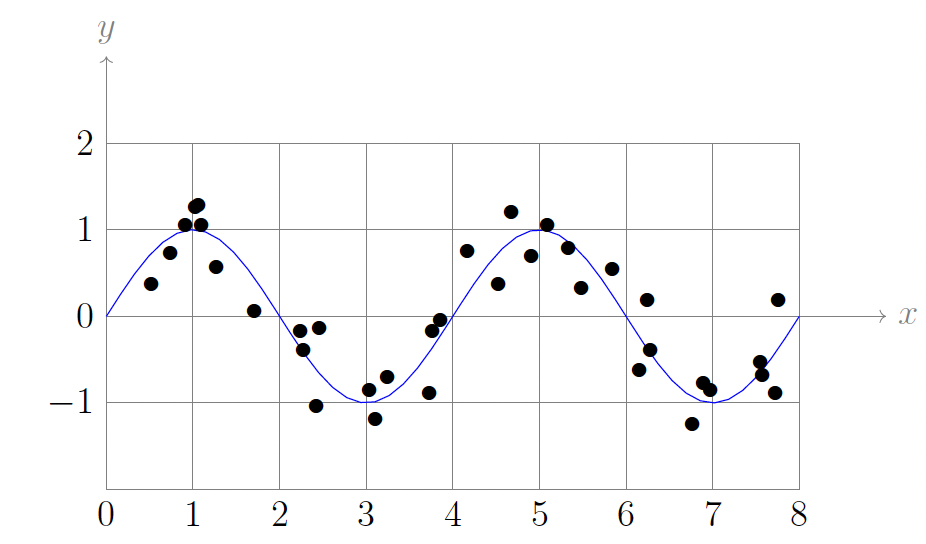
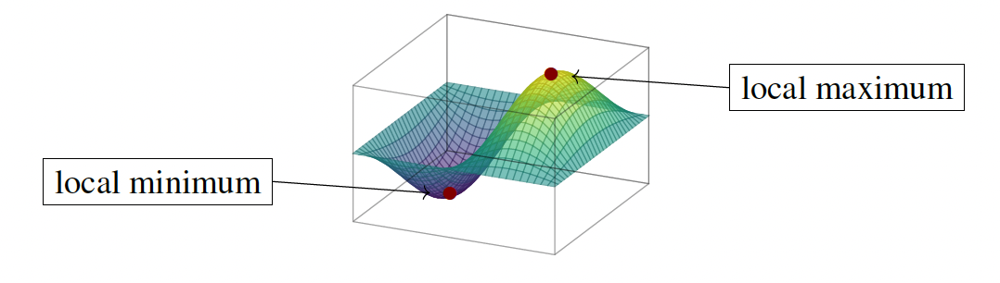
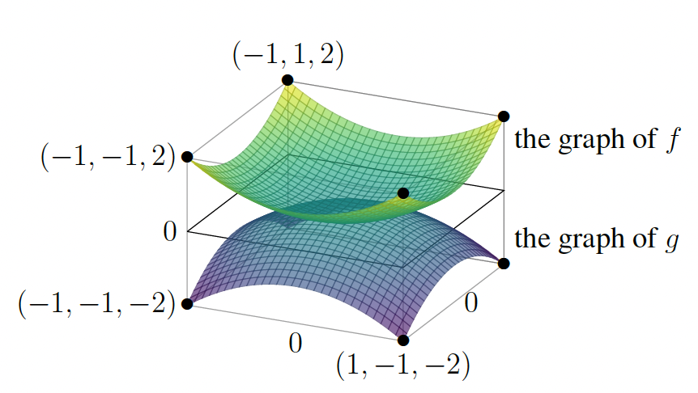
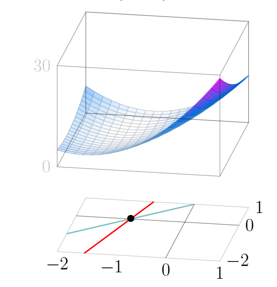
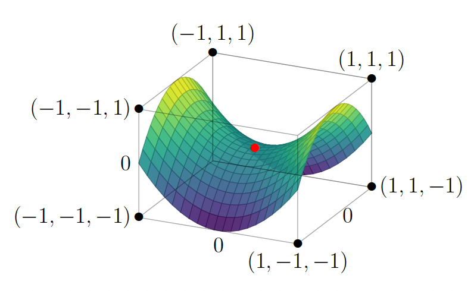
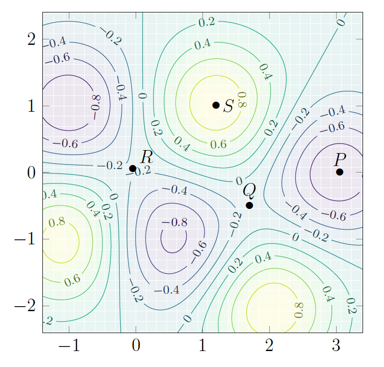
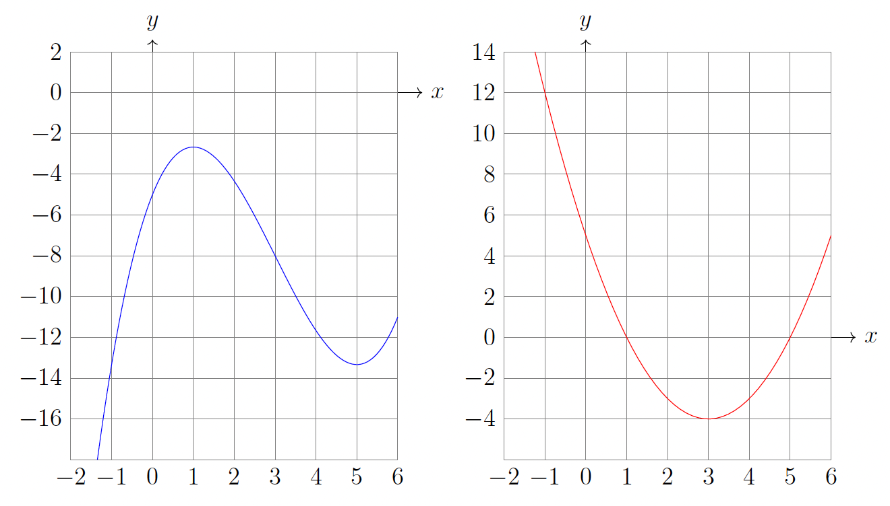
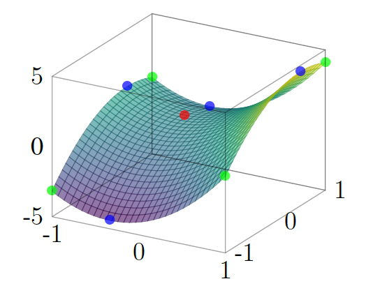

# Maxima, minima, and critical points

## Single-variable recap: first derivative test

A useful result in single-variable calculus is the **first derivative test**. If $f \colon (a, b) \to \mathbb{R}$ is differentiable and attains a local maximum or local minimum at some point $x = c$ inside this open interval (i.e. $a < c < b$), then $f'(c) = 0$. Any point where $f'(c) = 0$ is called a **critical point** for $f$, so local maxima and local minima of differentiable functions on an open interval are always critical points.

It is worth emphasizing that the **differentiability** of $f$ is necessary here. For example, the function $f(x) = |x|$ attains its minimum value of $0$ at $x = 0$, but since $f$ is not differentiable at that point we cannot say that $x = 0$ is a critical point for $f$. The first derivative test does not apply when the function fails to be differentiable at the point in question.

Knowing that $f'(c) = 0$ does **not** by itself tell us whether $c$ is a local maximum, a local minimum, or neither (e.g. a flat point or inflection). Two standard ways to classify a critical point are:

**First derivative test (sign change):** Suppose $f$ is continuous at $c$ and differentiable on a punctured neighborhood of $c$ (i.e. on $(c - \delta, c)$ and $(c, c + \delta)$ for some $\delta > 0$). If $f'$ is **positive to the left** of $c$ and **negative to the right**, then $f$ increases toward $c$ and decreases after $c$, so $f$ has a **local maximum** at $c$. If $f'$ is **negative to the left** and **positive to the right**, then $f$ has a **local minimum** at $c$. If the sign of $f'$ is the same on both sides (or $f'$ vanishes in whole intervals), this test may be inconclusive.

**Second derivative test:** Suppose $f$ is twice differentiable at $c$ and $f'(c) = 0$. If $f''(c) > 0$, then the graph is **concave up** at $c$, so $f$ has a **local minimum** at $c$. If $f''(c) < 0$, the graph is **concave down** at $c$, so $f$ has a **local maximum** at $c$. If $f''(c) = 0$, the test gives **no conclusion** (e.g. $x^4$ and $x^3$ at $0$ behave differently).

## Motivation

Optimization for functions of $n$ variables is one of the important applications of multivariable calculus.

**Example:** Suppose we look at the graph of the data points $(x_i, y_i)$, and notice that it looks approximately "periodic" (like the graph of sine or cosine) as in the figure below. This might suggest that it is more reasonable to try to fit the data with a function of the form $A\sin(Bx + C)$. 

Here $B$ describes the **frequency** of the oscillation, $A$ its **amplitude**, and $C$ its **phase**. Our fitting task amounts to finding $(A, B, C)$ that minimizes the sum of squared errors:

$$E(A, B, C) = \sum_{i=1}^{N} \bigl( y_i - A\sin(Bx_i + C) \bigr)^2$$

This minimization problem can no longer be carried out using linear algebra alone; it requires multivariable calculus.

**Example:** In the physical sciences, many problems can be studied by means of energy minimization. For example, predicting how a protein folds is a fundamental problem in molecular biology, and a useful clue for understanding the folding that occurs in nature is that it minimizes the energy. The energy of a protein configuration corresponds to a function of hundreds or thousands of variables (that keep track of the configuration), and numerically solving the associated minimization problem is a valuable tool in work on protein folding.

## Testing for critical points

A function $f(x, y)$ achieves a **local maximum** at $(a, b)$ if $f(a, b) \geq f(x, y)$ for all $(x, y)$ sufficiently close to $(a, b)$. In other words, if we move in any direction from $(a, b)$, then as long as we stay nearby, $f(x, y)$ decreases or stays the same.

A function $f(x, y)$ achieves a **local minimum** at $(a, b)$ if $f(a, b) \leq f(x, y)$ for all $(x, y)$ sufficiently close to $(a, b)$. That is, moving in any direction from $(a, b)$ causes $f(x, y)$ to increase or stay the same (as long as we stay near $(a, b)$).

Let us try to understand what is going on by reducing to functions of one variable. Suppose that $f(x, y)$ has a local maximum at $(a, b)$. If we keep $x$ close to $a$ and keep $y$ fixed at the value $b$, then we have

$$f(a + h, b) \approx f(a, b) + f_x(a, b)\,h$$

for values of $h$ near $0$.

Thus, if $f_x(a, b) > 0$ and we consider small $h > 0$, then this shows that $f(a + h, b)$ should be larger than $f(a, b)$, so $(a, b)$ cannot be a local maximum. Similarly, if $f_x(a, b) < 0$ and we consider small $h < 0$, then $f(a + h, b)$ will again be larger than $f(a, b)$. This is analogous to the fact that if the derivative of a single-variable function is positive somewhere then the graph is sloping upward nearby, while if the derivative is negative there then the graph is sloping downward nearby. This shows that if $(a, b)$ is a local maximum then the options $f_x(a, b) > 0$ and $f_x(a, b) < 0$ are ruled out, so necessarily $f_x(a, b) = 0$. Using precisely the same reasoning by wiggling $y$ while keeping $x = a$, when $(a, b)$ is a local maximum for $f$ we also conclude that $f_y(a, b) = 0$.

We summarize what we have learned as follows: if $f \colon \mathbb{R}^2 \to \mathbb{R}$ has a local maximum at $(a, b)$, then

$$\frac{\partial f}{\partial x}(a, b) = 0 \quad \text{and} \quad \frac{\partial f}{\partial y}(a, b) = 0$$

We can reason the same way for local minima, and also for functions of more than two variables.

Let $f \colon \mathbb{R}^n \to \mathbb{R}$ be a function.

**Theorem:** Suppose that a point $\mathbf{a} \in \mathbb{R}^n$ is either a local maximum or a local minimum of $f$. Then all partial derivatives of $f$ vanish at $\mathbf{x} = \mathbf{a}$; i.e.,

$$\frac{\partial f}{\partial x_i}(\mathbf{a}) = 0 \quad \text{for } 1 \leq i \leq n$$

If $\frac{\partial f}{\partial x_i}(\mathbf{a}) = 0$ for all $1 \leq i \leq n$, then we say $\mathbf{a}$ is a **critical point** for $f$. In particular, every local maximum and every local minimum of $f \colon \mathbb{R}^n \to \mathbb{R}$ is a critical point.

Strictly speaking, in the preceding theorem and definition we should assume $f$ is "differentiable" in an appropriate $n$-variable sense that recovers the notion from single-variable calculus when $n = 1$.

**Example:** Consider $f(x, y) = x^2 + y^2$. We compute that $f_x(x, y) = 2x$, $f_y(x, y) = 2y$, so the simultaneous vanishing of partial derivatives happens only at the origin $(x, y) = (0, 0)$. Now $f(0, 0) = 0$, and if $(x, y)$ is any other point (it does not even need to be near the origin), then $f(x, y) > 0$ by inspection. This means that $(0, 0)$ is a local minimum. Since the condition $f(x, y) \geq f(0, 0)$ even holds without requiring $(x, y)$ to be close to $(0, 0)$, we say that $(0, 0)$ is a "global minimum" for $f$. Similarly, if we consider $g(x, y) = -x^2 - y^2$ then the partial derivatives are $g_x = -2x$, $g_y = -2y$, and these simultaneously vanish only when $(x, y) = (0, 0)$. Furthermore, $g(0, 0) = 0$ while $g(x, y) < 0$ for any other point, so the origin is a global maximum for $g$.

**Example:** Let $f(x, y) = 4x^2 - 2xy + y^2 + 8x - 2y + 5$. We compute that $f_x = 8x - 2y + 8$, $f_y = -2x + 2y - 2$. Solving $f_x = f_y = 0$ amounts to solving a system of 2 linear equations in 2 unknowns. Using substitution of one equation into the other, the unique solution is $(x, y) = (-1, 0)$. This is the only critical point of $f$, at which the value is $f(-1, 0) = 1$. 

The surface is the graph of $f(x, y) = 4x^2 - 2xy + y^2 + 8x - 2y + 5$. The green line is determined by the equation $f_y = -2x + 2y - 2 = 0$. The red line is determined by the equation $f_x = 8x - 2y + 8 = 0$. Their point of intersection is $(x, y) = (-1, 0)$.

How can we tell whether this is a local maximum or local minimum, or perhaps neither? That is, how do the values of $f(x, y)$ for $(x, y)$ near $(-1, 0)$ compare to the value $1$ at $(-1, 0)$? One method is: plot the graph on a computer (as shown above) and just stare at it! By visual inspection, it looks like it is probably a local minimum, though to be more convinced one might want to "zoom in" and rotate the graph a bit to be sure. This method has a couple of defects, the most serious one being that it doesn't adapt well to problems in more unknowns (we can't literally "see" the graph of $f(x_1, \ldots, x_n)$ in $\mathbb{R}^{n+1}$ when $n > 2$). We want to use methods that can adapt to problems with any number of variables, so we seek another technique.

**Example:** Turning to the surface graph $z = x^2 - y^2$ in $\mathbb{R}^3$ as shown in the figure below, we see that it has a "mountain pass" at the origin precisely because of the dichotomy in the behavior: $x^2 - y^2$ has a local minimum at the origin when restricted to certain lines through the origin in the $xy$-plane (such as the $x$-axis $y = 0$) and a local maximum at the origin when restricted to certain other lines through the origin in the $xy$-plane (such as the $y$-axis $x = 0$). The picture of the surface graph near $(0, 0, f(0, 0)) = (0, 0, 0)$ makes clear why we call $(0, 0)$ a **saddle point** for $x^2 - y^2$.

The graph of $f(x, y) = x^2 - y^2$. Notice the saddle point at $(x, y) = (0, 0)$.

We will soon define the concept of saddle point in general, and analyze it systematically (for any number of variables). It will be seen to represent a genuinely new phenomenon of the multivariable world with no counterpart in single-variable calculus, and has rather practical significance too.

We emphasize that if $\mathbf{a}$ is a critical point of $f \colon \mathbb{R}^n \to \mathbb{R}$, then it may be neither a local maximum nor a local minimum. In fact, for functions of two or more variables there is a new phenomenon.

**Definition:** A critical point $\mathbf{a} \in \mathbb{R}^n$ of $f \colon \mathbb{R}^n \to \mathbb{R}$ is a **saddle point** if (i) as we move away from $\mathbf{a}$ along some line (e.g., parallel to a coordinate axis) then $f$ increases nearby, so $\mathbf{a}$ is a local minimum along that line, and (ii) as we move away from $\mathbf{a}$ along some other line then $f$ decreases, so $\mathbf{a}$ is a local maximum along that line.

Such behavior can happen with $n$ variables when $n > 1$ because then there are "more lines" in $\mathbb{R}^n$ through a point along which we can move away from the point: in $\mathbb{R}$ there is only one line through a point, but in $\mathbb{R}^2$ there are many lines through a point, let alone in $\mathbb{R}^n$ for $n > 2$. This is a genuinely multivariable phenomenon.

We do not yet have any general methods for determining when a critical point is a local maximum or local minimum or a saddle point (or perhaps even more exotic possibilities?). The method for this involves second partial derivatives, which we will discuss sometime later.

**Example:** To illustrate why the signs of the second partials are insufficient when $n > 1$, we give a function $f(x, y)$ with a critical point $\mathbf{a}$ at which all three values $f_{xx}(\mathbf{a})$, $f_{yy}(\mathbf{a})$, $f_{xy}(\mathbf{a})$ are positive yet $f$ has a saddle point (rather than a local minimum) at $\mathbf{a}$! Consider $f(x, y) = x e^{x+3y} - x + \sin^2(y)$. This has partials $f_x = (1 + x)e^{x+3y} - 1$ and $f_y = 3x e^{x+3y} + 2\sin(y)\cos(y) = 3x e^{x+3y} + \sin(2y)$ that both vanish at $\mathbf{0}$, so the origin is a critical point of $f$. We compute $f_{xx} = (2 + x)e^{x+3y}$, $f_{yy} = 9x e^{x+3y} + 2\cos(2y)$, $f_{xy} = 3(1 + x)e^{x+3y}$, so $f_{xx}(0) = 2$, $f_{yy}(0) = 2$, $f_{xy}(0) = 3$ are all positive. On the coordinate axes we have $f(x, 0) = x e^{x} - x = x(e^{x} - 1)$ and $f(0, y) = \sin^2(y)$, each of which is checked (via single-variable calculus) to have a local minimum at the origin.

But the behavior of $f(x, y)$ on the line $y = -x$ is encoded in the function $g(x) = f(x, -x) = x e^{-2x} - x + \sin^2(-x) = x(e^{-2x} - 1) + \sin^2(x)$ that has a critical point at $x = 0$ (because $g'(x) = (1 - 2x)e^{-2x} - 1 + \sin(2x)$ satisfies $g'(0) = 0$) yet that is a local maximum for $g(x)$ since $g''(x) = 4(x - 1)e^{-2x} + \sin(4x)$ satisfies $g''(0) = -4 < 0$. Hence, $f$ has a saddle point at the origin.

**Example:** The contour plot in the figure below for a function $f(x, y)$ shows several types of critical
points.

Near the critical points, the locations of the level sets for a common small step size in the function value (.2 in the plot shown here) become rather “spread out”; i.e., not as densely packed as elsewhere. Why is this?

The visual picture of spreading-out of level sets near a critical point is saying in numerical terms that at a place where the partial derivatives are all small, to attain a given numerical change in the function value towards a local extremum (such as increments of $\pm 0.15$) seems to require moving a bigger distance than at a place where the partial derivatives are not all small. This formulation also makes sense as a possible property for functions $f \colon \mathbb{R}^n \to \mathbb{R}$ near a critical point for any $n$ (not just $n = 2$).

## Fitting curves to data

**Example:** Suppose we are given a collection of data points $(x_i, y_i)$, $i = 1, \ldots, n$, not all on the same vertical line; i.e., not all the $x_i$ have the same value. If they all have the same value, a vertical line fits the data precisely! We want to find the value of $(m, b)$ which minimizes

$$E(m, b) = \sum_{i=1}^{n} (y_i - m x_i - b)^2$$

We begin by computing the two partial derivatives:

$$\frac{\partial E}{\partial b} = \sum_{i=1}^{n} (-2)(y_i - m x_i - b), \qquad \frac{\partial E}{\partial m} = \sum_{i=1}^{n} (-2)x_i(y_i - m x_i - b)$$

The values of $m$ and $b$ we are looking for must satisfy $E_m(m, b) = 0$, $E_b(m, b) = 0$, so we need to solve the system of simultaneous linear equations

$$\sum_{i=1}^{n} (y_i - m x_i - b) = 0, \qquad \sum_{i=1}^{n} x_i(y_i - m x_i - b) = 0$$

It looks like a mess, but remember that each of $x_i$ and $y_i$ are numbers that we know beforehand. So we can rewrite this in a more transparent way as

$$m \sum_{i=1}^{n} x_i + n b = \sum_{i=1}^{n} y_i, \qquad m \sum_{i=1}^{n} x_i^2 + b \sum_{i=1}^{n} x_i = \sum_{i=1}^{n} x_i y_i$$

This is "2 equations in 2 unknowns" $m$ and $b$ (the coefficients involve expressions in the known data points $(x_i, y_i)$ and $n$, so they are known numbers).

**Example:** Here is a closely related example which builds on the idea that sometimes we want to find more complicated curves which best fit a certain set of data. So now let us find constants $A$, $B$, $C$ for which the function $y = A\sin(Bx + C)$ best fits data points $(x_1, y_1), \ldots, (x_N, y_N)$. When the data represents some phenomenon which we expect to be periodic (e.g., temperatures in a given location over a several-year period), it is quite reasonable to use the periodic sine function as a model for the change over the seasons.

We proceed just as before, by trying to find a minimum of the total squared error

$$E(A, B, C) = \sum_{i=1}^{N} \bigl( y_i - A\sin(Bx_i + C) \bigr)^2$$

We compute the three partial derivatives $\partial E/\partial A$, $\partial E/\partial B$ and $\partial E/\partial C$, and this requires a bit more work than in the previous example. Please make sure you understand the following computation:

$$\frac{\partial E}{\partial A} = \sum_{i=1}^{N} (-2)\sin(Bx_i + C)\,\bigl(y_i - A\sin(Bx_i + C)\bigr)$$

$$\frac{\partial E}{\partial B} = \sum_{i=1}^{N} (-2)A x_i \cos(Bx_i + C)\,\bigl(y_i - A\sin(Bx_i + C)\bigr)$$

$$\frac{\partial E}{\partial C} = \sum_{i=1}^{N} (-2)A \cos(Bx_i + C)\,\bigl(y_i - A\sin(Bx_i + C)\bigr)$$

This is an instructive example because this system of equations is pretty complicated and it is very unlikely that we can find the exact values of the solutions $(A, B, C)$ in terms of the data points $(x_i, y_i)$. For such a system of equations it is reasonable to try to think about how to find a numerical approximation to critical points $(A, B, C)$.

## Extrema on boundaries

In practical applications we often need to find maxima or minima of $f$ when $f$ is regarded as a function only on some region $D$ in $\mathbb{R}^n$.

**Example:** The coordinates $x_i$ may have a physical or other real-world meaning that constrains them to always be non-negative (e.g., height above the ground, or some temperature in Kelvin). In such cases we may use $D = \{ (x_1, \ldots, x_n) \in \mathbb{R}^n : x_i \geq 0 \text{ for all } i \}$.

When seeking maximal and minimal values of a function on a region $D$ (rather than on the entirety of $\mathbb{R}^n$), extrema might be attained at points that are not among those where the partial derivatives vanish.

**Example:** Consider the task of finding the maxima and minima of the function $f(x) = \frac{1}{3}x^3 - 3x^2 + 5x - 5$ on the interval $[-2, 6]$. 

We have $f'(x) = x^2 - 6x + 5 = (x-1)(x-5)$, so the only critical points in the interior of $[-2, 6]$ are $x = 1$ and $x = 5$. 

Below is a figure showing the graphs $y = f(x)$ (left) and $y = f'(x)$ (right).

We must also check the **endpoints** $x = -2$ and $x = 6$. 

Computing values: $f(-2) = -\frac{8}{3} - 12 - 10 - 5 = -\frac{89}{3}$, $f(1) = \frac{1}{3} - 3 + 5 - 5 = -\frac{8}{3}$, $f(5) = \frac{125}{3} - 75 + 25 - 5 = -\frac{40}{3}$, and $f(6) = 72 - 108 + 30 - 5 = -11$. 

So the minimum value on $[-2, 6]$ is $f(-2) = -\frac{89}{3}$, attained at the **left endpoint** $x = -2$, and the maximum value is $f(1) = -\frac{8}{3}$, attained at the critical point $x = 1$. 

The minimum is **not** at a critical point— it occurs at an endpoint, where $f'(-2) = 4 + 12 + 5 = 21 \neq 0$. So when the domain is restricted to an interval, we must always compare values at interior critical points with values at the boundary (here, the two endpoints).

The moral of the preceding example is to remind us that in single-variable calculus, a local extremum $x = c$ for a function $f \colon I \to \mathbb{R}$ on an interval $I$ is necessarily a critical point only when $c$ is *not* an endpoint of $I$. It can happen (as in that example) that an endpoint of $I$ is a local extremum for $f$ on the interval $I$, and in such cases that endpoint need not be a point where $f'$ vanishes.

It is natural to expect an analogue of this "endpoint" phenomenon— i.e., a local extremum on a region occurring at a non-critical point in the multivariable setting when we study $f \colon D \to \mathbb{R}$ for a subset $D$ of $\mathbb{R}^n$. The replacement of "endpoint" for such $D$ is called a **boundary point**.

**Example:** Let $D$ be the solid ball

$$\{ (x, y, z) \in \mathbb{R}^3 : (x - 3)^2 + (y + 2)^2 + (z - 5)^2 \leq 9 = 3^2 \}$$

of radius $3$ centered at $(3, -2, 5)$. In this case the points of the outer sphere

$$\{ (x, y, z) \in \mathbb{R}^3 : (x - 3)^2 + (y + 2)^2 + (z - 5)^2 = 9 \}$$

are called the **boundary points** of $D$, and the other points of $D$ are called its **interior points**. Explicitly, the interior points are those $(x, y, z) \in \mathbb{R}^3$ whose distance to the center of the ball is strictly less than $3$: $(x - 3)^2 + (y + 2)^2 + (z - 5)^2 < 9$.

**Theorem:** Let $f \colon \mathbb{R}^n \to \mathbb{R}$ be a function and $D$ a region inside $\mathbb{R}^n$. Suppose that $f \colon D \to \mathbb{R}$ (i.e. $f$ restricted to $D$) has a local extremum at a point $\mathbf{a} \in D$— that is, $f(\mathbf{x}) \geq f(\mathbf{a})$ for all $\mathbf{x} \in D$ sufficiently close to $\mathbf{a}$ (local minimum), or $f(\mathbf{x}) \leq f(\mathbf{a})$ for all $\mathbf{x} \in D$ sufficiently close to $\mathbf{a}$ (local maximum). Then $\mathbf{a}$ must be a **critical point** of $f$ when $\mathbf{a}$ is in the **interior** of $D$. In particular, any local extremum of $f \colon D \to \mathbb{R}$ either is a critical point in the interior of $D$ or is a boundary point of $D$.

This is a "constrained" sense of optimization— a constrained local maximum or minimum (the constraint being that we only consider points in $D$). Strictly speaking, in the theorem above we need to assume that $f$ is "differentiable" in an appropriate $n$-variable sense (so that the conclusion about critical points in the interior is valid).

A huge difference between the study of local extrema at boundary points of regions $D$ in $\mathbb{R}^n$ when $n > 1$ as opposed to when $n = 1$ is that the possibilities for the **geometry of the boundary** of $D$ are much richer when $n > 1$ (even when $n = 2$) than when $n = 1$. For example, a closed disk in the plane has boundary a **circle**, whereas a closed bounded interval in $\mathbb{R}$ has boundary that is just a **pair of points**. This makes the study of local extrema of $f \colon D \to \mathbb{R}$ at boundary points much richer when $n > 1$.

**Example:** Here is a case with a specific $f$ on a specific region in $\mathbb{R}^2$ to illustrate a complete calculation in practice. Consider the function

$$f(x, y) = 3x^2 - 2y^2 + 2x + 2y - 1$$

on the rectangle

$$D = \{ (x, y) \in \mathbb{R}^2 : -1 \leq x \leq 1,\ -1 \leq y \leq 1 \}$$

The graph of $f(x, y) = 3x^2 - 2y^2 + 2x + 2y - 1$. The interior critical point is shown in red. The edge critical points are blue. The corner points are green. The extrema can only occur at these colored points.

We first compute $f_x = 6x + 2$, $f_y = -4y + 2$, so $f_x = 0$ implies $x = -1/3$, and $f_y = 0$ implies $y = 1/2$. 

Hence, the vanishing of both partial derivatives happens precisely at the single point $(-1/3, 1/2)$ (which we observe is in the interior of the rectangle $D$). Note that $f(-1/3, 1/2) = -5/6$. This single critical point in the interior is shown in red in the figure.

Next, we analyze how $f$ behaves on the **edges** of $D$. Focusing on the bottom edge amounts to studying the function $f(x, -1) = 3x^2 + 2x - 5$ on the interval $[-1, 1]$. 

This has derivative (with respect to $x$) $6x + 2$, which vanishes at precisely $x = -1/3$, so $(-1/3, -1)$ is another candidate. 

We evaluate $f(-1/3, -1) = -16/3$. In a similar way along the other edges, we compute: 

(i) $f_x(x, 1) = 0$ at precisely $x = -1/3$ (with $f(-1/3, 1) = -4/3$), 

(ii) $f_y(-1, y) = 0$ at precisely $y = 1/2$ (with $f(-1, 1/2) = 1/2$), 

(iii) $f_y(1, y) = 0$ at precisely $y = 1/2$ (with $f(1, 1/2) = 9/2$). These four critical points on the edges are shown in blue.

Finally, evaluating at the four corners we have $f(-1, -1) = -4$, $f(-1, 1) = 0$, $f(1, -1) = 0$, $f(1, 1) = 4$. These points are shown on the graph in green.

Comparing the values of $f$ at all of these points (the one critical point in the interior, the critical points on each edge away from the corners, and all four corners), we see that $f$ has its **global maximum** on $D$ at the boundary point $(1, 1/2)$, with $f(1, 1/2) = 9/2$, and its **global minimum** at the boundary point $(-1/3, -1)$, with $f(-1/3, -1) = -16/3$. 

**Note:** *This method does not help at all in determining whether the other points we identified above are at least local maxima or minima over the domain, or whether the critical point in the interior is a saddle point.*

Moving beyond two variables to the **3-variable case**, if we are instead considering a function $f \colon D \to \mathbb{R}$ for a region $D$ inside $\mathbb{R}^3$ such as a solid cube, then we first consider its extrema in the **interior** (which must be among the critical points). Then we need to find extrema on each of the **square faces**— which brings us back to an instance of the 2-dimensional extrema problem on a region with boundaries. In particular, the study of these square faces requires separate work on their **edges** and, in particular, at all of the **vertices** of the cube. As you can see, this is potentially a lot of work!

We hope that the preceding examples convey a sense of how one can aim to find maxima and minima in any given situation on a reasonable region $D$ inside $\mathbb{R}^n$ by combining the technique of critical points on the interior with "lower-dimensional" extrema problems along the boundary.

## Exercises

**1.** Let

$$f(x, y) = xy^2 - 4xy + \tfrac{1}{2}x^2 + 1.$$

On the square

$$S = \{ (x, y) \in \mathbb{R}^2 : -1 \leq x \leq 1,\ -1 \leq y \leq 1 \},$$

analyze $f$ on each side of $S$, compare with $f(0, 0)$, and determine where $f$ attains its global maximum and global minimum on $S$.

**Solution:** First,

$$f_x = y^2 - 4y + x, \qquad f_y = 2xy - 4x = 2x(y - 2)$$

On each edge we restrict $f$ to one variable and optimize on $[-1, 1]$. In every case the derivative has its only zero outside the open interval, so on each closed edge the extrema occur at the endpoints (the corners of $S$).

- **$x = 1$:** $f(1, y) = y^2 - 4y + \tfrac{3}{2}$. Endpoints: $f(1, -1) = \tfrac{13}{2}$, $f(1, 1) = -\tfrac{3}{2}$.

- **$x = -1$:** $f(-1, y) = -y^2 + 4y + \tfrac{3}{2}$. Endpoints: $f(-1, -1) = -\tfrac{7}{2}$, $f(-1, 1) = \tfrac{9}{2}$.

- **$y = 1$:** $f(x, 1) = \tfrac{1}{2}x^2 - 3x + 1$. Endpoints: $f(-1, 1) = \tfrac{9}{2}$, $f(1, 1) = -\tfrac{3}{2}$.

- **$y = -1$:** $f(x, -1) = \tfrac{1}{2}x^2 + 5x + 1$. Endpoints: $f(-1, -1) = -\tfrac{7}{2}$, $f(1, -1) = \tfrac{13}{2}$.

The values to compare are $1$ at $(0, 0)$ and the four corner values above. The largest is $\tfrac{13}{2} = 6.5$ at $(1, -1)$; the smallest is $-\tfrac{7}{2} = -3.5$ at $(-1, -1)$.

On $S$, $f$ attains its **maximum** $\tfrac{13}{2}$ at $(1, -1)$ and its **minimum** $-\tfrac{7}{2}$ at $(-1, -1)$. In particular $f(0, 0) = 1$ is neither maximal nor minimal on $S$ (it lies strictly between the min and max).

**2.** Let

$$f(x, y) = x^3 - 3x^2 - 6xy + 9x + 3y^2.$$

**(a)** Show that $f$ has exactly two critical points: $(1, 1)$ and $(3, 3)$.

**Solution:** Compute

$$f_x = 3x^2 - 6x - 6y + 9 = 3(x^2 - 2x - 2y + 3), \qquad f_y = -6x + 6y = 6(y - x).$$

From $f_y = 0$ we get $y = x$. Substitute into $f_x = 0$:

$$x^2 - 2x - 2x + 3 = x^2 - 4x + 3 = (x - 1)(x - 3) = 0,$$

so $x = 1$ or $x = 3$, hence $y = x$ gives $(1, 1)$ and $(3, 3)$. These are the only solutions of $f_x = f_y = 0$, so $f$ has **exactly two** critical points.

**(b)** By examining $f$ on the lines $x = 1$ and $y = x$ through $(1, 1)$, explain why $(1, 1)$ is a saddle point. For completeness: $(3, 3)$ is a local minimum.

**Solution:** Restrict to

$$g(y) := f(1, y) = 1 - 3 - 6y + 9 + 3y^2 = 3y^2 - 6y + 7 = 3(y - 1)^2 + 4.$$

Then $g(y) \geq 4 = g(1)$ for all $y$, with equality only at $y = 1$. So along $x = 1$, the point $(1, 1)$ is a **strict local minimum** (in fact along that entire line).

**Line $y = x$:** Restrict to

$$h(x) := f(x, x) = x^3 - 3x^2 - 6x^2 + 9x + 3x^2 = x^3 - 6x^2 + 9x = x(x - 3)^2.$$

Then

$$h'(x) = (x - 3)^2 + 2x(x - 3) = (x - 3)\bigl((x - 3) + 2x\bigr) = (x - 3)(3x - 3) = 3(x - 1)(x - 3).$$

For $x$ slightly less than $1$, both factors $(x - 1)$ and $(x - 3)$ are negative, so $h'(x) > 0$; for $x$ slightly greater than $1$ (but still $< 3$), $(x - 1) > 0$ and $(x - 3) < 0$, so $h'(x) < 0$. Thus $h$ has a **local maximum** at $x = 1$, i.e. $(1, 1)$ is a local maximum along the line $y = x$.

Since $(1, 1)$ is a local minimum along one line through it and a local maximum along another, it is a **saddle point** of $f$.

**(c)** By examining $f$ on the $x$-axis, show that $f$ has no global maximum and no global minimum on $\mathbb{R}^2$.

**Solution:** On the $x$-axis ($y = 0$), define the single-variable function

$$\varphi(x) := f(x, 0) = x^3 - 3x^2 + 9x.$$

Its derivatives are

$$\varphi'(x) = 3x^2 - 6x + 9 = 3(x^2 - 2x + 3) = 3\bigl((x - 1)^2 + 2\bigr).$$

Since $(x - 1)^2 + 2 > 0$ for every $x \in \mathbb{R}$, we have $\varphi'(x) > 0$ for all $x$. Thus $\varphi$ is **strictly increasing** on $\mathbb{R}$. In particular $\varphi$ has **no critical points** on the $x$-axis (so no interior candidate for a max or min of $f$ along that line beyond what monotonicity already tells us).

A strictly increasing function on $\mathbb{R}$ is **unbounded above** and **unbounded below**. Equivalently $\lim_{x \to +\infty} \varphi(x) = +\infty$ and $\lim_{x \to -\infty} \varphi(x) = -\infty$.

$f$ has **no global maximum** and **no global minimum** on $\mathbb{R}^2$.

**3.** Let $f(x, y) = x^2 + 3xy + y^2$, and let $D$ be the region defined by $y \geq 1$ and $x^2 + y^2 \leq 10$. 

**(a)** Find the critical points of $f$ in the interior of $D$.

**Solution:** First,

$$f_x = 2x + 3y, \qquad f_y = 3x + 2y.$$

Critical points of $f$ on $\mathbb{R}^2$ satisfy $f_x = f_y = 0$, i.e.

$$2x + 3y = 0, \qquad 3x + 2y = 0.$$

The **interior** of $D$ (as a subset of $\mathbb{R}^2$) consists of points with **strict** inequalities: $y > 1$ and $x^2 + y^2 < 10$. The point $(0, 0)$ does not lie in $D$ at all, since it fails $y \geq 1$. Hence $(0, 0)$ is not in the interior of $D$.

$f$ has **no** critical points in the interior of $D$.

**(b)** With the same $f$ and $D$ as above, find the extrema of $f$ on the boundary of $D$ by describing both the bottom edge and the circular arc in terms of $x$ alone (so that each piece is a single-variable calculus problem). Combine with the interior analysis to find the extrema of $f$ on all of $D$—both the extreme values and the points where they are attained.

**Solution:** The boundary of $D$ has two parts:

1. **Bottom edge:** $y = 1$ with $x^2 + y^2 \leq 10$, i.e. $x^2 \leq 9$, so $x \in [-3, 3]$.
2. **Circular arc:** $x^2 + y^2 = 10$ with $y \geq 1$. Then $y = \sqrt{10 - x^2}$ (positive root), and $y \geq 1$ forces $10 - x^2 \geq 1$, i.e. $x^2 \leq 9$, so again $x \in [-3, 3]$. The endpoints $(\pm 3, 1)$ are where the edge and the arc meet.

**Bottom edge (parameter $x$):** Substitute $y = 1$:

$$g(x) := f(x, 1) = x^2 + 3x + 1, \qquad x \in [-3, 3].$$

Then $g'(x) = 2x + 3$, so $g'(x) = 0$ at $x = -\tfrac{3}{2}$ (which lies in $(-3, 3)$). Values:

$$g\!\left(-\tfrac{3}{2}\right) = \tfrac{9}{4} - \tfrac{9}{2} + 1 = -\tfrac{5}{4}, \qquad g(-3) = 1, \qquad g(3) = 19.$$

**Circular arc (parameter $x$):** Substitute $y = \sqrt{10 - x^2}$:

$$f(x, y) = x^2 + 3x\sqrt{10 - x^2} + (10 - x^2) = 10 + 3x\sqrt{10 - x^2}.$$

Define

$$h(x) := 10 + 3x\sqrt{10 - x^2}, \qquad x \in [-3, 3].$$

Then (for $x \in (-3, 3)$ where $\sqrt{10 - x^2} > 0$)

$$h'(x) = 3\sqrt{10 - x^2} + 3x \cdot \frac{-x}{\sqrt{10 - x^2}} = \frac{3(10 - x^2) - 3x^2}{\sqrt{10 - x^2}} = \frac{3(10 - 2x^2)}{\sqrt{10 - x^2}}.$$

Thus $h'(x) = 0$ when $x^2 = 5$, i.e. $x = \pm \sqrt{5}$. Both lie in $(-3, 3)$. Here $y = \sqrt{10 - 5} = \sqrt{5}$. Compute

$$f(\sqrt{5}, \sqrt{5}) = 5 + 3 \cdot 5 + 5 = 25, \qquad f(-\sqrt{5}, \sqrt{5}) = 5 - 15 + 5 = -5.$$

At the arc endpoints (same as the bottom corners), $h(\pm 3) = f(\pm 3, 1)$: $h(3) = 19$, $h(-3) = 1$.

**Boundary extrema:** On the bottom edge, the minimum is $-\tfrac{5}{4}$ at $\left(-\tfrac{3}{2}, 1\right)$ and the maximum along that segment is $19$ at $(3, 1)$. On the arc, the maximum is $25$ at $(\sqrt{5}, \sqrt{5})$ and the minimum is $-5$ at $(-\sqrt{5}, \sqrt{5})$, with endpoint values $1$ and $19$ as above.

**Global extrema on $D$:** There are no interior critical points in $D$, so the global maximum and minimum of $f$ on $D$ occur on the boundary. Comparing all candidate values:

$$-5 < -\tfrac{5}{4} < 1 < 19 < 25.$$

Hence $f$ attains its **maximum** $\mathbf{25}$ at $\mathbf{(\sqrt{5}, \sqrt{5})}$ and its **minimum** $\mathbf{-5}$ at $\mathbf{(-\sqrt{5}, \sqrt{5})}$ on $D$.

**4.** Let

$$D = \{(x,y)\in \mathbb{R}^2 : 0 \le x \le 4,\ 0 \le y \le x^2\}, \qquad f(x,y)=x^3+y^3-3xy.$$

It is a fact that $f$ has extrema on $D$.

**(a)** Draw a picture of $D$ and show that there are no critical points of $f$ in the interior of $D$ (that is, $0<x<4$, $0<y<x^2$). Conclude that $f$ has no extrema in the interior.

**Solution:** The region $D$ is the set of points between the $x$-axis and the parabola $y=x^2$, from $x=0$ to $x=4$. So its boundary has four pieces:

1. Bottom segment: $y=0$, $0\le x\le 4$.
2. Left segment: $x=0$, $0\le y\le 0$ (degenerate, just the point $(0,0)$).
3. Parabolic arc: $y=x^2$, $0\le x\le 4$.
4. Right segment: $x=4$, $0\le y\le 16$.

Now compute

$$f_x=3x^2-3y=3(x^2-y), \qquad f_y=3y^2-3x=3(y^2-x).$$

Critical points in the interior must satisfy

$$x^2-y=0,\qquad y^2-x=0.$$

From $y=x^2$, substitute into $y^2=x$:

$$x^4=x \;\Longrightarrow\; x(x^3-1)=0 \;\Longrightarrow\; x=0 \text{ or } x=1.$$

Then $(x,y)=(0,0)$ or $(1,1)$. The interior requires $0<y<x^2$; neither point satisfies this:

- $(0,0)$ is on the boundary.
- $(1,1)$ is also on the boundary since $y=x^2$.

Hence there are **no interior critical points**, so $f$ has no extrema in the interior of $D$.

**(b)** Analyze $f$ on the boundary pieces using single-variable calculus.

**Solution:** We analyze each boundary piece.

- **Bottom segment** $y=0$, $0\le x\le 4$:
  $$
  f(x,0)=x^3.
  $$
  This is increasing on $[0,4]$. So min is $0$ at $x=0$, max is $64$ at $x=4$.

- **Left segment** $x=0$: this is only the point $(0,0)$, and
  $$
  f(0,0)=0.
  $$

- **Parabolic arc** $y=x^2$, $0\le x\le 4$:
  $$
  g(x):=f(x,x^2)=x^3+x^6-3x^3=x^6-2x^3.
  $$
  Differentiate:
  $$
  g'(x)=6x^5-6x^2=6x^2(x^3-1).
  $$

  Evaluate candidates on $[0,4]$:
  $$
  g(0)=0,\qquad g(1)=1-2=-1,\qquad g(4)=4^6-2\cdot 4^3=4096-128=3968.
  $$
  So on the parabolic boundary, min is $-1$ at $x=1$ (point $(1,1)$), max is $3968$ at $x=4$ (point $(4,16)$).

- **Right segment** $x=4$, $0\le y\le 16$:
  $$
  h(y):=f(4,y)=64+y^3-12y.
  $$
  Then
  $$
  h'(y)=3y^2-12=3(y-2)(y+2).
  $$
  On $[0,16]$, the only critical point is $y=2$. Evaluate:
  $$
  h(0)=64,\qquad h(2)=64+8-24=48,\qquad h(16)=64+4096-192=3968.
  $$
  So on this segment, the minimum is $48$ at $(4,2)$ and the maximum is $3968$ at $(4,16)$.

**(c)** Find the maximal and minimal values of $f$ on all of $D$, and where they occur.

**Solution:** Since there are no interior critical points, global extrema on $D$ must occur on the boundary. Compare all boundary candidate values:

- $(0,0)$ gives $0$,
- $(4,0)$ gives $64$,
- $(4,2)$ gives $48$,
- $(1,1)$ gives $-1$,
- $(4,16)$ gives $3968$.

Therefore:

- Global **minimum** on $D$ is $\boxed{-1}$ at $\boxed{(1,1)}$.
- Global **maximum** on $D$ is $\boxed{3968}$ at $\boxed{(4,16)}$.

**5.** Briefly justify whether each of the following statements is either **true** (always true) or **false** (sometimes not true).

**(a)** If $x = c_1$ is a critical point for the function $f(x)$, and $y = c_2$ is a critical point for the function $g(y)$, then $(c_1, c_2)$ is a critical point for the function $f(x)\,g(y)$.

**Solution:** **Always True** (assuming $f$ and $g$ are differentiable at $c_1$ and $c_2$). Let $h(x,y)=f(x)g(y)$. By the product rule for partial derivatives,

$$h_x(x,y)=f'(x)\,g(y), \qquad h_y(x,y)=f(x)\,g'(y).$$

At $(c_1,c_2)$ we have $f'(c_1)=0$ and $g'(c_2)=0$, so $h_x(c_1,c_2)=0$ and $h_y(c_1,c_2)=0$. Hence $(c_1,c_2)$ is a critical point of $h$.

**(b)** Suppose $P = (0, 0)$ is a critical point of $f(x, y) = ax^2 + bxy + cy^2$, and both $f_{xx}(P)$ and $f_{yy}(P)$ are positive. The point $P$ must be a local minimum for $f$.

**Solution:** **False.** For $f(x,y)=ax^2+bxy+cy^2$,

$$f_x=2ax+by, \qquad f_y=bx+2cy,$$

so $f_x(0,0)=f_y(0,0)=0$ for every $a,b,c$. Also $f_{xx}(\mathbf{0})=2a$ and $f_{yy}(\mathbf{0})=2c$, so $f_{xx}(P)$ and $f_{yy}(P)$ are positive exactly when $a>0$ and $c>0$.

Take a concrete example: $f(x,y)=x^2+10xy+y^2$. Then $a=c=1>0$, so $f_{xx}(P)=f_{yy}(P)=2>0$, yet $(0,0)$ is **not** a local minimum. Restrict to the line $y=-x$: set

$$\varphi(t)=f(t,-t)=t^2-10t^2+t^2=-8t^2.$$

For every $t\neq 0$ near $0$, $\varphi(t)<0=f(0,0)$, so along that line through $P$ the function **decreases** as we leave the origin. A point cannot be a local minimum of $f$ on the plane if there is a direction in which $f$ is strictly smaller arbitrarily close to $P$. Hence $P$ need not be a local minimum.

**6.** Let $V$ be the span of vectors $v_1,\ldots,v_k$ in $\mathbb{R}^n$, and let $x\in\mathbb{R}^n$.

By the Orthogonal Projection Theorem there is a unique $v\in V$ for which $\lVert x-v\rVert$ is minimized, and then $x-v$ is orthogonal to everything in $V$. This exercise explains (via partial derivatives) part of this result: for any $v$ minimizing the distance, $x-v$ is orthogonal to everything in $V$. We carry this out for $k=2$ only to avoid heavier notation; then $V=\operatorname{span}\{v_1,v_2\}$, and the method works in general.

**(a)** Define $f:\mathbb{R}^2\to\mathbb{R}$ by $f(t_1,t_2)=\lVert x-(t_1 v_1+t_2 v_2)\rVert^2$; this is the squared distance from $x$ to $t_1 v_1+t_2 v_2$ (which can be anything in $V$, since $v_1$ and $v_2$ span $V$). Note that minimizing $f$ is the same as minimizing the squared distance from $x$ to $V$. Using properties of dot products, show that

$$f(t_1,t_2)=\lVert x\rVert^2-2t_1(v_1\cdot x)-2t_2(v_2\cdot x)+t_1^2\lVert v_1\rVert^2+2t_1 t_2(v_1\cdot v_2)+t_2^2\lVert v_2\rVert^2.$$

**Solution:** Put $u=t_1 v_1+t_2 v_2$. Then

$$f(t_1,t_2)=\lVert x-u\rVert^2=(x-u)\cdot(x-u)=x\cdot x-2x\cdot u+u\cdot u.$$

Since $x\cdot x=\lVert x\rVert^2$, we may write

$$f(t_1,t_2)=\lVert x\rVert^2-2x\cdot u+u\cdot u.$$

Here $x\cdot u=t_1(v_1\cdot x)+t_2(v_2\cdot x)$ and

$$u\cdot u=(t_1 v_1+t_2 v_2)\cdot(t_1 v_1+t_2 v_2)=t_1^2(v_1\cdot v_1)+2t_1 t_2(v_1\cdot v_2)+t_2^2(v_2\cdot v_2).$$

Since $v_i\cdot v_i=\lVert v_i\rVert^2$, substituting gives the desired expression for $f$.

**(b)** Show that each partial derivative $f_{t_i}$ is given by

$$f_{t_i}=2\,v_i\cdot(-x+t_1 v_1+t_2 v_2)\qquad (i=1,2).$$

**Solution:** Differentiate the expanded form from (a). For instance,

$$f_{t_1}=-2(v_1\cdot x)+2t_1\lVert v_1\rVert^2+2t_2(v_1\cdot v_2).$$

Factor out $2$ and use bilinearity of the dot product:

$$f_{t_1}=2\,v_1\cdot(-x+t_1 v_1+t_2 v_2).$$

The same steps for $t_2$ give $f_{t_2}=2\,v_2\cdot(-x+t_1 v_1+t_2 v_2)$.

**(c)** Deduce from (b) that if $a_1 v_1+a_2 v_2$ is a point in $V$ closest to $x$, then $x-(a_1 v_1+a_2 v_2)$ is orthogonal to everything in $V$. Here $v_1$ and $v_2$ span $V$.

**Solution:** If $a_1 v_1+a_2 v_2$ is closest to $x$ in $V$, then $(a_1,a_2)$ minimizes $f(t_1,t_2)$ over $\mathbb{R}^2$. At a minimizer, $f_{t_1}=f_{t_2}=0$, so by (b),

$$v_i\cdot\bigl(x-(a_1 v_1+a_2 v_2)\bigr)=0 \qquad (i=1,2).$$

Let $w=x-(a_1 v_1+a_2 v_2)$. Then $v_1\cdot w=0$ and $v_2\cdot w=0$. Any $u\in V$ has the form $u=c_1 v_1+c_2 v_2$, so,

$$u\cdot w=c_1(v_1\cdot w)+c_2(v_2\cdot w)=0.$$

Hence $w$ is orthogonal to every vector in $V$.

**Summary (Exercise 6):** Fix a subspace $V=\operatorname{span}\{v_1,v_2\}\subseteq\mathbb{R}^n$ and a point $x$. Writing $u=t_1 v_1+t_2 v_2\in V$, the **squared distance** $\lVert x-u\rVert^2$ becomes a quadratic function $f(t_1,t_2)$ in the coordinates $(t_1,t_2)$. Its partial derivatives have the clean form $f_{t_i}=2\,v_i\cdot(u-x)$. At any minimizer $(a_1,a_2)$, both partials vanish, so the residual $w=x-(a_1 v_1+a_2 v_2)$ is orthogonal to $v_1$ and $v_2$. Because every vector in $V$ is a linear combination of $v_1$ and $v_2$, **orthogonality to the basis implies orthogonality to all of $V$**. In other words: the closest point in $V$ to $x$ is characterized by the same **normal equations** $w\perp V$ that the Orthogonal Projection Theorem asserts; here we see that fact emerge from setting $\nabla f=\mathbf{0}$. The same idea works for $V=\operatorname{span}\{v_1,\ldots,v_k\}$ with $k$ coordinates and $k$ partial derivatives.