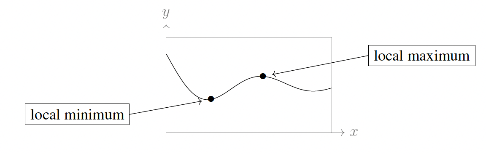
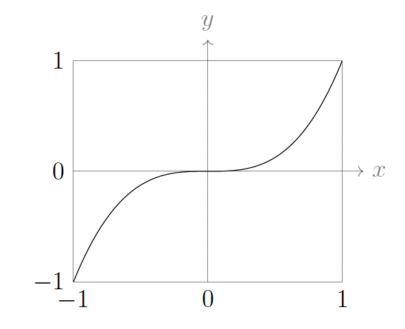
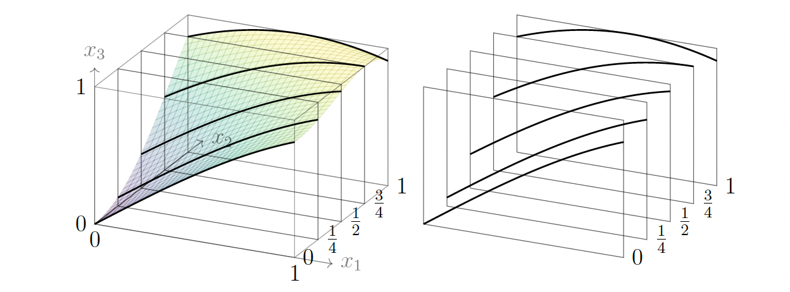

# Partial derivatives and contour plots

## Single-variable derivative review

The derivative of a function $f(x)$ at a point $x = c$ is written in one of the equivalent forms:

$$f'(c), \quad \frac{df}{dx}(c), \quad \left.\frac{df}{dx}\right|_{x=c}$$

It is convenient to think of the derivative as a function too. Thus we write $f'(x)$ or $\frac{df}{dx}$ for the function which assigns to every point $x$ the value $f'(x)$, the derivative of $f$ at $x$. This assumes that $f$ has a derivative at every point $x$.

We can have two different ways of thinking about derivatives: (i) they describe the sensitivity in the values of $f$ to small changes in the independent variable ($f(c + h) \approx f(c) + f'(c)h$ for $h$ near 0), and (ii) they are purely geometric quantities (slopes of tangent lines). Like so many ideas in mathematics, derivatives can be interpreted in many different ways.

For a real-valued function $f(x)$, the derivative at a point $x$ (denoted $f'(x)$ or $\frac{df}{dx}$) is defined as:

$$f'(x) = \lim_{h \to 0} \frac{f(x+h) - f(x)}{h}$$

### Local minima and local maxima

**Local minimum:** A point $c$ in the domain of $f$ is a **local minimum** of $f$ if there exists an open interval around $c$ such that $f(c) \leq f(x)$ for all $x$ in that interval. In other words, $f(c)$ is the smallest value of $f$ in some region containing $c$.

**Local maximum:** A point $c$ in the domain of $f$ is a **local maximum** of $f$ if there exists an open interval around $c$ such that $f(c) \geq f(x)$ for all $x$ in that interval. In other words, $f(c)$ is the largest value of $f$ in some region containing $c$.

Collectively, local minima and local maxima are called **local extrema**. If $f(x)$ is differentiable at every $x$, and if $x = c$ is a local maximum or local minimum for $f$, then $f'(c) = 0$. In other words, at such points the tangent line is horizontal, or alternatively (in terms of our other interpretation of the derivative) the value of $f(x)$ is insensitive (to first order) to small changes in $x$.

Keep in mind that the converse is false: $f'(c) = 0$ does **not** imply that $c$ is a local maximum or local minimum. For example, consider $f(x) = x^3$. We have $f'(x) = 3x^2$, so $f'(0) = 0$. But $x = 0$ is neither a local maximum nor a local minimum: for any small neighborhood around $0$, we have $f(x) < f(0) = 0$ when $x < 0$ and $f(x) > f(0) = 0$ when $x > 0$, so $f$ takes values both above and below $f(0)$ arbitrarily close to $0$. Such a point is called an **inflection point** (or, in the language of critical points, a *saddle point*). Thus $f'(c) = 0$ is a necessary condition for a local extremum at $c$, but not a sufficient one.

The figure below shows the graph of $f(x) = x^3$ over the interval $[-1, 1]$.

## Partial derivatives, a first look

The main idea for "partial" derivatives is to consider the function $f(x_1, x_2)$ as a collection of functions of one variable, which we can do in two different ways. Firstly, for each value $x_2 = b$, the function $f(x_1, b)$ is a function of one variable, and as we choose different values of $b$, we get different functions of $x_1$.

**Example:** Suppose $f(x_1, x_2) = \sin(x_1 + x_2^2)$. At $x_2 = 1$ the resulting function $f(x_1, 1)$ of one variable is $\sin(x_1 + 1)$. Likewise at $x_2 = 1/2$ it is $f(x_1, 1/2) = \sin(x_1 + 1/4)$, at $x_2 = 0$ it is $f(x_1, 0) = \sin(x_1)$, and so on. On the other hand, we could equally well think of $x_1$ as being equal to some fixed value $a$, and then consider the function of one variable $f(a, x_2)$. For $f(x_1, x_2) = \sin(x_1 + x_2^2)$, when $x_1 = 0$ we get $\sin(x_2^2)$, when $x_1 = 1$ we get $\sin(1 + x_2^2)$, and so on.

Let's interpret this visually via the graph of $f$ in $\mathbb{R}^3$: the set of points $(x_1, x_2, f(x_1, x_2))$. It is a surface in space whose height over $(x_1, x_2)$ is $f(x_1, x_2)$. If we set $x_2$ equal to some value, say $x_2 = 3$, then we are considering the function $f(x_1, 3)$; the graph of this function of one variable is where the graph of $f$ meets the vertical plane $x_2 = 3$. If we set $x_2$ equal to another value, say $x_2 = 4$, this corresponds to sliding the vertical plane over to $x_2 = 4$, which meets the graph of $f$ in a different curve. Thus we can think of the surface graph of $f$ as a collection of curves, each obtained where the surface meets a vertical plane $x_2 = b$. Algebraically we go from the function of two variables $f(x_1, x_2)$ to a collection of functions $f(x_1, b)$ of one variable, to which we can apply what we know from single-variable calculus. Geometrically, we think of the graph of $f$ as the collection of graphs of single-variable functions. Slicing the surface graph with the planes $x_1 = a$ in another direction could have been considered instead. That would correspond to working with the function $f(a, x_2)$ for various $a$.

The figure below shows the graph of $f(x_1, x_2)$ and its slices by the planes $x_2 = 0$, $x_2 = 1/4$, $x_2 = 1/2$, $x_2 = 3/4$, $x_2 = 1$ as the respective graphs of $f(x_1, 0)$, $f(x_1, 1/4)$, $f(x_1, 1/2)$, $f(x_1, 3/4)$, $f(x_1, 1)$.

### Definition of partial derivatives

The **partial derivative of $f$ with respect to $x_1$ at the point $(a, b)$**, denoted in any of the equivalent ways

$$\frac{\partial f}{\partial x_1}(a, b), \quad \left.\frac{\partial f}{\partial x_1}\right|_{(a,b)}, \quad f_{x_1}(a, b),$$

means the derivative of the function $f(x_1, b)$ at $x_1 = a$. Said differently, the partial derivative of $f$ with respect to $x_1$ at $(a, b)$ is the **instantaneous rate of change of $f$ at the point $(a, b)$ if we only move in the $x_1$-direction** (so $x_2$ is held constant at the value $b$). The formal definition is once again as a limit of difference quotients:

$$\frac{\partial f}{\partial x_1}(a, b) = \lim_{h \to 0} \frac{f(a + h, b) - f(a, b)}{h}.$$

We repeat for emphasis: $\partial f / \partial x_1$ entails **keeping $x_2$ constant**.

In precisely the same way, we can define the **partial derivative of $f$ with respect to $x_2$ at $(a, b)$**, denoted

$$\frac{\partial f}{\partial x_2}(a, b), \quad \left.\frac{\partial f}{\partial x_2}\right|_{(a,b)}, \quad f_{x_2}(a, b).$$

As above, the actual definition is the limit of difference quotients:

$$\frac{\partial f}{\partial x_2}(a, b) = \lim_{h \to 0} \frac{f(a, b + h) - f(a, b)}{h},$$

now varying the $x_2$-coordinate and holding $x_1$ fixed at the value $a$.

Just as for functions of one variable, we can think of partial derivatives in either of the two directions as new functions. Thus $\frac{\partial f}{\partial x_1}$ (or $f_{x_1}$) is the instantaneous rate of change of $f$ in the $x_1$-direction at any point $(x_1, x_2)$, and $\frac{\partial f}{\partial x_2}$ is the instantaneous rate of change of $f$ in the $x_2$-direction at any point $(x_1, x_2)$.

## Partial derivatives in $n$ variables, and two ways to compute them

If $f(x_1, \ldots, x_n)$ is a function of $n$ variables, then at the point $(a_1, \ldots, a_n)$ its **$i$th partial derivative**, or equivalently its partial derivative with respect to $x_i$ for any $i = 1, \ldots, n$, is denoted in any of the equivalent ways

$$f_{x_i}(a_1, \ldots, a_n), \quad \frac{\partial f}{\partial x_i}(a_1, \ldots, a_n), \quad \left.\frac{\partial f}{\partial x_i}\right|_{(a_1,\ldots,a_n)}.$$

It can be computed in two ways.

**Method 1 (symbolic):** Think of the $x_j$'s for $j \neq i$ as constant (without specifying their values) and apply the familiar single-variable differentiation rules in terms of $x_i$ to obtain the new function of $n$ variables, $f_{x_i}(x_1, \ldots, x_n)$. Then substitute $(a_1, \ldots, a_n)$ for $(x_1, \ldots, x_n)$ throughout.

**Method 2 (numerical):** Replace $x_j$ with $a_j$ in $f$ for every $j \neq i$, and then differentiate the resulting function $f(a_1, \ldots, a_{i-1}, x_i, a_{i+1}, \ldots, a_n)$ of one variable $x_i$ using the rules from single-variable calculus. Finally, after that, set $x_i = a_i$.

Why mention two methods which look almost identical? In practice one uses the symbolic method, but thinking in terms of the numerical method illuminates more vividly how partial derivatives are related to single-variable derivatives.