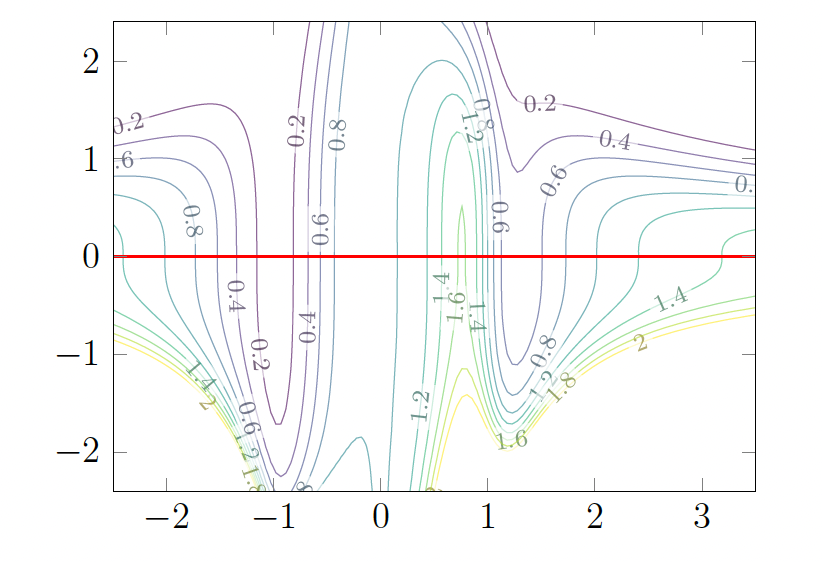

# Partial derivatives and contour plots

## Single-variable derivative review

The derivative of a function $f(x)$ at a point $x = c$ is written in one of the equivalent forms:

$$f'(c), \quad \frac{df}{dx}(c), \quad \left.\frac{df}{dx}\right|_{x=c}$$

It is convenient to think of the derivative as a function too. Thus we write $f'(x)$ or $\frac{df}{dx}$ for the function which assigns to every point $x$ the value $f'(x)$, the derivative of $f$ at $x$. This assumes that $f$ has a derivative at every point $x$.

We can have two different ways of thinking about derivatives: (i) they describe the sensitivity in the values of $f$ to small changes in the independent variable ($f(c + h) \approx f(c) + f'(c)h$ for $h$ near 0), and (ii) they are purely geometric quantities (slopes of tangent lines). Like so many ideas in mathematics, derivatives can be interpreted in many different ways.

For a real-valued function $f(x)$, the derivative at a point $x$ (denoted $f'(x)$ or $\frac{df}{dx}$) is defined as:

$$f'(x) = \lim_{h \to 0} \frac{f(x+h) - f(x)}{h}$$

### Local minima and local maxima

**Local minimum:** A point $c$ in the domain of $f$ is a **local minimum** of $f$ if there exists an open interval around $c$ such that $f(c) \leq f(x)$ for all $x$ in that interval. In other words, $f(c)$ is the smallest value of $f$ in some region containing $c$.

**Local maximum:** A point $c$ in the domain of $f$ is a **local maximum** of $f$ if there exists an open interval around $c$ such that $f(c) \geq f(x)$ for all $x$ in that interval. In other words, $f(c)$ is the largest value of $f$ in some region containing $c$.

Collectively, local minima and local maxima are called **local extrema**. If $f(x)$ is differentiable at every $x$, and if $x = c$ is a local maximum or local minimum for $f$, then $f'(c) = 0$. In other words, at such points the tangent line is horizontal, or alternatively (in terms of our other interpretation of the derivative) the value of $f(x)$ is insensitive (to first order) to small changes in $x$.

Keep in mind that the converse is false: $f'(c) = 0$ does **not** imply that $c$ is a local maximum or local minimum. For example, consider $f(x) = x^3$. We have $f'(x) = 3x^2$, so $f'(0) = 0$. But $x = 0$ is neither a local maximum nor a local minimum: for any small neighborhood around $0$, we have $f(x) < f(0) = 0$ when $x < 0$ and $f(x) > f(0) = 0$ when $x > 0$, so $f$ takes values both above and below $f(0)$ arbitrarily close to $0$. Such a point is called an **inflection point** (or, in the language of critical points, a *saddle point*). Thus $f'(c) = 0$ is a necessary condition for a local extremum at $c$, but not a sufficient one.

The figure below shows the graph of $f(x) = x^3$ over the interval $[-1, 1]$.

## Partial derivatives, a first look

The main idea for "partial" derivatives is to consider the function $f(x_1, x_2)$ as a collection of functions of one variable, which we can do in two different ways. Firstly, for each value $x_2 = b$, the function $f(x_1, b)$ is a function of one variable, and as we choose different values of $b$, we get different functions of $x_1$.

**Example:** Suppose $f(x_1, x_2) = \sin(x_1 + x_2^2)$. At $x_2 = 1$ the resulting function $f(x_1, 1)$ of one variable is $\sin(x_1 + 1)$. Likewise at $x_2 = 1/2$ it is $f(x_1, 1/2) = \sin(x_1 + 1/4)$, at $x_2 = 0$ it is $f(x_1, 0) = \sin(x_1)$, and so on. On the other hand, we could equally well think of $x_1$ as being equal to some fixed value $a$, and then consider the function of one variable $f(a, x_2)$. For $f(x_1, x_2) = \sin(x_1 + x_2^2)$, when $x_1 = 0$ we get $\sin(x_2^2)$, when $x_1 = 1$ we get $\sin(1 + x_2^2)$, and so on.

Let's interpret this visually via the graph of $f$ in $\mathbb{R}^3$: the set of points $(x_1, x_2, f(x_1, x_2))$. It is a surface in space whose height over $(x_1, x_2)$ is $f(x_1, x_2)$. If we set $x_2$ equal to some value, say $x_2 = 3$, then we are considering the function $f(x_1, 3)$; the graph of this function of one variable is where the graph of $f$ meets the vertical plane $x_2 = 3$. If we set $x_2$ equal to another value, say $x_2 = 4$, this corresponds to sliding the vertical plane over to $x_2 = 4$, which meets the graph of $f$ in a different curve. Thus we can think of the surface graph of $f$ as a collection of curves, each obtained where the surface meets a vertical plane $x_2 = b$. Algebraically we go from the function of two variables $f(x_1, x_2)$ to a collection of functions $f(x_1, b)$ of one variable, to which we can apply what we know from single-variable calculus. Geometrically, we think of the graph of $f$ as the collection of graphs of single-variable functions. Slicing the surface graph with the planes $x_1 = a$ in another direction could have been considered instead. That would correspond to working with the function $f(a, x_2)$ for various $a$.

The figure below shows the graph of $f(x_1, x_2)$ and its slices by the planes $x_2 = 0$, $x_2 = 1/4$, $x_2 = 1/2$, $x_2 = 3/4$, $x_2 = 1$ as the respective graphs of $f(x_1, 0)$, $f(x_1, 1/4)$, $f(x_1, 1/2)$, $f(x_1, 3/4)$, $f(x_1, 1)$.

### Definition of partial derivatives

The **partial derivative of $f$ with respect to $x_1$ at the point $(a, b)$**, denoted in any of the equivalent ways

$$\frac{\partial f}{\partial x_1}(a, b), \quad \left.\frac{\partial f}{\partial x_1}\right|_{(a,b)}, \quad f_{x_1}(a, b),$$

means the derivative of the function $f(x_1, b)$ at $x_1 = a$. Said differently, the partial derivative of $f$ with respect to $x_1$ at $(a, b)$ is the **instantaneous rate of change of $f$ at the point $(a, b)$ if we only move in the $x_1$-direction** (so $x_2$ is held constant at the value $b$). The formal definition is once again as a limit of difference quotients:

$$\frac{\partial f}{\partial x_1}(a, b) = \lim_{h \to 0} \frac{f(a + h, b) - f(a, b)}{h}.$$

We repeat for emphasis: $\partial f / \partial x_1$ entails **keeping $x_2$ constant**.

In precisely the same way, we can define the **partial derivative of $f$ with respect to $x_2$ at $(a, b)$**, denoted

$$\frac{\partial f}{\partial x_2}(a, b), \quad \left.\frac{\partial f}{\partial x_2}\right|_{(a,b)}, \quad f_{x_2}(a, b).$$

As above, the actual definition is the limit of difference quotients:

$$\frac{\partial f}{\partial x_2}(a, b) = \lim_{h \to 0} \frac{f(a, b + h) - f(a, b)}{h},$$

now varying the $x_2$-coordinate and holding $x_1$ fixed at the value $a$.

Just as for functions of one variable, we can think of partial derivatives in either of the two directions as new functions. Thus $\frac{\partial f}{\partial x_1}$ (or $f_{x_1}$) is the instantaneous rate of change of $f$ in the $x_1$-direction at any point $(x_1, x_2)$, and $\frac{\partial f}{\partial x_2}$ is the instantaneous rate of change of $f$ in the $x_2$-direction at any point $(x_1, x_2)$.

Just as for functions of one variable, there are however lots of functions that are not differentiable at some points. The simplest example is the function $f(x) = |x|$, which is not differentiable at $x = 0$. Likewise in the multivariable setting, the function $f(x_1, x_2) = |x_1 + x_2|$ does not admit a partial derivative $f_{x_1}$ or $f_{x_2}$ at $(0, 0)$ (that is, the limit defining such partial derivatives at $(0, 0)$ does not exist), and similarly at all points on the line where $x_1 + x_2 = 0$.

## Partial derivatives in $n$ variables, and two ways to compute them

If $f(x_1, \ldots, x_n)$ is a function of $n$ variables, then at the point $(a_1, \ldots, a_n)$ its **$i$th partial derivative**, or equivalently its partial derivative with respect to $x_i$ for any $i = 1, \ldots, n$, is denoted in any of the equivalent ways

$$f_{x_i}(a_1, \ldots, a_n), \quad \frac{\partial f}{\partial x_i}(a_1, \ldots, a_n), \quad \left.\frac{\partial f}{\partial x_i}\right|_{(a_1,\ldots,a_n)}.$$

It can be computed in two ways.

**Method 1 (symbolic):** Think of the $x_j$'s for $j \neq i$ as constant (without specifying their values) and apply the familiar single-variable differentiation rules in terms of $x_i$ to obtain the new function of $n$ variables, $f_{x_i}(x_1, \ldots, x_n)$. Then substitute $(a_1, \ldots, a_n)$ for $(x_1, \ldots, x_n)$ throughout.

**Method 2 (numerical):** Replace $x_j$ with $a_j$ in $f$ for every $j \neq i$, and then differentiate the resulting function $f(a_1, \ldots, a_{i-1}, x_i, a_{i+1}, \ldots, a_n)$ of one variable $x_i$ using the rules from single-variable calculus. Finally, after that, set $x_i = a_i$.

Why mention two methods which look almost identical? In practice one uses the symbolic method, but thinking in terms of the numerical method illuminates more vividly how partial derivatives are related to single-variable derivatives.

## Partial derivatives, graphically

Here is a contour plot (showing level sets at values in increments of 0.2) for a function $F(x, y)$ which may represent some experimental measurements (i.e., we may have no explicit formula for $F(x, y)$).

This contour plot is in the $xy$-plane, and the label on each curve indicates the $F$-value on that curve (in increments of 0.2).

Imagine that you are walking from west to east along the red line $y = 0$ in the above figure while on the surface graph $z = F(x, y)$. Let us analyze what you observe as you do this. The contour plot is a bird's-eye view of the graph $z = F(x, y)$: your path looks like a straight line from the bird's perspective, but as you walk along the line $y = 0$ the function $f(x) = F(x, 0)$ on this line varies in its values and the graph of $f(x)$ as shown in the figure below keeps track of elevation as one walks along the red line.

By definition the derivative $f'(x)$ of $f(x) = F(x, 0)$ is the partial derivative $\frac{\partial F}{\partial x}$ at $(x, 0)$.

Here are some observations:

- The regions where $f'(x) = \frac{\partial F}{\partial x}(x, 0)$ is **positive** are those where you are walking **uphill** in the contour plot above as you walk from west to east (i.e., where the labels $f(x) = F(x, 0)$ increase). For example, along the interval of $x$-values in $[-1, 0]$ (with $y = 0$) is all uphill.
- The regions where $f'(x) = \frac{\partial F}{\partial x}(x, 0)$ is **negative** are those where you are walking **downhill**, again as you walk from west to east. The region along $[-2, -1]$ is downhill.
- When the absolute value $|f'| = \left|\frac{\partial F}{\partial x}\right|$ is **large**, the path is very steep. For example, it seems dangerously steep at $x = 1$. Notice that the contours (shown at uniform increments, 0.2 in this case) are closer together near $x = 1$. On the other hand, when the slope is more gradual (i.e., $|f'| = \left|\frac{\partial F}{\partial x}\right|$ is near 0), the contour curves (shown at uniform increments) are further apart. For instance, the slope is more gradual near $x = 2$.
- At points where $f' = \frac{\partial F}{\partial x} = 0$, the path momentarily **flattens out** (in the $x$-direction): this occurs here in the valley near $x = -1$ and on the peak to the left of $x = 1$, and also presumably in the flat area at $x = 0$.

### Interpretation of partial derivatives on a contour plot

Visualize $F(x, y)$ as the height above $(x, y)$ on the surface graph $z = F(x, y)$, where $x$ is the east–west coordinate and $y$ is the north–south coordinate (so larger values of $x$ mean further east, and larger values of $y$ mean further north). Then:

- $\frac{\partial F}{\partial x}(a, b)$ equals the **slope** (instantaneous change in altitude) experienced by someone walking on the surface $z = F(x, y)$ just as they go past the point $(a, b)$ **from west to east**.
- $\frac{\partial F}{\partial y}(a, b)$ equals the **slope** (instantaneous change in altitude) experienced by someone walking on the surface $z = F(x, y)$ as they walk past the point $(a, b)$ **from south to north**.

As an example, if $\frac{\partial F}{\partial y}(0, 0) > 0$ then a northerly path on the surface $z = F(x, y)$ is going uphill as it passes over $(0, 0)$.

On a contour plot of the function $F(x, y)$, the partial derivatives can be interpreted as follows:

- The **sign** of $\frac{\partial F}{\partial x}(a, b)$ tells us whether the labels of the contours (which represent the values of $F$) are increasing or decreasing as we walk through $(a, b)$ from west to east.
- The **sign** of $\frac{\partial F}{\partial y}(a, b)$ tells us whether the values of $F$ on the contours are increasing or decreasing as we walk through $(a, b)$ from south to north.
- If $\frac{\partial F}{\partial x}(a_1, b_1) > \frac{\partial F}{\partial x}(a_2, b_2) > 0$, then in the $x$-direction the slope at $(a_1, b_1)$ is steeper than the slope at $(a_2, b_2)$, so the contours (when shown for uniform increments in $F$-values) are spaced closer together as we move east across $(a_1, b_1)$ than they are as we move east across $(a_2, b_2)$. There is a corresponding statement for negative $x$-partial derivatives (still moving east). The situation for $\frac{\partial F}{\partial y}$ can be described in very similar terms (for moving north).

## Second partial derivatives

There is a notion of "second derivative" for multivariable functions $f \colon \mathbb{R}^n \to \mathbb{R}$, defined similarly to the case of single-variable functions: we compute a **partial derivative of a partial derivative**. The new issue when $n > 1$ is that we have the freedom to choose **in which direction** to form each successive partial derivative.

As an example with $n = 2$, consider

$$f(x, y) = x^3 - 7x^2 y + 5y^4.$$

Note that $f_x = \frac{\partial f}{\partial x}$ is equal to $3x^2 - 14xy$ and $f_y = \frac{\partial f}{\partial y}$ is equal to $-7x^2 + 20y^3$. Now we have the following options for a second derivative: we can differentiate $f_x$ with respect to $x$ or with respect to $y$, or we can differentiate $f_y$ with respect to $x$ or with respect to $y$.

We introduce notation for all of these possibilities:

$$\frac{\partial^2 f}{\partial x^2} = \frac{\partial}{\partial x}\left(\frac{\partial f}{\partial x}\right) \quad \text{denotes the $x$-partial derivative of $f_x$};$$

$$\frac{\partial^2 f}{\partial y \, \partial x} = \frac{\partial}{\partial y}\left(\frac{\partial f}{\partial x}\right) \quad \text{denotes the $y$-partial derivative of $f_x$};$$

$$\frac{\partial^2 f}{\partial x \, \partial y} = \frac{\partial}{\partial x}\left(\frac{\partial f}{\partial y}\right) \quad \text{denotes the $x$-partial derivative of $f_y$};$$

$$\frac{\partial^2 f}{\partial y^2} = \frac{\partial}{\partial y}\left(\frac{\partial f}{\partial y}\right) \quad \text{denotes the $y$-partial derivative of $f_y$}.$$

### Theorem (Clairaut–Schwarz) 

Consider a function $f(x_1, \ldots, x_n)$ that is continuous, and for $1 \leq i, j \leq n$ suppose that the partial derivatives $\frac{\partial f}{\partial x_i}$ and $\frac{\partial f}{\partial x_j}$ as well as the second partial derivatives $\frac{\partial^2 f}{\partial x_i \, \partial x_j}$ and $\frac{\partial^2 f}{\partial x_j \, \partial x_i}$ exist and are continuous. Then the order of applying $\frac{\partial}{\partial x_i}$ and $\frac{\partial}{\partial x_j}$ to $f$ does not matter:

$$\frac{\partial^2 f}{\partial x_i \, \partial x_j} = \frac{\partial^2 f}{\partial x_j \, \partial x_i}.$$

Due to the equality, we often denote this second partial derivative by the notation $f_{x_i x_j}$ or $f_{x_j x_i}$.

For example, in the case of a 3-variable function $f(x, y, z)$, equality of mixed partials says that there are really only 6 possibly "different" second partial derivatives:

$$\frac{\partial^2 f}{\partial x^2}, \quad \frac{\partial^2 f}{\partial y^2}, \quad \frac{\partial^2 f}{\partial z^2}, \quad \frac{\partial^2 f}{\partial x \, \partial y} = \frac{\partial^2 f}{\partial y \, \partial x}, \quad \frac{\partial^2 f}{\partial x \, \partial z} = \frac{\partial^2 f}{\partial z \, \partial x}, \quad \frac{\partial^2 f}{\partial y \, \partial z} = \frac{\partial^2 f}{\partial z \, \partial y}.$$

**Note:** The equality can fail for somewhat peculiar $f(x, y)$ whose graph doesn’t look at all strange near the point where the equality breaks down.

## Exercises

**1.** Use partial derivatives to approximate the following values of the function $f(-1.2, 5)$, where $f(x_1, x_2) = \sqrt{x_1 + 2x_2^2}$.

**Solution** Use the linear approximation at a nearby point $(a, b)$ that is easy to evaluate:

$$f(x_1, x_2) \approx f(a, b) + \frac{\partial f}{\partial x_1}(a, b)(x_1 - a) + \frac{\partial f}{\partial x_2}(a, b)(x_2 - b).$$

In many multivariable calculus contexts, you might see this written more compactly using the gradient ($\nabla$) and vectors:

$$f(\mathbf{x}) \approx f(\mathbf{a}) + \nabla f(\mathbf{a}) \cdot (\mathbf{x} - \mathbf{a})$$

$\mathbf{x} = (x_1, x_2)$, $\mathbf{a} = (a, b)$, and

$$\nabla f(\mathbf{a}) = \left\langle \frac{\partial f}{\partial x_1}(\mathbf{a}), \frac{\partial f}{\partial x_2}(\mathbf{a}) \right\rangle$$

Take $(a, b) = (-1, 5)$. Then $f(-1, 5) = \sqrt{-1 + 2(25)} = \sqrt{49} = 7$.

The partial derivatives of $f(x_1, x_2) = (x_1 + 2x_2^2)^{1/2}$ are:

$$\frac{\partial f}{\partial x_1} = \frac{1}{2}(x_1 + 2x_2^2)^{-1/2} = \frac{1}{2\sqrt{x_1 + 2x_2^2}}, \qquad \frac{\partial f}{\partial x_2} = \frac{2x_2}{\sqrt{x_1 + 2x_2^2}}$$

At $(-1, 5)$ we have $\sqrt{x_1 + 2x_2^2} = 7$, so $\frac{\partial f}{\partial x_1}(-1, 5) = \frac{1}{14}$ and $\frac{\partial f}{\partial x_2}(-1, 5) = \frac{10}{7}$

$$f(-1.2, 5) \approx f(-1, 5) + \frac{\partial f}{\partial x_1}(-1, 5)(-1.2 - (-1)) + \frac{\partial f}{\partial x_2}(-1, 5)(5 - 5) = 7 + \frac{1}{14}(-0.2) + 0 = 7 - \frac{1}{70} = \frac{489}{70}$$

