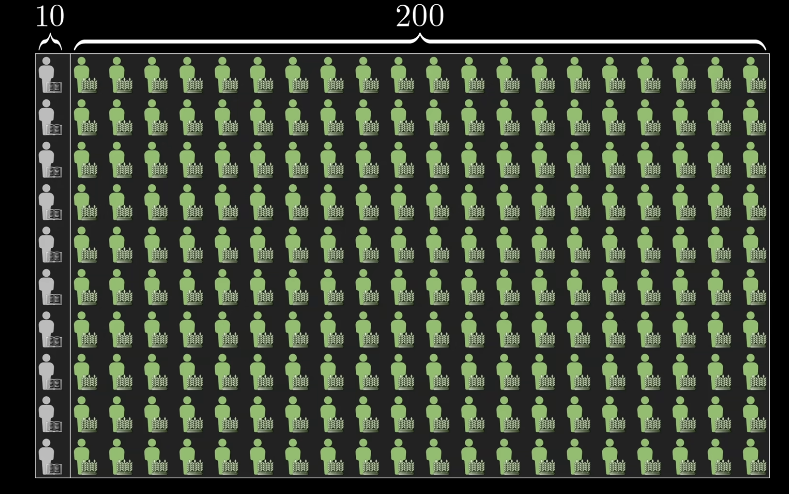
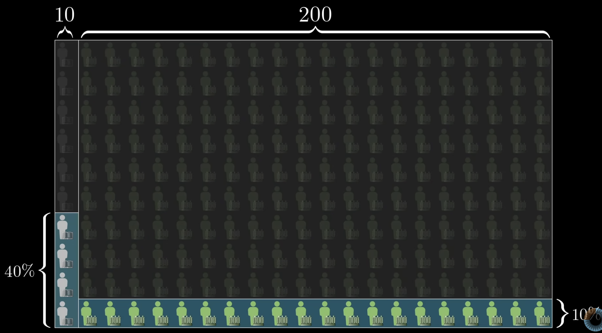
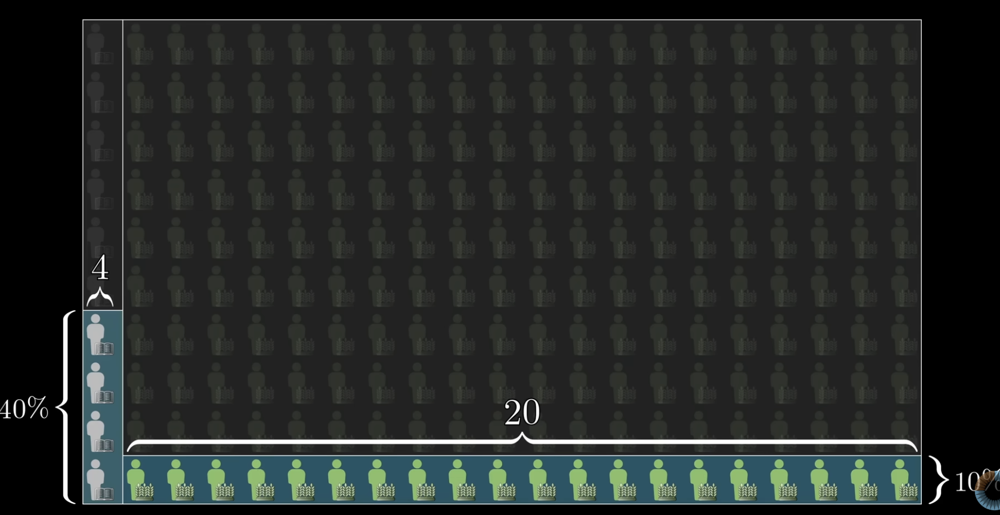
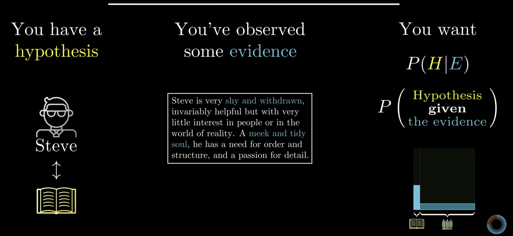
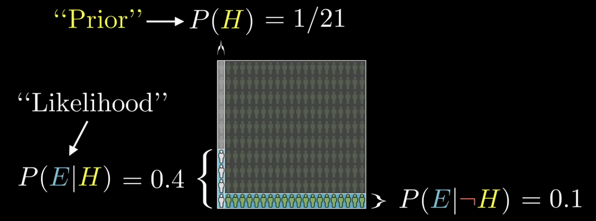
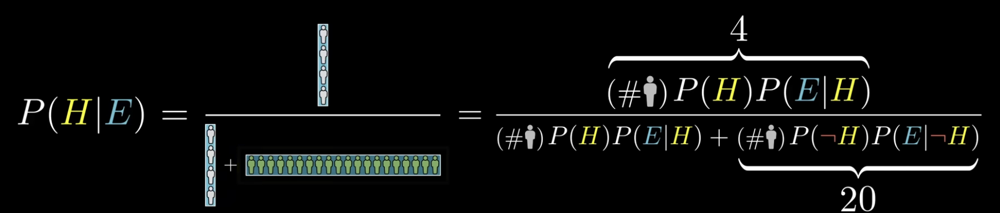
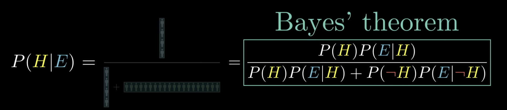
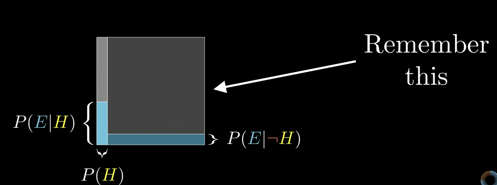
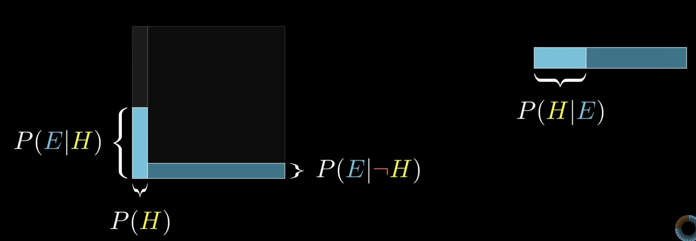
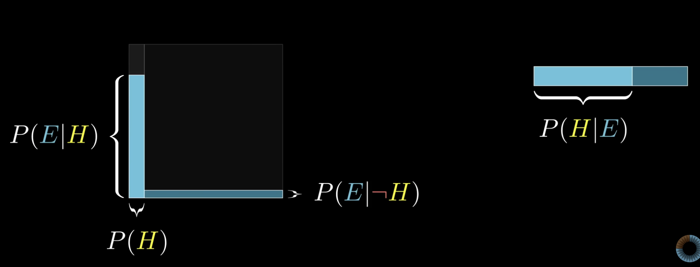

# Bayes' Rule

Before dissecting the formula or explaining the picture that makes it obvious, picture a man named Steve. The description that follows merits close attention.

"Steve is very shy and withdrawn, invariably helpful but with very little interest in people or the world of reality. A meek and tidy soul, he has a need for order and structure, and a passion for detail."

Which seems more likely: Steve is a librarian, or Steve is a farmer?

Some readers may recognize this as an example from a study conducted by the psychologists Daniel Kahneman and Amos Tversky.

Their work was a big deal: it won a Nobel Prize, and it has been popularized many times over in books such as Kahneman's *Thinking, Fast and Slow* and Michael Lewis's *The Undoing Project*.

What they researched was human judgment, with a frequent focus on when those judgments irrationally contradict what the laws of probability suggest they should be.

According to Kahneman and Tversky, after people are given this description of Steve as a meek and tidy soul, most say he is more likely to be a librarian. After all, these traits line up better with the stereotypical view of a librarian than with that of a farmer. And according to Kahneman and Tversky, this is irrational.

The point is not whether people hold correct or biased views about the personalities of librarians and farmers; it is that almost nobody thinks to incorporate information about the ratio of farmers to librarians in their judgments.

Let $L$ and $F$ denote the events that a randomly chosen person (in the reference population Kahneman and Tversky had in mind) is a librarian or a farmer.
They report roughly

$$\frac{P(F)}{P(L)} \approx \frac{20}{1}.$$

The numbers we could find more recently put that ratio much higher, but we stick with the $20$-to-$1$ figure, since it is a little easier to illustrate and it still makes the point.

To be clear, anyone who is asked this question is not expected to have perfect information about the actual statistics of farmers and librarians and their personality traits. The question is whether people even think to consider that ratio enough to at least make a rough estimate. Rationality is not about knowing facts; it is about recognizing which facts are relevant.

If we do think to make that estimate, there is a pretty simple way to reason about the question.
Picture a representative sample of farmers and librarians, say $200$ farmers and $10$ librarians, for a total of

$$N = 200 + 10 = 210.$$

The same labels are reused for Steve: $L$ is the event “Steve is a librarian” and $F$ is the event “Steve is a farmer.”
In the toy population,

$$P(L) = \frac{10}{210} = \frac{1}{21}, \qquad P(F) = \frac{200}{210} = \frac{20}{21}.$$

The “meek and tidy soul” wording is modeled as evidence $E$.
The illustration uses informal estimates that $40\%$ of librarians would fit that description and $10\%$ of farmers would:

$$P(E \mid L) = \frac{2}{5}, \qquad P(E \mid F) = \frac{1}{10}.$$

Then, among the $N = 210$ people, the counts are

$$\begin{aligned}
N \, P(L) \, P(E \mid L) &= 10 \cdot \frac{2}{5} = 4, \\
N \, P(F) \, P(E \mid F) &= 200 \cdot \frac{1}{10} = 20.
\end{aligned}$$

Restricting attention to people who fit the description, the probability that a randomly chosen one is a librarian is

$$P(L \mid E) = \frac{4}{4 + 20} = \frac{4}{24} = \frac{1}{6} \approx 0.167.$$

The **likelihood ratio** for $E$ comparing $L$ to $F$ is

$$\frac{P(E \mid L)}{P(E \mid F)} = \frac{2/5}{1/10} = 4,$$

whereas the **prior odds** of farmer to librarian are

$$\frac{P(F)}{P(L)} = \frac{20/21}{1/21} = 20.$$

So the evidence favors $L$ by a factor of $4$, but the base rates favor $F$ by a factor of $20$; the posterior still ends up favoring $F$.

**Key insight:** New evidence does not assign beliefs in a vacuum; it **updates** a prior.

In a Bayesian update, $H$ is a **hypothesis** (for example, “Steve is a librarian”) and $E$ is **evidence** (the verbal description). The target quantity is $P(H \mid E)$.

The probability $P(H)$ **before** seeing $E$ is called the **prior**.

In the Steve example, $P(H) = P(L) = \frac{1}{21}$ from the population ratio.

The factor $P(E \mid H)$ is the probability of the evidence if $H$ holds; in the example $P(E \mid L) = \frac{2}{5}$.

In Bayes' theorem this factor is called the **likelihood** (more precisely, the likelihood *term* associated with $H$).

Write $H^{c}$ for the complement of $H$ (“not $H$”).
The complementary likelihood $P(E \mid H^{c})$ is also needed; in the example, with $H = L$ and $H^{c} = F$, we have $P(E \mid F) = \frac{1}{10}$.

!!! note "Theorem (Bayes' rule, two hypotheses)"
    Let $H$ be an event with $0 < P(H) < 1$ and write $H^{c}$ for its complement.
    Suppose $P(E) > 0$.
    Then

    $$P(H \mid E) = \frac{P(E \mid H) \, P(H)}{P(E \mid H) \, P(H) + P(E \mid H^{c}) \, P(H^{c})}.$$

    Equivalently, **Bayes' rule in compact form** is

    $$P(H \mid E) = \frac{P(E \mid H) \, P(H)}{P(E)}.$$

    The denominator is the **law of total probability** for $E$:

    $$\begin{aligned}
    P(E) &= P(E \cap H) + P(E \cap H^{c}) \\
    &= P(E \mid H) \, P(H) + P(E \mid H^{c}) \, P(H^{c}).
    \end{aligned}$$

    In applications, $\{H, H^{c}\}$ is a **partition** of the relevant uncertainty: mutually exclusive and exhaustive for the purpose of the update.

The updated probability $P(H \mid E)$ is called the **posterior**.

In the Steve illustration, $P(E) = \frac{24}{210} = \frac{4}{35}$.
In practice, $P(E)$ is almost always computed by expanding into the “$H$ true” and “$H$ false” pieces as above.

An area diagram is a distilled version of reasoning with a representative sample: we think with **areas** instead of counts, which is easier to sketch on the fly.

Fix the sample size $N = 210$ only for intuition; more generally, picture the space of all possibilities as a $1 \times 1$ square.

Any event corresponds to a subset of that square, and its probability is the **area** of that subset.
We can picture $H$ as occupying a strip of width $P(H)$ on the left.

