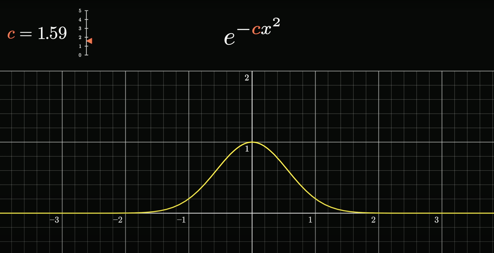
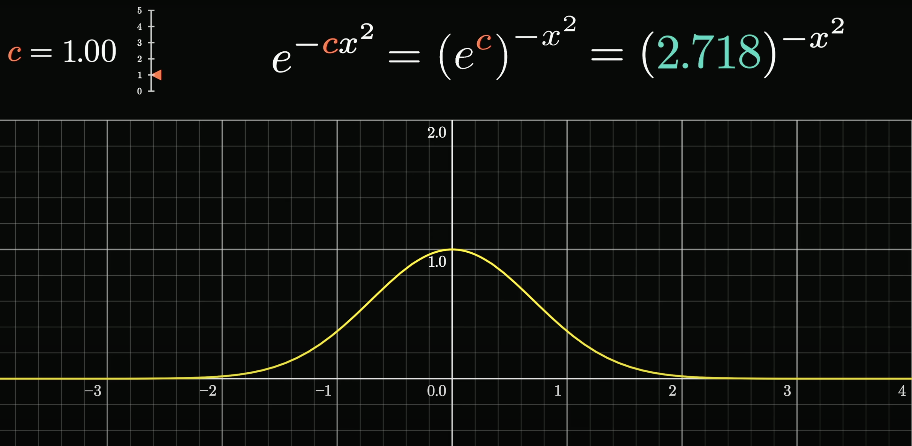

# Central Limit Theorem

## A simplified Galton Board

This is a Galton board. Maybe you've seen one before— it's a popular demonstration of how, even when a single event is chaotic and random with an effectively unknowable outcome, it's still possible to make precise statements about a large number of events, namely how the relative proportions for many different outcomes are distributed.

Let's take a model version of this. 

In this model, we will assume that each ball falls directly onto a certain central peg and that it has a 50-50 probability of bouncing to the left or to the right. 

We'll think of each of those outcomes as either adding one or subtracting one from its position. Once one of those is chosen, we make the highly unrealistic assumption that it happens to land dead center on the peg adjacent below it, where again it'll be faced with the same 50-50 choice of bouncing to the left or to the right.

Here, there are five different rows of pegs, so the little hopping ball makes five different random choices between plus one and minus one. 

We can think of its final position as basically being the sum of all of those different numbers, which in this case happens to be one.

We might label all of the different buckets with the sum that they represent. As we repeat this, we're looking at different possible sums for those five random numbers.

Let it be emphasized that the goal right now is not to accurately model physics— the goal is to give a simple example to illustrate the central limit theorem. For that purpose, idealized though this might be, it actually provides a really good example.

If we let many different balls fall, making yet another unrealistic assumption that they don't influence each other (as if they're all ghosts), then the number of balls that fall into each different bucket gives us some loose sense for how likely each one of those buckets is.

In this example, the numbers are simple enough that it's not too hard to explicitly calculate what the probability is for falling into each bucket. If you do want to think that through, you'll find it very reminiscent of Pascal's triangle.

The basic idea of the central limit theorem is that if you increase the size of that sum (for example, here would mean increasing the number of rows of pegs for each ball to bounce off), then the distribution that describes where that sum is going to fall looks more and more like a bell curve.

## The general idea

It's actually worth taking a moment to write down that general idea. 

The setup is that we have a random variable. We'll call that random number $X$. What we're doing is taking multiple different samples of that variable $X$ (or we could take different random variables that do the exact same thing, like $X1$, $X2$,.. that are independent and are the exact same function, i.e., identical) and adding them all together. On our Galton board, that looks like letting the ball bounce off multiple different pegs on its way down to the bottom, and in the case of a die, you might imagine rolling many different dice and adding up the results. The claim of the central limit theorem is that as you let the size of that sum get bigger and bigger, then the distribution of that sum, how likely it is to fall into different possible values, will look more and more like a bell curve. That's it- that is the general idea.

## Dice simulations

Usually if you think of rolling a die, you think of the six outcomes as being equally probable, but the theorem actually doesn't care about that. We could start with a weighted die, something with a non-trivial distribution across the outcomes, and the core idea still holds.

To better illustrate what the central limit theorem is all about, let's run four of these simulations in parallel, where on the upper left we're doing it where we're only adding two dice at a time, on the upper right we're doing it where we're adding five dice at a time, the lower left is the one that we just saw adding 10 dice at a time, and then we'll do another one with a bigger sum, 15 at a time.

Notice how on the upper left when we're just adding two dice, the resulting distribution doesn't really look like a bell curve— it looks a lot more reminiscent of the one we started with, skewed towards the left. But as we allow for more and more dice in each sum, the resulting shape that comes up in these distributions looks more and more symmetric. It has the lump in the middle and fade towards the tails shape of a bell curve.

And let it be emphasized again: you can start with any different distribution.

Illustrating things with a simulation like this is very fun, and it's kind of neat to see order emerge from chaos, but it also feels a little imprecise. How many samples do we need before we can be sure that what we're looking at is representative of the true distribution?

## The true distributions for sums

Let's get a little more theoretical and show the precise shape these distributions will take on in the long run. The easiest case to make this calculation is if we have a uniform distribution, where each possible face of the die has an equal probability, 1/6th.

For example, if you then want to know how likely different sums are for a pair of dice, it's essentially a counting game, where you count up how many distinct pairs take on the same sum, which in the diagram drawn, you can conveniently think about by going through all the different diagonals. Since each such pair has an equal chance of showing up, 1 in 36, all you have to do is count the sizes of these buckets.

That gives us a definitive shape for the distribution describing a sum of two dice, and if we were to play the same game with all possible triplets, the resulting distribution would look like this. 

Now what's more challenging, but a lot more interesting, is to ask what happens if we have a non-uniform distribution for that single die. 

So just to be crystal clear on what's being represented here: if you imagine sampling two different values from that top distribution, the one describing a single die, and adding them together, then the second distribution being drawn represents how likely you are to see various different sums (this is equivalent to the [convolution](convolution.md) of the die's probability mass function with itself). Likewise, if you imagine sampling three distinct values from that top distribution, and adding them together, the next plot represents the probabilities for various different sums in that case. 

So if we compute what the distributions for these sums look like for larger and larger sums, it looks more and more like a bell curve.

But before we get to that, let's make a couple of simple observations. For example, these distributions seem to be wandering to the right, and also they seem to be getting more spread out, and a little bit more flat. You cannot describe the central limit theorem quantitatively without taking into account both of those effects, which in turn requires describing the mean and the standard deviation.

## Mean, variance, and standard deviation

Looking back at our sequence of distributions, let's talk about the mean and standard deviation. If we call the mean of the initial distribution mu, which for the one illustrated happens to be 2.24, hopefully it won't be too surprising if it's said that the mean of the next one is 2 times mu. That is, you roll a pair of dice, you want to know the expected value of the sum, it's two times the expected value for a single die. Similarly, the expected value for our sum of size 3 is 3 times mu, and so on and so forth. The mean just marches steadily on to the right, which is why our distributions seem to be drifting off in that direction.

A little more challenging, but very important, is to describe how the standard deviation changes. The key fact here is that if you have two different random variables, then the variance for the sum of those variables is the same as just adding together the original two variances. The main thing to highlight is how it's the variance that adds— it's not the standard deviation that adds. 

So, critically, if you were to take n different realizations of the same random variable and ask what the sum looks like, the variance of sum is n times the variance of your original variable, meaning the standard deviation, the square root of all this, is the square root of n times the original standard deviation.

For example, back in our sequence of distributions, if we label the standard deviation of our initial one with sigma, then the next standard deviation is going to be the square root of 2 times sigma, and after that it looks like the square root of 3 times sigma, and so on and so forth.

This, as mentioned, is very important. It means that even though our distributions are getting spread out, they're not spreading out all that quickly— they only do so in proportion to the square root of the size of the sum.

As we prepare to make a more quantitative description of the central limit theorem, the core intuition to keep in your head is that we'll basically realign all of these distributions so that their means line up together, and then rescale them so that all of the standard deviations are just going to be equal to one. 

And when we do that, the shape that results gets closer and closer to a certain universal shape, described with an elegant little function that we'll unpack in just a moment.

And let it be said one more time: the real magic here is how we could have started with any distribution, describing a single roll of the die, and if we play the same game, considering what the distributions for the many different sums look like, and we realign them so that the means line up, and we rescale them so that the standard deviations are all one, we still approach that same universal shape, which is kind of mind-boggling.

## Unpacking the Gaussian formula

The function e to the x, or anything to the x, describes exponential growth, and if you make that exponent negative, which flips around the graph horizontally, you might think of it as describing exponential decay. 

To make this decay in both directions, you could do something to make sure the exponent is always negative and growing, like taking the negative absolute value. 

That would give us this kind of awkward sharp point in the middle, but if instead you make that exponent the negative square of x, you get a smoother version of the same thing, which decays in both directions.

This gives us the basic bell curve shape. Now if you throw a constant in front of that x, and you scale that constant up and down, it lets you stretch and squish the graph horizontally, allowing you to describe narrow and wider bell curves.

And a quick thing to point out here is that based on the rules of exponentiation, as we tweak around that constant c, you could also think about it as simply changing the base of the exponentiation.

And in that sense, the number e is not really all that special for our formula. We could replace it with any other positive constant, and you'll get the same family of curves as we tweak that constant. Make it a 2, same family of curves. Make it a 3, same family of curves. The reason we use e is that it gives that constant a very readable meaning.

Or rather, if we reconfigure things a little bit so that the exponent looks like negative 1/2 times x divided by a certain constant, which we'll suggestively call sigma squared, then once we turn this into a probability distribution, that constant sigma will be the standard deviation of that distribution. And that's very nice.

But before we can interpret this as a probability distribution, we need the area under the curve to be 1.

As it stands with the basic bell curve shape of e to the negative x squared, the area is not 1, it's actually the square root of pi.

For our purposes right now, all it means is that we should divide this function by the square root of pi, and it gives us the area we want. 

Throwing back in the constants we had earlier, the one half and the sigma, the effect there is to stretch out the graph by a factor of sigma times the square root of 2. 

So we also need to divide out by that in order to make sure it has an area of 1, and combining those fractions, the factor out front looks like 1 divided by sigma times the square root of 2 pi.

This, finally, is a valid probability distribution. As we tweak that value sigma, resulting in narrower and wider curves, that constant in the front always guarantees that the area equals 1. 

The special case where sigma equals 1 has a specific name— we call it the standard normal distribution.

And all possible normal distributions are not only parameterized with this value sigma, but we also subtract off another constant mu from the variable x, and this essentially just lets you slide the graph left and right so that you can prescribe the mean of this distribution. 

So in short, we have two parameters, one describing the mean, one describing the standard deviation, and they're all tied together in this big formula involving an e and a pi.

Let's look back again at the idea of starting with some random variable and asking what the distributions for sums of that variable look like. When you increase the size of that sum, the resulting distribution will shift according to a growing mean, and it slowly spreads out according to a growing standard deviation. 

And putting some actual formulas to it, if we know the mean of our underlying random variable, we call it mu, and we also know its standard deviation, and we call it sigma, then the mean for the sum on the bottom will be mu times the size of the sum, and the standard deviation will be sigma times the square root of that size.

So now, if we want to claim that this looks more and more like a bell curve, and a bell curve is only described by two different parameters, the mean and the standard deviation, you know what to do. You could plug those two values into the formula, and it gives you a highly explicit, albeit kind of complicated, formula for a curve that should closely fit our distribution.

## Formal Definition

Before stating the formal definition of the Central Limit Theorem, it's important to understand what **i.i.d.** means. This stands for "independent and identically distributed" and refers to a collection of random variables that satisfy two key properties:

1. **Independent**: The outcome of one variable doesn't influence the outcome of any other variable

2. **Identically distributed**: All variables follow the same probability distribution

In our dice example, each die roll is independent of the others, and each die follows the same distribution (whether fair or weighted), making the sequence of die rolls i.i.d.

Now, let $X_1, X_2, X_3, \ldots$ be i.i.d. random variables with mean $\mu$ and variance $\sigma^2$. Here, $\mu$ and $\sigma$ describe the underlying distribution that each individual $X_i$ follows:

- $\mu = E[X_i]$ is the **expected value** (mean) of any single random variable $X_i$

- $\sigma^2 = \text{Var}(X_i)$ is the **variance** of any single random variable $X_i$

- $\sigma = \sqrt{\sigma^2}$ is the **standard deviation** of any single random variable $X_i$

For example, if we're rolling a fair die, then $\mu = 3.5$ and $\sigma = 1.71$. These are the mean and standard deviation of a single die roll.

The **sample mean** $\bar{X}_n$ is defined as:

$$\bar{X}_n = \frac{1}{n}\sum_{i=1}^n X_i = \frac{X_1 + X_2 + \cdots + X_n}{n}$$

This represents the average of the first $n$ observations. For example, if we roll a die 100 times and get outcomes $X_1, X_2, \ldots, X_{100}$, then $\bar{X}_{100}$ would be the average of those 100 die rolls.

The CLT states that for large $n$, the distribution of $\bar{X}_n$ after standardization approaches a standard normal distribution. By standardization, we mean that we subtract $\mu$ (the mean of any random variable $X_i$) and divide by $\sigma/\sqrt{n}$ (the standard deviation of the sample mean $\bar{X}_n$).

**Theorem (Central Limit Theorem):** As $n \to \infty$,

$$\sqrt{n} \cdot \frac{\bar{X}_n - \mu}{\sigma} \to N(0, 1) \text{ in distribution}$$

This means that the standardized sample mean converges in distribution to a standard normal random variable as the sample size grows large.