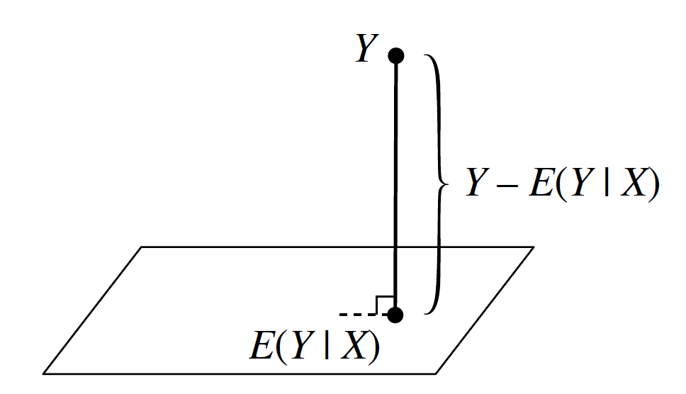

# Conditional Expectation

## The Two Envelope Paradox

The two envelope paradox is a famous probability puzzle that challenges our intuition about conditional expectation and reveals subtle issues in reasoning about random variables.

You are given two envelopes. One contains twice as much money as the other. You pick one envelope at random, open it, and see that it contains $X. You are then given the choice to either:

1. Keep the envelope you have (containing $X)
2. Switch to the other envelope

**The question**: Should you switch?

At first glance, it seems like switching should be beneficial.

The other envelope contains either $X/2 or $2X, each with probability 1/2. The expected value of switching is:

$$E[\text{other envelope}] = \frac{1}{2} \cdot \frac{X}{2} + \frac{1}{2} \cdot 2X = \frac{X}{4} + X = \frac{5X}{4}$$

Since $\frac{5X}{4} > X$, you should always switch!

**The paradox**: This reasoning suggests you should always switch, regardless of which envelope you initially chose. But this is clearly wrong- if you always switch, you're back to a 50-50 choice!

The error lies in assuming that the other envelope contains $X/2$ or $2X$ with equal probability 1/2.

Let's be more careful about the random variables involved.

Let $A$ be the amount in the first envelope, and $2A$ be the amount in the second envelope. The envelopes are chosen randomly, so:

- $P(\text{you pick first}) = \frac{1}{2}$

- $P(\text{you pick second}) = \frac{1}{2}$

**Case 1**: You picked the first envelope (contains $A$)

- The other envelope contains $2A$

- If you switch, you gain $A$

**Case 2**: You picked the second envelope (contains $2A$)

- The other envelope contains $A$

- If you switch, you lose $A$

**Expected gain from switching**:

$$E[\text{gain from switching}] = \frac{1}{2} \cdot A + \frac{1}{2} \cdot (-A) = 0$$

**Conclusion**: There is no expected gain from switching. The correct strategy is to be indifferent between keeping and switching.

The original reasoning made a subtle error by treating $X$ as if it were independent of which envelope you chose. But $X$ is not independent- it depends on whether you picked the first or second envelope.

## Definition of Conditional Expectation

Conditional expectation is the expected value of a random variable given that we know the value of another random variable. It's a fundamental concept in probability theory that allows us to make predictions based on partial information.

### Discrete Case

For discrete random variables $X$ and $Y$, the conditional expectation of $X$ given $Y = y$ is:

$$E[X | Y = y] = \sum_x x \cdot P(X = x | Y = y) = \sum_x x \cdot \frac{P(X = x, Y = y)}{P(Y = y)}$$

**Key properties:**

- $E[X | Y = y]$ is a function of $y$

- It represents the average value of $X$ when we know $Y = y$

- If $X$ and $Y$ are independent, then $E[X | Y = y] = E[X]$ for all $y$

### Continuous Case

For continuous random variables $X$ and $Y$ with joint density $f_{X,Y}(x,y)$ and marginal density $f_Y(y)$, the conditional expectation of $X$ given $Y = y$ is:

$$E[X | Y = y] = \int_{-\infty}^{\infty} x \cdot f_{X|Y}(x|y) \, dx = \int_{-\infty}^{\infty} x \cdot \frac{f_{X,Y}(x,y)}{f_Y(y)} \, dx$$

where $f_{X|Y}(x|y) = \frac{f_{X,Y}(x,y)}{f_Y(y)}$ is the conditional density of $X$ given $Y = y$.

## The Random Variable $E[X | Y]$ and its intuitive meaning

Conditional expectation is itself a random variable! We write $E[X | Y]$ to denote the random variable that takes the value $E[X | Y = y]$ when $Y = y$.

Conditional expectation answers the question: "What is the average value of $X$ when we know that $Y$ takes a specific value?"

**Example**: If $X$ is your test score and $Y$ is the number of hours you studied:

- $E[X | Y = 0]$ = average test score for students who didn't study

- $E[X | Y = 10]$ = average test score for students who studied 10 hours

- $E[X | Y]$ = a function that tells you the expected test score for any amount of study time

**Example**: Let $X \sim N(0, 1)$ and $Y = X^2$. What is $E[Y | X]$?

Since $Y = X^2$, when we know the value of $X$, we know exactly what $Y$ is. Therefore:

$$E[Y | X = x] = E[X^2 | X = x] = E[x^2 | X = x] = x^2$$

This makes intuitive sense: if we know $X = x$, then we know $Y = x^2$ with certainty, so the expected value of $Y$ given $X = x$ is simply $x^2$.

**Key insight**: When $Y$ is a function of $X$, the conditional expectation $E[Y | X]$ is just that function evaluated at $X$. In this case, $E[Y | X] = X^2$.

It's important to distinguish between $X^2$ and $x^2$. **$X^2$** is a **random variable**- it represents the square of the random variable $X$. Since $X$ can take different values, $X^2$ can also take different values. **$x^2$** is a **specific number** - it's the square of a particular observed value $x$ of the random variable $X$.

**In our example:**

- $X \sim N(0,1)$ - $X$ is a random variable that can take any real value

- $X^2$ - This is also a random variable (the square of $X$)

- $x$ - This is a specific observed value of $X$ (like $x = 1.5$ or $x = -0.3$)

- $x^2$ - This is the square of that specific value (like $1.5^2 = 2.25$ or $(-0.3)^2 = 0.09$)

When we write $E[Y | X = x]$, we're asking: "What's the expected value of $Y$ given that $X$ takes the specific value $x$?" Since $Y = X^2$, when $X = x$, we know $Y = x^2$ (a specific number). So $E[Y | X = x] = E[x^2 | X = x] = x^2$

Now let's compute $E[X | Y]$ for the same example. This is more interesting because knowing $Y = y$ doesn't completely determine $X$- there are two possible values of $X$ that give $Y = y$.

If $Y = y$, then $X = \pm\sqrt{y}$ (since $Y = X^2$).

Since $X \sim N(0,1)$ is symmetric about 0, both $+\sqrt{y}$ and $-\sqrt{y}$ are equally likely when $Y = y$.

$$E[X | Y = y] = \sqrt{y} \cdot P(X = \sqrt{y} | Y = y) + (-\sqrt{y}) \cdot P(X = -\sqrt{y} | Y = y)$$

Since $X \sim N(0,1)$ is symmetric about 0:

- $P(X = \sqrt{y}) = P(X = -\sqrt{y})$ (by symmetry)

- Therefore: $P(X = \sqrt{y} | Y = y) = P(X = -\sqrt{y} | Y = y)$

Since these are the only two possibilities when $Y = y$, and they're equal:

$$P(X = \sqrt{y} | Y = y) = P(X = -\sqrt{y} | Y = y) = \frac{1}{2}$$

When we condition on $Y = y$, we're essentially asking: "Given that $X^2 = y$, what's the probability that $X = \sqrt{y}$ vs $X = -\sqrt{y}$?"

Since the normal distribution is symmetric about 0, the probability density at $+\sqrt{y}$ is exactly the same as the probability density at $-\sqrt{y}$. When we condition on $Y = y$, we're restricting ourselves to these two equally likely points.

$$E[X | Y = y] = \sqrt{y} \cdot \frac{1}{2} + (-\sqrt{y}) \cdot \frac{1}{2} = \frac{\sqrt{y} - \sqrt{y}}{2} = 0$$

**Result**: $E[X | Y = y] = 0$ for all $y > 0$.

**Key insight**: Even though knowing $Y$ gives us information about the magnitude of $X$ (since $|X| = \sqrt{Y}$), it doesn't give us information about the sign of $X$. Due to the symmetry of the normal distribution, the positive and negative values cancel out, giving an expected value of 0.

**Example:** Let's consider a more complex example involving continuous random variables and uniform distributions.

We have a stick of length $L$.
**First break**: Break the stick at a point $Y$ chosen uniformly at random along its length. This means $Y \sim \text{Uniform}(0, L)$.
**Second break**: Take the remaining piece of the stick (which has length $Y$) and break it at a point $X$ chosen uniformly at random along this remaining length.

**Question**: What is $E[X | Y]$?

Given that $Y = y$, we know:

- The remaining piece has length $y$

- $X$ is chosen uniformly at random from $[0, y]$

- Therefore: $X | Y = y \sim \text{Uniform}(0, y)$

For a uniform distribution on $[0, y]$, the expected value is the midpoint:

$$E[X | Y = y] = \frac{0 + y}{2} = \frac{y}{2}$$

**Result**: $E[X | Y] = \frac{Y}{2}$

This makes perfect sense! If we know the remaining piece has length $y$, then the expected position of the second break is exactly in the middle of that piece, which is $\frac{y}{2}$.

Let's verify this:

**Step 1**: Find $E[X]$ directly

- $Y \sim \text{Uniform}(0, L)$, so $E[Y] = \frac{L}{2}$

- $E[X] = E[E[X | Y]] = E\left[\frac{Y}{2}\right] = \frac{E[Y]}{2} = \frac{L}{4}$ (we will prove later why $E[X] = E[E[X | Y]] = E\left[\frac{Y}{2}\right]$, but it is a property)

**Step 2**: Find $E[X]$ using the joint distribution

- Calculate the joint density

$$f_{X,Y}(x,y) = f_{X|Y}(x|y) \cdot f_Y(y) = \frac{1}{y} \cdot \frac{1}{L} = \frac{1}{Ly}$$

The joint density of $(X, Y)$ is $f_{X,Y}(x,y) = \frac{1}{Ly}$ for $0 \leq x \leq y \leq L$

- $E[X] = \int_0^L \int_0^y x \cdot \frac{1}{Ly} \, dx \, dy = \int_0^L \frac{y}{2L} \, dy = \frac{L}{4}$

Both methods give the same result, confirming our calculation is correct.

## General Properties

**1. Taking out what's known**

One of the most important properties of conditional expectation is the ability to "take out what's known":

$$E[h(X)Y | X] = h(X)E[Y | X]$$

where $h(X)$ is any function of $X$.

**Intuitive explanation**: If we know the value of $X$, then $h(X)$ is just a constant (not random), so we can factor it out of the conditional expectation.

**Proof for discrete case**:

$$E[h(X)Y | X = x] = \sum_y h(x) \cdot y \cdot P(Y = y | X = x) = h(x) \sum_y y \cdot P(Y = y | X = x) = h(x)E[Y | X = x]$$

**Proof for continuous case**:

$$E[h(X)Y | X = x] = \int_{-\infty}^{\infty} h(x) \cdot y \cdot f_{Y|X}(y|x) \, dy = h(x) \int_{-\infty}^{\infty} y \cdot f_{Y|X}(y|x) \, dy = h(x)E[Y | X = x]$$

**Examples**:

- $E[X^2Y | X] = X^2E[Y | X]$ (since $X^2$ is a function of $X$)

- $E[\sin(X)Y | X] = \sin(X)E[Y | X]$ (since $\sin(X)$ is a function of $X$)

- $E[3Y | X] = 3E[Y | X]$ (since 3 is a constant function of $X$)

**2. Independence property**

If $X$ and $Y$ are independent, then:

$$E[Y | X] = E[Y]$$

**Intuitive explanation**: If $X$ and $Y$ are independent, then knowing the value of $X$ provides no information about $Y$. Therefore, the conditional expectation of $Y$ given $X$ is the same as the unconditional expectation of $Y$.

**Proof for discrete case**:

$$E[Y | X = x] = \sum_y y \cdot P(Y = y | X = x) = \sum_y y \cdot P(Y = y) = E[Y]$$

where the second equality uses the fact that $P(Y = y | X = x) = P(Y = y)$ when $X$ and $Y$ are independent.

**Proof for continuous case**:

$$E[Y | X = x] = \int_{-\infty}^{\infty} y \cdot f_{Y|X}(y|x) \, dy = \int_{-\infty}^{\infty} y \cdot f_Y(y) \, dy = E[Y]$$

where the second equality uses the fact that $f_{Y|X}(y|x) = f_Y(y)$ when $X$ and $Y$ are independent.

**Examples**:

- If $X \sim N(0,1)$ and $Y \sim N(0,1)$ are independent, then $E[Y | X] = E[Y] = 0$

- If $X$ is the number of heads in 10 coin flips and $Y$ is the temperature tomorrow, and they're independent, then $E[Y | X] = E[Y]$

**3. Iterated expectation (Adam's Law)**

The expectation of a conditional expectation equals the original expectation:

$$E[E[Y | X]] = E[Y]$$

**Proof for discrete case**:

$$E[E[Y | X]] = \sum_x E[Y | X = x] \cdot P(X = x) = \sum_x \left(\sum_y y \cdot P(Y = y | X = x)\right) \cdot P(X = x)$$

$$= \sum_x \sum_y y \cdot P(Y = y | X = x) \cdot P(X = x) = \sum_x \sum_y y \cdot P(X = x, Y = y) = \sum_y y \cdot P(Y = y) = E[Y]$$

**Proof for continuous case**:

$$E[E[Y | X]] = \int_{-\infty}^{\infty} E[Y | X = x] \cdot f_X(x) \, dx = \int_{-\infty}^{\infty} \left(\int_{-\infty}^{\infty} y \cdot f_{Y|X}(y|x) \, dy\right) f_X(x) \, dx$$

$$= \int_{-\infty}^{\infty} \int_{-\infty}^{\infty} y \cdot f_{Y|X}(y|x) f_X(x) \, dy \, dx = \int_{-\infty}^{\infty} \int_{-\infty}^{\infty} y \cdot f_{X,Y}(x,y) \, dy \, dx = E[Y]$$

**Examples**:

- In our stick-breaking example: $E[E[X | Y]] = E\left[\frac{Y}{2}\right] = \frac{E[Y]}{2} = \frac{L}{4} = E[X]$

- If $Y$ is test score and $X$ is study hours: $E[E[Y | X]] = E[Y]$ (the average test score across all students)

**Why this matters**: This property is fundamental to many probability calculations. It allows us to compute expectations by first conditioning on another variable, then taking the expectation of the conditional expectation. It's often easier to compute $E[Y | X]$ first, then take its expectation, rather than computing $E[Y]$ directly.

**4. Residual property**

$$E[(Y - E[Y | X])h(X)] = 0$$

**Proof**:

$$E[(Y - E[Y | X])h(X)] = E[Y \cdot h(X) - E[Y | X] \cdot h(X)]$$

$$= E[Y \cdot h(X)] - E[E[Y | X] \cdot h(X)]$$

$$= E[Y \cdot h(X)] - E[h(X) \cdot E[Y | X]]$$

Now, using the "taking out what's known" property:

$$E[h(X) \cdot E[Y | X]] = E[h(X) \cdot E[Y | X]] = E[E[h(X) \cdot Y | X]] = E[h(X) \cdot Y]$$

Therefore:

$$E[(Y - E[Y | X])h(X)] = E[Y \cdot h(X)] - E[h(X) \cdot Y] = 0$$

**Correlation interpretation**:

Since $E[(Y - E[Y | X])h(X)] = 0$, we have:

$$\text{Cov}(Y - E[Y | X], h(X)) = E[(Y - E[Y | X])h(X)] - E[Y - E[Y | X]] \cdot E[h(X)] = 0 - 0 \cdot E[h(X)] = 0$$

This shows that the residual $Y - E[Y | X]$ is uncorrelated with any function $h(X)$ of $X$.

**Intuitive explanation**: The residual $Y - E[Y | X]$ represents the part of $Y$ that cannot be predicted from $X$. Since we've already extracted all the information that $X$ can provide about $Y$ (in the form of $E[Y | X]$), the remaining part should be uncorrelated with any function of $X$.

**Examples**:

- $E[(Y - E[Y | X])X] = 0$ (residual is uncorrelated with $X$)

- $E[(Y - E[Y | X])X^2] = 0$ (residual is uncorrelated with $X^2$)

- $E[(Y - E[Y | X])\sin(X)] = 0$ (residual is uncorrelated with $\sin(X)$)

**Geometric interpretation (Projection)**: The conditional expectation $E[Y | X]$ is the projection of $Y$ onto the space of all functions of $X$, shown below as a plane. This is because in a certain sense, $E[Y | X]$ is the function of $X$ that is closest to $Y$; we say that $E[Y | X]$ is the projection of $Y$ into the space of all functions of $X$.The residual $Y - E[Y | X]$ is orthogonal to the plane: it's perpendicular to (uncorrelated with) any function of $X$.

 The "line" from $Y$ to $E[Y | X]$ in the figure is orthogonal (perpendicular) to the "plane", since any other route from $Y$ to $E[Y | X]$ would be longer. This orthogonality turns out to be the geometric interpretation of the residual property.

## Conditional Expectation as the Best Predictor

We can think of $E[Y | X]$ as a prediction for $Y$ based on $X$. This is an extremely common problem in statistics: predict or estimate the future observations or unknown parameters based on data. The projection interpretation of conditional expectation implies that $E[Y | X]$ is the best predictor of $Y$ based on $X$, in the sense that it is the function of $X$ with the lowest mean squared error (expected squared difference between $Y$ and the prediction of $Y$).

**Mathematical statement**: For any function $g(X)$ of $X$:

$$E[(Y - E[Y | X])^2] \leq E[(Y - g(X))^2]$$

**Proof**: Let $g(X)$ be any function of $X$. Then:

$$E[(Y - g(X))^2] = E[(Y - E[Y | X] + E[Y | X] - g(X))^2]$$

$$= E[(Y - E[Y | X])^2] + E[(E[Y | X] - g(X))^2] + 2E[(Y - E[Y | X])(E[Y | X] - g(X))]$$

The cross term is zero because $E[Y | X] - g(X)$ is a function of $X$, and we know that $Y - E[Y | X]$ is uncorrelated with any function of $X$. Therefore:

$$E[(Y - g(X))^2] = E[(Y - E[Y | X])^2] + E[(E[Y | X] - g(X))^2] \geq E[(Y - E[Y | X])^2]$$

The equality holds if and only if $g(X) = E[Y | X]$ (almost surely).

**Why this matters**: This shows that conditional expectation is not just a convenient mathematical tool, but the optimal predictor in the mean squared error sense. This is why it's so fundamental to statistics, machine learning, and any field that involves prediction.

### Case study: Linear Regression

An extremely widely used method for data analysis in statistics is linear regression. In its most basic form, the linear regression model uses a single explanatory variable $X$ to predict a response variable $Y$, and it assumes that the conditional expectation of $Y$ is linear in $X$:

$$E[Y | X] = a + bX$$

**Show that an equivalent way to express this is to write**

$$Y = a + bX + \epsilon$$

where $\epsilon$ is an r.v. (called the error) with $E[\epsilon | X] = 0$.

**Solution**: Let $Y = a + bX + \epsilon$, with $E[\epsilon | X] = 0$. Then by linearity:

$$E[Y | X] = E[a | X] + E[bX | X] + E[\epsilon | X] = a + bX$$

Conversely, suppose that $E[Y | X] = a + bX$, and define:

$$\epsilon = Y - (a + bX)$$

Then $Y = a + bX + \epsilon$, with:

$$E[\epsilon | X] = E[Y | X] - E[a + bX | X] = E[Y | X] - (a + bX) = 0$$