# Continuous Distributions

## A friendly introduction

Suppose we have a biased coin and denote the unknown probability of heads by $h$.

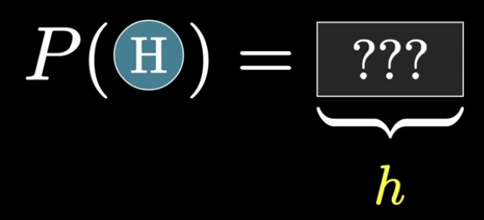

What we observe is a sequence of flips; the question is how to learn $h$ from that data.

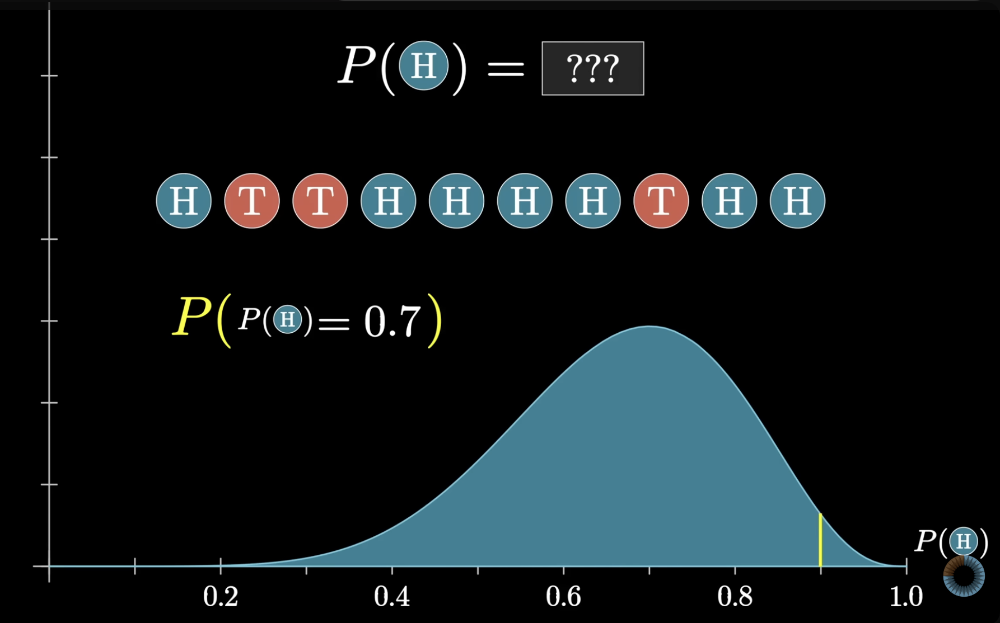

This page continues the thread in [Probabilities of Probabilities](probabilities_of_probabilities.md), where an unknown success rate $S \in [0,1]$ (such as a seller’s review rate) is modeled with a $L(S)$.

The parameter $h$ can be any number in the closed interval $[0,1]$— from always tails ($h=0$) through fair coins to always heads ($h=1$).

If we try to assign a probability to one **exact** value, such as $h = 0.7$ (as opposed to $h = 0.7000001$ or any nearby value), we run into trouble.

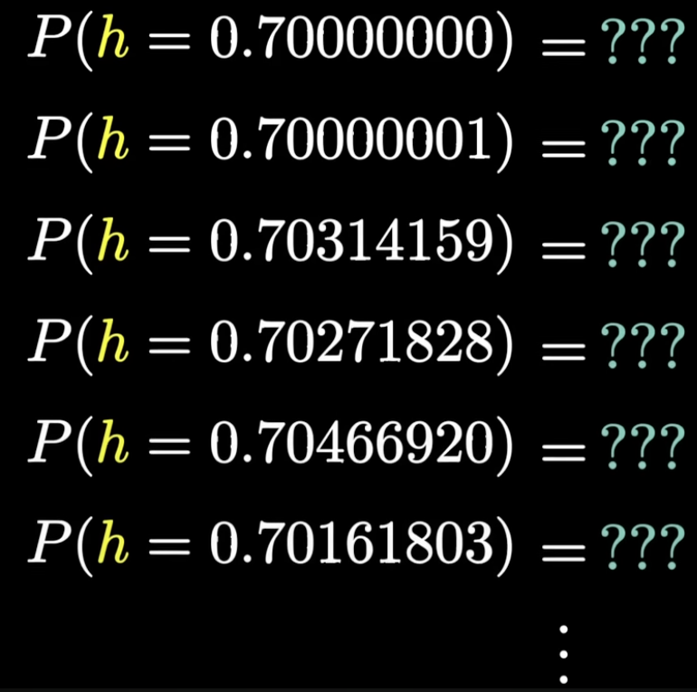

There are **uncountably many** possible values of $h$ in $[0,1]$. 

If every point carried the same positive probability $\varepsilon > 0$, then summing over all of them would give infinite total mass, which cannot be a valid probability distribution.

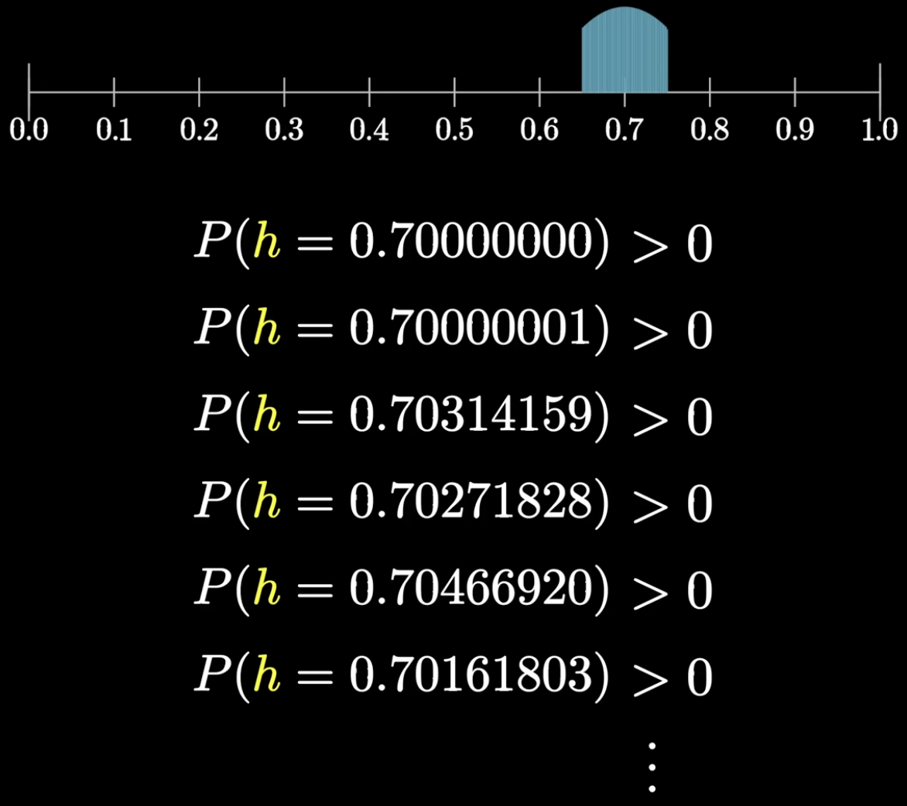
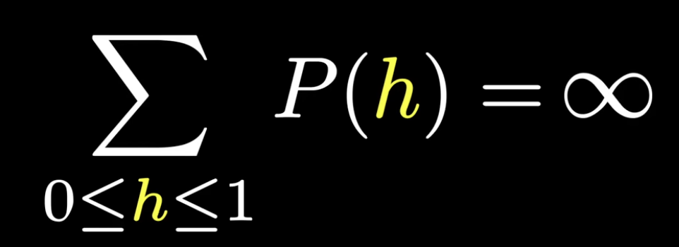

On the other hand, if $P(h = x) = 0$ for **every** $x$, then we learn nothing about the coin, and any countable-style “sum” of point masses would be $0$, not $1$. Yet $h$ must be **somewhere** in $[0,1]$, so something must account for the full unit of probability.

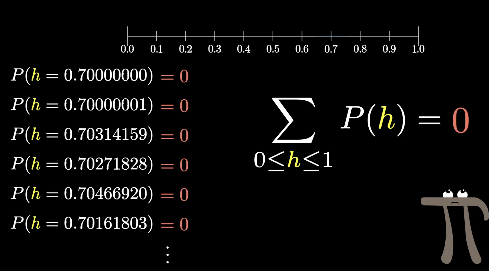

The resolution is to stop asking for probabilities of **individual** values and instead assign probabilities to **ranges** of $h$.

For example, we might ask for

$$P(0.8 \leq h \leq 0.85),$$

or partition $[0,1]$ into coarse bins and record the probability that $h$ falls in each bin.

**Crucial convention**: represent probability by the **area** of each bin, not by the height of the bar alone.

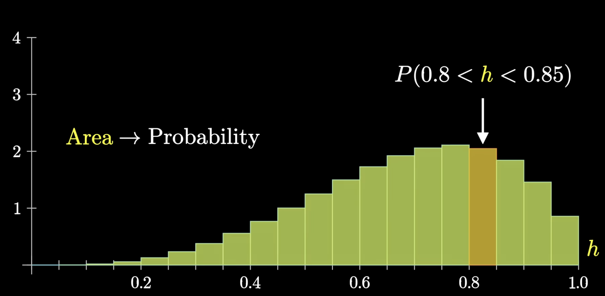

If we refine the partition into thinner bins, the probability of landing in any **single** bin shrinks because the bin width shrinks.

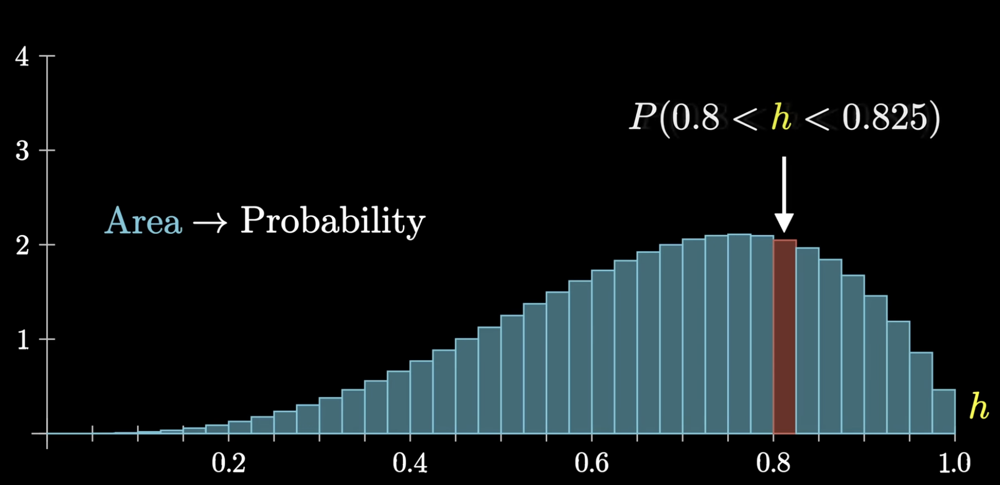
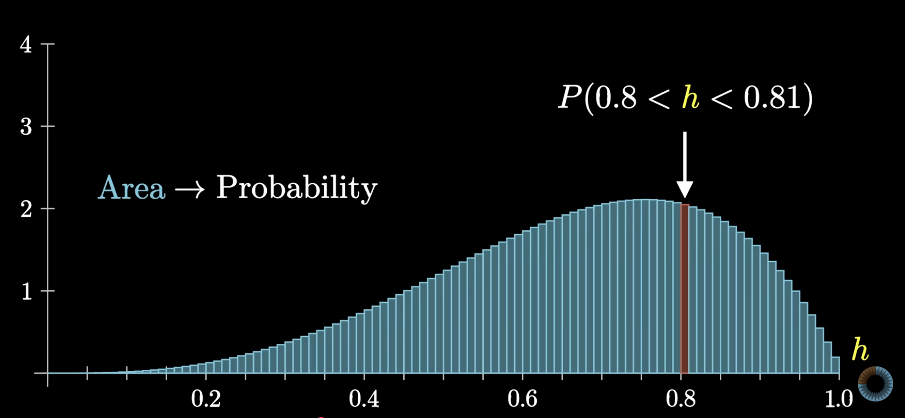
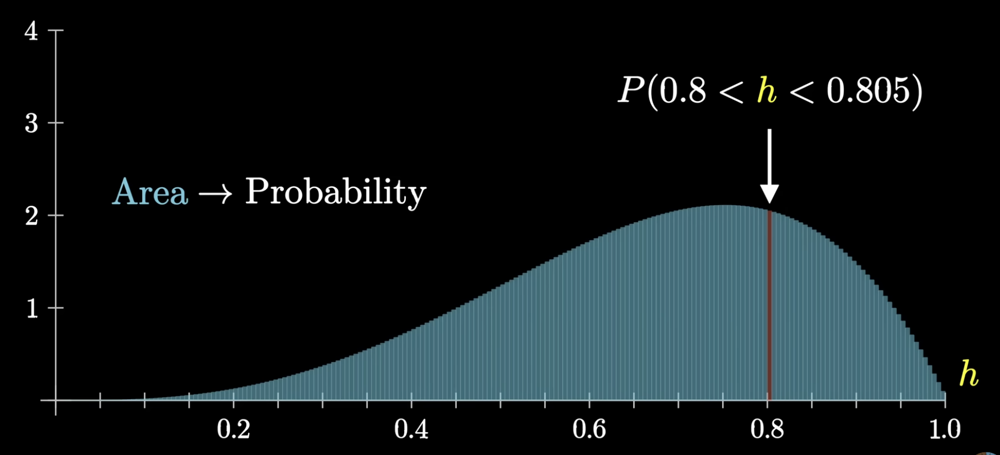

In a sensible construction, the **heights** stay roughly stable while the widths decrease, so the outline of the distribution approaches a **smooth curve** in the limit.

Individual bin probabilities go to $0$, but the **shape** of the distribution is preserved and sharpened.

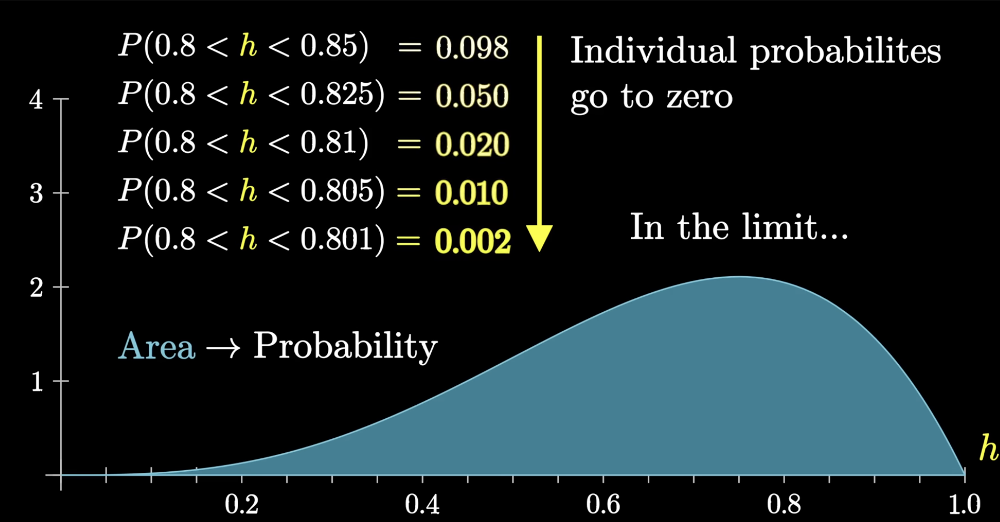

If instead we had let **height** equal probability, every bar would shrink to zero height as bins narrow, and the limit would be a flat, uninformative line. Letting **area** carry probability fixes that failure mode.

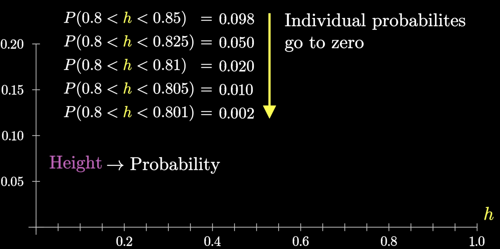
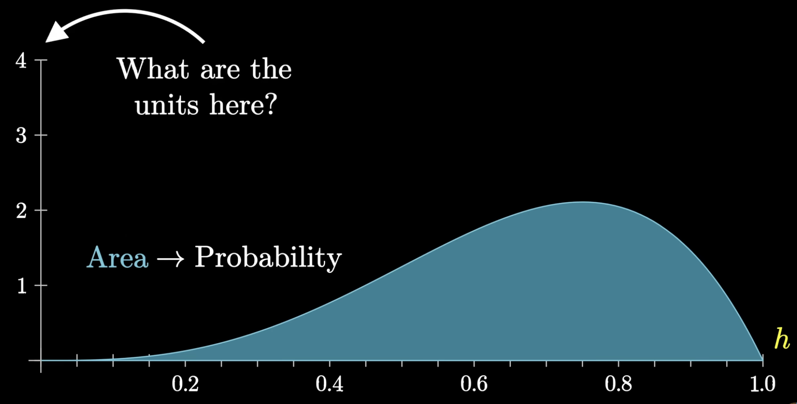

Since probability lives in area, and $\text{area} = \text{width} \times \text{height}$, the vertical axis measures **probability per unit** along the $h$-axis.
That quantity is the **probability density** $f(h)$: informally, “probability per unit length” in the continuous case.

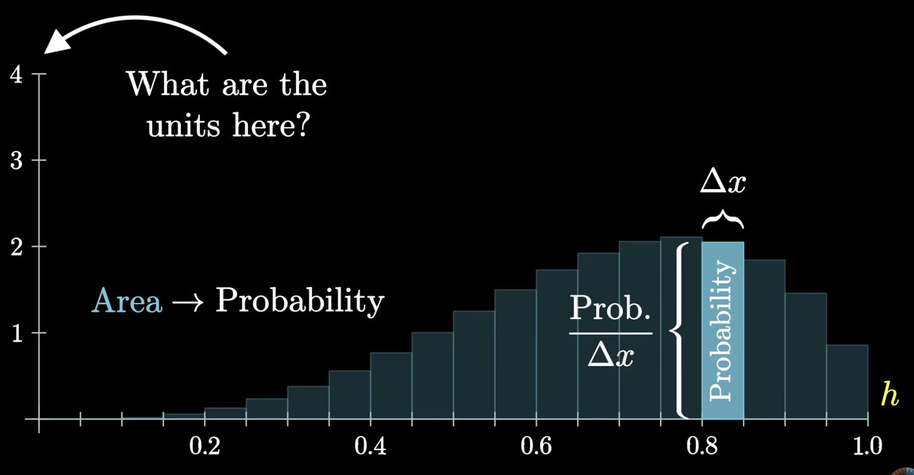
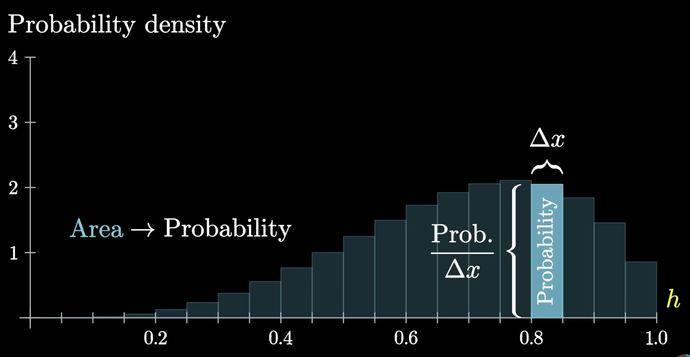

At every stage of refinement, the **total area** under the histogram must be $1$, as for any valid probability distribution.

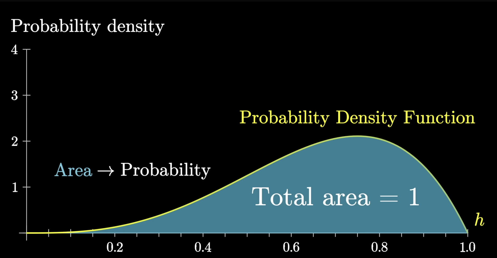

As the partition becomes infinitely fine, we may attach a **probability density** to each point even though $P(h = x) = 0$ for every single $x$.
The resulting object is a **probability density function (PDF)** $f_H(h)$ on $[0,1]$.

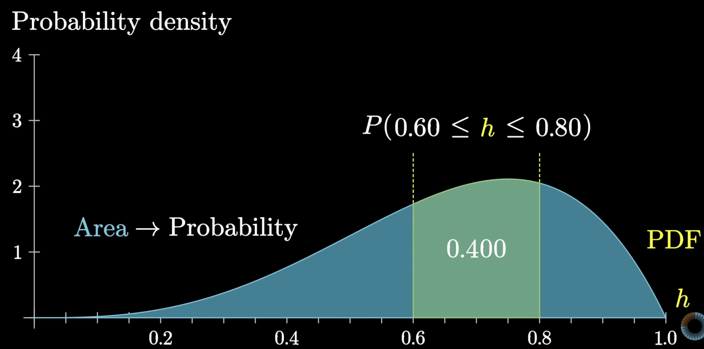

**How to read a PDF**: for any interval $[a,b]$,

$$P(a \leq H \leq b) = \int_a^b f_H(h)\, dh,$$

the area under the density curve between $a$ and $b$.
In particular,

$$P(H = 0.7) = \int_{0.7}^{0.7} f_H(h)\, dh = 0$$

(an interval of length $0$ has zero area), 

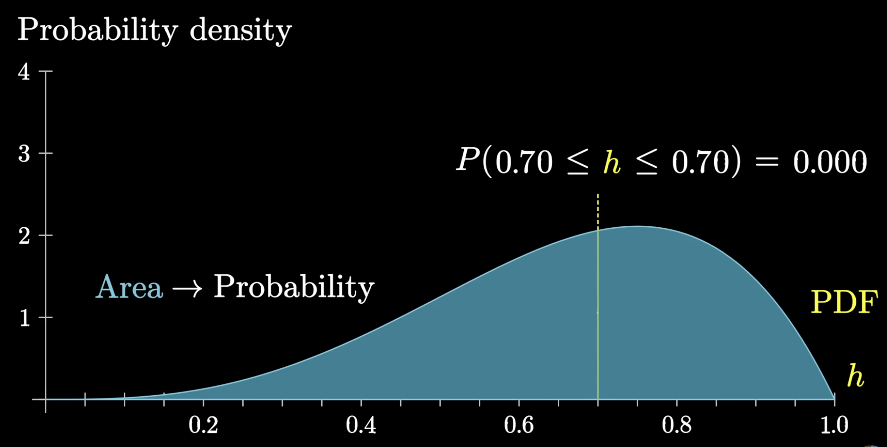

while

$$\int_0^1 f_H(h)\, dh = 1.$$

The “paradox” is sidestepped: point probabilities are not the primitive objects; **range probabilities** are.

In a finite discrete setting (a die, a deck of cards), $P(X \in A) = \sum_{x \in A} P(X = x)$—a sum of point masses.
That intuition extends to **countably** infinite sample spaces.
For a **continuum**, the rules change: $P(X \in [a,b])$ is defined first (via an integral against a density), and a single value $x$ is meaningful only as the degenerate interval $[x,x]$ of width $0$.

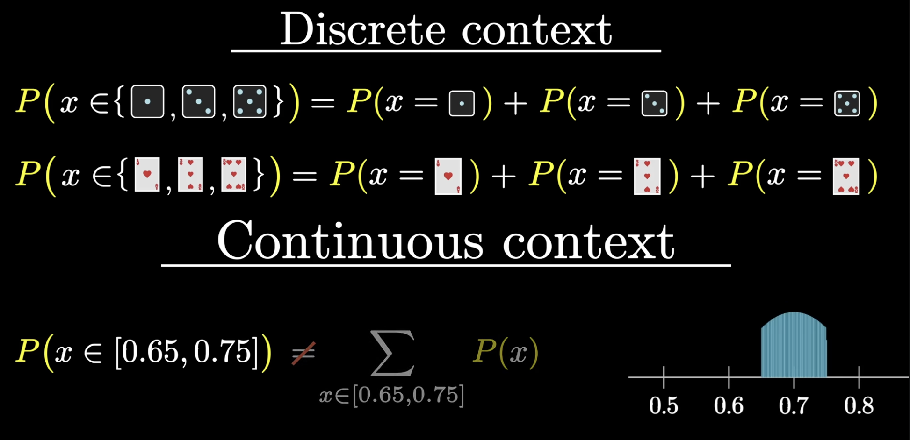

It's a pretty common rule of thumb that if you find yourself using a sum in a discrete context, then use an 
integral in the continuous context, which is the tool from calculus that we use to find areas under curves.

### Finding $f(h \mid \text{data})$ with Bayes' rule

Returning to the biased coin: we observe $n$ flips with $k$ heads and want beliefs about $h$ **after** seeing the data.
The same structure appears in [Probabilities of Probabilities](probabilities_of_probabilities.md) with a success rate $S$; here we write $h$, but the mathematics is identical.

We need two ingredients.

**1. $P(\text{data} \mid h)$ (from the binomial model).**
Treat the flips as $n$ independent Bernoulli trials with success probability $h$.
If the data are exactly $k$ heads and $n-k$ tails.

$$L(h) = P(\text{data} \mid h) = \binom{n}{k} h^{k}(1-h)^{n-k}, \qquad h \in [0,1].$$

This is the same function we plotted as $L(S)$ in the earlier page: probability of the **observed** outcomes as a function of the unknown rate.

**2. Prior PDF $f_H(h)$ **on** $[0,1]$.**
Before seeing flips, we describe uncertainty about $h$ by a **prior density** $f_H(h) \geq 0$ with

$$\int_0^1 f_H(h)\, dh = 1.$$

For example, with no preference across $[0,1]$, we might take the **uniform** prior $f_H(h) = 1$ on $[0,1]$.
A different prior PDF encodes different initial beliefs.

**Bayes' rule in continuous form** (see also [Bayes' Rule](bayes_rule.md)): the **posterior density** $f_{H \mid \text{data}}(h)$ satisfies

$$f_{H \mid \text{data}}(h) = \frac{L(h)\, f_H(h)}{P(\text{data})}, \qquad h \in [0,1],$$

where the **normalizing constant** is an integral instead of a sum:

$$P(\text{data}) = \int_0^1 L(h)\, f_H(h)\, dh.$$

The posterior is the prior times $L(h)$, then scaled so the total area is $1$.
In symbols, $f_{H \mid \text{data}}(h) \propto L(h)\, f_H(h)$.

Once $f_{H \mid \text{data}}$ is known, we answer questions about **ranges** of $h$, for example

$$P(0.6 \leq H \leq 0.8 \mid \text{data}) = \int_{0.6}^{0.8} f_{H \mid \text{data}}(h)\, dh.$$

**Key insight**: $P(h = 0.7 \mid \text{data}) = 0$ for a single point, but $P(0.65 \leq H \leq 0.75 \mid \text{data})$ can be positive and informative.
The PDF $f_{H \mid \text{data}}$ is the continuous replacement for a posterior table over $h$.

### Is $L(h)$ a probability distribution?

**No.** $L(h) = P(\text{data} \mid h)$ is a **likelihood function** (as a function of $h$ with the data fixed), not a probability distribution over $h$.

A PDF $f_H(h)$ on $[0,1]$ must satisfy $f_H(h) \geq 0$ and

$$\int_0^1 f_H(h)\, dh = 1.$$

The likelihood $L(h)$ is non-negative, but it does **not** integrate to $1$ over $h$ in general.
For $k$ heads in $n$ flips,

$$\int_0^1 L(h)\, dh
= \int_0^1 \binom{n}{k} h^{k}(1-h)^{n-k}\, dh \neq 1.$$

Because the integration is now happening over the parameter space instead of the data space, it generally does not integrate to $1$.

| Object | Varies over | Role |
|--------|-------------|------|
| $L(h) = P(\text{data} \mid h)$ | $h$ (data fixed) | **Likelihood**—ranks which $h$ best explain the data |
| $f_H(h)$ | $h$ | **Prior PDF**—integrates to $1$ |
| $f_{H \mid \text{data}}(h)$ | $h$ | **Posterior PDF**—integrates to $1$ |

So $L(h)$ tells us where the peak is (e.g. $h = k/n$) but is not normalized beliefs about $h$.
The **posterior** $f_{H \mid \text{data}}(h) \propto L(h)\, f_H(h)$ becomes a true distribution only after dividing by $P(\text{data}) = \int_0^1 L(h)\, f_H(h)\, dh$.

## Formal defintion

Continuous distributions are probability distributions for random variables that can take on any value in a continuous range (typically an interval of real numbers). Unlike discrete distributions, continuous random variables have probability density functions (PDFs) rather than probability mass functions (PMFs).

For a continuous random variable $X$, the probability of $X$ taking any specific value is exactly 0:

$$P(X = x) = 0 \quad \text{for any specific value } x$$

Since $X$ can take uncountably many values in a continuous range, the probability of any single value must be 0. Otherwise, the total probability would exceed 1.

**Consequence**: We cannot use probability mass functions (PMFs) like we do for discrete random variables, because $P(X = x)$ is always 0. Instead, we need probability density functions (PDFs) to describe the distribution.

## Probability Density Function (PDF)

**Definition**: A function $f_X(x)$ such that $P(a \leq X \leq b) = \int_a^b f_X(x) dx$ for all $a$ and $b$.

When $a = b$, the interval $[a, b]$ becomes a single point, and we have:

$$P(a \leq X \leq a) = P(X = a) = \int_a^a f_X(x) dx = 0$$

This confirms our earlier statement that $P(X = x) = 0$ for any specific value $x$ in a continuous distribution. The integral over a single point (which has zero length) is always 0.

**Properties**: 

- $f_X(x) \geq 0$ for all $x$

- $\int_{-\infty}^{\infty} f_X(x) dx = 1$

**What does $f_X(x)$ actually mean?**

The PDF $f_X(x)$ represents the **probability density** at point $x$. To understand this, consider a small interval around $x$:

$$P(x - \frac{\epsilon}{2} \leq X \leq x + \frac{\epsilon}{2}) = \int_{x - \frac{\epsilon}{2}}^{x + \frac{\epsilon}{2}} f_X(t) dt$$

For very small $\epsilon$, this integral is approximately:

$$P(x - \frac{\epsilon}{2} \leq X \leq x + \frac{\epsilon}{2}) \approx f_X(x) \cdot \epsilon$$

$$f_X(x) \approx \frac{P(x - \frac{\epsilon}{2} \leq X \leq x + \frac{\epsilon}{2})}{\epsilon}$$

**Interpretation**: $f_X(x)$ tells us how much probability "mass" is concentrated around the point $x$. The probability of falling in a small interval around $x$ is approximately $f_X(x)$ times the length of that interval. Think of probability density like physical density:

- **Probability mass** = $P(x - \frac{\epsilon}{2} \leq X \leq x + \frac{\epsilon}{2})$ (the "amount" of probability)

- **Volume** = $\epsilon$ (the "size" of the interval)

- **Density** = $f_X(x)$ (how "concentrated" the probability is)

Just as $\text{density} = \frac{\text{mass}}{\text{volume}}$ in physics, we have:

$$\text{probability density} = \frac{\text{probability mass}}{\text{interval length}}$$

This explains why $f_X(x)$ can be greater than 1 - it's not a probability, but a density!

**Key insight**: While $P(X = x) = 0$, the density $f_X(x)$ tells us how likely $X$ is to fall near $x$ relative to other points.

## Cumulative Distribution Function (CDF)

The **Cumulative Distribution Function** (CDF) of a continuous random variable $X$ is defined as:

$$F_X(x) = P(X \leq x) = \int_{-\infty}^x f_X(t) dt$$

**What it represents**: $F_X(x)$ gives the probability that $X$ takes a value less than or equal to $x$. Here, $f_X(t)$ is the probability density function (PDF) of $X$.

**Properties**

1. **Non-decreasing**: $F_X(x_1) \leq F_X(x_2)$ whenever $x_1 \leq x_2$

2. **Limits**: $\lim_{x \to -\infty} F_X(x) = 0$ and $\lim_{x \to \infty} F_X(x) = 1$

3. **Right-continuous**: $F_X(x) = \lim_{h \to 0^+} F_X(x + h)$

4. **Probability interpretation**: $P(a < X \leq b) = F_X(b) - F_X(a)$

Since the CDF is the integral of the PDF, we can recover the PDF by differentiating the CDF:

$$f_X(x) = \frac{d}{dx} F_X(x) = F_X'(x)$$

**Example**: If $F_X(x) = 1 - e^{-x}$ for $x \geq 0$ (and $F_X(x) = 0$ for $x < 0$), then:

$$f_X(x) = \frac{d}{dx} F_X(x) = \frac{d}{dx}(1 - e^{-x}) = e^{-x}$$

This gives us the PDF: $f_X(x) = e^{-x}$ for $x \geq 0$ (and $f_X(x) = 0$ for $x < 0$).

**Key insight**: The PDF tells us where the CDF is changing rapidly (high density) versus slowly (low density).

**Why CDFs are useful**

1. **Probability calculations**: Easy to find $P(X \leq x)$ or $P(a < X \leq b)$

2. **Distribution comparison**: Can compare distributions by plotting CDFs

3. **Quantiles**: The $p$-th quantile $x_p$ satisfies $F_X(x_p) = p$

## Expectation of a Continuous Random Variable

The **expectation** (or **expected value**) of a continuous random variable $X$ is defined as:

$$E[X] = \int_{-\infty}^{\infty} x \cdot f_X(x) dx$$

**What it represents**: $E[X]$ is the "center of mass" or "average value" of the distribution, representing the long-run average if we were to sample from this distribution many times. Here, $f_X(x)$ is the probability density function (PDF) of $X$.

Think of the PDF as a "weight distribution" along the real line:

- **$f_X(x)$**: How much "weight" (probability density) is at point $x$

- **$x \cdot f_X(x)$**: The "weighted position" at point $x$

- **$\int_{-\infty}^{\infty} x \cdot f_X(x) dx$**: The total "center of mass" of all the weight

## Variance

The **variance** of a random variable measures how spread out the distribution is around its mean. It's defined as the expected squared deviation from the mean.

**For any random variable $X$ (discrete or continuous)**:

$$\text{Var}(X) = E[(X - E[X])^2]$$

**Why not other measures of deviation?**

**Problem 1: $E[X - E[X]]$**

This would always equal 0 because:

$$E[X - E[X]] = E[X] - E[E[X]] = E[X] - E[X] = 0$$

The average deviation from the mean is always 0, so this tells us nothing about spread.

**Problem 2: $E[|X - E[X]|]$ (Mean Absolute Deviation)**

While this measures spread, it has mathematical disadvantages:

- **Non-differentiable**: The absolute value function isn't smooth, making calculus difficult

- **Harder to work with**: Properties like additivity are more complex

**Why $E[(X - E[X])^2]$ is perfect:**

1. **Always positive**: $(X - E[X])^2 \geq 0$ for all $X$, so variance is always non-negative

2. **Mathematically tractable**: Squaring gives smooth, differentiable functions

3. **Additivity**: Variance of sum of independent variables equals sum of variances

4. **Theoretical elegance**: Leads to beautiful results in probability theory

5. **Statistical properties**: Optimal for many statistical procedures

**Alternative formula** (often easier to compute):

$$\text{Var}(X) = E[X^2] - (E[X])^2$$

**Discrete Case**

For a discrete random variable $X$ with PMF $p_X(x)$:

$$\text{Var}(X) = \sum_x (x - E[X])^2 \cdot p_X(x) = \sum_x x^2 \cdot p_X(x) - (E[X])^2$$

**Example**: For a Bernoulli random variable $X \sim \text{Bernoulli}(p)$:

- $E[X] = p$

- $E[X^2] = 0^2 \cdot (1-p) + 1^2 \cdot p = p$

- $\text{Var}(X) = E[X^2] - (E[X])^2 = p - p^2 = p(1-p)$

**Continuous Case**

For a continuous random variable $X$ with PDF $f_X(x)$:

$$\text{Var}(X) = \int_{-\infty}^{\infty} (x - E[X])^2 \cdot f_X(x) dx = \int_{-\infty}^{\infty} x^2 \cdot f_X(x) dx - (E[X])^2$$

**Example**: For an exponential random variable $X \sim \text{Exponential}(\lambda)$:

- $E[X] = \frac{1}{\lambda}$

- $E[X^2] = \int_0^{\infty} x^2 \cdot \lambda e^{-\lambda x} dx = \frac{2}{\lambda^2}$ (using integration by parts)

- $\text{Var}(X) = E[X^2] - (E[X])^2 = \frac{2}{\lambda^2} - \frac{1}{\lambda^2} = \frac{1}{\lambda^2}$

## Standard Deviation

The **standard deviation** of a random variable $X$ is the square root of its variance:

$$\sigma_X = \sqrt{\text{Var}(X)} = \sqrt{E[(X - E[X])^2]}$$

**What it represents**: Standard deviation measures spread in the same units as the original random variable, making it more interpretable than variance.

Variance has units that are the square of the original units. For example, if $X$ measures height in meters, $\text{Var}(X)$ is in square meters. If $X$ measures time in seconds, $\text{Var}(X)$ is in square seconds. Standard deviation has the same units as $X$.

## Uniform Distribution

The **uniform distribution** is the simplest continuous distribution, where every value in an interval has equal probability density.

A random variable $X$ follows a **uniform distribution** on the interval $[a, b]$ (denoted $X \sim \text{Uniform}(a, b)$) if its PDF is:

$$f_X(x) = \begin{cases} 
\frac{1}{b-a} & \text{if } a \leq x \leq b \\
0 & \text{otherwise}
\end{cases}$$

**Parameters**:

- **$a$**: Lower bound of the interval

- **$b$**: Upper bound of the interval ($b > a$)

- **Support**: $X$ takes values in $[a, b]$

Every point in $[a, b]$ has the same probability density. The PDF is a horizontal line (rectangle). If you randomly pick a point from $[a, b]$, every point is equally likely

**Examples**:

- Random number generation between 0 and 1

- Random angle selection (0 to 2π)

- Random time selection within an hour

- Random position selection along a line segment

The cumulative distribution function is:

$$F_X(x) = \begin{cases}
0 & \text{if } x < a \\
\frac{x-a}{b-a} & \text{if } a \leq x \leq b \\
1 & \text{if } x > b
\end{cases}$$

$F_X(x)$ increases linearly from 0 to 1 as $x$ goes from $a$ to $b$.

**Expectation**:

$$E[X] = \int_a^b x \cdot \frac{1}{b-a} dx = \frac{1}{b-a} \int_a^b x dx = \frac{1}{b-a} \cdot \frac{b^2 - a^2}{2} = \frac{a + b}{2}$$

**Variance**:

$$\text{Var}(X) = E[X^2] - (E[X])^2$$

First, calculate $E[X^2]$:

$$E[X^2] = \int_a^b x^2 \cdot \frac{1}{b-a} dx = \frac{1}{b-a} \cdot \frac{b^3 - a^3}{3} = \frac{b^3 - a^3}{3(b-a)}$$

Then:

$$\text{Var}(X) = \frac{b^3 - a^3}{3(b-a)} - \left(\frac{a + b}{2}\right)^2 = \frac{(b-a)^2}{12}$$

**Standard deviation**:

$$\sigma_X = \frac{b-a}{2\sqrt{3}}$$

## Universality of the Uniform Distribution

Given a $\text{Uniform}(0, 1)$ random variable, we can construct a random variable with any continuous distribution we want.

We call this the **universality of the Uniform**, because it tells us the Uniform is a universal starting point for building random variables with other distributions.

!!! note "Theorem (Universality of the Uniform)"
    Let $F$ be a CDF which is a continuous function and strictly increasing on the support of the distribution. This ensures that the inverse function $F^{-1}$ exists, as a function from $(0, 1)$ to $\mathbb{R}$. We then have the following results:

    1. **Let $U \sim \text{Unif}(0, 1)$ and $X = F^{-1}(U)$. Then $X$ is a random variable with CDF $F$.**

    2. **Let $X$ be a random variable with CDF $F$. Then $F(X) \sim \text{Unif}(0, 1)$.**

**Part 1** is the inverse CDF method we discussed earlier - it shows how to generate any distribution from uniform.

**Part 2** is the **probability integral transform** - it shows that applying any CDF to its own random variable gives a uniform distribution.

Let's make sure we understand what each part of the theorem is saying. The first part says that if we start with $U \sim \text{Unif}(0, 1)$ and a CDF $F$, then we can create a random variable whose CDF is $F$ by plugging $U$ into the inverse CDF $F^{-1}$. Since $F^{-1}$ is a function (known as the **quantile function**), $U$ is a random variable, and a function of a random variable is a random variable, $F^{-1}(U)$ is a random variable; universality of the Uniform says its CDF is $F$.

The second part of the theorem goes in the reverse direction, starting from a random variable $X$ whose CDF is $F$ and then creating a $\text{Unif}(0, 1)$ random variable. Again, $F$ is a function, $X$ is a random variable, and a function of a random variable is a random variable, so $F(X)$ is a random variable. Since any CDF is between 0 and 1 everywhere, $F(X)$ must take values between 0 and 1. Universality of the Uniform says that the distribution of $F(X)$ is Uniform on $(0, 1)$.

The second part of universality of the Uniform involves plugging a random variable $X$ into its own CDF $F$. This may seem strangely self-referential, but it makes sense because $F$ is just a function (that satisfies the properties of a valid CDF), and a function of a random variable is a random variable. There is a potential notational confusion, however: $F(x) = P(X \leq x)$ by definition, but it would be incorrect to say "$F(X) = P(X \leq X) = 1$". Rather, we should first find an expression for the CDF as a function of $x$, then replace $x$ with $X$ to obtain a random variable. For example, if the CDF of $X$ is $F(x) = 1 - e^{-x}$ for $x > 0$, then $F(X) = 1 - e^{-X}$.

**Proof**.

**Let $U \sim \text{Unif}(0, 1)$ and $X = F^{-1}(U)$**. For all real $x$,

$$P(X \leq x) = P(F^{-1}(U) \leq x) = P(U \leq F(x)) = F(x);$$

**Why does $P(F^{-1}(U) \leq x) = P(U \leq F(x))$ hold?**

This is a key step that uses the properties of inverse functions. Since $F$ is strictly increasing, we have:

$$F^{-1}(U) \leq x \quad \text{if and only if} \quad U \leq F(x)$$

If the inverse function $F^{-1}$ applied to $U$ gives a value $\leq x$, then $U$ must be $\leq F(x)$. This is because $F^{-1}$ "undoes" what $F$ does, so the inequality reverses when we apply $F$ to both sides.

This shows the two events are equivalent, so their probabilities are equal.

**For the last equality, we used the fact that $P(U \leq u) = u$ for $u \in (0, 1)$.**

This is the fundamental property of the uniform distribution on $(0, 1)$. Since $U \sim \text{Unif}(0, 1)$, the probability that $U$ falls in any interval $[0, u]$ is exactly the length of that interval, which is $u$.

**In our proof**: We had $P(U \leq F(x))$, and since $F(x)$ is a value between 0 and 1 (because $F$ is a CDF), this equals exactly $F(x)$ by the uniform distribution property.

**Let $X$ have CDF $F$, and find the CDF of $Y = F(X)$**. Since $Y$ takes values in $(0, 1)$, $P(Y \leq y)$ equals 0 for $y \leq 0$ and equals 1 for $y \geq 1$. For $y \in (0, 1)$,

$$P(Y \leq y) = P(F(X) \leq y) = P(X \leq F^{-1}(y)) = F(F^{-1}(y)) = y.$$

Thus $Y$ has the $\text{Unif}(0, 1)$ CDF.

**Example:** A large number of students take a certain exam, graded on a scale from 0 to 100. Let $X$ be the score of a random student. Continuous distributions are easier to deal with here, so let's approximate the discrete distribution of scores using a continuous distribution. Suppose that $X$ is continuous, with a CDF $F$ that is strictly increasing. In reality, there are only finitely many students and only finitely many possible scores, but a continuous distribution may be a good approximation.

Suppose that the median score on the exam is 60, i.e., half of the students score above 60 and the other half score below 60 (a convenient aspect of assuming a continuous distribution is that we don't need to worry about how many students had scores equal to 60). That is, $F(60) = 1/2$; or, equivalently, $F^{-1}(1/2) = 60$.

If Fred scores a 72 on the exam, then his percentile is the fraction of students who score below a 72. This is $F(72)$, which is some number in $(1/2, 1)$ since 72 is above the median. In general, a student with score $x$ has percentile $F(x)$. Going the other way, if we start with a percentile, say 0.95, then $F^{-1}(0.95)$ is the score that has that percentile. A percentile is also called a **quantile**, which is why $F^{-1}$ is called the **quantile function**. The function $F$ converts scores to quantiles, and the function $F^{-1}$ converts quantiles to scores.

The strange operation of plugging $X$ into its own CDF now has a natural interpretation: $F(X)$ is the percentile attained by a random student. It often happens that the distribution of scores on an exam looks very non-Uniform. For example, there is no reason to think that 10% of the scores are between 70 and 80, even though $(70, 80)$ covers 10% of the range of possible scores.

On the other hand, the distribution of percentiles of the students is Uniform: the universality property says that $F(X) \sim \text{Unif}(0, 1)$. For example, 50% of the students have a percentile of at least 0.5. Universality of the Uniform is expressing the fact that 10% of the students have a percentile between 0 and 0.1, 10% of the students have a percentile between 0.1 and 0.2, 10% of the students have a percentile between 0.2 and 0.3, and so on—a fact that is clear from the definition of percentile.

**Example:** The Logistic CDF is

$$F(x) = \frac{e^x}{1 + e^x}, \quad x \in \mathbb{R}$$

Suppose we have $U \sim \text{Unif}(0, 1)$ and wish to generate a Logistic random variable. Part 1 of the universality property says that $F^{-1}(U) \sim \text{Logistic}$, so we first invert the CDF to get $F^{-1}$:

$$F^{-1}(u) = \log\left(\frac{u}{1 - u}\right)$$

Then we plug in $U$ for $u$:

$$F^{-1}(U) = \log\left(\frac{U}{1 - U}\right)$$

Therefore $\log\left(\frac{U}{1-U}\right) \sim \text{Logistic}$.

We can verify directly that $\log\left(\frac{U}{1-U}\right)$ has the required CDF: start from the definition of CDF, do some algebra to isolate $U$ on one side of the inequality, and then use the CDF of the Uniform distribution. Let's work through these calculations once for practice:

$$P\left(\log\left(\frac{U}{1 - U}\right) \leq x\right) = P\left(\frac{U}{1 - U} \leq e^x\right) = P(U \leq e^x(1 - U))$$

$$= P\left(U \leq \frac{e^x}{1 + e^x}\right) = \frac{e^x}{1 + e^x}$$

which is indeed the Logistic CDF.

We can also use simulation to visualize how universality of the Uniform works. To this end, we generate 1 million $\text{Unif}(0, 1)$ random samples. We then transform each of these values $u$ into $\log\left(\frac{u}{1-u}\right)$; if the universality of the Uniform is correct, the transformed numbers should follow a Logistic distribution.