# Convolution

## Introduction

Consider two different lists of numbers, or perhaps two different functions, and think about all the ways one might combine those two lists to get a new list of numbers, or combine the two functions to get a new function. One simple approach is to add them together term by term. Likewise with functions, one can add all the corresponding outputs. 

Similarly, one could multiply the two lists term by term and do the same thing with the functions.

But there's another kind of combination just as fundamental as both of those, yet much less commonly discussed, known as a **convolution**. Unlike the previous two cases, it's not something that's merely inherited from an operation one can do to numbers. It's something genuinely new for the context of lists of numbers or combining functions.

Convolutions appear everywhere— they are ubiquitous in image processing, they're a core construct in the theory of probability, they're used extensively in solving differential equations, and one context where they've almost certainly been encountered, if not by this name, is multiplying two polynomials together.

## Motivation: Rolling Dice

Let's begin with probability, and in particular one of the simplest examples that most people have thought about at some point in their life: rolling a pair of dice and figuring out the chances of seeing various different sums.

Each of the two dice has six different possible outcomes, which gives a total of 36 distinct possible pairs of outcomes. 

By examining all of them, one can count how many pairs have a given sum. Arranging all the pairs in a grid reveals that all pairs with a constant sum lie along different diagonals. Simply counting how many exist on each of those diagonals tells us how likely one is to see a particular sum.

But can one think of other ways to visualize the same question? Other images that can help think about all the distinct pairs that have a given sum?

One approach is to picture these two different sets of possibilities each in a row, but flip around the second row. That way all the different pairs which add up to seven line up vertically. If we slide that bottom row all the way to the right, then the unique pair that adds up to two (snake eyes) are the only ones that align. If we shift it over one unit to the right, the pairs which align are the two different pairs that add up to three.

In general, different offset values of this lower array (which was flipped around first) reveal all the distinct pairs that have a given sum.

As far as probability questions go, this still isn't especially interesting because all we're doing is counting how many outcomes there are in each of these categories. But that is with the implicit assumption that there's an equal chance for each of these faces to come up.

But what if we have a special set of dice that's not uniform? Maybe the blue die has its own set of numbers describing the probabilities for each face coming up, and the red die has its own unique distinct set of numbers. 

In that case, if one wanted to figure out, say, the probability of seeing a 2, one would multiply the probability that the blue die is a 1 times the probability that the red die is a 1. For the chances of seeing a 3, one looks at the two distinct pairs where that's possible, and again multiplies the corresponding probabilities and then adds those two products together. Similarly, the chances of seeing a 4 involves multiplying together three different pairs of possibilities and adding them all together.

In the spirit of setting up some formulas, let's name these top probabilities $a_1, a_2, a_3$, and so on, and name the bottom ones $b_1, b_2, b_3$, and so on.

In general, this process where we're taking two different arrays of numbers, flipping the second one around, and then lining them up at various different offset values, taking a bunch of pairwise products and adding them up— that's one of the fundamental ways to think about what a convolution is. To spell it out more exactly, through this process, we just generated probabilities for seeing 2, 3, 4, on and on up to 12, and we got them by mixing together one list of values, $a$, and another list of values, $b$. In the lingo, we'd say the convolution of those two sequences gives us this new sequence— the new sequence of 11 values, each of which looks like some sum of pairwise products.

If one prefers, another way to think about the same operation is to first create a table of all the pairwise products, and then add up along all these diagonals. Again, that's a way of mixing together these two sequences of numbers to get a new sequence of 11 numbers. It's the same operation as the sliding windows thought, just another perspective.

Putting a little notation to it, here's how one might see it written down. The convolution of $a$ and $b$, denoted with this little asterisk ($*$), is a new list, and the $n$th element of that list looks like a sum, and that sum goes over all different pairs of indices, $i$ and $j$, so that the sum of those indices is equal to $n$.

Convolution is a mathematical operation on two functions. In our dice example, we had:

- **Blue die**: Random variable $X$ with PMF $P(X = i) = a_i$ for $i = 1, 2, \ldots, 6$

- **Red die**: Random variable $Y$ with PMF $P(Y = j) = b_j$ for $j = 1, 2, \ldots, 6$

Here, we performed a convolution of their PMFs. 

The resulting distribution's PMF ($f_Z$) is the convolution of the input distributions' PMFs ($f_X$ and $f_Y$).

For a fixed value $x$ of $X$, $Y$ must take the value $z-x$. Since $X$ and $Y$ are independent, the joint probability mass at $(x,z-x)$ is the product of their individual masses: $f_X(x) \cdot f_Y(z-x)$.

Take the sum of these products over all possible values of $x$ to find the total probability mass when $Z$ is equal to $z$.

- **Convolution**: $Z = X + Y$ with PMF $P(Z = z)$ for $z = 2, 3, \ldots, 12$

## Definition

A convolution is a sum of independent random variables. We often add independent random variables because the sum is a useful summary of an experiment (in $n$ Bernoulli trials, we may only care about the total number of successes), and because sums lead to averages, which are also useful (in $n$ Bernoulli trials, the proportion of successes).

The main task is to determine the distribution of $Z = X + Y$, where $X$ and $Y$ are independent random variables whose distributions are known.

The distribution of $Z$ is found using a convolution sum or integral. As we'll see, a convolution sum is nothing more than the law of total probability, conditioning on the value of either $X$ or $Y$; a convolution integral is analogous.

Let $X$ and $Y$ be independent random variables and $Z = X + Y$ be their sum.

**Discrete Case:** If $X$ and $Y$ are discrete, then the PMF of $Z$ is:

$$P(Z = z) = \sum_x P(Y = z - x)P(X = x) = \sum_y P(X = z - y)P(Y = y)$$

**Continuous Case:** If $X$ and $Y$ are continuous, then the PDF of $Z$ is:

$$f_Z(z) = \int_{-\infty}^{\infty} f_Y(z - x)f_X(x)dx = \int_{-\infty}^{\infty} f_X(z - y)f_Y(y)dy$$

**Proof:** For the discrete case, we use the Law of Total Probability (LOTP), conditioning on $X$:

$$P(Z = z) = \sum_x P(X + Y = z|X = x)P(X = x) = \sum_x P(Y = z - x|X = x)P(X = x) = \sum_x P(Y = z - x)P(X = x)$$

The last equality follows from the independence of $X$ and $Y$. Conditioning on $Y$ instead, we obtain the second formula for the PMF of $Z$.

## Moving Averages

Convolution has been demonstrated in one case where it serves as a natural and desirable operation—adding up two probability distributions. Moving away from probabilities, another common example is the moving average. Consider a long list of numbers and a smaller list of numbers that all add up to 1. 

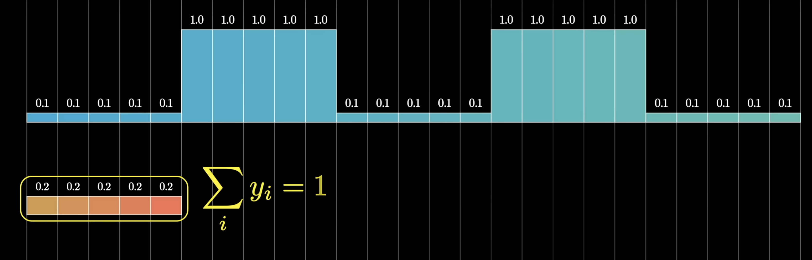

In this case, there is a small list of 5 values that are all equal to 1/5. When applying the sliding window convolution process, and ignoring what happens at the very beginning, once the smaller list of values entirely overlaps with the larger one, each term in this convolution has a clear meaning.

At each iteration, the process multiplies each of the values from the data by 1/5 and adds them all together, which means taking an average of the data inside this small window. 

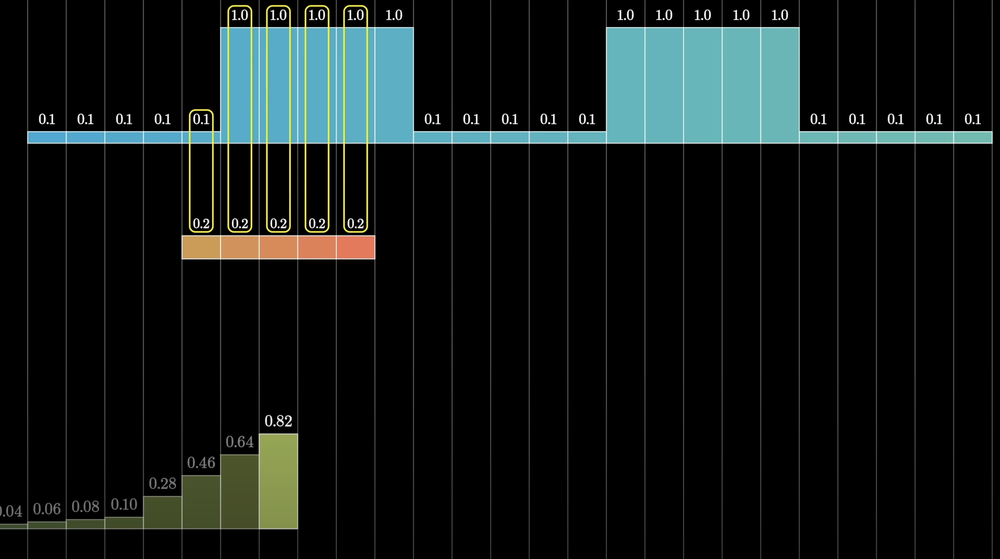
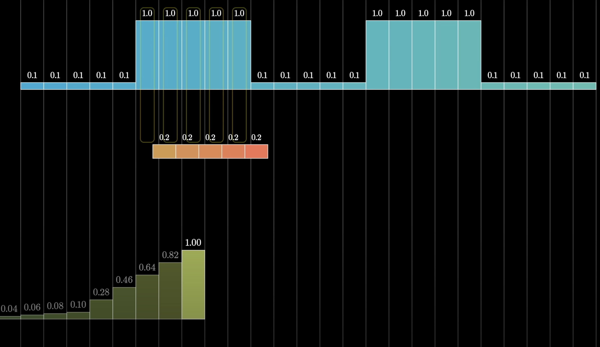

Overall, the process produces a smoothed version of the original data. 

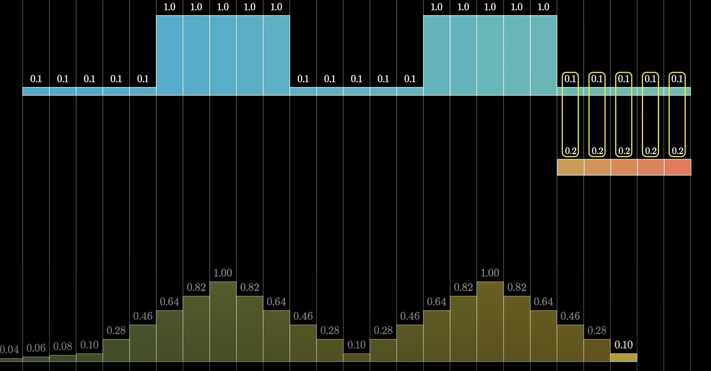

This can be modified by starting with a different small list of numbers, and as long as that small list adds up to 1, it can still be interpreted as a moving average.

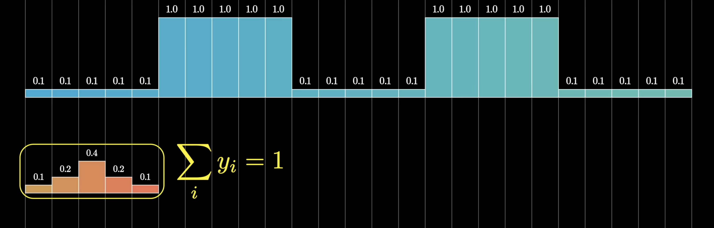

In the example shown here, that moving average would give more weight towards the central value. This also results in a smoothed version of the data.

## Image Processing

A two-dimensional analog of convolution provides an algorithm for blurring images. 

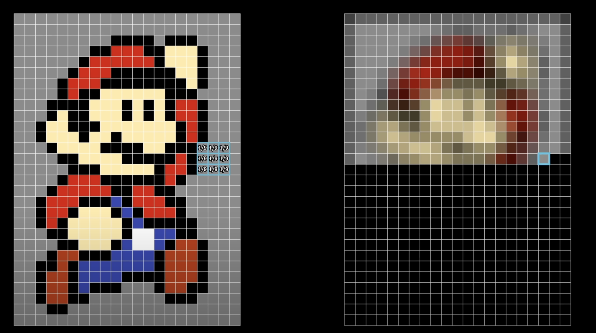

A small 3×3 grid of values marches along the original image. When zooming in, each value is 1/9, and at each iteration, each value is multiplied by the corresponding pixel it sits on top of. 

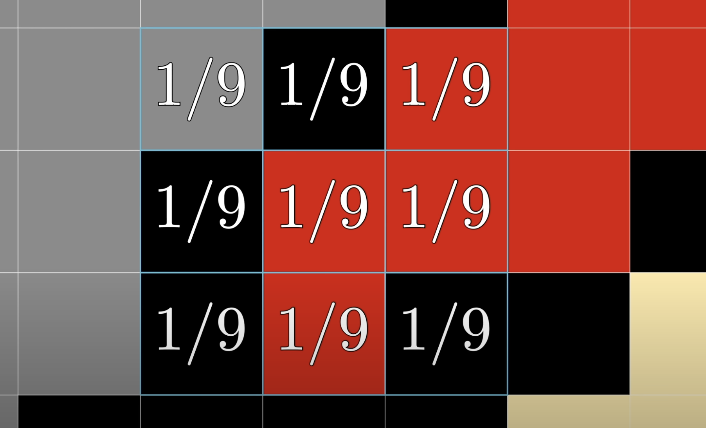

In computer science, colors are represented as vectors of three values representing the red, green, and blue components. When multiplying all these values by 1/9 and adding them together, the result is an average along each color channel, and the corresponding pixel for the image on the right is defined to be that sum. 

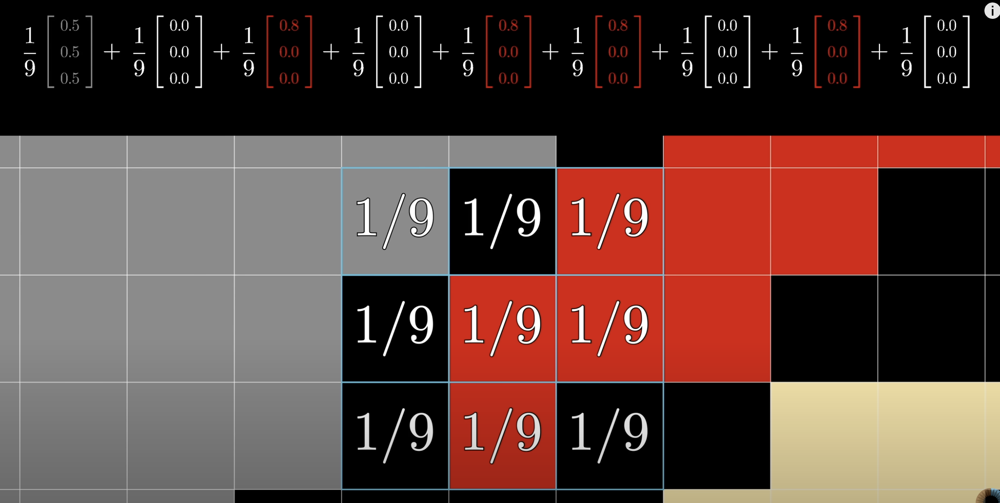

The overall effect, as this process is applied to every single pixel on the image, is that each pixel bleeds into all of its neighbors, creating a blurrier version than the original.

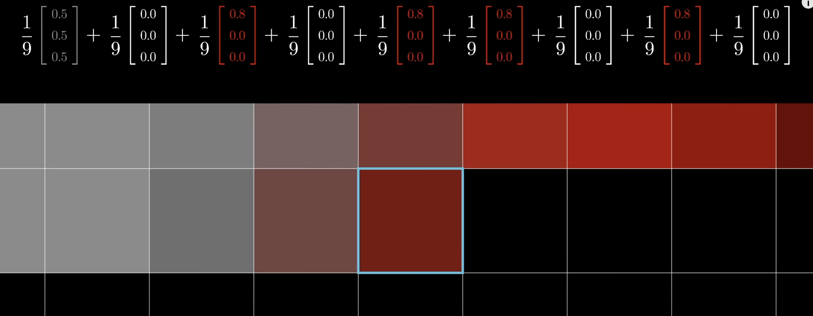

In technical terms, the image on the right is a convolution of the original image with a small grid of values. More precisely, it is the convolution with a 180-degree rotated version of that small grid of values. While this distinction does not matter when the grid is symmetric, it is worth noting that the definition of convolution, as inherited from the pure mathematics context, always involves flipping around the second array.

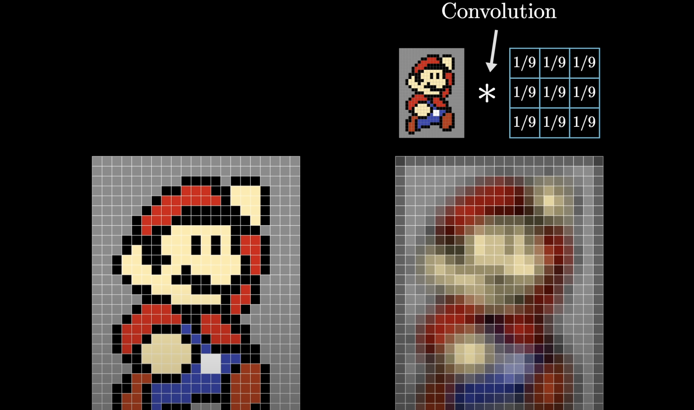

Blurring is far from the only application of this concept. Consider a small grid of values that involves some positive numbers on the left and some negative numbers on the right, colored blue and red respectively. Take a moment to predict what effect this will have on the final image.

In this case, the image is considered grayscale instead of colored, so each pixel is represented by one number instead of three.

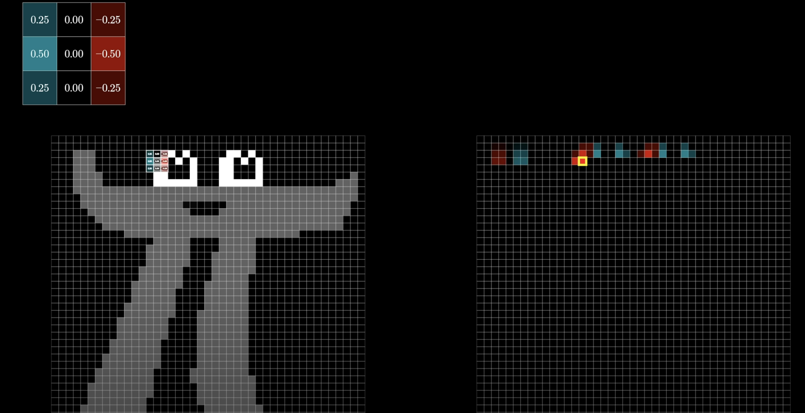

One thing worth noticing is that as this convolution is performed, negative values can result. For example, at a certain point, if zooming in, the left half of the small grid sits entirely on top of black pixels, which have a value of zero, but the right half of negative values all sit on top of white pixels, which have a value of one. 

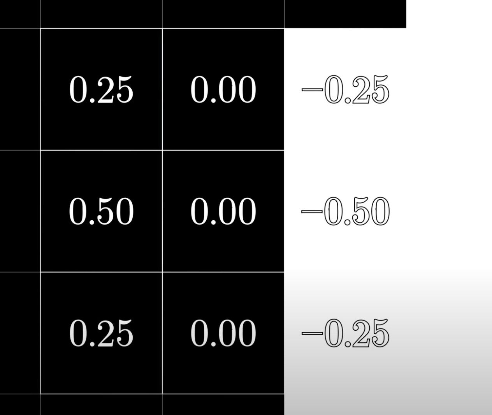

When multiplying corresponding terms and adding them together, the results will be very negative. The way this is displayed in the image on the right is to color negative values red and positive values blue.

Another thing to notice is that when on a patch that is all the same color, everything goes to zero, since the sum of the values in the small grid is zero. This is very different from the previous example where the sum of the small grid was one, which allowed interpretation as a moving average and hence a blur.

Overall, this process basically detects wherever there is variation in the pixel value as one moves from left to right, providing a way to pick up on all the vertical edges in the image.

This smaller grid is often called a kernel, and the beauty lies in how just by choosing a different kernel, different image processing effects can be achieved— not just blurring or edge detection, but also things like sharpening. 

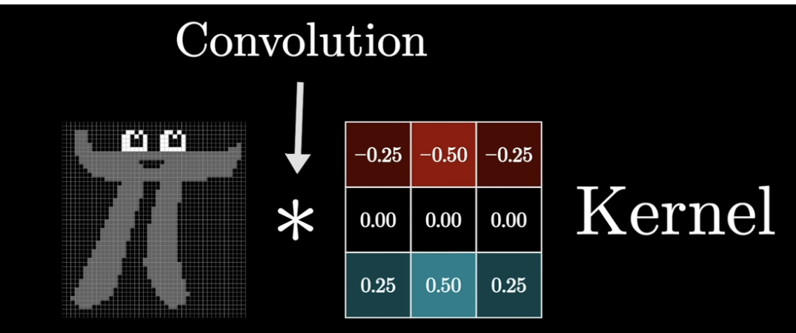

For those familiar with convolutional neural networks, the idea is to use data to determine what the kernels should be in the first place, as determined by whatever the neural network wants to detect.

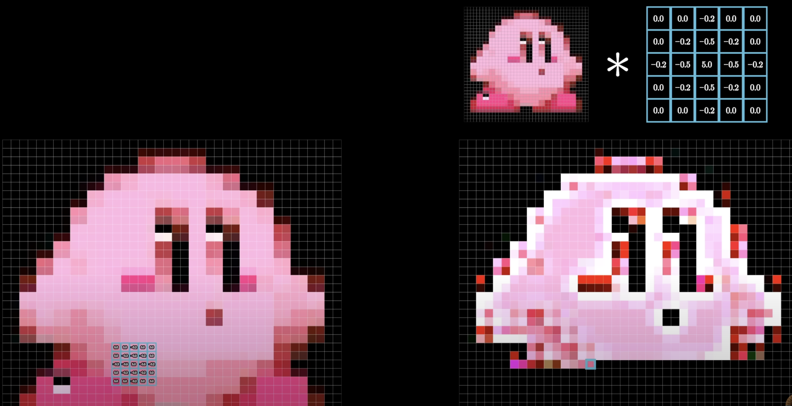

Convolutions as a pure mathematical operation always produce an array that is bigger than the two arrays that are started with, at least assuming one of them does not have a length of one. In certain computer science contexts, it is often desirable to deliberately truncate that output.

Another thing worth highlighting is that in the computer science context, the notion of flipping around the kernel before letting it march across the original often feels unusual and unnecessary, but again, note that this is inherited from the pure mathematics context, where, as seen with the probabilities, it is an incredibly natural thing to do.

## Polynomial Multiplication
